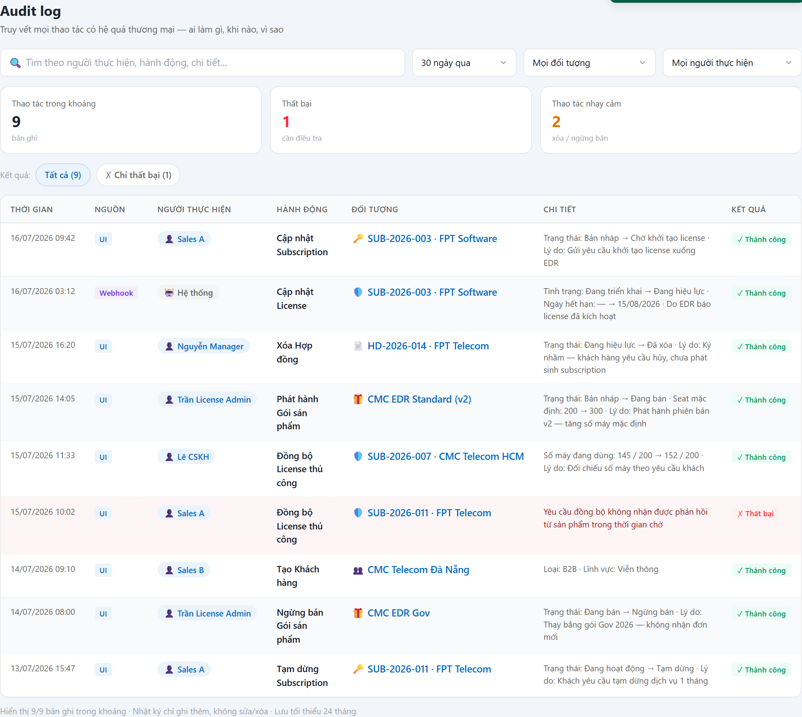

# UC-AUD-01 — Tra cứu Audit log

> Module: M-08 Audit & Notification | Phiên bản: 1.0 | Ngày: 17/07/2026
> Trạng thái: Draft for Review

---

## 1. Thông tin chung

| Thuộc tính | Nội dung |
|---|---|
| **Mã Use Case** | UC-AUD-01 |
| **Tên** | Tra cứu Audit log |
| **Mô tả** | Màn **điều tra liên-đối-tượng** cho toàn hệ thống: truy vết *ai — làm gì — khi nào — trên đối tượng nào — thay đổi ra sao — kết quả*. Phục vụ **tranh chấp KH**, **kiểm toán nội bộ**, **điều tra sự cố**. Khác với tab Audit Log cấp entity (chỉ xem 1 hồ sơ) — màn này lọc xuyên mọi đối tượng theo người thực hiện / thời gian / nội dung. |
| **Tác nhân** | License Admin · Manager · Auditor *(chỉ đọc)* |
| **Tiền điều kiện** | Đã đăng nhập; có quyền `audit:view`. Các thao tác thương mại đã được ghi Audit log qua thư viện nội bộ (FR-AUD-01). |
| **Hậu điều kiện** | Chỉ đọc — không thay đổi dữ liệu. Bản thân việc tra cứu **không** ghi thêm bản ghi nghiệp vụ. |
| **Trigger** | Bấm menu **Audit log** (nhóm Hệ thống). |
| **Liên kết** | UC-CUS-03/CON-03/SUB-03 (tab Audit cấp entity — cùng nguồn dữ liệu, lọc theo `entity_id`), [`_audit_action_catalog.md`](_audit_action_catalog.md) *(chuẩn hoá cột Hành động — đang ở thư mục `frs/`)*, UC-SET-* (mọi thay đổi cấu hình đều ghi vào đây). |

### Business Rules

| Mã | Nội dung | Lý do / Ghi chú |
|---|---|---|
| **BR-01** | **Phân quyền**: chỉ `audit:view` — **License Admin · Manager · Auditor**. Sales / CSKH **không thấy menu**; gọi thẳng API → **403**. | Nhân viên không được xem toàn bộ hành động của người khác (PRD FR-AUD-02 BR-02.1). |
| **BR-02** | **Chỉ ghi thêm (append-only), không sửa/xoá.** Bản ghi bất biến; lưu tối thiểu **24 tháng**. | Điểm bù cho Model A của Catalog (không có bảng lịch sử version-active first-class) — thiếu audit thì không trả lời được "ai ngừng bán gói này, lúc nào" (PRD C5, BR-CAT-07.3, FR-AUD-01 BR-01.1/01.4). |
| **BR-03** | **Lọc theo khoảng thời gian** là bộ lọc chính: preset *Hôm nay · 7 · 30 · 90 ngày · Tất cả*. Mặc định **30 ngày qua**. | Use case chính là theo mốc thời gian (US-03 "mọi action Sales 30 ngày"); PRD FR-AUD-02 input có `time_range`. |
| **BR-04** | **Lọc kết hợp trong khoảng**: theo **Đối tượng** (loại), theo **Người thực hiện** (chọn từ danh sách có tìm kiếm), và **tìm nội dung** (người thực hiện / hành động / chi tiết). | PRD FR-AUD-02 filter (entity_type, actor_id, action) + search reason. |
| **BR-05** | **Chi tiết thay đổi (before → after) hiển thị gộp trong cột "Chi tiết"** dạng `Trường: giá trị cũ → giá trị mới · Lý do: …`, diff render **tại view-time**. | Thống nhất với tab Audit cấp entity (Customer/Contract) đã có — trước/sau vốn để trong "chi tiết" (quyết định BA 17/07). PRD lưu `before`/`after` tách trường (§5.3.14) — xem **OQ-A1**. |
| **BR-06** | **Cột Hành động dùng vocabulary chuẩn** `<Động từ> <Đối tượng>` theo `_audit_action_catalog.md` (vd *Cập nhật Subscription*, *Xóa Hợp đồng*). Không phô mã enum / event code / status code. | Chống trôi dạt chuỗi hành động mỗi module một kiểu; i18n-ready (label suy ra từ `action_code`). |
| **BR-07** | **Người thực hiện phân biệt Người vs Hệ thống** bằng icon (👤 / 🤖) + **Nguồn** (UI / Webhook / …). Vai trò chỉ hiện khi tên chưa chứa sẵn (tránh trùng "Sales A / Sales"). | Trả lời "ai chịu trách nhiệm"; hành động do product báo về (webhook) ≠ do người CRM chủ động (YT-3). |
| **BR-08** | **KPI tổng quan theo khoảng**: *Thao tác trong khoảng · Thất bại · Thao tác nhạy cảm (Xóa / Ngừng bán)*. Tính trên tập đã lọc thời gian, trước khi lọc chi tiết. | Trả lời nhanh; nổi bật sự cố (Thất bại) và thao tác rủi ro (Xóa) theo mức độ ưu tiên. |
| **BR-09** | **Hiệu năng**: P95 ≤ **1s** với **50M** bản ghi; index theo `(entity_type, entity_id)`, `actor_id`, `created_at`. | PRD FR-AUD-02 BR-02.2/02.3. |
| **BR-10** | **PII được mask** trong `before`/`after` khi ghi (FR-AUD-01 BR-01.3) — màn tra cứu hiển thị đúng bản đã mask, không giải mask. | Bảo vệ dữ liệu cá nhân KH; tách khỏi retention audit ≥ 24 tháng (PRD §NFR). |

> ⚠️ **Không thuộc UC này** *(defer)*: **Kiểm tra toàn vẹn chuỗi hash** (FR-AUD-03) — đã **bỏ khỏi demo v2.8**. Tamper detection / verify hash chain sẽ đặc tả sau khi có UI (xem **OQ-A2**).

---

## 2. Luồng nghiệp vụ

*(Sơ đồ BPMN sẽ bổ sung — `UC-AUD-01_bpmn.png`)*

### 2.1 Luồng chính

| Bước | Actor | Hành động / Phản hồi |
|---|---|---|
| **1** | Người dùng | Mở menu **Audit log**. |
| **2** | System | **[Gateway — Có quyền `audit:view`?]**<br>→ **[Có]**: tiếp bước 3.<br>→ **[Không]**: sang EF-01. |
| **3** | System | Lọc theo **khoảng thời gian mặc định (30 ngày)** (BR-03); tính **KPI** trên tập trong khoảng (BR-08); **sắp theo thời gian giảm dần — mới nhất trên cùng** (đảm bảo bằng code, không dựa thứ tự lưu); render bảng đầy đủ 7 cột — **cột Chi tiết (before → after + lý do) hiển thị sẵn trong cột** (BR-05) — + sticky header. |
| **4** | Người dùng | **[Gateway — Thao tác?]**<br>→ Thu hẹp / lọc / tìm / chip **"Chỉ thất bại"**: sang **AF-01**.<br>→ Bấm liên kết **Đối tượng**: **End 2** (mở màn hồ sơ liên quan).<br>→ Không thao tác: **End 1**. |

> **Không có tương tác bấm-dòng-để-mở-chi-tiết** — bảng phẳng, before → after + lý do luôn hiển thị sẵn trong cột Chi tiết.

### 2.2 Luồng phụ

**[AF-01: Thu hẹp & lọc lại]** — tại bước 4.

| Bước | Actor | Hành động / Phản hồi |
|---|---|---|
| **4a** | Người dùng | Đổi khoảng thời gian / chọn Đối tượng / chọn Người thực hiện (gõ tìm) / gõ nội dung / chip **"Chỉ thất bại"** (BR-03/04). |
| **4b** | System | Cập nhật **chỉ phần kết quả + KPI** (giữ focus ô tìm), hiển thị `x/y bản ghi`. Nếu **không có bản ghi khớp** → empty-state (icon + gợi ý *"mở rộng khoảng thời gian hoặc bỏ bớt điều kiện lọc"*). |
| → | — | Quay lại bước 4. |

### 2.3 Luồng ngoại lệ

**[EF-01: Không có quyền]** — tại bước 2.

| Bước | Actor | Hành động / Phản hồi |
|---|---|---|
| **EF-01a** | System | Menu **Audit log** hiển thị nhưng nội dung là màn **"Không có quyền"** với Sales/CSKH *(để minh hoạ phân quyền qua role-switcher)*; API → **403**. |
| → | — | **End 3**. |

### 2.4 Điểm kết thúc

| End | Mô tả |
|---|---|
| **End 1** | Ở lại màn điều tra. |
| **End 2** | Sang màn hồ sơ đối tượng (KH / HĐ / Subscription / Gói / License) qua liên kết chéo. |
| **End 3** | Từ chối — không đủ quyền. |

---

## 3. Mô tả giao diện

Demo: `v2.8.0_audit_notification.html`, menu **Audit log** *(`auditRender` → `auditRenderSearch` / `audApplyFilter`)*.



```
┌─ Audit log ──────────────────────────────────────────────────────────────┐
│ [🔍 Tìm người thực hiện, hành động, chi tiết] [30 ngày qua▾][Đối tượng▾][Người▾][✕]│
│ ┌ Thao tác trong khoảng ┐ ┌ Thất bại ┐ ┌ Thao tác nhạy cảm ┐               │
│ │        9 bản ghi       │ │    1     │ │   2  xóa/ngừng bán │               │
│ Kết quả: (Tất cả 9) (✗ Chỉ thất bại 1)                                     │
│ ┌────────────────────────────────────────────────────────────────────────┐│
│ │THỜI GIAN │NGUỒN│NGƯỜI THỰC HIỆN│HÀNH ĐỘNG      │ĐỐI TƯỢNG     │CHI TIẾT│KẾT QUẢ││
│ │16/07 09:42│ UI │👤 Sales A     │Cập nhật Subsc.│🔑 SUB-2026-003│Trạng… →│✓ OK  ││
│ │16/07 03:12│Webhk│🤖 Hệ thống   │Cập nhật License│🛡️ SUB-2026-003│Tình… →│✓ OK  ││
│ └────────────────────────────────────────────────────────────────────────┘│
│ Hiển thị 9/9 · Nhật ký chỉ ghi thêm, không sửa/xóa · Lưu tối thiểu 24 tháng │
└───────────────────────────────────────────────────────────────────────────┘
```

### 3.1 Các thành phần

| # | Thành phần | Loại | Mô tả |
|---|---|---|---|
| 1 | Ô tìm nội dung | Search | Lọc theo người thực hiện / hành động / chi tiết (không mất focus khi gõ). |
| 2 | Khoảng thời gian | Danh sách chọn | Preset Hôm nay/7/30/90 ngày/Tất cả (BR-03). |
| 3 | Đối tượng | Danh sách chọn | Lọc theo loại đối tượng có trong dữ liệu. |
| 4 | Người thực hiện | Danh sách chọn có tìm kiếm | Danh sách người + icon 👤/🤖 + vai trò; có ô tìm theo tên bên trong (BR-07). |
| 5 | KPI strip | Cards | 3 ô tổng quan theo khoảng (BR-08). |
| 6 | Chip "Chỉ thất bại" | Toggle | Soi nhanh sự cố. |
| 7 | Bảng audit | Table (sticky header) | 7 cột; dòng Thất bại tô nền đỏ nhạt; liên kết chéo ở cột Đối tượng. |

### 3.2 Các cột hiển thị

| # | Cột | Nguồn dữ liệu | Ghi chú |
|---|---|---|---|
| 1 | Thời gian | `created_at` | |
| 2 | Nguồn | *(metadata)* | UI / Webhook / … — **chưa có trong schema §5.3.14** (OQ-A1) |
| 3 | Người thực hiện | `actor_id` + `actor_role` | icon 👤/🤖; vai trò ẩn nếu tên đã chứa (BR-07) |
| 4 | Hành động | `action_code` → label | vocabulary chuẩn (BR-06) |
| 5 | Đối tượng | `entity_type` + `entity_id` | icon theo loại; liên kết chéo |
| 6 | Chi tiết | `before`/`after`/`reason` gộp | diff view-time (BR-05) |
| 7 | Kết quả | *(metadata)* | ✓/✗ — **chưa có trong schema §5.3.14** (OQ-A1) |

---

## 4. Acceptance Criteria

### Nhóm 1: Lọc & điều tra *(giá trị cốt lõi)*

| Mã | Given | When | Then |
|---|---|---|---|
| AC-AUD-01-01 | Có bản ghi trải nhiều ngày. | Mở màn. | Mặc định lọc **30 ngày qua**; KPI + bảng phản ánh đúng khoảng (BR-03, BR-08). |
| AC-AUD-01-02 | Auditor cần mọi action của Sales A trong 30 ngày. | Chọn *30 ngày* + chọn *Sales A* ở danh sách chọn người thực hiện. | Bảng chỉ còn các dòng của Sales A trong khoảng; đếm `x/y` đúng (US-03, BR-04). |
| AC-AUD-01-03 | Manager tra tranh chấp 1 subscription. | Gõ mã sub vào ô tìm hoặc chọn Đối tượng = Subscription. | Thấy các thao tác liên quan; **before → after + lý do hiển thị sẵn trong cột Chi tiết** (không cần bấm mở) (US-02, BR-05). |
| AC-AUD-01-04 | Trong khoảng có 1 thao tác **Thất bại**. | Bấm chip *"Chỉ thất bại"*. | Chỉ còn dòng Thất bại (nền đỏ nhạt); KPI *Thất bại* = 1 (BR-08). |
| AC-AUD-01-05 | Gõ liên tục vào ô tìm. | Nhập nhiều ký tự. | Chỉ vùng kết quả cập nhật, **không mất focus** ô tìm. |
| AC-AUD-01-06 | Bộ lọc không khớp gì. | Lọc quá hẹp. | Hiện empty-state gợi ý mở rộng khoảng/bỏ điều kiện (AF-01). |

### Nhóm 2: Hiển thị chuẩn

| Mã | Given | When | Then |
|---|---|---|---|
| AC-AUD-01-07 | Dòng do webhook sinh (product báo license active). | Mở màn. | Người thực hiện = **🤖 Hệ thống**, Nguồn = **Webhook**, **không** hiện vai trò trùng; Hành động dùng label chuẩn (BR-06, BR-07). |
| AC-AUD-01-08 | Cùng mã `SUB-2026-003` xuất hiện ở dòng *Cập nhật Subscription* và *Cập nhật License*. | Mở màn. | Hai dòng phân biệt bằng **Hành động + icon đối tượng** (🔑 vs 🛡️); không cần cột "Loại" phụ. |
| AC-AUD-01-09 | Bảng dài hơn màn. | Cuộn danh sách. | Header cột **dính (sticky)**, luôn thấy tên cột. |

### Nhóm 3: Phân quyền & bất biến

| Mã | Given | When | Then |
|---|---|---|---|
| AC-AUD-01-10 | **Sales** đăng nhập / role-switch sang Sales. | Mở Audit log. | Màn **"Không có quyền"**; API → **403** (BR-01, EF-01). |
| AC-AUD-01-11 | **Auditor** đăng nhập. | Mở màn. | Xem đầy đủ; **không** có bất kỳ nút sửa/xoá bản ghi audit (BR-02). |
| AC-AUD-01-12 | Một bản ghi audit đã tồn tại. | Thử sửa/xoá qua mọi đường. | Bị chặn (append-only, ràng buộc DB) (BR-02). |

---

## 5. Review Checklist

### Lịch sử thay đổi

| Phiên bản | Ngày | Tác giả | Mô tả |
|---|---|---|---|
| 1.0 | 17/07/2026 | Claude (AI) | Khởi tạo từ **demo v2.8 đã chốt** + PRD §6.8.3 (FR-AUD-02). Ghi các quyết định: (a) before/after **gộp vào cột Chi tiết** cho khớp tab entity (BR-05); (b) cột **Nguồn/Kết quả** đang **vượt schema §5.3.14** → OQ-A1; (c) **bỏ FR-AUD-03** (verify hash) khỏi phạm vi (đã gỡ khỏi demo) → OQ-A2; (d) Hành động dùng **vocabulary chuẩn** theo `_audit_action_catalog.md`. |
| 1.1 | 17/07/2026 | Claude (AI) | Nhúng **ảnh chụp màn thật** từ demo v2.8 vào §3 (`UC-AUD-01_screen_search.png`). Đối chiếu ảnh: khớp đủ 7 cột, KPI, chip *Chỉ thất bại*, icon 👤/🤖, dòng thất bại tô đỏ, Hành động đã chuẩn hoá, đã bỏ nhãn "Loại" thừa. |
| 1.2 | 17/07/2026 | Claude (AI) | **Sửa luồng §2 + AC + prompt BPMN theo review**: gỡ nhánh **"bấm 1 dòng để xem chi tiết"** (hư cấu — demo bảng phẳng, Chi tiết before→after hiển thị sẵn, `<tr>` không onclick); mô hình **lọc/tìm thành AF-01 loop-back** từ gateway "Thao tác?" (theo pattern UC-CAT-03) thay vì bước tuyến tính — bổ sung đường thao tác ngay sau lần tải mặc định. |

### Nghiệp vụ
- ✅ Lọc thời gian là bộ lọc chính; KPI trả lời nhanh; diff before→after phục vụ tranh chấp
- ✅ Phân biệt người/hệ thống, dùng ngôn ngữ nghiệp vụ (không phô hash/SHA256/event code)
- ✅ Append-only, retention ≥ 24 tháng — bằng chứng bất biến
- ⚠️ **OQ-A1**: cột **Nguồn** (UI/Webhook) và **Kết quả** (✓/✗) chưa có trong schema `AUDIT_LOG` §5.3.14 — cần **bổ sung vào `metadata`** hoặc chuẩn hoá lại schema. Đồng thời chốt: lưu tách `before`/`after` (schema) nhưng **hiển thị gộp** (UI) — đã theo hướng này.
- ⚠️ **OQ-A2**: **FR-AUD-03 (kiểm tra toàn vẹn chuỗi hash)** chưa có UI/UC — defer; khi làm cần bổ sung màn verify + cảnh báo tamper P1.
- ⚠️ **OQ-A3**: có ghi audit cho hành động **chỉ đọc** (vd *Rà soát Subscription*) không, hay chỉ ghi khi thay đổi dữ liệu? *(chuyển từ `_audit_action_catalog.md`)*

---

## Footer

| Mục | Nội dung |
|---|---|
| **Giao diện** | ✅ Có demo — `v2.8.0_audit_notification.html`, menu "Audit log" |
| **UC liên quan** | UC-NOT-01/02/03, UC-SET-01/02/03, UC-CUS-03, UC-CON-03, UC-SUB-03 |
| **Trace PRD** | OneCRM_PRD §6.8.2 (FR-AUD-01), §6.8.3 (FR-AUD-02), §5.3.14 (AUDIT_LOG) |
