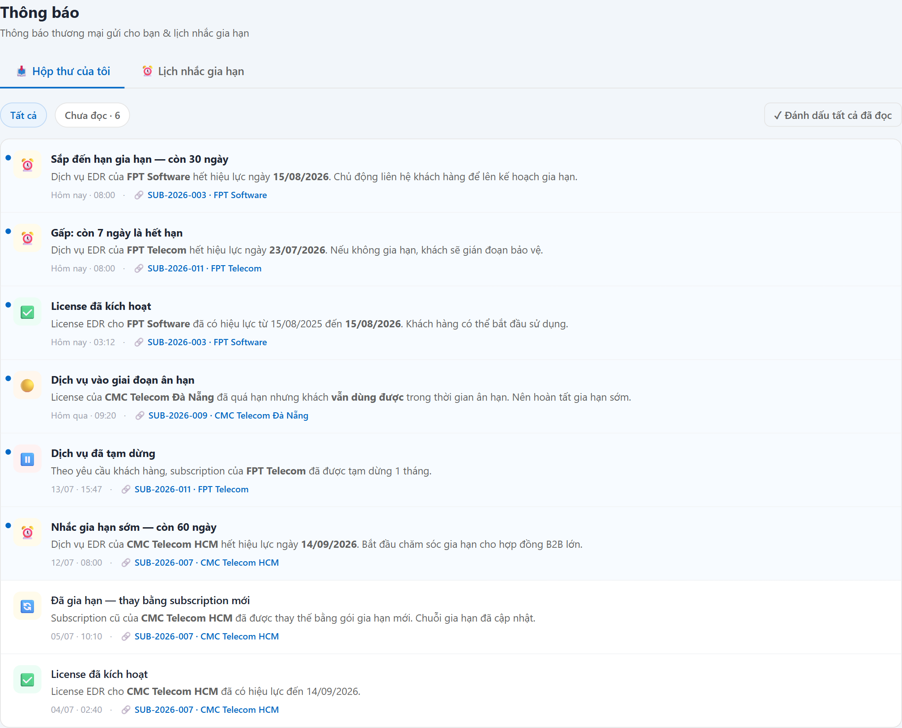

# UC-NOT-01 — Hộp thư & thông báo trong ứng dụng

> Module: M-08 Audit & Notification | Phiên bản: 1.0 | Ngày: 17/07/2026
> Trạng thái: Draft for Review

---

## 1. Thông tin chung

| Thuộc tính | Nội dung |
|---|---|
| **Mã Use Case** | UC-NOT-01 |
| **Tên** | Hộp thư & thông báo trong ứng dụng |
| **Mô tả** | Nơi mỗi người dùng **nhận & đọc** thông báo **thương mại** liên quan tới mình (gia hạn, kích hoạt, tạm dừng, ân hạn…). Gồm **chuông** (bảng xổ xem nhanh trên thanh trên cùng) và **Hộp thư của tôi** (danh sách đầy đủ, đánh dấu đã đọc). Chuyển từ mô hình "kéo" (phải mở màn mới thấy) sang **"đẩy" chủ động**. |
| **Tác nhân** | Mọi người dùng *(xem thông báo của **chính mình**)* |
| **Tiền điều kiện** | Đã đăng nhập. Có module nghiệp vụ đã gửi thông báo qua thư viện nội bộ (FR-NOT-01). |
| **Hậu điều kiện** | (Success) Thông báo được đọc; trạng thái `read` cập nhật. Không sinh dữ liệu nghiệp vụ. |
| **Trigger** | (1) Bấm **chuông 🔔** trên thanh trên cùng. (2) Mở menu **Thông báo** → tab **Hộp thư của tôi**. |
| **Liên kết** | UC-NOT-02 (lịch nhắc gia hạn sinh ra phần lớn thông báo này), UC-NOT-03 (lịch sử gửi — góc nhìn Admin), UC-SUB-03 / UC-LIC-02 (liên kết chéo tới đối tượng). |

### Business Rules

| Mã | Nội dung | Lý do / Ghi chú |
|---|---|---|
| **BR-01** | **Chỉ thông báo thương mại.** Gia hạn, kích hoạt, tạm dừng/khôi phục, ân hạn… **Không** gửi thông báo vận hành (credentials, cảnh báo kỹ thuật — product tự lo). | Ranh giới observer (YT-3; PRD phân định notification commercial ✓ / operational ✗). |
| **BR-02** | **Người dùng chỉ thấy thông báo của mình.** Danh sách lọc theo **vai trò người nhận** của từng thông báo. | PRD FR-NOT-03 BR-03.1 (user own). |
| **BR-03** | **Người nhận theo loại sự kiện** — do điểm phát thông báo quyết định. Vd nhắc gia hạn theo mốc: 60d Sales+Manager … 1d tất cả (xem UC-NOT-02 BR). | Đúng người, đúng việc; không spam vai trò không liên quan. |
| **BR-04** | **License Admin / Auditor không nhận thông báo thương mại** → hộp thư & chuông của họ **rỗng** (đúng thiết kế). Muốn nắm toàn cảnh đã gửi gì → dùng **UC-NOT-03 (Lịch sử gửi)**. | Hai vai trò này quản trị/kiểm toán, không phải người chăm sóc thương mại. Empty-state phải **giải thích rõ**, không để trơ. |
| **BR-05** | **Đánh dấu đã đọc**: từng thông báo (bấm vào) hoặc **đọc tất cả**. Badge số **chưa đọc** hiển thị ở menu Thông báo và chấm đỏ trên chuông, đồng bộ realtime với hành động đọc. | PRD FR-NOT-03 BR-03.3 (in-app mark as read). |
| **BR-06** | **Retention 90 ngày** cho lịch sử thông báo in-app *(khác retention audit ≥ 24 tháng)*. | PRD FR-NOT-03 BR-03.2. |
| **BR-07** | Mỗi thông báo có **liên kết chéo** tới đối tượng liên quan (Subscription / License…). Bấm link → mở màn hồ sơ; hành động này **đánh dấu đã đọc**. | Trả lời "rồi sao nữa" — dẫn thẳng tới nơi xử lý. |
| **BR-08** | **Chuông = xem nhanh**: bảng xổ liệt kê tối đa vài thông báo gần nhất của vai trò hiện tại + "Đọc hết" + **"Xem tất cả →"** (mở Hộp thư đầy đủ). Đóng khi bấm ra ngoài. | Không bắt rời màn đang làm để liếc thông báo. |

---

## 2. Luồng nghiệp vụ

*(Sơ đồ BPMN sẽ bổ sung — `UC-NOT-01_bpmn.png`)*

### 2.1 Luồng chính

| Bước | Actor | Hành động / Phản hồi |
|---|---|---|
| **1** | Người dùng | Bấm **chuông 🔔** (bảng xổ) **HOẶC** mở menu **Thông báo → tab Hộp thư của tôi**. |
| **2** | System | Lọc thông báo theo **VAI TRÒ** người nhận của người dùng hiện tại (theo vai trò, **không** theo số lượng — BR-02/03). **[Gateway — Vai trò có nhận thông báo thương mại?]** → **[Không]** (License Admin / Auditor): sang **AF-02**. → **[Có]**: tiếp bước 3. |
| **3** | System | Render danh sách (chuông: vài mục gần nhất; hộp thư: đầy đủ); chấm xanh = chưa đọc; badge số chưa đọc (BR-05, BR-08). |
| **4** | Người dùng | **[Gateway — Thao tác?]** → Bấm 1 thông báo: **AF-01**. → "Đánh dấu tất cả đã đọc" (bảng xổ chuông là nút "Đọc hết"): tiếp bước 5. → "Xem tất cả →" (chỉ ở bảng xổ chuông): **End 2** (mở Hộp thư đầy đủ). → Không thao tác: **End 1** (ở lại). |
| **5** | System | Đánh dấu **tất cả** thông báo là đã đọc; cập nhật badge chưa đọc + tắt chấm đỏ chuông (BR-05) → **quay bước 4**. |

### 2.2 Luồng phụ

**[AF-01: Mở 1 thông báo]** — tại bước 4.

| Bước | Actor | Hành động / Phản hồi |
|---|---|---|
| **4a** | System | Đánh dấu thông báo **đã đọc**; cập nhật badge chưa đọc (BR-05). |
| **4b** | Người dùng | **[Gateway — Bấm liên kết đối tượng?]** → **[Có]**: **End 3** (mở màn hồ sơ đối tượng liên quan — BR-07). → **[Không]**: quay bước 4. |

**[AF-02: Vai trò không nhận thông báo thương mại]** — tại bước 2.

| Bước | Actor | Hành động / Phản hồi |
|---|---|---|
| **2a** | System | Hiện **empty-state giải thích**: vai trò này không nhận thông báo thương mại; xem toàn cảnh ở **Lịch sử gửi**; gợi ý đổi vai trò (demo) để xem hộp thư nhận (BR-04) → **End 4**. |

### 2.3 Điểm kết thúc

| End | Mô tả |
|---|---|
| **End 1** | Ở lại (đã đọc / không thao tác). |
| **End 2** | Mở Hộp thư đầy đủ — "Xem tất cả →" từ chuông. |
| **End 3** | Mở màn hồ sơ đối tượng liên quan — bấm liên kết. |
| **End 4** | Empty-state theo vai trò — AF-02 (Admin/Auditor không nhận thông báo thương mại). |

> **Ghi chú scope:** chip lọc *Tất cả / Chưa đọc* (hộp thư) là **view-toggle** (mô tả ở §3.1), không mô hình thành bước process — nhất quán với BPMN.

---

## 3. Mô tả giao diện

Demo: `v2.8.0_audit_notification.html` — chuông (`bellToggle`/`bellRender`), menu **Thông báo** tab **Hộp thư của tôi** (`notifRenderInbox`).

### 3.1 Các thành phần

| # | Thành phần | Loại | Mô tả |
|---|---|---|---|
| 1 | Chuông + chấm đỏ | Icon + badge | Chấm đỏ = có chưa đọc (BR-05); bấm xổ bảng (BR-08). |
| 2 | Bảng xổ chuông | Popover | Danh sách gần nhất + "Đọc hết" + "Xem tất cả →"; đóng khi bấm ngoài. |
| 3 | Chip Tất cả / Chưa đọc | Toggle | Lọc hộp thư. |
| 4 | Nút "Đánh dấu tất cả đã đọc" | Button | Chỉ hiện khi còn chưa đọc. |
| 5 | Thông báo (item) | List item | Icon theo loại (⏰ nhắc · ✅ kích hoạt · 🟡 ân hạn · ⏸️ tạm dừng); tiêu đề; nội dung; thời gian; **liên kết đối tượng** (BR-07); chấm xanh nếu chưa đọc. |
| 6 | Empty-state | Panel | Giải thích theo vai trò (BR-04). |

---

## 4. Acceptance Criteria

### Nhóm 1: Nhận & đọc

| Mã | Given | When | Then |
|---|---|---|---|
| AC-NOT-01-01 | **Sales** có thông báo chưa đọc. | Đăng nhập. | Chuông có **chấm đỏ**; menu Thông báo có badge số chưa đọc (BR-05). |
| AC-NOT-01-02 | Sales mở chuông. | Bấm 🔔. | Bảng xổ liệt kê thông báo gần nhất của Sales; chưa đọc có chấm xanh (BR-08). |
| AC-NOT-01-03 | Có 1 thông báo chưa đọc. | Bấm vào nó. | Chuyển **đã đọc**; badge/chấm đỏ giảm tương ứng (BR-05). |
| AC-NOT-01-04 | Còn nhiều chưa đọc. | Bấm "Đọc hết" / "Đánh dấu tất cả đã đọc". | Tất cả thành đã đọc; chấm đỏ tắt (BR-05). |
| AC-NOT-01-05 | Thông báo gắn 1 subscription. | Bấm liên kết đối tượng. | Mở màn subscription tương ứng; thông báo được đánh dấu đã đọc (BR-07). |

### Nhóm 2: Ranh giới & phân vai

| Mã | Given | When | Then |
|---|---|---|---|
| AC-NOT-01-06 | **License Admin** đăng nhập. | Mở Hộp thư / chuông. | **Rỗng**, kèm empty-state giải thích + trỏ sang **Lịch sử gửi** (BR-04). |
| AC-NOT-01-07 | Nhắc gia hạn mốc 30 ngày (người nhận: Sales). | Manager mở hộp thư. | Manager **không** thấy thông báo mốc 30 ngày (chỉ người nhận đúng vai trò thấy) (BR-02, BR-03). |
| AC-NOT-01-08 | Có sự kiện vận hành (credentials) phía product. | Kiểm tra hộp thư mọi vai trò. | **Không** thông báo vận hành nào xuất hiện trong hộp thư thương mại (BR-01, YT-3). |

---

## 5. Review Checklist

### Lịch sử thay đổi

| Phiên bản | Ngày | Tác giả | Mô tả |
|---|---|---|---|
| 1.0 | 17/07/2026 | Claude (AI) | Khởi tạo từ demo v2.8 + PRD §6.8.5/6.8.7 (FR-NOT-01/03). Bổ sung **chuông (bảng xổ xem nhanh)** (không có trong PRD gốc — đề xuất UX) và **empty-state theo vai trò** cho License Admin/Auditor (làm rõ hộp thư rỗng là đúng thiết kế, không phải lỗi). |
| 1.1 | 17/07/2026 | Claude (AI) | Nhúng **ảnh chụp màn thật** từ demo v2.8 vào §3 (`UC-NOT-01_screen_inbox.png`, chụp ở vai trò Sales để có dữ liệu). Đối chiếu ảnh: khớp tab, chip *Tất cả/Chưa đọc·6*, icon từng loại (⏰✅🟡⏸️🔄), liên kết đối tượng, chấm chưa đọc. |
| 1.2 | 17/07/2026 | Claude (AI) | **Đồng bộ §2 theo BPMN đã review**: gộp 2 luồng "chuông/hộp thư" thành **1 luồng chính** (bước 1–5) khớp prompt; thay "nếu rỗng → thông điệp" (count-based) bằng **cổng theo VAI TRÒ** ở bước 2 (sửa latent bug); "Xem tất cả" → **End 2**; tách **AF-01** thành 4a/4b (có cổng "bấm liên kết?"); bổ sung **§2.3 Điểm kết thúc (End 1–4)**. Numbering FRS↔BPMN nay map 1:1. |

### Nghiệp vụ
- ✅ Chỉ thông báo thương mại (YT-3); người dùng chỉ thấy của mình; retention 90 ngày
- ✅ Chuông xem nhanh + hộp thư đầy đủ + liên kết chéo tới nơi xử lý
- ✅ Empty-state giải thích rõ vì sao Admin/Auditor không có thông báo
- ⚠️ **OQ-N1**: cho phép người dùng **tuỳ chọn kênh nhận** (preference) — PRD ghi Phase 2+ (FR-NOT-01 BR-01.5). Chưa trong phạm vi.

---

## Footer

| Mục | Nội dung |
|---|---|
| **Giao diện** | ✅ Có demo — `v2.8.0_audit_notification.html`, chuông + tab "Hộp thư của tôi" |
| **UC liên quan** | UC-NOT-02, UC-NOT-03, UC-SUB-03, UC-LIC-02 |
| **Trace PRD** | OneCRM_PRD §6.8.5 (FR-NOT-01), §6.8.7 (FR-NOT-03) |
