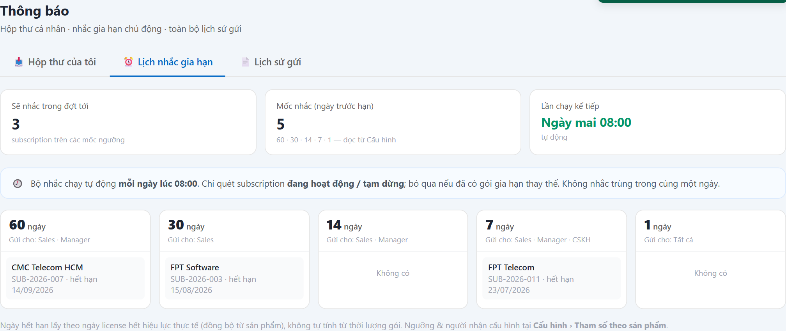

# UC-NOT-02 — Lịch nhắc gia hạn tự động

> Module: M-08 Audit & Notification | Phiên bản: 1.0 | Ngày: 17/07/2026
> Trạng thái: Draft for Review

---

## 1. Thông tin chung

| Thuộc tính | Nội dung |
|---|---|
| **Mã Use Case** | UC-NOT-02 |
| **Tên** | Lịch nhắc gia hạn tự động |
| **Mô tả** | Cron **quét subscription sắp hết hạn** theo các **mốc ngày** (60/30/14/7/1) và gửi **nhắc gia hạn chủ động** tới đúng người theo từng mốc. Giải bài toán **bỏ lỡ gia hạn = mất doanh thu + gián đoạn KH** cho hợp đồng B2B chu kỳ dài. Màn hình cho người dùng **xem lịch nhắc** (sẽ nhắc ai, mốc nào, lần chạy kế tiếp). |
| **Tác nhân** | **System** *(cron 08:00 hằng ngày — người gửi)*; Sales / Manager / CSKH / License Admin *(xem lịch)* |
| **Tiền điều kiện** | Có subscription trạng thái **ACTIVE / SUSPENDED** với `end_date` đã đồng bộ từ license (webhook `license.active`). Ngưỡng nhắc cấu hình theo sản phẩm (UC-SET-02). |
| **Hậu điều kiện** | (Success) Gửi nhắc gia hạn tới đúng người nhận theo mốc; không nhắc trùng trong cùng ngày. |
| **Trigger** | (1) Cron **08:00 hằng ngày** (gửi). (2) Người dùng mở menu **Thông báo** → tab **Lịch nhắc gia hạn** (xem). |
| **Liên kết** | UC-NOT-01 (thông báo sinh ra vào hộp thư), UC-SET-02 (cấu hình mốc + người nhận), UC-SUB-07 (gia hạn), UC-LIC-02 (ngày hết hạn thực). |

### Business Rules

| Mã | Nội dung | Lý do / Ghi chú |
|---|---|---|
| **BR-01** | **Chạy tự động 08:00 mỗi ngày**, quét subscription **ACTIVE / SUSPENDED** có `end_date − hôm nay` **rơi đúng mốc** trong danh sách ngưỡng. | PRD FR-NOT-04 BR-04.1/04.2. |
| **BR-02** | **`end_date` = ngày license hết hiệu lực thực** (đồng bộ từ `license.active`), **KHÔNG** tự tính `start + duration`. | Điểm dễ nhầm của OneCRM — license active thủ công sau UAT nên ngày lệch (PRD Date Model, BR-04.2). |
| **BR-03** | **Không quét sub `PENDING_PROVISION`** (chưa active). | Chưa có `end_date` thực → nhắc sẽ sai ngày (BR-04.2). |
| **BR-04** | **Mốc nhắc cấu hình theo từng sản phẩm** — không hardcode. Vd EDR = `[60, 30, 14, 7, 1]`. Đọc từ `runtime_config.notification_thresholds_days` (UC-SET-02). | PRD FR-NOT-04 BR-04.3. |
| **BR-05** | **Người nhận theo mốc**: 60d → Sales + Manager · 30d → Sales · 14d → Sales + Manager · 7d → Sales + Manager + CSKH · 1d → tất cả. | PRD FR-NOT-04 BR-04.5 — càng cận hạn càng nhiều người biết. |
| **BR-06** | **Idempotent**: một sub **không nhắc trùng** cùng một mốc trong cùng ngày (chạy 2 lần/ngày vẫn chỉ 1 nhắc). | PRD FR-NOT-04 BR-04.4 / AC-04.3. |
| **BR-07** | **Bỏ qua nếu đã có gói gia hạn kế tiếp (successor) ACTIVE**, hoặc sub ở trạng thái **terminal**. | Đã gia hạn thì không nhắc nữa (BR-04.6/04.7). |
| **BR-08** | **Màn xem lịch** hiển thị theo **bucket mốc** (60/30/14/7/1): mỗi mốc liệt kê sub sắp tới, **người nhận của mốc** (đọc từ cấu hình), tổng "sẽ nhắc đợt tới", "lần chạy kế tiếp". Ngưỡng & người nhận **không hardcode trên UI** — dẫn tới **Cấu hình › Tham số theo sản phẩm**. | Quy tắc UI #6 (ngưỡng đọc từ cấu hình). |

---

## 2. Luồng nghiệp vụ

*(Sơ đồ BPMN sẽ bổ sung — `UC-NOT-02_bpmn.png`)*

### 2.1 Luồng chính — cron gửi nhắc *(LẶP cho từng subscription)*

| Bước | Actor | Hành động / Phản hồi |
|---|---|---|
| **1** | System (cron 08:00) | Quét & lấy **danh sách** sub **ACTIVE/SUSPENDED** (bỏ PENDING_PROVISION — BR-03). |
| **2** | System | **[Gateway — Còn sub trong danh sách chưa xử lý?]**<br>→ **[Không]**: kết thúc — **Hoàn tất đợt nhắc**.<br>→ **[Có]**: tiếp bước 3. |
| **3** | System | Lấy sub kế; tính `end_date − hôm nay` (`end_date` theo license hết hiệu lực thực — BR-02). |
| **4** | System | **[Gateway — Rơi đúng mốc nhắc?]**<br>→ **[Không]**: bỏ qua sub này → **quay bước 2**.<br>→ **[Có]**: tiếp bước 5. |
| **5** | System | **[Gateway — Đã có successor ACTIVE / sub terminal?]**<br>→ **[Có]**: bỏ qua → **quay bước 2** (BR-07).<br>→ **[Không]**: tiếp bước 6. |
| **6** | System | **[Gateway — Đã nhắc mốc này hôm nay chưa?]**<br>→ **[Rồi]**: bỏ qua → **quay bước 2** (idempotent — BR-06).<br>→ **[Chưa]**: tiếp bước 7. |
| **7** | System | Xác định **người nhận theo mốc** (BR-05); gửi nhắc gia hạn qua thư viện thông báo (FR-NOT-01) → vào hộp thư (UC-NOT-01) → **quay bước 2** (xét sub kế). |

### 2.2 Luồng chính — người dùng xem lịch

| Bước | Actor | Hành động / Phản hồi |
|---|---|---|
| **A1** | Người dùng | Mở tab **Lịch nhắc gia hạn**. |
| **A2** | System | Hiển thị 5 bucket mốc + sub trong từng mốc + người nhận (đọc cấu hình) + "lần chạy kế tiếp 08:00" (BR-08) → **End 2**. |

### 2.3 Điểm kết thúc

| End | Mô tả |
|---|---|
| **End 1** | Hoàn tất đợt nhắc — đã xử lý toàn bộ danh sách; đã gửi cho các sub đủ điều kiện (đúng người nhận theo mốc). |
| **End 2** | Xem lịch nhắc (ở lại màn) — người dùng mở tab. |

> **Lưu ý:** "bỏ qua subscription" (không rơi mốc / đã có gói gia hạn / đã nhắc hôm nay) là **loop-back về bước 2**, KHÔNG phải điểm kết thúc.

---

## 3. Mô tả giao diện

Demo: `v2.8.0_audit_notification.html`, tab **Lịch nhắc gia hạn** (`notifRenderSched`).



```
Sẽ nhắc đợt tới: 3 | Mốc: 60·30·14·7·1 (đọc từ Cấu hình) | Lần chạy kế: Ngày mai 08:00
🕗 Bộ nhắc chạy 08:00 mỗi ngày · chỉ sub ACTIVE/SUSPENDED · bỏ qua nếu đã có gói gia hạn thay thế
┌ 60 ngày ┐┌ 30 ngày ┐┌ 14 ngày ┐┌ 7 ngày ┐┌ 1 ngày ┐
│Sales·Mgr││ Sales   ││Sales·Mgr││S·M·CSKH││ Tất cả │
│CMC HCM  ││FPT Soft ││ (không) ││FPT Tel ││(không) │
└─────────┘└─────────┘└─────────┘└────────┘└────────┘
Ngày hết hạn lấy theo license hết hiệu lực thực · Ngưỡng & người nhận cấu hình tại Cấu hình › Tham số
```

### 3.1 Các thành phần

| # | Thành phần | Loại | Mô tả |
|---|---|---|---|
| 1 | KPI strip | Cards | Sẽ nhắc đợt tới · số mốc · lần chạy kế tiếp. |
| 2 | Bucket mốc | Column cards | 60/30/14/7/1; đầu thẻ ghi **người nhận của mốc** (BR-05); thân liệt kê sub + ngày hết hạn. |
| 3 | Ghi chú | Text | end_date theo license thực (BR-02); trỏ sang Cấu hình cho ngưỡng/người nhận (BR-08). |

---

## 4. Acceptance Criteria

| Mã | Given | When | Then |
|---|---|---|---|
| AC-NOT-02-01 | Sub ACTIVE, `end_date` sau **30 ngày**, người nhận mốc 30d = Sales. | Cron chạy 08:00. | **Sales** nhận nhắc gia hạn (AC-04.1, BR-05). |
| AC-NOT-02-02 | Sub đã có **successor ACTIVE**. | Cron chạy. | **Không** gửi nhắc (BR-07 / AC-04.2). |
| AC-NOT-02-03 | Cron chạy **2 lần** trong ngày. | Chạy lại. | Sub **không** nhận nhắc trùng cùng mốc (BR-06 / AC-04.3). |
| AC-NOT-02-04 | Sub ở trạng thái **terminal**. | Cron chạy. | **Không** nhận nhắc (BR-07 / AC-04.4). |
| AC-NOT-02-05 | Sub **PENDING_PROVISION** (chưa active). | Cron chạy. | **Không** bị quét/nhắc (BR-03). |
| AC-NOT-02-06 | Mốc 7 ngày. | Cron chạy trúng mốc. | Người nhận = **Sales + Manager + CSKH** (BR-05). |
| AC-NOT-02-07 | Đổi cấu hình mốc EDR từ `[60,30,14,7,1]` sang `[30,7]`. | Xem tab Lịch nhắc. | Chỉ còn bucket **30** và **7**; **không sửa code** (BR-04, BR-08). |
| AC-NOT-02-08 | Mở tab Lịch nhắc. | Xem. | Mỗi bucket hiển thị **đúng người nhận đọc từ cấu hình**, không hardcode; có "lần chạy kế 08:00" (BR-08). |

---

## 5. Review Checklist

### Lịch sử thay đổi

| Phiên bản | Ngày | Tác giả | Mô tả |
|---|---|---|---|
| 1.0 | 17/07/2026 | Claude (AI) | Khởi tạo từ demo v2.8 + PRD §6.8.8 (FR-NOT-04). Nhấn mạnh `end_date` lấy từ license thực (BR-02) và ngưỡng/người nhận đọc từ cấu hình (BR-04/08, liên kết UC-SET-02). |
| 1.1 | 17/07/2026 | Claude (AI) | Nhúng **ảnh chụp màn thật** từ demo v2.8 vào §3 (`UC-NOT-02_screen_scheduler.png`). Đối chiếu ảnh: khớp KPI (Sẽ nhắc 3 · 5 mốc · Ngày mai 08:00), 5 bucket 60/30/14/7/1 với người nhận theo mốc, banner quy tắc chạy. |
| 1.2 | 17/07/2026 | Claude (AI) | **Sửa luồng §2.1 + prompt BPMN theo review**: chuyển cron từ 1 lượt tuyến tính (mỗi sub một End) sang **mô hình vòng lặp** — thêm cổng "Còn sub chưa xử lý?"; 3 nhánh "bỏ qua" và nhánh "đã gửi" **loop về** cổng đó; cron chỉ **kết thúc 1 lần** (Hoàn tất đợt) khi hết danh sách. Còn 2 End (Hoàn tất · Xem lịch); bổ sung **§2.3 Điểm kết thúc (End 1–2)**. Sửa nhãn AF-01 "System-triggered" → user-triggered. |

### Nghiệp vụ
- ✅ Nhắc chủ động (đẩy) thay cho mô hình kéo; đúng người theo mốc; idempotent
- ✅ `end_date` từ license thực, không tự tính; bỏ qua sub chưa active để không nhắc sai ngày
- ✅ Ngưỡng & người nhận cấu hình theo sản phẩm, không hardcode
- ⚠️ **OQ-N2**: khi 1 KH có nhiều sub cùng mốc — gộp 1 mail tổng hợp hay tách từng sub? *(chưa chốt)*

---

## Footer

| Mục | Nội dung |
|---|---|
| **Giao diện** | ✅ Có demo — `v2.8.0_audit_notification.html`, tab "Lịch nhắc gia hạn" |
| **UC liên quan** | UC-NOT-01, UC-NOT-03, UC-SET-02, UC-SUB-07, UC-LIC-02 |
| **Trace PRD** | OneCRM_PRD §6.8.8 (FR-NOT-04) |
