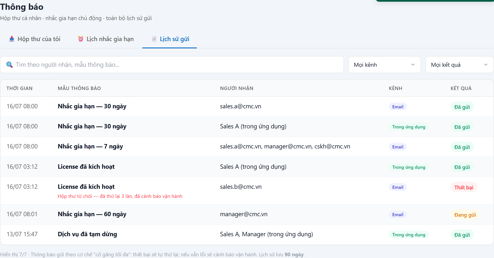

# UC-NOT-03 — Lịch sử gửi thông báo

> Module: M-08 Audit & Notification | Phiên bản: 1.0 | Ngày: 17/07/2026
> Trạng thái: Draft for Review

---

## 1. Thông tin chung

| Thuộc tính | Nội dung |
|---|---|
| **Mã Use Case** | UC-NOT-03 |
| **Tên** | Lịch sử gửi thông báo |
| **Mô tả** | Góc nhìn **toàn cục cho Admin**: mọi thông báo hệ thống **đã gửi** (mọi kênh, mọi người nhận), kèm **kết quả gửi** (đã gửi / đang gửi / thất bại). Dùng để **giám sát độ ổn định gửi**, điều tra "vì sao KH không nhận được mail", và đối soát khi có khiếu nại. |
| **Tác nhân** | **License Admin** *(xem tất cả)* |
| **Tiền điều kiện** | Đã đăng nhập; có quyền quản trị thông báo. Có thông báo đã được gửi qua thư viện nội bộ (FR-NOT-01). |
| **Hậu điều kiện** | Chỉ đọc — không thay đổi dữ liệu. |
| **Trigger** | Menu **Thông báo** → tab **Lịch sử gửi** *(chỉ hiện với License Admin)*. |
| **Liên kết** | UC-NOT-01 (góc nhìn người nhận), UC-NOT-02 (nguồn sinh phần lớn bản ghi), UC-SET-01 (mẫu thông báo). |

### Business Rules

| Mã | Nội dung | Lý do / Ghi chú |
|---|---|---|
| **BR-01** | **Chỉ Admin xem tất cả.** Người dùng thường chỉ xem thông báo của mình (UC-NOT-01); phi-admin lọc "tất cả" → **403**. Tab **chỉ hiển thị với License Admin**. | PRD FR-NOT-03 BR-03.1 / AC-03.3. |
| **BR-02** | **Lọc & tìm kiếm**: tìm theo **người nhận / mẫu thông báo**; lọc theo **Kênh** (Email / Trong ứng dụng); lọc theo **Kết quả** (Đã gửi / Đang gửi / Thất bại). | PRD FR-NOT-03 input filter (channel, time_range, pagination) — bổ sung tìm người nhận/mẫu cho điều tra khiếu nại. |
| **BR-03** | **Cơ chế gửi "cố gắng tối đa" (best-effort)**: qua hàng đợi (RabbitMQ topic `crm.notifications`), worker async, **retry lũy thừa tối đa 3 lần**; vẫn lỗi → trạng thái **Thất bại** + **cảnh báo vận hành (P2)**. | PRD FR-NOT-01 BR-01.2/01.3/01.4. Notification là best-effort (không bắt buộc qua Outbox như business event). |
| **BR-04** | **Retention 90 ngày** cho lịch sử gửi. | PRD FR-NOT-03 BR-03.2 *(đồng bộ với retention in-app)*. |
| **BR-05** | Mỗi dòng: **thời gian · mẫu thông báo · người nhận · kênh · kết quả**; dòng **Thất bại** kèm **ghi chú lý do** (vd hộp thư từ chối) ngay trong bảng. | Điều tra nhanh mà không phải mở từng bản ghi. |
| **BR-06** | **Không hiển thị nội dung PII nhạy cảm** ngoài mức cần để đối soát (email người nhận là chấp nhận được cho Admin). | Cân bằng điều tra vs riêng tư. |

---

## 2. Luồng nghiệp vụ

*(Sơ đồ BPMN sẽ bổ sung — `UC-NOT-03_bpmn.png`)*

### 2.1 Luồng chính

| Bước | Actor | Hành động / Phản hồi |
|---|---|---|
| **1** | License Admin | Mở menu **Thông báo** → tab **Lịch sử gửi**. |
| **2** | System | **[Gateway — Là License Admin?]**<br>→ **[Có]**: tiếp bước 3.<br>→ **[Không]**: sang **EF-01**. |
| **3** | System | Render toàn bộ lịch sử gửi (mọi kênh, mọi người nhận) + thanh lọc: tìm người nhận/mẫu, lọc Kênh, lọc Kết quả (BR-02). |
| **4** | License Admin | **[Gateway — Thao tác?]**<br>→ Tìm / lọc (người nhận/mẫu · Kênh · Kết quả): **AF-01**.<br>→ Không thao tác: **End 1** (ở lại). |

### 2.2 Luồng phụ

**[AF-01: Tìm & lọc lịch sử gửi]** — tại bước 4.

| Bước | Actor | Hành động / Phản hồi |
|---|---|---|
| **4a** | License Admin | Tìm theo người nhận/mẫu; lọc Kênh (Email / Trong ứng dụng); lọc Kết quả (Đã gửi / Đang gửi / Thất bại) (BR-02). |
| **4b** | System | Cập nhật **chỉ phần kết quả** (giữ focus ô tìm); hiển thị `x/y`; dòng Thất bại kèm lý do (BR-05) → **quay bước 4**. |

### 2.3 Luồng ngoại lệ

**[EF-01: Phi-admin truy cập]** — tại bước 2.

| Bước | Actor | Hành động / Phản hồi |
|---|---|---|
| **EF-01a** | System | Tab "Lịch sử gửi" **không hiển thị** với vai trò không phải License Admin; gọi thẳng API "xem tất cả" → **403** (BR-01) → **End 2**. |

### 2.4 Điểm kết thúc

| End | Mô tả |
|---|---|
| **End 1** | Ở lại màn (xem / lọc lịch sử gửi). |
| **End 2** | Từ chối (403) — EF-01, phi-admin truy cập. |

---

## 3. Mô tả giao diện

Demo: `v2.8.0_audit_notification.html`, tab **Lịch sử gửi** (`notifRenderHist` / `notifHistApply`).



```
[🔍 Tìm người nhận, mẫu thông báo] [Mọi kênh▾] [Mọi kết quả▾] [✕]
┌ THỜI GIAN │ MẪU THÔNG BÁO        │ NGƯỜI NHẬN            │ KÊNH   │ KẾT QUẢ ┐
│ 16/07 08:00│ Nhắc gia hạn — 30 ngày│ sales.a@cmc.vn        │ Email  │ Đã gửi  │
│ 16/07 03:12│ License đã kích hoạt  │ sales.b@cmc.vn        │ Email  │ Thất bại│
│            │  ↳ Hộp thư từ chối — đã thử lại 3 lần, đã cảnh báo vận hành      │
└────────────────────────────────────────────────────────────────────────────┘
Hiển thị 7/7 · best-effort: thất bại tự thử lại, vẫn lỗi thì cảnh báo vận hành · lưu 90 ngày
```

### 3.1 Các thành phần

| # | Thành phần | Loại | Mô tả |
|---|---|---|---|
| 1 | Ô tìm | Search | Người nhận / mẫu (BR-02), highlight kết quả, không mất focus. |
| 2 | Lọc Kênh | Danh sách chọn | Mọi kênh / Email / Trong ứng dụng. |
| 3 | Lọc Kết quả | Danh sách chọn | Mọi kết quả / Đã gửi / Đang gửi / Thất bại. |
| 4 | Bảng lịch sử | Table | 5 cột; dòng Thất bại kèm lý do (BR-05); đếm `x/y`. |

### 3.2 Trạng thái gửi

| Trạng thái | Nhãn | Ý nghĩa |
|---|---|---|
| SENT | Đã gửi | Gửi thành công. |
| QUEUED | Đang gửi | Đang trong hàng đợi/worker. |
| FAILED | Thất bại | Hết 3 lần thử vẫn lỗi → cảnh báo vận hành P2 (BR-03). |

---

## 4. Acceptance Criteria

| Mã | Given | When | Then |
|---|---|---|---|
| AC-NOT-03-01 | **License Admin** đăng nhập. | Mở tab Lịch sử gửi. | Thấy **toàn bộ** thông báo đã gửi mọi kênh/người nhận (BR-01). |
| AC-NOT-03-02 | **Sales/Manager** đăng nhập. | — | **Không thấy** tab Lịch sử gửi; API "xem tất cả" → **403** (BR-01, EF-01). |
| AC-NOT-03-03 | Có bản ghi Email và In-app. | Lọc Kênh = **Email**. | Chỉ còn dòng kênh Email; đếm `x/y` đúng (BR-02). |
| AC-NOT-03-04 | Có 1 bản ghi **Thất bại**. | Lọc Kết quả = **Thất bại**. | Chỉ còn dòng Thất bại, kèm **lý do** (BR-02, BR-05). |
| AC-NOT-03-05 | Gõ tên/email vào ô tìm. | Nhập liên tục. | Chỉ vùng kết quả cập nhật, **không mất focus**; highlight khớp. |
| AC-NOT-03-06 | Email gửi lỗi. | Worker xử lý. | Tự **thử lại tối đa 3 lần**; vẫn lỗi → **Thất bại** + cảnh báo vận hành P2 (BR-03). |

---

## 5. Review Checklist

### Lịch sử thay đổi

| Phiên bản | Ngày | Tác giả | Mô tả |
|---|---|---|---|
| 1.0 | 17/07/2026 | Claude (AI) | Khởi tạo từ demo v2.8 + PRD §6.8.5/6.8.7 (FR-NOT-01/03). Bổ sung **filter Kênh/Kết quả + tìm người nhận/mẫu** (thiếu ở bản demo đầu, đã thêm 17/07); tách render toolbar/kết quả để không mất focus. |
| 1.1 | 17/07/2026 | Claude (AI) | Nhúng **ảnh chụp màn thật** từ demo v2.8 vào §3 (`UC-NOT-03_screen_history.png`). Đối chiếu ảnh: khớp thanh lọc (tìm · Mọi kênh · Mọi kết quả), bảng 5 cột, dòng **Thất bại** kèm lý do đỏ, badge kênh/kết quả, ghi chú best-effort + lưu 90 ngày. |
| 1.2 | 17/07/2026 | Claude (AI) | **Đồng bộ §2 theo BPMN**: thêm **gateway "Thao tác?"** (bước 4) + tách lọc/tìm thành **AF-01 loop-back** (4a/4b) thay vì bước tuyến tính; bổ sung **§2.4 Điểm kết thúc (End 1–2)**. Numbering FRS↔BPMN map 1:1. |

### Nghiệp vụ
- ✅ Admin giám sát toàn bộ gửi; lọc kênh/kết quả; điều tra khiếu nại "không nhận được mail"
- ✅ Cơ chế best-effort + retry + cảnh báo P2 khi thất bại được nêu rõ; retention 90 ngày
- ✅ Phân quyền: chỉ Admin xem tất cả; phi-admin 403
- ⚠️ **OQ-N3**: có cho **gửi lại thủ công** từ dòng Thất bại không, hay chỉ theo dõi? *(hiện chỉ theo dõi — gửi lại có thể trùng nếu retry vẫn chạy nền)*

---

## Footer

| Mục | Nội dung |
|---|---|
| **Giao diện** | ✅ Có demo — `v2.8.0_audit_notification.html`, tab "Lịch sử gửi" |
| **UC liên quan** | UC-NOT-01, UC-NOT-02, UC-SET-01 |
| **Trace PRD** | OneCRM_PRD §6.8.5 (FR-NOT-01), §6.8.7 (FR-NOT-03) |
