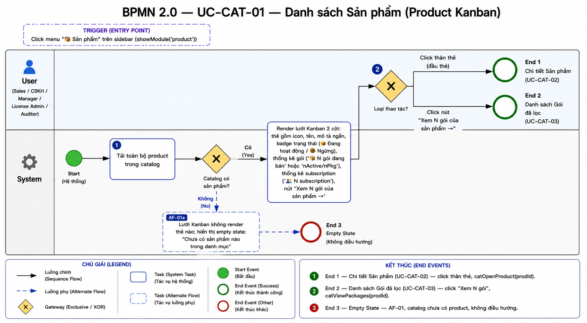
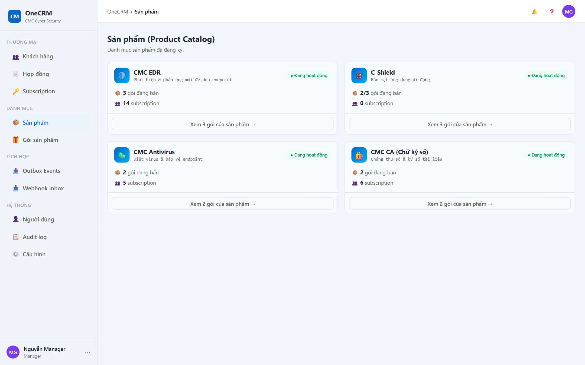

# UC-CAT-01 — Danh sách Sản phẩm (Product Kanban)

> Module: M-04 Product & Package Catalog | Phiên bản: 1.0 | Ngày: 10/07/2026
> Trạng thái: Draft for Review

---

## 1. Thông tin chung

| Thuộc tính | Nội dung |
|---|---|
| **Mã Use Case** | UC-CAT-01 |
| **Tên** | Danh sách Sản phẩm (Product Kanban) |
| **Mô tả** | Hiển thị danh mục sản phẩm đã đăng ký dưới dạng Kanban (lưới thẻ) — mỗi thẻ là 1 sản phẩm, bên trong tóm tắt số gói và số subscription. Đây là màn **read-only + điều hướng**: điểm vào trung tâm của module Product & Package Catalog. Product do Admin đăng ký 1 lần, **không** tạo/sửa/xóa product tại màn này. |
| **Tác nhân** | Sales, CSKH, Manager, License Admin, Auditor (tất cả chỉ xem) |
| **Tiền điều kiện** | Đã đăng nhập hệ thống; có quyền xem Catalog. |
| **Hậu điều kiện** | (Success) Hiển thị đầy đủ lưới Kanban sản phẩm; điều hướng đúng đích khi người dùng chọn thao tác. Không thay đổi dữ liệu (chỉ đọc). (Failure) Không tải được catalog → hiển thị trạng thái rỗng, ở lại màn. |
| **Trigger** | Người dùng click menu "📦 Sản phẩm" trên sidebar (`showModule('product')`). |
| **Liên kết** | UC-CAT-02 (Chi tiết Sản phẩm), UC-CAT-03 (Danh sách Gói sản phẩm) |

### Business Rules

| Mã | Nội dung |
|---|---|
| **BR-01** | Màn hình **read-only**: chỉ xem và điều hướng. Không có chức năng tạo / sửa / xóa product tại UI này. Product do Admin đăng ký 1 lần ở tầng Product Module (anchor YT-1: CRM là passive-observer — thêm sản phẩm = thêm Product Module, không CRUD ở màn Catalog). |
| **BR-02** | Mỗi sản phẩm hiển thị dưới dạng 1 thẻ (card) trong lưới Kanban `.cat-kanban` — grid 2 cột, responsive về 1 cột khi bề rộng màn hình ≤ 820px. |
| **BR-03** | Badge trạng thái trên thẻ: `status = ACTIVE` → "● Đang hoạt động"; `status = INACTIVE` → "● Ngừng". |
| **BR-04** | Số gói đang bán = số package có `status = ACTIVE` thuộc product (`nActive`). Nếu product có version ở trạng thái RETIRED/DRAFT (tức tổng số package `nPkg` > `nActive`) thì hiển thị dạng "{nActive}/{nPkg}"; ngược lại chỉ hiển thị `nActive`. |
| **BR-05** | Số subscription = số sub có `productId` trùng với product đó. |
| **BR-06** | Nút "Xem {N} gói của sản phẩm →" điều hướng sang module Gói sản phẩm (UC-CAT-03) đã **lọc sẵn** theo product tương ứng (`catViewPackages(prodId)`). {N} là tổng số gói (`nPkg`) của product. |
| **BR-07** | Click phần thân thẻ (đầu thẻ) → mở Chi tiết Sản phẩm (UC-CAT-02) qua `catOpenProduct(prodId)`. |
| **BR-08** | Dữ liệu seed gồm 4 sản phẩm, đều `status = ACTIVE`: CMC EDR (🛡️), C-Shield (📱), CMC Antivirus (🦠), CMC CA — Chữ ký số (🔏). |

---

## 2. Luồng nghiệp vụ



### 2.1 Luồng chính

> Đồng bộ theo ảnh BPMN đã chốt: badge **①** = task "Tải toàn bộ product", badge **②** = Gateway "Loại thao tác?". Gateway "Catalog có sản phẩm?" và task render lưới Kanban là bước hệ thống trung gian (không đánh badge riêng trong ảnh). Trigger (click menu "Sản phẩm") = điểm vào. Màn read-only + điều hướng, không có nhánh ghi dữ liệu.

| Bước | Tác nhân | Hành động / Phản hồi | Ghi chú |
|---|---|---|---|
| **1** | System | Start → **Tải toàn bộ product trong catalog**. | BR-08 |
| — | System | **[Gateway — Catalog có sản phẩm?]**<br>→ [Có]: render lưới Kanban, tiếp bước 2.<br>→ [Không]: **AF-01** (empty state → End 3). | — |
| — | System | Render lưới Kanban 2 cột. Mỗi thẻ: icon, tên, mô tả ngắn, badge trạng thái ("📦 Đang hoạt động" / "● Ngừng"), thống kê gói ("N gói đang bán" hoặc "nActive/nPkg"), thống kê subscription, nút "Xem N gói của sản phẩm →". | BR-02, BR-03, BR-04, BR-05 |
| **2** | User (Sales / CSKH / Manager / License Admin / Auditor) | **[Gateway — Loại thao tác?]** — fan nhánh:<br>• Click thân thẻ (đầu thẻ) → **End 1** (Chi tiết Sản phẩm — UC-CAT-02).<br>• Click nút "Xem N gói của sản phẩm →" → **End 2** (Danh sách Gói đã lọc — UC-CAT-03). | BR-06, BR-07 |

### 2.2 Luồng phụ

**[AF-01: Catalog rỗng (chưa có product)]** — kích hoạt tại **Gateway "Catalog có sản phẩm?"** (nhánh Không) khi catalog không có product nào.

| Bước | Tác nhân | Hành động / Phản hồi |
|---|---|---|
| **AF-01a** | System | Lưới Kanban không render thẻ nào; hiển thị empty state với thông báo "Chưa có sản phẩm nào trong danh mục". |
| → | — | **End 3 (Empty state)** — không điều hướng. |

> Ghi chú: dữ liệu seed luôn có 4 sản phẩm ACTIVE (BR-08), nên AF-01 chỉ xảy ra ở trạng thái catalog rỗng lý thuyết.

### 2.3 Luồng ngoại lệ

Màn hình read-only, không có thao tác ghi dữ liệu nên **không phát sinh luồng ngoại lệ (EF)**.

### 2.4 Điểm kết thúc (End Events)

| # | Tên | Điều kiện |
|---|---|---|
| **End 1** | Chi tiết Sản phẩm — điều hướng UC-CAT-02 | Click thân thẻ (bước 2, BR-07) → `catOpenProduct(prodId)` |
| **End 2** | Danh sách Gói (đã lọc) — điều hướng UC-CAT-03 | Click nút "Xem N gói của sản phẩm →" (bước 2, BR-06) → `catViewPackages(prodId)` |
| **End 3** | Empty state | **AF-01** — Gateway "Catalog có sản phẩm?" (Không), catalog chưa có product; không điều hướng |

---

## 3. Mô tả giao diện

### 3.1 Wireframe

```
┌──────────────────────────────────────────────────────────────┐
│ 📦 Sản phẩm (Product Catalog)                                 │
│ Danh mục sản phẩm đã đăng ký — mỗi thẻ là 1 sản phẩm, bên     │
│ trong liệt kê các gói. Click thẻ để xem chi tiết. Product do  │
│ Admin đăng ký 1 lần (read-only).                              │
├──────────────────────────────────────────────────────────────┤
│  ┌────────────────────────┐   ┌────────────────────────┐     │
│  │ 🛡️ CMC EDR    ● Đang..│   │ 📱 C-Shield   ● Đang.. │     │  ← click đầu thẻ
│  │ Mô tả ngắn sản phẩm     │   │ Mô tả ngắn sản phẩm     │     │    → UC-CAT-02
│  │ 📦 3 gói đang bán       │   │ 📦 2/3 gói đang bán     │     │
│  │ 👥 12 subscription      │   │ 👥 5 subscription       │     │
│  ├────────────────────────┤   ├────────────────────────┤     │
│  │ Xem 3 gói của sản phẩm →│   │ Xem 3 gói của sản phẩm →│     │  ← nút → UC-CAT-03
│  └────────────────────────┘   └────────────────────────┘        (lọc sẵn)
│  ┌────────────────────────┐   ┌────────────────────────┐     │
│  │ 🦠 CMC Antivirus  ● ..  │   │ 🔏 CMC CA — Chữ ký số  │     │
│  │ ...                     │   │ ...                     │     │
│  └────────────────────────┘   └────────────────────────┘     │
└──────────────────────────────────────────────────────────────┘
        (Grid 2 cột — responsive về 1 cột khi màn hình ≤ 820px)
```

> **Demo HTML:** [docs/demo/v2.5.0_catalog.html](../../demo/v2.5.0_catalog.html) — hàm `catRenderKanban()` (render lưới), `catOpenProduct(id)` (End 1), `catViewPackages(id)` (End 2).

**Screenshot — Danh sách Sản phẩm (Kanban):**



---

### 3.2 Các thành phần giao diện

| # | Thành phần | Loại | Mô tả |
|---|---|---|---|
| 1 | Page header — tiêu đề | Text | "Sản phẩm (Product Catalog)". |
| 2 | Page header — subtitle | Text | "Danh mục sản phẩm đã đăng ký — mỗi thẻ là 1 sản phẩm, bên trong liệt kê các gói. Click thẻ để xem chi tiết. Product do Admin đăng ký 1 lần (read-only)." |
| 3 | Breadcrumb | Text | Hiển thị "Sản phẩm". |
| 4 | Lưới Kanban `.cat-kanban` | Grid layout | Grid 2 cột, `gap` giữa các thẻ, `align-items: start`. Responsive về 1 cột khi bề rộng ≤ 820px (BR-02). |
| 5 | Thẻ sản phẩm (card) | Card | Mỗi thẻ = 1 product. Gồm phần đầu (click được → End 1) và nút cuối thẻ (→ End 2). |

#### Anatomy thẻ sản phẩm

| Vùng | Thành phần | Nguồn dữ liệu | Mô tả hiển thị | Hành vi |
|---|---|---|---|---|
| Đầu thẻ | Icon sản phẩm | `product.icon` | Emoji (🛡️ / 📱 / 🦠 / 🔏). | Click cả vùng đầu thẻ → `catOpenProduct(id)` (End 1). |
| Đầu thẻ | Tên sản phẩm | `product.name` | Text đậm. | — |
| Đầu thẻ | Mô tả ngắn | `product.description` | Text phụ (fallback về tên nếu rỗng). | — |
| Đầu thẻ | Badge trạng thái | `product.status` | ACTIVE → "● Đang hoạt động"; INACTIVE → "● Ngừng". | BR-03 |
| Đầu thẻ | Thống kê gói | package của product | "📦 {N} gói đang bán": nếu `nPkg > nActive` → "{nActive}/{nPkg}", ngược lại chỉ `nActive`. | BR-04 |
| Đầu thẻ | Thống kê subscription | sub theo `productId` | "👥 {N} subscription". | BR-05 |
| Cuối thẻ | Nút "Xem N gói của sản phẩm →" | tổng số gói `nPkg` | Ghost button, full-width. | Click → `catViewPackages(id)` sang UC-CAT-03 đã lọc sẵn theo product (End 2). BR-06 |

### 3.3 Trạng thái đặc biệt

| Trạng thái | Điều kiện | Hiển thị |
|---|---|---|
| Empty state | Catalog chưa có product (AF-01) | Lưới không render thẻ; thông báo "Chưa có sản phẩm nào trong danh mục". |
| Read-only | Luôn luôn (BR-01) | Không có nút tạo / sửa / xóa product trên toàn màn hình. |

---

## 4. Acceptance Criteria

### Nhóm 1: Hiển thị lưới Kanban

| Mã | Given | When | Then |
|---|---|---|---|
| AC-CAT-01-01 | Catalog có 4 sản phẩm seed (đều ACTIVE). | Mở màn hình "Sản phẩm". | Hiển thị lưới Kanban 2 cột với 4 thẻ: CMC EDR, C-Shield, CMC Antivirus, CMC CA. Breadcrumb "Sản phẩm". |
| AC-CAT-01-02 | Bề rộng màn hình ≤ 820px. | Xem lưới Kanban. | Lưới thu về 1 cột (responsive). |
| AC-CAT-01-03 | Product có `status = ACTIVE`. | Xem badge trạng thái trên thẻ. | Hiển thị "● Đang hoạt động". |
| AC-CAT-01-04 | Product có `status = INACTIVE`. | Xem badge trạng thái trên thẻ. | Hiển thị "● Ngừng". |

### Nhóm 2: Thống kê trên thẻ

| Mã | Given | When | Then |
|---|---|---|---|
| AC-CAT-01-05 | Product có tất cả gói đều ACTIVE (nPkg = nActive), ví dụ 3 gói. | Xem dòng thống kê gói. | Hiển thị "📦 3 gói đang bán" (chỉ số nActive). |
| AC-CAT-01-06 | Product có gói RETIRED/DRAFT (nPkg > nActive), ví dụ 2 active / 3 tổng. | Xem dòng thống kê gói. | Hiển thị "📦 2/3 gói đang bán". |
| AC-CAT-01-07 | Product có 12 sub trùng `productId`. | Xem dòng thống kê subscription. | Hiển thị "👥 12 subscription". |

### Nhóm 3: Điều hướng

| Mã | Given | When | Then |
|---|---|---|---|
| AC-CAT-01-08 | Người dùng đang xem lưới Kanban. | Click phần thân (đầu) thẻ CMC EDR. | Điều hướng sang Chi tiết Sản phẩm (UC-CAT-02) của CMC EDR. Kết thúc tại **End 1**. |
| AC-CAT-01-09 | Người dùng đang xem lưới Kanban. | Click nút "Xem N gói của sản phẩm →" trên thẻ C-Shield. | Điều hướng sang Danh sách Gói (UC-CAT-03) đã **lọc sẵn** theo C-Shield. Kết thúc tại **End 2**. |

### Nhóm 4: Read-only

| Mã | Given | When | Then |
|---|---|---|---|
| AC-CAT-01-10 | Người dùng thuộc bất kỳ vai trò nào (Sales / CSKH / Manager / License Admin / Auditor). | Quan sát toàn bộ màn hình. | Không xuất hiện nút tạo / sửa / xóa product. Chỉ có thao tác xem và điều hướng (BR-01). |
| AC-CAT-01-11 | Catalog không có product nào (AF-01). | Mở màn hình "Sản phẩm". | Lưới không render thẻ; hiển thị empty state "Chưa có sản phẩm nào trong danh mục". Kết thúc tại **End 3**. |

---

## 5. Lịch sử thay đổi

| Phiên bản | Ngày | Người cập nhật | Nội dung |
|---|---|---|---|
| 1.0 | 10/07/2026 | BA Team | Khởi tạo tài liệu — Draft for Review. Đặc tả màn Danh sách Sản phẩm (Product Kanban) theo demo v2.5.0 (demo-first). |
| 1.1 | 10/07/2026 | Claude (AI) | Nhúng ảnh BPMN + đồng bộ §2 theo ảnh đã chốt: thêm Gateway "Catalog có sản phẩm?", tách task Tải product (①) / Render lưới / Gateway "Loại thao tác" (②); cập nhật trigger AF-01 và điều kiện End 3. Gỡ ghi chú placeholder. |

### Review Checklist

> Claude tự review — đánh dấu ✅/❌ trước khi submit cho BA review.

#### Nghiệp vụ
- ✅ Luồng chính bao phủ happy path (render Kanban + gateway loại thao tác)
- ✅ Luồng phụ đã định nghĩa (AF-01 catalog rỗng → empty state)
- ✅ Luồng ngoại lệ: không phát sinh (màn read-only, đã ghi rõ tại §2.3)
- ✅ End Events liệt kê đầy đủ (§2.4 — 3 End)
- ✅ BR đã định nghĩa rõ (BR-01 đến BR-08), bám anchor YT-1 (passive-observer, read-only)
- ✅ AC bao phủ các trường hợp quan trọng (4 nhóm, 11 AC)
- ✅ Nội dung bám sát demo v2.5.0 (`catRenderKanban`, `catOpenProduct`, `catViewPackages`)
- ✅ Không đặc tả hành vi tạo/sửa/xóa product (ngoài scope)

#### Giao diện
- ✅ Mô tả UI đủ chi tiết (page header, lưới Kanban, anatomy thẻ, nút điều hướng)
- ✅ Anatomy thẻ mô tả đầy đủ (icon, tên, mô tả, badge, 2 dòng thống kê, nút)
- ✅ Trạng thái đặc biệt đã mô tả (empty state, read-only)
- ✅ Screenshot đã chèn; ⏳ Ảnh BPMN chưa sinh (demo-first)
