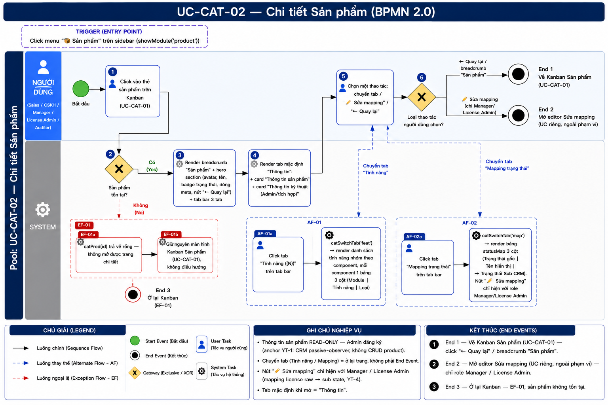
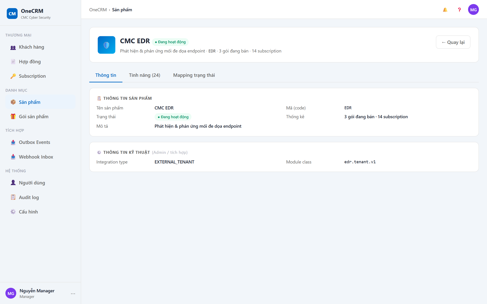
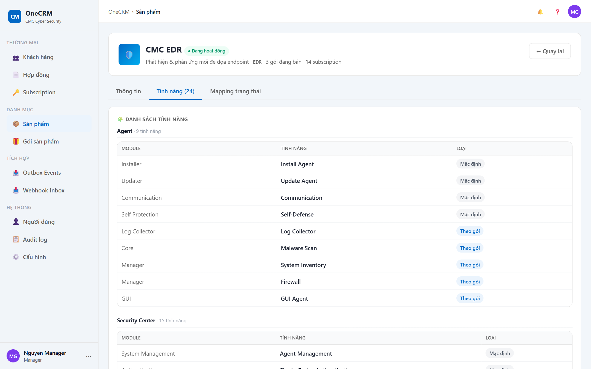
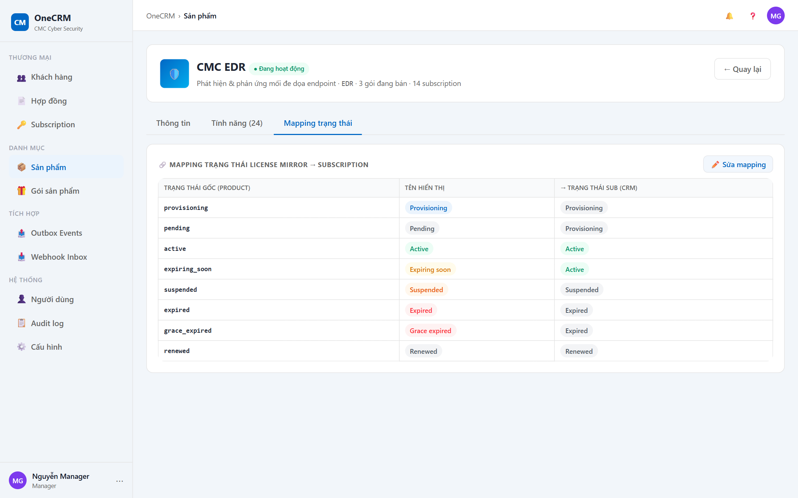

# UC-CAT-02 — Chi tiết Sản phẩm

> Module: M-04 Product & Package Catalog | Phiên bản: 1.0 | Ngày: 10/07/2026
> Trạng thái: Draft for Review

---

## 1. Thông tin chung

| Thuộc tính | Nội dung |
|---|---|
| **Mã Use Case** | UC-CAT-02 |
| **Tên** | Chi tiết Sản phẩm |
| **Mô tả** | Sales / CSKH / Manager / License Admin / Auditor xem toàn bộ thông tin của một sản phẩm trong catalog: thông tin chung, thông tin kỹ thuật tích hợp, danh sách tính năng (nhóm theo component) và bảng mapping trạng thái license mirror → subscription. Thông tin sản phẩm là **read-only** (do Admin đăng ký ở tầng hệ thống); trang chi tiết chỉ cho phép **cấu hình Mapping trạng thái** — và hành vi sửa mapping là một Use Case riêng (ngoài phạm vi tài liệu này), tại đây chỉ nêu nút và điều hướng. |
| **Tác nhân** | Sales, CSKH, Manager, License Admin, Auditor (xem). Sửa mapping: Manager, License Admin. |
| **Tiền điều kiện** | Đã đăng nhập hệ thống; có quyền xem catalog; sản phẩm tồn tại trong hệ thống. |
| **Hậu điều kiện** | (Thành công) Hiển thị đầy đủ thông tin sản phẩm. Không thay đổi dữ liệu sản phẩm (chỉ đọc). (Thất bại) Giữ nguyên màn hình Kanban sản phẩm (UC-CAT-01), hiển thị thông báo lỗi. |
| **Trigger** | Người dùng click vào thẻ sản phẩm (product card) trên Kanban tại UC-CAT-01. |
| **Liên kết** | UC-CAT-01 (Danh sách / Kanban Sản phẩm), UC Sửa mapping trạng thái (UC riêng — chưa đánh số / chưa đặc tả), UC-SUB-03 (Chi tiết Subscription — nơi mapping được áp dụng). |

### Business Rules

| Mã | Nội dung |
|---|---|
| **BR-01** | Thông tin sản phẩm là **read-only** trên trang này (Admin đăng ký ở tầng hệ thống). Người dùng CRM không sửa được tên, code, mô tả, trạng thái, integration type, module class hay danh sách tính năng. |
| **BR-02** | Trang chi tiết gồm 3 tab: **Thông tin** (`prodtab-info`), **Tính năng** (`prodtab-feat`), **Mapping trạng thái** (`prodtab-map`). |
| **BR-03** | Tab mặc định khi mở trang là "Thông tin" (`prodtab-info`). |
| **BR-04** | Hero hiển thị badge trạng thái sản phẩm: `status = ACTIVE` → "● Đang hoạt động" (xanh); ngược lại → "● Ngừng" (xám). |
| **BR-05** | Nhãn tab Tính năng hiển thị kèm tổng số tính năng: "Tính năng ({N})", với N = số dòng trong `featureCatalog` của sản phẩm. |
| **BR-06** | Tab Tính năng nhóm tính năng theo **component**; mỗi component render một bảng 3 cột: **Module \| Tính năng \| Loại**. Badge Loại ∈ {Mặc định, Theo gói, Add-on}. |
| **BR-07** | Tab Mapping trạng thái hiển thị bảng 3 cột: **Trạng thái gốc (product) \| Tên hiển thị \| → Trạng thái Sub (CRM)** — là quy tắc CRM diễn giải trạng thái license gốc từ product sang trạng thái hiển thị của Subscription (anchor YT-4: core lookup raw + display, không chuẩn hoá logic). |
| **BR-08** | Nút "✏️ Sửa mapping" trong tab Mapping trạng thái **chỉ hiển thị** với role **Manager / License Admin**; ẩn hoàn toàn với role khác. Click nút → mở editor sửa mapping (UC riêng, ngoài phạm vi). |
| **BR-09** | Chuyển tab (Tính năng / Mapping) chỉ render lại nội dung tab tương ứng — **ở lại trang chi tiết**, không điều hướng, không tạo End Event. |
| **BR-10** | Nút "← Quay lại" đưa người dùng về Kanban sản phẩm (UC-CAT-01), breadcrumb trở lại "Sản phẩm". |

---

## 2. Luồng nghiệp vụ



### 2.1 Luồng chính

> Đây là **trang chi tiết (hub)**: gateway "Loại thao tác" ở bước 6 fan ra nhiều nhánh — một số nhánh ở lại trang (chuyển tab), một số dẫn tới End Event (sửa mapping / quay lại). Mỗi nhánh liệt kê một dòng ngắn bên dưới.

| Bước | Tác nhân | Hành động / Phản hồi | Ghi chú |
|---|---|---|---|
| **1** | User (Sales / CSKH / Manager / License Admin / Auditor) | Vào trang chi tiết: click vào thẻ sản phẩm trên Kanban (UC-CAT-01). | — |
| **2** | System | **[Gateway — Sản phẩm tồn tại?]**<br>→ [Có]: tiếp bước 3.<br>→ [Không]: **EF-01** (→ **End 3**). | — |
| **3** | System | Render breadcrumb ("Sản phẩm") + hero section (avatar = icon sản phẩm, tên + badge trạng thái, dòng meta, nút "← Quay lại") + tab bar 3 tab. | BR-02, BR-03, BR-04 |
| **4** | System | Render tab mặc định "Thông tin" (`prodtab-info`): card "📋 Thông tin sản phẩm" + card "⚙️ Thông tin kỹ thuật (Admin / tích hợp)". | BR-01, BR-03 |
| **5** | User | Chọn một thao tác trên trang (chuyển tab, click nút "✏️ Sửa mapping", hoặc "← Quay lại"). | — |
| **6** | System | **[Gateway — Loại thao tác người dùng chọn?]** Rẽ nhánh theo lựa chọn ở bước 5 — mỗi nhánh dưới đây. | BR-06→BR-10 |
| → | User | **Chuyển tab Tính năng** → **AF-01**: render danh sách tính năng nhóm theo component, **ở lại trang, tiếp tục bước 5**. | BR-05, BR-06 |
| → | User | **Chuyển tab Mapping trạng thái** → **AF-02**: render bảng mapping, **ở lại trang, tiếp tục bước 5**. | BR-07, BR-08 |
| → | User | **✏️ Sửa mapping** (chỉ role Manager / License Admin) → **End 2**: mở editor sửa mapping (UC riêng, ngoài phạm vi). | BR-08 |
| → | User | **← Quay lại** / breadcrumb "Sản phẩm" → **End 1**: về Kanban sản phẩm (UC-CAT-01). | BR-10 |

### 2.2 Luồng phụ

**[AF-01: Chuyển tab Tính năng]** — kích hoạt tại bước 6 khi user click tab "Tính năng".

| Bước | Tác nhân | Hành động / Phản hồi |
|---|---|---|
| **AF-01a** | User | Click tab "Tính năng ({N})" trên tab bar. |
| **AF-01b** | System | Gọi `catSwitchTab('feat')` → render `catFeatureHtml(pr)`: nhóm `featureCatalog` theo `component`, mỗi component một bảng 3 cột (Module \| Tính năng \| Loại), Loại hiển thị bằng badge (Mặc định / Theo gói / Add-on). |
| → | — | **Ở lại trang, tiếp tục bước 5.** |

**[AF-02: Chuyển tab Mapping trạng thái]** — kích hoạt tại bước 6 khi user click tab "Mapping trạng thái".

| Bước | Tác nhân | Hành động / Phản hồi |
|---|---|---|
| **AF-02a** | User | Click tab "Mapping trạng thái" trên tab bar. |
| **AF-02b** | System | Gọi `catSwitchTab('map')` → render bảng `statusMap` 3 cột (Trạng thái gốc \| Tên hiển thị \| → Trạng thái Sub CRM). Nút "✏️ Sửa mapping" chỉ hiện với role Manager / License Admin (BR-08). |
| → | — | **Ở lại trang, tiếp tục bước 5.** |

### 2.3 Luồng ngoại lệ

**[EF-01: Sản phẩm không tồn tại]** — kích hoạt tại **bước 2** khi sản phẩm không tồn tại trong hệ thống.

| Bước | Tác nhân | Hành động / Phản hồi |
|---|---|---|
| **EF-01a** | System | Không mở được trang chi tiết (`catProd(id)` trả về rỗng). |
| **EF-01b** | System | Giữ nguyên màn hình Kanban sản phẩm UC-CAT-01, **không** điều hướng sang trang chi tiết. |
| → | — | **End 3 (Ở lại Kanban — EF-01)** |

### 2.4 Điểm kết thúc (End Events)

| # | Tên | Điều kiện |
|---|---|---|
| **End 1** | Về Kanban Sản phẩm (UC-CAT-01) | bước 6: **← Quay lại** / breadcrumb "Sản phẩm" |
| **End 2** | Mở editor Sửa mapping (UC riêng — ngoài phạm vi) | bước 6: **✏️ Sửa mapping** — chỉ role Manager / License Admin |
| **End 3** | Ở lại Kanban — EF-01 | bước 2: sản phẩm không tồn tại, không điều hướng |

> **Lưu ý:** Chuyển tab (Tính năng / Mapping) **không** phải End Event — người dùng ở lại trang chi tiết và tiếp tục bước 5.

---

## 3. Mô tả giao diện

### 3.1 Tổng quan màn hình

> **Demo HTML:** [docs/demo/v2.5.0_catalog.html](../../demo/v2.5.0_catalog.html)
> **Hàm chính:** `catOpenProduct(id)`, `catSwitchTab(t)`, `catFeatureHtml(pr)`, `catRawBadge(m)`, `catOpenMapEditor(id)` (editor — UC riêng)

Trang Chi tiết Sản phẩm gồm 3 khu vực xếp dọc từ trên xuống:
1. **Breadcrumb:** "Sản phẩm".
2. **Hero section (`profile-hero`):** avatar (icon sản phẩm) + tên sản phẩm + badge trạng thái + dòng meta + nút "← Quay lại".
3. **Tab bar + nội dung tab:** 3 tab, mặc định "Thông tin".

#### Wireframe tổng quan

```
┌─ Breadcrumb: Sản phẩm ─────────────────────────────────────────────────────┐
│ ┌──[🛡️]── CMC EDR  [● Đang hoạt động] ──────────────────────────────────┐  │
│ │        Phát hiện & phản ứng mối đe dọa endpoint · EDR · 2 gói đang bán · 5 subscription │
│ │                                                          [← Quay lại]  │  │
│ └────────────────────────────────────────────────────────────────────────┘  │
│ [Thông tin▼] [Tính năng (28)] [Mapping trạng thái]                          │
│ ┌────────────────────────────────────────────────────────────────────────┐ │
│ │ 📋 Thông tin sản phẩm                                                   │ │
│ │ Tên sản phẩm  CMC EDR          Mã (code)   EDR                          │ │
│ │ Trạng thái    ● Đang hoạt động  Thống kê    2/2 gói · 5 subscription     │ │
│ │ Mô tả         Phát hiện & phản ứng mối đe dọa endpoint                  │ │
│ ├────────────────────────────────────────────────────────────────────────┤ │
│ │ ⚙️ Thông tin kỹ thuật (Admin / tích hợp)                                │ │
│ │ Integration type  EXTERNAL_TENANT   Module class   edr.tenant.v1        │ │
│ └────────────────────────────────────────────────────────────────────────┘ │
└────────────────────────────────────────────────────────────────────────────┘
```

**Screenshot — Tab Thông tin:**



**Screenshot — Tab Tính năng (nhóm theo component):**



**Screenshot — Tab Mapping trạng thái (có nút Sửa mapping — Manager):**



### 3.2 Hero section

| Component | Mô tả |
|---|---|
| Avatar | Icon sản phẩm (`pr.icon`, ví dụ 🛡️ EDR, 📱 C-Shield, 🦠 AV, 🔏 CA). |
| Tên sản phẩm | Font lớn, bold (`pr.name`). |
| Badge trạng thái | `status = ACTIVE` → "● Đang hoạt động" (xanh); ngược lại → "● Ngừng" (xám). (BR-04) |
| Dòng meta | Ghép: "{mô tả} · {code} · {N} gói đang bán · {N} subscription". Code hiển thị font monospace. |
| Nút "← Quay lại" | Luôn hiển thị. Đưa về Kanban sản phẩm (UC-CAT-01), breadcrumb trở lại "Sản phẩm" (BR-10 → End 1). |

### 3.3 Tab Thông tin (`prodtab-info`)

Được render bởi `catOpenProduct(id)`. Gồm 2 card key-value (read-only, BR-01):

**Card "📋 Thông tin sản phẩm"**

| # | Nhãn | Nguồn dữ liệu | Ghi chú hiển thị |
|---|---|---|---|
| 1 | Tên sản phẩm | `pr.name` | Text thường. |
| 2 | Mã (code) | `pr.code` | Font monospace. |
| 3 | Trạng thái | `pr.status` | Badge "● Đang hoạt động" / "● Ngừng". |
| 4 | Thống kê | dẫn xuất | "{nActive}/{nPkg} gói đang bán · {N} subscription". |
| 5 | Mô tả | `pr.description` | Hiển thị "—" nếu null. |

**Card "⚙️ Thông tin kỹ thuật (Admin / tích hợp)"**

| # | Nhãn | Nguồn dữ liệu | Ghi chú hiển thị |
|---|---|---|---|
| 1 | Integration type | `pr.integration_type` | Ví dụ: `EXTERNAL_TENANT` (EDR), `EXTERNAL_JWT` (C-Shield, AV), `INTERNAL_KEY` (CA) — tùy sản phẩm. |
| 2 | Module class | `pr.module_class_id` | Font monospace, ví dụ `edr.tenant.v1`. |

### 3.4 Tab Tính năng (`prodtab-feat`)

Được render bởi `catFeatureHtml(pr)`. Card "🧩 Danh sách tính năng" kèm mô tả: *"Toàn bộ tính năng sản phẩm cung cấp, nhóm theo thành phần (component). Loại: Mặc định · Theo gói · Add-on (mua thêm)."*

Hiển thị: nhóm theo **component**; mỗi component một tiêu đề (kèm số tính năng của nhóm) và một bảng 3 cột:

| Cột | Mô tả |
|---|---|
| Module | Tên module con của tính năng (`f.module`), màu phụ. |
| Tính năng | Tên tính năng (`f.feature`). |
| Loại | Badge Loại ∈ {**Mặc định**, **Theo gói**, **Add-on**} (`f.type`). |

> Ví dụ sản phẩm EDR (~28 tính năng): component **"Agent"** gồm Install Agent / Update Agent / Realtime Scan / Live query / Vulnerability Detection (Add-on)…; component **"Security Center"** gồm Agent Management / Dashboard EDR Default / Event Explorer / Alert Management…

### 3.5 Tab Mapping trạng thái (`prodtab-map`)

Được render bởi `catOpenProduct(id)` (dùng `catRawBadge(m)` cho cột "Tên hiển thị"). Card "🔗 Mapping trạng thái License Mirror → Subscription" kèm mô tả: *"Quy tắc CRM diễn giải trạng thái license gốc (từ product) → trạng thái hiển thị của Subscription."*

Bảng 3 cột:

| Cột | Nguồn dữ liệu | Mô tả |
|---|---|---|
| Trạng thái gốc (product) | `m.raw` | Chuỗi raw status từ product, font monospace. |
| Tên hiển thị | `m.display` | Nhãn hiển thị, render bằng badge màu theo trạng thái (`catRawBadge`). |
| → Trạng thái Sub (CRM) | `m.subState` | Badge trạng thái subscription CRM tương ứng. |

Ví dụ mapping của sản phẩm EDR:

| Trạng thái gốc (product) | Tên hiển thị | → Trạng thái Sub (CRM) |
|---|---|---|
| `provisioning` | Provisioning | PENDING_PROVISION |
| `active` | Active | ACTIVE |
| `suspended` | Suspended | SUSPENDED |
| `expired` | Expired | EXPIRED |
| `grace_expired` | Grace expired | EXPIRED |
| `renewed` | Renewed | RENEWED |

**Nút "✏️ Sửa mapping"** hiển thị ở góc phải tiêu đề card, **chỉ với role Manager / License Admin** (BR-08). Click → gọi `catOpenMapEditor(id)` mở editor cấu hình mapping. **Hành vi sửa mapping là Use Case riêng, ngoài phạm vi tài liệu này** — tại đây chỉ nêu nút và điều hướng (→ End 2). Đây là hiện thân của anchor **YT-4**: CRM diễn giải license raw status → sub state qua lookup raw + display, không chuẩn hoá logic ở core.

---

## 4. Acceptance Criteria

### Nhóm 1: Mở trang chi tiết

| Mã | Given | When | Then |
|---|---|---|---|
| AC-CAT-02-01 | Sản phẩm "CMC EDR" tồn tại, `status = ACTIVE`. | Sales click thẻ "CMC EDR" trên Kanban (UC-CAT-01). | Trang chi tiết mở. Breadcrumb hiển thị "Sản phẩm". Tab "Thông tin" được chọn mặc định. |
| AC-CAT-02-02 | Sản phẩm "CMC EDR", `status = ACTIVE`. | Mở trang chi tiết. | Hero hiển thị avatar 🛡️, tên "CMC EDR", badge "● Đang hoạt động", dòng meta "…· EDR · {N} gói đang bán · {N} subscription". |
| AC-CAT-02-03 | Sản phẩm có `status ≠ ACTIVE`. | Mở trang chi tiết. | Badge trạng thái hiển thị "● Ngừng" (màu xám). |

### Nhóm 2: Tab Thông tin (read-only)

| Mã | Given | When | Then |
|---|---|---|---|
| AC-CAT-02-04 | Sản phẩm "CMC EDR". | Ở tab "Thông tin". | Card "📋 Thông tin sản phẩm" hiển thị: Tên, Mã (code, monospace), Trạng thái (badge), Thống kê ("{nActive}/{nPkg} gói · {N} subscription"), Mô tả. |
| AC-CAT-02-05 | Sản phẩm "CMC EDR", `integration_type = EXTERNAL_TENANT`, `module_class_id = edr.tenant.v1`. | Ở tab "Thông tin". | Card "⚙️ Thông tin kỹ thuật" hiển thị Integration type "EXTERNAL_TENANT" và Module class "edr.tenant.v1" (monospace). |
| AC-CAT-02-06 | Người dùng đang xem tab Thông tin. | Cố tìm nút chỉnh sửa thông tin sản phẩm. | Không có nút sửa nào cho thông tin sản phẩm — toàn bộ trường là read-only (BR-01). |

### Nhóm 3: Tab Tính năng

| Mã | Given | When | Then |
|---|---|---|---|
| AC-CAT-02-07 | Sản phẩm EDR có 28 tính năng trong `featureCatalog`. | Xem tab bar. | Nhãn tab hiển thị "Tính năng (28)". |
| AC-CAT-02-08 | Sản phẩm EDR có các component "Agent" và "Security Center". | Click tab "Tính năng". | Tính năng được nhóm theo component; mỗi component có tiêu đề (kèm số tính năng) và một bảng 3 cột: Module \| Tính năng \| Loại. **Ở lại trang** (AF-01). |
| AC-CAT-02-09 | Một tính năng có `type = Add-on`. | Xem bảng tính năng. | Cột "Loại" của tính năng đó hiển thị badge "Add-on"; các badge khác gồm "Mặc định" và "Theo gói". |

### Nhóm 4: Tab Mapping trạng thái

| Mã | Given | When | Then |
|---|---|---|---|
| AC-CAT-02-10 | Sản phẩm EDR có `statusMap` gồm provisioning / active / suspended / expired / grace_expired / renewed. | Click tab "Mapping trạng thái". | Bảng 3 cột hiển thị: Trạng thái gốc \| Tên hiển thị \| → Trạng thái Sub (CRM). Ví dụ `active → Active → ACTIVE`, `grace_expired → Grace expired → EXPIRED`. **Ở lại trang** (AF-02). |
| AC-CAT-02-11 | User là **Manager** (hoặc License Admin). | Mở tab "Mapping trạng thái". | Nút "✏️ Sửa mapping" hiển thị ở góc phải tiêu đề card. |
| AC-CAT-02-12 | User là **Sales / CSKH / Auditor**. | Mở tab "Mapping trạng thái". | Nút "✏️ Sửa mapping" **không hiển thị** (ẩn hoàn toàn — BR-08). |
| AC-CAT-02-13 | User là Manager, đang ở tab Mapping. | Click "✏️ Sửa mapping". | Hệ thống mở editor cấu hình mapping (UC riêng, ngoài phạm vi). Kết thúc tại **End 2**. |

### Nhóm 5: Navigation — gateway "Loại thao tác" (bước 6)

| Mã | Given | When | Then |
|---|---|---|---|
| AC-CAT-02-14 | Đang ở trang chi tiết "CMC EDR". | Click "← Quay lại" (hoặc breadcrumb "Sản phẩm"). | Quay về Kanban sản phẩm (UC-CAT-01), breadcrumb trở lại "Sản phẩm". Kết thúc tại **End 1**. |
| AC-CAT-02-15 | Đang ở tab "Thông tin". | Click tab "Tính năng" rồi tab "Mapping trạng thái". | Nội dung tab tương ứng được render, **ở lại trang chi tiết** — không điều hướng, không tạo End Event (BR-09). |

### Nhóm 6: Exception

| Mã | Given | When | Then |
|---|---|---|---|
| AC-CAT-02-16 | Sản phẩm với id không tồn tại. | Hệ thống cố mở trang chi tiết (gateway bước 2). | Không mở trang chi tiết; giữ nguyên Kanban sản phẩm UC-CAT-01. Kết thúc tại **End 3** (EF-01). |

---

## 5. Lịch sử thay đổi & Review Checklist

### Lịch sử thay đổi

| Phiên bản | Ngày | Tác giả | Mô tả |
|---|---|---|---|
| 1.0 | 10/07/2026 | BA Team | Khởi tạo tài liệu — Draft for Review. Đặc tả trang chi tiết sản phẩm dạng hub 3 tab (Thông tin / Tính năng / Mapping) theo demo-first `v2.5.0_catalog.html`. Thông tin sản phẩm read-only; chỉ Mapping trạng thái cấu hình được (Manager / License Admin) — hành vi sửa mapping là UC riêng, chỉ cross-reference. |
| 1.1 | 10/07/2026 | Claude (AI) | Nhúng ảnh BPMN (khớp §2 hiện có — bước 1–6, gateway 2 & 6, AF-01/02, EF-01→End 3, không đổi luồng); gỡ ghi chú placeholder. |

> Claude tự review — đánh dấu ✅/❌ trước khi submit cho BA review.

### Nghiệp vụ
- ✅ Luồng chính bao phủ happy path (click thẻ sản phẩm từ UC-CAT-01)
- ✅ Trang chi tiết hub: gateway "Loại thao tác" (bước 6) fan ra các nhánh (chuyển tab ở lại trang; sửa mapping → End 2; quay lại → End 1)
- ✅ Luồng phụ đã định nghĩa: AF-01 (tab Tính năng), AF-02 (tab Mapping) — đều ở lại trang
- ✅ Luồng ngoại lệ đã xử lý: EF-01 (sản phẩm không tồn tại → End 3)
- ✅ §2.4 liệt kê đầy đủ 3 End Events, khớp ảnh BPMN (placeholder)
- ✅ BR đã định nghĩa rõ (BR-01 đến BR-10); read-only (BR-01) và phân quyền sửa mapping (BR-08) nêu rõ
- ✅ Hành vi sửa mapping đánh dấu rõ là UC riêng, ngoài phạm vi — chỉ cross-reference, không đặc tả chi tiết
- ✅ AC bao phủ 6 nhóm, 16 AC — vượt ngưỡng tối thiểu 15

### Giao diện
- ✅ Wireframe ASCII mô tả đúng cấu trúc trang (breadcrumb / hero / tab bar 3 tab)
- ✅ Hero section mô tả đủ (avatar, tên, badge trạng thái, dòng meta, nút Quay lại)
- ✅ Tab Thông tin: 2 card key-value (Thông tin sản phẩm + Thông tin kỹ thuật) — read-only
- ✅ Tab Tính năng: nhóm theo component, bảng 3 cột Module/Tính năng/Loại, badge Loại 3 giá trị
- ✅ Tab Mapping: bảng 3 cột raw/display/subState, nút Sửa mapping có điều kiện role
- ✅ Ghi chú Demo HTML và tên hàm JavaScript tương ứng (`catOpenProduct`, `catSwitchTab`, `catFeatureHtml`, `catRawBadge`, `catOpenMapEditor`)
- ✅ Screenshot đã chèn (3 tab); ⏳ Ảnh BPMN chưa sinh (demo-first)
