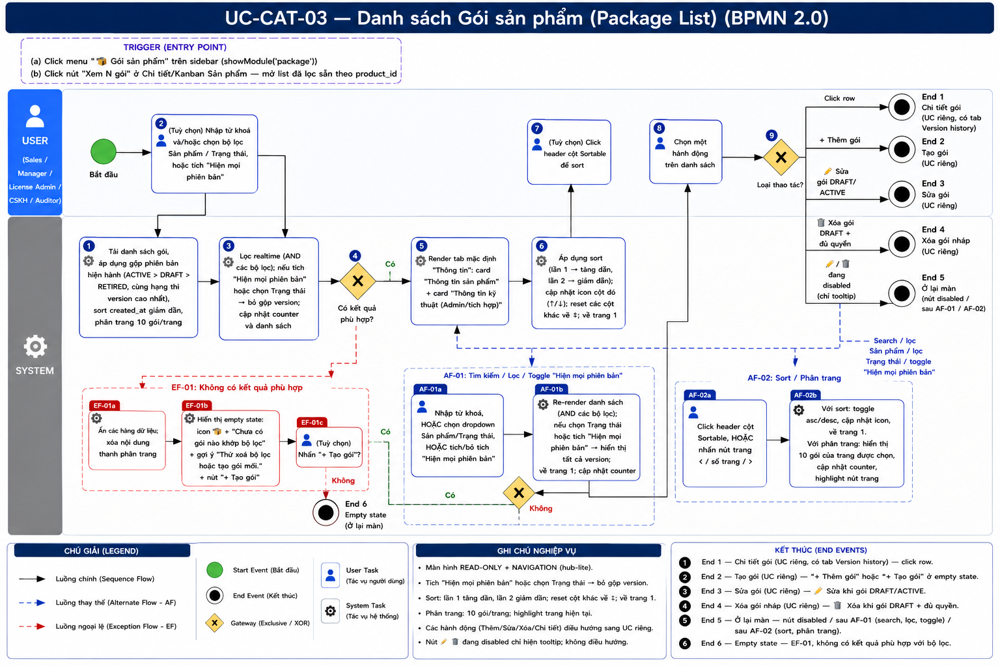
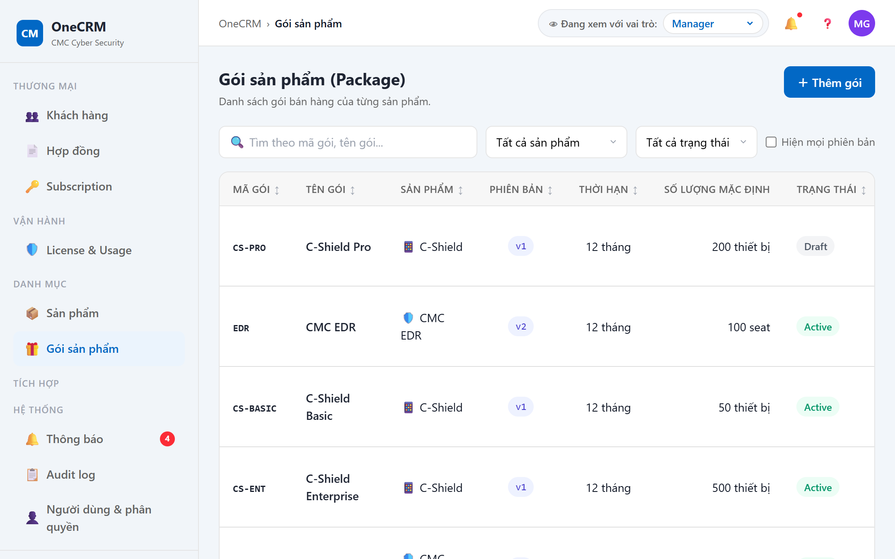

# UC-CAT-03 — Danh sách Gói sản phẩm (Package List)

> Module: M-04 Product & Package Catalog | Phiên bản: 1.0 | Ngày: 10/07/2026
> Trạng thái: Draft for Review

---

## 1. Thông tin chung

| Thuộc tính | Nội dung |
|---|---|
| **Mã Use Case** | UC-CAT-03 |
| **Tên** | Danh sách Gói sản phẩm (Package List) |
| **Mô tả** | Người dùng xem, tìm kiếm, lọc, sort và phân trang danh sách các gói bán hàng (package) của từng sản phẩm. Đây là điểm vào trung tâm của phần Gói sản phẩm trong module M-04. Mặc định gộp về phiên bản hiện hành của mỗi họ gói; có thể tích "Hiện mọi phiên bản" để xem lịch sử version. |
| **Tác nhân** | Sales, Manager, License Admin, CSKH, Auditor (chỉ xem). Sửa/Xóa theo quyền. |
| **Tiền điều kiện** | Đã đăng nhập hệ thống; có quyền xem catalog gói. |
| **Hậu điều kiện** | (Success) Không thay đổi dữ liệu — chỉ đọc và điều hướng. Danh sách hiển thị mặc định theo `package.created_at` giảm dần. (Failure) Bộ lọc không khớp bản ghi nào → hiển thị empty state, ở lại màn. |
| **Trigger** | Người dùng click menu "🎁 Gói sản phẩm" trên sidebar (`showModule('package')`); HOẶC click nút "Xem N gói" ở Chi tiết / Kanban Sản phẩm (mở list đã lọc sẵn theo product). |
| **Liên kết** | UC Chi tiết gói (mở khi click row — có tab Version history), UC Tạo gói ("＋ Thêm gói"), UC Sửa gói ("✏️ Sửa"), UC Xóa gói nháp ("🗑️ Xóa"). *Các UC này là UC riêng, ngoài phạm vi FRS này — chỉ cross-reference.* |

### Business Rules

| Mã | Nội dung |
|---|---|
| **BR-01** | Danh sách tổng hợp toàn bộ gói (package) của mọi sản phẩm. Khi vào từ nút "Xem N gói" của một sản phẩm → list được lọc sẵn theo `product_id` đó. |
| **BR-02** | Sort mặc định theo `package.created_at` giảm dần (bản ghi mới nhất lên đầu). |
| **BR-03** | Phân trang 10 gói/trang. Counter dạng "Hiển thị {X}–{Y} / {N} gói". |
| **BR-04** | **Quy tắc hiển thị hàng (gộp version):** Mặc định gộp về **phiên bản hiện hành của mỗi họ gói** (họ = cùng `product_id` + `code`): ưu tiên trạng thái `ACTIVE` > `DRAFT` > `RETIRED`; cùng hạng thì `version` cao nhất. |
| **BR-05** | Khi **tích checkbox "Hiện mọi phiên bản"** HOẶC **chọn bất kỳ giá trị nào ở bộ lọc Trạng thái** → bỏ quy tắc gộp, hiển thị **tất cả** version của mọi họ gói (thoả các bộ lọc còn lại). |
| **BR-06** | Ba trạng thái gói: `DRAFT`, `ACTIVE`, `RETIRED`. Mỗi trạng thái hiển thị badge riêng: Draft / Active / Retired (xem §3.2). |
| **BR-07** | Tìm kiếm áp dụng trên `package.code` (mã gói) và `package.name` (tên gói). Không phân biệt hoa thường. Kết hợp AND với các bộ lọc khác. |
| **BR-08** | Bộ lọc **Sản phẩm** lọc theo `package.product_id`. Mặc định "Tất cả sản phẩm" (không filter). Bộ lọc **Trạng thái** nhận một trong: Tất cả / Draft / Active / Retired. Các bộ lọc kết hợp AND. |
| **BR-09** | Nút **✏️ Sửa**: hiển thị & active với gói `DRAFT` hoặc `ACTIVE`. Với gói `RETIRED` → hiển thị ở trạng thái `disabled` (mờ), tooltip "Gói đã ngừng bán — không thể sửa". |
| **BR-10** | Nút **🗑️ Xóa**: chỉ active khi gói `DRAFT` **VÀ** người dùng có quyền xóa (Manager hoặc Sales là người tạo gói). Các trường hợp còn lại → `disabled` + tooltip: gói `DRAFT` không đủ quyền → "Chỉ Sales tạo gói hoặc Manager mới được xóa"; gói `ACTIVE` → "Gói đang bán — không thể xóa (dùng 'Ngừng bán' ở trang chi tiết)"; gói `RETIRED` → "Gói đã ngừng bán — không thể xóa". |
| **BR-11** | Cột **Số lượng mặc định** hiển thị theo thuộc tính `has_instances` của sản phẩm: sản phẩm `has_instances = false` → "{seat} seat"; `has_instances = true` → "{n} thiết bị"; nếu không có số lượng → "—". |
| **BR-12** | Hành động **Publish (Xuất bản) / Ngừng bán KHÔNG có** trên màn danh sách — chúng nằm ở hero trang Chi tiết gói. |

---

## 2. Luồng nghiệp vụ



### 2.1 Luồng chính

> Trigger (click menu "🎁 Gói sản phẩm" hoặc "Xem N gói") là **điểm vào**, không đánh số bước. Bước **4** và **8** là Gateway (XOR). Đây là màn hình hub-lite: gateway hành động (bước 8) fan ra nhiều End Event.

| Bước | Tác nhân | Hành động / Phản hồi | Ghi chú |
|---|---|---|---|
| **1** | System | Tải danh sách gói, áp dụng quy tắc gộp phiên bản hiện hành, sort mặc định `created_at` giảm dần, phân trang 10 gói/trang. | BR-02, BR-03, BR-04 |
| **2** | Người dùng | *(Tuỳ chọn)* Nhập từ khoá và/hoặc chọn bộ lọc: Sản phẩm, Trạng thái; hoặc tích "Hiện mọi phiên bản". | BR-05, BR-07, BR-08 |
| **3** | System | Lọc realtime (AND các bộ lọc); nếu tích "Hiện mọi phiên bản" hoặc chọn Trạng thái → bỏ gộp version (BR-05); cập nhật counter và danh sách. | BR-04, BR-05 |
| **4** | System | **[Gateway — Có kết quả phù hợp?]**<br>→ [Có]: tiếp bước 5.<br>→ [Không]: **EF-01**. | — |
| **5** | Người dùng | *(Tuỳ chọn)* Click header cột Sortable để sort. | Cột code / name / product / version / duration / status / sub |
| **6** | System | Áp dụng sort (click lần 1 → tăng dần, lần 2 → giảm dần); cập nhật icon cột đó (↑/↓); reset các cột còn lại về `↕`; về trang 1. | — |
| **7** | Người dùng | Chọn một hành động trên danh sách. | — |
| **8** | System | **[Gateway — Loại thao tác?]** — fan nhiều nhánh:<br>• Click row → **End 1** (Chi tiết gói)<br>• "＋ Thêm gói" → **End 2** (Tạo gói)<br>• ✏️ Sửa (DRAFT/ACTIVE) → **End 3** (Sửa gói)<br>• 🗑️ Xóa active (DRAFT + đủ quyền) → **End 4** (Xóa gói nháp)<br>• ✏️/🗑️ disabled (hiện tooltip) → **End 5** (Ở lại màn)<br>• Search / lọc Sản phẩm / lọc Trạng thái / tích "Hiện mọi phiên bản" → **AF-01**<br>• Sort / chuyển trang → **AF-02** | BR-09, BR-10, BR-12 |

### 2.2 Luồng phụ

**[AF-01: Tìm kiếm / Lọc / Toggle "Hiện mọi phiên bản"]** — kích hoạt tại **bước 2 / bước 8**.

| Bước | Tác nhân | Hành động / Phản hồi |
|---|---|---|
| **AF-01a** | Người dùng | Nhập từ khoá, HOẶC chọn dropdown Sản phẩm / Trạng thái, HOẶC tích/bỏ tích "Hiện mọi phiên bản". |
| **AF-01b** | System | Re-render danh sách (AND các bộ lọc); nếu chọn Trạng thái hoặc tích "Hiện mọi phiên bản" → hiển thị tất cả version (BR-05); về trang 1; cập nhật counter. |
| → | — | **End 5 (Ở lại màn)** — không điều hướng. Nếu không còn kết quả → **EF-01**. |

**[AF-02: Sort / Phân trang]** — kích hoạt tại **bước 5 / bước 8**.

| Bước | Tác nhân | Hành động / Phản hồi |
|---|---|---|
| **AF-02a** | Người dùng | Click header cột Sortable, HOẶC nhấn nút trang ‹ / số trang / ›. |
| **AF-02b** | System | Với sort: toggle asc/desc, cập nhật icon, về trang 1. Với phân trang: hiển thị 10 gói của trang được chọn, cập nhật counter và highlight nút trang. |
| → | — | **End 5 (Ở lại màn)** — không điều hướng. |

### 2.3 Luồng ngoại lệ

**[EF-01: Không có kết quả phù hợp]** — kích hoạt tại **bước 4** khi tìm kiếm / bộ lọc không khớp gói nào.

| Bước | Tác nhân | Hành động / Phản hồi |
|---|---|---|
| **EF-01a** | System | Ẩn các hàng dữ liệu; xóa nội dung thanh phân trang. |
| **EF-01b** | System | Hiển thị empty state: icon 🎁 + text "Chưa có gói nào khớp bộ lọc" + gợi ý "Thử xoá bộ lọc hoặc tạo gói mới." + nút "＋ Tạo gói". |
| **EF-01c** | Người dùng | *(Tuỳ chọn)* Nhấn "＋ Tạo gói" → mở form Tạo gói (**End 2**, UC riêng). |
| → | — | **End 6 (Empty state)** — ở lại màn, không có kết quả phù hợp với bộ lọc hiện tại. |

### 2.4 Điểm kết thúc (End Events)

| # | Tên | Điều kiện |
|---|---|---|
| **End 1** | Chi tiết gói — mở UC Chi tiết gói (UC riêng, có tab Version history) | Click row trong danh sách (bước 8) |
| **End 2** | Tạo gói — mở form Tạo gói (UC riêng) | Nhấn "＋ Thêm gói" (bước 8) hoặc "＋ Tạo gói" ở empty state (EF-01) |
| **End 3** | Sửa gói — mở form Sửa gói (UC riêng) | Nhấn ✏️ khi gói `DRAFT`/`ACTIVE` (bước 8, BR-09) |
| **End 4** | Xóa gói nháp — mở modal xác nhận xóa (UC riêng) | Nhấn 🗑️ khi gói `DRAFT` + đủ quyền (bước 8, BR-10) |
| **End 5** | Ở lại màn | Nhấn ✏️/🗑️ disabled (chỉ hiện tooltip) / sau **AF-01** (search, lọc, toggle) / sau **AF-02** (sort, phân trang) |
| **End 6** | Empty state | **EF-01** — không có kết quả phù hợp với bộ lọc |

---

## 3. Mô tả giao diện

### 3.1 Wireframe

```
┌────────────────────────────────────────────────────────────────────────────┐
│ Gói sản phẩm  ›  Gói sản phẩm                                (breadcrumb)    │
├────────────────────────────────────────────────────────────────────────────┤
│ Gói sản phẩm (Package)                                        [ ＋ Thêm gói ]│
│ Danh sách gói bán hàng của từng sản phẩm. Mặc định hiện phiên bản hiện hành  │
│ của mỗi mã gói — tích "Hiện mọi phiên bản" để xem lịch sử version.           │
├────────────────────────────────────────────────────────────────────────────┤
│ [🔎 Tìm theo mã gói, tên gói...] [Tất cả sản phẩm▾] [Trạng thái▾] ☐ Hiện mọi│
│                                                                phiên bản     │
├──────────┬───────────┬──────────┬────────┬────────┬──────────┬────────┬─────┤
│ Mã gói ↕ │ Tên gói ↕ │ Sản phẩm↕│Phiên   │Thời    │Số lượng  │Trạng   │Số   │  ⋯
│          │           │          │bản ↕   │hạn ↕   │mặc định  │thái ↕  │sub ↕│
├──────────┼───────────┼──────────┼────────┼────────┼──────────┼────────┼─────┼──┤
│ EDR-PRO  │ EDR Pro   │🛡️ CMC EDR│  v2    │12 tháng│ 100 seat │[Active]│  8  │✏️🗑│
│ CSH-STD  │ C-Shield… │📱 C-Shield│  v1   │12 tháng│50 thiết bị[Draft] │  0  │✏️🗑│
│ AV-BiZ   │ AV Business│🦠 CMC AV │  v3   │24 tháng│    —     │[Retired]  2  │✏️🗑│
├──────────┴───────────┴──────────┴────────┴────────┴──────────┴────────┴─────┴──┤
│ Hiển thị 1–10 / 23 gói                                     ‹  1  2  3  ›       │
└────────────────────────────────────────────────────────────────────────────┘
```

> **Demo HTML:** [docs/demo/v2.8.0_audit_notification.html](../../demo/v2.8.0_audit_notification.html) — hàm `pkgRenderTable`, `pkgVisibleRows`, `pkgRenderPager`, `pkgRowActions`, `pkgSort`, `pkgStatusBadge`.

**Screenshot — Danh sách Gói sản phẩm:**



### 3.2 Các thành phần giao diện

#### Page header

| Component | Loại | Mô tả |
|---|---|---|
| Tiêu đề | Heading | "Gói sản phẩm (Package)". |
| Subtitle | Text | "Danh sách gói bán hàng của từng sản phẩm. Mặc định hiện phiên bản hiện hành của mỗi mã gói — tích 'Hiện mọi phiên bản' để xem lịch sử version." |
| Nút "＋ Thêm gói" | Primary button | Mở form Tạo gói (UC riêng) → **End 2**. |

#### Thanh công cụ (Toolbar)

| Component | Loại | Mô tả |
|---|---|---|
| Ô tìm kiếm | Text input | Placeholder "Tìm theo mã gói, tên gói...". Filter realtime trên `code` + `name`, không phân biệt hoa thường (BR-07). |
| Dropdown Sản phẩm | Select | Mặc định "Tất cả sản phẩm". Lọc theo `product_id` (BR-08). |
| Dropdown Trạng thái | Select | Các giá trị: Tất cả / Draft / Active / Retired. Chọn khác "Tất cả" → bỏ gộp version, hiển thị mọi version (BR-05, BR-08). |
| Checkbox "Hiện mọi phiên bản" | Checkbox | Khi tích → bỏ quy tắc gộp, hiển thị tất cả version của mọi họ gói (BR-05). |

#### Bảng danh sách

| # | Cột | Nguồn dữ liệu | Mô tả hiển thị | Sortable |
|---|---|---|---|---|
| 1 | **Mã gói** | `package.code` | Badge mã gói (`pkg-code`). | ✅ |
| 2 | **Tên gói** | `package.name` | Text thường. | ✅ |
| 3 | **Sản phẩm** | `product.icon`, `product.name` | Icon + tên sản phẩm. | ✅ |
| 4 | **Phiên bản** | `package.version` | Badge "v{n}", canh giữa. | ✅ |
| 5 | **Thời hạn** | `package.duration_months` | "{X} tháng", canh giữa. | ✅ |
| 6 | **Số lượng mặc định** | `default_seat_count` / `default_instance_count` | Canh phải. "{seat} seat" nếu `has_instances = false`; "{n} thiết bị" nếu `has_instances = true`; "—" nếu không có (BR-11). | ❌ |
| 7 | **Trạng thái** | `package.status` | Badge Draft / Active / Retired (xem badge bên dưới). | ✅ |
| 8 | **Số sub** | đếm subscription tham chiếu gói | Số subscription trỏ tới gói, canh giữa. | ✅ |
| 9 | **Thao tác** | — | Nút ✏️ Sửa và 🗑️ Xóa theo BR-09, BR-10. | ❌ |

#### Badge trạng thái

| Trạng thái | Nhãn hiển thị |
|---|---|
| DRAFT | Draft |
| ACTIVE | Active |
| RETIRED | Retired |

#### Row actions (cột Thao tác)

| Nút | Điều kiện active | Điều kiện disabled + tooltip |
|---|---|---|
| **✏️ Sửa** | Gói `DRAFT` hoặc `ACTIVE` → mở form Sửa gói (**End 3**). | Gói `RETIRED` → mờ, tooltip "Gói đã ngừng bán — không thể sửa" (BR-09). |
| **🗑️ Xóa** | Gói `DRAFT` **VÀ** đủ quyền (Manager hoặc Sales tạo gói) → mở modal Xóa gói nháp (**End 4**). | `DRAFT` không đủ quyền → "Chỉ Sales tạo gói hoặc Manager mới được xóa"; `ACTIVE` → "Gói đang bán — không thể xóa (dùng 'Ngừng bán' ở trang chi tiết)"; `RETIRED` → "Gói đã ngừng bán — không thể xóa" (BR-10). |

> **Lưu ý:** Publish (Xuất bản) / Ngừng bán **không** có ở màn danh sách — nằm ở hero trang Chi tiết gói (BR-12).

#### Phân trang (Pager)

| Component | Mô tả |
|---|---|
| Counter | "Hiển thị {X}–{Y} / {N} gói" (BR-03). |
| Điều hướng trang | 10 gói/trang. Nút ‹ 1 2 3 ›; nút trang hiện tại highlight; ‹ / › disable ở đầu / cuối. |
| Ẩn khi EF-01 | Không hiển thị khi danh sách rỗng. |

---

## 4. Acceptance Criteria

### Nhóm 1: Hiển thị danh sách & gộp version

| Mã | Given | When | Then |
|---|---|---|---|
| AC-CAT-03-01 | Hệ thống có 23 gói thuộc nhiều sản phẩm. | Mở màn hình Danh sách gói. | Áp dụng gộp phiên bản hiện hành, hiển thị 10 gói đầu (trang 1), sort `created_at` giảm dần. Counter "Hiển thị 1–10 / {N} gói". |
| AC-CAT-03-02 | Một họ gói (cùng `product_id`+`code`) có v1 RETIRED, v2 ACTIVE, v3 DRAFT. | Xem danh sách mặc định (không tích "Hiện mọi phiên bản"). | Chỉ hiển thị 1 hàng — bản `ACTIVE` (ưu tiên ACTIVE > DRAFT > RETIRED). |
| AC-CAT-03-03 | Một họ gói chỉ có 2 bản DRAFT v1, DRAFT v2. | Xem danh sách mặc định. | Hiển thị bản DRAFT v2 (cùng hạng → version cao nhất). |
| AC-CAT-03-04 | Sản phẩm `has_instances = false`, gói có `default_seat_count = 100`. | Xem cột Số lượng mặc định. | Hiển thị "100 seat". |
| AC-CAT-03-05 | Sản phẩm `has_instances = true`, gói có `default_instance_count = 50`. | Xem cột Số lượng mặc định. | Hiển thị "50 thiết bị". |
| AC-CAT-03-06 | Gói không có số lượng mặc định. | Xem cột Số lượng mặc định. | Hiển thị "—". |

### Nhóm 2: Tìm kiếm & Lọc

| Mã | Given | When | Then |
|---|---|---|---|
| AC-CAT-03-07 | Có gói mã "EDR-PRO". | Nhập "edr-pro" (chữ thường) vào ô tìm kiếm. | Hiển thị gói match, counter cập nhật (không phân biệt hoa thường). Ở lại màn (**End 5**). |
| AC-CAT-03-08 | Danh sách nhiều sản phẩm. | Chọn dropdown Sản phẩm = "CMC EDR". | Chỉ hiển thị gói có `product_id = CMC_EDR` (AND với bộ lọc khác). |
| AC-CAT-03-09 | Họ gói có nhiều version với trạng thái khác nhau. | Chọn dropdown Trạng thái = "Active". | Bỏ gộp version, hiển thị tất cả gói `ACTIVE` (BR-05). |
| AC-CAT-03-10 | Đang xem mặc định (gộp version). | Tích checkbox "Hiện mọi phiên bản". | Hiển thị tất cả version của mọi họ gói. Ở lại màn (**End 5**). |
| AC-CAT-03-11 | Nhập từ khoá không khớp gói nào. | Nhập "zzzzz". | Gateway bước 4 → **EF-01**: empty state "Chưa có gói nào khớp bộ lọc" + nút "＋ Tạo gói", pager ẩn. Kết thúc tại **End 6**. |

### Nhóm 3: Sort & Phân trang

| Mã | Given | When | Then |
|---|---|---|---|
| AC-CAT-03-12 | Chưa sort theo "Tên gói". | Click header "Tên gói" lần 1. | Sort tăng dần, icon ↑ trên cột đó, các cột khác reset về ↕, về trang 1. |
| AC-CAT-03-13 | Đang sort "Tên gói" tăng dần. | Click header "Tên gói" lần 2. | Sort giảm dần, icon ↓. |
| AC-CAT-03-14 | Có 23 gói (3 trang). | Click nút trang 2. | Hiển thị gói 11–20, counter "Hiển thị 11–20 / 23 gói", nút trang 2 highlight. Ở lại màn (**End 5**). |
| AC-CAT-03-15 | Cột "Số lượng mặc định". | Click vào header cột này. | Không có tác dụng sort (cột không sortable). |

### Nhóm 4: Row actions theo trạng thái & quyền

| Mã | Given | When | Then |
|---|---|---|---|
| AC-CAT-03-16 | Gói `DRAFT`, người dùng là Manager (hoặc Sales tạo gói). | Xem cột Thao tác. | Nút ✏️ Sửa và 🗑️ Xóa cùng active. |
| AC-CAT-03-17 | Gói `DRAFT`, người dùng KHÔNG đủ quyền xóa. | Hover nút 🗑️ (disabled). | Nút 🗑️ mờ, tooltip "Chỉ Sales tạo gói hoặc Manager mới được xóa". Nút ✏️ vẫn active. |
| AC-CAT-03-18 | Gói `ACTIVE`. | Xem cột Thao tác. | ✏️ Sửa active; 🗑️ Xóa disabled, tooltip "Gói đang bán — không thể xóa (dùng 'Ngừng bán' ở trang chi tiết)". |
| AC-CAT-03-19 | Gói `RETIRED`. | Hover 2 nút thao tác. | ✏️ Sửa disabled, tooltip "Gói đã ngừng bán — không thể sửa"; 🗑️ Xóa disabled, tooltip "Gói đã ngừng bán — không thể xóa". |
| AC-CAT-03-20 | Màn danh sách. | Quan sát cột Thao tác của mọi hàng. | Không có nút Publish/Xuất bản hay Ngừng bán (chỉ có ở hero trang Chi tiết gói). |

### Nhóm 5: Điều hướng

| Mã | Given | When | Then |
|---|---|---|---|
| AC-CAT-03-21 | Người dùng đang xem danh sách. | Click vào một row. | Điều hướng sang Chi tiết gói (UC riêng, có tab Version history). Kết thúc tại **End 1**. |
| AC-CAT-03-22 | Người dùng đang xem danh sách. | Click nút "＋ Thêm gói". | Mở form Tạo gói (UC riêng). Kết thúc tại **End 2**. |
| AC-CAT-03-23 | Gói `DRAFT`/`ACTIVE`. | Click ✏️ Sửa. | Mở form Sửa gói (UC riêng). Kết thúc tại **End 3**. |
| AC-CAT-03-24 | Gói `DRAFT` + đủ quyền. | Click 🗑️ Xóa. | Mở modal xác nhận Xóa gói nháp (UC riêng). Kết thúc tại **End 4**. |
| AC-CAT-03-25 | Vào list từ nút "Xem N gói" ở Chi tiết/Kanban Sản phẩm. | Màn danh sách mở. | Bộ lọc Sản phẩm được set sẵn theo product đó; chỉ hiển thị gói của product đó. |

---

## 5. Lịch sử thay đổi

| Phiên bản | Ngày | Người cập nhật | Nội dung |
|---|---|---|---|
| 1.0 | 10/07/2026 | BA Team | Khởi tạo tài liệu — Draft for Review. Đặc tả màn Danh sách gói: cột / filter / sort / pager / quy tắc gộp version / điều kiện hiển thị nút thao tác theo trạng thái & quyền. Hành vi form tạo/sửa, publish/ngừng bán/xóa/rollback và chi tiết version là UC riêng, chỉ cross-reference. |
| 1.1 | 10/07/2026 | Claude (AI) | Nhúng ảnh BPMN. Bản render đầu bị lỗi image-gen (node ma ⑤ lẫn nội dung UC-CAT-02, đảo thứ tự sort/click header) → **đã render lại**. Đối chiếu §2 ↔ BPMN bản mới: **khớp hoàn toàn** (8 step; gateway ④ "Có kết quả phù hợp?", ⑧ "Loại thao tác?" fan 7 nhánh; AF-01 có gateway con "Còn kết quả?", AF-02, EF-01 có gateway "Nhấn ＋Tạo gói?"; End 1–6) — không cần sửa luồng. |

### Review Checklist

> Claude tự review — đánh dấu ✅/❌ trước khi submit cho BA review.

#### Nghiệp vụ
- ✅ Luồng chính bao phủ happy path
- ✅ Luồng phụ đã định nghĩa (AF-01 search/lọc/toggle, AF-02 sort/phân trang)
- ✅ Luồng ngoại lệ đã xử lý (EF-01 empty state → ở lại màn)
- ✅ End Events liệt kê đầy đủ (§2.4 — 6 End)
- ✅ BR đã định nghĩa rõ (BR-01 đến BR-12), gồm quy tắc gộp version và điều kiện nút theo trạng thái/quyền
- ✅ AC bao phủ các trường hợp quan trọng (5 nhóm, 25 AC)
- ✅ Nội dung bám sát demo v2.5.0 (`pkgVisibleRows`, `pkgRowActions`, `pkgRenderPager`)
- ✅ Ranh giới demo-first: chỉ đặc tả màn danh sách; behavior của UC tạo/sửa/publish/xóa/version chỉ cross-reference

#### Giao diện
- ✅ Mô tả UI đủ chi tiết (page header, toolbar, bảng 8 cột dữ liệu + thao tác, pager)
- ✅ Component states đã mô tả (nút disabled + tooltip theo từng trạng thái, empty state)
- ✅ Badge trạng thái đã định nghĩa đủ 3 loại (Draft/Active/Retired)
- ✅ Screenshot + ảnh BPMN đã chèn; §2 đã đối chiếu khớp BPMN (8 step, gateway ④ & ⑧, AF-01/02, EF-01, End 1–6)
