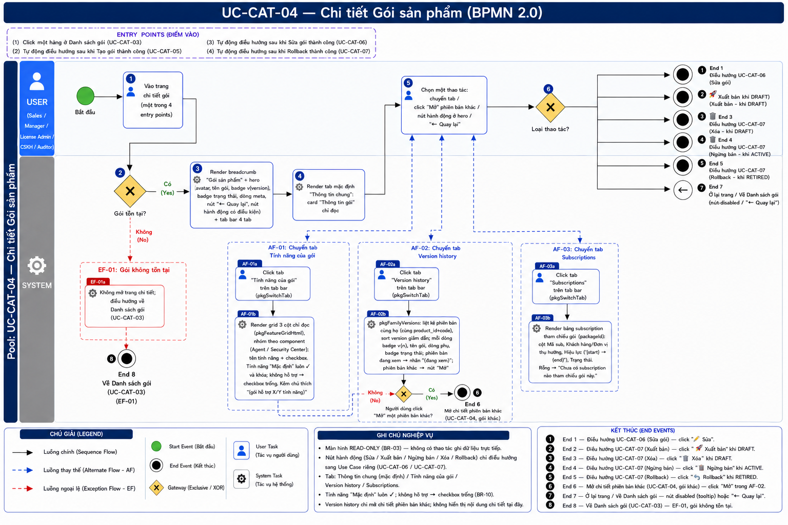
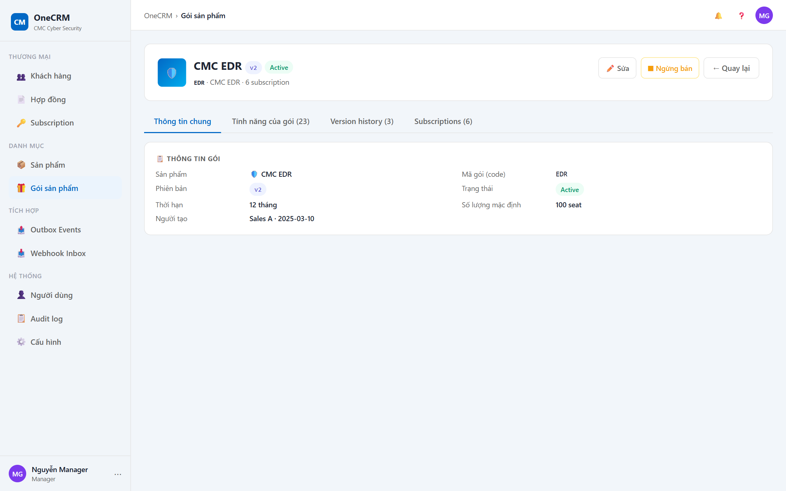
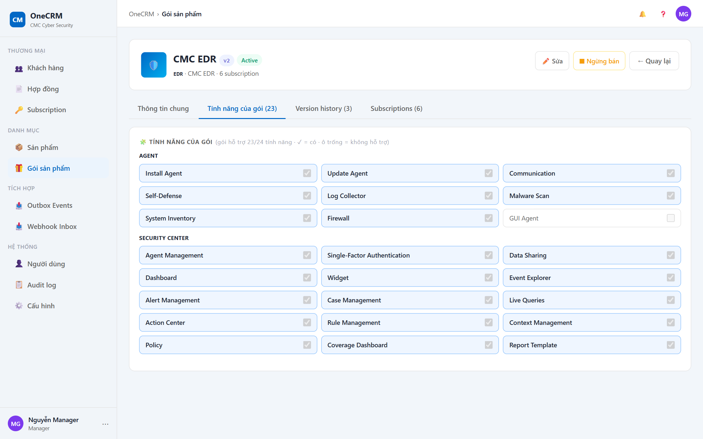
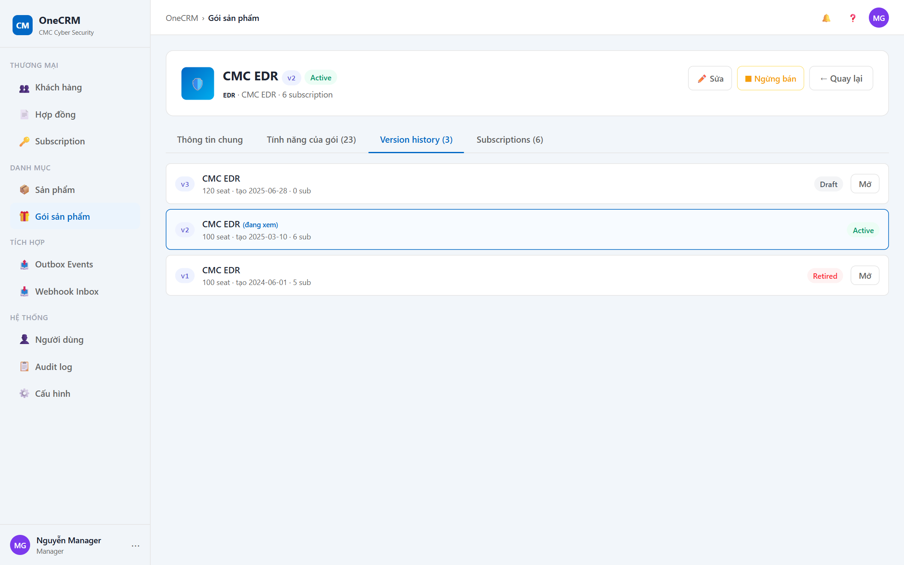
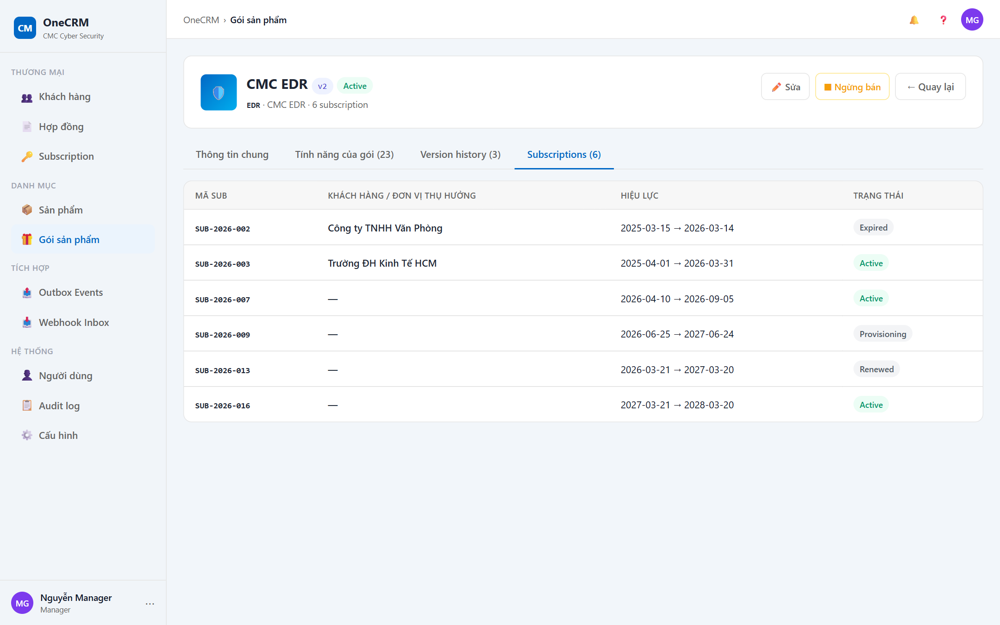

# UC-CAT-04 — Chi tiết Gói sản phẩm

> Module: M-04 Product & Package Catalog | Phiên bản: 1.0 | Ngày: 10/07/2026
> Trạng thái: Draft for Review

---

## 1. Thông tin chung

| Thuộc tính | Nội dung |
|---|---|
| **Mã Use Case** | UC-CAT-04 |
| **Tên** | Chi tiết Gói sản phẩm |
| **Mô tả** | Người dùng xem toàn bộ thông tin của một gói bán hàng (package): thông tin chung, danh sách tính năng của gói, lịch sử phiên bản cùng họ và các subscription tham chiếu gói. Trang chi tiết là **hub điều hướng** cho mọi thao tác trên gói — bản thân trang chỉ đọc, các thao tác (Sửa / Xuất bản / Ngừng bán / Xóa / Rollback) dẫn sang UC khác. |
| **Tác nhân** | Sales, Manager, License Admin, CSKH, Auditor (chỉ xem). Thao tác Sửa / Xuất bản / Ngừng bán / Xóa / Rollback theo quyền. |
| **Tiền điều kiện** | (1) Đã đăng nhập hệ thống; có quyền xem catalog gói. (2) Gói (package) tồn tại trong hệ thống. |
| **Hậu điều kiện** | (Success) Hiển thị đầy đủ thông tin gói — không thay đổi dữ liệu (chỉ đọc và điều hướng). (Failure) Gói không tồn tại → về Danh sách gói (UC-CAT-03), không mở trang chi tiết. |
| **Trigger** | (1) Người dùng click một hàng ở Danh sách gói (UC-CAT-03). (2) Hệ thống tự điều hướng sau khi Tạo gói thành công (UC-CAT-05). (3) Hệ thống tự điều hướng sau khi Sửa gói thành công (UC-CAT-06). (4) Hệ thống tự điều hướng sau khi Rollback thành công (UC-CAT-07). |
| **Ngoại lệ** | Gói không tồn tại → về Danh sách gói (EF-01). |
| **Liên kết** | UC-CAT-03 (Danh sách gói), UC-CAT-05 (Tạo gói), UC-CAT-06 (Sửa gói), UC-CAT-07 (Quản lý vòng đời gói: Xuất bản / Ngừng bán / Xóa / Rollback), UC-SUB-03 (Chi tiết Subscription). |

### Business Rules

| Mã&nbsp;&nbsp;&nbsp; | Nội dung |
|---|---|
| **BR-01** | Trang chi tiết gồm 4 tab: **Thông tin chung** (mặc định), **Tính năng của gói (N)**, **Version history (N)**, **Subscriptions (N)**. Số đếm N hiển thị ngay trên nhãn tab. |
| **BR-02** | Tab mặc định khi mở trang là "Thông tin chung". |
| **BR-03** | Toàn bộ nội dung 4 tab là **chỉ đọc** — không cho chỉnh sửa trực tiếp trên trang chi tiết. |
| **BR-04** | Breadcrumb hiển thị "Gói sản phẩm". |
| **BR-05** | Hero (profile-hero) hiển thị: avatar (icon sản phẩm, mặc định 🎁), tên gói + badge `v{version}` + badge trạng thái (Draft / Active / Retired), dòng meta "{mã gói} · {tên sản phẩm} · {N} subscription", nút "← Quay lại" và các nút hành động theo trạng thái + quyền (BR-08 → BR-11). |
| **BR-06** | Nút hành động ở hero hiển thị **có điều kiện** dựa trên `package.status` và quyền của người dùng hiện tại (`pkgDetailActions`). Thiếu quyền → nút ở trạng thái `disabled` (mờ) kèm tooltip, **không ẩn**. |
| **BR-07** | Số lượng mặc định hiển thị theo thuộc tính `has_instances` của sản phẩm: `has_instances = false` → "{seat} seat"; `has_instances = true` → "{n} thiết bị"; không có số lượng → "—". |
| **BR-08** | Gói `DRAFT`: hiển thị **🚀 Xuất bản** + **✏️ Sửa** + **🗑️ Xóa**. Quyền Xuất bản: người tạo gói hoặc Manager; thiếu quyền → disabled + tooltip "Chỉ Sales tạo gói hoặc Manager mới được xuất bản". Quyền Xóa: người tạo gói hoặc Manager; thiếu quyền → disabled + tooltip. |
| **BR-09** | Gói `ACTIVE`: hiển thị **✏️ Sửa** + **⏹ Ngừng bán**. Quyền Ngừng bán: Manager; thiếu quyền → disabled + tooltip "Chỉ Manager mới được ngừng bán gói". |
| **BR-10** | Gói `RETIRED`: hiển thị **↩️ Rollback**. Quyền: người tạo gói hoặc Manager; thiếu quyền → disabled + tooltip. |
| **BR-11** | Các nút 🚀 Xuất bản / ⏹ Ngừng bán / 🗑️ Xóa / ↩️ Rollback dẫn sang **UC-CAT-07** (mở modal xác nhận tương ứng); nút ✏️ Sửa dẫn sang **UC-CAT-06** (form Sửa gói). |
| **BR-12** | Tab **Tính năng của gói** hiển thị grid 3 cột chỉ đọc, nhóm theo component (Agent / Security Center); mỗi ô: tên tính năng trước · checkbox sau. Tính năng loại "Mặc định" luôn ✓ và khóa; tính năng gói không hỗ trợ → checkbox trống. Render bởi `pkgFeatureGridHtml(pr, selKeys, true)`. |
| **BR-13** | Tab **Version history** liệt kê các phiên bản **cùng họ** (cùng `product_id` + `code`), sắp `version` giảm dần (`pkgFamilyVersions`). Phiên bản đang xem hiển thị nhãn "(đang xem)"; các phiên bản khác có nút "Mở" để mở chi tiết phiên bản đó (vẫn ở UC-CAT-04, gói khác). |
| **BR-14** | Tab **Subscriptions** liệt kê các subscription tham chiếu gói theo `packageId`. Rỗng → thông báo "Chưa có subscription nào tham chiếu gói này." |

---

## 2. Luồng nghiệp vụ



### 2.1 Luồng chính

> Số bước khớp badge trong ảnh BPMN. Bước **2** và **6** là Gateway (XOR). Đây là **trang chi tiết (hub)**: gateway "Loại thao tác" ở bước 6 fan ra nhiều nhánh AF / End Event — mỗi nhánh liệt kê một dòng ngắn bên dưới.

| Bước | Tác nhân | Hành động / Phản hồi | Ghi chú |
|---|---|---|---|
| **1** | Người dùng (Sales / Manager / License Admin / CSKH / Auditor) | Vào trang chi tiết: click một hàng ở Danh sách gói (UC-CAT-03), hoặc được điều hướng tự động sau khi Tạo (UC-CAT-05) / Sửa (UC-CAT-06) / Rollback (UC-CAT-07). | — |
| **2** | System | **[Gateway — Gói tồn tại?]**<br>→ [Có]: tiếp bước 3.<br>→ [Không]: **EF-01** (→ **End 8**). | — |
| **3** | System | Render breadcrumb ("Gói sản phẩm", BR-04) + hero (avatar, tên gói, badge `v{version}`, badge trạng thái, dòng meta, nút "← Quay lại", nút hành động hiện có điều kiện theo trạng thái & quyền) + tab bar 4 tab. | BR-04, BR-05, BR-06, BR-08 → BR-11 |
| **4** | System | Render tab mặc định "Thông tin chung" (`pkgOpenDetail`): card "📋 Thông tin gói" chỉ đọc. | BR-02, BR-03, BR-07 |
| **5** | Người dùng | Chọn một thao tác trên trang (chuyển tab, click "Mở" phiên bản khác, click nút hành động, hoặc "← Quay lại"). | — |
| **6** | System | **[Gateway — Loại thao tác?]** — fan nhiều nhánh theo lựa chọn ở bước 5:<br>• Chuyển tab Tính năng của gói / Version history / Subscriptions → **AF-01 / AF-02 / AF-03** (ở lại trang, tiếp bước 5)<br>• ✏️ Sửa → **End 1** (UC-CAT-06)<br>• 🚀 Xuất bản (DRAFT) → **End 2** (UC-CAT-07)<br>• 🗑️ Xóa (DRAFT) → **End 3** (UC-CAT-07)<br>• ⏹ Ngừng bán (ACTIVE) → **End 4** (UC-CAT-07)<br>• ↩️ Rollback (RETIRED) → **End 5** (UC-CAT-07)<br>• Click "Mở" một phiên bản khác ở Version history → **End 6** (UC-CAT-04, gói khác)<br>• Nút hành động disabled (thiếu quyền) → hiện tooltip → **End 7** (ở lại trang)<br>• ← Quay lại → **End 7** → về Danh sách gói (UC-CAT-03) | BR-03, BR-06, BR-08 → BR-13 |

### 2.2 Luồng phụ

**[AF-01: Chuyển tab Tính năng của gói]** — kích hoạt tại **bước 6** khi người dùng click tab "Tính năng của gói".

| Bước | Tác nhân | Hành động / Phản hồi |
|---|---|---|
| **AF-01a** | Người dùng | Click tab "Tính năng của gói" trên tab bar (`pkgSwitchTab`). |
| **AF-01b** | System | Render grid 3 cột chỉ đọc bằng `pkgFeatureGridHtml(pr, selKeys, true)`: nhóm theo component (Agent / Security Center), mỗi ô "tên tính năng · checkbox"; tính năng "Mặc định" luôn ✓ và khóa; tính năng gói không hỗ trợ → checkbox trống. Kèm chú thích "(gói hỗ trợ {X}/{Y} tính năng · ✓ = có · ô trống = không hỗ trợ)". |
| → | — | **Ở lại trang, tiếp tục bước 5.** |

**[AF-02: Chuyển tab Version history]** — kích hoạt tại **bước 6** khi người dùng click tab "Version history".

| Bước | Tác nhân | Hành động / Phản hồi |
|---|---|---|
| **AF-02a** | Người dùng | Click tab "Version history" trên tab bar (`pkgSwitchTab`). |
| **AF-02b** | System | Gọi `pkgFamilyVersions`, liệt kê các phiên bản cùng họ (cùng `product_id` + `code`), sắp `version` giảm dần. Mỗi dòng: badge `v{n}`, tên gói, dòng phụ "{seat/thiết bị} · tạo {ngày} · {N} sub", badge trạng thái; phiên bản đang xem → nhãn "(đang xem)", phiên bản khác → nút "Mở". |
| → | — | **Ở lại trang, tiếp tục bước 5.** *(Nếu người dùng click "Mở" một phiên bản khác → End 6, xem bước 6.)* |

**[AF-03: Chuyển tab Subscriptions]** — kích hoạt tại **bước 6** khi người dùng click tab "Subscriptions".

| Bước | Tác nhân | Hành động / Phản hồi |
|---|---|---|
| **AF-03a** | Người dùng | Click tab "Subscriptions" trên tab bar (`pkgSwitchTab`). |
| **AF-03b** | System | Render bảng các subscription tham chiếu gói theo `packageId`: cột Mã sub, Khách hàng / Đơn vị thụ hưởng, Hiệu lực ("{start} → {end}"), Trạng thái (badge). Rỗng → "Chưa có subscription nào tham chiếu gói này." |
| → | — | **Ở lại trang, tiếp tục bước 5.** |

### 2.3 Luồng ngoại lệ

**[EF-01: Gói không tồn tại]** — kích hoạt tại **bước 2** khi gói không tồn tại trong hệ thống.

| Bước | Tác nhân | Hành động / Phản hồi |
|---|---|---|
| **EF-01a** | System | Không mở trang chi tiết; điều hướng về Danh sách gói (UC-CAT-03). |
| → | — | **End 8 (Về Danh sách gói — EF-01)** |

### 2.4 Điểm kết thúc (End Events)

| # | Tên | Điều kiện |
|---|---|---|
| **End 1** | Điều hướng UC-CAT-06 (Sửa gói) | bước 6: **✏️ Sửa** (DRAFT hoặc ACTIVE) |
| **End 2** | Điều hướng UC-CAT-07 (Xuất bản) | bước 6: **🚀 Xuất bản** khi `status = DRAFT` |
| **End 3** | Điều hướng UC-CAT-07 (Xóa) | bước 6: **🗑️ Xóa** khi `status = DRAFT` |
| **End 4** | Điều hướng UC-CAT-07 (Ngừng bán) | bước 6: **⏹ Ngừng bán** khi `status = ACTIVE` |
| **End 5** | Điều hướng UC-CAT-07 (Rollback) | bước 6: **↩️ Rollback** khi `status = RETIRED` |
| **End 6** | Mở chi tiết phiên bản khác (UC-CAT-04, gói khác) | bước 6: click "Mở" một phiên bản ở Version history |
| **End 7** | Ở lại trang / về Danh sách gói | bước 6: nút disabled (hiện tooltip → ở lại) hoặc **← Quay lại** (→ UC-CAT-03) |
| **End 8** | Về Danh sách gói — EF-01 | bước 2: gói không tồn tại, không mở chi tiết |

---

## 3. Mô tả giao diện

### 3.1 Tổng quan màn hình

> **Demo HTML:** [docs/demo/v2.5.0_catalog.html](../../demo/v2.5.0_catalog.html)
> **Hàm chính:** `pkgOpenDetail`, `pkgSwitchTab`, `pkgDetailActions`, `pkgFeatureGridHtml`, `pkgFamilyVersions`

Trang Chi tiết Gói gồm 3 khu vực xếp dọc từ trên xuống:
1. **Breadcrumb:** Gói sản phẩm.
2. **Hero (profile-hero):** avatar + tên gói + badges + dòng meta + nút "← Quay lại" + nút hành động theo trạng thái & quyền.
3. **Tab bar + nội dung tab:** 4 tab, mặc định "Thông tin chung".

#### Wireframe tổng quan

```
┌─ Gói sản phẩm ─────────────────────────────────────────────────────────────┐
│ ┌──[🛡️/🎁]── EDR Pro  [v2]  [● Active] ─────────────────────────────────┐  │
│ │            EDR-PRO · CMC EDR · 8 subscription                          │  │
│ │                                       [← Quay lại] [✏️ Sửa] [⏹ Ngừng bán]* │
│ └───────────────────────────────────────────────────────────────────────┘  │
│ [Thông tin chung▼] [Tính năng của gói (12)] [Version history (3)] [Subs (8)]│
│ ┌────────────────────────────────────────────────────────────────────────┐ │
│ │ 📋 Thông tin gói                                                        │ │
│ │ Sản phẩm      🛡️ CMC EDR       Mã gói        EDR-PRO                    │ │
│ │ Phiên bản     [v2]              Trạng thái    [● Active]                │ │
│ │ Thời hạn      12 tháng          Số lượng MĐ   100 seat                  │ │
│ │ Người tạo     sales01 · 20/01/2025                                      │ │
│ └────────────────────────────────────────────────────────────────────────┘ │
└────────────────────────────────────────────────────────────────────────────┘
* = hiển thị có điều kiện theo trạng thái & quyền (DRAFT: 🚀 Xuất bản/✏️ Sửa/🗑️ Xóa;
    ACTIVE: ✏️ Sửa/⏹ Ngừng bán; RETIRED: ↩️ Rollback)
```

**Screenshot — Tab Thông tin chung:**



**Screenshot — Tab Tính năng của gói:**



**Screenshot — Tab Version history:**



**Screenshot — Tab Subscriptions:**



### 3.2 Hero section

| Component | Mô tả |
|---|---|
| Avatar | Icon sản phẩm (mặc định 🎁 nếu sản phẩm không có icon). |
| Tên gói | Tên gói (`package.name`), cỡ lớn, bold. |
| Badge phiên bản | `v{version}`. |
| Badge trạng thái | Draft / Active / Retired (xem §3.3). |
| Dòng meta | "{mã gói} · {tên sản phẩm} · {N} subscription" — mã gói font monospace. |
| Nút "← Quay lại" | Luôn hiện. Về Danh sách gói (UC-CAT-03) → **End 7**. |
| Nút hành động | Hiển thị có điều kiện theo trạng thái & quyền (`pkgDetailActions`, BR-06, xem §3.4). |

### 3.3 Badge trạng thái

| Trạng thái | Nhãn hiển thị |
|---|---|
| DRAFT | Draft |
| ACTIVE | Active |
| RETIRED | Retired |

### 3.4 Nút hành động ở hero (`pkgDetailActions`)

> Nút disabled (thiếu quyền) hiển thị ở dạng mờ kèm tooltip — **không ẩn** (BR-06).

| Trạng thái gói | Nút hiển thị | Điều kiện quyền (active) | Tooltip khi disabled |
|---|---|---|---|
| **DRAFT** | 🚀 Xuất bản | Người tạo gói hoặc Manager | "Chỉ Sales tạo gói hoặc Manager mới được xuất bản" |
| **DRAFT** | ✏️ Sửa | Người dùng có quyền sửa | — |
| **DRAFT** | 🗑️ Xóa | Người tạo gói hoặc Manager | (thiếu quyền → disabled + tooltip) |
| **ACTIVE** | ✏️ Sửa | Người dùng có quyền sửa | — |
| **ACTIVE** | ⏹ Ngừng bán | Manager | "Chỉ Manager mới được ngừng bán gói" |
| **RETIRED** | ↩️ Rollback | Người tạo gói hoặc Manager | (thiếu quyền → disabled + tooltip) |

**Điều hướng nút hành động:** ✏️ Sửa → UC-CAT-06 (End 1); 🚀 Xuất bản → UC-CAT-07 (End 2); 🗑️ Xóa → UC-CAT-07 (End 3); ⏹ Ngừng bán → UC-CAT-07 (End 4); ↩️ Rollback → UC-CAT-07 (End 5). Mỗi thao tác 07 mở modal xác nhận tương ứng.

### 3.5 Tab Thông tin chung

Render mặc định khi mở trang (`pkgOpenDetail`). Card "📋 Thông tin gói" — **chỉ đọc**:

| # | Nhãn | Nguồn dữ liệu | Ghi chú hiển thị |
|---|---|---|---|
| 1 | Sản phẩm | `product.icon`, `product.name` | Icon + tên sản phẩm. |
| 2 | Mã gói | `package.code` | Font monospace. |
| 3 | Phiên bản | `package.version` | Badge `v{n}`. |
| 4 | Trạng thái | `package.status` | Badge Draft / Active / Retired. |
| 5 | Thời hạn | `package.duration_months` | "{X} tháng". |
| 6 | Số lượng mặc định | `default_seat_count` / `default_instance_count` | "{seat} seat" nếu `has_instances = false`; "{n} thiết bị" nếu `has_instances = true`; "—" nếu không có (BR-07). |
| 7 | Người tạo | `created_by`, `created_at` | "{created_by} · {created_at}". |

### 3.6 Tab Tính năng của gói

Card tiêu đề "🧩 Tính năng của gói" kèm chú thích "(gói hỗ trợ {X}/{Y} tính năng · ✓ = có · ô trống = không hỗ trợ)". Grid **3 cột chỉ đọc**, render bởi `pkgFeatureGridHtml(pr, selKeys, true)`:

| Thành phần | Mô tả |
|---|---|
| Nhóm theo component | Tính năng gom nhóm theo component: Agent / Security Center. |
| Ô tính năng | Bố cục "tên tính năng trước · checkbox sau". |
| Tính năng "Mặc định" | Luôn ✓ và **khóa** (không tương tác). |
| Tính năng không hỗ trợ | Checkbox **trống**. |

### 3.7 Tab Version history

Liệt kê các phiên bản **cùng họ** (cùng `product_id` + `code`), sắp `version` giảm dần (`pkgFamilyVersions`):

| Thành phần | Mô tả |
|---|---|
| Badge phiên bản | `v{n}`. |
| Tên gói | `package.name`. |
| Dòng phụ | "{seat/thiết bị} · tạo {ngày} · {N} sub". |
| Badge trạng thái | Draft / Active / Retired. |
| Nút "Mở" / nhãn "(đang xem)" | Phiên bản đang xem → nhãn "(đang xem)"; phiên bản khác → nút "Mở" → mở chi tiết phiên bản đó (UC-CAT-04, gói khác) → **End 6**. |

### 3.8 Tab Subscriptions

Bảng các subscription tham chiếu gói theo `packageId`:

| Cột | Mô tả |
|---|---|
| Mã sub | Mã subscription. |
| Khách hàng / Đơn vị thụ hưởng | Tên khách hàng hoặc đơn vị thụ hưởng. |
| Hiệu lực | "{start} → {end}". |
| Trạng thái | Badge trạng thái subscription. |

> Rỗng → thông báo "Chưa có subscription nào tham chiếu gói này." (BR-14). Xem chi tiết subscription tại UC-SUB-03.

---

## 4. Acceptance Criteria

### Nhóm 1: Mở trang chi tiết

| Mã | Given | When | Then |
|---|---|---|---|
| AC-CAT-04-01 | Gói "EDR-PRO" v2 tồn tại, `status = ACTIVE`. | Người dùng click hàng "EDR-PRO" ở Danh sách gói (UC-CAT-03). | Trang chi tiết mở. Breadcrumb "Gói sản phẩm". Tab "Thông tin chung" được chọn mặc định (BR-02). |
| AC-CAT-04-02 | Gói vừa được tạo thành công ở UC-CAT-05. | System tự điều hướng sau khi tạo. | Trang chi tiết của gói vừa tạo mở, tab "Thông tin chung" được chọn. |
| AC-CAT-04-03 | Gói "EDR-PRO" v2, sản phẩm "CMC EDR", 8 subscription. | Mở trang chi tiết. | Hero hiển thị avatar (icon CMC EDR), tên "EDR Pro", badge "v2", badge trạng thái, dòng meta "EDR-PRO · CMC EDR · 8 subscription" (BR-05). |
| AC-CAT-04-04 | Trang chi tiết đang mở. | Quan sát 4 tab. | Tab bar hiển thị "Thông tin chung", "Tính năng của gói (N)", "Version history (N)", "Subscriptions (N)" — mỗi tab kèm số đếm N (BR-01). |

### Nhóm 2: Hero — nút hành động theo trạng thái & quyền

| Mã | Given | When | Then |
|---|---|---|---|
| AC-CAT-04-05 | Gói `DRAFT`. Người dùng là người tạo gói (hoặc Manager). | Mở trang chi tiết. | Hiển thị 3 nút: 🚀 Xuất bản (active), ✏️ Sửa (active), 🗑️ Xóa (active) (BR-08). |
| AC-CAT-04-06 | Gói `DRAFT`. Người dùng KHÔNG phải người tạo và không phải Manager. | Hover nút 🚀 Xuất bản (disabled). | Nút 🚀 Xuất bản mờ, tooltip "Chỉ Sales tạo gói hoặc Manager mới được xuất bản". Nút 🗑️ Xóa cũng disabled + tooltip (BR-06, BR-08). |
| AC-CAT-04-07 | Gói `ACTIVE`. Người dùng là Manager. | Mở trang chi tiết. | Hiển thị nút ✏️ Sửa (active) và ⏹ Ngừng bán (active). Không hiển thị 🚀 Xuất bản / 🗑️ Xóa / ↩️ Rollback (BR-09). |
| AC-CAT-04-08 | Gói `ACTIVE`. Người dùng KHÔNG phải Manager. | Hover nút ⏹ Ngừng bán (disabled). | Nút ⏹ Ngừng bán mờ, tooltip "Chỉ Manager mới được ngừng bán gói". Nút ✏️ Sửa vẫn active (BR-09). |
| AC-CAT-04-09 | Gói `RETIRED`. Người dùng là người tạo gói (hoặc Manager). | Mở trang chi tiết. | Hiển thị nút ↩️ Rollback (active). Không hiển thị các nút khác (BR-10). |
| AC-CAT-04-10 | Gói `RETIRED`. Người dùng không đủ quyền. | Hover nút ↩️ Rollback (disabled). | Nút ↩️ Rollback mờ + tooltip (BR-06, BR-10). |

### Nhóm 3: Tab Thông tin chung

| Mã | Given | When | Then |
|---|---|---|---|
| AC-CAT-04-11 | Gói của sản phẩm `has_instances = false`, `default_seat_count = 100`. | Xem card Thông tin gói. | Trường "Số lượng mặc định" hiển thị "100 seat" (BR-07). |
| AC-CAT-04-12 | Gói của sản phẩm `has_instances = true`, `default_instance_count = 50`. | Xem card Thông tin gói. | Trường "Số lượng mặc định" hiển thị "50 thiết bị" (BR-07). |
| AC-CAT-04-13 | Gói không có số lượng mặc định. | Xem card Thông tin gói. | Trường "Số lượng mặc định" hiển thị "—" (BR-07). |
| AC-CAT-04-14 | Gói `created_by = "sales01"`, `created_at = "20/01/2025"`. | Xem card Thông tin gói. | Trường "Người tạo" hiển thị "sales01 · 20/01/2025". Toàn bộ card chỉ đọc (BR-03). |

### Nhóm 4: Tab Tính năng của gói

| Mã | Given | When | Then |
|---|---|---|---|
| AC-CAT-04-15 | Gói hỗ trợ 12/20 tính năng, có tính năng loại "Mặc định". | Click tab "Tính năng của gói". | Grid 3 cột chỉ đọc nhóm theo component (Agent / Security Center); chú thích "(gói hỗ trợ 12/20 tính năng · ✓ = có · ô trống = không hỗ trợ)". Ở lại trang (AF-01). |
| AC-CAT-04-16 | Gói có tính năng loại "Mặc định" và tính năng không hỗ trợ. | Xem grid tính năng. | Tính năng "Mặc định" hiển thị ✓ và bị khóa; tính năng không hỗ trợ hiển thị checkbox trống (BR-12). |

### Nhóm 5: Tab Version history

| Mã | Given | When | Then |
|---|---|---|---|
| AC-CAT-04-17 | Họ gói "EDR-PRO" có v1 RETIRED, v2 ACTIVE, v3 DRAFT. Đang xem v2. | Click tab "Version history". | Liệt kê 3 phiên bản sắp giảm dần: v3 → v2 → v1. Mỗi dòng có badge `v{n}`, tên gói, dòng phụ "{seat/thiết bị} · tạo {ngày} · {N} sub", badge trạng thái (BR-13). |
| AC-CAT-04-18 | Đang xem v2 trong tab Version history. | Quan sát dòng v2 và các dòng khác. | Dòng v2 hiển thị nhãn "(đang xem)"; các dòng v1, v3 hiển thị nút "Mở" (BR-13). |
| AC-CAT-04-19 | Đang xem v2, tab Version history. | Click nút "Mở" ở dòng v3. | Mở trang chi tiết phiên bản v3 (UC-CAT-04, gói khác). Kết thúc tại **End 6**. |

### Nhóm 6: Tab Subscriptions

| Mã | Given | When | Then |
|---|---|---|---|
| AC-CAT-04-20 | Gói có 8 subscription tham chiếu. | Click tab "Subscriptions". | Bảng hiển thị 8 dòng với cột Mã sub, Khách hàng / Đơn vị thụ hưởng, Hiệu lực ("{start} → {end}"), Trạng thái (badge). Ở lại trang (AF-03). |
| AC-CAT-04-21 | Gói chưa có subscription nào tham chiếu. | Click tab "Subscriptions". | Hiển thị thông báo "Chưa có subscription nào tham chiếu gói này." (BR-14). |

### Nhóm 7: Navigation — gateway "Loại thao tác" (bước 6)

| Mã | Given | When | Then |
|---|---|---|---|
| AC-CAT-04-22 | Gói `DRAFT`/`ACTIVE`, đang ở trang chi tiết. | Click nút ✏️ Sửa. | Điều hướng sang UC-CAT-06 (form Sửa gói) với gói hiện tại. Kết thúc tại **End 1**. |
| AC-CAT-04-23 | Gói `DRAFT`, người dùng đủ quyền. | Click nút 🚀 Xuất bản. | Mở modal xác nhận Xuất bản (UC-CAT-07). Kết thúc tại **End 2**. |
| AC-CAT-04-24 | Gói `DRAFT`, người dùng đủ quyền. | Click nút 🗑️ Xóa. | Mở modal xác nhận Xóa (UC-CAT-07). Kết thúc tại **End 3**. |
| AC-CAT-04-25 | Gói `ACTIVE`, người dùng là Manager. | Click nút ⏹ Ngừng bán. | Mở modal xác nhận Ngừng bán (UC-CAT-07). Kết thúc tại **End 4**. |
| AC-CAT-04-26 | Gói `RETIRED`, người dùng đủ quyền. | Click nút ↩️ Rollback. | Mở modal xác nhận Rollback (UC-CAT-07). Kết thúc tại **End 5**. |
| AC-CAT-04-27 | Đang ở tab "Thông tin chung". | Click tab "Tính năng của gói" (hoặc Version history / Subscriptions). | Nội dung tab tương ứng được render (AF-01 / AF-02 / AF-03), **ở lại trang** — không điều hướng, không tạo End Event khác. |
| AC-CAT-04-28 | Đang ở trang chi tiết gói. | Click nút "← Quay lại". | Về Danh sách gói (UC-CAT-03). Kết thúc tại **End 7**. |

### Nhóm 8: Exception

| Mã | Given | When | Then |
|---|---|---|---|
| AC-CAT-04-29 | Gói với id không tồn tại trong hệ thống. | Hệ thống cố mở trang chi tiết gói đó (gateway bước 2). | Không mở trang chi tiết; điều hướng về Danh sách gói (UC-CAT-03). Kết thúc tại **End 8** (EF-01). |

---

## 5. Lịch sử thay đổi

| Phiên bản | Ngày | Người cập nhật | Nội dung |
|---|---|---|---|
| 1.0 | 10/07/2026 | BA Team | Khởi tạo tài liệu — Draft for Review. Đặc tả trang Chi tiết gói dạng hub 4 tab (Thông tin chung / Tính năng của gói / Version history / Subscriptions), hero với nút hành động theo trạng thái & quyền, gateway "Loại thao tác" fan ra 8 End Event. Các thao tác Sửa / Xuất bản / Ngừng bán / Xóa / Rollback cross-reference UC-CAT-06, UC-CAT-07. |
| 1.1 | 10/07/2026 | Claude (AI) | Nhúng ảnh BPMN (khớp §2: bước 1–6, gateway 2 & 6, 8 End Event, AF-01/02/03, EF-01→End 8); gỡ ghi chú placeholder. |

### Review Checklist

> Claude tự review — đánh dấu ✅/❌ trước khi submit cho BA review.

#### Nghiệp vụ
- ✅ Luồng chính bao phủ happy path (click từ UC-CAT-03 và auto-redirect sau UC-CAT-05/06/07)
- ✅ Trang chi tiết hub: gateway "Loại thao tác" (bước 6) fan ra các nhánh AF / End Event
- ✅ Luồng phụ đã định nghĩa: AF-01 (Tính năng), AF-02 (Version history), AF-03 (Subscriptions) — ở lại trang
- ✅ Luồng ngoại lệ đã xử lý: EF-01 (gói không tồn tại → về Danh sách gói → End 8)
- ✅ §2.4 liệt kê đầy đủ 8 End Events
- ✅ BR đã định nghĩa rõ (BR-01 đến BR-14), gồm điều kiện hiển thị nút theo trạng thái & quyền
- ✅ AC bao phủ 8 nhóm, 29 AC — vượt ngưỡng tối thiểu 15
- ✅ Mỗi BR có ≥1 AC tương ứng
- ✅ Ranh giới demo-first: trang chỉ đọc, mọi thao tác ghi cross-reference UC-CAT-06 / UC-CAT-07

#### Giao diện
- ✅ Wireframe ASCII mô tả đúng cấu trúc hub (breadcrumb + hero + 4 tab)
- ✅ Bảng nút hành động đầy đủ theo trạng thái (DRAFT/ACTIVE/RETIRED) và quyền + tooltip
- ✅ Badge trạng thái định nghĩa đủ 3 loại (Draft/Active/Retired)
- ✅ 4 tab mô tả đầy đủ: Thông tin chung (7 trường), Tính năng của gói (grid 3 cột), Version history, Subscriptions (bảng + empty state)
- ✅ Ghi chú Demo HTML và tên hàm JavaScript tương ứng (`pkgOpenDetail`, `pkgSwitchTab`, `pkgDetailActions`, `pkgFeatureGridHtml`, `pkgFamilyVersions`)
- ✅ Screenshot đã chèn; ⏳ Ảnh BPMN chưa sinh (demo-first)
