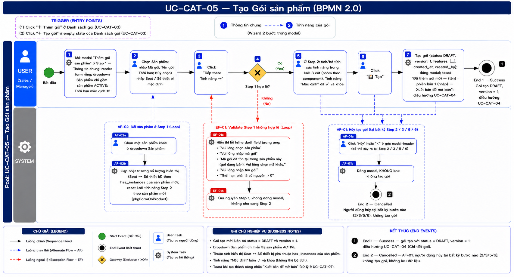
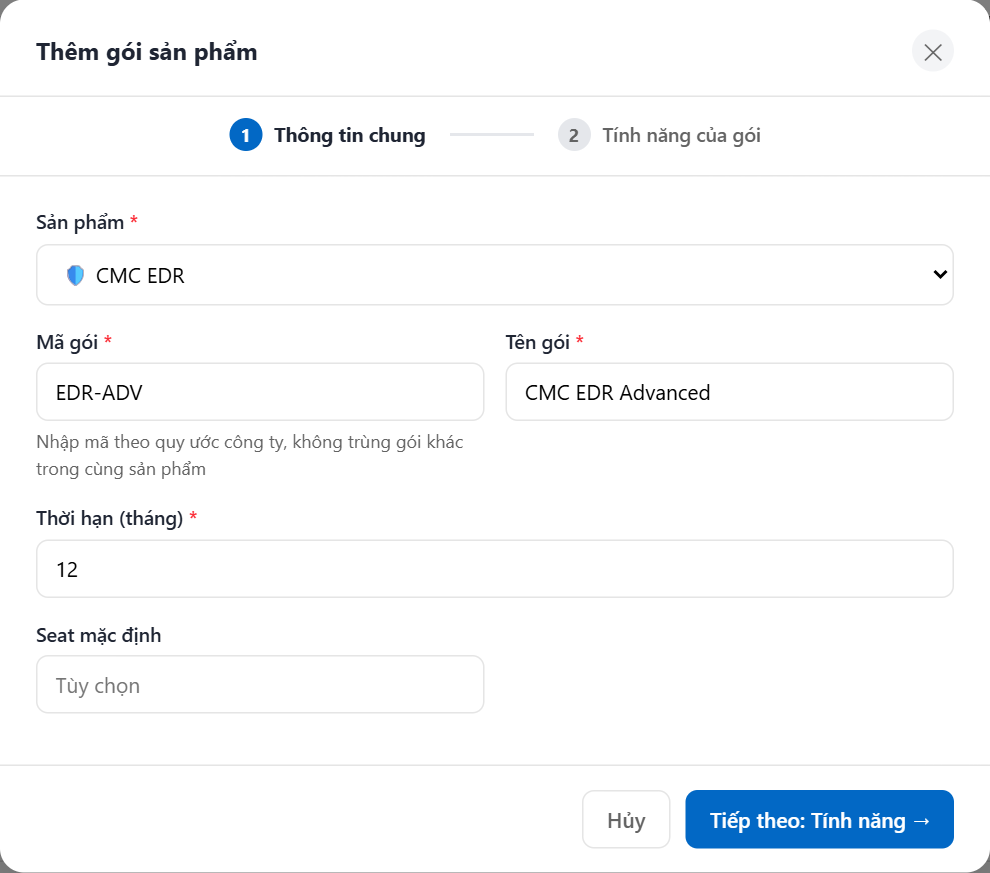
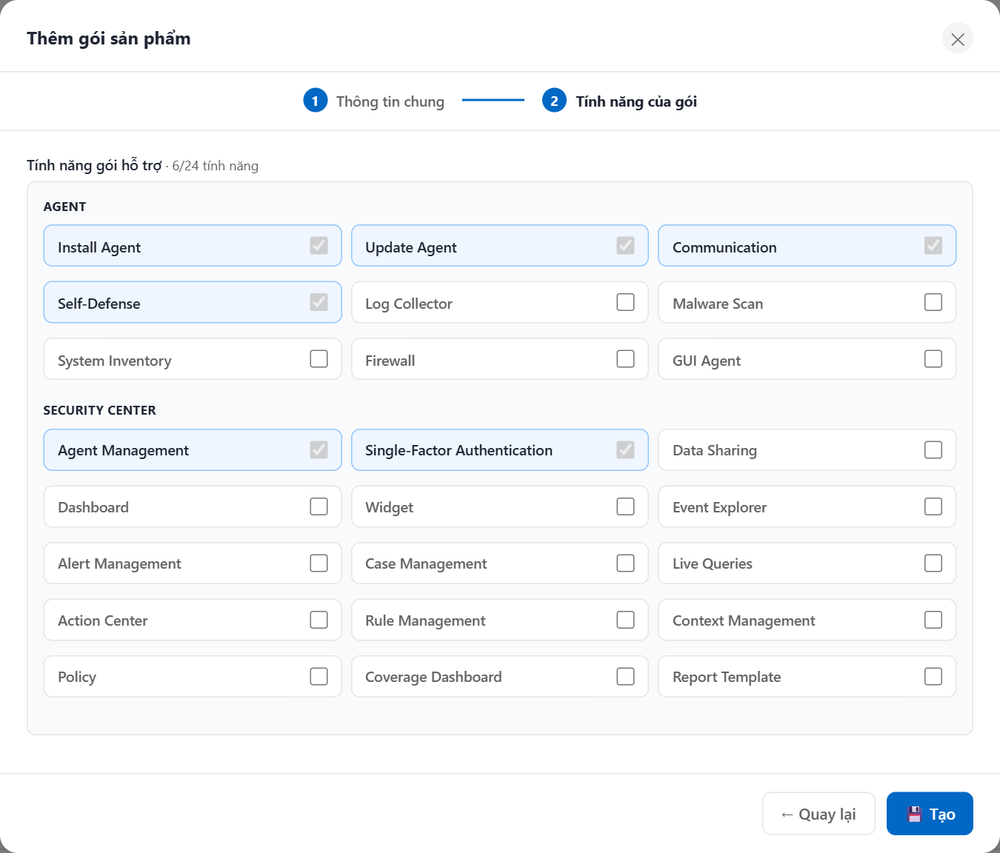

# UC-CAT-05 — Tạo Gói sản phẩm

> Module: M-04 Product & Package Catalog | Phiên bản: 1.0 | Ngày: 10/07/2026
> Trạng thái: Draft for Review

---

## 1. Thông tin chung

| Thuộc tính | Nội dung |
|---|---|
| **Mã Use Case** | UC-CAT-05 |
| **Tên** | Tạo Gói sản phẩm |
| **Mô tả** | Sales / Manager tạo mới một gói bán hàng (package) cho một sản phẩm đang hoạt động, thông qua wizard 2 bước trong modal ("Thông tin chung" → "Tính năng của gói"). Gói mới luôn được tạo ở trạng thái **Nháp (DRAFT)**, **phiên bản 1**; phải Xuất bản (UC-CAT-07) mới mở bán. |
| **Tác nhân** | Sales, Manager |
| **Tiền điều kiện** | (1) Đã đăng nhập; có quyền tạo gói (`package:create`). (2) Tồn tại ít nhất một sản phẩm ở trạng thái `ACTIVE` để gắn gói. |
| **Hậu điều kiện** | (Success) Gói mới được tạo với `status = DRAFT`, `version = 1`; modal đóng; hệ thống điều hướng sang UC-CAT-04 (Chi tiết gói) của gói vừa tạo. (Failure) Dữ liệu không thay đổi; modal giữ nguyên các giá trị đã nhập ở bước đang đứng để người dùng sửa. |
| **Ngoại lệ** | Validate Step 1 không hợp lệ (thiếu / sai field) → giữ ở Step 1, hiện lỗi inline. Mã gói trùng trong cùng sản phẩm → lỗi inline realtime. |
| **Trigger** | (1) Người dùng click nút "＋ Thêm gói" ở Danh sách gói (UC-CAT-03). (2) Người dùng click nút "＋ Tạo gói" ở empty state của Danh sách gói (UC-CAT-03). |
| **Liên kết** | UC-CAT-03 (Danh sách gói — điểm vào), UC-CAT-04 (Chi tiết gói — điều hướng sau khi tạo), UC-CAT-07 (Xuất bản gói để mở bán). |

### Business Rules

| Mã&nbsp;&nbsp; | Nội dung |
|---|---|
| **BR-01** | Mã gói (`code`) do người dùng **nhập tay** — hệ thống không tự sinh. Placeholder gợi ý "VD: EDR-STD"; hint "Nhập mã theo quy ước công ty, không trùng gói khác trong cùng sản phẩm". |
| **BR-02** | Mã gói phải **duy nhất trong phạm vi một sản phẩm** (so với các gói **chưa RETIRED** của cùng sản phẩm). Kiểm tra trùng **realtime** khi người dùng gõ. |
| **BR-03** | Mã gói **không thể thay đổi sau khi tạo**. |
| **BR-04** | Gói mới tạo luôn có `status = DRAFT` và `version = 1`. |
| **BR-05** | Dropdown Sản phẩm chỉ liệt kê sản phẩm ở trạng thái `ACTIVE`. |
| **BR-06** | Trường số lượng mặc định hiển thị theo thuộc tính `has_instances` của sản phẩm:<br>→ `has_instances = false` → hiện **Seat mặc định**.<br>→ `has_instances = true` → hiện **Số thiết bị mặc định**.<br>Cả hai đều tùy chọn. |
| **BR-07** | Khi đổi Sản phẩm ở Step 1: cập nhật lại trường số lượng (Seat / Số thiết bị) theo `has_instances` và **reset lưới tính năng** ở Step 2 (hàm `pkgFormOnProduct`). |
| **BR-08** | Thời hạn (tháng) phải là **số nguyên > 0**; mặc định 12. |
| **BR-09** | Ở Step 2, tính năng loại **"Mặc định"** luôn được tích ✓ và **khóa** (luôn bao gồm trong gói), người dùng không thể bỏ chọn. |
| **BR-10** | Chỉ khi **validate Step 1 hợp lệ** hệ thống mới cho chuyển sang Step 2. Nếu không hợp lệ → ở lại Step 1, hiện lỗi inline. |
| **BR-11** | Khi tạo thành công, gói lưu `{status: DRAFT, version: 1, features: [các key tính năng đã tích], created_at, created_by}`. |

---

## 2. Luồng nghiệp vụ



### 2.1 Luồng chính

> Trigger (click "＋ Thêm gói" / "＋ Tạo gói" ở UC-CAT-03) là **điểm vào**, không đánh số bước. Modal là **wizard 2 bước**: header cố định chứa stepper (① Thông tin chung — ② Tính năng của gói), `modal-body` chỉ đổi content theo step. Bước **4** là Gateway (XOR) tại điểm validate Step 1.

| Bước | Tác nhân | Hành động / Phản hồi | Ghi chú |
|---|---|---|---|
| **1** | System | Mở modal "Thêm gói sản phẩm" ở **Step 1 — Thông tin chung**; render form rỗng; nạp dropdown Sản phẩm chỉ gồm sản phẩm `ACTIVE`; Thời hạn mặc định 12. | BR-05, BR-08 (`pkgOpenCreate`, `pkgRenderForm`, `pkgFormShowStep`) |
| **2** | Người dùng | Chọn Sản phẩm; nhập Mã gói, Tên gói, Thời hạn; *(tùy chọn)* nhập Seat / Số thiết bị mặc định theo trường đang hiển thị. | BR-01, BR-06; đổi sản phẩm → **AF-02** |
| **3** | Người dùng | Click "Tiếp theo: Tính năng →". | Click "Hủy" / ✕ bất kỳ lúc nào → **AF-01** |
| **4** | System | **[Gateway — Step 1 hợp lệ?]**<br>→ [Có]: chuyển sang **Step 2 — Tính năng của gói**; render lưới tính năng theo sản phẩm.<br>→ [Không]: giữ ở Step 1, hiện lỗi inline; người dùng sửa rồi click lại "Tiếp theo" (**EF-01**, vòng lặp). | BR-10 (`pkgFormNext`, `pkgValidateStep1`) |
| **5** | Người dùng | Ở Step 2: tích/bỏ tích các tính năng trong lưới 3 cột (nhóm theo component). Tính năng "Mặc định" đã ✓ và khóa, không bỏ được. | BR-09 |
| **6** | Người dùng | Click "💾 Tạo". | Click "← Quay lại" → về Step 1 (giữ dữ liệu); "Hủy" / ✕ → **AF-01** |
| **7** | System | Tạo gói `{status: DRAFT, version: 1, features: [...], created_at, created_by}`; đóng modal; toast "Đã thêm gói mới — {tên} · phiên bản 1 (nháp) — Xuất bản để mở bán"; điều hướng sang UC-CAT-04 (Chi tiết gói) của gói vừa tạo. | BR-04, BR-11 (`pkgSubmitForm`) |
| → | — | **End 1 (Success)** — gói tạo với `status = DRAFT`, `version = 1`; điều hướng UC-CAT-04. | — |

### 2.2 Luồng phụ

**[AF-01: Hủy tạo gói]** — kích hoạt tại bất kỳ bước nào (2–6) khi người dùng click "Hủy" hoặc ✕.

| Bước | Tác nhân | Hành động / Phản hồi |
|---|---|---|
| **AF-01a** | Người dùng | Click "Hủy" hoặc ✕ ở góc modal-header. |
| **AF-01b** | System | Đóng modal, **không lưu**; không tạo gói. |
| → | — | **End 2 (Cancelled)** — dữ liệu không thay đổi. |

**[AF-02: Đổi sản phẩm ở Step 1]** — kích hoạt tại bước 2 khi người dùng chọn lại sản phẩm khác.

| Bước | Tác nhân | Hành động / Phản hồi |
|---|---|---|
| **AF-02a** | Người dùng | Chọn một sản phẩm khác ở dropdown Sản phẩm. |
| **AF-02b** | System | Cập nhật trường số lượng hiển thị (Seat ↔ Số thiết bị) theo `has_instances` của sản phẩm mới; **reset lưới tính năng** Step 2 theo sản phẩm mới (`pkgFormOnProduct`). |
| → | — | Tiếp tục luồng chính từ **bước 2**. |

### 2.3 Luồng ngoại lệ

**[EF-01: Validate Step 1 — không hợp lệ]** — kích hoạt tại **bước 4** (Gateway) khi Step 1 vi phạm ràng buộc. Lỗi hiển thị inline, giữ modal ở Step 1; người dùng sửa rồi click lại "Tiếp theo" (**quay bước 3**). Đây là **vòng lặp sửa lỗi, không phải End Event**.

| Mã | Điều kiện | Thông báo lỗi inline |
|---|---|---|
| **EF-01a** | Chưa chọn Sản phẩm | "Vui lòng chọn sản phẩm" — dưới dropdown Sản phẩm |
| **EF-01b** | Chưa nhập Mã gói | "Vui lòng nhập mã gói" — dưới field Mã gói |
| **EF-01c** | Mã gói trùng (realtime, trong cùng sản phẩm, bản chưa RETIRED) | "Mã gói đã tồn tại trong sản phẩm này (gói đang bán). Vui lòng chọn mã khác." — dưới field Mã gói |
| **EF-01d** | Chưa nhập Tên gói | "Vui lòng nhập tên gói" — dưới field Tên gói |
| **EF-01e** | Thời hạn không phải số nguyên > 0 | "Thời hạn phải là số nguyên > 0" — dưới field Thời hạn |

Với mọi EF-01: System giữ nguyên Step 1, không đóng modal, không cho sang Step 2. Người dùng sửa rồi click "Tiếp theo" lại → **quay bước 3** (không kết thúc luồng).

### 2.4 Điểm kết thúc (End Events)

| # | Tên | Điều kiện |
|---|---|---|
| **End 1** | Success — Tạo thành công | Gói tạo với `status = DRAFT`, `version = 1`; modal đóng; toast "Đã thêm gói mới — {tên} · phiên bản 1 (nháp) — Xuất bản để mở bán"; điều hướng UC-CAT-04 |
| **End 2** | Cancelled — AF-01 | Người dùng click "Hủy" / ✕ tại bất kỳ bước nào (2–6); không tạo gói; dữ liệu không thay đổi |

*Ghi chú: EF-01 (validate Step 1) là vòng lặp sửa lỗi quay về **bước 3**, không phải End Event.*

---

## 3. Mô tả giao diện

### 3.1 Wireframe

```
┌──────────────────────────────────────────────────────────┐
│ Thêm gói sản phẩm                                      ✕  │  ← modal-header
├──────────────────────────────────────────────────────────┤
│                ①━━━━━━━━━━━━━② (căn giữa)                 │  ← stepper cố định
│         Thông tin chung   Tính năng của gói               │
├──────────────────────────────────────────────────────────┤
│  STEP 1 — Thông tin chung                (modal-body)     │
│  Sản phẩm *          [ Chọn sản phẩm ACTIVE ▾ ]           │
│  Mã gói *            [ VD: EDR-STD            ]            │
│    ⓘ Nhập mã theo quy ước công ty, không trùng gói khác  │
│  Tên gói *           [ VD: CMC EDR Standard  ]            │
│  Thời hạn (tháng) *  [ 12 ]                               │
│  Seat mặc định       [    ]   (khi has_instances = false)│
│  · HOẶC ·                                                 │
│  Số thiết bị mặc định[    ]   (khi has_instances = true) │
├──────────────────────────────────────────────────────────┤
│  [ Hủy ]                       [ Tiếp theo: Tính năng → ] │  ← modal-footer
└──────────────────────────────────────────────────────────┘

┌──────────────────────────────────────────────────────────┐
│  STEP 2 — Tính năng của gói             · 6/9 tính năng   │
│  ┌─ Agent ───────────┬─ Agent ────────┬─ Security Center ┐│
│  │ Ransomware  [✓🔒] │ Firewall  [ ]  │ Dashboard  [✓]   ││  (Mặc định: ✓ + khóa)
│  │ Device Ctrl [ ]   │ Web Filter[✓]  │ Report     [ ]   ││
│  └───────────────────┴────────────────┴──────────────────┘│
├──────────────────────────────────────────────────────────┤
│  [ ← Quay lại ]                              [ 💾 Tạo ]   │
└──────────────────────────────────────────────────────────┘
```

> **Demo HTML:** [docs/demo/v2.5.0_catalog.html](../../demo/v2.5.0_catalog.html) — hàm `pkgOpenCreate`, `pkgRenderForm`, `pkgFormShowStep`, `pkgFormNext`, `pkgValidateStep1`, `pkgCheckCode`, `pkgFormOnProduct`, `pkgSubmitForm`.

**Screenshot — Bước 1 — Thông tin chung:**



**Screenshot — Bước 2 — Tính năng của gói:**



### 3.2 Các thành phần giao diện

#### Khung modal

| # | Thành phần | Loại | Mô tả |
|---|---|---|---|
| 1 | Tiêu đề modal | Heading | "Thêm gói sản phẩm" ở `modal-header`, kèm nút ✕ đóng. |
| 2 | Nút ✕ | Icon button | Đóng modal, không lưu (**AF-01** → End 2). |
| 3 | Stepper 2 bước | Stepper | Vùng header cố định, căn giữa: **① Thông tin chung** — **② Tính năng của gói**. Bước đang đứng được highlight. |
| 4 | Vùng nội dung | Body | `modal-body` — chỉ đổi content theo step (Step 1 / Step 2), cuộn một lần. |
| 5 | Footer | Footer | `modal-footer` — đổi bộ nút theo step (xem §3.4). |

#### Step 1 — Thông tin chung

| # | Thành phần | Loại | Mô tả |
|---|---|---|---|
| 6 | Sản phẩm | Dropdown | Chỉ liệt kê sản phẩm `ACTIVE` (BR-05). Đổi lựa chọn → cập nhật trường số lượng + reset lưới tính năng (`pkgFormOnProduct`, BR-07). |
| 7 | Mã gói | Text input | Nhập tay (BR-01). Placeholder "VD: EDR-STD"; hint "Nhập mã theo quy ước công ty, không trùng gói khác trong cùng sản phẩm". Check trùng realtime (`pkgCheckCode`, BR-02). |
| 8 | Tên gói | Text input | Placeholder "VD: CMC EDR Standard". |
| 9 | Thời hạn (tháng) | Number input | Số nguyên > 0, mặc định 12 (BR-08). |
| 10 | Seat mặc định | Number input | Chỉ hiện khi sản phẩm `has_instances = false`. Tùy chọn (BR-06). |
| 11 | Số thiết bị mặc định | Number input | Chỉ hiện khi sản phẩm `has_instances = true`. Tùy chọn (BR-06). |

#### Step 2 — Tính năng của gói

| # | Thành phần | Loại | Mô tả |
|---|---|---|---|
| 12 | Lưới tính năng | Grid 3 cột | Nhóm theo component (Agent / Security Center). Mỗi ô: **tên tính năng trước · checkbox sau**. |
| 13 | Tính năng "Mặc định" | Checkbox khóa | Luôn ✓ và **khóa** — không thể bỏ chọn (BR-09). |
| 14 | Counter tính năng | Text | Hiển thị "· {X}/{Y} tính năng" — cập nhật theo số ô đã tích. |

#### 3.3 Các field trong form

| # | Field | Bắt buộc | Điều kiện hiển thị | Validation |
|---|---|---|---|---|
| 1 | **Sản phẩm** | ✓ | Step 1, luôn hiện | Chỉ chọn sản phẩm `ACTIVE`. Bỏ trống khi qua bước → lỗi "Vui lòng chọn sản phẩm". |
| 2 | **Mã gói** | ✓ | Step 1, luôn hiện | Nhập tay. **Không thể thay đổi sau khi tạo** (BR-03). Trùng trong cùng sản phẩm (bản chưa RETIRED) → lỗi realtime "Mã gói đã tồn tại trong sản phẩm này (gói đang bán). Vui lòng chọn mã khác." Bỏ trống khi qua bước → "Vui lòng nhập mã gói". |
| 3 | **Tên gói** | ✓ | Step 1, luôn hiện | Bỏ trống → lỗi "Vui lòng nhập tên gói". |
| 4 | **Thời hạn (tháng)** | ✓ | Step 1, luôn hiện | Số nguyên > 0, mặc định 12. Sai → "Thời hạn phải là số nguyên > 0". |
| 5 | **Seat mặc định** | — | Step 1, khi `has_instances = false` | Tùy chọn. Không validate bắt buộc. |
| 6 | **Số thiết bị mặc định** | — | Step 1, khi `has_instances = true` | Tùy chọn. Không validate bắt buộc. |
| 7 | **Tính năng của gói** | — | Step 2, luôn hiện | Tích/bỏ tích tự do; tính năng "Mặc định" luôn ✓ và khóa (BR-09). Không có ràng buộc số lượng tối thiểu. |

#### 3.4 Footer modal (theo step)

| Step | Nút | Loại | Hành động |
|---|---|---|---|
| Step 1 | Hủy | Ghost button | Đóng modal, không lưu (**AF-01** → End 2). |
| Step 1 | Tiếp theo: Tính năng → | Primary button | Chạy validate Step 1 (`pkgValidateStep1`): hợp lệ → sang Step 2 (**bước 4 [Có]**); không hợp lệ → ở lại Step 1, lỗi inline (**EF-01**). |
| Step 2 | ← Quay lại | Ghost button | Về Step 1, giữ nguyên dữ liệu đã nhập. |
| Step 2 | 💾 Tạo | Primary button | Tạo gói `DRAFT` version 1, đóng modal, điều hướng UC-CAT-04 (**bước 7** → End 1). |

---

## 4. Acceptance Criteria

### Nhóm 1: Mở modal & wizard

| Mã | Given | When | Then |
|---|---|---|---|
| AC-CAT-05-01 | Người dùng đang ở Danh sách gói (UC-CAT-03). | Click "＋ Thêm gói". | **Bước 1**: Modal "Thêm gói sản phẩm" mở ở Step 1; form rỗng; stepper highlight ①; Thời hạn mặc định 12; dropdown Sản phẩm chỉ gồm sản phẩm `ACTIVE`. |
| AC-CAT-05-02 | Danh sách gói đang ở empty state. | Click "＋ Tạo gói" ở empty state. | Modal mở ở Step 1, giống AC-CAT-05-01. |
| AC-CAT-05-03 | Đang ở Step 1, đã nhập một số field. | Click "Hủy" hoặc ✕ (**AF-01**). | Modal đóng, không lưu; không tạo gói. Kết thúc tại **End 2 (Cancelled)**. |
| AC-CAT-05-04 | Đang ở Step 2. | Click "← Quay lại". | Về Step 1, giữ nguyên các giá trị đã nhập; stepper highlight ①. |

### Nhóm 2: Sản phẩm & trường số lượng (BR-05, BR-06, BR-07)

| Mã | Given | When | Then |
|---|---|---|---|
| AC-CAT-05-05 | Có sản phẩm `ACTIVE` và sản phẩm không `ACTIVE`. | Mở dropdown Sản phẩm. | Chỉ liệt kê sản phẩm `ACTIVE` (BR-05). |
| AC-CAT-05-06 | Chọn sản phẩm có `has_instances = false`. | Xem trường số lượng. | Hiện **Seat mặc định**; ẩn Số thiết bị mặc định (BR-06). |
| AC-CAT-05-07 | Chọn sản phẩm có `has_instances = true`. | Xem trường số lượng. | Hiện **Số thiết bị mặc định**; ẩn Seat mặc định (BR-06). |
| AC-CAT-05-08 | Đã chọn sản phẩm A, đã tích vài tính năng ở Step 2. | Quay lại Step 1 và đổi sang sản phẩm B (**AF-02**). | Trường số lượng cập nhật theo `has_instances` của B; **lưới tính năng Step 2 reset** theo B (BR-07). |

### Nhóm 3: Validate Step 1 (BR-08, BR-10, EF-01)

| Mã | Given | When | Then |
|---|---|---|---|
| AC-CAT-05-09 | Step 1 chưa chọn Sản phẩm. | Click "Tiếp theo: Tính năng →". | Gateway **bước 4 [Không]** → **EF-01a**: lỗi inline "Vui lòng chọn sản phẩm"; ở lại Step 1, không sang Step 2. |
| AC-CAT-05-10 | Step 1 chưa nhập Mã gói. | Click "Tiếp theo". | **EF-01b**: lỗi inline "Vui lòng nhập mã gói"; ở lại Step 1. |
| AC-CAT-05-11 | Step 1 chưa nhập Tên gói. | Click "Tiếp theo". | **EF-01d**: lỗi inline "Vui lòng nhập tên gói"; ở lại Step 1. |
| AC-CAT-05-12 | Step 1, Thời hạn = 0 (hoặc để trống / số âm / số thập phân). | Click "Tiếp theo". | **EF-01e**: lỗi inline "Thời hạn phải là số nguyên > 0"; ở lại Step 1. |
| AC-CAT-05-13 | Step 1 đầy đủ và hợp lệ. | Click "Tiếp theo". | Gateway **bước 4 [Có]** → sang Step 2; lưới tính năng render theo sản phẩm; stepper highlight ②. |

### Nhóm 4: Mã gói nhập tay & trùng mã (BR-01, BR-02, BR-03)

| Mã | Given | When | Then |
|---|---|---|---|
| AC-CAT-05-14 | Trường Mã gói. | Quan sát field. | Field cho nhập tay (không tự sinh); placeholder "VD: EDR-STD"; hint "Nhập mã theo quy ước công ty, không trùng gói khác trong cùng sản phẩm" (BR-01). |
| AC-CAT-05-15 | Sản phẩm CMC EDR đã có gói mã "EDR-STD" (chưa RETIRED). | Gõ "EDR-STD" vào Mã gói cho cùng sản phẩm CMC EDR. | Check trùng realtime → lỗi inline "Mã gói đã tồn tại trong sản phẩm này (gói đang bán). Vui lòng chọn mã khác." (BR-02, EF-01c). |
| AC-CAT-05-16 | Sản phẩm CMC EDR có gói "EDR-STD" nhưng bản đó đã RETIRED. | Gõ "EDR-STD" cho sản phẩm CMC EDR. | Không báo trùng — mã trùng chỉ tính trên các bản **chưa RETIRED** (BR-02). |
| AC-CAT-05-17 | Cùng mã "EDR-STD" đã dùng ở sản phẩm khác. | Gõ "EDR-STD" cho sản phẩm CMC EDR (chưa có mã này). | Không báo trùng — mã chỉ cần duy nhất trong **cùng một sản phẩm** (BR-02). |

### Nhóm 5: Tính năng gói (BR-09)

| Mã | Given | When | Then |
|---|---|---|---|
| AC-CAT-05-18 | Đang ở Step 2. | Xem lưới tính năng. | Lưới 3 cột nhóm theo component (Agent / Security Center); mỗi ô: tên trước · checkbox sau; counter "· {X}/{Y} tính năng". |
| AC-CAT-05-19 | Có tính năng loại "Mặc định". | Thử bỏ tích tính năng "Mặc định". | Tính năng "Mặc định" luôn ✓ và **khóa**, không bỏ chọn được (BR-09). |
| AC-CAT-05-20 | Tích thêm 2 tính năng tùy chọn. | Quan sát counter. | Counter cập nhật số "· {X}/{Y} tính năng" tương ứng. |

### Nhóm 6: Tạo thành công (BR-04, BR-11)

| Mã | Given | When | Then |
|---|---|---|---|
| AC-CAT-05-21 | Step 1 hợp lệ, ở Step 2 đã chọn tính năng. | Click "💾 Tạo". | **Bước 7**: gói tạo với `status = DRAFT`, `version = 1`, `features = [các key đã tích]`, kèm `created_at`, `created_by`; modal đóng (BR-04, BR-11). |
| AC-CAT-05-22 | Gói vừa tạo thành công. | Sau khi nhấn "💾 Tạo" hợp lệ. | Toast "Đã thêm gói mới — {tên} · phiên bản 1 (nháp) — Xuất bản để mở bán"; điều hướng sang UC-CAT-04 (Chi tiết gói) của gói vừa tạo. Kết thúc tại **End 1 (Success)**. |
| AC-CAT-05-23 | Gói vừa tạo. | Xem Chi tiết gói (UC-CAT-04). | Badge trạng thái "Draft", phiên bản "v1"; mã gói, tên gói, thời hạn, số lượng, danh sách tính năng khớp với dữ liệu đã nhập. Gói chưa mở bán — cần Xuất bản (UC-CAT-07). |

### Nhóm 7: Phân quyền

| Mã | Given | When | Then |
|---|---|---|---|
| AC-CAT-05-24 | Người dùng **không** có quyền `package:create`. | Xem Danh sách gói (UC-CAT-03). | Không thấy / không thao tác được nút "＋ Thêm gói"; không mở được modal Tạo gói. |
| AC-CAT-05-25 | Người dùng là Sales / Manager có quyền `package:create`. | Click "＋ Thêm gói". | Modal Tạo gói mở bình thường (**bước 1**). |

---

## 5. Lịch sử thay đổi

| Phiên bản | Ngày | Người cập nhật | Nội dung |
|---|---|---|---|
| 1.0 | 10/07/2026 | BA Team | Khởi tạo tài liệu — Draft for Review. Đặc tả màn Tạo gói (wizard 2 bước): Step 1 Thông tin chung (Sản phẩm ACTIVE, Mã gói nhập tay + unique trong sản phẩm + không đổi sau khi tạo, Tên gói, Thời hạn, Seat/Số thiết bị theo `has_instances`) · Step 2 Tính năng (lưới 3 cột, tính năng Mặc định khóa) · gateway validate Step 1 · tạo gói DRAFT version 1 → điều hướng UC-CAT-04 + toast. Đồng bộ demo v2.5.0 (`pkgOpenCreate`, `pkgValidateStep1`, `pkgCheckCode`, `pkgFormOnProduct`, `pkgSubmitForm`). |
| 1.1 | 10/07/2026 | Claude (AI) | Nhúng ảnh BPMN; đối chiếu §2 ↔ BPMN: **khớp hoàn toàn** (7 step, gateway ④ "Step 1 hợp lệ?", AF-01 Hủy / AF-02 đổi sản phẩm, EF-01 validate loop, End 1 Success / End 2 Cancelled) — không cần sửa luồng. Gỡ ghi chú placeholder. |

### Review Checklist (self-review)

> Claude tự review — đánh dấu ✅/❌ trước khi submit cho BA review.

**Nghiệp vụ**
- ✅ Luồng chính 7 bước bao phủ happy path end-to-end (wizard 2 bước), gateway validate ở bước 4
- ✅ Luồng phụ: AF-01 (Hủy), AF-02 (đổi sản phẩm → reset trường số lượng + lưới tính năng)
- ✅ Luồng ngoại lệ EF-01 (validate Step 1) gom về bước 4, là vòng lặp quay bước 3 — không phải End Event
- ✅ §2.4 End Events: End 1 (Success → UC-CAT-04), End 2 (Cancelled)
- ✅ BR đã định nghĩa rõ (BR-01..BR-11); mã nhập tay + unique trong sản phẩm + không đổi sau khi tạo; DRAFT v1; tính năng Mặc định khóa
- ✅ AC bao phủ 7 nhóm, 25 AC (happy + validate + trùng mã + phân quyền), có tham chiếu bước/End Event

**Giao diện**
- ✅ Wireframe ASCII cho cả Step 1 và Step 2 + footer đổi theo step
- ✅ §3.3 bảng field đủ cột (# · Field · Bắt buộc · Điều kiện hiển thị · Validation), text lỗi khớp demo
- ✅ Field Mã gói ghi rõ "Không thể thay đổi sau khi tạo"
- ✅ Điều kiện hiển thị Seat/Số thiết bị theo `has_instances`
- ✅ Tên nút đúng UI kèm icon: "Hủy", "Tiếp theo: Tính năng →", "← Quay lại", "💾 Tạo"; toast khớp demo
- ✅ Screenshot + ảnh BPMN đã chèn; §2 đã đối chiếu khớp BPMN (7 step, gateway ④, AF-01/02, EF-01, End 1–2)
