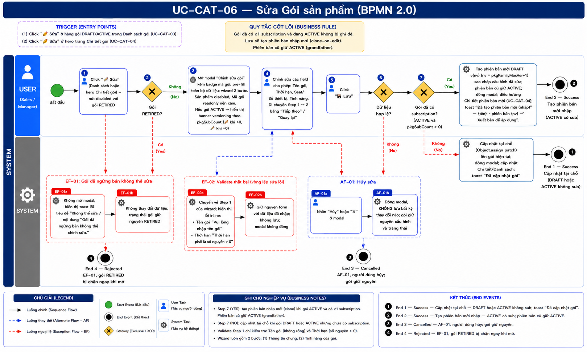
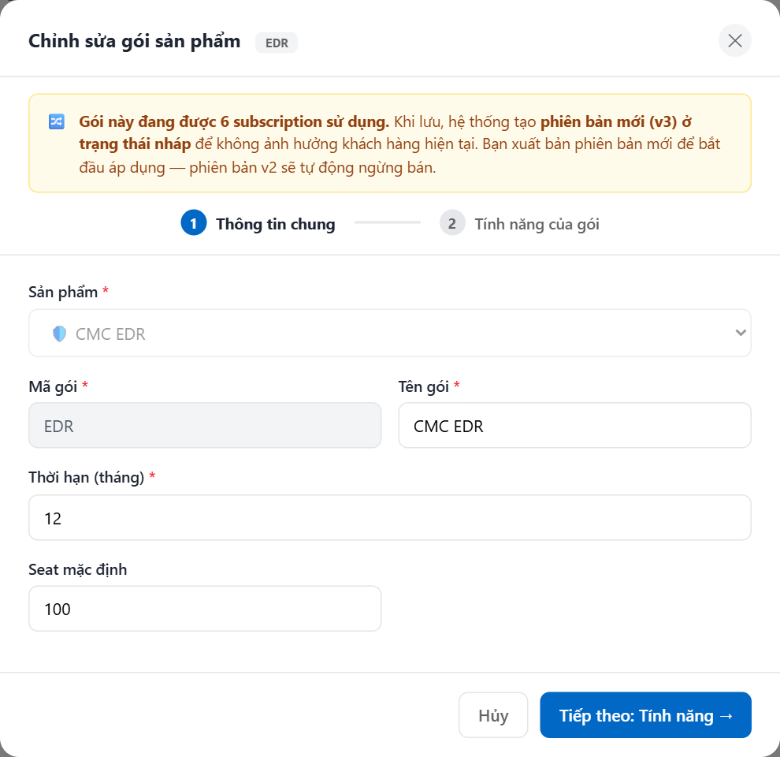

# UC-CAT-06 — Sửa Gói sản phẩm

> Module: M-04 Product & Package Catalog | Phiên bản: 1.0 | Ngày: 10/07/2026
> Trạng thái: Draft for Review

---

## 1. Thông tin chung

| Thuộc tính | Nội dung |
|---|---|
| **Mã Use Case** | UC-CAT-06 |
| **Tên** | Sửa Gói sản phẩm |
| **Mô tả** | Sales / Manager chỉnh sửa một gói bán hàng (package). Áp dụng nguyên tắc **"gói bất biến kể từ khi có subscription đầu tiên"**: nếu gói đã có subscription đang dùng thì mọi thay đổi **tạo phiên bản mới (nháp)** thay vì sửa đè bản đang bán — khách hàng hiện tại (grandfather) được giữ nguyên trên phiên bản cũ. Gói `DRAFT` hoặc gói `ACTIVE` chưa có subscription được cập nhật trực tiếp tại chỗ. |
| **Tác nhân** | Sales, Manager |
| **Tiền điều kiện** | (1) Đã đăng nhập; có quyền sửa gói trong catalog. (2) Gói tồn tại và `package.status ≠ RETIRED` (gói đã ngừng bán không thể chỉnh sửa). |
| **Hậu điều kiện** | (Success) Với gói `DRAFT`/`ACTIVE`-chưa-có-sub: thay đổi được cập nhật trực tiếp trên gói hiện tại; toast "Đã cập nhật gói"; cập nhật Chi tiết/Danh sách. Với gói `ACTIVE`-đã-có-sub: hệ thống tạo **phiên bản mới ở trạng thái nháp** (`DRAFT` `v{nv}`) sao chép cấu hình đã sửa; phiên bản cũ giữ nguyên `ACTIVE`; điều hướng sang Chi tiết phiên bản mới. (Failure) Dữ liệu không thay đổi; form giữ nguyên giá trị đã nhập kèm thông báo lỗi; hoặc gói `RETIRED` bị chặn ngay khi mở. |
| **Ngoại lệ** | (1) Gói `RETIRED` → chặn mở form + toast lỗi. (2) Validate thất bại (Tên gói trống / Thời hạn không hợp lệ) → lỗi inline, không lưu. |
| **Trigger** | (1) Click nút "✏️ Sửa" ở hàng gói `DRAFT`/`ACTIVE` trong Danh sách gói (UC-CAT-03). (2) Click nút "✏️ Sửa" ở hero trang Chi tiết gói (UC-CAT-04). |
| **Liên kết** | UC-CAT-03 (Danh sách gói), UC-CAT-04 (Chi tiết gói — quay lại / điều hướng sau khi lưu), UC-CAT-05 (Tạo gói — cùng wizard 2 bước), UC-CAT-07 (Xuất bản phiên bản mới). |

### Business Rules

| Mã&nbsp;&nbsp;&nbsp; | Nội dung |
|---|---|
| **BR-01** | Gói `RETIRED` **không thể chỉnh sửa**. Khi cố mở form, hệ thống chặn và hiển thị toast lỗi tiêu đề "Không thể sửa" / nội dung "Gói đã ngừng bán không thể chỉnh sửa." Nút "✏️ Sửa" ở Danh sách và hero Chi tiết cũng ở trạng thái `disabled` với gói `RETIRED`. |
| **BR-02** | Hai trường **không thể thay đổi sau khi tạo**: Sản phẩm (`package.product_id`) — danh sách chọn `disabled`; Mã gói (`package.code`) — `readonly`, nền xám. |
| **BR-03** | **Cập nhật tại chỗ** khi gói `DRAFT`, HOẶC gói `ACTIVE` mà chưa có subscription nào (`pkgSubCount = 0`) — coi như "chưa bị khóa". Hệ thống ghi đè cấu hình đã sửa trực tiếp lên gói hiện tại (`Object.assign` patch), không tạo phiên bản mới. |
| **BR-04** | **Tạo phiên bản mới (nháp)** khi gói `ACTIVE` **VÀ** đã có ≥1 subscription (`pkgSubCount > 0`). Hệ thống tạo bản ghi mới `status = DRAFT`, `version = pkgFamilyMaxVer + 1`, sao chép cấu hình đã sửa (cùng `product_id` + `code`). **Không** sửa đè bản đang bán — phiên bản cũ giữ nguyên `ACTIVE` để các subscription hiện tại tiếp tục hoạt động (grandfather). |
| **BR-05** | Phiên bản mới nháp tạo ở BR-04 phải được **Xuất bản** (UC-CAT-07) mới có hiệu lực áp dụng. Khi xuất bản, phiên bản `v{version}` cũ sẽ **tự động ngừng bán** (`RETIRED`). |
| **BR-06** | **Banner versioning** chỉ hiển thị khi gói đang sửa có `status = ACTIVE`:<br>— Nếu `pkgSubCount > 0`: banner 🔀 "Gói này đang được {sc} subscription sử dụng. Khi lưu, hệ thống tạo **phiên bản mới (v{version+1}) ở trạng thái nháp** để không ảnh hưởng khách hàng hiện tại. Bạn xuất bản phiên bản mới để bắt đầu áp dụng — phiên bản v{version} sẽ tự động ngừng bán."<br>— Nếu `pkgSubCount = 0`: banner ✏️ "Gói này chưa có subscription nào. Thay đổi được cập nhật trực tiếp trên gói hiện tại, không tạo phiên bản mới."<br>— Gói `DRAFT`: không hiển thị banner. |
| **BR-07** | Validate step 1 (giống UC-CAT-05 Tạo gói): Tên gói bắt buộc — lỗi "Vui lòng nhập tên gói"; Thời hạn (tháng) là số nguyên > 0 — lỗi "Thời hạn phải là số nguyên > 0". Sản phẩm và Mã gói `readonly` nên bỏ qua kiểm tra. |
| **BR-08** | Form sửa dùng chung **wizard 2 bước** với Tạo gói: bước 1 "Thông tin chung", bước 2 "Tính năng của gói"; **pre-fill toàn bộ dữ liệu hiện tại** của gói. |
| **BR-09** | Chỉ **Sales** và **Manager** được thực hiện chức năng sửa gói. |

---

## 2. Luồng nghiệp vụ



> ⏳ Ảnh BPMN sẽ được sinh sau — path theo convention, file chưa tồn tại.

### 2.1 Luồng chính

> Số bước khớp badge trong ảnh BPMN. Bước **2** (pre-check RETIRED), **6** (validate) và **7** (clone-on-edit) là Gateway (XOR). Gateway **7** là điểm quyết định versioning fan ra 2 End Event.

| Bước | Tác nhân | Hành động / Phản hồi | Ghi chú |
|---|---|---|---|
| **1** | Người dùng (Sales / Manager) | Click "✏️ Sửa" ở hàng gói `DRAFT`/`ACTIVE` trong Danh sách (UC-CAT-03), HOẶC "✏️ Sửa" ở hero Chi tiết gói (UC-CAT-04). | Nút `disabled` với gói `RETIRED` — BR-01, BR-09 |
| **2** | System | **[Gateway — Gói `RETIRED`?]**<br>→ [Có]: **EF-01** (chặn + toast).<br>→ [Không]: tiếp bước 3. | `pkgOpenEdit` pre-check — BR-01 |
| **3** | System | Mở modal "Chỉnh sửa gói sản phẩm" kèm **badge mã gói** ở tiêu đề; pre-fill toàn bộ dữ liệu hiện tại; wizard 2 bước (Thông tin chung / Tính năng của gói). Sản phẩm `disabled`, Mã gói `readonly` nền xám. Nếu gói `ACTIVE` → hiển thị banner versioning theo `pkgSubCount` (🔀 khi >0, ✏️ khi =0). | `pkgRenderForm` — BR-02, BR-06, BR-08 |
| **4** | Người dùng | Chỉnh sửa các field cho phép: Tên gói, Thời hạn (tháng), Seat / Số thiết bị mặc định (theo `has_instances`), Tính năng của gói (lưới checkbox). Di chuyển giữa bước 1 ↔ 2 bằng "Tiếp theo: Tính năng →" / "← Quay lại". | BR-02 |
| **5** | Người dùng | Click "💾 Lưu". "Hủy" / ✕ → **AF-01**. | — |
| **6** | System | **[Gateway — Dữ liệu hợp lệ?]**<br>→ [Có]: tiếp bước 7.<br>→ [Không]: **EF-02**. | `pkgValidateStep1` — BR-07 |
| **7** | System | **[Gateway — Gói đã có subscription? (`status = ACTIVE` VÀ `pkgSubCount > 0`)]**<br>→ [Có]: tạo phiên bản mới `DRAFT` `v{nv}` (`nv = pkgFamilyMaxVer + 1`) sao chép cấu hình đã sửa; phiên bản cũ giữ `ACTIVE`; đóng modal; điều hướng Chi tiết phiên bản mới (UC-CAT-04); toast "Đã tạo phiên bản mới (nháp)" — "{tên} · phiên bản {nv} — Xuất bản để áp dụng" → **End 2**.<br>→ [Không]: cập nhật tại chỗ (`Object.assign` patch) lên gói hiện tại; đóng modal; cập nhật Chi tiết/Danh sách; toast "Đã cập nhật gói" → **End 1**. | `pkgSubmitForm` (nhánh sửa) — BR-03, BR-04, BR-05 |
| → | — | **End 1 (Success — Cập nhật tại chỗ)** hoặc **End 2 (Success — Tạo phiên bản mới nháp)** tuỳ nhánh Gateway 7. | — |

### 2.2 Luồng phụ

**[AF-01: Hủy sửa]** — kích hoạt tại bước 5 khi người dùng nhấn "Hủy" hoặc ✕.

| Bước | Tác nhân | Hành động / Phản hồi |
|---|---|---|
| **AF-01a** | Người dùng | Nhấn "Hủy" hoặc ✕ ở modal. |
| **AF-01b** | System | Đóng modal, KHÔNG lưu bất kỳ thay đổi nào; gói giữ nguyên cấu hình và trạng thái. |
| → | — | **End 3 (Cancelled)** — quay lại Danh sách (UC-CAT-03) / Chi tiết (UC-CAT-04), dữ liệu gói không đổi. |

### 2.3 Luồng ngoại lệ

**[EF-01: Gói đã ngừng bán không thể sửa]** — kích hoạt tại **bước 2** khi gói có `status = RETIRED`.

| Bước | Tác nhân | Hành động / Phản hồi |
|---|---|---|
| **EF-01a** | System | Không mở modal; hiển thị toast lỗi tiêu đề "Không thể sửa" / nội dung "Gói đã ngừng bán không thể chỉnh sửa." |
| **EF-01b** | System | Không thay đổi dữ liệu; trạng thái gói giữ nguyên `RETIRED`. |
| → | — | **End 4 (Rejected)** — kết thúc luồng. |

**[EF-02: Validate thất bại]** — kích hoạt tại **bước 6** khi Tên gói trống hoặc Thời hạn không phải số nguyên > 0.

| Bước | Tác nhân | Hành động / Phản hồi |
|---|---|---|
| **EF-02a** | System | Chuyển về bước 1 của wizard (Thông tin chung); hiển thị lỗi inline bên dưới field không hợp lệ: Tên gói "Vui lòng nhập tên gói"; Thời hạn "Thời hạn phải là số nguyên > 0" (BR-07). |
| **EF-02b** | System | Giữ nguyên form với dữ liệu đã nhập; không lưu; modal không đóng. |
| → | — | Sửa lỗi rồi Lưu lại → **quay bước 5** (KHÔNG phải End Event). |

### 2.4 Điểm kết thúc (End Events)

| # | Tên | Điều kiện |
|---|---|---|
| **End 1** | Success — Cập nhật tại chỗ | Gói `DRAFT`, HOẶC `ACTIVE` & `pkgSubCount = 0`; cấu hình được ghi đè trực tiếp; toast "Đã cập nhật gói"; Chi tiết/Danh sách cập nhật in-place (BR-03) |
| **End 2** | Success — Tạo phiên bản mới nháp | Gói `ACTIVE` & `pkgSubCount > 0`; tạo bản `DRAFT` `v{nv}` sao chép cấu hình đã sửa; phiên bản cũ giữ `ACTIVE`; điều hướng Chi tiết phiên bản mới; toast "Đã tạo phiên bản mới (nháp) — {tên} · phiên bản {nv} — Xuất bản để áp dụng" (BR-04, BR-05) |
| **End 3** | Cancelled — AF-01 | Người dùng nhấn "Hủy" / ✕; modal đóng, không lưu; gói giữ nguyên |
| **End 4** | Rejected — EF-01 | Gói `RETIRED` tại pre-check (bước 2); modal không mở; toast "Không thể sửa" |

---

## 3. Mô tả giao diện

### 3.1 Wireframe

```
┌──────────────────────────────────────────────────────────────┐
│  Chỉnh sửa gói sản phẩm   [EDR-PRO]                        ✕ │
├──────────────────────────────────────────────────────────────┤
│  🔀 Gói này đang được 8 subscription sử dụng. Khi lưu, hệ    │  ← banner chỉ khi ACTIVE
│     thống tạo phiên bản mới (v3) ở trạng thái nháp để không   │    (sc>0: 🔀 / sc=0: ✏️)
│     ảnh hưởng khách hàng hiện tại...                          │
├──────────────────────────────────────────────────────────────┤
│        (1) Thông tin chung ─────── (2) Tính năng của gói      │  ← step nav
├──────────────────────────────────────────────────────────────┤
│  ── BƯỚC 1: THÔNG TIN CHUNG ─────────────────────────────    │
│  Sản phẩm *                                                  │
│  [🛡️ CMC EDR                                    ▼] (disabled)│
│                                                              │
│  Mã gói *                       Tên gói *                    │
│  [EDR-PRO           ] (readonly) [EDR Pro                  ] │
│                                                              │
│  Thời hạn (tháng) *                                          │
│  [12                                                       ] │
│                                                              │
│  Seat mặc định            (hoặc)   Số thiết bị mặc định      │  ← theo has_instances
│  [100                  ]           [—                      ] │
├──────────────────────────────────────────────────────────────┤
│                        [Hủy]        [Tiếp theo: Tính năng →] │
└──────────────────────────────────────────────────────────────┘

┌──────────────────────────────────────────────────────────────┐
│  ── BƯỚC 2: TÍNH NĂNG CỦA GÓI ──────────  · 12/20 tính năng  │
│  ┌─ COMPONENT A ─────────────────────────────────────────┐  │
│  │ [✓] Feature 1   [✓] Feature 2   [ ] Feature 3          │  │
│  └───────────────────────────────────────────────────────┘  │
├──────────────────────────────────────────────────────────────┤
│                    [← Quay lại]              [💾 Lưu]         │
└──────────────────────────────────────────────────────────────┘
```

> **Demo HTML:** [docs/demo/v2.5.0_catalog.html](../../demo/v2.5.0_catalog.html) — hàm `pkgOpenEdit`, `pkgRenderForm`, `pkgSubmitForm` (nhánh sửa), `pkgSubCount`, `pkgFamilyMaxVer`, `pkgValidateStep1`.

**Screenshot — Modal Sửa gói (ACTIVE có subscription — banner tạo phiên bản mới):**



### 3.2 Các thành phần giao diện

| # | Thành phần | Loại | Mô tả |
|---|---|---|---|
| 1 | Header modal | Text + Badge | Tiêu đề "Chỉnh sửa gói sản phẩm" kèm **badge mã gói** (`package.code`, nền xám monospace). Nút ✕ đóng modal không lưu (AF-01). |
| 2 | Banner versioning | Callout box | Chỉ hiển thị khi gói `ACTIVE`. 🔀 khi `pkgSubCount > 0` (sẽ tạo phiên bản mới); ✏️ khi `pkgSubCount = 0` (cập nhật trực tiếp). Gói `DRAFT` không có banner (BR-06). |
| 3 | Step nav | Stepper | 2 bước: "Thông tin chung" (1) → "Tính năng của gói" (2). |
| 4 | Sản phẩm | Select **disabled** | Pre-fill sản phẩm hiện tại; không thể thay đổi sau khi tạo (BR-02). |
| 5 | Mã gói | Text **readonly** (nền xám) | Pre-fill mã gói; không thể thay đổi sau khi tạo (BR-02). |
| 6 | Tên gói | Text input | Sửa được. Bắt buộc (BR-07). |
| 7 | Thời hạn (tháng) | Number input | Sửa được. Số nguyên > 0 (BR-07). |
| 8 | Seat mặc định | Number input | Chỉ hiển thị khi sản phẩm `has_instances = false`. Tùy chọn. |
| 9 | Số thiết bị mặc định | Number input | Chỉ hiển thị khi sản phẩm `has_instances = true`. Tùy chọn. |
| 10 | Tính năng của gói | Lưới checkbox | Bước 2. Nhóm theo component; tính năng "Mặc định" luôn tích & khóa; các tính năng khác tích/bỏ tích. Bộ đếm "· {n}/{tot} tính năng". |
| 11 | Nút "Tiếp theo: Tính năng →" | Primary button | Bước 1 → chuyển sang bước 2 (validate step 1 trước khi qua). |
| 12 | Nút "← Quay lại" | Ghost button | Bước 2 → quay bước 1. |
| 13 | Nút "💾 Lưu" | Primary button | Gửi form lưu thay đổi (`pkgSubmitForm` nhánh sửa). Kích hoạt bước 5–7 luồng chính. |
| 14 | Nút "Hủy" | Ghost button | Bước 1. Đóng modal, không lưu (AF-01). |

### 3.3 Bảng field

| # | Field | Bắt buộc | Điều kiện hiển thị | Validation & Mô tả |
|---|---|---|---|---|
| 1 | Sản phẩm | — | Bước 1 | Danh sách chọn **disabled**. **Không thể thay đổi sau khi tạo**; pre-fill sản phẩm hiện tại (BR-02). |
| 2 | Mã gói | — | Bước 1 | **Readonly**, nền xám. **Không thể thay đổi sau khi tạo**; pre-fill mã gói (BR-02). |
| 3 | Tên gói | ✓ | Bước 1 | Sửa được; pre-fill giá trị hiện tại. Lỗi khi trống: "Vui lòng nhập tên gói" (BR-07). |
| 4 | Thời hạn (tháng) | ✓ | Bước 1 | Sửa được; số nguyên > 0. Lỗi: "Thời hạn phải là số nguyên > 0" (BR-07). |
| 5 | Seat mặc định | — | Sản phẩm `has_instances = false` | Số nguyên; tùy chọn; pre-fill giá trị hiện tại. |
| 6 | Số thiết bị mặc định | — | Sản phẩm `has_instances = true` | Số nguyên; tùy chọn; pre-fill giá trị hiện tại. |
| 7 | Tính năng của gói | — | Bước 2 | Lưới checkbox nhóm theo component; pre-fill tính năng hiện tại; tính năng "Mặc định" khóa (luôn bao gồm). |

---

## 4. Acceptance Criteria

### Nhóm 1: Mở form & pre-fill

| Mã | Given | When | Then |
|---|---|---|---|
| AC-CAT-06-01 | Gói "EDR-PRO" `status = DRAFT`. | Click "✏️ Sửa" ở hàng gói tại UC-CAT-03. | Modal "Chỉnh sửa gói sản phẩm" mở kèm badge mã gói "EDR-PRO". Wizard 2 bước; toàn bộ field pre-fill đúng giá trị hiện tại. Sản phẩm `disabled`, Mã gói `readonly` nền xám. |
| AC-CAT-06-02 | Gói `ACTIVE` mở từ hero Chi tiết gói (UC-CAT-04). | Click "✏️ Sửa" ở hero. | Modal mở với dữ liệu pre-fill; hiển thị banner versioning theo trạng thái subscription của gói (BR-06). |
| AC-CAT-06-03 | Đang mở form sửa gói bất kỳ. | Quan sát field Sản phẩm và Mã gói. | Sản phẩm là danh sách chọn `disabled`; Mã gói `readonly` nền xám — cả hai không thể chỉnh sửa (BR-02). |
| AC-CAT-06-04 | Sản phẩm của gói có `has_instances = true`. | Quan sát bước 1. | Chỉ hiển thị field "Số thiết bị mặc định", ẩn "Seat mặc định". |

### Nhóm 2: Banner versioning

| Mã | Given | When | Then |
|---|---|---|---|
| AC-CAT-06-05 | Gói `ACTIVE` `v2` đang được 8 subscription sử dụng (`pkgSubCount = 8`). | Mở form sửa. | Banner 🔀 hiển thị: "Gói này đang được 8 subscription sử dụng. Khi lưu, hệ thống tạo phiên bản mới (v3) ở trạng thái nháp... phiên bản v2 sẽ tự động ngừng bán." (BR-06). |
| AC-CAT-06-06 | Gói `ACTIVE` chưa có subscription (`pkgSubCount = 0`). | Mở form sửa. | Banner ✏️ hiển thị: "Gói này chưa có subscription nào. Thay đổi được cập nhật trực tiếp trên gói hiện tại, không tạo phiên bản mới." (BR-06). |
| AC-CAT-06-07 | Gói `DRAFT`. | Mở form sửa. | Không hiển thị banner versioning nào (BR-06). |

### Nhóm 3: Validate

| Mã | Given | When | Then |
|---|---|---|---|
| AC-CAT-06-08 | Form đang mở, người dùng xóa trắng Tên gói. | Click "💾 Lưu". | Gateway (**bước 6**) → **EF-02**: về bước 1, lỗi inline dưới Tên gói "Vui lòng nhập tên gói"; modal không đóng; sau khi sửa Lưu lại → **quay bước 5** (BR-07). |
| AC-CAT-06-09 | Người dùng nhập Thời hạn = 0 (hoặc để trống). | Click "💾 Lưu". | Gateway (**bước 6**) → **EF-02**: lỗi inline dưới Thời hạn "Thời hạn phải là số nguyên > 0"; modal không đóng (BR-07). |

### Nhóm 4: Lưu — cập nhật tại chỗ (End 1)

| Mã | Given | When | Then |
|---|---|---|---|
| AC-CAT-06-10 | Gói "EDR-PRO" `status = DRAFT`. Sửa Tên gói và Thời hạn. | Click "💾 Lưu". | Gateway **bước 7** → nhánh [Không] (chưa khóa): cập nhật tại chỗ (`Object.assign`); modal đóng; Chi tiết/Danh sách cập nhật in-place; toast "Đã cập nhật gói". Kết thúc **End 1**. |
| AC-CAT-06-11 | Gói `ACTIVE` chưa có subscription (`pkgSubCount = 0`). Sửa Tính năng của gói. | Click "💾 Lưu". | Gateway **bước 7** → nhánh [Không]: cập nhật trực tiếp trên gói hiện tại, KHÔNG tạo phiên bản mới; toast "Đã cập nhật gói". Kết thúc **End 1** (BR-03). |

### Nhóm 5: Lưu — clone-on-edit tạo phiên bản mới (End 2)

| Mã | Given | When | Then |
|---|---|---|---|
| AC-CAT-06-12 | Gói `ACTIVE` `v2` có `pkgSubCount = 8`. Sửa Tên gói và Tính năng. | Click "💾 Lưu". | Gateway **bước 7** → nhánh [Có] (đã khóa): tạo bản ghi mới `DRAFT` `v3` (`pkgFamilyMaxVer + 1`) sao chép cấu hình đã sửa; modal đóng; điều hướng Chi tiết phiên bản mới (UC-CAT-04); toast "Đã tạo phiên bản mới (nháp) — {tên} · phiên bản 3 — Xuất bản để áp dụng". Kết thúc **End 2** (BR-04). |
| AC-CAT-06-13 | Gói `ACTIVE` `v2` có 8 subscription. | Sau khi Lưu tạo phiên bản mới `v3` (nháp). | Phiên bản `v2` cũ **giữ nguyên** `ACTIVE`; 8 subscription hiện tại không bị ảnh hưởng (grandfather). Phiên bản `v3` phải Xuất bản (UC-CAT-07) mới áp dụng — khi xuất bản `v2` tự động ngừng bán (BR-04, BR-05). |

### Nhóm 6: Phân quyền & Exception

| Mã | Given | When | Then |
|---|---|---|---|
| AC-CAT-06-14 | Gói `RETIRED`. | Cố mở form sửa (nút ✏️ ở Danh sách/hero `disabled`; hoặc gọi `pkgOpenEdit` trực tiếp). | Gateway pre-check (**bước 2**) phát hiện `RETIRED` → **End 4 (EF-01)**: modal không mở; toast lỗi "Không thể sửa" / "Gói đã ngừng bán không thể chỉnh sửa." (BR-01). |
| AC-CAT-06-15 | Người dùng KHÔNG thuộc Sales / Manager. | Xem hàng gói tại UC-CAT-03. | Không có quyền thực hiện chức năng sửa gói (BR-09). |
| AC-CAT-06-16 | Form sửa đang mở, người dùng đã thay đổi vài field. | Nhấn "Hủy" hoặc ✕ (**AF-01**). | Modal đóng, KHÔNG lưu bất kỳ thay đổi nào; gói giữ nguyên cấu hình và trạng thái. Kết thúc **End 3 (Cancelled)**. |

---

## 5. Lịch sử thay đổi

| Phiên bản | Ngày | Người cập nhật | Nội dung |
|---|---|---|---|
| 1.0 | 10/07/2026 | BA Team | Khởi tạo tài liệu — Draft for Review. Đặc tả màn Sửa gói với nguyên tắc **versioning clone-on-edit**: gói `DRAFT`/`ACTIVE`-chưa-có-sub → cập nhật tại chỗ; gói `ACTIVE`-đã-có-sub → tạo phiên bản mới nháp (không đè bản đang bán). Định nghĩa BR-01..09, banner versioning 2 dạng, Gateway 7 (clone-on-edit) fan 2 End Event, 6 nhóm AC (16 AC). Bám sát demo v2.5.0 (`pkgOpenEdit`, `pkgRenderForm`, `pkgSubmitForm` nhánh sửa, `pkgSubCount`, `pkgFamilyMaxVer`). |

### Review Checklist

> Claude tự review — đánh dấu ✅/❌ trước khi submit cho BA review.

#### Nghiệp vụ
- ✅ Luồng chính bao phủ happy path end-to-end (mở → sửa → validate → Gateway clone-on-edit → 2 End)
- ✅ Luồng phụ đã định nghĩa (AF-01 Hủy sửa)
- ✅ Luồng ngoại lệ đã xử lý (EF-01 RETIRED chặn, EF-02 validate loop)
- ✅ End Events liệt kê đầy đủ (§2.4 — 4 End, gồm 2 nhánh clone-on-edit)
- ✅ BR đủ (BR-01..09), gồm bất biến-khi-có-sub, bất biến Sản phẩm/Mã gói, banner versioning
- ✅ Gateway nhị phân tách 3 dòng (bước 2, 6, 7)
- ✅ AC phủ happy + validate + phân quyền + 2 nhánh clone-on-edit (cập nhật tại chỗ / tạo phiên bản mới)
- ✅ Bám sát demo v2.5.0 (`pkgSubmitForm` nhánh sửa, `pkgSubCount`, `pkgFamilyMaxVer`)

#### Giao diện
- ✅ Mô tả UI đủ (header + badge, banner, step nav, field bảng 1 & 2, footer 2 bước)
- ✅ Field immutable ghi rõ "Không thể thay đổi sau khi tạo" (Sản phẩm, Mã gói)
- ✅ Message lỗi & text banner/toast khớp demo
- ✅ Screenshot đã chèn; ⏳ Ảnh BPMN chưa sinh (demo-first)
