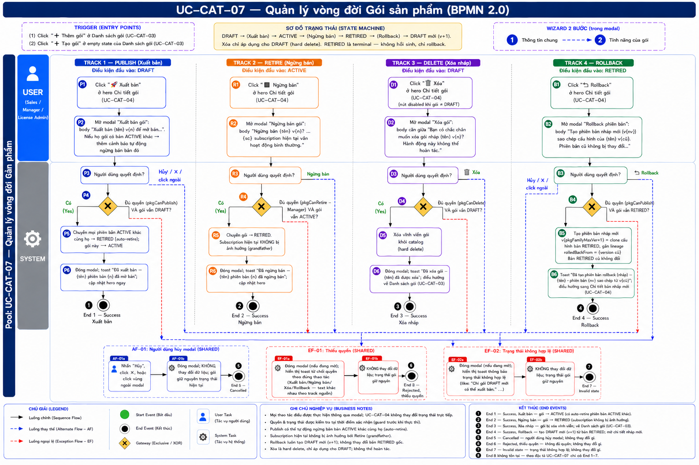
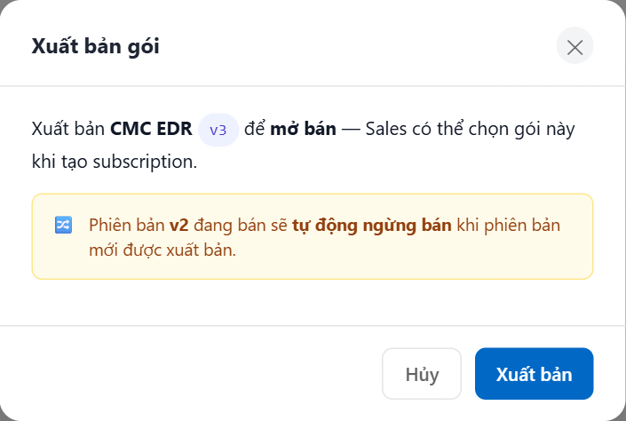
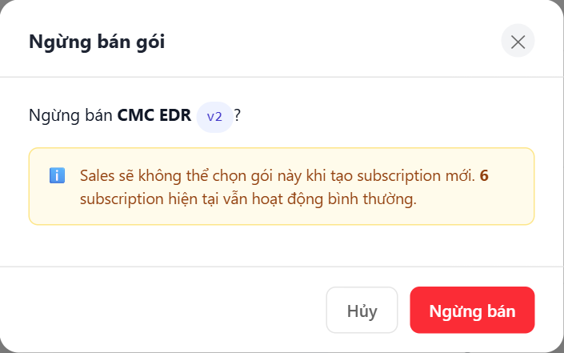
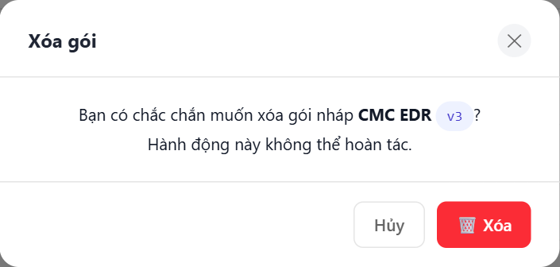
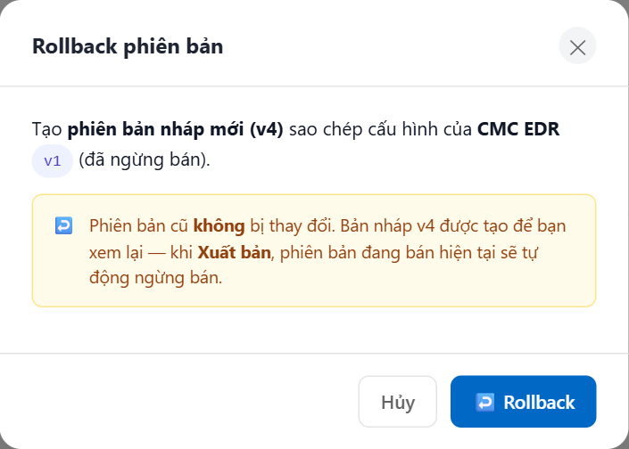

# UC-CAT-07 — Quản lý vòng đời Gói sản phẩm

> Module: M-04 Product & Package Catalog | Phiên bản: 1.0 | Ngày: 10/07/2026
> Trạng thái: Draft for Review

---

## 1. Thông tin chung

| Thuộc tính | Nội dung |
|---|---|
| **Mã Use Case** | UC-CAT-07 |
| **Tên** | Quản lý vòng đời Gói sản phẩm (Package Lifecycle) |
| **Mô tả** | Đặc tả 4 thao tác chuyển trạng thái vòng đời của một gói bán hàng (package) từ hero trang Chi tiết gói (UC-CAT-04): **Xuất bản** (DRAFT → ACTIVE), **Ngừng bán** (ACTIVE → RETIRED), **Xóa nháp** (xóa vĩnh viễn gói DRAFT), và **Rollback** (tạo phiên bản nháp mới clone từ bản RETIRED). Mỗi thao tác đi qua một modal xác nhận, có guard quyền và guard trạng thái. State machine: DRAFT → ACTIVE → RETIRED; RETIRED là terminal (chỉ rollback, không hồi sinh). Mỗi họ gói (cùng `product_id` + `code`) chỉ có **1 phiên bản ACTIVE** tại một thời điểm. |
| **Tác nhân** | Sales (người tạo gói), Manager, License Admin. Phân quyền theo từng thao tác (xem §1 Business Rules). |
| **Tiền điều kiện** | (1) Đã đăng nhập; có quyền tương ứng thao tác — Xuất bản/Xóa/Rollback: người tạo gói **hoặc** Manager; Ngừng bán: **Manager**. (2) Gói tồn tại trong catalog và đang ở trạng thái hợp lệ cho thao tác — Xuất bản/Xóa: `DRAFT`; Ngừng bán: `ACTIVE`; Rollback: `RETIRED`. |
| **Hậu điều kiện** | (Success) Trạng thái gói được cập nhật đúng theo thao tác:<br>— Xuất bản: mọi phiên bản `ACTIVE` khác cùng họ → `RETIRED`, gói này → `ACTIVE`.<br>— Ngừng bán: gói → `RETIRED`; các subscription hiện tại **không** bị ảnh hưởng (grandfather).<br>— Xóa nháp: gói bị xóa vĩnh viễn khỏi catalog, điều hướng về Danh sách gói (UC-CAT-03).<br>— Rollback: tạo phiên bản nháp mới `v{max+1}` clone cấu hình bản RETIRED, gắn lineage `rolledBackFrom`, điều hướng sang Chi tiết phiên bản nháp mới (UC-CAT-04).<br>Toast xác nhận hiển thị trong mọi trường hợp thành công.<br>(Failure) Dữ liệu không thay đổi; hiển thị toast lỗi tương ứng (thiếu quyền hoặc trạng thái không hợp lệ). |
| **Ngoại lệ** | (1) Thiếu quyền → toast từ chối, dừng thao tác. (2) Trạng thái gói không hợp lệ cho thao tác (đã bị đổi bởi người khác — race condition) → toast lỗi, dừng thao tác. |
| **Trigger** | Người dùng click một trong các nút vòng đời ở hero trang Chi tiết gói (UC-CAT-04): "🚀 Xuất bản" / "⏹ Ngừng bán" / "🗑️ Xóa" / "↩️ Rollback". |

### Business Rules

| Mã | Nội dung |
|---|---|
| **BR-01** | Mỗi họ gói (cùng `product_id` + `code`) chỉ có **1 phiên bản `ACTIVE`** tại một thời điểm. |
| **BR-02** | **Xuất bản** — Điều kiện: gói `DRAFT`. Quyền: người tạo gói **hoặc** Manager (`pkgCanPublish`). Khi thực thi: **mọi phiên bản `ACTIVE` khác cùng họ** tự động chuyển `RETIRED`, rồi gói này chuyển `ACTIVE`. |
| **BR-03** | **Ngừng bán** — Điều kiện: gói `ACTIVE`. Quyền: **Manager** (`pkgCanRetire`). Khi thực thi: gói chuyển `RETIRED`. Các subscription hiện tại **KHÔNG** bị ảnh hưởng (grandfather — vẫn hoạt động bình thường), chỉ chặn Sales chọn gói này khi tạo subscription mới. |
| **BR-04** | **Xóa nháp** — Điều kiện: **chỉ** gói `DRAFT` (chưa từng bán → không có subscription tham chiếu). Quyền: người tạo **hoặc** Manager (`pkgCanDelete`). Khi thực thi: **xóa vĩnh viễn** khỏi catalog; điều hướng về Danh sách gói (UC-CAT-03). |
| **BR-05** | **Rollback** — Điều kiện: gói `RETIRED`. Quyền: người tạo **hoặc** Manager (`pkgCanPublish`). Khi thực thi: tạo **phiên bản nháp mới** `v{pkgFamilyMaxVer + 1}` = clone cấu hình bản RETIRED (name, duration, seat/instance, features, price), gắn lineage `rolledBackFrom = {version cũ}`; phiên bản cũ **không** bị thay đổi. |
| **BR-06** | `RETIRED` là trạng thái **terminal**: không sửa, không xuất bản lại. Nguyên tắc append-only — không "hồi sinh" bản đã retire; muốn dùng lại phải Rollback (clone-forward tạo phiên bản nháp mới). |
| **BR-07** | **Guard chung mọi thao tác** — thứ tự kiểm tra 2 lớp: (1) **Guard quyền**: thiếu quyền → toast từ chối, dừng, không đổi dữ liệu. (2) **Guard trạng thái**: trạng thái gói ≠ trạng thái hợp lệ cho thao tác → toast lỗi, dừng, không đổi dữ liệu. |
| **BR-08** | Mọi thao tác đều thực thi **qua modal xác nhận** (`pkgConfirmModal`): mở bằng `pkgConfirm(action, id)`, thực thi khi người dùng bấm nút hành động → `pkgDoConfirm()`. Người dùng có thể "Hủy" hoặc click ✕ / vùng ngoài modal để bỏ thao tác. |
| **BR-09** | **Nút Xóa** chỉ khả dụng khi gói `DRAFT`. Gói `ACTIVE`/`RETIRED`: nút "🗑️ Xóa" ở trạng thái `disabled` kèm tooltip; gói ACTIVE dùng "Ngừng bán" thay cho Xóa. |
| **BR-10** | Khi **Xuất bản** một phiên bản mới trong khi họ gói đang có phiên bản `ACTIVE` khác → modal hiển thị cảnh báo phiên bản đang bán sẽ tự động ngừng bán; việc auto-retire diễn ra trong bước thực thi (BR-02). |

---

## 2. Luồng nghiệp vụ



> ⏳ Ảnh BPMN sẽ được sinh sau — path theo convention, file chưa tồn tại.

### 2.1 Tổng quan vòng đời (State machine)

Gói có 3 trạng thái. Sơ đồ chuyển trạng thái:

```
                 🚀 Xuất bản (§2.2)              ⏹ Ngừng bán (§2.3)
                 pkgCanPublish                    pkgCanRetire
    ┌─────────┐  DRAFT → ACTIVE     ┌──────────┐  ACTIVE → RETIRED   ┌───────────┐
    │  DRAFT  │ ─────────────────▶ │  ACTIVE  │ ──────────────────▶ │  RETIRED  │
    └─────────┘                     └──────────┘                     └───────────┘
         │                          (auto-retire bản ACTIVE                │
         │  🗑️ Xóa (§2.4)            khác cùng họ khi có                     │  ↩️ Rollback (§2.5)
         │  hard delete             phiên bản mới xuất bản)                 │  clone-forward
         ▼                                                                  │  v{max+1} (DRAFT mới)
     (xóa khỏi catalog)                                                     │
                                                                            ▼
                          ┌────────────────────────────────────────┐
                          │  Phiên bản nháp mới (DRAFT) v{max+1}     │
                          │  rolledBackFrom = {version RETIRED cũ}   │──▶ quay lại DRAFT
                          └────────────────────────────────────────┘
```

**Nguyên tắc:**
— 1 `ACTIVE` / họ gói (BR-01); xuất bản auto-retire bản `ACTIVE` cũ cùng họ (BR-02, BR-10).
— Ngừng bán không xóa subscription hiện tại — grandfather (BR-03).
— Xóa chỉ áp dụng gói `DRAFT`, xóa vĩnh viễn (BR-04, BR-09).
— `RETIRED` là terminal → chỉ Rollback (clone-forward), không hồi sinh (BR-05, BR-06).
— Mọi thao tác có guard quyền + guard trạng thái (BR-07), thực thi qua modal xác nhận (BR-08).

**Gateway chung áp dụng cho mọi thao tác §2.2–§2.5** (sau khi người dùng bấm nút hành động trong modal):

**[Gateway — Đủ quyền?]**<br>→ [Có]: tiếp tục kiểm tra trạng thái.<br>→ [Không]: hiển thị toast từ chối, dừng thao tác — dữ liệu không đổi.

**[Gateway — Trạng thái hợp lệ?]**<br>→ [Có]: thực thi thao tác + cập nhật trạng thái/điều hướng.<br>→ [Không]: hiển thị toast lỗi, dừng thao tác — dữ liệu không đổi.

---

### 2.2 Luồng con — Xuất bản (Publish)

> Điều kiện đầu vào: gói `DRAFT`. Nút "🚀 Xuất bản" ở hero Chi tiết gói. Bước **P3** và **P4** là Gateway (XOR) — guard chung §2.1.

| Bước | Tác nhân | Hành động / Phản hồi | Ghi chú |
|---|---|---|---|
| **P1** | Người dùng | Click "🚀 Xuất bản" ở hero Chi tiết gói (UC-CAT-04). | `pkgConfirm('publish', id)` — BR-02 |
| **P2** | System | Mở modal "Xuất bản gói": body "Xuất bản {tên} v{n} để mở bán — Sales có thể chọn gói này khi tạo subscription." Nếu họ gói đang có phiên bản `ACTIVE` khác → thêm cảnh báo "Phiên bản v{cũ} đang bán sẽ tự động ngừng bán khi phiên bản mới được xuất bản." Footer [Hủy] · [Xuất bản]. | BR-08, BR-10 |
| **P3** | Người dùng | **[Gateway — Người dùng quyết định?]**<br>→ [Xuất bản]: tiếp bước P4.<br>→ [Hủy / ✕ / click ngoài]: **AF-01**. | `pkgDoConfirm()` |
| **P4** | System | **[Gateway — Đủ quyền (`pkgCanPublish`) VÀ gói vẫn `DRAFT`?]**<br>→ [Có]: tiếp bước P5.<br>→ [Không]: **EF-01** (thiếu quyền) hoặc **EF-02** (trạng thái sai). | Guard chung — BR-07 |
| **P5** | System | Chuyển **mọi phiên bản `ACTIVE` khác cùng họ → `RETIRED`** (auto-retire), rồi gói này → `ACTIVE`. | BR-01, BR-02 |
| **P6** | System | Đóng modal; toast "Đã xuất bản — {tên} phiên bản {n} đã mở bán"; cập nhật hero + badge trạng thái ngay (không reload). | — |
| → | — | **End 1 (Success — Xuất bản)** — gói `ACTIVE`, bản ACTIVE cũ cùng họ đã bị auto-retire. | — |

---

### 2.3 Luồng con — Ngừng bán (Retire)

> Điều kiện đầu vào: gói `ACTIVE`. Nút "⏹ Ngừng bán" ở hero. Bước **R3** và **R4** là Gateway (XOR).

| Bước | Tác nhân | Hành động / Phản hồi | Ghi chú |
|---|---|---|---|
| **R1** | Người dùng | Click "⏹ Ngừng bán" ở hero Chi tiết gói (UC-CAT-04). | `pkgConfirm('retire', id)` — BR-03 |
| **R2** | System | Mở modal "Ngừng bán gói": body "Ngừng bán {tên} v{n}? Sales sẽ không thể chọn gói này khi tạo subscription mới. {sc} subscription hiện tại vẫn hoạt động bình thường." Footer [Hủy] · [Ngừng bán] (btn-danger). | BR-08 |
| **R3** | Người dùng | **[Gateway — Người dùng quyết định?]**<br>→ [Ngừng bán]: tiếp bước R4.<br>→ [Hủy / ✕ / click ngoài]: **AF-01**. | `pkgDoConfirm()` |
| **R4** | System | **[Gateway — Đủ quyền (`pkgCanRetire` — Manager) VÀ gói vẫn `ACTIVE`?]**<br>→ [Có]: tiếp bước R5.<br>→ [Không]: **EF-01** (thiếu quyền) hoặc **EF-02** (trạng thái sai). | Guard chung — BR-07 |
| **R5** | System | Chuyển gói → `RETIRED`. Các subscription hiện tại **KHÔNG** bị ảnh hưởng (grandfather). | BR-03 |
| **R6** | System | Đóng modal; toast "Đã ngừng bán — {tên} phiên bản {n} đã ngừng bán"; cập nhật hero + badge trạng thái ngay. | — |
| → | — | **End 2 (Success — Ngừng bán)** — gói `RETIRED`, subscription hiện tại vẫn hoạt động. | — |

---

### 2.4 Luồng con — Xóa nháp (Delete)

> Điều kiện đầu vào: **chỉ** gói `DRAFT`. Nút "🗑️ Xóa" ở hero (gói ACTIVE/RETIRED → nút disabled, BR-09). Bước **D3** và **D4** là Gateway (XOR).

| Bước | Tác nhân | Hành động / Phản hồi | Ghi chú |
|---|---|---|---|
| **D1** | Người dùng | Click "🗑️ Xóa" ở hero Chi tiết gói (UC-CAT-04). | `pkgConfirm('delete', id)` — BR-04, BR-09 |
| **D2** | System | Mở modal "Xóa gói": body (căn giữa) "Bạn có chắc chắn muốn xóa gói nháp {tên} v{n}? Hành động này không thể hoàn tác." Footer [Hủy] · [🗑️ Xóa] (btn-danger). | BR-08 |
| **D3** | Người dùng | **[Gateway — Người dùng quyết định?]**<br>→ [🗑️ Xóa]: tiếp bước D4.<br>→ [Hủy / ✕ / click ngoài]: **AF-01**. | `pkgDoConfirm()` |
| **D4** | System | **[Gateway — Đủ quyền (`pkgCanDelete`) VÀ gói vẫn `DRAFT`?]**<br>→ [Có]: tiếp bước D5.<br>→ [Không]: **EF-01** (thiếu quyền) hoặc **EF-02** (trạng thái sai). | Guard chung — BR-07 |
| **D5** | System | **Xóa vĩnh viễn** gói khỏi catalog (hard delete). | BR-04 |
| **D6** | System | Đóng modal; toast "Đã xóa gói — {tên} đã được xóa"; điều hướng về Danh sách gói (UC-CAT-03). | — |
| → | — | **End 3 (Success — Xóa nháp)** — gói bị xóa vĩnh viễn, điều hướng về UC-CAT-03. | — |

---

### 2.5 Luồng con — Rollback

> Điều kiện đầu vào: gói `RETIRED`. Nút "↩️ Rollback" ở hero. Bước **B3** và **B4** là Gateway (XOR). Clone-forward, không hồi sinh bản cũ (BR-05, BR-06).

| Bước | Tác nhân | Hành động / Phản hồi | Ghi chú |
|---|---|---|---|
| **B1** | Người dùng | Click "↩️ Rollback" ở hero Chi tiết gói (UC-CAT-04). | `pkgConfirm('rollback', id)` — BR-05 |
| **B2** | System | Mở modal "Rollback phiên bản": body "Tạo phiên bản nháp mới (v{nv}) sao chép cấu hình của {tên} v{cũ} (đã ngừng bán). Phiên bản cũ không bị thay đổi. Bản nháp v{nv} được tạo để bạn xem lại — khi Xuất bản, phiên bản đang bán hiện tại sẽ tự động ngừng bán." Footer [Hủy] · [↩️ Rollback]. `nv = pkgFamilyMaxVer + 1`. | BR-08 |
| **B3** | Người dùng | **[Gateway — Người dùng quyết định?]**<br>→ [↩️ Rollback]: tiếp bước B4.<br>→ [Hủy / ✕ / click ngoài]: **AF-01**. | `pkgDoConfirm()` |
| **B4** | System | **[Gateway — Đủ quyền (`pkgCanPublish`) VÀ gói vẫn `RETIRED`?]**<br>→ [Có]: tiếp bước B5.<br>→ [Không]: **EF-01** (thiếu quyền) hoặc **EF-02** (trạng thái sai). | Guard chung — BR-07 |
| **B5** | System | Tạo **phiên bản nháp mới** `v{pkgFamilyMaxVer + 1}` = clone cấu hình bản RETIRED (name, duration, seat/instance, features, price); gắn lineage `rolledBackFrom = {version cũ}`. Bản RETIRED cũ **không** đổi. | BR-05, BR-06 |
| **B6** | System | Toast "Đã tạo phiên bản rollback (nháp) — {tên} · phiên bản {nv} sao chép từ v{cũ} — Xuất bản để áp dụng"; điều hướng sang Chi tiết phiên bản nháp mới (UC-CAT-04). | — |
| → | — | **End 4 (Success — Rollback)** — phiên bản nháp mới `v{nv}` được tạo, điều hướng sang Chi tiết bản nháp mới. | — |

---

### 2.6 Luồng phụ & ngoại lệ (dùng chung cho §2.2–§2.5)

**[AF-01: Người dùng hủy modal]** — kích hoạt tại bước quyết định của mỗi thao tác (P3 / R3 / D3 / B3).

| Bước | Tác nhân | Hành động / Phản hồi |
|---|---|---|
| **AF-01a** | Người dùng | Nhấn "Hủy", click ✕, hoặc click vùng ngoài modal. |
| **AF-01b** | System | Đóng modal; **KHÔNG** thay đổi dữ liệu; gói giữ nguyên trạng thái hiện tại. |
| → | — | **End 5 (Cancelled)** — quay lại Chi tiết gói (UC-CAT-04), trạng thái không đổi. |

**[EF-01: Thiếu quyền]** — kích hoạt tại gateway quyền (P4 / R4 / D4 / B4).

| Bước | Tác nhân | Hành động / Phản hồi |
|---|---|---|
| **EF-01a** | System | Đóng modal (nếu đang mở); hiển thị toast từ chối theo thao tác:<br>— Xuất bản: "Không có quyền — Chỉ Sales tạo gói hoặc Manager mới được xuất bản".<br>— Ngừng bán: "Không có quyền — Chỉ Manager mới được ngừng bán gói".<br>— Xóa: "Không có quyền — Chỉ Sales tạo gói hoặc Manager mới được xóa".<br>— Rollback: "Không có quyền — Chỉ Sales tạo gói hoặc Manager mới được rollback". |
| **EF-01b** | System | **KHÔNG** thay đổi dữ liệu; trạng thái gói giữ nguyên. |
| → | — | **End 6 (Rejected — thiếu quyền)** — kết thúc luồng. |

**[EF-02: Trạng thái không hợp lệ]** — kích hoạt tại gateway trạng thái (P4 / R4 / D4 / B4) khi trạng thái gói đã bị đổi (race condition) hoặc không đúng điều kiện đầu vào.

| Bước | Tác nhân | Hành động / Phản hồi |
|---|---|---|
| **EF-02a** | System | Đóng modal (nếu đang mở); hiển thị toast lỗi theo thao tác:<br>— Xuất bản: "Không hợp lệ — Chỉ gói nháp mới xuất bản được".<br>— Xóa: "Không thể xóa — Chỉ gói nháp mới xóa được. Gói đang bán dùng 'Ngừng bán'."<br>— Rollback: "Không hợp lệ — Chỉ phiên bản đã ngừng bán mới rollback được".<br>— Ngừng bán: toast lỗi trạng thái tương tự (chỉ gói đang bán mới ngừng bán được). |
| **EF-02b** | System | **KHÔNG** thay đổi dữ liệu; trạng thái gói giữ nguyên. |
| → | — | **End 7 (Rejected — trạng thái sai)** — kết thúc luồng. |

### 2.7 Điểm kết thúc (End Events)

| # | Tên | Điều kiện |
|---|---|---|
| **End 1** | Success — Xuất bản | Gói `DRAFT → ACTIVE`; bản `ACTIVE` khác cùng họ auto-retire (BR-02); toast; cập nhật hero in-place |
| **End 2** | Success — Ngừng bán | Gói `ACTIVE → RETIRED`; subscription hiện tại giữ nguyên (grandfather, BR-03); toast; cập nhật hero |
| **End 3** | Success — Xóa nháp | Gói `DRAFT` bị xóa vĩnh viễn khỏi catalog (BR-04); toast; điều hướng về Danh sách gói (UC-CAT-03) |
| **End 4** | Success — Rollback | Phiên bản nháp mới `v{max+1}` clone từ bản RETIRED, `rolledBackFrom` gắn lineage (BR-05); toast; điều hướng sang Chi tiết bản nháp mới (UC-CAT-04) |
| **End 5** | Cancelled — AF-01 | Người dùng nhấn "Hủy" / ✕ / click ngoài modal; trạng thái không đổi |
| **End 6** | Rejected — EF-01 (thiếu quyền) | Guard quyền chặn; toast từ chối; dữ liệu không đổi |
| **End 7** | Rejected — EF-02 (trạng thái sai) | Guard trạng thái chặn (kể cả race condition); toast lỗi; dữ liệu không đổi |

---

## 3. Mô tả giao diện

### 3.1 Wireframe

Các thao tác vòng đời khởi phát từ hàng nút ở **hero trang Chi tiết gói (UC-CAT-04)** — nút hiển thị theo trạng thái gói:

```
┌─ Chi tiết gói: EDR Pro · v2 ──────────────────────── [Active] ─┐
│  Sản phẩm: 🛡️ CMC EDR · Mã gói: EDR-PRO · 12 tháng · 100 seat  │
│                                                                 │
│  Trạng thái = DRAFT   →  [ ✏️ Sửa ] [ 🚀 Xuất bản ] [ 🗑️ Xóa ] │
│  Trạng thái = ACTIVE  →  [ ✏️ Sửa ] [ ⏹ Ngừng bán ] [🗑️ Xóa*] │
│  Trạng thái = RETIRED →  [ ↩️ Rollback ]            [🗑️ Xóa*]  │
│      (*) nút 🗑️ Xóa disabled khi gói ≠ DRAFT — có tooltip      │
└─────────────────────────────────────────────────────────────────┘
```

Mọi thao tác mở modal xác nhận `pkgConfirmModal` với bố cục chung:

```
┌─ {Tiêu đề modal} ─────────────────────────────────────── ✕ ─┐
│                                                              │  ← modal-header
├──────────────────────────────────────────────────────────────┤
│  {modal-body — nội dung xác nhận theo từng thao tác;         │  ← modal-body
│   Xuất bản có cảnh báo auto-retire nếu họ có bản ACTIVE;     │
│   Xóa căn giữa}                                              │
├──────────────────────────────────────────────────────────────┤
│  [Hủy]                              [{nút hành động}]         │  ← modal-footer
└──────────────────────────────────────────────────────────────┘
```

> **Demo HTML:** [docs/demo/v2.5.0_catalog.html](../../demo/v2.5.0_catalog.html) — hàm `pkgConfirm(action, id)` (mở modal xác nhận), `pkgDoConfirm()` (thực thi), guard `pkgCanPublish`, `pkgCanRetire`, `pkgCanDelete`; helper họ gói `pkgFamilyVersions`, `pkgFamilyMaxVer`.

**Screenshot — Modal Xuất bản gói:**



**Screenshot — Modal Ngừng bán gói:**



**Screenshot — Modal Xóa gói nháp:**



**Screenshot — Modal Rollback phiên bản:**



### 3.2 Bốn modal xác nhận

| # | Modal | Tiêu đề | Nội dung body | Nút hành động (phải) | Nút trái |
|---|---|---|---|---|---|
| 1 | **Xuất bản** | "Xuất bản gói" | "Xuất bản {tên} v{n} để mở bán — Sales có thể chọn gói này khi tạo subscription." · *(nếu họ đang có bản ACTIVE khác)* thêm dòng cảnh báo "Phiên bản v{cũ} đang bán sẽ tự động ngừng bán khi phiên bản mới được xuất bản." | "Xuất bản" (primary) | "Hủy" |
| 2 | **Ngừng bán** | "Ngừng bán gói" | "Ngừng bán {tên} v{n}? Sales sẽ không thể chọn gói này khi tạo subscription mới. {sc} subscription hiện tại vẫn hoạt động bình thường." | "Ngừng bán" (btn-danger) | "Hủy" |
| 3 | **Xóa gói** | "Xóa gói" | *(căn giữa)* "Bạn có chắc chắn muốn xóa gói nháp {tên} v{n}? Hành động này không thể hoàn tác." | "🗑️ Xóa" (btn-danger) | "Hủy" |
| 4 | **Rollback** | "Rollback phiên bản" | "Tạo phiên bản nháp mới (v{nv}) sao chép cấu hình của {tên} v{cũ} (đã ngừng bán). Phiên bản cũ không bị thay đổi. Bản nháp v{nv} được tạo để bạn xem lại — khi Xuất bản, phiên bản đang bán hiện tại sẽ tự động ngừng bán." | "↩️ Rollback" (primary) | "Hủy" |

### 3.3 Nút hero & trạng thái

| # | Thành phần | Loại | Điều kiện hiển thị / active | Mô tả |
|---|---|---|---|---|
| 1 | "🚀 Xuất bản" | Button (primary) | Gói `DRAFT` **và** đủ quyền (`pkgCanPublish`) | Mở modal Xuất bản (`pkgConfirm('publish', id)`). |
| 2 | "⏹ Ngừng bán" | Button (danger) | Gói `ACTIVE` **và** đủ quyền (`pkgCanRetire` — Manager) | Mở modal Ngừng bán (`pkgConfirm('retire', id)`). |
| 3 | "🗑️ Xóa" | Button (danger) | Active khi gói `DRAFT` **và** đủ quyền (`pkgCanDelete`). Gói `ACTIVE`/`RETIRED` → `disabled` + tooltip (gói đang bán dùng "Ngừng bán") — BR-09. | Mở modal Xóa gói (`pkgConfirm('delete', id)`). |
| 4 | "↩️ Rollback" | Button (primary) | Gói `RETIRED` **và** đủ quyền (`pkgCanPublish`) | Mở modal Rollback (`pkgConfirm('rollback', id)`). |
| 5 | Nút "Hủy" | Button (ghost) | Luôn có trong footer modal | Đóng modal, không đổi dữ liệu (AF-01). |
| 6 | Nút ✕ / overlay | Icon / vùng ngoài | Luôn có | Tương đương "Hủy" (AF-01). |
| 7 | Toast thành công | Toast (success) | Sau mỗi thao tác thành công | Text theo từng thao tác (xem §2.2–§2.5, bước P6/R6/D6/B6). |
| 8 | Toast lỗi | Toast (error) | EF-01 / EF-02 | Text từ chối quyền hoặc lỗi trạng thái (xem §2.6). |

*Modal không có field nhập liệu — toàn bộ là nội dung xác nhận readonly; nút hành động luôn active khi modal mở.*

---

## 4. Acceptance Criteria

### Nhóm 1: Xuất bản (Publish) — BR-01, BR-02, BR-10

| Mã | Given | When | Then |
|---|---|---|---|
| AC-CAT-07-01 | Gói `DRAFT`, người dùng là người tạo gói (hoặc Manager). | Xem hero Chi tiết gói. | Nút "🚀 Xuất bản" hiển thị và active. |
| AC-CAT-07-02 | Gói `DRAFT`, họ gói **chưa** có bản `ACTIVE`. | Click "🚀 Xuất bản". | Modal "Xuất bản gói" mở, body "Xuất bản {tên} v{n} để mở bán…". Không có dòng cảnh báo auto-retire. |
| AC-CAT-07-03 | Gói `DRAFT`, họ gói đang có phiên bản `ACTIVE` khác (v{cũ}). | Click "🚀 Xuất bản". | Modal hiển thị thêm cảnh báo "Phiên bản v{cũ} đang bán sẽ tự động ngừng bán khi phiên bản mới được xuất bản." (BR-10). |
| AC-CAT-07-04 | Modal Xuất bản đang mở, gói vẫn `DRAFT`, họ có bản `ACTIVE` v{cũ}. | Nhấn "Xuất bản" (bước P3→P4→P5). | Bản `ACTIVE` v{cũ} cùng họ chuyển `RETIRED`, gói này chuyển `ACTIVE` (1 ACTIVE/họ — BR-01). Toast "Đã xuất bản — {tên} phiên bản {n} đã mở bán". Hero cập nhật ngay. Kết thúc **End 1**. |
| AC-CAT-07-05 | Người dùng **không** phải người tạo gói và không phải Manager. | Nhấn "Xuất bản" trong modal (gateway quyền P4). | **EF-01**: toast "Không có quyền — Chỉ Sales tạo gói hoặc Manager mới được xuất bản"; gói giữ `DRAFT`. Kết thúc **End 6**. |
| AC-CAT-07-06 | Gói đã bị người khác đổi sang `ACTIVE`/`RETIRED` trong khi modal mở (race). | Nhấn "Xuất bản" (gateway trạng thái P4). | **EF-02**: toast "Không hợp lệ — Chỉ gói nháp mới xuất bản được"; dữ liệu không đổi. Kết thúc **End 7**. |

### Nhóm 2: Ngừng bán (Retire) — BR-03

| Mã | Given | When | Then |
|---|---|---|---|
| AC-CAT-07-07 | Gói `ACTIVE`, người dùng là Manager. | Xem hero Chi tiết gói. | Nút "⏹ Ngừng bán" hiển thị và active. |
| AC-CAT-07-08 | Gói `ACTIVE` có `sc` subscription tham chiếu. | Click "⏹ Ngừng bán". | Modal "Ngừng bán gói" mở, body "Ngừng bán {tên} v{n}? … {sc} subscription hiện tại vẫn hoạt động bình thường." Nút "Ngừng bán" (btn-danger). |
| AC-CAT-07-09 | Modal Ngừng bán đang mở, gói vẫn `ACTIVE`, người dùng là Manager. | Nhấn "Ngừng bán" (R3→R4→R5). | Gói chuyển `RETIRED`. Các subscription hiện tại **không** bị ảnh hưởng (grandfather). Toast "Đã ngừng bán — {tên} phiên bản {n} đã ngừng bán". Kết thúc **End 2**. |
| AC-CAT-07-10 | Người dùng **không** phải Manager (ví dụ Sales tạo gói). | Nhấn "Ngừng bán" (gateway quyền R4). | **EF-01**: toast "Không có quyền — Chỉ Manager mới được ngừng bán gói"; gói giữ `ACTIVE`. Kết thúc **End 6**. |
| AC-CAT-07-11 | Sau khi ngừng bán thành công. | Sales mở form Tạo subscription mới (UC-SUB) và chọn gói. | Gói đã `RETIRED` **không** xuất hiện trong danh sách gói chọn được; các subscription cũ vẫn hoạt động. |

### Nhóm 3: Xóa nháp (Delete) — BR-04, BR-09

| Mã | Given | When | Then |
|---|---|---|---|
| AC-CAT-07-12 | Gói `DRAFT`, người dùng là người tạo (hoặc Manager). | Xem hero Chi tiết gói. | Nút "🗑️ Xóa" hiển thị và active. |
| AC-CAT-07-13 | Gói `ACTIVE` hoặc `RETIRED`. | Hover nút "🗑️ Xóa" ở hero. | Nút `disabled` (mờ), kèm tooltip; gói đang bán được hướng dẫn dùng "Ngừng bán" (BR-09). |
| AC-CAT-07-14 | Gói `DRAFT` v{n}. | Click "🗑️ Xóa". | Modal "Xóa gói" mở, body căn giữa "Bạn có chắc chắn muốn xóa gói nháp {tên} v{n}? Hành động này không thể hoàn tác." Nút "🗑️ Xóa" (btn-danger). |
| AC-CAT-07-15 | Modal Xóa đang mở, gói vẫn `DRAFT`, đủ quyền. | Nhấn "🗑️ Xóa" (D3→D4→D5). | Gói bị **xóa vĩnh viễn** khỏi catalog. Toast "Đã xóa gói — {tên} đã được xóa". Điều hướng về Danh sách gói (UC-CAT-03). Kết thúc **End 3**. |
| AC-CAT-07-16 | Người dùng **không** đủ quyền xóa. | Nhấn "🗑️ Xóa" (gateway quyền D4). | **EF-01**: toast "Không có quyền — Chỉ Sales tạo gói hoặc Manager mới được xóa"; gói không bị xóa. Kết thúc **End 6**. |
| AC-CAT-07-17 | Gói đã bị đổi sang `ACTIVE`/`RETIRED` trong khi modal mở (race). | Nhấn "🗑️ Xóa" (gateway trạng thái D4). | **EF-02**: toast "Không thể xóa — Chỉ gói nháp mới xóa được. Gói đang bán dùng 'Ngừng bán'."; dữ liệu không đổi. Kết thúc **End 7**. |

### Nhóm 4: Rollback — BR-05, BR-06

| Mã | Given | When | Then |
|---|---|---|---|
| AC-CAT-07-18 | Gói `RETIRED`, người dùng là người tạo (hoặc Manager). | Xem hero Chi tiết gói. | Nút "↩️ Rollback" hiển thị và active. |
| AC-CAT-07-19 | Gói `RETIRED` v{cũ}, `pkgFamilyMaxVer` của họ = m. | Click "↩️ Rollback". | Modal "Rollback phiên bản" mở, body nêu tạo bản nháp mới v{m+1} sao chép cấu hình v{cũ}, "Phiên bản cũ không bị thay đổi…". Nút "↩️ Rollback". |
| AC-CAT-07-20 | Modal Rollback đang mở, gói vẫn `RETIRED`, đủ quyền. | Nhấn "↩️ Rollback" (B3→B4→B5). | Tạo phiên bản **nháp** mới `v{pkgFamilyMaxVer+1}` = clone cấu hình bản RETIRED (name, duration, seat/instance, features, price), `rolledBackFrom = {version cũ}`. Bản RETIRED cũ không đổi. Toast "Đã tạo phiên bản rollback (nháp) — {tên} · phiên bản {nv} sao chép từ v{cũ} — Xuất bản để áp dụng". Điều hướng sang Chi tiết bản nháp mới (UC-CAT-04). Kết thúc **End 4**. |
| AC-CAT-07-21 | Người dùng **không** đủ quyền (không phải người tạo / Manager). | Nhấn "↩️ Rollback" (gateway quyền B4). | **EF-01**: toast "Không có quyền — Chỉ Sales tạo gói hoặc Manager mới được rollback"; không tạo bản mới. Kết thúc **End 6**. |
| AC-CAT-07-22 | Gói không còn `RETIRED` (đã rollback bởi người khác, hoặc trạng thái khác). | Nhấn "↩️ Rollback" (gateway trạng thái B4). | **EF-02**: toast "Không hợp lệ — Chỉ phiên bản đã ngừng bán mới rollback được"; dữ liệu không đổi. Kết thúc **End 7**. |
| AC-CAT-07-23 | Bản v{cũ} đang `RETIRED`. | Sau khi rollback tạo bản nháp v{nv}. | Bản v{cũ} **vẫn** `RETIRED` (không hồi sinh — append-only, BR-06); catalog có thêm 1 bản `DRAFT` v{nv} mới. |

### Nhóm 5: Hủy modal (dùng chung — AF-01)

| Mã | Given | When | Then |
|---|---|---|---|
| AC-CAT-07-24 | Bất kỳ modal vòng đời nào (Xuất bản/Ngừng bán/Xóa/Rollback) đang mở. | Nhấn "Hủy". | Modal đóng, trạng thái gói không đổi, không có toast thành công. Kết thúc **End 5 (Cancelled)**. |
| AC-CAT-07-25 | Bất kỳ modal vòng đời nào đang mở. | Click ✕ hoặc click vùng ngoài modal (overlay). | Modal đóng, dữ liệu không đổi. Kết thúc **End 5 (Cancelled)**. |

---

## 5. Lịch sử thay đổi

| Phiên bản | Ngày | Người cập nhật | Nội dung |
|---|---|---|---|
| 1.0 | 10/07/2026 | BA Team | Khởi tạo tài liệu — Draft for Review. Gộp 4 thao tác vòng đời gói (Xuất bản / Ngừng bán / Xóa nháp / Rollback) vào 1 UC. §2.1 tổng quan state machine DRAFT→ACTIVE→RETIRED + rollback clone-forward; §2.2–§2.5 mỗi thao tác 1 luồng con với gateway guard quyền + guard trạng thái; §2.6 AF-01/EF-01/EF-02 dùng chung; §2.7 gồm 7 End Events. §3 mô tả 4 modal xác nhận + nút hero theo trạng thái. §4 gồm 25 AC chia 5 nhóm (mỗi thao tác 1 nhóm + hủy modal chung), phủ happy path + phân quyền + guard trạng thái sai (race). Bám sát demo `v2.5.0_catalog.html` (`pkgConfirm`, `pkgDoConfirm`, `pkgCanPublish/Retire/Delete`, `pkgFamilyMaxVer`). Cross-ref UC-CAT-03/04/05/06. |

### Review Checklist

> Claude tự review — đánh dấu ✅/❌ trước khi submit cho BA review.

#### Nghiệp vụ
- ✅ 4 thao tác vòng đời tách thành §2.2–§2.5, mỗi thao tác 1 luồng con với gateway guard 2 lớp (quyền → trạng thái)
- ✅ State machine tổng quan §2.1 (DRAFT→ACTIVE→RETIRED + rollback clone-forward); nguyên tắc 1 ACTIVE/họ, grandfather, append-only
- ✅ Luồng phụ AF-01 (hủy modal) + ngoại lệ EF-01 (thiếu quyền) / EF-02 (trạng thái sai) dùng chung
- ✅ End Events liệt kê đầy đủ (§2.7 — 7 End: 4 success + cancelled + 2 rejected)
- ✅ BR-01..BR-10 mỗi rule 1 dòng; mỗi thao tác auto-retire / grandfather / hard delete / terminal đều có BR
- ✅ 25 AC phủ happy + phân quyền (EF-01) + guard trạng thái sai/race (EF-02) + hủy modal
- ✅ Bám sát demo v2.5.0 (`pkgConfirm`, `pkgDoConfirm`, `pkgCanPublish/Retire/Delete`, `pkgFamilyMaxVer`)

#### Giao diện
- ✅ Wireframe hero theo trạng thái + bố cục chung `pkgConfirmModal`; bảng 4 modal (tiêu đề/body/nút chính xác theo UI)
- ✅ Trạng thái nút hero (active/disabled + tooltip) mô tả rõ; nút Xóa disabled khi ≠ DRAFT (BR-09)
- ✅ Text toast/nút/modal khớp sự thật nghiệp vụ
- ✅ Screenshot đã chèn; ⏳ Ảnh BPMN chưa sinh (demo-first)

#### Cross-reference
- ✅ UC-CAT-04 (Chi tiết gói — điểm bấm nút, điều hướng sau rollback), UC-CAT-03 (Danh sách gói — sau khi xóa), UC-CAT-05 (Tạo gói), UC-CAT-06 (Sửa gói — cũng sinh phiên bản mới)
