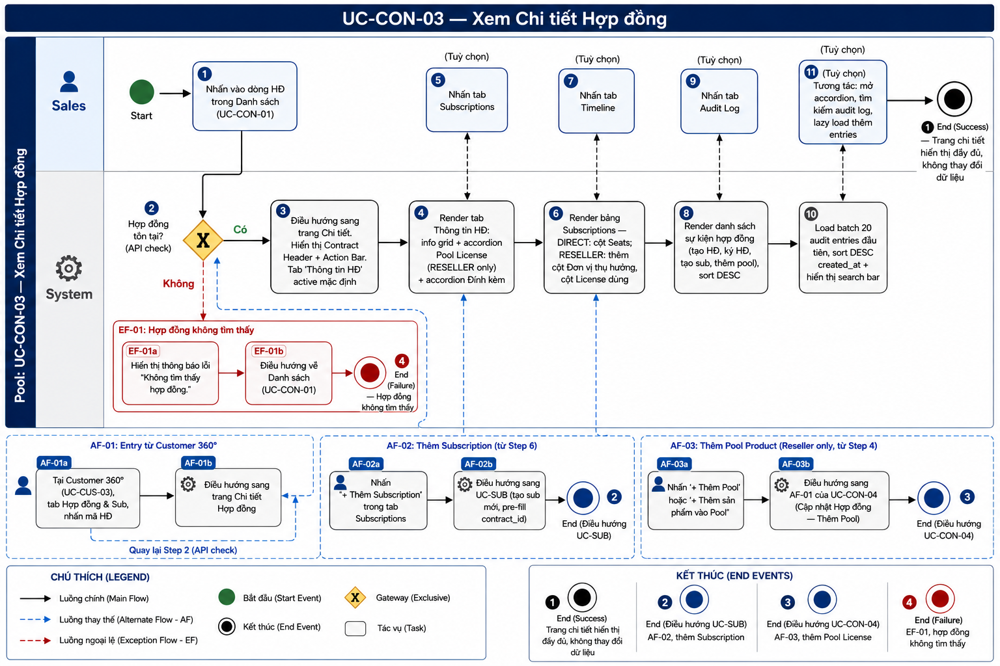
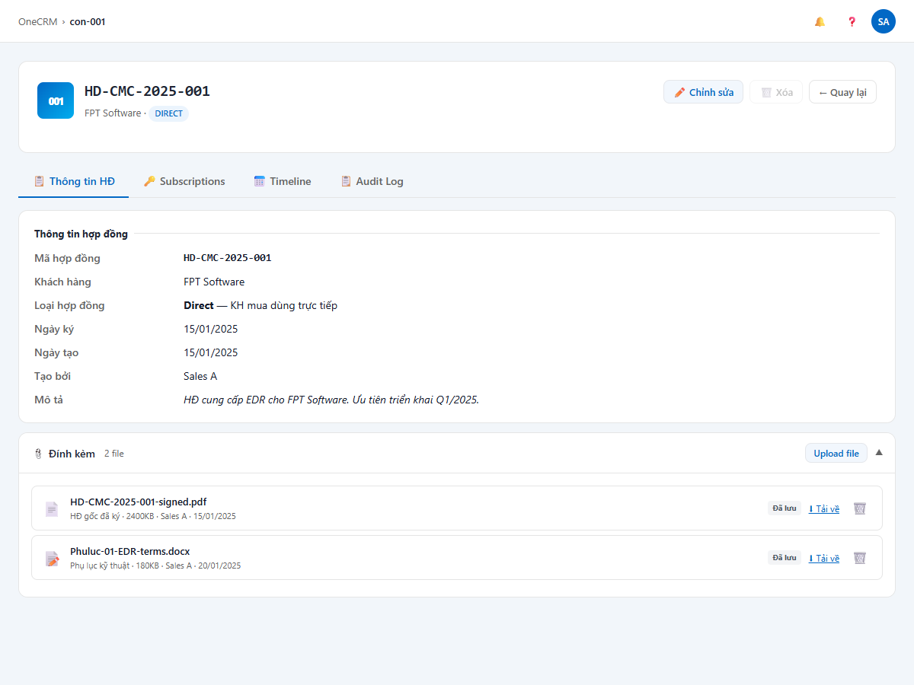
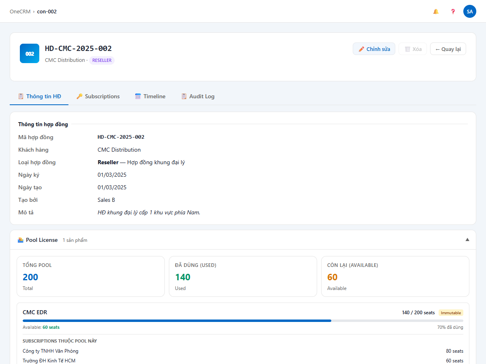
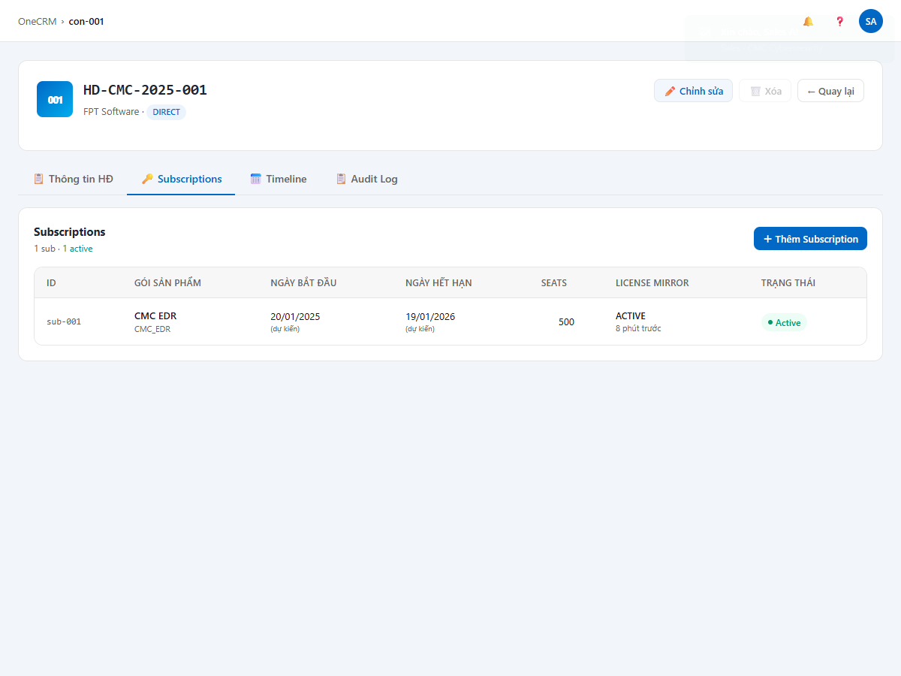
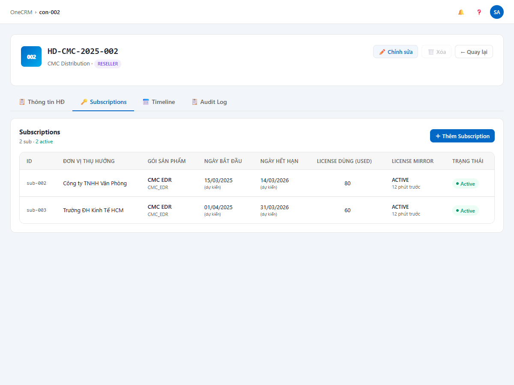
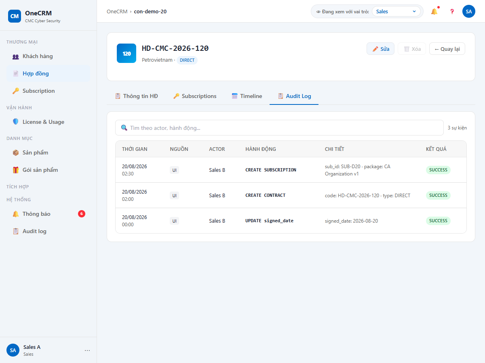

# UC-CON-03 — Xem Chi tiết Hợp đồng

> Module: M-02 Contract Management | Phiên bản: 1.3 | Ngày: 07/07/2026
> Trạng thái: Draft for Review

---

## 1. Thông tin chung

| Thuộc tính | Nội dung |
|---|---|
| **Tên chức năng** | Xem Chi tiết Hợp đồng |
| **UC ID** | UC-CON-03 |
| **Mô tả** | Sales xem toàn bộ thông tin của một hợp đồng qua 4 tab: **Thông tin HĐ**, **Subscriptions**, **Timeline**, **Audit Log**. Màn hình chỉ đọc — không thay đổi dữ liệu. |
| **Tác nhân** | Sales, Manager |
| **Tiền điều kiện** | Đã đăng nhập và có quyền `contract:view`. Hợp đồng tồn tại trong hệ thống (chưa bị xóa). |
| **Hậu điều kiện** | (Success) Trang chi tiết hiển thị đúng và đầy đủ thông tin hợp đồng. Không thay đổi dữ liệu. (Failure) Hợp đồng không tìm thấy → thông báo lỗi, redirect về Danh sách. |
| **Điểm vào** | (1) Nhấn vào dòng hợp đồng trong Danh sách UC-CON-01.<br>(2) Nhấn mã HĐ trong Tab Hợp đồng & Sub của UC-CUS-03 (Customer 360°). |

### Quy tắc nghiệp vụ

| BR ID | Nội dung |
|---|---|
| BR-01 | Tab **Subscriptions** hiển thị với **cả DIRECT và RESELLER**. Với DIRECT: hiển thị danh sách sub của chính KH đó. Với RESELLER: hiển thị danh sách sub của các end-customer (beneficiary) — mỗi sub mới được tạo khi một khách hàng thật ký hợp đồng với reseller và được provisioning. |
| BR-02 | `activated_at` và `expires_at` trong License Mirror lấy từ `license_mirror`. CRM không tự tính — nếu chưa nhận event webhook → hiển thị placeholder "—". |
| BR-03 | Audit Log sắp xếp DESC theo `created_at`. Scope: `entity_type = 'CONTRACT' AND entity_id = {id}`. Batch đầu 20, lazy load trigger `scrollHeight - 80px`, batch size 20. Search client-side, debounce 300ms. |
| BR-04 | Trạng thái sub được phản ánh qua webhook — trang detail chỉ đọc, không tự thay đổi trạng thái. |
| BR-05 | Pool progress bar hiển thị màu cam khi `allocated / total > 80%`. |

---

## 2. Luồng nghiệp vụ



### 2.1 Luồng chính

| Bước | Actor | Hành động / Phản hồi |
|---|---|---|
| **1** | Sales | Nhấn vào dòng hợp đồng trong Danh sách (UC-CON-01) hoặc nhấn mã HĐ trong tab Hợp đồng & Sub của Customer 360° (UC-CUS-03). |
| **2** | System | Gọi API kiểm tra hợp đồng tồn tại theo `contractId`. **[Gateway — Hợp đồng tồn tại?]** Có → tiếp bước 3. Không → **EF-01**. |
| **3** | System | Điều hướng sang trang Chi tiết. Hiển thị **Contract Header** (mã HĐ, tên KH, badge Loại HĐ) và **Action Bar**. Tab **Thông tin HĐ** active mặc định. |
| **4** | System | Render tab **Thông tin HĐ**: info grid (mã HĐ, KH, loại, ngày ký, ngày tạo, người tạo, mô tả) + accordion **Pool License** (RESELLER only) + accordion **Đính kèm**. |
| **5** | Sales | *(Tuỳ chọn)* Nhấn tab **Subscriptions**. |
| **6** | System | Render bảng Subscriptions. DIRECT: cột Seats, không có Đơn vị thụ hưởng. RESELLER: thêm cột Đơn vị thụ hưởng, cột License dùng thay Seats. Nút **＋ Thêm Subscription** ở đầu panel. |
| **7** | Sales | *(Tuỳ chọn)* Nhấn tab **Timeline**. |
| **8** | System | Render danh sách sự kiện của hợp đồng (tạo HĐ, ký HĐ, tạo sub, thêm pool) — sort DESC theo thời gian. |
| **9** | Sales | *(Tuỳ chọn)* Nhấn tab **Audit Log**. |
| **10** | System | Load batch 20 audit entries đầu tiên, sort DESC `created_at`. Hiển thị search bar. |
| **11** | Sales | *(Tuỳ chọn)* Tương tác: mở rộng accordion, tìm kiếm audit log, lazy load thêm entries. |
| → | — | **End 1 (Success)** — Trang chi tiết hiển thị đầy đủ. Không thay đổi dữ liệu. |

### 2.2 Luồng phụ

**[AF-01: Entry từ Customer 360°]** — kích hoạt tại bước 1 khi entry point là tab Hợp đồng & Sub.

| Bước | Actor | Hành động / Phản hồi |
|---|---|---|
| **AF-01a** | Sales | Tại Customer 360° (UC-CUS-03), tab Hợp đồng & Sub, nhấn mã hợp đồng. |
| **AF-01b** | System | Điều hướng sang trang Chi tiết Hợp đồng. |
| → | — | Quay lại luồng chính tại **bước 2** (API check). |

**[AF-02: Thêm Subscription]** — kích hoạt tại bước 6 khi Sales nhấn "＋ Thêm Subscription".

| Bước | Actor | Hành động / Phản hồi |
|---|---|---|
| **AF-02a** | Sales | Nhấn **"＋ Thêm Subscription"** trong tab Subscriptions. |
| **AF-02b** | System | Điều hướng sang UC-SUB (tạo sub mới, pre-fill `contract_id`). |
| → | — | **End 2 (Điều hướng UC-SUB)** — Sales tiếp tục tại UC-SUB. |

**[AF-03: Thêm Pool Product (RESELLER only)]** — kích hoạt từ bước 4, accordion Pool License.

| Bước | Actor | Hành động / Phản hồi |
|---|---|---|
| **AF-03a** | Sales | Nhấn **"＋ Thêm Pool"** hoặc **"＋ Thêm sản phẩm vào Pool"** trong accordion Pool License. |
| **AF-03b** | System | Điều hướng sang AF-01 của UC-CON-04 (Cập nhật Hợp đồng — Thêm Pool). |
| → | — | **End 3 (Điều hướng UC-CON-04)** — Sales tiếp tục tại UC-CON-04. |

### 2.3 Luồng ngoại lệ

**[EF-01: Hợp đồng không tìm thấy]** — kích hoạt tại bước 2 khi API trả về không có kết quả.

| Bước | Actor | Hành động / Phản hồi |
|---|---|---|
| **EF-01a** | System | Hiển thị thông báo lỗi: *"Không tìm thấy hợp đồng."* |
| **EF-01b** | System | Điều hướng về Danh sách Hợp đồng (UC-CON-01). |
| → | — | **End 4 (Failure — EF-01)** |

### 2.4 Điểm kết thúc (End Events)

| # | Tên | Điều kiện |
|---|---|---|
| **End 1** | Success — Xem chi tiết thành công | Luồng chính hoàn tất, trang chi tiết hiển thị đầy đủ |
| **End 2** | Điều hướng UC-SUB | AF-02: Sales nhấn "＋ Thêm Subscription" |
| **End 3** | Điều hướng UC-CON-04 | AF-03: Sales nhấn "＋ Thêm Pool" (RESELLER) |
| **End 4** | Failure — EF-01 | Hợp đồng không tìm thấy, redirect về danh sách |

---

## 3. Mô tả giao diện

Tab navigation cố định: `📋 Thông tin HĐ | 🔑 Subscriptions | 📅 Timeline | 📋 Audit Log`

### 3.1 Contract Header & Action Bar

```
┌─────────────────────────────────────────────────────────────┐
│  [icon] HD-CMC-2025-001                                     │
│         FPT Software · [DIRECT]                             │
│                              [✏️ Chỉnh sửa] [🗑️ Xóa] [← Quay lại] │
└─────────────────────────────────────────────────────────────┘
```

**Contract Header:**

| Element | Nguồn dữ liệu | Ghi chú |
|---|---|---|
| Icon placeholder | 3 ký tự cuối `contract.code` | Font nhỏ, bold, nền xám |
| Mã HĐ | `contract.code` | Font monospace, in đậm |
| Tên KH | `contract.customerName` | Dòng phụ dưới mã HĐ |
| Badge Loại HĐ | `contract.type` | Badge DIRECT (xanh dương) / RESELLER (tím) |

**Action Bar:**

| Nút | Điều kiện | Hành động |
|---|---|---|
| ✏️ Chỉnh sửa | Luôn hiển thị | Điều hướng → UC-CON-04 |
| 🗑️ Xóa | Active nếu `subs.length = 0`; Disabled nếu `subs.length > 0` | Điều hướng → UC-CON-06. Tooltip khi disabled: *"Đã có Subscription, không thể xóa"* |
| ← Quay lại | Luôn hiển thị | Điều hướng → Danh sách (UC-CON-01) |

---

### 3.2 Tab 1 — Thông tin HĐ





#### Info Grid

Layout 2 cột (label — value), font-size 14px:

| # | Label | Nguồn dữ liệu | Ghi chú |
|---|---|---|---|
| 1 | Mã hợp đồng | `contract.code` | Monospace, font-weight 600 |
| 2 | Khách hàng | `contract.customerName` | Text-link → UC-CUS-03 (Customer 360°) |
| 3 | Loại hợp đồng | `contract.type` | "**Direct** — KH mua dùng trực tiếp" / "**Reseller** — Hợp đồng khung đại lý" |
| 4 | Ngày ký | `contract.signedDate` | Format dd/MM/yyyy. Hiển thị *"Chưa có"* (italic, màu nhạt) nếu null |
| 5 | Ngày tạo | `contract.createdAt` | Format dd/MM/yyyy |
| 6 | Tạo bởi | `contract.createdBy` | Display name |
| 7 | Mô tả | `contract.description` | Italic. **Ẩn hàng này nếu null** (không hiện label trống) |

#### Accordion "🏊 Pool License" (RESELLER only)

Không hiển thị với hợp đồng DIRECT.

**Header accordion:** `🏊 Pool License [N sản phẩm]` · chevron ▼/▲ toggle

**Nội dung khi có pool items:**

- Summary row — 3 stat cards: **Tổng pool** (total seats), **Đã dùng** (allocated), **Còn lại** (available)
- Mỗi pool item hiển thị:
  - Tên sản phẩm (bold) + `Immutable` badge (xanh lá nhạt)
  - `{allocatedQty} / {poolTotal} seats`
  - Progress bar: màu cam nếu `allocated/total > 80%` (BR-05)
  - `Available: {remaining} seats | {pct}% đã dùng`
  - Sub-list "Subscriptions thuộc pool này" (nếu có) — mỗi dòng: tên beneficiary + seats
- Nút **＋ Thêm sản phẩm vào Pool** → AF-03

**Nội dung khi chưa có pool:**

- Text: *"Chưa cấu hình pool."* + nút **＋ Thêm Pool** → AF-03

#### Accordion "📎 Đính kèm"

Áp dụng cho cả DIRECT và RESELLER. Xem mô tả đầy đủ tại **UC-CON-05**.

**Header accordion:** `📎 Đính kèm [{N} file]` · nút **Upload file** (Sales & Manager) · chevron ▼/▲

**Mỗi file đính kèm:**

| Element | Mô tả |
|---|---|
| Icon loại file | Emoji theo extension (PDF, Word, Excel…) |
| Tên file | Truncate với ellipsis nếu dài |
| Metadata | `{mô tả} · {size}KB · {uploadedBy} · {uploadedAt}` |
| Badge "Đã lưu" | Xám nhạt |
| ⬇ Tải về | Text-link, underline |
| 🗑️ Xóa | Active với Manager hoặc người upload; disabled với người khác |

**Empty state:** icon 📎 + *"Chưa có file đính kèm"*

---

### 3.3 Tab 2 — Subscriptions





Tab này hiển thị với **cả DIRECT và RESELLER** (BR-01).

**Panel header:** `Subscriptions | {N} sub · {M} active` — căn trái. Nút **＋ Thêm Subscription** — căn phải.

**Bảng Subscriptions:**

| Cột | DIRECT | RESELLER | Ghi chú |
|---|---|---|---|
| ID | ✅ | ✅ | Monospace, color: text-secondary |
| Đơn vị thụ hưởng | ❌ | ✅ | `beneficiaryName`. "—" nếu null |
| Gói sản phẩm | ✅ | ✅ | `packageName` (bold) + `productId` (nhỏ, nhạt) |
| Ngày bắt đầu | ✅ | ✅ | dd/MM/yyyy + label *(dự kiến)* |
| Ngày hết hạn | ✅ | ✅ | dd/MM/yyyy + label *(dự kiến)* |
| Seats | ✅ | ❌ | `seatCount` |
| License dùng (Used) | ❌ | ✅ | `licenseQty` |
| License Mirror | ✅ | ✅ | `licMirrorStatus` (bold) + `lastSync` (nhỏ, nhạt) |
| Trạng thái | ✅ | ✅ | Badge theo trạng thái (xem bảng bên dưới) |

**Badge trạng thái Subscription:**

| Trạng thái | Badge |
|---|---|
| DRAFT | Xám nhạt |
| PENDING_PROVISION | Cam nhạt, dot cam |
| ACTIVE | Xanh nhạt, dot xanh |
| SUSPENDED | Vàng nhạt |
| EXPIRED | Đỏ nhạt, dot đỏ |
| REVOKED | Xám |
| RENEWED | Tím nhạt |

**Empty state:** icon 🔑 + *"Chưa có Subscription nào"*

---

### 3.4 Tab 3 — Timeline

Tab này hiển thị lịch sử sự kiện của hợp đồng, tương đương Tab Timeline tại UC-CUS-03.

**Các loại sự kiện (sort DESC theo thời gian):**

| Icon | Dot | Sự kiện | Điều kiện |
|---|---|---|---|
| 📄 | Xanh dương | `Hợp đồng {code} được tạo` | Luôn có |
| ✍️ | Cam | `Ngày ký hợp đồng được ghi nhận` | Chỉ khi `signedDate` không null |
| 🔑 | Xanh lá | `Subscription {sub.id} được tạo` | Một entry per sub |
| 🏊 | Xanh dương | `Pool License thêm mới — {productName}` | Một entry per pool item (RESELLER) |

**Mỗi entry hiển thị:**

| Element | Mô tả |
|---|---|
| Icon + dot màu | Phân biệt loại sự kiện |
| Tiêu đề sự kiện | Bold |
| Thời gian | dd/MM/yyyy HH:mm, màu nhạt |
| Actor | Tag xám nhạt (display name) |
| Chi tiết | Italic, màu nhạt (type, package, pool_total…) |

**Empty state:** icon 📅 + *"Chưa có sự kiện"*

---

### 3.5 Tab 4 — Audit Log



Search bar cố định ở đầu panel (ngoài scroll container).

**Cột:**

| # | Cột | Nguồn dữ liệu | Searchable |
|---|---|---|---|
| 1 | Thời gian | `audit_log.created_at` — dd/MM/yyyy (dòng 1) + HH:mm (dòng 2, nhạt) | ❌ |
| 2 | Nguồn | `audit_log.source` — badge xám nhạt hiển thị giá trị gốc (UI / WEBHOOK / System…) | ❌ |
| 3 | Actor | `audit_log.actor` | ✅ |
| 4 | Hành động | `audit_log.action` — monospace, font-weight 600 | ✅ |
| 5 | Chi tiết | `audit_log.detail` — màu text-secondary, max-width giới hạn | ✅ |
| 6 | Kết quả | Badge xanh SUCCESS / đỏ FAILED | ❌ |

**Tải dữ liệu (đồng bộ với UC-CUS-03 BR-06):**

| Thuộc tính | Giá trị |
|---|---|
| Scope | `entity_type = 'CONTRACT' AND entity_id = {id}` |
| Sort | DESC `audit_log.created_at` |
| Batch đầu | 20 bản ghi gần nhất |
| Lazy load trigger | Scroll đến `scrollHeight - 80px` |
| Batch size | 20 bản ghi / lần |
| Counter | `{loaded}/{total} bản ghi` khi không search · `{n} kết quả` khi search |

**Search:**

| Thuộc tính | Giá trị |
|---|---|
| Scope | Actor + Hành động + Chi tiết |
| Xử lý | Client-side filter, debounce 300ms |
| Khi search active | Hiển thị toàn bộ kết quả match — lazy load tạm dừng |
| Khi xóa search | Reset lazy state, load lại từ đầu |

**Empty state (search không có kết quả):** Icon 🔍 + *"Không tìm thấy kết quả"* + *"Thử từ khoá khác"*

---

## 4. Acceptance Criteria

### Nhóm 1: Điều hướng và hiển thị

| AC ID | Given | When | Then |
|---|---|---|---|
| AC-CON-03-01 | HĐ "HD-CMC-2025-001" (DIRECT) tồn tại | Sales nhấn vào dòng HĐ trong Danh sách | Trang Chi tiết mở. Contract Header hiển thị đúng mã HĐ, tên KH, badge DIRECT. Tab Thông tin HĐ active mặc định. |
| AC-CON-03-02 | Hợp đồng ID không tồn tại | Sales truy cập URL `/contracts/{invalid-id}` | Thông báo lỗi *"Không tìm thấy hợp đồng."* Điều hướng về Danh sách. |
| AC-CON-03-03 | HĐ "HD-CMC-2025-001" được mở từ Customer 360° | Sales nhấn mã HĐ trong tab Hợp đồng & Sub | Trang Chi tiết mở đúng HĐ (AF-01). Breadcrumb cập nhật. |
| AC-CON-03-04 | HĐ DIRECT, `subs.length = 0` | Sales xem Action Bar | Nút "🗑️ Xóa" active (màu đỏ). |
| AC-CON-03-05 | HĐ DIRECT, `subs.length > 0` | Sales xem Action Bar | Nút "🗑️ Xóa" disabled (opacity 0.4), tooltip *"Đã có Subscription, không thể xóa"*. |
| AC-CON-03-06 | HĐ RESELLER | Sales xem Action Bar | Chỉ có "✏️ Chỉnh sửa", "🗑️ Xóa", "← Quay lại". Không có nút "+ Thêm Subscription". |

### Nhóm 2: Tab Thông tin HĐ

| AC ID | Given | When | Then |
|---|---|---|---|
| AC-CON-03-07 | HĐ DIRECT, `signedDate = null` | Sales xem tab Thông tin HĐ | Trường Ngày ký hiển thị text *"Chưa có"* (italic, màu nhạt). |
| AC-CON-03-08 | HĐ DIRECT, `description = null` | Sales xem tab Thông tin HĐ | Hàng Mô tả **không xuất hiện** (ẩn hoàn toàn — không hiện label trống). |
| AC-CON-03-09 | HĐ RESELLER có 1 pool item (CMC EDR, total=200, allocated=140, pct=70%) | Sales xem accordion Pool License | Summary cards hiển thị đúng. Progress bar CMC EDR màu **xanh** (70% ≤ 80%). |
| AC-CON-03-10 | HĐ RESELLER, pool item allocated=170/200 (85%) | Sales xem accordion Pool License | Progress bar màu **cam** (85% > 80%). |
| AC-CON-03-11 | HĐ DIRECT | Sales xem tab Thông tin HĐ | Accordion "Pool License" **không xuất hiện**. |
| AC-CON-03-12 | HĐ RESELLER chưa có pool nào | Sales mở accordion Pool License | Text *"Chưa cấu hình pool."* + nút "＋ Thêm Pool". |

### Nhóm 3: Tab Subscriptions

| AC ID | Given | When | Then |
|---|---|---|---|
| AC-CON-03-13 | HĐ DIRECT có 2 sub (1 ACTIVE, 1 EXPIRED) | Sales nhấn tab Subscriptions | Bảng 2 dòng. Không có cột "Đơn vị thụ hưởng". Nút "＋ Thêm Subscription" ở đầu panel. |
| AC-CON-03-14 | HĐ RESELLER có 2 sub (beneficiary khác nhau) | Sales nhấn tab Subscriptions | Bảng 2 dòng. Có cột "Đơn vị thụ hưởng". Cột "License dùng (Used)" thay cho "Seats". |
| AC-CON-03-15 | HĐ DIRECT chưa có sub | Sales xem tab Subscriptions | Empty state: icon 🔑 + *"Chưa có Subscription nào"*. Nút "＋ Thêm Subscription" vẫn hiển thị. |
| AC-CON-03-16 | Sub `licMirrorStatus = PENDING`, `lastSync = 'Chưa đồng bộ'` | Sales xem cột License Mirror | Hiển thị "PENDING" + "Chưa đồng bộ" bên dưới. |
| AC-CON-03-17 | Sales nhấn "＋ Thêm Subscription" trong tab Subs | | Điều hướng sang UC-SUB với `contract_id` pre-fill. |

### Nhóm 4: Tab Timeline

| AC ID | Given | When | Then |
|---|---|---|---|
| AC-CON-03-18 | HĐ DIRECT có `signedDate` và 2 subs | Sales nhấn tab Timeline | Ít nhất 4 entries: tạo HĐ, ghi nhận ngày ký, 2 × tạo sub. Sort DESC. |
| AC-CON-03-19 | HĐ DIRECT có `signedDate = null` | Sales nhấn tab Timeline | Entry "Ngày ký" **không xuất hiện**. |
| AC-CON-03-20 | HĐ RESELLER có 1 pool item và 2 subs | Sales nhấn tab Timeline | Có entry "Pool License thêm mới — {productName}" + 2 entry tạo sub. |

### Nhóm 5: Tab Audit Log

| AC ID | Given | When | Then |
|---|---|---|---|
| AC-CON-03-21 | HĐ có 5 audit entries | Sales mở tab Audit Log | 5 entries hiển thị DESC theo `created_at`. Counter *"5 / 5 bản ghi"*. |
| AC-CON-03-22 | HĐ có 47 audit entries, đang hiển thị 20 entries đầu (counter "20 / 47") | Sales cuộn đến cuối | 20 entries tiếp theo được tải thêm (append). Counter cập nhật *"40 / 47"*. |
| AC-CON-03-23 | Sales nhập "FPT" vào ô tìm kiếm (sau debounce 300ms) | | Chỉ hiện entries có "FPT" trong Actor/Hành động/Chi tiết. Counter hiển thị *"N kết quả"*. Lazy load tạm dừng. |
| AC-CON-03-24 | Sales xóa nội dung ô tìm kiếm | | Toàn bộ entries hiển thị lại. Lazy load hoạt động trở lại. Counter về *"{loaded}/{total} bản ghi"*. |
| AC-CON-03-25 | Entry có `source = 'WEBHOOK'` | Sales xem cột Nguồn | Badge xám nhạt hiển thị text "WEBHOOK". |

---

## 5. Lịch sử thay đổi

| Phiên bản | Ngày | Người cập nhật | Nội dung |
|---|---|---|---|
| 1.0 | 06/07/2026 | Claude (AI) | Tạo mới — bóc tách từ PRD v2.3 section 6.2.4. |
| 1.1 | 06/07/2026 | Claude (AI) | Giải quyết OQ-01/OQ-03: nút "+ Thêm Sub" luôn hiển thị với DIRECT; xóa BR Timeline (provisioning events thuộc Sub detail). |
| 1.2 | 06/07/2026 | Claude (AI) | Self-review theo checklist FRS: tách gateway bước 5, chuẩn ngôn ngữ, thêm End Events, bổ sung AC còn thiếu. |
| 1.3 | 07/07/2026 | Claude (AI) | Cập nhật theo quyết định BA: (A-01) đổi sang tab-based layout 4 tabs; (A-02/A-03) Pool & Đính kèm accordion trong tab Thông tin HĐ; (A-04) Subs tab hiển thị cả DIRECT & RESELLER; (A-05) Sales & Manager đều xóa được; (A-07) "+ Thêm Sub" chỉ trong tab Subs; (B-01) bổ sung mô tả tab Timeline; (B-02) đổi Subs panel sang table layout; (B-03) Ngày ký trong info grid; (C-01) Audit Log đồng bộ lazy load với UC-CUS-03; (C-02) cột Nguồn: gray badge per demo. |
| 1.4 | 08/07/2026 | Claude (AI) | Cập nhật section 2 theo BPMN UC-CON-03: nhúng ảnh BPMN, tách bước 2 (API check gateway) ra khỏi bước redirect, đánh lại số bước 3-11 khớp badge BPMN, cập nhật AF-01/AF-02/AF-03 dùng prefix chuẩn, thêm section 2.4 End Events. |

### Quyết định đã chốt

| # | Nội dung | Quyết định |
|---|---|---|
| OQ-01 | Nút "+ Thêm Subscription" hiển thị ở đâu? | Chỉ trong tab Subscriptions, không ở action bar. |
| OQ-02 | Tab Subscriptions hiển thị cho loại HĐ nào? | Cả DIRECT và RESELLER. RESELLER có thêm cột Đơn vị thụ hưởng. |
| OQ-03 | Tab Timeline có trong scope UC-CON-03 không? | Có. Events: tạo HĐ, ký HĐ, tạo sub, thêm pool. |

---

## Footer

| Thuộc tính | Giá trị |
|---|---|
| **Demo HTML** | [v2.3.2_contracts.html](../../demo/v2.3.2_contracts.html) |
| **Figma** | _(chưa có link — cần BA bổ sung)_ |
| **API Contract** | _(chưa có link — cần BE bổ sung)_ |
| **UC liên quan** | UC-CON-01 (Danh sách HĐ) · UC-CON-04 (Cập nhật HĐ) · UC-CON-05 (Quản lý đính kèm) · UC-CON-06 (Xóa HĐ) · UC-CUS-03 (Customer 360°) |
