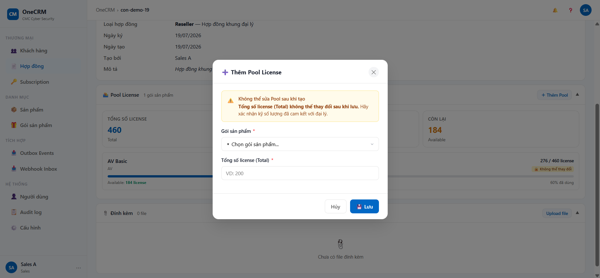

# UC-CON-04 — Cập nhật Hợp đồng

> Module: M-02 Contract Management | Phiên bản: 1.0 | Ngày: 06/07/2026
> Trạng thái: Draft for Review

---

## 1. Thông tin chung

| Thuộc tính | Nội dung |
|---|---|
| **Mã Use Case** | UC-CON-04 |
| **Tên** | Cập nhật Hợp đồng |
| **Mô tả** | Sales chỉnh sửa các trường có thể thay đổi của hợp đồng đã tồn tại (Ngày ký, Mô tả). Mã HĐ, Khách hàng, và Loại HĐ là cố định — không thể sửa. Với HĐ loại `RESELLER`, UC này bao gồm thêm luồng phụ Thêm Pool License mới. |
| **Tác nhân** | Sales |
| **Tiền điều kiện** | Đã đăng nhập hệ thống; có quyền `contract:update`. HĐ tồn tại và `deletedAt IS NULL`. Luồng phụ Thêm Pool: HĐ phải có `type = RESELLER`. |
| **Hậu điều kiện (Lưu thành công)** | `signedDate` và/hoặc `description` được cập nhật. Audit log ghi (best-effort). |
| **Hậu điều kiện (Thêm Pool thành công)** | Pool item mới thêm với `allocatedQty = 0`. `pool_total` của item này cố định ngay sau khi lưu. |
| **Hậu điều kiện (Đã đủ pool)** | Không mở modal, thông báo "Đã đủ pool". Không có thay đổi. |
| **Hậu điều kiện (Hủy)** | Không có thay đổi nào được lưu. |
| **Trigger** | Cập nhật: click "✏️ Sửa" tại Danh sách hoặc "✏️ Chỉnh sửa" tại Chi tiết HĐ. Thêm Pool: click "+ Thêm Pool" tại panel License Pool trong Chi tiết HĐ. |
| **Liên kết** | UC-CON-01 (Danh sách), UC-CON-03 (Chi tiết) |

### Business Rules

| Mã | Nội dung |
|---|---|
| **BR-01** | `contract.code`, `customerId`, `contract.type` là cố định — hiển thị readonly với icon 🔒 và ghi chú "Không thể thay đổi". Không thể nhập vào các field này. |
| **BR-02** | Mỗi Gói sản phẩm tối đa 1 pool item/hợp đồng. Dropdown Sản phẩm trong modal Thêm Pool chỉ hiển thị sản phẩm chưa có pool item trên HĐ đó. |
| **BR-03** | `pool_total` của pool item là bất biến ngay sau khi lưu — không có luồng sửa lại. |
| **BR-04** | Luồng Thêm Pool chỉ áp dụng với `RESELLER`. Nếu tất cả sản phẩm trong catalog đã có pool item trên HĐ → không mở modal, thông báo "Đã đủ pool". |
| **BR-05** | Audit log theo nguyên tắc best-effort: nếu ghi thất bại, thao tác cập nhật/thêm pool vẫn được lưu (không rollback). |
| **BR-06** | Ngày ký không có ràng buộc range hoặc lifecycle — có thể chỉnh sửa nhiều lần, không giới hạn số lần sửa. |

---

## 2. Luồng nghiệp vụ

### 2.1 Luồng chính — Cập nhật thông tin cơ bản

| Bước | Tác nhân | Hành động | Ghi chú |
|---|---|---|---|
| 1 | Sales | Nhấn "✏️ Sửa" (Danh sách) hoặc "✏️ Chỉnh sửa" (Chi tiết HĐ). | — |
| 2 | System | Mở modal "Cập nhật Hợp đồng". Pre-fill các trường: Mã HĐ, KH, Loại HĐ (readonly 🔒) và Ngày ký, Mô tả (editable). | — |
| 3 | Sales | Chỉnh sửa Ngày ký (tuỳ chọn). | Theo BR-06. |
| 4 | Sales | Chỉnh sửa Mô tả (tuỳ chọn). | — |
| 5 | Sales | Nhấn "💾 Lưu". | — |
| 6 | System | Validate: chỉ kiểm tra định dạng ngày hợp lệ (nếu có nhập). Không có field bắt buộc nào. | — |
| 7 | System | Ghi đè `signedDate`, `description` vào Contract record. Ghi audit log (best-effort, BR-05). | — |
| 8 | System | Đóng modal. Hiển thị toast "Đã lưu — Hợp đồng {code} đã được cập nhật". Nếu đang ở Chi tiết → refresh panel Thông tin chung. Nếu đang ở Danh sách → refresh danh sách. | — |

### 2.2 Luồng phụ

#### AF-01 — Thêm Pool License (chỉ áp dụng với RESELLER)

| Bước | Tác nhân | Hành động | Ghi chú |
|---|---|---|---|
| 1a | Sales | Tại Chi tiết HĐ (RESELLER), panel License Pool, nhấn "+ Thêm Pool". | — |
| 1b | System | Lọc catalog sản phẩm, loại trừ sản phẩm đã có pool item trên HĐ này. | Theo BR-02. |
| 1c | System | Kiểm tra: còn sản phẩm khả dụng không? **Không** → toast "Đã đủ pool — Tất cả sản phẩm đều đã có pool", kết thúc luồng. **Có** → tiếp tục. | Theo BR-04. |
| 1d | System | Mở modal "🏊 Thêm Pool License". Hiển thị alert: "Không thể sửa Pool sau khi tạo — Tổng số license (Total) không thể thay đổi sau khi lưu." | Luôn hiển thị alert. |
| 1e | Sales | Chọn Sản phẩm từ dropdown (chỉ sản phẩm chưa có pool). | — |
| 1f | Sales | Nhập Tổng số license (Total). | Số nguyên > 0. |
| 1g | Sales | Nhấn "💾 Thêm Pool". | — |
| 1h | System | Validate: Sản phẩm bắt buộc; Tổng số license phải là số nguyên > 0. Nếu thất bại → **EF-01**. | — |
| 1i | System | Thêm pool item: `{productId, poolTotal, allocatedQty: 0}`. `pool_total` cố định ngay (BR-03). | — |
| 1j | System | Đóng modal. Refresh panel License Pool. Toast "Đã thêm Pool — {tên sản phẩm}: {số lượng} seats". | — |

#### AF-02 — Hủy

| Bước | Tác nhân | Hành động |
|---|---|---|
| 1 | Sales | Nhấn "Hủy", nút "✕", hoặc click vào vùng overlay bên ngoài modal. |
| 2 | System | Đóng modal ngay, không hiển thị dialog xác nhận. Không lưu bất kỳ thay đổi nào. Dữ liệu đã nhập bị hủy. |

### 2.3 Luồng ngoại lệ

#### EF-01 — Validate thất bại khi Thêm Pool

| Bước | Hành động |
|---|---|
| 1 | Nếu thiếu Sản phẩm → lỗi inline: "Vui lòng chọn sản phẩm". |
| 2 | Nếu Tổng số license để trống hoặc ≤ 0 → lỗi inline: "Số lượng phải lớn hơn 0". |
| 3 | Modal giữ nguyên dữ liệu đã nhập. Không thêm pool item. |

---

## 3. Mô tả giao diện

### 3.1 Tổng quan

UC-CON-04 tương tác qua 2 modal:
1. **Modal "Cập nhật Hợp đồng":** Cập nhật Ngày ký và Mô tả. Các trường cố định hiển thị readonly.
2. **Modal "🏊 Thêm Pool License":** Thêm pool item mới vào HĐ RESELLER.

Ngoài ra, panel License Pool tại Chi tiết HĐ (UC-CON-03) là điểm trigger cho AF-01.

### 3.2 Mô tả component

#### Modal "Cập nhật Hợp đồng"

| Component | Loại | Editable | Mô tả |
|---|---|---|---|
| Mã Hợp đồng | Text input | ❌ | Readonly. Hiển thị icon 🔒 và ghi chú "Không thể thay đổi". |
| Khách hàng | Text | ❌ | Readonly. Hiển thị icon 🔒. |
| Loại HĐ | Text | ❌ | Readonly. Hiển thị icon 🔒. Text: "DIRECT — KH mua dùng trực tiếp" hoặc "RESELLER — Hợp đồng khung đại lý". |
| Ngày ký | Date picker | ✅ | Editable. Format `dd/MM/yyyy`. Hint: "Chỉnh sửa được khi có phụ lục đính chính". |
| Mô tả | Textarea | ✅ | Editable. 3 rows. Có thể kéo dọc để mở rộng. |
| "💾 Lưu" | Primary button | — | Submit luồng chính. |
| "Hủy" | Ghost button | — | Thực hiện AF-02. |

#### Panel "License Pool" tại Chi tiết HĐ (RESELLER only)

| Component | Mô tả |
|---|---|
| Bảng danh sách pool | Các cột: Sản phẩm / Total / Used / Available. Dữ liệu read-only. |
| Nút "+ Thêm Pool" | Hiển thị khi HĐ chưa có pool item nào. Trigger AF-01. |
| Nút "+ Thêm sản phẩm vào Pool" | Hiển thị khi HĐ đã có ít nhất 1 pool item. Trigger AF-01. |

#### Modal "🏊 Thêm Pool License"

| Component | Loại | Bắt buộc | Mô tả |
|---|---|---|---|
| Alert cảnh báo | Banner | — | "Không thể sửa Pool sau khi tạo — Tổng số license (Total) không thể thay đổi sau khi lưu." Luôn hiển thị trong modal. |
| Sản phẩm | Dropdown | ✅ | Chỉ hiển thị sản phẩm chưa có pool item trên HĐ này (theo BR-02). |
| Tổng số license (Total) | Number input | ✅ | Số nguyên > 0. Format phân cách nghìn. |
| "💾 Thêm Pool" | Primary button | — | Submit AF-01. |
| "Hủy" | Ghost button | — | Thực hiện AF-02. |

---

## 4. Acceptance Criteria

### Nhóm 1: Cập nhật thông tin cơ bản

| Mã | Given | When | Then |
|---|---|---|---|
| AC-CON-04-01 | HĐ "HD-CMC-2026-014" có Ngày ký 01/07/2026. | Sales sửa Ngày ký thành 15/07/2026, nhấn "Lưu". | `signedDate` cập nhật. Toast "Đã lưu — HD-CMC-2026-014 đã được cập nhật". |
| AC-CON-04-02 | Sales xóa trắng Mô tả, nhấn "Lưu". | — | `description = null`. Cập nhật thành công. |
| AC-CON-04-03 | Sales mở modal nhưng không thay đổi gì, nhấn "Lưu". | — | Cập nhật thành công (no-op). Toast vẫn hiển thị. |
| AC-CON-04-04 | Cập nhật thành công khi đang ở màn hình Chi tiết HĐ. | — | Panel "Thông tin chung" refresh ngay với dữ liệu mới, không cần tải lại trang. |
| AC-CON-04-05 | Cập nhật thành công khi đang ở Danh sách. | — | Danh sách refresh, không thay đổi vị trí sort hiện tại. |
| AC-CON-04-06 | Sales mở modal "Cập nhật Hợp đồng". | — | Mã HĐ, KH, Loại HĐ hiển thị readonly với icon 🔒 và ghi chú "Không thể thay đổi". |

### Nhóm 2: Tính bất biến của Pool

| Mã | Given | When | Then |
|---|---|---|---|
| AC-CON-04-07 | HĐ RESELLER đã có pool "EDR Enterprise: 500". | Mở modal "Cập nhật Hợp đồng". | Không có nút sửa lại `pool_total = 500`; chỉ có thể thêm pool mới cho sản phẩm khác. |

### Nhóm 3: Thêm Pool License

| Mã | Given | When | Then |
|---|---|---|---|
| AC-CON-04-08 | HĐ RESELLER chưa có pool item nào. | Nhấn "+ Thêm Pool", chọn "EPP Business", nhập 300, nhấn "Thêm Pool". | Pool item thêm vào thành công. Toast "Đã thêm Pool — EPP Business: 300 seats". |
| AC-CON-04-09 | HĐ RESELLER đã có pool "EDR Enterprise: 500". | Nhấn "+ Thêm sản phẩm vào Pool", chọn EPR Basic 200. | Pool item mới thêm thành công. Panel hiển thị cả 2 pool item. |
| AC-CON-04-10 | HĐ RESELLER đã có pool item cho tất cả sản phẩm trong catalog. | Nhấn "+ Thêm Pool". | Toast "Đã đủ pool — Tất cả sản phẩm đều đã có pool". Modal không mở. |
| AC-CON-04-11 | HĐ RESELLER đã có pool "EDR Enterprise". | Mở modal "Thêm Pool License". | Dropdown Sản phẩm không hiển thị EDR; chỉ hiển thị sản phẩm còn trống. |

### Nhóm 4: Validation Thêm Pool

| Mã | Given | When | Then |
|---|---|---|---|
| AC-CON-04-12 | Modal "Thêm Pool" đang mở, không chọn Sản phẩm. | Nhấn "Thêm Pool". | Lỗi inline: "Vui lòng chọn sản phẩm". Không thêm pool item. |
| AC-CON-04-13 | Đã chọn Sản phẩm, để trống Tổng số license. | Nhấn "Thêm Pool". | Lỗi inline: "Số lượng phải lớn hơn 0". |
| AC-CON-04-14 | Nhập Tổng số license = 0. | Nhấn "Thêm Pool". | Lỗi inline: "Số lượng phải lớn hơn 0". |

### Nhóm 5: Hủy

| Mã | Given | When | Then |
|---|---|---|---|
| AC-CON-04-15 | Sales đã sửa Ngày ký/Mô tả trong modal Cập nhật. | Nhấn "Hủy", "✕", hoặc click ngoài overlay. | Modal đóng ngay, không có dialog xác nhận. Dữ liệu HĐ không thay đổi. |
| AC-CON-04-16 | Sales đã nhập Sản phẩm/Số lượng trong modal Thêm Pool. | Nhấn "Hủy" hoặc "✕". | Modal đóng ngay. Không thêm pool item. |

---

## 5. Review Checklist

> Claude tự review — đánh dấu ✅/❌ trước khi submit cho BA review.

### Nghiệp vụ
- ✅ Luồng chính bao phủ happy path
- ✅ Luồng phụ đã định nghĩa
- ✅ Luồng ngoại lệ đã xử lý
- ✅ BR đã định nghĩa rõ
- ✅ AC bao phủ các trường hợp quan trọng
- ✅ Nội dung bám sát PRD v2.3

### Giao diện
- ✅ Mô tả UI đủ chi tiết
- ✅ Component states đã mô tả
- ✅ Toast/error messages đã định nghĩa
