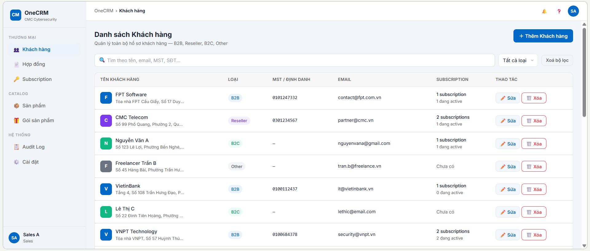
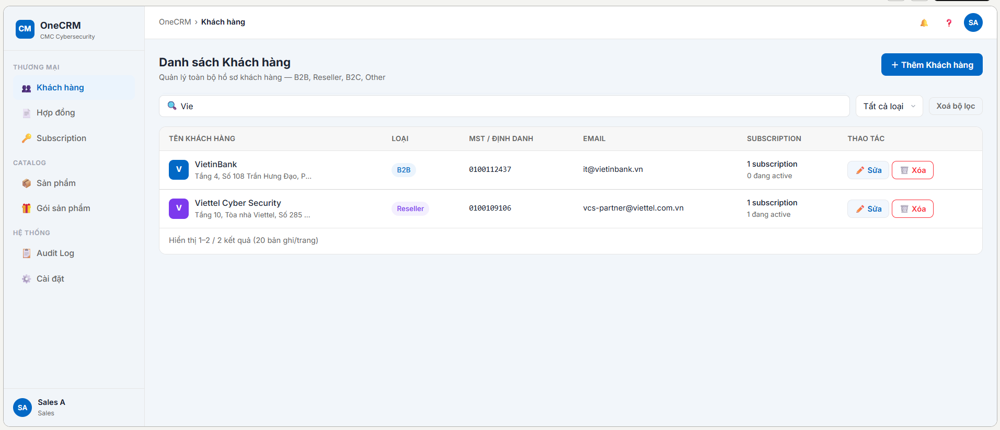
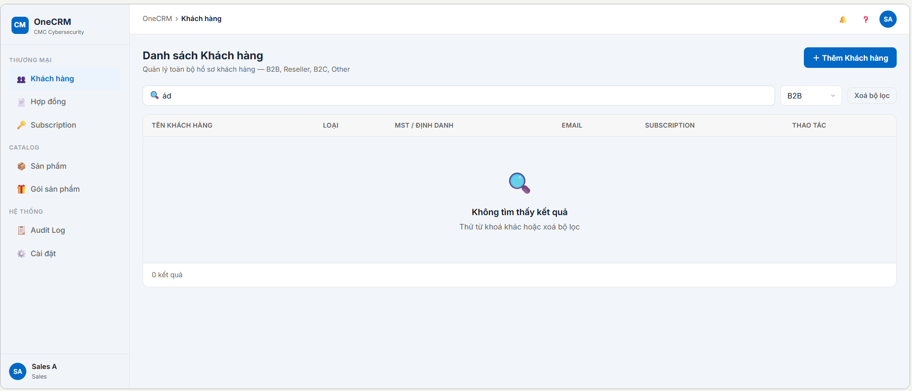

# UC-CUS-01 — Danh sách Khách hàng

> Module: M-01 Customer Management | Phiên bản: 1.0 | Ngày: 06/07/2026
> Trạng thái: Draft for Review

---

## 1. Thông tin chung

| Mục             | Nội dung                                                                                    |
| --------------- | ------------------------------------------------------------------------------------------- |
| **Use Case ID** | UC-CUS-01                                                                                   |
| **Tên**         | Danh sách Khách hàng                                                                        |
| **Mô tả**       | Sales xem, tìm kiếm, lọc danh sách khách hàng. Điểm vào trung tâm của module Customer.    |
| **Tác nhân**    | Sales, Manager                                                                              |
| **Tiền điều kiện** | Đã đăng nhập hệ thống. Có quyền `customer:view`.                                        |
| **Hậu điều kiện** | Không thay đổi dữ liệu. Chỉ đọc và điều hướng sang các use case khác.                   |
| **Use case liên quan** | UC-CUS-02 (Tạo mới), UC-CUS-03 (Xem chi tiết), UC-CUS-04 (Cập nhật), UC-CUS-05 (Xóa) |

### Business Rules

| ID      | Nội dung                                                                                                                           |
| ------- | ---------------------------------------------------------------------------------------------------------------------------------- |
| **BR-01** | Chỉ hiển thị customer có `deleted_at IS NULL`. Customer đã xóa mềm không xuất hiện trong danh sách.                           |
| **BR-02** | Tìm kiếm: fuzzy search theo Tên; exact match theo Email, SĐT, MST. Tối thiểu 2 ký tự mới trigger search. Debounce 300ms.      |
| **BR-03** | Phân trang 20 records/trang.                                                                                                   |
| **BR-04** | Sort mặc định theo Tên A→Z (ascending). Sales không thể thay đổi chiều sort trên màn hình Danh sách.                          |
| **BR-05** | Nhiều bộ lọc kết hợp theo logic AND (Loại KH AND Trạng thái AND keyword search).                                              |
| **BR-06** | P95 response time ≤ 500ms cho mỗi lần load/filter danh sách.                                                                  |

---

## 2. Luồng nghiệp vụ

### 2.1 Luồng chính (Happy Path)

| Bước | Tác nhân  | Hành động                                                                                                  |
| ---- | --------- | ---------------------------------------------------------------------------------------------------------- |
| 1    | Sales     | Click menu **"Khách hàng"** trên sidebar trái.                                                             |
| 2    | System    | Tải danh sách khách hàng: lọc `deleted_at IS NULL`, sort Tên A→Z, hiển thị trang 1 (20 records đầu tiên). |
| 3    | Sales     | (Tuỳ chọn) Nhập từ khóa vào ô tìm kiếm và/hoặc chọn filter Loại KH, Trạng thái.                          |
| 4    | System    | Debounce 300ms sau khi Sales dừng gõ → gọi API với params tìm kiếm/lọc → cập nhật kết quả + counter.      |
| 5    | Sales     | Chọn một trong các hành động trên bảng:                                                                    |
|      |           | • Click vào **tên hoặc row** KH → UC-CUS-03 (Xem chi tiết)                                                |
|      |           | • Click **"+ Thêm Khách hàng"** → UC-CUS-02 (Tạo mới)                                                     |
|      |           | • Click icon **✏️** trên dòng KH → UC-CUS-04 (Cập nhật)                                                   |
|      |           | • Click icon **🗑️** trên dòng KH → UC-CUS-05 (Xóa) — chỉ active khi KH chưa có hợp đồng               |

### 2.2 Luồng phụ

#### AF-01 — Xóa bộ lọc

| Bước | Tác nhân | Hành động                                                                                      |
| ---- | -------- | ---------------------------------------------------------------------------------------------- |
| 1    | Sales    | Nhấn nút **"Xóa bộ lọc"** (xuất hiện khi đang có filter/search đang áp dụng).                 |
| 2    | System   | Reset toàn bộ filter về mặc định: keyword = rỗng, Loại KH = "Tất cả", Trạng thái = "Tất cả". |
| 3    | System   | Render lại toàn bộ danh sách từ đầu (trang 1, sort A→Z).                                      |

### 2.3 Luồng ngoại lệ

#### EF-01 — Không có kết quả tìm kiếm/lọc

| Bước | Tác nhân | Hành động                                                                                                               |
| ---- | -------- | ----------------------------------------------------------------------------------------------------------------------- |
| 1    | System   | Kết quả trả về rỗng (0 records).                                                                                        |
| 2    | System   | Ẩn bảng danh sách và pagination.                                                                                        |
| 3    | System   | Hiển thị **empty state**: icon minh họa + dòng chữ _"Không tìm thấy khách hàng phù hợp"_ + counter **"0 kết quả"**. |
| 4    | System   | Hiển thị nút **"Xóa bộ lọc"** → trigger AF-01.                                                                         |

---

## 3. Mô tả giao diện

### 3.1 Tổng thể trang

Trang gồm 3 vùng chính theo chiều dọc:
1. **Header row**: Tiêu đề "Khách hàng" + nút **"+ Thêm Khách hàng"** (primary, căn phải).
2. **Filter row**: Search bar + 2 dropdown filter.
3. **Data area**: Bảng danh sách + Pagination.

---

### 3.2 Search bar

| Thuộc tính     | Giá trị                                                      |
| -------------- | ------------------------------------------------------------ |
| Placeholder    | `Tìm theo tên, email, SĐT, MST...`                          |
| Loại tìm kiếm  | Fuzzy search theo **Tên**; Exact match theo **Email / SĐT / MST** |
| Min ký tự      | 2 ký tự mới trigger (< 2 ký tự: không gọi API)              |
| Debounce       | 300ms                                                        |
| Clear button   | Hiện icon ✕ khi có nội dung; click để xóa, reset search     |

---

### 3.3 Dropdown bộ lọc

#### Filter "Loại KH"

| Option     | Giá trị lọc  |
| ---------- | ------------ |
| Tất cả     | (không filter) |
| B2B        | `type = B2B` |
| Reseller   | `type = Reseller` |
| B2C        | `type = B2C` |
| Other      | `type = Other` |

#### Filter "Trạng thái"

| Option     | Giá trị lọc         |
| ---------- | ------------------- |
| Tất cả     | (không filter)      |
| ACTIVE     | `status = ACTIVE`   |
| INACTIVE   | `status = INACTIVE` |
| BLACKLIST  | `status = BLACKLIST`|

---

### 3.4 Bảng danh sách

| Cột           | Nội dung                                                                      | Ghi chú                         |
| ------------- | ----------------------------------------------------------------------------- | ------------------------------- |
| **Tên KH**    | Tên khách hàng + Badge Loại bên cạnh                                          | Click row → UC-CUS-03           |
| **MST**       | Mã số thuế. Hiển thị `—` nếu không có (B2C/Other)                           |                                 |
| **Email**     | Email chính. Hiển thị `—` nếu không có                                       |                                 |
| **SĐT**       | Số điện thoại. Hiển thị `—` nếu không có                                     |                                 |
| **Trạng thái**| Badge màu theo trạng thái                                                     | Xem bảng badge bên dưới        |
| **Ngày tạo**  | `dd/MM/yyyy`                                                                  |                                 |
| **Thao tác**  | Icon ✏️ (edit) + Icon 🗑️ (delete)                                            | 🗑️ disabled nếu có hợp đồng  |

#### Badge Trạng thái

| Trạng thái | Màu nền     | Màu chữ    |
| ---------- | ----------- | ---------- |
| ACTIVE     | Xanh lá     | Trắng      |
| INACTIVE   | Xám         | Trắng      |
| BLACKLIST  | Đỏ          | Trắng      |

#### Badge Loại KH

| Loại       | Màu nền      | Màu chữ    |
| ---------- | ------------ | ---------- |
| B2B        | Xanh dương   | Trắng      |
| Reseller   | Tím          | Trắng      |
| B2C        | Cam          | Trắng      |
| Other      | Xám nhạt     | Xám đậm    |

---

### 3.5 Icon Thao tác — Trạng thái

| Điều kiện                         | Icon 🗑️                                                                     |
| --------------------------------- | ---------------------------------------------------------------------------- |
| KH chưa có hợp đồng (`contracts.length = 0`) | Active — màu đỏ, click được, không tooltip             |
| KH có ≥ 1 hợp đồng (`contracts.length ≥ 1`) | Disabled — opacity 0.5, `cursor: not-allowed`, tooltip: _"Chỉ có thể xóa khách hàng chưa phát sinh dữ liệu"_ |

---

### 3.6 Pagination

- Format: **`X–Y / N khách hàng`** (ví dụ: `1–20 / 87 khách hàng`)
- Số records/trang: **20**
- Ẩn hoàn toàn khi kết quả = 0 (EF-01)

---

### 3.7 Component States

| Component          | State          | Mô tả                                         |
| ------------------ | -------------- | --------------------------------------------- |
| Bảng               | Loading        | Skeleton rows hiển thị trong lúc tải dữ liệu  |
| Bảng               | Empty (no data)| Empty state theo EF-01                        |
| "+ Thêm KH"        | Default        | Nút primary, luôn active                      |
| Icon ✏️            | Default        | Luôn active (không bị disable)                |
| Icon 🗑️           | Active         | Màu đỏ, click được                            |
| Icon 🗑️           | Disabled       | Opacity 0.5, không click được, có tooltip     |
| Search bar         | Typing         | Chỉ trigger sau 2 ký tự + debounce 300ms      |

---

## 4. Acceptance Criteria

| AC ID          | Given                                                               | When                                | Then                                                                                                          |
| -------------- | ------------------------------------------------------------------- | ----------------------------------- | ------------------------------------------------------------------------------------------------------------- |
| AC-CUS-01-01   | Hệ thống có 5 KH active + 1 KH có `deleted_at IS NOT NULL`         | Sales mở trang Danh sách            | Chỉ hiển thị 5 KH active. KH đã xóa mềm không xuất hiện.                                                    |
| AC-CUS-01-02   | 3 KH active chưa có HĐ, 1 KH active đã có HĐ                       | Sales xem Danh sách                 | KH có HĐ: icon 🗑️ disabled + tooltip. KH chưa có HĐ: icon 🗑️ active.                                       |
| AC-CUS-01-03   | Sales nhập `"fpt"` vào search bar                                   | Sau debounce 300ms                  | Chỉ hiện KH có **tên** chứa `"fpt"` (fuzzy, case-insensitive). Counter + pagination cập nhật tương ứng.       |
| AC-CUS-01-04   | Sales nhập `"abc@fpt.com"` vào search bar                           | Search thực thi                     | Chỉ hiện KH có email **chính xác** `"abc@fpt.com"` (exact match).                                             |
| AC-CUS-01-05   | Sales nhập 1 ký tự vào search bar                                   | Typing                              | Không trigger search API. Danh sách không thay đổi. (Minimum 2 ký tự)                                        |
| AC-CUS-01-06   | Filter Loại KH = B2B và keyword = `"fpt"` đang được áp dụng        | Filter & search áp dụng đồng thời   | Logic AND: chỉ hiển thị KH loại B2B có tên/email/SĐT/MST match `"fpt"`.                                      |
| AC-CUS-01-07   | Sales đang ở trang Danh sách                                        | Click nút "+ Thêm Khách hàng"       | Điều hướng sang UC-CUS-02 (form tạo mới KH).                                                                  |
| AC-CUS-01-08   | Sales đang ở trang Danh sách                                        | Click vào tên hoặc row của 1 KH     | Điều hướng sang UC-CUS-03 (Customer 360°) của KH đó.                                                          |
| AC-CUS-01-09   | Không có KH nào match với filter/search đang áp dụng                | Filter/search trả về 0 kết quả      | Empty state hiển thị với thông báo "Không tìm thấy khách hàng phù hợp". Bảng ẩn. Pagination ẩn. Nút "Xóa bộ lọc" hiển thị. |

---

## 5. Review Checklist

> Claude tự review — đánh dấu ✅/❌ trước khi submit cho BA review.

### Nghiệp vụ
- ✅ Luồng chính bao phủ happy path
- ✅ Luồng phụ đã định nghĩa
- ✅ Luồng ngoại lệ đã xử lý
- ✅ BR đã định nghĩa rõ
- ✅ AC bao phủ các trường hợp quan trọng
- ✅ Nội dung bám sát PRD v2.3

### Giao diện
- ✅ Wireframe hoặc mô tả UI đủ chi tiết
- ✅ Component states (default/disabled/loading) đã mô tả
- ✅ Toast/error messages đã định nghĩa
