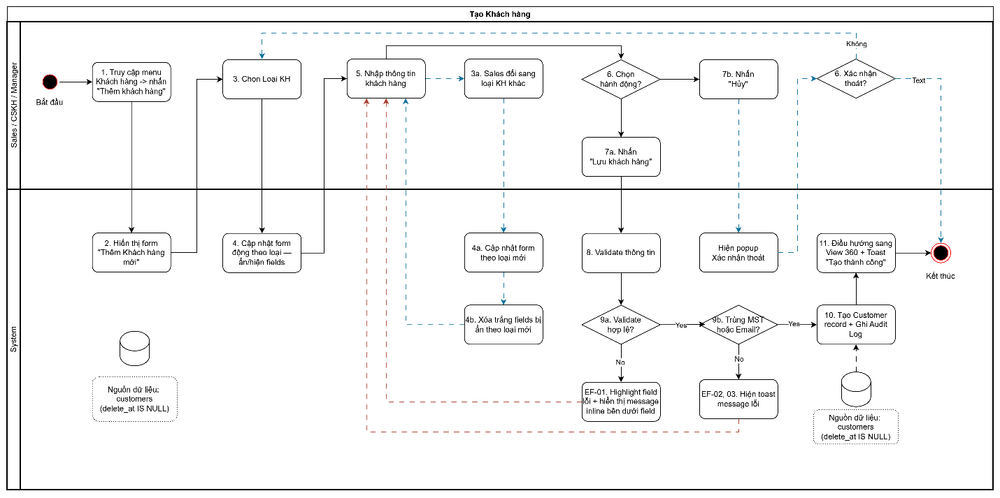
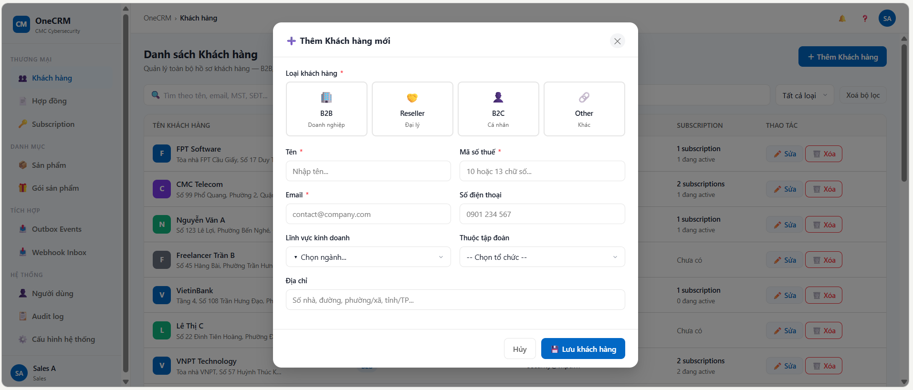
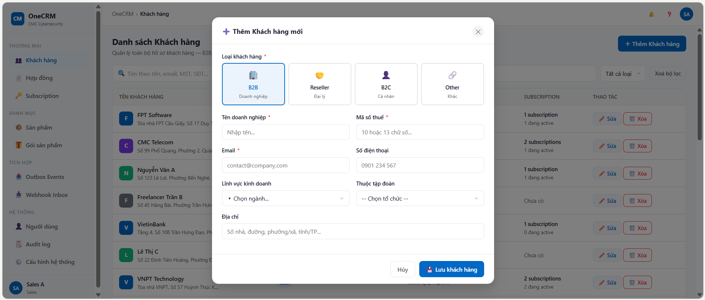
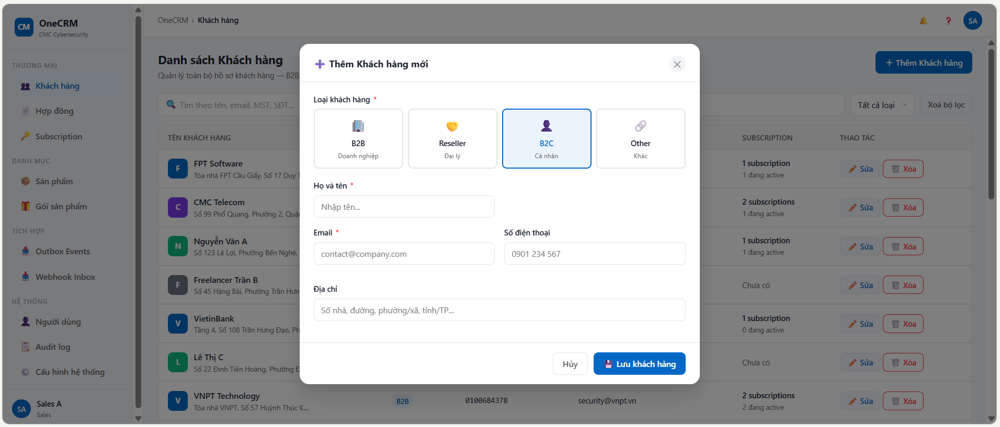

# UC-CUS-02 — Tạo mới Khách hàng

> Module: M-01 Customer Management | Phiên bản: 1.0 | Ngày: 23/06/2026
> Trạng thái: Draft for Review

---

## 1. Thông tin chung chức năng

| Thuộc tính | Nội dung |
|---|---|
| **Tên chức năng** | Tạo mới Khách hàng |
| **UC ID** | UC-CUS-02 |
| **Mô tả** | Sales tạo hồ sơ mới cho khách hàng thuộc 1 trong 4 loại: B2B, Reseller, B2C, Other. Form hiển thị động theo loại được chọn. Hệ thống kiểm tra trùng lặp (MST, email) khi lưu và từ chối nếu vi phạm. |
| **Tác nhân** | Sales |
| **Tiền điều kiện** | Sales đã đăng nhập và có quyền `customer:create`. |
| **Hậu điều kiện** | (Success) Customer record mới được tạo với `deleted_at = NULL`. Audit log ghi nhận actor, timestamp, loại KH. (Failure) Không có record nào được tạo. Form giữ nguyên toàn bộ dữ liệu đã nhập. |
| **Ngoại lệ** | Trùng MST hoặc email → reject, hiển thị lỗi inline với link đến hồ sơ trùng. |
| **Quy tắc nghiệp vụ** | BR-01: B2B và Reseller bắt buộc nhập MST. MST unique trong toàn hệ thống — không kiểm tra trùng với KH đã bị xóa. BR-02: Email bắt buộc với B2B, Reseller và B2C; tùy chọn với Other. BR-03: Email unique trong nhóm {B2B, Reseller}; unique riêng trong nhóm {B2C} — không kiểm tra trùng với KH đã bị xóa. Email B2C không conflict với B2B/Reseller. BR-04: Khi Sales đổi Loại KH, các field bị ẩn sẽ bị xóa trắng. BR-05: Audit log bắt buộc — nếu không ghi được thì rollback, không tạo KH. |

---

## 2. Luồng nghiệp vụ



### 2.1 Luồng chính

| Bước | Actor | Hành động / Phản hồi |
|---|---|---|
| **1** | Sales | Nhấn **"+ Thêm KH mới"** trên màn hình Danh sách. |
| **2** | System | Hiển thị form Tạo mới với selector Loại KH. |
| **3** | Sales | Chọn Loại KH (B2B / Reseller / B2C / Other). |
| **4** | System | Cập nhật form động: hiện/ẩn các field theo loại (xem mục 3.3). |
| **5** | Sales | Điền thông tin và nhấn **"Lưu khách hàng"**. |
| **6** | System | Validate định dạng toàn bộ form (required fields, format email, format MST, format SĐT). |
| **6a** | System | **[Validate thất bại]** → EF-01. **[Validate thành công]** → tiếp bước 7. |
| **7** | System | Kiểm tra trùng MST và email trong hệ thống. |
| **7a** | System | **[Có trùng]** → EF-02 hoặc EF-03. **[Không trùng]** → tiếp bước 8. |
| **8** | System | Tạo Customer record, ghi Audit Log. |
| **9** | System | Điều hướng sang **UC-CUS-03 View 360°** của KH vừa tạo. Hiển thị toast *"Tạo khách hàng thành công"*. |

### 2.2 Luồng phụ

**[AF-01: Sales đổi Loại KH sau khi đã điền thông tin]** — kích hoạt tại bước 3 khi Sales thay đổi loại đã chọn.

| Bước | Actor | Hành động / Phản hồi |
|---|---|---|
| **3a** | Sales | Đổi sang loại KH khác. |
| **4a** | System | Cập nhật lại form: ẩn/hiện field theo loại mới. Các field bị ẩn bị **xóa trắng** (BR-04). |
| → | — | Tiếp tục từ bước 5. |

**[AF-02: Sales hủy]** — kích hoạt tại bất kỳ bước nào trước bước 7.

| Bước | Actor | Hành động / Phản hồi |
|---|---|---|
| **Nx** | Sales | Nhấn **"Hủy"**. |
| **Nx+1** | System | Hiển thị dialog xác nhận: *"Dữ liệu chưa lưu sẽ bị mất. Bạn có chắc muốn thoát?"* |
| **Nx+2** | Sales | Nhấn **"Đồng ý"**. |
| → | — | Đóng form, quay về Danh sách. Không tạo record. |

### 2.3 Luồng ngoại lệ

**[EF-01: Validation thất bại]** — kích hoạt tại bước 6 khi field bắt buộc bỏ trống hoặc sai định dạng.

| Bước | Actor | Hành động / Phản hồi |
|---|---|---|
| **6a** | System | Highlight viền đỏ từng field lỗi, hiển thị message lỗi inline bên dưới. Không tạo record. |
| → | — | Sales chỉnh sửa → quay lại bước 5. |

**[EF-02: Trùng MST]** — kích hoạt tại bước 6 khi MST đã tồn tại.

| Bước | Actor | Hành động / Phản hồi |
|---|---|---|
| **6b** | System | Hiển thị lỗi inline dưới field MST: *"Mã số thuế này đã tồn tại. [Xem hồ sơ →]"* Không tạo record. |
| → | — | Sales nhấn link xem hồ sơ trùng (mở tab mới) hoặc sửa lại MST. |

**[EF-03: Trùng email]** — kích hoạt tại bước 6 khi email đã tồn tại trong cùng nhóm loại KH.

| Bước | Actor | Hành động / Phản hồi |
|---|---|---|
| **6c** | System | Hiển thị lỗi inline dưới field Email: *"Email này đã được sử dụng. [Xem hồ sơ →]"* Không tạo record. |
| → | — | Sales nhấn link xem hồ sơ trùng hoặc sửa lại email. |

---

## 3. Mô tả giao diện

### 3.1 Wireframe




```
┌─────────────────────────────────────────────────────────┐
│  + Thêm khách hàng mới                     [X] Đóng    │
├─────────────────────────────────────────────────────────┤
│  Loại khách hàng *                                      │
│  ┌──────────┐ ┌──────────┐ ┌──────────┐ ┌──────────┐  │
│  │ 🏢       │ │ 🤝       │ │ 👤       │ │ 🔗       │  │
│  │   B2B    │ │ Reseller │ │   B2C    │ │  Other   │  │
│  │ Doanh    │ │  Đại lý  │ │ Cá nhân  │ │  Khác    │  │
│  │ nghiệp   │ │          │ │          │ │          │  │
│  └──────────┘ └──────────┘ └──────────┘ └──────────┘  │
│                                                         │
│  Tên doanh nghiệp *         Mã số thuế *                │
│  ┌───────────────────┐      ┌───────────────────┐       │
│  │ Nhập tên...       │      │ 10 hoặc 13 số...  │       │
│  └───────────────────┘      └───────────────────┘       │
│                                                         │
│  Email liên hệ *            Số điện thoại               │
│  ┌───────────────────┐      ┌───────────────────┐       │
│  │ contact@co.com    │      │ 0901 234 567       │       │
│  └───────────────────┘      └───────────────────┘       │
│                                                         │
│  Lĩnh vực kinh doanh        Thuộc tập đoàn              │
│  ┌─────────────────┐        ┌───────────────────┐       │
│  │ ▾ Chọn ngành...│        │ ▾ Chọn tổ chức... │       │
│  └─────────────────┘        └───────────────────┘       │
│                                                         │
│  Địa chỉ                                                │
│  ┌───────────────────────────────────────────────────┐  │
│  │ Số nhà, đường, phường/xã, tỉnh/TP...             │  │
│  └───────────────────────────────────────────────────┘  │
├─────────────────────────────────────────────────────────┤
│                          [ Hủy ]    [ Lưu ▶ ]          │
└─────────────────────────────────────────────────────────┘

Ghi chú: Wireframe minh hoạ loại B2B.
(*) = Bắt buộc nhập.
```

> **Figma:** [link — Designer cập nhật sau]

---

### 3.2 Các thành phần giao diện

| # | Thành phần | Loại | Mô tả |
|---|---|---|---|
| 1 | Selector Loại KH | Radio group | - Bắt buộc chọn trước khi điền form. 4 lựa chọn: B2B / Reseller / B2C / Other, mỗi loại có icon và mô tả ngắn. - Đổi loại → form cập nhật động, fields bị ẩn bị xóa trắng (BR-04). |
| 2 | Form nhập liệu | Form | - Hiển thị động theo Loại KH đã chọn (xem mục 3.3). - Validate khi nhấn "Lưu" (bước 6), không validate realtime khi đang nhập. |
| 3 | Nút "Lưu" | Button (Primary) | - Logic click: Validate toàn bộ form → kiểm tra trùng → tạo KH (bước 6 → 7). - Trạng thái loading/disable sau khi click, tránh submit nhiều lần. |
| 4 | Nút "Hủy" | Button (Ghost) | - Logic click: Hiển thị dialog xác nhận trước khi đóng form (AF-02). - Không lưu bất kỳ dữ liệu nào. |
| 5 | Nút "X" (đóng) | Icon Button | - Hành vi giống nút Hủy: hiển thị dialog xác nhận. |
| 6 | Thông báo lỗi inline | Validation message | - Hiển thị bên dưới từng field lỗi khi validate thất bại (EF-01, EF-02, EF-03). - Field lỗi: viền đỏ. - Lỗi trùng MST/email: kèm link *"[Xem hồ sơ →]"* mở tab mới. |

---

### 3.3 Các field trong form theo Loại KH

| # | Field | Bắt buộc | Hiển thị với loại | Mô tả & Validation |
|---|---|---|---|---|
| 1 | Loại KH | ✓ | Tất cả | Selector, bắt buộc chọn trước khi điền. Label và placeholder của các field thay đổi theo loại được chọn. |
| 2 | Tên | ✓ | Tất cả | Label: "Tên doanh nghiệp" (B2B, Reseller) / "Họ và tên" (B2C) / "Tên liên hệ" (Other). Max 255 ký tự. Validation: bắt buộc nhập. |
| 3 | Mã số thuế (MST) | ✓ | B2B, Reseller | Chỉ nhập số, 10 hoặc 13 chữ số. Unique toàn hệ thống — không kiểm tra trùng với KH đã bị xóa. Validation: bắt buộc, sai định dạng, đã tồn tại (EF-02). |
| 4 | Email | ✓ B2B, Reseller, B2C / — Other | Tất cả | Định dạng email hợp lệ. Unique trong nhóm {B2B, Reseller} và unique riêng trong nhóm {B2C}. Validation: bắt buộc (trừ Other), sai định dạng, đã tồn tại (EF-03). |
| 5 | Số điện thoại | — | Tất cả | Chấp nhận: 10 chữ số bắt đầu bằng 0 (SĐT Việt Nam) hoặc bắt đầu bằng + theo sau là 8–14 chữ số (SĐT quốc tế). Từ chối: chứa chữ cái hoặc ký tự đặc biệt (trừ + ở đầu và khoảng trắng để format). Validation message: *"Số điện thoại không hợp lệ. VD: 0901 234 567 hoặc +84 901 234 567"* |
| 6 | Lĩnh vực kinh doanh | — | B2B, Reseller | Dropdown danh sách định sẵn (xem seed data bên dưới). Ẩn với B2C và Other. |
| 7 | Thuộc tập đoàn | — | B2B, Reseller, Other | Dropdown tìm kiếm. Chỉ hiển thị KH loại B2B hoặc Reseller chưa bị xóa. Ẩn với B2C. |
| 8 | Địa chỉ | — | Tất cả | Max 500 ký tự. |

---

### 3.4 Seed data — Lĩnh vực kinh doanh

> Dev khởi tạo sẵn danh sách này khi setup hệ thống. Sort theo mức độ phổ biến trong ngành cybersecurity, "Khác" luôn để cuối.

| # | Tên hiển thị |
|---|---|
| 1 | Công nghệ thông tin & Viễn thông |
| 2 | Tài chính - Ngân hàng - Bảo hiểm |
| 3 | Thương mại & Bán lẻ |
| 4 | Sản xuất & Công nghiệp |
| 5 | Xây dựng & Bất động sản |
| 6 | Y tế & Dược phẩm |
| 7 | Giáo dục & Đào tạo |
| 8 | Logistics & Vận tải |
| 9 | Năng lượng & Tiện ích |
| 10 | Truyền thông & Giải trí |
| 11 | Nông nghiệp & Thực phẩm |
| 12 | Du lịch & Khách sạn |
| 13 | Dịch vụ chuyên nghiệp |
| 14 | Nhà nước & Tổ chức công |
| 15 | Khác |

---

## 4. Acceptance Criteria

### Nhóm 1: Tạo thành công

| AC ID | Given | When | Then |
|---|---|---|---|
| AC-CUS-02-01 | Sales chọn loại B2B, nhập đủ thông tin hợp lệ | Nhấn Lưu (bước 5) | Tạo record thành công, chuyển sang View 360°, toast thành công. Audit log ghi nhận. |
| AC-CUS-02-02 | Sales chọn loại B2C, không nhập MST | Nhấn Lưu | Tạo thành công — MST không bắt buộc với B2C. |
| AC-CUS-02-03 | Email "abc@fpt.com" đã tồn tại trong B2B | Sales tạo KH B2C với cùng email | Tạo thành công — email B2C và B2B không conflict (BR-03). |

### Nhóm 2: Đổi loại KH — field bị clear

| AC ID | Given | When | Then |
|---|---|---|---|
| AC-CUS-02-04 | Sales chọn B2B, đã nhập MST "0101247332" | Sales đổi sang loại B2C | Field MST bị ẩn và bị xóa trắng. Submit không gửi MST lên backend. |

### Nhóm 3: Validation và trùng lặp

| AC ID | Given | When | Then |
|---|---|---|---|
| AC-CUS-02-05 | Sales chọn B2B, bỏ trống MST | Nhấn Lưu | Lỗi inline "Mã số thuế là bắt buộc". Không tạo record. |
| AC-CUS-02-06 | MST "0101247332" đã tồn tại | Sales nhập cùng MST, nhấn Lưu | Lỗi inline "Mã số thuế đã tồn tại. [Xem hồ sơ →]". Không tạo. |
| AC-CUS-02-07 | Email "abc@fpt.com" đã tồn tại trong B2B | Sales tạo B2B với cùng email, nhấn Lưu | Lỗi inline "Email đã được sử dụng. [Xem hồ sơ →]". Không tạo. |
| AC-CUS-02-08 | KH "FPT Corp" đã bị xóa (deleted_at IS NOT NULL), có MST "0101247332" | Sales tạo KH mới với cùng MST | Tạo thành công — không kiểm tra trùng với KH đã xóa (BR-01). |

### Nhóm 4: Dropdown Thuộc tập đoàn

| AC ID | Given | When | Then |
|---|---|---|---|
| AC-CUS-02-09 | Có KH B2B "FPT Corp" đang active và KH B2B "Test Corp" đã bị xóa | Sales mở dropdown "Thuộc tập đoàn" | Chỉ hiện "FPT Corp". "Test Corp" không xuất hiện. |
