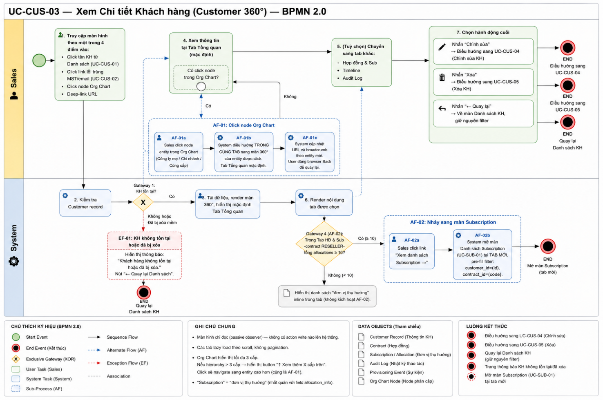

# UC-CUS-03 — Xem Chi tiết Khách hàng (Customer 360°)

> Module: M-01 Customer Management | Phiên bản: 1.0 | Ngày: 06/07/2026
> Trạng thái: Draft for Review

---

## 1. Thông tin chung

| Mục             | Nội dung                                                                                                                                 |
| --------------- | ---------------------------------------------------------------------------------------------------------------------------------------- |
| **Use Case ID** | UC-CUS-03                                                                                                                                |
| **Tên**         | Xem Chi tiết Khách hàng (Customer 360°)                                                                                                  |
| **Mô tả**       | Sales xem toàn bộ thông tin của 1 khách hàng dưới dạng 4 tab: Tổng quan, Hợp đồng & Sub, Timeline, Audit Log. Màn hình chỉ đọc.        |
| **Tác nhân**    | Sales, Manager                                                                                                                           |
| **Tiền điều kiện** | Đã đăng nhập. Có quyền `customer:view`. Customer record tồn tại và `deleted_at IS NULL`.                                             |
| **Hậu điều kiện** | **(Success)** Hiển thị đúng và đầy đủ thông tin. Không thay đổi dữ liệu. **(Failure)** Nếu ID không tồn tại hoặc đã xóa → trang thông báo lỗi. |
| **Use case liên quan** | UC-CUS-01 (Danh sách), UC-CUS-04 (Cập nhật), UC-CUS-05 (Xóa), UC-SUB-01 (Danh sách Subscription)                              |

### Business Rules

| ID      | Nội dung                                                                                                                                                   |
| ------- | ---------------------------------------------------------------------------------------------------------------------------------------------------------- |
| **BR-01** | Chỉ hiển thị customer `deleted_at IS NULL`. **Không phân biệt** "không tồn tại" vs "đã xóa" trong thông báo lỗi — dùng cùng 1 message.               |
| **BR-02** | Section "Phân cấp tập đoàn" (Org Chart) **chỉ hiển thị** với loại B2B, Reseller **và** có parent hoặc children. Không render với B2C, Other, hoặc B2B/Reseller không có parent/children. |
| **BR-03** | Org Chart hiển thị tối đa **3 cấp** tính từ node hiện tại. Nếu còn cấp trên → button **"↑ Xem thêm N cấp trên"**.                                     |
| **BR-04** | Tab Hợp đồng & Sub: lazy load on scroll (không phân trang truyền thống). Mỗi tab có scroll container độc lập.                                           |
| **BR-05** | Tab Timeline: sort DESC theo `occurred_at`, batch đầu 20 events, lazy load trigger khi scroll đến `scrollHeight - 80px`, batch size 20. Chỉ hiển thị event có `internal_only = false`. |
| **BR-06** | Tab Audit Log: sort DESC theo `created_at`, batch đầu 20, lazy load trigger `scrollHeight - 80px`, batch size 20. Search client-side, debounce 300ms.   |

---

## 2. Luồng nghiệp vụ



### 2.1 Luồng chính (Happy Path)

| Bước | Tác nhân | Hành động                                                                                                           |
| ---- | -------- | ------------------------------------------------------------------------------------------------------------------- |
| 1    | Sales    | Click tên hoặc row KH từ Danh sách (UC-CUS-01).                                                                     |
| 2    | System   | Mở trang Customer 360°. Tab **Tổng quan** active mặc định. Load thông tin KH (profile, org chart nếu đủ điều kiện). |
| 3    | Sales    | (Tuỳ chọn) Click sang Tab **Hợp đồng & Sub**.                                                                       |
| 4    | System   | Lazy load danh sách hợp đồng và sub. Hiển thị Summary Strip (4 cards) + Contract Blocks.                           |
| 5    | Sales    | (Tuỳ chọn) Click sang Tab **Timeline**.                                                                              |
| 6    | System   | Load batch 20 events đầu tiên (internal_only = false), sort DESC occurred_at.                                       |
| 7    | Sales    | (Tuỳ chọn) Click sang Tab **Audit Log**.                                                                             |
| 8    | System   | Load batch 20 audit entries đầu tiên, sort DESC created_at. Hiển thị search bar.                                    |
| 9    | Sales    | (Tuỳ chọn) Trong Org Chart, click vào node KH khác.                                                                 |
| 10   | System   | Điều hướng trong **cùng tab** sang Customer 360° của KH được click. URL và breadcrumb cập nhật.                     |
| 11   | Sales    | (Tuỳ chọn) Trong Tab HĐ & Sub (RESELLER), click text-link **"Xem danh sách Subscription →"**.                      |
| 12   | System   | Mở UC-SUB-01 trong **tab mới** của trình duyệt.                                                                     |

### 2.2 Luồng phụ

#### AF-01 — Quay lại Danh sách (từ Customer 360°)

| Bước | Tác nhân | Hành động                                                                                    |
| ---- | -------- | -------------------------------------------------------------------------------------------- |
| 1    | Sales    | Nhấn nút/link **"← Quay lại"** ở đầu trang hoặc trên trang thông báo lỗi.                   |
| 2    | System   | Điều hướng về trang Danh sách. **Giữ nguyên** toàn bộ filter/search đang áp dụng trước đó. |

### 2.3 Luồng ngoại lệ

#### EF-01 — Customer ID không hợp lệ hoặc đã xóa mềm

| Bước | Tác nhân | Hành động                                                                                                               |
| ---- | -------- | ----------------------------------------------------------------------------------------------------------------------- |
| 1    | System   | `customer.id` không tồn tại **HOẶC** `deleted_at IS NOT NULL`.                                                          |
| 2    | System   | Hiển thị trang thông báo lỗi: _"Khách hàng không tồn tại hoặc đã bị xóa."_                                             |
| 3    | System   | Hiển thị nút **"← Quay lại Danh sách"** → trigger AF-01. Không hiển thị chi tiết kỹ thuật. |

---

## 3. Mô tả giao diện

### 3.1 Header trang


- **Breadcrumb**: `Khách hàng > [Tên KH]`
- **Nút "← Quay lại"**: Điều hướng về Danh sách, giữ nguyên filter (AF-01)
- **Tab navigation**: `Tổng quan | Hợp đồng & Sub | Timeline | Audit Log`

---

### 3.2 Tab 1 — Tổng quan


#### Profile Header

| Element          | Nội dung                                                                   |
| ---------------- | -------------------------------------------------------------------------- |
| Tên KH           | Font lớn, in đậm                                                           |
| Badge Loại KH    | B2B/Reseller/B2C/Other — màu sắc theo bảng badge UC-CUS-01                |
| Badge Trạng thái | ACTIVE/INACTIVE/BLACKLIST — màu sắc theo bảng badge UC-CUS-01              |
| Action bar       | Nút **✏️ Chỉnh sửa** (secondary) → UC-CUS-04 · Nút **🗑️ Xóa** (danger) → UC-CUS-05 |

#### Info Grid (4 cột)

| Field                | Điều kiện hiển thị     | Ghi chú                          |
| -------------------- | ---------------------- | -------------------------------- |
| Mã số thuế (MST)     | B2B, Reseller          | Ẩn với B2C, Other                |
| Email                | Luôn hiển thị          | Hiển thị `—` nếu không có       |
| Số điện thoại        | Luôn hiển thị          | Hiển thị `—` nếu không có       |
| Ngày tạo             | Luôn hiển thị          | Format: `dd/MM/yyyy`             |
| Địa chỉ              | Luôn hiển thị          | Hiển thị `—` nếu không có       |
| Lĩnh vực kinh doanh  | B2B, Reseller          | Ẩn với B2C, Other                |
| Ngày sinh            | B2C                    | Ẩn với B2B, Reseller, Other      |
| Thuộc tập đoàn       | B2B, Reseller, Other   | Tên parent; `—` nếu không có    |

#### Section "Phân cấp tập đoàn" (Org Chart)

> **Điều kiện render**: Loại = B2B hoặc Reseller, VÀ (có parent HOẶC có ≥ 1 children). Không render nếu không đủ điều kiện (BR-02).

| Element                      | Mô tả                                                                                    |
| ---------------------------- | ---------------------------------------------------------------------------------------- |
| Node cha (parent)            | Hiển thị trên node hiện tại. Click → navigate 360° của KH đó.                           |
| Node hiện tại                | Viền tím, chữ in đậm. Không click (đã đang xem).                                        |
| Node con (children)          | H-bar nối từ node hiện tại xuống. Click → navigate 360° của KH đó.                     |
| Giới hạn cấp                 | Tối đa **3 cấp** từ node hiện tại (ví dụ: grandparent → parent → current hoặc current → child → grandchild). |
| Button "↑ Xem thêm N cấp trên" | Xuất hiện khi có cấp trên vượt quá giới hạn 3 cấp. Click → navigate 360° của node đó. |

---

### 3.3 Tab 2 — Hợp đồng & Sub


#### Summary Strip (4 cards cố định, căn đầu tab)

| Card             | Nguồn dữ liệu                                        |
| ---------------- | ---------------------------------------------------- |
| Số HĐ            | COUNT contracts                                      |
| Số Sub           | COUNT subscriptions                                  |
| Gia hạn          | COUNT từ `license_mirror.status = RENEWAL` (hoặc tương đương) |
| Tạm dừng         | COUNT subscriptions `status = SUSPENDED`            |

#### Contract Header

Template chung:
```
📄 {CONTRACT_CODE} · [{CONTRACT_TYPE_BADGE}] · {SIGNED_DATE_OR_DASH}
```

**DIRECT contract:**
```
📅 {signed_date} · {N} subscription · {N_ACTIVE} active
```
- `signed_date` = `—` nếu null.

**RESELLER contract:**
```
📅 {signed_date} · {N} pool · {N_allocations} đơn vị thụ hưởng · {N_active} active · {N_grace} grace · {N_sus} sus
```
- `signed_date` = `—` nếu null.

#### Contract Body — DIRECT

Mỗi subscription hiển thị:

| Element          | Nội dung                                                                             |
| ---------------- | ------------------------------------------------------------------------------------ |
| Sub Header       | Mã sub + Tên gói dịch vụ + Badge status                                              |
| Date Block       | `activated_at` (từ `license_mirror`) và `expires_at` (từ `license_mirror`). Nếu chưa nhận event → hiển thị placeholder `—`. Màu theo status: ACTIVE=xanh, EXPIRED=đỏ, GRACE=vàng. |
| Usage Bar        | **Chỉ render khi** usage > 0%. Label + phần trăm + progress bar (xanh ≤80%, cam >80%) + caption "Đã kích hoạt n/m". |

#### Contract Body — RESELLER (Pool Blocks)

**Ngưỡng phân nhánh:**

| Điều kiện                   | Kiểu hiển thị      |
| --------------------------- | ------------------ |
| `allocations.length < 5`    | Full Inline        |
| `allocations.length ≥ 5`    | Preview + Link     |

**Pool Header (dùng chung):**
```
🏊 Pool · [Tên sản phẩm]  [used]/[total] ████████░░ (cam nếu >80%)
```

**Full Inline** (`< 5 allocations`):

| Element          | Nội dung                                                                              |
| ---------------- | ------------------------------------------------------------------------------------- |
| Sort controls    | Seat ↓ (mặc định) · Status ↕                                                         |
| Hiển thị mặc định| INLINE_LIMIT = 3 rows đầu                                                            |
| Expand           | "+N chưa hiện: [summary]" + nút **"Xem tất cả N ↓"** để mở rộng                     |

**Preview + Link** (`≥ 5 allocations`):

| Element          | Nội dung                                                                               |
| ---------------- | -------------------------------------------------------------------------------------- |
| Preview rows     | 5 rows đầu (sort seats giảm dần)                                                       |
| Text-link        | `"Xem danh sách Subscription →"` căn phải. Style: `color: var(--primary)`, `font-size: 12px`, `font-weight: 500`, `text-decoration: underline`, `hover: opacity 0.7`. Click → mở UC-SUB-01 tab mới. |
| Dòng tóm tắt     | `"Hiển thị 5/N · còn (N-5) end-customer · [status breakdown]"`                        |

---

### 3.4 Tab 3 — Timeline

#### Template event

```
[DOT_COLOR]  {TITLE}  🕐 {TIMESTAMP}  [SOURCE_BADGE]  {ACTOR}  {DETAIL?}
```

#### DOT màu theo severity

| Severity   | Màu DOT   |
| ---------- | --------- |
| SUCCESS    | Xanh lá   |
| WARNING    | Vàng      |
| ERROR      | Đỏ        |
| INFO       | Xanh dương|
| PENDING    | Xám       |

#### Source Badge

| Điều kiện                                                       | Badge                  |
| --------------------------------------------------------------- | ---------------------- |
| `actor = null` VÀ action chứa `"webhook"` / `"event từ"` / `"license."` | **"Webhook"** — tím    |
| `actor = null` (các trường hợp còn lại)                         | **"System"** — xám     |
| `actor` là user hệ thống                                        | **"User"** — xanh dương|
| API external bên ngoài                                          | **"API"** — xanh lá    |

#### Quy tắc hiển thị

- Chỉ hiển thị event có `internal_only = false`.
- `detail = null` → không render dòng detail, không có khoảng trắng thừa.
- Sort **DESC** theo `occurred_at`. Không cho phép đổi chiều.
- Batch đầu: **20 events**. Lazy load trigger: scroll đến `scrollHeight - 80px`. Batch size: **20**.
- Footer khi đã load hết: `"── {total} sự kiện ──"` (căn giữa, chữ xám).
- **Empty state**: icon + _"Chưa có sự kiện"_.

---

### 3.5 Tab 4 — Audit Log


#### Layout

- Search bar **cố định** ở đầu tab (ngoài scroll container, không cuộn theo).
- Bảng entries bên dưới có scroll container độc lập.

#### Cột bảng Audit Log

| Cột          | Nội dung                                                                                   |
| ------------ | ------------------------------------------------------------------------------------------ |
| Thời gian    | `dd/MM/yyyy HH:mm`                                                                         |
| Nguồn        | Badge (Webhook/System/User/API — màu như Timeline)                                         |
| Actor        | Tên người dùng hoặc tên service                                                            |
| Hành động    | Tên action (CREATE / UPDATE / DELETE / FAILED / v.v.)                                      |
| Chi tiết     | Xem bảng format bên dưới                                                                   |
| Kết quả      | ✓ Thành công (xanh) · ✗ Thất bại (đỏ)                                                     |

#### Format cột Chi tiết

| Loại action | Format                                       | Ghi chú                          |
| ----------- | -------------------------------------------- | -------------------------------- |
| CREATE      | `{field}: {value}`                           |                                  |
| UPDATE      | `{field}: "{before}" → "{after}"`           |                                  |
| DELETE      | `reason: {reason}`                           |                                  |
| FAILED      | Prefix `[FAILED]` màu đỏ nhạt + nội dung    |                                  |

#### Search Audit Log

| Thuộc tính      | Giá trị                                          |
| --------------- | ------------------------------------------------ |
| Scope search    | Actor + Hành động + Chi tiết                     |
| Loại filter     | Client-side (không gọi API mới)                  |
| Debounce        | 300ms                                            |
| Highlight       | Từ khóa match highlight màu vàng                 |
| Counter (search active) | `"{n} kết quả"`                         |
| Counter (không search)  | `"{loaded}/{total} bản ghi"`            |

#### Quy tắc tải dữ liệu

- Scope: `entity_type = 'CUSTOMER' AND entity_id = {id}`.
- Sort **DESC** theo `created_at`.
- Batch đầu: **20 entries**. Lazy load trigger: `scrollHeight - 80px`. Batch size: **20**.

---

### 3.6 Component States tổng thể

| Component              | State       | Mô tả                                               |
| ---------------------- | ----------- | --------------------------------------------------- |
| Trang 360° (chung)     | Loading     | Skeleton layout hiển thị trong lúc fetch dữ liệu   |
| Tab Tổng quan          | Error       | EF-01 — trang thông báo lỗi                         |
| Nút ✏️ Chỉnh sửa       | Default     | Luôn active (dựa vào quyền `customer:update`)       |
| Nút 🗑️ Xóa            | Active/Disabled | Dựa theo `contracts.length` — logic giống UC-CUS-01 |
| Timeline               | Empty       | Icon + "Chưa có sự kiện"                            |
| Timeline               | Loading more | Spinner khi đang fetch batch tiếp theo              |
| Audit Log              | Loading more | Spinner khi đang fetch batch tiếp theo              |
| Text-link "Xem danh sách Sub" | Hover | opacity 0.7                                        |

---

## 4. Acceptance Criteria

| AC ID          | Given                                                                                     | When                                                        | Then                                                                                                                                       |
| -------------- | ----------------------------------------------------------------------------------------- | ----------------------------------------------------------- | ------------------------------------------------------------------------------------------------------------------------------------------ |
| AC-CUS-03-01   | KH "FPT Software" (B2B, ACTIVE) tồn tại trong hệ thống                                   | Sales click tên từ Danh sách                                | Màn 360° mở. Tab Tổng quan active. Hiển thị đầy đủ thông tin cơ bản (tên, loại, trạng thái, MST, email, SĐT, ngày tạo, địa chỉ).          |
| AC-CUS-03-02   | `customer.id` được truyền vào URL không tồn tại trong DB                                  | Sales truy cập deep-link                                    | Trang thông báo: _"Khách hàng không tồn tại hoặc đã bị xóa."_ Nút "← Quay lại Danh sách".                                                 |
| AC-CUS-03-03   | KH có `deleted_at IS NOT NULL`                                                            | Sales truy cập deep-link                                    | Cùng trang thông báo như AC-03-02. Không phân biệt "không tồn tại" vs "đã xóa".                                                           |
| AC-CUS-03-04   | Sales đang ở Tab Timeline của KH "FPT Software"                                           | Nhấn "← Quay lại"                                           | Điều hướng về Danh sách. Giữ nguyên filter đang áp dụng trước khi vào 360°.                                                                |
| AC-CUS-03-05   | KH loại B2C, không có parent, không có children                                           | Sales mở Tab Tổng quan                                      | Section "Phân cấp tập đoàn" **không render**. Không có khoảng trắng thừa.                                                                  |
| AC-CUS-03-06   | CMC Telecom (B2B): parent = Tập đoàn CMC, có 3 children                                  | Sales xem Tab Tổng quan của CMC Telecom                     | Org Chart hiển thị: Tập đoàn CMC → **CMC Telecom** (viền tím, in đậm) → [3 nodes con với H-bar].                                           |
| AC-CUS-03-07   | Sales đang xem 360° CMC Telecom, Org Chart hiển thị node "Tập đoàn CMC"                  | Sales click node "Tập đoàn CMC"                             | Điều hướng **trong cùng tab** sang 360° Tập đoàn CMC. URL và breadcrumb cập nhật tương ứng.                                                |
| AC-CUS-03-08   | Hierarchy 5 cấp: A→B→C→D→E. Sales đang xem 360° của D                                    | Sales mở Tab Tổng quan                                      | Org Chart hiển thị B→C→**D**. Button **"↑ Xem thêm 2 cấp trên"** xuất hiện (A và thêm 1 cấp).                                             |
| AC-CUS-03-09   | Đang xem 360° D, button "↑ Xem thêm 2 cấp trên" hiển thị                                 | Sales click button                                          | Navigate sang 360° của B. Tại B: Org Chart hiển thị A→**B**→[C với children của C].                                                       |
| AC-CUS-03-10   | Contract DIRECT: `signed_date=01/05/2026`, 1 sub ACTIVE                                  | Sales mở Tab Hợp đồng & Sub                                 | Contract Header: `"📅 01/05/2026 · 1 subscription · 1 active"`.                                                                             |
| AC-CUS-03-11   | Contract RESELLER: 2 pools, 8 allocations (5 ACTIVE, 2 GRACE, 1 SUSPENDED)               | Sales xem Contract Header RESELLER                          | `"📅 dd/MM/yyyy · 2 pool · 8 đơn vị thụ hưởng · 5 active · 2 grace · 1 sus"`.                                                               |
| AC-CUS-03-12   | Contract có `signed_date = null`                                                          | Sales xem Contract Header                                   | Hiển thị `"📅 —"`. Không có ngày kết thúc.                                                                                                  |
| AC-CUS-03-13   | Contract RESELLER, tổng `allocations.length = 10` (≥ 5)                                  | Sales mở Tab Hợp đồng & Sub                                 | Không hiển thị allocation rows inline. Text-link **"Xem danh sách Subscription →"** xuất hiện ở góc phải.                                   |
| AC-CUS-03-15   | `pool_total = 2000`, `allocated_qty = 580`                                                | Sales xem Pool bar                                          | Hiển thị `"580 / 2.000 đã cấp · còn 1.420"`. Progress bar màu **xanh** (29% < 80%).                                                        |
| AC-CUS-03-16   | `allocated_qty / pool_total = 85%`                                                        | Sales xem Pool bar                                          | Progress bar màu **vàng/cam** (>80%).                                                                                                      |
| AC-CUS-03-19   | KH có 3 events với timestamps khác nhau                                                   | Sales mở Tab Timeline                                       | Events hiển thị **DESC** theo `occurred_at` (mới nhất trên cùng).                                                                          |
| AC-CUS-03-20   | Có event `internal_only = true`                                                           | Sales xem Timeline                                          | Event đó **không xuất hiện** trong danh sách.                                                                                              |
| AC-CUS-03-21   | Event có `source_webhook_id IS NOT NULL`                                                  | Sales xem Timeline                                          | Source badge hiển thị **"Webhook"** màu tím.                                                                                               |
| AC-CUS-03-22   | Event có `severity = 'WARNING'`                                                           | Sales xem Timeline                                          | DOT màu **vàng**.                                                                                                                           |
| AC-CUS-03-23   | Event có `detail = null`                                                                  | Sales xem Timeline                                          | **Không render** dòng detail. Không có khoảng trắng thừa.                                                                                  |
| AC-CUS-03-24   | KH có 25 events (`internal_only = false`)                                                 | Sales scroll qua 20 events đầu, scroll gần cuối            | 5 events còn lại được **append** (không reload trang). Footer: `"── 25 sự kiện ──"`.                                                        |
| AC-CUS-03-26   | KH có 5 audit entries                                                                     | Sales mở Tab Audit Log                                      | 5 entries hiển thị **DESC** theo `created_at`. Counter: `"5 / 5 bản ghi"`.                                                                  |
| AC-CUS-03-27   | Audit entry: UPDATE `name`: `"FPT"` → `"FPT Software"`                                   | Sales xem cột Chi tiết                                      | Hiển thị: `name: "FPT" → "FPT Software"`.                                                                                                  |
| AC-CUS-03-28   | Audit entry có `result = FAILED`                                                          | Sales xem Tab Audit Log                                     | Cột Kết quả: **✗ Thất bại** (đỏ). Cột Chi tiết: prefix `[FAILED]` màu đỏ nhạt.                                                            |
| AC-CUS-03-30   | Sales nhập `"webhook"` vào search bar Audit Log                                           | Search thực thi (client-side, debounce 300ms)               | Chỉ hiển thị entries match. Từ khóa **highlight** màu vàng. Counter: `"N kết quả"`.                                                         |

---

## 5. Review Checklist

> Claude tự review — đánh dấu ✅/❌ trước khi submit cho BA review.

### Nghiệp vụ
- ✅ Luồng chính bao phủ happy path
- ✅ Luồng phụ đã định nghĩa
- ✅ Luồng ngoại lệ đã xử lý
- ✅ BR đã định nghĩa rõ
- ✅ AC bao phủ các trường hợp quan trọng
- ✅ Nội dung bám sát PRD v2.3

### Giao diện
- ✅ Wireframe hoặc mô tả UI đủ chi tiết
- ✅ Component states (default/disabled/loading) đã mô tả
- ✅ Toast/error messages đã định nghĩa
