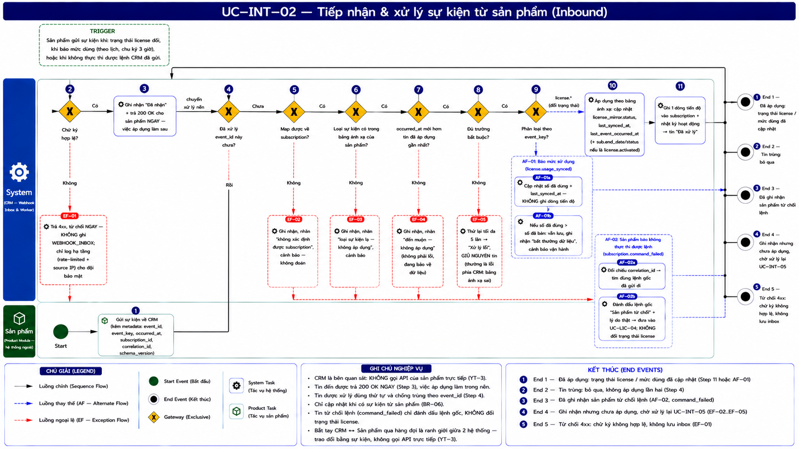

# UC-INT-02 — Tiếp nhận & xử lý sự kiện từ sản phẩm (Inbound)

> Module: M-07 Integration Layer | Phiên bản: 1.0 | Ngày: 14/07/2026
> Trạng thái: Draft for Review · **Tính năng NGẦM — không có giao diện người dùng**
> Danh mục sự kiện: [Phụ lục A](_event_catalog.md)

---

## 1. Thông tin chung

| Thuộc tính | Nội dung |
|---|---|
| **Mã Use Case** | UC-INT-02 |
| **Tên** | Tiếp nhận & xử lý sự kiện từ sản phẩm |
| **Mô tả** | Sản phẩm gửi sự kiện về CRM khi trạng thái license đổi, khi báo mức sử dụng, hoặc khi **không thực thi được lệnh**. CRM **xác thực nguồn gửi → ghi nhận ngay → xử lý sau**. Đây là **đường duy nhất** để trạng thái license trong CRM thay đổi — CRM **không tự suy diễn** (YT-1). |
| **Tác nhân** | Sản phẩm *(hệ thống ngoài)* · System |
| **Tiền điều kiện** | Sản phẩm đã khai báo khoá bảo mật và bảng ánh xạ sự kiện trong cấu hình sản phẩm. |
| **Hậu điều kiện** | (Thành công) Trạng thái license / mức sử dụng được cập nhật; ghi một dòng vào tiến độ của subscription. (Thất bại) Tin được **giữ lại** để xử lý lại — **không mất**. |
| **Trigger** | Sản phẩm gửi sự kiện *(theo sự việc, hoặc theo lịch với báo mức dùng — chu kỳ **3 giờ**)*. |
| **Liên kết** | UC-INT-01 (lệnh gửi đi), UC-INT-05 (xử lý lại), UC-LIC-04 (cảnh báo), UC-SUB-03 (tiến độ), [Phụ lục A §3, §5](_event_catalog.md) |

### Business Rules

| Mã | Nội dung | Vì sao |
|---|---|---|
| **BR-01** *(SG-4, chốt 16/07)* | **Xác thực nguồn gửi** bằng chữ ký (HMAC-SHA256) theo khoá của sản phẩm. **Chữ ký sai → trả 4xx và TỪ CHỐI NGAY, KHÔNG ghi vào `WEBHOOK_INBOX`** — chỉ log ở hạ tầng (rate-limited, kèm source IP) cho đội bảo mật. | Không lưu tin chưa xác thực được nguồn để: (a) tránh người lạ đổ dữ liệu rác vào inbox → **DoS/phình bảng**; (b) **mọi dòng trong inbox đều đã xác thực, đáng tin**. Sự cố khoá sai được **cảnh báo im lặng** bắt (sản phẩm sai khoá → không tin nào hợp lệ → kênh im lặng). Điều tra tấn công giả mạo là việc của **an ninh hạ tầng**, không phải dashboard CRM. |
| **BR-02** | **Đổi khoá bảo mật**: trong thời gian ân hạn **7 ngày**, CRM chấp nhận **cả khoá cũ lẫn khoá mới**. | Không làm vậy thì mọi tin gửi bằng khoá cũ bị coi là chữ ký sai → theo BR-01 sẽ **bị từ chối và KHÔNG lưu** → **mất dữ liệu license/usage thật**. Vì vậy dual-key trong 7 ngày là bắt buộc. |
| **BR-03** | **Trả lời ngay, xử lý sau.** Nhận được → ghi nhận và trả **200 OK** lập tức; việc áp dụng vào dữ liệu do tiến trình nền làm. | Nếu xử lý đồng bộ: CRM chậm → sản phẩm timeout → sản phẩm gửi lại → CRM xử lý trùng. Và sự cố phía CRM sẽ **kéo sập** cả kênh gửi của sản phẩm. |
| **BR-04** | **Chống xử lý trùng** theo `event_id`. Đã xử lý → bỏ qua, **không áp dụng lần hai**. | Gửi ít nhất một lần ⇒ sản phẩm **sẽ** gửi lặp. |
| **BR-05** | 🔴 **Chặn sự kiện đến muộn.** Chỉ áp dụng khi `occurred_at` **mới hơn** `license_mirror.last_event_occurred_at`. Cũ hơn → **ghi nhận, KHÔNG áp dụng**, gắn nhãn *"đến muộn"*. | Webhook có retry ⇒ sự kiện **sẽ** đến sai thứ tự. Xem §Bẫy bên dưới — không có quy tắc này thì **license sai trạng thái vĩnh viễn**. |
| **BR-06** | Trạng thái license **chỉ đổi khi sản phẩm gửi sự kiện**. CRM **không tự suy diễn** *(vd: không tự đặt "hết hạn" khi tới ngày hết hạn)*. | YT-1 — CRM là bên **quan sát**. |
| **BR-07** | Loại sự kiện **lạ** (không có trong bảng ánh xạ của sản phẩm) → **vẫn ghi nhận**, gắn nhãn *"loại sự kiện lạ"*, **không áp dụng**, cảnh báo vận hành. | Sản phẩm nâng cấp và thêm sự kiện mới là chuyện bình thường. Vứt tin đi = mất dữ liệu; áp dụng bừa = hỏng dữ liệu. |
| **BR-08** | **Không map được về subscription nào** *(mã tham chiếu mồ côi)* → ghi nhận, gắn nhãn *"không xác định được subscription"*, cảnh báo. **Không đoán.** | — |
| **BR-09** | Xử lý lỗi → thử lại tự động, tối đa **5 lần**. Hết → trạng thái **Xử lý lỗi**, **giữ nguyên tin**, chờ người xử lý lại (UC-INT-05). | Lỗi thường là **lỗi phía CRM** (bảng ánh xạ sai, thiếu trường bắt buộc). Sửa xong thì tin cũ **phải xử lý lại được** — nên tuyệt đối **không được vứt**. |
| **BR-10** | `license.usage_synced` **KHÔNG** sinh dòng tiến độ trong subscription. | Chu kỳ 3 giờ → 8 tin/sub/ngày. Ghi hết thì tiến độ của khách hàng chỉ toàn "đã báo mức dùng", chôn mất các mốc thật. |
| **BR-11** | Mức dùng **> số đã bán** → **vẫn lưu**, ghi nhận **bất thường dữ liệu**, cảnh báo vận hành. **Không** coi là tình huống thương mại. | Sản phẩm đã chặn cài vượt số lượng ⇒ điều này *không thể xảy ra* ⇒ nếu xảy ra là **lỗi dữ liệu**, không phải khách dùng lố (UC-LIC-04 BR-13). |
| **BR-12** | Tạm dừng/Khôi phục xác nhận qua **`license.suspended` / `license.reactivated` mang `correlation_id`** (EDR thực thi ở cấp tenant nhưng gửi xác nhận là `license.*`). `license.suspended` có **2 nguồn** phân biệt bằng `correlation_id`: *có* → do CRM ra lệnh Tạm dừng (command-ack) → mirror SUSPENDED, `last_change_source = command_ack`; *không* → tự nhiên (khách hết ân hạn) → mirror SUSPENDED, `last_change_source = product_event` — **hợp lệ, không phải bất thường**. `license.reactivated` **luôn** phải có `correlation_id`; nếu không khớp lệnh nào → cảnh báo. | ✅ **EDR xác nhận 16/07 — bỏ hoàn toàn `tenant.*`.** CRM đọc chính event trạng thái license (đúng NT-2/YT-1); `correlation_id` chỉ ghi **nguyên nhân** (do lệnh hay tự nhiên). Xem [Phụ lục A §3.3](_event_catalog.md). |
| **BR-13** 🆕 | `license.revoked` → `license_mirror.status = REVOKED`, `sub.status = REVOKED`. Khai báo chính thức trong danh mục, xử lý như mọi event `license.*` khác qua bảng ánh xạ (bước 9). | ⚠️ **EDR chưa thực sự gửi event này ở Phase 1** — khai báo để sẵn sàng khi EDR triển khai. Mọi cảnh báo/mismatch phản ứng với REVOKED **tạm ẩn**, xem [Phụ lục A §3.4](_event_catalog.md). |
| **BR-14** 🆕 | **`license.expired` → `license_mirror.status = GRACE`** (EDR gửi event này để báo **vào ân hạn** — khách vẫn dùng đủ; `sub` giữ ACTIVE). `license.grace_expired` → `license_mirror.status = RESTRICTED` (hạn chế tính năng 30 ngày; `sub` giữ ACTIVE). `license.suspended` → SUSPENDED (`sub` → SUSPENDED). | ✅ **EDR xác nhận 16/07** — mọi gói đều qua ân hạn; **không dùng `license.grace_started`**, vai trò "vào ân hạn" do `license.expired` đảm nhận. Ví dụ chuẩn của NT-5 (tên event ≠ chữ hiển thị). Xem [Phụ lục A §3.1/§3.2](_event_catalog.md). |

### 🔴 Bẫy: sự kiện đến sai thứ tự — sẽ xảy ra, không phải "nếu"

> `license.suspended` — **việc xảy ra lúc 10:00** — gửi lần 1 thất bại, retry tới nơi lúc **10:05**.
> `license.activated` — **việc xảy ra lúc 10:02** — tới nơi ngay lúc **10:02**.
>
> CRM xử lý theo thứ tự **nhận được**: `ACTIVE` (10:02) → rồi `SUSPENDED` (10:05, nhưng là chuyện của 10:00).
> **Kết quả: license bị đặt sai trạng thái — và sai vĩnh viễn**, cho tới lần đồng bộ sau.

**BR-05 chặn đúng chỗ này**: so `occurred_at` (thời điểm việc **thật sự xảy ra ở nguồn**), không so thời điểm **nhận được**.

→ Cần thêm cột **`license_mirror.last_event_occurred_at`**. Đây cũng là nền của **xử lý lại theo chuỗi** (UC-INT-05).

---

## 2. Luồng nghiệp vụ

### 2.1 Luồng chính

| Bước | Actor | Hành động / Phản hồi |
|---|---|---|
| **1** | Sản phẩm | Gửi sự kiện về CRM *(kèm metadata: `event_id` · `event_key` · `occurred_at` · `subscription_id` · `product_id` · `correlation_id` · `schema_version`)*. |
| **2** | System | **[Gateway — Chữ ký hợp lệ?]** Không → **EF-01**. Có → tiếp bước 3. |
| **3** | System | **Ghi nhận ngay** ở trạng thái **Đã nhận**; **trả 200 OK cho sản phẩm** (BR-03). *Sản phẩm coi như xong việc.* |
| **4** | System *(tiến trình nền)* | **[Gateway — Đã xử lý `event_id` này chưa?]** Rồi → bỏ qua (BR-04), **End 2**. Chưa → tiếp bước 5. |
| **5** | System | **[Gateway — Map được về subscription?]** Không → **EF-02**. Có → tiếp bước 6. |
| **6** | System | **[Gateway — Loại sự kiện có trong bảng ánh xạ của sản phẩm?]** Không → **EF-03**. Có → tiếp bước 7. |
| **7** | System | **[Gateway — `occurred_at` mới hơn sự kiện đã áp dụng gần nhất?]** Không → **EF-04** (đến muộn). Có → tiếp bước 8. |
| **8** | System | **[Gateway — Dữ liệu đủ trường bắt buộc?]** Không → **EF-05**. Có → tiếp bước 9. |
| **9** | System | **Phân loại theo `event_key`** rồi xử lý theo bảng ánh xạ của sản phẩm ([Phụ lục A §3](_event_catalog.md)): • **`license.*` (đổi trạng thái)** → **áp dụng**: cập nhật `license_mirror.status` · `last_synced_at` · `last_event_occurred_at`; với `license.activated` cập nhật thêm `sub.activation_date`, `sub.end_date`, `sub.status`. → tiếp bước 10. • **`license.usage_synced`** → **AF-01** (báo mức sử dụng). • **`subscription.command_failed`** → **AF-02** (sản phẩm từ chối lệnh). |
| **10** | System | Ghi **một dòng tiến độ** vào subscription *(trừ `usage_synced` — BR-10)*; ghi nhật ký hoạt động; trạng thái tin → **Đã xử lý**. |
| → | — | Kết thúc **End 1**. |

### 2.2 Luồng phụ

**[AF-01: Báo mức sử dụng]** — kích hoạt tại **bước 9** (nhánh `event_key = license.usage_synced`).

| Bước | Actor | Hành động / Phản hồi |
|---|---|---|
| **AF-01a** | System | Cập nhật số đã dùng + `last_synced_at`. **Không** ghi dòng tiến độ (BR-10). |
| **AF-01b** | System | Số đã dùng **> số đã bán** → vẫn lưu, ghi nhận **bất thường dữ liệu**, cảnh báo vận hành (BR-11). |
| → | — | Kết thúc **End 1**. |

**[AF-02: Sản phẩm báo không thực thi được lệnh]** — kích hoạt tại **bước 9** (nhánh `event_key = subscription.command_failed`).

| Bước | Actor | Hành động / Phản hồi |
|---|---|---|
| **AF-02a** | System | Đối chiếu `correlation_id` → tìm đúng **lệnh gốc** trong danh sách sự kiện gửi đi. |
| **AF-02b** | System | Đánh dấu lệnh gốc là **"Sản phẩm từ chối"** *(khác "chưa tới nơi")* + lý do thật; đưa vào hàng đợi xử lý (UC-LIC-04). **Không** đổi trạng thái license. |
| → | — | Kết thúc **End 3**. |

### 2.3 Luồng ngoại lệ

| Mã | Điều kiện | Xử lý | Xử lý lại được? |
|---|---|---|---|
| **EF-01** | **Chữ ký không hợp lệ** (bước 2) | **Trả 4xx, từ chối ngay; KHÔNG ghi `WEBHOOK_INBOX`**; chỉ log hạ tầng (rate-limited + source IP) *(có thể sản phẩm đổi khoá ngoài 7 ngày ân hạn, hoặc bên thứ ba giả mạo — để an ninh hạ tầng điều tra)*. | ❌ Không lưu (BR-01) |
| **EF-02** | **Không map được subscription** (bước 5) | Ghi nhận, nhãn *"không xác định được subscription"*, cảnh báo (BR-08). | ✅ Sau khi tìm ra nguyên nhân |
| **EF-03** | **Loại sự kiện lạ** (bước 6) | Ghi nhận, nhãn *"loại sự kiện lạ — không áp dụng"*, cảnh báo (BR-07). | ✅ Sau khi khai báo ánh xạ |
| **EF-04** | **Sự kiện đến muộn** (bước 7) | Ghi nhận, nhãn *"đến muộn — không áp dụng"* (BR-05). **Không phải lỗi** — hệ thống đang bảo vệ dữ liệu. | ⚠️ Chỉ trong **xử lý lại theo chuỗi** (UC-INT-05) |
| **EF-05** | **Thiếu trường bắt buộc / sai định dạng** (bước 8) | Thử lại tối đa 5 lần → **Xử lý lỗi**; **giữ nguyên tin** (BR-09). ⚠️ Đây gần như luôn là **lỗi phía CRM** *(bảng ánh xạ sai)*, không phải lỗi sản phẩm. | ✅ **Sau khi sửa bảng ánh xạ** |

→ EF-02…EF-05 kết thúc tại **End 4** *(ghi nhận, chưa áp dụng)*. EF-01 kết thúc tại **End 5** *(từ chối vĩnh viễn)*.

### 2.4 Điểm kết thúc

| End | Mô tả |
|---|---|
| **End 1** | Đã áp dụng — trạng thái license / mức dùng đã cập nhật. |
| **End 2** | Tin trùng — bỏ qua, không áp dụng lần hai. |
| **End 3** | Đã ghi nhận việc sản phẩm từ chối lệnh. |
| **End 4** | Ghi nhận nhưng **chưa áp dụng** — chờ xử lý lại (UC-INT-05). |
| **End 5** | Từ chối (4xx) — chữ ký không hợp lệ; **không lưu vào inbox** (chỉ log hạ tầng). |

---

## 3. Mô tả giao diện

**Không có.** Quan sát kết quả tại: **UC-INT-05** *(danh sách sự kiện nhận về + xử lý lại)* · **UC-INT-03** *(nửa "kênh nhận về")* · **UC-INT-06** *(dòng thời gian một subscription)* · **UC-LIC-02** *(trạng thái license mà tin này vừa cập nhật)*.

---

## 4. Acceptance Criteria

### Nhóm 1: Xác thực & tiếp nhận

| Mã | Given | When | Then |
|---|---|---|---|
| AC-INT-02-01 | Sản phẩm gửi tin chữ ký hợp lệ. | CRM nhận. | **200 OK trả về ngay**; tin ở trạng thái **Đã nhận**; việc áp dụng làm sau (BR-03). |
| AC-INT-02-02 | Tin có **chữ ký sai**. | CRM nhận. | **Trả 4xx, từ chối ngay**; **KHÔNG ghi vào inbox** (chỉ log hạ tầng); **không xuất hiện trong danh sách Sự kiện nhận về** (BR-01). |
| AC-INT-02-03 | Sản phẩm đang trong **7 ngày đổi khoá**, gửi tin ký bằng **khoá cũ**. | CRM nhận. | **Chấp nhận** — xử lý bình thường (BR-02). |
| AC-INT-02-04 | Việc xử lý phía CRM đang lỗi hàng loạt. | Sản phẩm gửi tin. | Vẫn nhận **200 OK** — kênh gửi của sản phẩm **không bị kéo sập** theo (BR-03). |

### Nhóm 2: Chống trùng & chống đến muộn

| Mã | Given | When | Then |
|---|---|---|---|
| AC-INT-02-05 | Tin `event_id = X` đã xử lý xong. | Sản phẩm gửi lại đúng tin đó. | **Bỏ qua**, không áp dụng lần hai (BR-04). Trạng thái license **không đổi**. |
| AC-INT-02-06 | License đã áp dụng `license.activated` (`occurred_at` = **10:02**). | Nhận `license.suspended` với `occurred_at` = **10:00** *(đến muộn)*. | **KHÔNG áp dụng** — license **vẫn Đang hoạt động**. Tin ghi nhận với nhãn *"đến muộn"* (BR-05, EF-04). |
| AC-INT-02-07 | Cùng dữ liệu như trên. | Rà lại trạng thái sau 1 giờ. | License **vẫn Đang hoạt động** — **không** bị tin cũ ghi đè ngược (đây là bug mà BR-05 chặn). |

### Nhóm 3: Áp dụng đúng vòng đời license *(chốt 14/07/2026)*

| Mã | Given | When | Then |
|---|---|---|---|
| AC-INT-02-08 | Sub đang chờ kích hoạt. | Nhận `license.activated`. | `license_mirror.status = Đang hoạt động`; `sub.end_date` ← `expiration_date` **của license** *(không tự tính từ ngày bắt đầu + thời hạn)*; `sub.status = ACTIVE`. |
| AC-INT-02-09 | License đang hoạt động, đến hạn (mọi gói EDR đều có ân hạn). | Nhận **`license.expired`** *(EDR gửi để báo VÀO ân hạn)*. | `license_mirror.status = **GRACE (Trong ân hạn)**`. Khách **vẫn dùng đủ tính năng**; `sub` **giữ ACTIVE**. → xuất hiện ở view **Cơ hội doanh thu** (UC-LIC-01) (BR-14). |
| AC-INT-02-10 | License đang trong ân hạn. | Nhận **`license.grace_expired`**. | `license_mirror.status = **RESTRICTED (Hạn chế tính năng)**` — khách dùng hạn chế trong **30 ngày**; `sub` **giữ ACTIVE** (OQ-INT-08). → cơ hội **Gia hạn khẩn**, xếp **trên** "Gia hạn gấp". |
| AC-INT-02-11 | License đang hạn chế tính năng, hết 30 ngày (khách không gia hạn). | Nhận **`license.suspended`** *(đường tự nhiên, **không** `correlation_id`)*. | `license_mirror.status = Đã ngừng`; `sub.status = **SUSPENDED**`; nguyên nhân = **hết hạn không gia hạn**, `last_change_source = product_event`. **Hợp lệ, không phải sự cố** (BR-12). |
| AC-INT-02-12 | CRM vừa gửi lệnh Tạm dừng *(`subscription.suspended`, `event_id = X`)*. | Nhận **`license.suspended`** với `correlation_id = X`. | `license_mirror.status = Đã ngừng`; `sub.status = SUSPENDED`; nguyên nhân = **do CRM ra lệnh**; lưu `last_change_source = command_ack`, `source_command_event_id = X` (BR-12). |
| AC-INT-02-12b | Không có lệnh Khôi phục nào của CRM đang chờ. | Nhận **`license.reactivated`** với `correlation_id` **không khớp lệnh nào** *(hoặc rỗng)*. | Ghi nhận + **cảnh báo** *"sản phẩm khôi phục dịch vụ mà CRM không ra lệnh"* (BR-12) — Khôi phục chỉ hợp lệ khi do lệnh CRM. |
| AC-INT-02-12c | CRM vừa gửi lệnh Khôi phục. | Nhận **`license.reactivated`** có `correlation_id` khớp. | `license_mirror.status = Đang hoạt động`; `sub.status = ACTIVE` (BR-12). |
| AC-INT-02-12d 🆕 | CRM vừa gửi lệnh Thu hồi *(`subscription.terminated`, `event_id = Y`)*. | Nhận **`license.revoked`** với `correlation_id = Y`. | `license_mirror.status = Đã thu hồi (REVOKED)`; `sub.status = REVOKED` (BR-13). *(Phase 1: EDR chưa gửi event này thật — AC mang tính khai báo hợp đồng, chờ EDR triển khai.)* |
| AC-INT-02-13 | Nhận `license.usage_synced`. | Xử lý. | Cập nhật số đã dùng + thời điểm cập nhật. **KHÔNG** sinh dòng tiến độ trong subscription (BR-10). |
| AC-INT-02-14 | Sản phẩm báo dùng **63/60**. | Xử lý. | **Vẫn lưu** 63; ghi nhận **bất thường dữ liệu**; cảnh báo vận hành; **không** coi là khách dùng lố (BR-11). |

### Nhóm 4: Tin lỗi — không được mất

| Mã | Given | When | Then |
|---|---|---|---|
| AC-INT-02-15 | Tin thiếu trường bắt buộc *(vd không có "ngày hết hạn")*. | Xử lý. | Thử lại 5 lần → **Xử lý lỗi**; **tin được giữ nguyên**; hiện ở UC-INT-05 với lý do cụ thể (BR-09, EF-05). |
| AC-INT-02-16 | 42 tin cùng lỗi *(bảng ánh xạ sai)*. | Ops sửa bảng ánh xạ, xử lý lại. | **Cả 42 tin xử lý được**, không mất tin nào. |
| AC-INT-02-17 | Tin mang mã tham chiếu **không khớp subscription nào**. | Xử lý. | Ghi nhận nhãn *"không xác định được subscription"*; **không đoán, không gán bừa** (BR-08). |
| AC-INT-02-18 | Sản phẩm nâng cấp, gửi loại sự kiện CRM **chưa biết**. | Xử lý. | **Vẫn ghi nhận**, nhãn *"loại sự kiện lạ"*, **không áp dụng**, cảnh báo (BR-07). Không vứt tin. |

### Nhóm 5: Ranh giới quan sát

| Mã | Given | When | Then |
|---|---|---|---|
| AC-INT-02-19 | Tới ngày hết hạn ghi trong license, **sản phẩm chưa gửi gì**. | Hệ thống chạy. | Trạng thái license **KHÔNG đổi**. CRM **không tự suy diễn** là đã hết hạn (BR-06, YT-1). |
| AC-INT-02-20 | Bất kỳ tình huống nào. | Rà hành vi. | CRM **không gọi API sản phẩm** để hỏi/sửa trạng thái (YT-3). |

---

## 5. Review Checklist

### Lịch sử thay đổi

| Phiên bản | Ngày | Tác giả | Mô tả |
|---|---|---|---|
| 1.0 | 14/07/2026 | Claude (AI) | Khởi tạo. Trace: PRD v2.6 §6.7.4 (FR-INT-03), §6.7.5 (FR-INT-04), §6.5.3 (FR-LIC-02), §6.5.4 (FR-LIC-03). **Bổ sung / sửa so với tài liệu cũ:** (1) 🔴 **BR-05 chặn sự kiện đến muộn** — chưa từng có, không có nó thì license sai trạng thái vĩnh viễn; (2) ✅ **vòng đời 3 giai đoạn sau hết hạn** qua event riêng `license.grace_started` (không tái dùng `license.expired`); (3) 🆕 `subscription.command_failed` (AF-02); (4) **BR-02** đổi khoá — ràng buộc nghiệp vụ, cơ chế để Dev quyết; (5) **BR-10** usage không sinh dòng tiến độ; (6) ✅ **BR-12** sự kiện cấp tenant đổi mirror **khi là phản hồi có `correlation_id`** — nay **chỉ áp dụng Tạm dừng/Khôi phục**; (7) 🆕 **BR-13** `license.revoked` — Thu hồi tách khỏi cơ chế tenant.*, khai báo chính thức nhưng EDR chưa gửi thật ở Phase 1. |
| 1.1 | 14/07/2026 | Claude (AI) | **Rà lại lần 2 sau khi BA trả lời Q1/Q2 đầy đủ** — đảo ngược 2 quyết định tưởng đã chốt ở bản 1.0: REVOKED nay có event riêng `license.revoked` (BR-13) thay vì đi qua `tenant.terminated`; GRACE nay có event riêng `license.grace_started` (BR-14) thay vì tái diễn giải `license.expired`. |
| 1.2 | 16/07/2026 | Claude (AI) | **Đội EDR xác nhận mô hình thật** — sửa BR-12/BR-14 + AC: (1) **`license.expired` = VÀO ân hạn** → mirror GRACE (bỏ `license.grace_started`; mọi gói đều có ân hạn); (2) **bỏ hoàn toàn `tenant.*`** — Tạm dừng/Khôi phục xác nhận qua `license.suspended`/`license.reactivated` mang `correlation_id`; `license.suspended` không có corr_id = tự nhiên (hợp lệ, không phải bất thường); (3) **OQ-INT-08 chốt:** mirror RESTRICTED → `sub` giữ ACTIVE (không sang EXPIRED). |
| 1.3 | 17/07/2026 | Claude (AI) | Chuẩn hoá §2 sau khi dựng BPMN: **bước 9 nêu rõ việc phân loại theo `event_key`** (nhánh `license.*` → áp dụng → bước 10; `license.usage_synced` → AF-01; `subscription.command_failed` → AF-02); **AF-01 và AF-02 ghi rõ kích hoạt tại bước 9**. Không đổi Business Rule, AC, hay điểm kết thúc. |
| 1.4 | 17/07/2026 | Claude (AI) | Nhúng **sơ đồ luồng BPMN** vào §2 (`UC-INT-02_bpmn.png`) — đã review đối chiếu §2: đúng và đủ (chuỗi 6 cổng kiểm tra ②→⑧ mỗi cổng rớt EF tương ứng · ⑨ phân loại `event_key` · ⑩⑪ áp dụng · AF-01 usage · AF-02 command_failed · 5 End). Nit nhỏ trên ảnh: nhánh ⑨→⑩ (`license.*`, luồng chính) nên đổi sang **nét liền đen** — dọn khi regen ảnh. |

### Nghiệp vụ
- ✅ CRM **quan sát**, không suy diễn — trạng thái license chỉ đổi khi sản phẩm gửi sự kiện
- ✅ **Không mất tin**: mọi tin **đã xác thực** mà lỗi xử lý đều giữ lại và xử lý lại được *(chữ ký sai thì cố ý KHÔNG lưu — SG-4, chỉ log hạ tầng)*
- ✅ **Không hỏng dữ liệu**: tin trùng bỏ qua, tin đến muộn không ghi đè ngược
- ✅ Lỗi phía CRM **không kéo sập** kênh gửi của sản phẩm
- ✅ **OQ-INT-01 — đã chốt (EDR xác nhận 16/07):** Tạm dừng/Khôi phục xác nhận qua `license.suspended`/`license.reactivated` mang `correlation_id` (BR-12) — **bỏ hoàn toàn `tenant.*`**. CRM đọc chính event trạng thái license, giữ được ranh giới YT-1; `correlation_id` chỉ ghi nguyên nhân (do lệnh hay tự nhiên).
- ✅ **REVOKED:** `license.revoked` → REVOKED khai báo chính thức (BR-13); EDR chưa gửi thật ở Phase 1.
- ✅ **GRACE (EDR xác nhận 16/07):** EDR gửi `license.expired` để báo **vào ân hạn** → GRACE (BR-14); **không dùng `license.grace_started`**. Ví dụ chuẩn NT-5.
- ✅ **OQ-INT-04 — đã chốt (rà lại 14/07):** metadata ([Phụ lục A §2](_event_catalog.md)) — đã dùng xuyên suốt.
- ✅ **OQ-INT-05 — đã chốt (rà lại 14/07):** BR-05 + cột `license_mirror.last_event_occurred_at`.
- ✅ **OQ-INT-08 — đã chốt (16/07):** khi mirror = RESTRICTED (*Hạn chế tính năng*), `sub.status` **giữ ACTIVE** (không sang EXPIRED) — sub chưa chết, mức hạn chế phản ánh qua mirror.

---

## 6. Bàn giao cho Thiết kế kỹ thuật (TDD)

> Như UC-INT-01 §6: FRS khẳng định **hành vi phải đảm bảo**; **cơ chế** là việc của **TDD** *(dev viết khi bắt đầu code — chốt 14/07/2026)*. Dưới đây là **những điểm TDD BẮT BUỘC phải giải** cho chiều nhận:

| # | TDD phải trả lời | Neo vào |
|---|---|---|
| 1 | **Tách nhận / xử lý**: endpoint nhận webhook ghi vào hàng chờ rồi trả 200 ngay bằng cơ chế gì; worker xử lý sau ra sao. | BR-03 |
| 2 | **Verify chữ ký HMAC-SHA256 từng bước**: ký trên body **thô** hay đã chuẩn hoá; chữ ký nằm ở header nào; xử lý **cả khoá cũ lẫn khoá mới** trong 7 ngày đổi khoá. | BR-01, BR-02 |
| 3 | **Chống trùng theo `event_id`**: lưu & tra ở đâu (ràng buộc unique? bảng đã-xử-lý?); giữ bao lâu. | BR-04 |
| 4 | 🔴 **Chặn sự kiện đến muộn**: so `occurred_at` với `last_event_occurred_at` **có kiểm soát tranh chấp** (hai tin của cùng sub đến gần nhau, chạy song song → không được ghi đè sai). Cần cột `license_mirror.last_event_occurred_at`. | BR-05 |
| 5 | **Máy trạng thái tin nhận**: `Đã nhận → Đã xử lý` / `Đang thử lại → Xử lý lỗi`; công thức backoff; trần **5 lần**. | BR-09 |
| 6 | **Đối chiếu về subscription** + xử lý tin **mồ côi**; **đối chiếu `correlation_id`** cho `tenant.*` và `command_failed`. | BR-08, BR-12 |
| 7 | **Xử lý tuần tự trong cùng subscription** vs song song giữa các sub *(nền của xử lý lại theo chuỗi — UC-INT-05)*. | BR-05, UC-INT-05 BR-03 |
| 8 | **Vòng đời dữ liệu**: cơ chế dọn tin đã xử lý sau 90 ngày; giữ tin lỗi/chưa xử lý. | BR + §5.5 Phụ lục A |
| 9 | **Metadata nguồn thay đổi**: ghi `last_change_source` + `source_command_event_id` khi cập nhật từ `tenant.*`. | BR-12 |

---

## Footer

| Mục | Nội dung |
|---|---|
| **Giao diện** | Không có — tính năng ngầm |
| **Thiết kế kỹ thuật** | Cơ chế nằm ở **TDD M-07** *(chưa viết — việc của dev)*; các điểm bắt buộc giải: §6 |
| **UC liên quan** | UC-INT-01, UC-INT-05, UC-INT-06, UC-LIC-02, UC-LIC-04, UC-SUB-03 |
| **Trace PRD** | OneCRM_PRD_v2.7.md §6.7.4, §6.7.5, §6.5.3, §6.5.4 |
