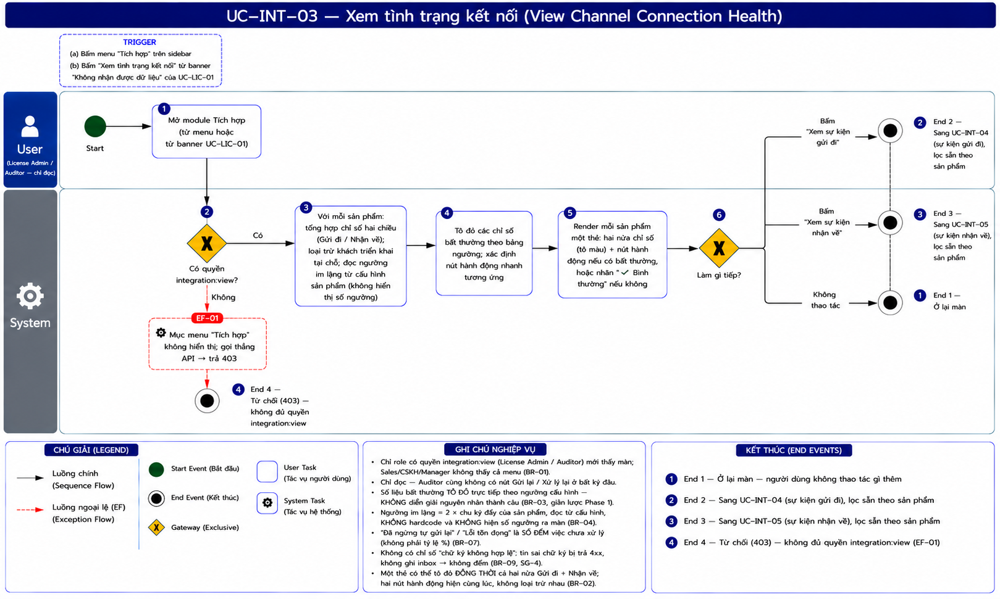
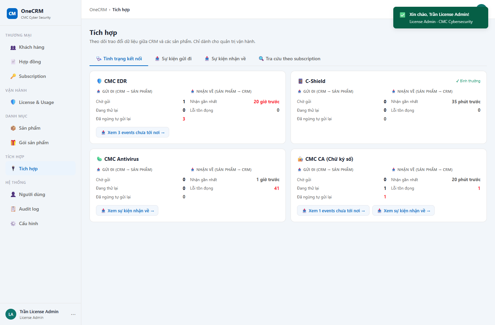

# UC-INT-03 — Xem tình trạng kết nối

> Module: M-07 Integration Layer | Phiên bản: 2.0 | Ngày: 15/07/2026
> Trạng thái: Draft for Review · **Giản lược cho Phase 1** *(rà lại 15/07 — xem §5 Lịch sử thay đổi)*

---

## 1. Thông tin chung

| Thuộc tính | Nội dung |
|---|---|
| **Mã Use Case** | UC-INT-03 |
| **Tên** | Xem tình trạng kết nối |
| **Mô tả** | Với **mỗi sản phẩm**, tổng hợp tình trạng **hai chiều** dạng dashboard — *lệnh CRM gửi có tới nơi không* và *sản phẩm có báo về không, CRM có xử lý được không*. Số liệu bất thường được **tô đỏ** theo ngưỡng cấu hình; có nút bấm nhanh sang màn chi tiết khi có việc cần xử lý. **Không diễn giải nguyên nhân thành câu** *(giản lược Phase 1 — xem §5)*. |
| **Tác nhân** | License Admin · Auditor *(chỉ đọc)* |
| **Tiền điều kiện** | Đã đăng nhập; có quyền `integration:view`. |
| **Hậu điều kiện** | Chỉ đọc — không thay đổi dữ liệu. |
| **Trigger** | (1) Bấm menu **Tích hợp**. (2) Bấm *"Xem tình trạng kết nối"* từ banner **"Không nhận được dữ liệu"** của UC-LIC-01. |
| **Liên kết** | UC-INT-04, UC-INT-05, UC-LIC-01 (banner sự cố diện rộng), UC-LIC-04 |

### Business Rules

| Mã | Nội dung |
|---|---|
| **BR-01** | **Phân quyền**: chỉ `integration:view` — mặc định **License Admin** và **Auditor**. Sales / CSKH / Manager **không thấy cả mục menu**. *Đây là dữ liệu vận hành nhạy cảm; cho Sales thấy chỉ gây hoang mang mà họ không xử lý được gì.* |
| **BR-02** ✏️ *(rà lại 16/07 theo demo đã chốt)* | Mỗi sản phẩm **một thẻ**, chia **hai nửa**: **Gửi đi** (chờ gửi · đang thử lại · **đã ngừng tự gửi lại**) và **Nhận về** (**nhận gần nhất** lúc nào · **lỗi tồn đọng**). Chỉ giữ các con số **hành động được**; đã **bỏ** throughput ("đã gửi thành công", "nhận trong 24h"), tỷ lệ **%**, và chỉ số **"chữ ký không hợp lệ"** (xem BR-07, BR-09). Một sản phẩm có thể tô đỏ **đồng thời cả hai nửa** — không loại trừ nhau. |
| **BR-03** | ✏️ *(rà lại 15/07 — thay cho "bắt buộc kết luận thành câu" ở bản 1.0)* **Số liệu bất thường được tô đỏ trực tiếp trên dashboard** theo bảng ngưỡng bên dưới — **không** kèm câu diễn giải nguyên nhân hay đề xuất hành động bằng văn bản. |
| **BR-07** ✏️ *(rà lại 16/07 theo demo đã chốt — thay cách tính tỷ lệ của bản 2.x)* | **"Đã ngừng tự gửi lại" và "Lỗi tồn đọng" là SỐ ĐẾM việc CHƯA xử lý xong** (tất cả, không giới hạn tuổi) — **không** phải tỷ lệ `n/tổng (%)`, **không** cửa sổ 7 ngày. | Lý do kép: **(1) Nghiệp vụ** — số việc tồn đọng mới là con số hành động được (bấm vào để xử lý); tỷ lệ % **đánh lừa** ở mẫu số nhỏ (`1/2 = 50%` trông nguy nhưng chỉ 1 lỗi). **(2) Hiệu năng** — bỏ tỷ lệ = bỏ luôn COUNT/aggregate **all-time** trên bảng append-only. `dead`/`failed` = COUNT theo status (rẻ, có index; dead-letter/failed là trạng thái tồn đọng nên số bị chặn bởi lượng việc chưa giải quyết). Việc kẹt cũ **không bị ẩn** — vẫn hiện đầy đủ ở UC-INT-04/05, và drill-down mở sẵn **"Toàn bộ"**. |
| **BR-08** 🆕 | ✏️ *(rà lại 15/07 — theo yêu cầu BA)* **Đơn vị đếm hiển thị bằng tiếng Anh "events"**, dùng chung cho cả hai chiều gửi đi và nhận về — **không** dịch riêng "lệnh" (gửi đi) / "tin" (nhận về) như trước. Áp dụng xuyên suốt toàn bộ module Tích hợp (UC-INT-01, 03, 04, 05, 06). | Trước đó hai chiều dùng 2 từ khác nhau phản ánh đúng bản chất nghiệp vụ (lệnh = CRM chủ động ra lệnh; tin = sản phẩm chủ động báo cáo) — về mặt phân tích vẫn đúng, nhưng BA quyết định ưu tiên **một thuật ngữ duy nhất, tiếng Anh**, thay vì phân biệt hai từ tiếng Việt. |
| **BR-04** | **Ngưỡng "im lặng bất thường"** = **2 × `runtime_config.usage_push_interval`** của sản phẩm đó — **không hardcode**, dùng để tô màu dòng "Nhận gần nhất" (BR-03). Giá trị hiện hành: chu kỳ **3 giờ** → ngưỡng **6 giờ**. Bản thân con số ngưỡng **không hiển thị lên màn hình** *(chốt 14/07 — khái niệm kỹ thuật, không tường minh với người dùng)*. |
| **BR-05** | **Loại trừ khách hàng triển khai tại chỗ** — họ không có kênh tự động, không tính vào bất kỳ chỉ số nào. |
| **BR-06** | ✏️ *(rà lại 15/07 — thay cho "sắp xếp nhiều kết luận" ở bản 1.0)* Khi có số liệu bất thường, hiện **nút bấm nhanh** sang màn chi tiết tương ứng, đã lọc sẵn theo sản phẩm — xem bảng dưới. |
| **BR-09** 🆕 *(SG-4, chốt 16/07)* | **Không có chỉ số "chữ ký không hợp lệ"** trên dashboard. Tin sai chữ ký bị Receiver trả **4xx và KHÔNG ghi vào inbox** (chỉ log hạ tầng — UC-INT-02 BR-01), nên CRM không đếm/cảnh báo. Sự cố khoá sai được **cảnh báo im lặng** bắt (sản phẩm sai khoá → không tin nào hợp lệ → kênh im lặng); điều tra giả mạo thuộc **an ninh hạ tầng**, không phải dashboard CRM. |

### Bảng ngưỡng tô màu & hành động nhanh

| Chỉ số | Tô đỏ khi | Nút hành động xuất hiện |
|---|---|---|
| Đã ngừng tự gửi lại *(số đếm việc chưa xử lý — BR-07)* | `> 0` | **"Xem {n} events chưa tới nơi"** → UC-INT-04, lọc sẵn `DEAD_LETTER` + sản phẩm (mở "Toàn bộ") |
| Nhận gần nhất | vượt ngưỡng im lặng (BR-04) | *(không có nút riêng — dùng nút Xem sự kiện nhận về nếu có lỗi tồn đọng)* |
| Lỗi tồn đọng *(số đếm việc chưa xử lý — BR-07)* | `> 0` | **"Xem sự kiện nhận về"** → UC-INT-05, lọc sẵn `FAILED` + sản phẩm |
| Không rơi vào trường hợp nào trên | — | Hiện nhãn **"✔ Bình thường"**, không có nút |

> ⚠️ **Giới hạn đã biết của cách làm giản lược này** *(ghi nhận, không chặn Phase 1)*: dashboard không tự phân biệt được **"sản phẩm không gửi gì"** (im lặng — lỗi phía sản phẩm/đường truyền) với **"có gửi nhưng CRM xử lý lỗi"** (lỗi phía CRM) — cả hai đều chỉ là số liệu tô đỏ, người dùng phải tự đọc 2 dòng số liệu và tự suy luận ai phải xử lý. Bản 1.0 (đã gỡ) có bảng quyết định 6 kết luận (BR-07→BR-12) giải quyết đúng việc này — xem lịch sử thay đổi.

---

## 2. Luồng nghiệp vụ

### 2.1 Luồng chính

| Bước | Actor | Hành động / Phản hồi |
|---|---|---|
| **1** | Người dùng | Mở module **Tích hợp** *(từ menu, hoặc từ banner của UC-LIC-01)*. |
| **2** | System | **[Gateway — Có quyền `integration:view`?]** Không → **EF-01**. Có → tiếp bước 3. |
| **3** | System | Với **mỗi sản phẩm**: tổng hợp chỉ số hai chiều (BR-02), loại trừ khách triển khai tại chỗ (BR-05), đọc ngưỡng từ cấu hình sản phẩm (BR-04, không hiển thị số ngưỡng ra màn hình). |
| **4** | System | Tô đỏ các chỉ số bất thường theo bảng ngưỡng (BR-03); xác định nút hành động nhanh tương ứng (BR-06). |
| **5** | System | Render mỗi sản phẩm một thẻ: hai nửa chỉ số (tô màu) + nút hành động nếu có bất thường, hoặc nhãn "✔ Bình thường" nếu không. |
| **6** | Người dùng | **[Gateway — Làm gì tiếp?]** → *"Xem sự kiện gửi đi"* → **UC-INT-04** (**End 2**) · *"Xem sự kiện nhận về"* → **UC-INT-05** (**End 3**) · Không thao tác → **End 1**. |

### 2.2 Luồng ngoại lệ

**[EF-01: Không có quyền]** — tại bước 2.

| Bước | Actor | Hành động / Phản hồi |
|---|---|---|
| **EF-01a** | System | **Mục menu "Tích hợp" không hiển thị**. Gọi thẳng API → **403**. |
| → | — | **End 4**. |

### 2.3 Điểm kết thúc

| End | Mô tả |
|---|---|
| **End 1** | Ở lại màn. |
| **End 2** | Sang UC-INT-04 (sự kiện gửi đi), lọc sẵn theo sản phẩm. |
| **End 3** | Sang UC-INT-05 (sự kiện nhận về), lọc sẵn theo sản phẩm. |
| **End 4** | Từ chối — không đủ quyền. |

---

## 3. Mô tả giao diện

Demo: `v2.7.0_integration.html`, tab **"Tình trạng kết nối"** *(`intRenderHealth`)*.

Mỗi sản phẩm một thẻ, hai nửa **Gửi đi** / **Nhận về** (BR-02). Số liệu bất thường tô đỏ (BR-03); thẻ không có bất thường nào hiện nhãn xanh "✔ Bình thường". Khi có bất thường, hiện nút bấm nhanh sang UC-INT-04/UC-INT-05 đã lọc sẵn theo sản phẩm (BR-06) — **không** có đoạn văn giải thích nguyên nhân.

Ràng buộc: **không hiển thị số ngưỡng im lặng** ra màn hình (BR-04 — thuật ngữ kỹ thuật); "Đã ngừng tự gửi lại" / "Lỗi tồn đọng" là **số đếm việc tồn đọng** (không phải tỷ lệ — BR-07); đơn vị đếm dùng **"events"** thống nhất cho cả 2 chiều (BR-08). Đã bỏ throughput và chỉ số chữ ký (BR-07, BR-09).

---

## 4. Acceptance Criteria

### Nhóm 1: Tô màu & hành động đúng chỗ *(giá trị cốt lõi của module — giản lược)*

| Mã | Given | When | Then |
|---|---|---|---|
| AC-INT-03-01 | EDR: **không nhận được tin nào trong 61 giờ** *(vượt ngưỡng 6 giờ)*. | Mở màn. | Dòng **"Nhận gần nhất: 61 giờ trước"** tô **đỏ**. Không có số ngưỡng "6 giờ" nào hiện ra màn hình (BR-03, BR-04). |
| AC-INT-03-02 | AV: có **41 events nhận về đang lỗi tồn đọng** (chưa xử lý). | Mở màn. | Dòng **"Lỗi tồn đọng: 41 events"** tô **đỏ** *(số đếm, không tỷ lệ — BR-07)*; hiện nút **"Xem sự kiện nhận về →"** (BR-03, BR-06). |
| AC-INT-03-03 | EDR có **3 events gửi đi chưa tới nơi** *(đã ngừng tự gửi lại)*. | Mở màn. | Dòng **"Đã ngừng tự gửi lại: 3 events"** tô **đỏ**; hiện nút **"Xem 3 events chưa tới nơi →"** → UC-INT-04, lọc sẵn `DEAD_LETTER` + sản phẩm, **mở "Toàn bộ"** (BR-03, BR-06, BR-07). |
| AC-INT-03-03b | EDR có **1 event gửi đi đã ngừng tự gửi lại từ 10 ngày trước**, chưa từng được gửi lại. | Mở màn. | Event này **VẪN được đếm** vào "Đã ngừng tự gửi lại" *(số đếm việc tồn đọng, không giới hạn tuổi — BR-07)*; bấm nút thấy đầy đủ ở UC-INT-04. |
| AC-INT-03-04 | EDR **vừa** có 3 events gửi đi chưa tới nơi **vừa** im lặng 61 giờ. | Mở màn. | **Cả hai** dòng số liệu liên quan tô đỏ **cùng lúc** trên cùng một thẻ; chỉ **một** nút "Xem sự kiện gửi đi" (không nhân đôi nút cho từng bất thường). |
| AC-INT-03-06 | C-Shield: mọi events gửi đi tới nơi, nhận events đều đặn, không lỗi. | Mở màn. | Không dòng số liệu nào tô đỏ; hiện nhãn **"✔ Bình thường"**; **không có** nút hành động nào trên thẻ. |
| AC-INT-03-07 | CMC CA **vừa** có event gửi đi chưa tới nơi **vừa** có events nhận về lỗi tồn đọng. | Mở màn. | **Cả hai nửa thẻ** tô đỏ đồng thời; **cả hai nút hành động** "Xem events chưa tới nơi →" và "Xem sự kiện nhận về →" hiện cùng lúc, không loại trừ nhau (BR-02). |

### Nhóm 2: Ngưỡng & loại trừ

| Mã | Given | When | Then |
|---|---|---|---|
| AC-INT-03-08 | Sản phẩm khai `usage_push_interval = 3h`. | Mở màn. | Ngưỡng im lặng = **6 giờ** *(2 ×)*. Đổi cấu hình thành 12h → ngưỡng tự thành **24 giờ**, **không sửa code** (BR-04). |
| AC-INT-03-09 | Sản phẩm có 5 khách **triển khai tại chỗ**, không gửi gì bao giờ. | Mở màn. | 5 khách này **không** làm sản phẩm bị kết luận "im lặng" (BR-05). |

### Nhóm 3: Phân quyền

| Mã | Given | When | Then |
|---|---|---|---|
| AC-INT-03-10 | **Sales** đăng nhập. | Xem sidebar. | **Không thấy** mục menu "Tích hợp". Gọi thẳng API → **403** (BR-01, EF-01). |
| AC-INT-03-11 | **Auditor** đăng nhập. | Mở màn. | **Xem được đầy đủ**; **không có** nút Gửi lại / Xử lý lại ở bất kỳ đâu (UC-INT-04 BR-01, UC-INT-05 BR-01). |

---

## 5. Review Checklist

### Lịch sử thay đổi

| Phiên bản | Ngày | Tác giả | Mô tả |
|---|---|---|---|
| 1.0 | 14/07/2026 | Claude (AI) | Khởi tạo. **FR mới, chưa có trong PRD v2.6** — đề xuất bổ sung **FR-INT-07**. Đây là màn **đóng OQ-LIC-03** (M-05 không tự phân biệt được "sản phẩm không gửi gì" vs "CRM xử lý lỗi"). Thiết kế gốc: bảng quyết định 6 kết luận (BR-07→BR-12), mỗi kết luận là một câu diễn giải + đề xuất hành động. |
| 2.0 | 15/07/2026 | Claude (AI) | **Giản lược theo yêu cầu BA**, sau khi xác nhận UC-INT-03 **không nằm trong PRD gốc** (toàn bộ là FR-INT-07 tự đề xuất, chưa duyệt) → không có ràng buộc PRD nào bị vi phạm khi cắt bớt. Bỏ BR-03 cũ (bắt buộc kết luận thành câu) + toàn bộ bảng quyết định BR-07→BR-12; thay bằng **dashboard tô màu theo ngưỡng** + nút hành động nhanh khi có bất thường (BR-03/BR-06 mới). **Đánh đổi đã ghi nhận**: dashboard không còn tự phân biệt "sản phẩm không gửi gì" vs "CRM xử lý lỗi" — người dùng phải tự đọc 2 dòng số liệu. Cũng trong đợt này: bỏ hiển thị số "ngưỡng im lặng" (khái niệm kỹ thuật, không tường minh), rút gọn nhãn "Xử lý lỗi" → "Lỗi tồn đọng" + thêm mẫu số, bỏ badge số trên tab. |
| 2.1 | 15/07/2026 | Claude (AI) | **Đồng bộ "Đã ngừng tự gửi lại" (gửi đi) theo đúng định dạng `n/tổng (%)` của "Lỗi tồn đọng" (nhận về)** — trước đó chỉ bên nhận về có mẫu số, bên gửi đi chỉ có số đếm thô, gây bất đối xứng khó hiểu. Khi làm, phát hiện thêm: cả 2 công thức cũ đều tính mẫu số **all-time**, sẽ "pha loãng" tỷ lệ về gần 0% khi hệ thống chạy lâu (outbox/inbox append-only). Sửa cả 2 dùng **cửa sổ 7 ngày** cho tử/mẫu (BR-07 mới) — không sửa "Chờ gửi"/"Đang thử lại" vì đó là số đếm hàng đợi hiện tại, không phải tỷ lệ lịch sử. Đã chạy thử số liệu thật (không suy đoán) để xác nhận đúng: EDR `3/6 lệnh (50%)`, AV `41/42 tin (98%)`, CA `2/4 tin (50%)`. |
| 2.2 | 15/07/2026 | Claude (AI) | Thêm dòng **"Đã gửi thành công (7 ngày)"** ở nửa Gửi đi (BR-02) — trước đó "tổng đã gửi" chỉ ẩn trong mẫu số của Đã ngừng tự gửi lại, không có dòng riêng; nhân tiện phát hiện `pending`/`retryOut` đang tính không giới hạn thời gian trong khi `outTotal`/`dead` đã giới hạn 7 ngày — với dữ liệu hiện có thì cộng vẫn khớp, nhưng đây là rủi ro tiềm ẩn nếu có lệnh kẹt >7 ngày ở trạng thái Chờ gửi/Đang thử lại. Thêm kịch bản demo **CMC CA vừa có event gửi đi thất bại vĩnh viễn vừa có event nhận về lỗi/chữ ký sai cùng lúc** (AC-INT-03-07) — trước đó chưa sản phẩm nào minh hoạ được 2 nút hành động cùng hiện trên một thẻ. |
| 2.3 | 15/07/2026 | Claude (AI) | **Đổi đơn vị đếm sang tiếng Anh "events", dùng chung cho cả 2 chiều** (BR-08) — theo yêu cầu trực tiếp của BA, thay cho "lệnh" (gửi đi) / "tin" (nhận về) trước đó. Áp dụng xuyên suốt demo (UC-INT-01/03/04/05/06) và các AC có ghi chuỗi hiển thị chính xác trong file này. |
| 3.0 | 16/07/2026 | Claude (AI) | **Đồng bộ với demo đã chốt.** (1) Tinh gọn thẻ Kênh: **bỏ throughput** ("đã gửi thành công", "nhận 24h"), **bỏ tỷ lệ %** (đánh lừa ở mẫu số nhỏ), **bỏ cửa sổ 7 ngày** — "Đã ngừng tự gửi lại"/"Lỗi tồn đọng" nay là **số đếm việc tồn đọng** (BR-02, BR-07 viết lại); lợi kép: gọn màn + xoá COUNT all-time trên bảng append-only. (2) **Bỏ chỉ số "chữ ký không hợp lệ"** (BR-09 mới, SG-4): tin sai chữ ký → 4xx, không ghi inbox, chỉ log hạ tầng. (3) Đổi nhãn `DEAD_LETTER` "Thất bại vĩnh viễn" → **"Đã ngừng tự gửi lại"**. (4) Nhúng wireframe §3. AC cập nhật theo (bỏ AC chữ ký + %/cửa sổ 7 ngày; AC-03b lật lại: việc kẹt cũ VẪN đếm). |
| 3.1 | 17/07/2026 | Claude (AI) | Nhúng **sơ đồ luồng BPMN** vào §2 (`UC-INT-03_bpmn.png`) — đã review đối chiếu §2: đúng luồng, đủ node (Start · bước 1–6 · EF-01 · End 1–4), không AF. Ghi nhận 2 nit thẩm mỹ **không chặn** (cổng ⑥ vẽ ở lane System thay vì User; các End rải 2 lane) — có thể regen ảnh sau, không ảnh hưởng nội dung luồng. |

### Nghiệp vụ
- ✅ Số liệu bất thường **tô đỏ trực tiếp**, có nút hành động khi cần xử lý — không bắt người đọc tự suy diễn phải bấm gì
- ✅ Ngưỡng đọc từ cấu hình sản phẩm — không hardcode, không phơi khái niệm kỹ thuật ra UI
- ✅ **Tin chữ ký sai không vào CRM** (SG-4, BR-09): Receiver trả 4xx + không ghi inbox → không đếm/cảnh báo trên dashboard; lỗi khoá thật do **cảnh báo im lặng** phủ, điều tra giả mạo thuộc an ninh hạ tầng
- ⚠️ **Đánh đổi đã chấp nhận (v2.0)**: không còn phân biệt được nguyên nhân "sản phẩm không gửi gì" vs "CRM xử lý lỗi" chỉ bằng cách nhìn dashboard — cần đọc thêm ở UC-INT-04/05 nếu cần biết chi tiết
- ⚠️ Nếu sau này bổ sung **FR-INT-07** vào PRD chính thức (chờ duyệt plan PRD v2.7), cần rà lại xem có cần khôi phục phần kết luận thành câu hay không

---

## Footer

| Mục | Nội dung |
|---|---|
| **Giao diện** | ✅ Có demo — `v2.7.0_integration.html`, tab "Tình trạng kết nối" |
| **UC liên quan** | UC-INT-04, UC-INT-05, UC-INT-06, UC-LIC-01, UC-LIC-04 |
| **Trace PRD** | OneCRM_PRD_v2.7.md §6.7.8 (FR-INT-07) — *đã đưa vào PRD ở bản v2.7 (17/07)* |
