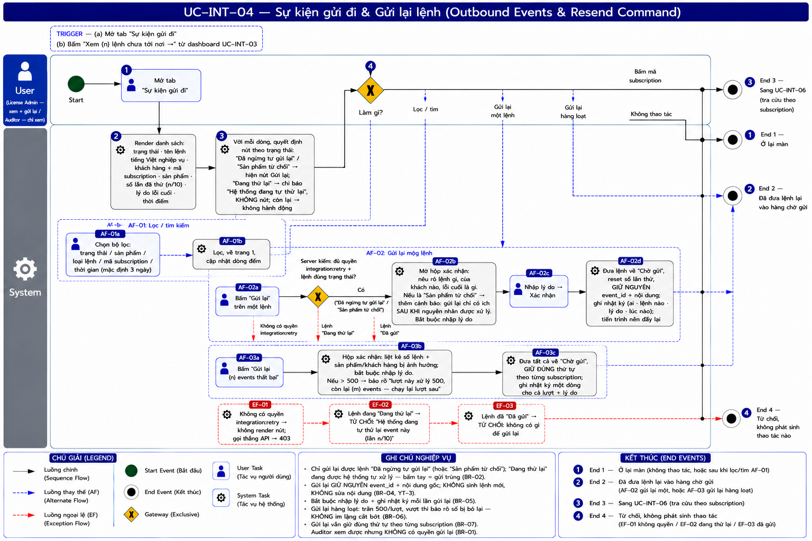
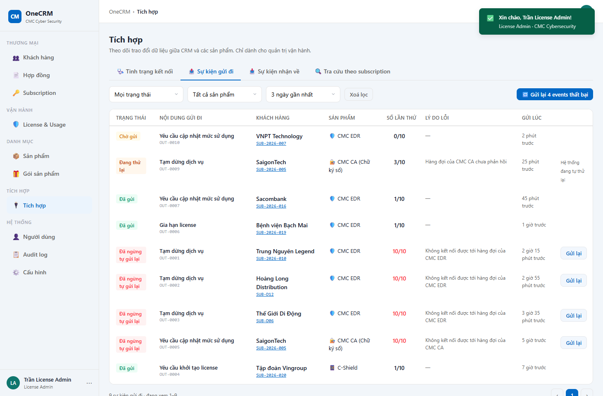

# UC-INT-04 — Sự kiện gửi đi & Gửi lại lệnh

> Module: M-07 Integration Layer | Phiên bản: 1.0 | Ngày: 14/07/2026
> Trạng thái: Draft for Review · **§3 Mô tả giao diện: chờ dựng demo**

---

## 1. Thông tin chung

| Thuộc tính | Nội dung |
|---|---|
| **Mã Use Case** | UC-INT-04 |
| **Tên** | Sự kiện gửi đi & Gửi lại lệnh |
| **Mô tả** | Xem các **lệnh CRM đã gửi sang sản phẩm** và tình trạng từng lệnh; **gửi lại** những lệnh đã **thất bại vĩnh viễn** sau khi nguyên nhân đã được khắc phục. Trả lời câu hỏi: ***"Lệnh của CRM có tới nơi không?"*** |
| **Tác nhân** | License Admin *(xem + gửi lại)* · Auditor *(chỉ xem)* |
| **Tiền điều kiện** | Quyền `integration:view`; để gửi lại cần thêm `integration:retry`. |
| **Hậu điều kiện** | (Gửi lại) Lệnh quay về **Chờ gửi**, tiến trình nền đẩy lại. **Không sinh lệnh mới.** |
| **Trigger** | Tab **Sự kiện gửi đi**; hoặc bấm nút *"Xem {n} lệnh chưa tới nơi →"* khi có thất bại vĩnh viễn ở UC-INT-03. |
| **Liên kết** | UC-INT-01 (nguồn sinh lệnh), UC-INT-03, UC-INT-06, UC-LIC-04 |

### Business Rules

| Mã | Nội dung | Vì sao |
|---|---|---|
| **BR-01** | **Gửi lại** cần quyền `integration:retry` — mặc định **chỉ License Admin**. **Auditor KHÔNG có.** | Auditor không được để lại dấu vết trong hệ thống mình đang kiểm toán. |
| **BR-02** | 🔴 **Chỉ gửi lại được lệnh ở trạng thái "Đã ngừng tự gửi lại".** | Lệnh **"Đang thử lại"** đang được **hệ thống tự xử lý** — bấm tay lúc đó là **gửi cùng một lệnh hai lần**. Lệnh **"Đã gửi"** thì không có gì để gửi lại. |
| **BR-03** | Lệnh **"Sản phẩm từ chối"** *(`subscription.command_failed`)* → **gửi lại được**, nhưng giao diện phải cảnh báo: *"Sản phẩm đã từ chối vì {lý do}. Gửi lại chỉ có ích **sau khi** nguyên nhân đó được xử lý."* | Gửi lại mà chưa sửa nguyên nhân = bị từ chối lần nữa. |
| **BR-04** | Gửi lại → **đưa lại vào hàng chờ**, **giữ nguyên `event_id` và nội dung gốc**. **Không sinh sự kiện mới, không cho sửa nội dung.** | Sửa nội dung rồi gửi = **CRM bịa dữ liệu của sản phẩm** — vi phạm YT-3. Giữ `event_id` để sản phẩm vẫn chống trùng được. |
| **BR-05** | **Bắt buộc nhập lý do** khi gửi lại; ghi nhật ký (ai · lệnh nào · lý do · lúc nào). | Người sau nhìn thấy trạng thái "nhảy" phải biết vì việc gì. |
| **BR-06** | **Gửi lại hàng loạt**: gửi lại **tất cả** lệnh thất bại vĩnh viễn của một sản phẩm trong một lần. Tối đa **500 lệnh/lượt**; vượt → chia lượt và **báo rõ số bị bỏ lại**. | Sự cố hạ tầng làm chết hàng loạt lệnh cùng lúc; bắt bấm từng cái là bất khả thi. **Nhưng không được im lặng cắt bớt** — người dùng phải biết còn bao nhiêu chưa xử lý. |
| **BR-07** | Gửi lại vẫn **giữ đúng thứ tự theo từng subscription** (UC-INT-01 BR-04). | Không thì "tạm dừng" có thể tới trước "khởi tạo". |
| **BR-08** | **Không có** chức năng tạo lệnh thủ công (UC-INT-01 BR-08). | YT-3. |
| **BR-09** | Bộ lọc: trạng thái · sản phẩm · loại lệnh · mã subscription · khoảng thời gian *(mặc định **3 ngày gần nhất**, đồng bộ với UC-INT-05 BR-09 — rà lại 14/07 theo BK-2)*. Phân trang **15 dòng/trang**. | Bảng này sẽ có hàng nghìn dòng. |

---

## 2. Luồng nghiệp vụ

### 2.1 Luồng chính

| Bước | Actor | Hành động / Phản hồi |
|---|---|---|
| **1** | Người dùng | Mở tab **Sự kiện gửi đi**. |
| **2** | System | Render danh sách: trạng thái · **tên lệnh bằng tiếng Việt nghiệp vụ** *(không phải mã kỹ thuật)* · khách hàng + mã subscription · sản phẩm · số lần đã thử · lý do lỗi cuối · thời điểm. |
| **3** | System | Với mỗi dòng, quyết định hành động theo BR-02/BR-03: **Đã ngừng tự gửi lại** hoặc **Sản phẩm từ chối** → nút **Gửi lại**; **Đang thử lại** → chỉ báo *"Hệ thống đang tự thử lại"*, **không có nút**; còn lại → không hành động. |
| **4** | Người dùng | **[Gateway — Làm gì?]** → Lọc/tìm → **AF-01** · Gửi lại một lệnh → **AF-02** · Gửi lại hàng loạt → **AF-03** · Bấm mã subscription → **UC-INT-06** (**End 3**) · Không thao tác → **End 1**. |

### 2.2 Luồng phụ

**[AF-01: Lọc / tìm kiếm]**

| Bước | Actor | Hành động / Phản hồi |
|---|---|---|
| **AF-01a** | Người dùng | Chọn bộ lọc (BR-09). |
| **AF-01b** | System | Lọc, **về trang 1**, cập nhật dòng đếm. |
| → | — | Ở lại màn (**End 1**). |

**[AF-02: Gửi lại một lệnh]**

| Bước | Actor | Hành động / Phản hồi |
|---|---|---|
| **AF-02a** | License Admin | Bấm **Gửi lại** trên một lệnh **Đã ngừng tự gửi lại**. |
| **AF-02b** | System | Mở hộp xác nhận: nêu rõ lệnh gì · của khách nào · lỗi cuối là gì. Nếu là **Sản phẩm từ chối** → thêm cảnh báo BR-03. **Bắt buộc nhập lý do** (BR-05). |
| **AF-02c** | License Admin | Nhập lý do → **Xác nhận**. |
| **AF-02d** | System | Đưa lệnh về **Chờ gửi**, reset số lần thử, **giữ nguyên `event_id` + nội dung** (BR-04); ghi nhật ký (BR-05). Tiến trình nền đẩy lại (UC-INT-01). |
| → | — | **End 2**. |

**[AF-03: Gửi lại hàng loạt]**

| Bước | Actor | Hành động / Phản hồi |
|---|---|---|
| **AF-03a** | License Admin | Bấm **"Gửi lại {n} events thất bại"**. |
| **AF-03b** | System | Hộp xác nhận: **liệt kê** số lệnh, các sản phẩm/khách hàng bị ảnh hưởng; **bắt buộc nhập lý do**. Nếu **> 500** → báo rõ *"lượt này xử lý 500, còn lại {m} events — chạy lại lượt sau"* (BR-06). |
| **AF-03c** | System | Đưa tất cả về **Chờ gửi**, **giữ đúng thứ tự theo từng subscription** (BR-07); ghi nhật ký một dòng cho cả lượt + lý do. |
| → | — | **End 2**. |

### 2.3 Luồng ngoại lệ

| Mã | Điều kiện | Xử lý |
|---|---|---|
| **EF-01** | Không có quyền `integration:retry` *(vd Auditor)* | Giao diện **không render nút** Gửi lại. Gọi thẳng API → **403**. |
| **EF-02** | Gọi API gửi lại trên lệnh **đang thử lại** | **Từ chối** + thông báo *"Hệ thống đang tự thử lại event này (lần {n}/10). Chờ hết số lần thử rồi mới gửi lại tay."* (BR-02) |
| **EF-03** | Gọi API gửi lại trên lệnh **đã gửi thành công** | **Từ chối** — không có gì để gửi lại. |

→ Cả 3 kết thúc tại **End 4** *(không phát sinh gì)*.

### 2.4 Điểm kết thúc

| End | Mô tả |
|---|---|
| **End 1** | Ở lại màn. |
| **End 2** | Đã đưa lệnh lại vào hàng chờ gửi. |
| **End 3** | Sang UC-INT-06 (tra cứu theo subscription). |
| **End 4** | Từ chối — không phát sinh thao tác nào. |

---

## 3. Mô tả giao diện

Demo: `v2.7.0_integration.html`, tab **"Sự kiện gửi đi"** *(`intRenderOutbox`)*.

Danh sách lệnh CRM gửi sang sản phẩm, mỗi dòng: **Trạng thái** · **Nội dung gửi đi** *(tên nghiệp vụ)* · **Khách hàng** + mã subscription · **Sản phẩm** · **Số lần thử** *(n/10)* · **Lý do lỗi** · **Gửi lúc**. Bộ cột và độ rộng **song song** với màn Sự kiện nhận về (UC-INT-05) — hai màn là gương của nhau.

Bộ lọc: Trạng thái · Sản phẩm · Thời gian *(mặc định 3 ngày gần nhất — lọc thuần thời gian)* · Xoá lọc. Dòng ở trạng thái **Đã ngừng tự gửi lại** (đã thử đủ 10 lần) có nút **Gửi lại**; khi có nhiều lệnh hiện nút **"Gửi lại N events thất bại"** (hàng loạt, trần 500/lượt — BR-06).

Ràng buộc bắt buộc: tên lệnh hiển thị bằng **tiếng Việt nghiệp vụ** *("Tạm dừng dịch vụ", không phải `subscription.suspended`)* · dòng **Đang thử lại** **không được có nút Gửi lại** (BR-02) · phân trang 15 dòng/trang.

---

## 4. Acceptance Criteria

| Mã | Given | When | Then |
|---|---|---|---|
| AC-INT-04-01 | Lệnh **Đã ngừng tự gửi lại** (10/10 lần thử). | Mở màn. | Có nút **Gửi lại** (BR-02). |
| AC-INT-04-02 | Lệnh **Đang thử lại** (3/10). | Mở màn. | **KHÔNG có nút Gửi lại**; hiện chỉ báo *"Hệ thống đang tự thử lại"*. Gọi thẳng API → **từ chối** kèm lý do (BR-02, EF-02). |
| AC-INT-04-03 | Lệnh **Đã gửi**. | Mở màn. | Không có hành động nào. Gọi API gửi lại → **từ chối** (EF-03). |
| AC-INT-04-04 | Lệnh bị **sản phẩm từ chối** *("tenant không tồn tại")*. | Bấm Gửi lại. | Hộp xác nhận **cảnh báo**: gửi lại chỉ có ích **sau khi** nguyên nhân được xử lý (BR-03). |
| AC-INT-04-05 | Đang gửi lại. | Bỏ trống ô lý do → Xác nhận. | **Chặn** — bắt buộc nhập lý do (BR-05). |
| AC-INT-04-06 | Gửi lại thành công. | Kiểm tra dữ liệu. | Lệnh về **Chờ gửi**; **`event_id` và nội dung KHÔNG đổi** (BR-04); nhật ký ghi ai · lệnh nào · lý do. |
| AC-INT-04-07 | Rà toàn bộ màn hình. | — | **Không tồn tại** chức năng sửa nội dung lệnh, hay tạo lệnh mới (BR-04, BR-08). |
| AC-INT-04-08 | EDR có **3 lệnh thất bại**. | Bấm "Gửi lại 3 events thất bại". | Hộp xác nhận liệt kê 3 lệnh + khách hàng; nhập lý do → cả 3 về Chờ gửi, **đúng thứ tự theo từng subscription** (BR-06, BR-07). |
| AC-INT-04-09 | Có **620 lệnh** thất bại. | Bấm gửi lại hàng loạt. | Xử lý **500**, và **báo rõ**: *"còn 120 events — chạy lại lượt sau"* — **không im lặng cắt bớt** (BR-06). |
| AC-INT-04-10 | **Auditor** đăng nhập. | Mở màn. | Xem được danh sách; **không có nút Gửi lại nào**; gọi API → **403** (BR-01, EF-01). |

---

## 5. Review Checklist

### Lịch sử thay đổi

| Phiên bản | Ngày | Tác giả | Mô tả |
|---|---|---|---|
| 1.0 | 14/07/2026 | Claude (AI) | Khởi tạo. Trace: PRD v2.6 §6.7.6 (FR-INT-05), §6.7.7 (FR-INT-06). **Bổ sung so với PRD:** BR-02 *(chỉ gửi lại lệnh **thất bại vĩnh viễn** — PRD chưa nói rõ, và demo lần đầu **đã sai** ở đúng chỗ này: cho gửi lại cả lệnh đang tự thử lại)* · BR-03 *(cảnh báo với lệnh bị sản phẩm từ chối)* · BR-05 *(bắt buộc lý do)* · BR-06 *(gửi lại hàng loạt + trần 500 + **không im lặng cắt bớt**)* · BR-07 *(giữ thứ tự khi gửi lại)*. |
| 1.1 | 14/07/2026 | Claude (AI) | **Rà lại theo BK-2:** BR-09 — bộ lọc thời gian mặc định **3 ngày**, thay cho không có mặc định trước đó (đồng bộ UC-INT-05). |
| 1.2 | 15/07/2026 | Claude (AI) | Cập nhật các **chuỗi hiển thị chính xác** (nút, thông báo) sang đơn vị đếm **"events"** tiếng Anh, theo yêu cầu BA — xem UC-INT-03 BR-08. Văn phong chung của tài liệu ("lệnh") giữ nguyên, chỉ đổi phần chữ hiển thị trực tiếp trên UI để khớp demo. |
| 1.3 | 16/07/2026 | Claude (AI) | **Đồng bộ với demo đã chốt.** (1) **§3 viết thật + nhúng wireframe** (trước là "chờ dựng demo"): danh sách 8 cột song song UC-INT-05, cột **Số lần thử** (n/10) + **Lý do lỗi** (đổi từ "Lỗi cuối"). (2) Đổi nhãn `DEAD_LETTER` **"Thất bại vĩnh viễn" → "Đã ngừng tự gửi lại"** (khớp việc có nút Gửi lại — hết mâu thuẫn "vĩnh viễn"). (3) **PA2 lọc thuần thời gian** + drill-down từ tab Kênh mở "Toàn bộ" để đủ lệnh kẹt cũ. |
| 1.4 | 17/07/2026 | Claude (AI) | Nhúng **sơ đồ luồng BPMN** vào §2 (`UC-INT-04_bpmn.png`) — đã review đối chiếu §2: đúng luồng, đủ node (Start · bước 1–4 · AF-01/02/03 · cổng guard 4 nhánh → EF-01/02/03 · End 1–4 khớp badge; End 2 gộp AF-02d+AF-03c; End 4 gộp 3 EF). Còn **2 lỗi chính tả cosmetic trên ảnh** (mẩu "Ac-1▸" cạnh tiêu đề AF-01; "mộg"→"một" ở tiêu đề AF-02) — không ảnh hưởng luồng, dọn khi regen ảnh. |

### Nghiệp vụ
- ✅ Không bao giờ gửi trùng lệnh — **hệ thống đang tự thử lại thì người không được chen ngang**
- ✅ **Không sửa nội dung** lệnh (YT-3) — chỉ gửi lại nguyên trạng
- ✅ Gửi lại hàng loạt có **trần rõ ràng**, và **báo số bị bỏ lại**
- ✅ Auditor xem được, không tác động được

---

## Footer

| Mục | Nội dung |
|---|---|
| **Giao diện** | ✅ Có demo — `v2.7.0_integration.html`, tab "Sự kiện gửi đi" |
| **UC liên quan** | UC-INT-01, UC-INT-03, UC-INT-06 |
| **Trace PRD** | OneCRM_PRD_v2.7.md §6.7.6 (FR-INT-05), §6.7.7 (FR-INT-06) |
