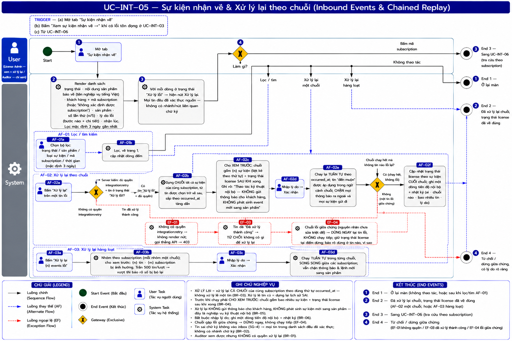
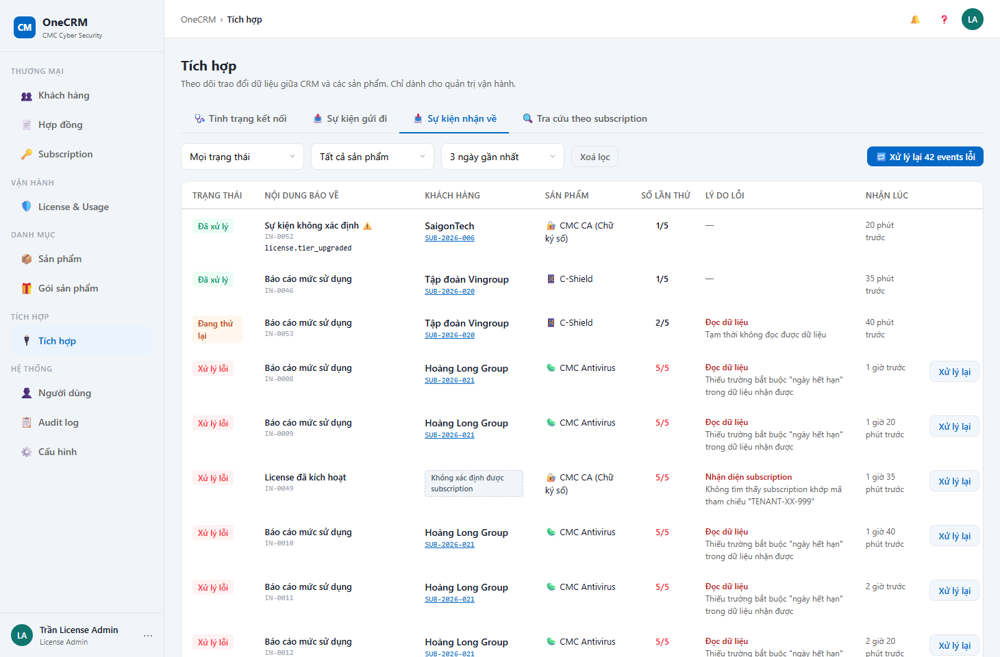

# UC-INT-05 — Sự kiện nhận về & Xử lý lại theo chuỗi

> Module: M-07 Integration Layer | Phiên bản: 1.0 | Ngày: 14/07/2026
> Trạng thái: Draft for Review · **§3 Mô tả giao diện: chờ dựng demo**

---

## 1. Thông tin chung

| Thuộc tính | Nội dung |
|---|---|
| **Mã Use Case** | UC-INT-05 |
| **Tên** | Sự kiện nhận về & Xử lý lại theo chuỗi |
| **Mô tả** | Xem các **tin sản phẩm gửi về** và tình trạng xử lý của CRM; **xử lý lại** những tin CRM đã đọc lỗi, **sau khi** nguyên nhân được khắc phục. Trả lời: ***"Sản phẩm có báo về không, và ta xử lý được không?"*** |
| **Tác nhân** | License Admin *(xem + xử lý lại)* · Auditor *(chỉ xem)* |
| **Tiền điều kiện** | Quyền `integration:view`; để xử lý lại cần `integration:retry`. |
| **Hậu điều kiện** | (Thành công) Các tin được xử lý lại **theo đúng thứ tự thời gian**; trạng thái license về đúng. **Không gửi thông báo cho khách hàng, không phát sinh lệnh mới sang sản phẩm.** |
| **Trigger** | Tab **Sự kiện nhận về**; hoặc bấm nút *"Xem sự kiện nhận về →"* khi có lỗi tồn đọng ở UC-INT-03; hoặc từ UC-INT-06. |
| **Liên kết** | UC-INT-02 (nguồn), UC-INT-03, UC-INT-06, UC-LIC-02, UC-SUB-03 |

### Business Rules

| Mã | Nội dung | Vì sao |
|---|---|---|
| **BR-01** | Xử lý lại cần quyền `integration:retry` — **chỉ License Admin**. Auditor **không**. | — |
| **BR-02** ✏️ *(SG-4, chốt 16/07)* | **Tin sai chữ ký KHÔNG xuất hiện ở màn này.** Receiver trả **4xx và không ghi `WEBHOOK_INBOX`** (UC-INT-02 BR-01) — chỉ log hạ tầng. Do đó **mọi tin trong danh sách đều đã xác thực nguồn**; không có nhánh xử lý "chữ ký sai" trên màn Sự kiện nhận về. | Không lưu tin chưa xác thực để tránh DoS + giữ inbox chỉ chứa dữ liệu đáng tin. |
| **BR-03** | 🔴 **XỬ LÝ LẠI = XỬ LÝ LẠI CẢ CHUỖI**, không xử lý lẻ một tin. Khi chọn một tin lỗi, hệ thống xử lý lại **tất cả sự kiện của cùng subscription đó, tính từ tin được chọn trở về sau**, **tuần tự theo `occurred_at`**. | Xem §Vì sao — đây là quy tắc quan trọng nhất của UC này. |
| **BR-04** | Trước khi chạy, giao diện **phải cho xem trước**: chuỗi gồm bao nhiêu sự kiện, gồm những gì, và **trạng thái license sẽ ra sao sau khi xong**. | Người bấm phải biết mình sắp làm gì với dữ liệu của khách hàng. |
| **BR-05** | 🔴 **Xử lý lại KHÔNG gửi thông báo cho khách hàng và KHÔNG phát sinh sự kiện mới sang sản phẩm.** | *(Chốt 13/07/2026 — BA)*: **"đây là nghiệp vụ kỹ thuật của CRM, khách hàng không cần biết"**. Nếu không chặn: xử lý lại 42 tin cũ → khách nhận 42 email *"license của bạn vừa được kích hoạt"* cho những việc xảy ra 3 ngày trước. |
| **BR-06** | **Bắt buộc nhập lý do**; ghi **một dòng vào tiến độ của subscription** *(nội bộ)* + nhật ký hoạt động. | Trạng thái license sẽ "nhảy". Người sau nhìn vào phải biết nó nhảy vì việc gì, do ai. |
| **BR-07** | **Xử lý lại hàng loạt**: xử lý lại tất cả tin lỗi của một sản phẩm. Hệ thống **tự nhóm theo subscription** và chạy **từng chuỗi tuần tự** *(các subscription khác nhau chạy song song được)*. Trần **500 tin/lượt**; vượt → **báo rõ số bị bỏ lại**. | Một lỗi ánh xạ làm hỏng hàng chục/hàng trăm tin cùng lúc. Nhưng vẫn phải giữ tuần tự **trong từng subscription** (BR-03). |
| **BR-08** | Tin **"đến muộn"** *(UC-INT-02 BR-05)*: bình thường **không áp dụng**; nhưng **trong chuỗi xử lý lại thì được áp dụng theo đúng thứ tự** `occurred_at`. | Đó chính là mục đích của chuỗi: dựng lại lịch sử **theo đúng trình tự việc đã xảy ra**. |
| **BR-09** | ✏️ **Rà lại 14/07 (theo BK-2 — thay cho "ẩn mặc định" ở bản trước):** danh sách áp dụng **bộ lọc mặc định theo thời gian = 3 ngày gần nhất** *(không phải ẩn `usage_synced` thành công)*. Người dùng tự nới khoảng thời gian khi cần tra cứu xa hơn. `WEBHOOK_INBOX` **không purge tự động** ở giai đoạn này — dữ liệu vẫn còn trong DB, chỉ không hiện mặc định. ⚠️ **Đề xuất bổ sung của tôi, chưa xác nhận:** tin ở trạng thái **Xử lý lỗi/chưa xử lý xong** thì **luôn hiện, bất kể tuổi** — filter 3 ngày chỉ áp dụng cho tin **đã xử lý xong** (thành công hoặc đến muộn). Lý do: filter thuần theo ngày sẽ **giấu mất lỗi cũ chưa ai xử lý** — đúng nguy cơ mà UC này sinh ra để tránh (§Vì sao phải xử lý lại theo chuỗi). | Chúng chiếm **>95% khối lượng** (8 tin/sub/ngày) — không ẩn hẳn để không mất khả năng tra cứu, nhưng filter mặc định giữ màn hình không bị ngợp. ✅ *(OQ-INT-07 — đã chốt theo BK-2)* |
| **BR-10** | Bộ lọc: trạng thái · sản phẩm · loại sự kiện · mã subscription · khoảng thời gian *(mặc định 3 ngày, BR-09)*. Phân trang **15 dòng/trang**. | — |

### 🔴 Vì sao phải xử lý lại theo CHUỖI — không được xử lý lẻ

Subscription `SUB-2026-021` có lịch sử:

| Thời điểm | Sự kiện | Kết quả xử lý |
|---|---|---|
| 3 ngày trước | `license.activated` | ❌ **Lỗi** *(thiếu trường "ngày hết hạn")* |
| 2 ngày trước | `license.suspended` | ✅ Đã xử lý |
| 1 ngày → 1 giờ trước | `license.usage_synced` × 40 | ❌ **Lỗi** *(cùng nguyên nhân)* |

Ops sửa bảng ánh xạ, rồi **xử lý lại riêng tin `license.activated`** (tin cũ nhất).

> **Kết quả: license bị đặt về "Đang hoạt động"** — vì tin đó nói vậy.
> Nhưng thực tế **2 ngày trước license đã bị tạm dừng**. **Trạng thái sai. Khách bị tính là đang dùng dịch vụ trong khi đã dừng.**

**Xử lý lại theo chuỗi** chạy lại **cả 42 sự kiện** theo đúng thứ tự thời gian → trạng thái cuối = **"Đã ngừng"** ✅ — đúng thực tế.

> ⚠️ **Đây là lý do BR-03 tồn tại, và là lý do `occurred_at` phải nằm trong metadata** ([Phụ lục A §2](_event_catalog.md)).

---

## 2. Luồng nghiệp vụ

### 2.1 Luồng chính

| Bước | Actor | Hành động / Phản hồi |
|---|---|---|
| **1** | Người dùng | Mở tab **Sự kiện nhận về**. |
| **2** | System | Render danh sách: trạng thái · **nội dung sản phẩm báo về** *(tên nghiệp vụ tiếng Việt)* · khách hàng + mã subscription *(hoặc nhãn "không xác định được subscription")* · sản phẩm · **số lần thử** · **lý do lỗi** *(bước nào + chi tiết)* · nhận lúc. Lọc mặc định **3 ngày gần nhất** (BR-09). |
| **3** | System | Với mỗi dòng ở trạng thái **Xử lý lỗi** → nút **Xử lý lại** *(mọi tin đều đã xác thực — không còn nhánh chữ ký, BR-02)*. |
| **4** | Người dùng | **[Gateway — Làm gì?]** → Lọc/tìm → **AF-01** · Xử lý lại một chuỗi → **AF-02** · Xử lý lại hàng loạt → **AF-03** · Bấm mã subscription → **UC-INT-06** (**End 3**) · Không thao tác → **End 1**. |

### 2.2 Luồng phụ

**[AF-01: Lọc / tìm kiếm]** — như UC-INT-04 AF-01, về trang 1 sau khi lọc. → **End 1**.

**[AF-02: Xử lý lại theo chuỗi]**

| Bước | Actor | Hành động / Phản hồi |
|---|---|---|
| **AF-02a** | License Admin | Bấm **Xử lý lại** trên một tin lỗi. |
| **AF-02b** | System | Dựng **chuỗi**: tất cả sự kiện của **cùng subscription**, từ tin được chọn **trở về sau**, sắp theo `occurred_at` tăng dần (BR-03). |
| **AF-02c** | System | **Cho xem trước** (BR-04): chuỗi gồm **{n} sự kiện**, liệt kê theo thứ tự, và **trạng thái license sau khi xong**. Ghi rõ: *"Đây là thao tác kỹ thuật nội bộ — **không gửi thông báo cho khách hàng**, **không phát sinh event mới** sang sản phẩm."* (BR-05) |
| **AF-02d** | License Admin | Nhập **lý do** (BR-06) → **Xác nhận**. |
| **AF-02e** | System | Chạy lại **tuần tự** theo `occurred_at`; tin *"đến muộn"* **được áp dụng** trong ngữ cảnh chuỗi (BR-08); **chặn** mọi thông báo ra ngoài và mọi sự kiện gửi đi (BR-05). |
| **AF-02f** | System | Cập nhật trạng thái license theo sự kiện **cuối chuỗi**; ghi **một dòng tiến độ nội bộ** + nhật ký (ai · chuỗi nào · bao nhiêu tin · lý do). |
| → | — | **End 2**. |

**[AF-03: Xử lý lại hàng loạt]**

| Bước | Actor | Hành động / Phản hồi |
|---|---|---|
| **AF-03a** | License Admin | Bấm **"Xử lý lại {n} events lỗi"**. |
| **AF-03b** | System | **Nhóm theo subscription**; mỗi nhóm là một chuỗi. Cho xem trước: **{n} tin · {m} subscription bị ảnh hưởng**. Trần **500 tin/lượt** → vượt thì **báo rõ số bị bỏ lại** (BR-07). |
| **AF-03c** | License Admin | Nhập lý do → Xác nhận. |
| **AF-03d** | System | Chạy **tuần tự trong từng chuỗi**, **song song giữa các subscription** (BR-07); vẫn chặn thông báo & lệnh mới (BR-05). |
| → | — | **End 2**. |

### 2.3 Luồng ngoại lệ

| Mã | Điều kiện | Xử lý |
|---|---|---|
| **EF-01** | Không có quyền `integration:retry` | Không render nút; gọi API → **403**. |
| ~~**EF-02**~~ *(bỏ — SG-4)* | *(Không còn phát sinh: tin sai chữ ký bị Receiver trả 4xx, KHÔNG ghi inbox — UC-INT-02 BR-01. Không có tin sai chữ ký nào ở màn này.)* | — |
| **EF-03** | Tin **đã xử lý thành công** | Từ chối — không có gì để xử lý lại. |
| **EF-04** | Chuỗi chạy **lỗi giữa chừng** *(nguyên nhân chưa được sửa triệt để)* | **Dừng ngay tại tin lỗi**, **không chạy tiếp** các tin sau. Giữ nguyên trạng thái license tại thời điểm dừng; báo rõ **dừng ở tin nào, vì sao**. *Chạy tiếp trên nền một tin lỗi = dựng lại lịch sử sai.* |

→ Kết thúc tại **End 4**.

### 2.4 Điểm kết thúc

| End | Mô tả |
|---|---|
| **End 1** | Ở lại màn. |
| **End 2** | Đã xử lý lại chuỗi — trạng thái license đã về đúng. |
| **End 3** | Sang UC-INT-06. |
| **End 4** | Từ chối / dừng giữa chừng — có lý do rõ ràng. |

---

## 3. Mô tả giao diện

Demo: `v2.7.0_integration.html`, tab **"Sự kiện nhận về"** *(`intRenderInbox`)*.

Danh sách tin sản phẩm báo về, mỗi dòng: **Trạng thái** · **Nội dung báo về** *(tên nghiệp vụ)* · **Khách hàng** + mã subscription *(hoặc "không xác định được subscription")* · **Sản phẩm** · **Số lần thử** *(n/5)* · **Lý do lỗi** *(bước nào + chi tiết)* · **Nhận lúc**. Bộ cột và độ rộng **song song** với màn Sự kiện gửi đi (UC-INT-04) — hai màn là gương của nhau. Sự kiện lạ (chưa khai báo) hiện title "Sự kiện không xác định" + ⚠️ (guidance trong tooltip) + mã event thật.

Bộ lọc: Trạng thái · Sản phẩm · Thời gian *(mặc định 3 ngày gần nhất — lọc thuần thời gian)* · Xoá lọc. Dòng ở trạng thái **Xử lý lỗi** có nút **Xử lý lại**; khi có nhiều tin lỗi hiện nút **"Xử lý lại N events lỗi"** (hàng loạt).

Ràng buộc bắt buộc: mọi tin trong danh sách **đều đã xác thực nguồn** *(tin sai chữ ký không vào inbox — BR-02, SG-4)* · hộp xác nhận Xử lý lại **phải cho xem trước cả chuỗi + trạng thái license sau khi xong** (BR-04) · phải ghi rõ *"không gửi thông báo cho khách hàng"* (BR-05).

---

## 4. Acceptance Criteria

### Nhóm 1: Xử lý lại theo chuỗi *(quy tắc quan trọng nhất)*

| Mã | Given | When | Then |
|---|---|---|---|
| AC-INT-05-01 | `SUB-2026-021`: `license.activated` **lỗi** (3 ngày trước) → `license.suspended` **đã xử lý** (2 ngày trước) → 40 tin `usage_synced` **lỗi**. | Bấm **Xử lý lại** trên tin `license.activated`. | Hộp xác nhận nêu: chuỗi gồm **42 sự kiện**, liệt kê theo thứ tự, và **trạng thái license sau khi xong = "Đã ngừng"** (BR-03, BR-04). |
| AC-INT-05-02 | Cùng dữ liệu trên. | Xác nhận, chạy xong. | Trạng thái license = **"Đã ngừng"** ✅ — **KHÔNG phải "Đang hoạt động"** *(đó là kết quả sai nếu chỉ xử lý lẻ tin cũ nhất)*. |
| AC-INT-05-03 | Cùng dữ liệu trên. | Chạy xong. | Khách hàng **KHÔNG nhận được thông báo nào**; **KHÔNG có sự kiện mới nào** được gửi sang sản phẩm (BR-05). |
| AC-INT-05-04 | Đang xử lý lại. | Bỏ trống ô lý do. | **Chặn** — bắt buộc nhập lý do (BR-06). |
| AC-INT-05-05 | Xử lý lại xong. | Mở tiến độ của subscription. | Có **một dòng nội bộ** ghi việc xử lý lại (ai · bao nhiêu tin · lý do) — để người sau hiểu vì sao trạng thái "nhảy" (BR-06). |
| AC-INT-05-06 | Chuỗi 42 tin, nhưng nguyên nhân **chưa sửa triệt để** — tin thứ 5 vẫn lỗi. | Chạy chuỗi. | **Dừng tại tin thứ 5**; **không chạy 37 tin còn lại**; báo rõ dừng ở đâu, vì sao (EF-04). |

### Nhóm 2: Xác thực & phân quyền

| Mã | Given | When | Then |
|---|---|---|---|
| AC-INT-05-07 ✏️ *(SG-4)* | Sản phẩm gửi tin **sai chữ ký**. | Mở màn Sự kiện nhận về. | Tin đó **KHÔNG xuất hiện** trong danh sách (Receiver đã trả 4xx, không ghi inbox — UC-INT-02 BR-01). Mọi tin hiển thị đều đã xác thực nguồn; không có nhánh/nút liên quan chữ ký (BR-02). |
| AC-INT-05-08 | **Auditor** đăng nhập. | Mở màn. | Xem được; **không có nút Xử lý lại nào**; gọi API → **403** (BR-01). |

### Nhóm 3: Hàng loạt

| Mã | Given | When | Then |
|---|---|---|---|
| AC-INT-05-09 | AV có **42 tin lỗi** thuộc **3 subscription**. | Bấm "Xử lý lại 42 events lỗi". | Nhóm thành **3 chuỗi**; mỗi chuỗi chạy **tuần tự bên trong**, 3 chuỗi chạy **song song** (BR-07). |
| AC-INT-05-10 | Có **620 tin lỗi**. | Bấm xử lý lại hàng loạt. | Xử lý **500**, **báo rõ**: *"còn 120 events — chạy lại lượt sau"* (BR-07). |

### Nhóm 4: Nhiễu

| Mã | Given | When | Then |
|---|---|---|---|
| AC-INT-05-11 | Trong 3 ngày qua có **12.000 tin `usage_synced` đã xử lý thành công** và **3 tin lỗi**; có 1 tin lỗi từ **5 ngày trước** chưa xử lý. | Mở màn (không đổi bộ lọc). | Mặc định chỉ hiện dữ liệu trong **3 ngày gần nhất** — tin lỗi 5 ngày trước **không hiện** cho tới khi người dùng nới khoảng thời gian lọc (BR-09). Không có dữ liệu nào bị xoá — chỉ là chưa hiện. |

---

## 5. Review Checklist

### Lịch sử thay đổi

| Phiên bản | Ngày | Tác giả | Mô tả |
|---|---|---|---|
| 1.0 | 14/07/2026 | Claude (AI) | Khởi tạo. Trace: PRD v2.6 §6.7.6 (FR-INT-05), §6.7.7 (FR-INT-06). **Bổ sung lớn so với PRD** *(PRD chỉ nói "reset về RECEIVED, retry_count=0")*: 🔴 **BR-03 xử lý lại theo CHUỖI** *(chốt 13/07 — xử lý lẻ tin cũ sẽ ghi đè ngược trạng thái license)* · 🔴 **BR-05 không gửi thông báo cho khách hàng, không phát sinh lệnh mới** *(chốt 13/07: "đây là nghiệp vụ kỹ thuật của CRM, khách hàng không cần biết")* · **BR-04** xem trước chuỗi + trạng thái kết quả · **BR-06** bắt buộc lý do · **BR-07** hàng loạt + trần 500 · **EF-04** dừng giữa chừng khi vẫn lỗi. |
| 1.1 | 14/07/2026 | Claude (AI) | **Rà lại theo BK-2:** BR-09 đổi từ "ẩn mặc định `usage_synced` thành công" sang **bộ lọc mặc định 3 ngày** (không purge, không ẩn theo loại event); AC-INT-05-11 viết lại theo hành vi mới. ⚠️ Thêm đề xuất: tin lỗi/chưa xử lý luôn hiện bất kể tuổi — **chưa xác nhận với BA**. |
| 1.2 | 15/07/2026 | Claude (AI) | Cập nhật các **chuỗi hiển thị chính xác** (nút, thông báo) sang đơn vị đếm **"events"** tiếng Anh, theo yêu cầu BA — xem UC-INT-03 BR-08. Văn phong chung của tài liệu ("tin") giữ nguyên, chỉ đổi phần chữ hiển thị trực tiếp trên UI để khớp demo. |
| 1.3 | 16/07/2026 | Claude (AI) | **Đồng bộ với demo đã chốt.** (1) **SG-4:** tin sai chữ ký → 4xx, KHÔNG ghi inbox (chỉ log hạ tầng) → gỡ toàn bộ nhánh "chữ ký sai" (BR-02 viết lại, EF-02 bỏ, cột "Xác thực" bỏ, AC-07 lật thành kiểm SG-4). (2) **§3 viết thật + nhúng wireframe** (trước là "chờ dựng demo"): danh sách 8 cột song song với UC-INT-04, thêm **Số lần thử** (n/5) + **Lý do lỗi**; sự kiện lạ hiện ⚠️ + tooltip. (3) Đổi nhãn `DEAD_LETTER` → "Đã ngừng tự gửi lại". (4) Xác nhận **PA2 lọc thuần thời gian** (AC-11): tin lỗi cũ ngoài cửa sổ **có** ẩn khỏi list, được tab Kênh bắt. |
| 1.4 | 17/07/2026 | Claude (AI) | Nhúng **sơ đồ luồng BPMN** vào §2 (`UC-INT-05_bpmn.png`) — đã review đối chiếu §2: đúng và đủ. AF-02 chuỗi 8 mắt (AF-02a → guard → dựng chuỗi → xem trước → nhập lý do → chạy tuần tự → **cổng RUN** → cập nhật) với RUN "lỗi giữa chừng" → **EF-04**; guard → EF-01/EF-03; **AF-03 đủ 4 mắt** gồm AF-03d (chạy tuần tự trong chuỗi, song song giữa các sub); 4 End khớp badge (End 2 gộp AF-02f+AF-03d); **SG-4** không nhánh chữ ký. |

### Nghiệp vụ
- ✅ **Không bao giờ dựng lại lịch sử sai** — chuỗi tuần tự theo `occurred_at`, dừng ngay khi gặp lỗi
- ✅ **Khách hàng không bị làm phiền** bởi việc kỹ thuật nội bộ
- ✅ Tin **sai chữ ký không vào inbox** (SG-4, BR-02): Receiver trả 4xx + không ghi → không có tin sai chữ ký nào ở màn này để xử lý lại
- ✅ Bảng không bị rác usage che mất sự kiện quan trọng — lọc mặc định 3 ngày, tin lỗi cũ vẫn hiện *(đề xuất, chờ xác nhận)*
- ✅ **OQ-INT-05 — đã chốt:** BR-03/BR-08 phụ thuộc `occurred_at` trong metadata + cột `last_event_occurred_at`.
- ✅ **OQ-INT-07 — đã chốt (sửa lại theo BK-2):** BR-09 — bộ lọc mặc định 3 ngày, không purge tự động, không ẩn `usage_synced` theo loại.

---

## Footer

| Mục | Nội dung |
|---|---|
| **Giao diện** | ✅ Có demo — `v2.7.0_integration.html`, tab "Sự kiện nhận về" |
| **UC liên quan** | UC-INT-02, UC-INT-03, UC-INT-06, UC-LIC-02, UC-SUB-03 |
| **Trace PRD** | OneCRM_PRD_v2.7.md §6.7.6 (FR-INT-05), §6.7.7 (FR-INT-06) |
