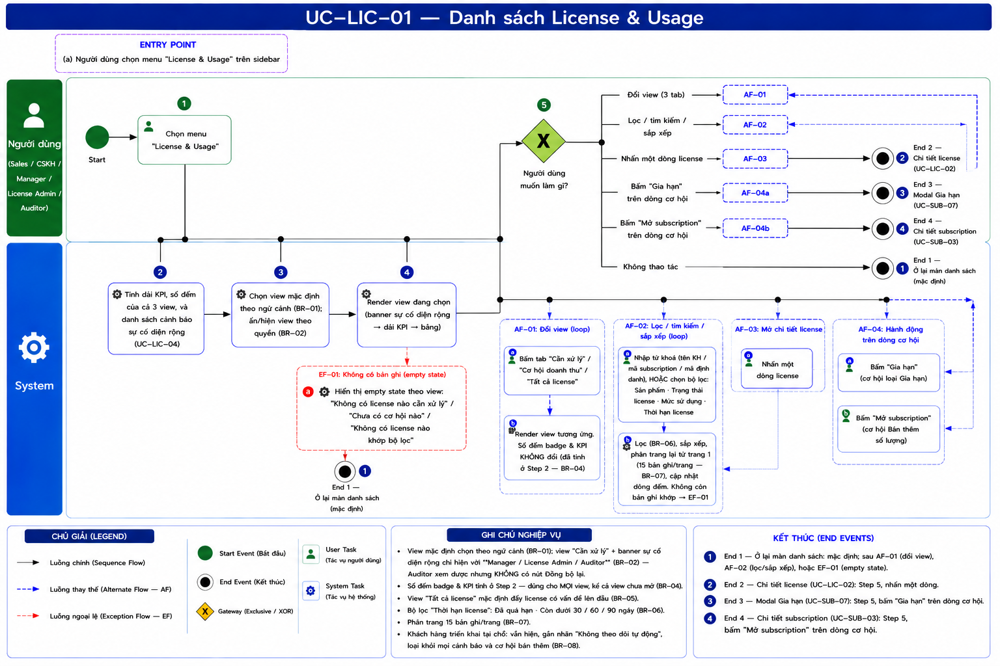
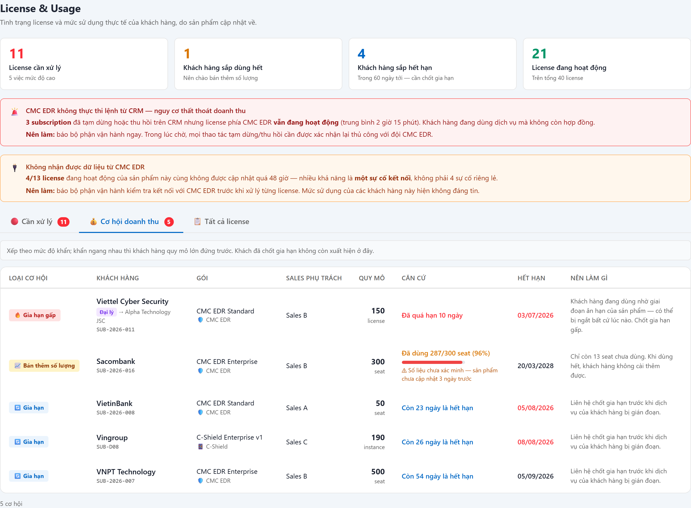
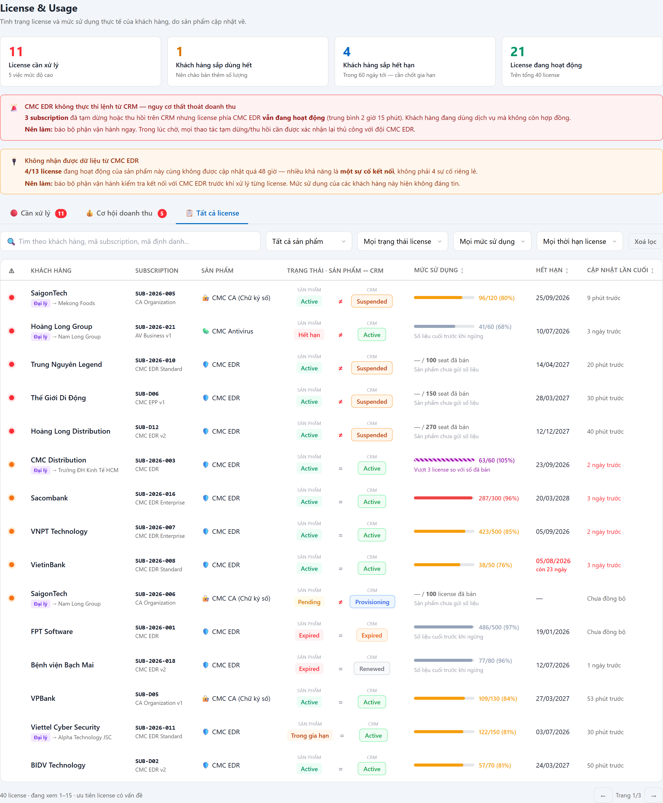
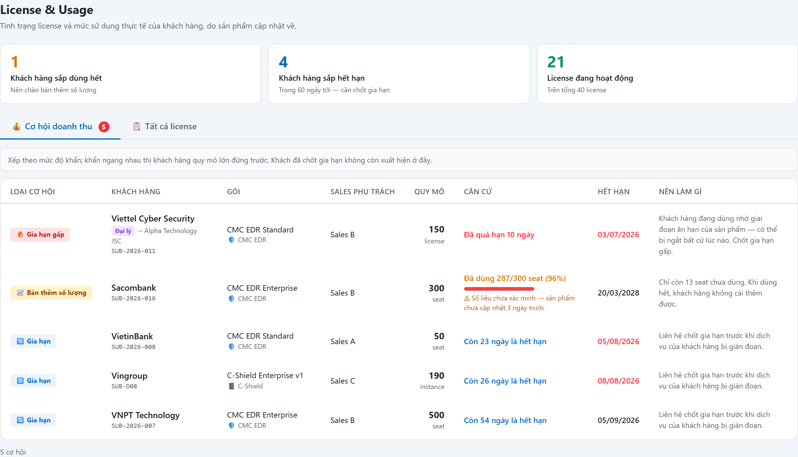

# UC-LIC-01 — Danh sách License & Usage

> Module: M-05 License Mirror & Usage Tracking | Phiên bản: 1.0 | Ngày: 13/07/2026
> Trạng thái: Draft for Review

---

## 1. Thông tin chung

| Thuộc tính | Nội dung |
|---|---|
| **Mã Use Case** | UC-LIC-01 |
| **Tên** | Danh sách License & Usage |
| **Mô tả** | Màn hình trung tâm của module M-05, tổ chức theo **ý định người dùng** thành 3 view: (1) **Cần xử lý** — hàng đợi sự cố của License Admin; (2) **Cơ hội doanh thu** — khách sắp dùng hết số lượng / sắp hết hạn, dành cho Sales; (3) **Tất cả license** — tra cứu. Kèm dải KPI và banner cảnh báo sự cố diện rộng. |
| **Tác nhân** | Sales, CSKH, Manager, License Admin, **Auditor** (chỉ đọc — không có nút tạo tác động) |
| **Tiền điều kiện** | Đã đăng nhập; có quyền `license:view`. |
| **Hậu điều kiện** | (Thành công) Hiển thị danh sách theo view và bộ lọc. Chỉ đọc, không thay đổi dữ liệu. |
| **Trigger** | Người dùng chọn menu **License & Usage**. |
| **Liên kết** | UC-LIC-02 (Chi tiết license), UC-LIC-03 (Đồng bộ lại mức sử dụng), UC-LIC-04 (Phát hiện lệch trạng thái), UC-SUB-03 (Chi tiết Subscription), UC-SUB-07 (Gia hạn) |

### Business Rules

| Mã | Nội dung |
|---|---|
| **BR-01** | **View mặc định theo ngữ cảnh**: nếu người dùng có quyền xem hàng đợi sự cố **và** đang có ít nhất 1 việc cần xử lý → mở view **Cần xử lý**; ngược lại nếu có cơ hội doanh thu → mở view **Cơ hội doanh thu**; còn lại → **Tất cả license**. *Lý do: đây là màn hình công việc, mục tiêu là "mở lên thấy ngay việc phải làm".* |
| **BR-02** | **Phân quyền view**: view **Cần xử lý**, dải KPI "License cần xử lý" và banner sự cố diện rộng **chỉ hiển thị** cho người có quyền `license:view_issues` — mặc định: **Manager, License Admin, Auditor**. Sales/CSKH truy cập trực tiếp → tự chuyển về view **Cơ hội doanh thu**. *(Auditor **xem được** hàng đợi vì đó chính là các sai lệch họ đi kiểm toán, nhưng **không có** nút Đồng bộ lại — chốt Q11, 13/07/2026.)* |
| **BR-03** | Danh sách chỉ bao gồm subscription **đã có license mirror** (`status ≠ DRAFT` và `license_mirror.status ≠ N/A`). Sub Draft chưa gửi sang sản phẩm → không có license để quan sát. |
| **BR-04** | **Số đếm trên tab (badge)** phải đúng ở **mọi view**, kể cả view chưa được mở — tính độc lập với việc render. |
| **BR-05** | View **Tất cả license**: mặc định sắp xếp **license có vấn đề lên đầu** (mức độ giảm dần, sau đó mức dùng giảm dần), và **phải nói rõ điều đó** trên dòng đếm. Người dùng có thể sắp xếp lại theo Mức sử dụng / Hết hạn / Cập nhật lần cuối. |
| **BR-06** | Bộ lọc **"Thời hạn license"** thể hiện đúng bản chất **hạn của license**, không lẫn với trạng thái *đang trong ân hạn*: 4 lựa chọn — **Đã quá hạn** · **Còn dưới 30 / 60 / 90 ngày**. |
| **BR-07** | Phân trang 15 bản ghi/trang. Header bảng dính khi cuộn. |
| **BR-08** | **Khách hàng triển khai tại chỗ (on-premise)**: **vẫn hiện** trong danh sách (để Sales không tưởng dữ liệu bị mất), gắn nhãn **"Không theo dõi tự động"**; **không có** mức sử dụng / thời điểm cập nhật; **loại khỏi mọi cảnh báo** và khỏi cơ hội bán thêm. |
| **BR-09** | **Sales phụ trách** hiển thị ở view Cơ hội doanh thu, lấy từ **người tạo subscription**. *(Mô hình phân công khách hàng nằm ngoài phạm vi giai đoạn này — chốt 13/07/2026.)* |
| **BR-10** | **Loại trừ khỏi cơ hội gia hạn**: subscription **đã có bản gia hạn kế tiếp** (đã chốt gia hạn) **không** xuất hiện ở view Cơ hội — nếu không, Sales sẽ gọi lại khách đã ký. |
| **BR-11** | **Cơ hội dựa trên số liệu cũ**: nếu sản phẩm chưa cập nhật quá ngưỡng (UC-LIC-04 BR-02), dòng cơ hội **vẫn hiện** nhưng phải kèm cảnh báo *"Số liệu chưa xác minh — sản phẩm chưa cập nhật {X}"*. *Lý do: giấu đi thì mất cơ hội thật; hiện trơn thì Sales chào bán trên số sai.* |
| **BR-12** | **Đại lý (hợp đồng RESELLER)**: đơn vị thụ hưởng sắp dùng hết **không** đương nhiên là doanh thu mới. Pool của đại lý **còn** → ghi rõ *"Pool của đại lý còn {n} — cấp thêm từ pool, chưa phát sinh doanh thu mới"*. Chỉ khi **pool đã cạn** mới là cơ hội bán thêm pool. *(Luồng bán thêm pool chưa định nghĩa — xem OQ-LIC-05.)* |
| **BR-13** | **Xếp hạng cơ hội**: theo **độ khẩn** trước (đã quá hạn / còn ít ngày / mức dùng cao), khẩn ngang nhau thì **khách hàng quy mô lớn hơn** (số lượng đã bán nhiều hơn) đứng trước. **Không xếp theo giá** — giai đoạn này không có dữ liệu giá. |

---

## 2. Luồng nghiệp vụ

### 2.1 Luồng chính

> Số bước khớp badge trong ảnh BPMN. Bước **5** là Gateway (XOR) — fan ra các nhánh AF và End Event.

| Bước | Actor | Hành động / Phản hồi |
|---|---|---|
| **1** | Người dùng | Chọn menu **License & Usage**. |
| **2** | System | Tính dải KPI, số đếm 3 view, danh sách cảnh báo sự cố diện rộng (UC-LIC-04). |
| **3** | System | Chọn view mặc định theo **BR-01** và ẩn/hiện view theo **BR-02**. |
| **4** | System | Render view đang chọn. Không có bản ghi → **EF-01**. |
| **5** | Người dùng | **[Gateway — Người dùng muốn làm gì?]** → Đổi view → **AF-01** · Lọc/sắp xếp → **AF-02** · Mở chi tiết một license → **AF-03** (**End 2**) · Bấm **Gia hạn** trên dòng cơ hội → **AF-04** (**End 3**) · Bấm **Mở subscription** trên dòng cơ hội → **End 4** · Không thao tác → **End 1**. |

### 2.2 Luồng phụ

**[AF-01: Đổi view]** — kích hoạt tại bước 5.

| Bước | Actor | Hành động / Phản hồi |
|---|---|---|
| **AF-01a** | Người dùng | Bấm tab **Cần xử lý** / **Cơ hội doanh thu** / **Tất cả license**. |
| **AF-01b** | System | Render view tương ứng. Số đếm badge và KPI **không đổi** (đã tính ở bước 2). |
| → | — | **Ở lại màn hình, tiếp tục bước 5** (**End 1**). |

**[AF-02: Lọc / tìm kiếm / sắp xếp — view Tất cả license]** — kích hoạt tại bước 5.

| Bước | Actor | Hành động / Phản hồi |
|---|---|---|
| **AF-02a** | Người dùng | Nhập từ khoá (tên KH, mã subscription, mã định danh) hoặc chọn bộ lọc: Sản phẩm · Trạng thái license · Mức sử dụng · Thời hạn license. Hoặc bấm header cột để sắp xếp. |
| **AF-02b** | System | Lọc theo **BR-06**, sắp xếp, phân trang lại từ trang 1, cập nhật dòng đếm. Không còn bản ghi khớp → **EF-01**. |
| → | — | **Ở lại màn hình, tiếp tục bước 5** (**End 1**). |

**[AF-03: Mở chi tiết license]** — kích hoạt tại bước 5.

| Bước | Actor | Hành động / Phản hồi |
|---|---|---|
| **AF-03a** | Người dùng | Nhấn vào một dòng bất kỳ (ở cả 3 view). |
| → | — | Mở **UC-LIC-02**. Kết thúc tại **End 2**. |

**[AF-04: Hành động trên dòng cơ hội]** — kích hoạt tại bước 5, chỉ view Cơ hội doanh thu.

| Bước | Actor | Hành động / Phản hồi |
|---|---|---|
| **AF-04a** | Sales | Bấm **Gia hạn** (dòng cơ hội loại *Gia hạn*) → mở modal gia hạn (**UC-SUB-07**). Kết thúc tại **End 3**. |
| **AF-04b** | Sales | Bấm **Mở subscription** (dòng cơ hội loại *Bán thêm số lượng*) → mở **UC-SUB-03**. Kết thúc tại **End 4**. *(Luồng bán thêm chưa định nghĩa — chốt 13/07/2026: tạm điều hướng sang chi tiết subscription.)* |

### 2.3 Luồng ngoại lệ

**[EF-01: Không có bản ghi]** — kích hoạt tại bước 4 (view rỗng) hoặc AF-02b (lọc không khớp).

| Bước | Actor | Hành động / Phản hồi |
|---|---|---|
| **EF-01a** | System | Hiển thị empty state theo view: **Cần xử lý** → "Không có license nào cần xử lý" · **Cơ hội doanh thu** → "Chưa có cơ hội nào" · **Tất cả license** (sau lọc) → "Không có license nào khớp bộ lọc". |
| → | — | **Ở lại màn hình** (**End 1**). Không điều hướng. |

### 2.4 Điểm kết thúc

| End | Mô tả |
|---|---|
| **End 1** | Ở lại màn danh sách (mặc định). |
| **End 2** | Điều hướng sang UC-LIC-02 (chi tiết license). |
| **End 3** | Mở modal gia hạn (UC-SUB-07). |
| **End 4** | Điều hướng sang UC-SUB-03 (chi tiết subscription). |

---

## 3. Mô tả giao diện

> **Demo HTML:** [docs/demo/v2.6.0_license.html](../../demo/v2.6.0_license.html) — menu **License & Usage**.
> Ảnh dưới đây **chụp trực tiếp từ demo**. Dev bám đúng ảnh + bảng mô tả, không tự suy diễn.

### 3.1 Bố cục chung (dùng cho cả 3 view)

| # | Thành phần | Loại | Mô tả |
|---|---|---|---|
| 1 | Tiêu đề trang | Text | "License & Usage" + phụ đề "Tình trạng license và mức sử dụng thực tế của khách hàng, do sản phẩm cập nhật về." |
| 2 | Dải KPI | 4 thẻ bấm được | Xem §3.2 |
| 3 | Banner sự cố diện rộng | Cảnh báo | Chỉ hiện khi đủ điều kiện (UC-LIC-04). Thứ tự cố định: **Lệnh không được thực thi** (nền đỏ) → **Không nhận được dữ liệu** (nền cam) |
| 4 | Thanh view | 3 tab + badge số | 🔴 Cần xử lý · 💰 Cơ hội doanh thu · 📋 Tất cả license. Badge phải đúng ở **mọi** view kể cả view chưa mở (BR-04) |
| 5 | Vùng nội dung | — | Theo view đang chọn (§3.3 – §3.5) |

### 3.2 Dải KPI

| # | Nhãn | Giá trị | Phụ đề | Màu số | Nhấn vào → | Điều kiện hiển thị |
|---|---|---|---|---|---|---|
| 1 | License cần xử lý | Số việc trong hàng đợi | "{n} việc mức độ cao" | Đỏ | View Cần xử lý | **Ẩn** với Sales / CSKH (BR-02). Auditor **thấy**, chỉ đọc |
| 2 | Khách hàng sắp dùng hết | Số cơ hội bán thêm | "Nên chào bán thêm số lượng" | Cam | View Cơ hội | Mọi vai trò |
| 3 | Khách hàng sắp hết hạn | Số cơ hội gia hạn | "Trong {ngưỡng báo gia hạn của sản phẩm} tới — cần chốt gia hạn" *(hiện hành: 60 ngày — đọc từ cấu hình, không hardcode)* | Xanh dương | View Cơ hội | Mọi vai trò |
| 4 | License đang hoạt động | Số license Active + Trong gia hạn | "Trên tổng {n} license" | Xanh lá | View Tất cả | Mọi vai trò |

### 3.3 View "Cần xử lý"

> Ghi chú đầu bảng (bắt buộc): *"Hệ thống chỉ phát hiện và cảnh báo — không tự sửa trạng thái. Mỗi dòng dưới đây cần một người xử lý."*

| # | Cột | Nội dung hiển thị |
|---|---|---|
| 1 | Mức độ | Badge **Cao** (nền đỏ) · **Trung bình** (nền cam) · **Thấp** (nền xám). Quy tắc chấm: UC-LIC-04 BR-09…BR-13 |
| 2 | Vấn đề | Dòng 1: tên vấn đề (đậm) · Dòng 2: hậu quả với khách hàng · Dòng 3 *(chỉ khi lệch trạng thái)*: cặp badge trạng thái license **≠** trạng thái subscription |
| 3 | Khách hàng | Tên KH (đậm) + mã subscription (chữ đơn cách) |
| 4 | Sản phẩm | Tên sản phẩm |
| 5 | Đã kéo dài | Thời lượng vấn đề. **Đỏ** khi mức độ Cao |
| 6 | Việc cần làm | Câu hướng dẫn cụ thể theo loại sự cố (UC-LIC-04 §3.1) |

Nhấn dòng bất kỳ → mở **UC-LIC-02**.

### 3.4 View "Cơ hội doanh thu"

> Ghi chú đầu bảng: *"Xếp theo mức độ khẩn; khẩn ngang nhau thì khách hàng quy mô lớn đứng trước. Khách đã chốt gia hạn không còn xuất hiện ở đây."*

| # | Cột | Nội dung hiển thị |
|---|---|---|
| 1 | Loại cơ hội | 🔥 **Gia hạn gấp** (nền đỏ — license đã quá hạn, đang ân hạn) · 🔄 **Gia hạn** (nền xanh) · 📈 **Bán thêm số lượng** (nền vàng) |
| 2 | Khách hàng | Tên KH + nhãn **Đại lý** (tím, nếu hợp đồng RESELLER) + "→ {đơn vị thụ hưởng}" + mã subscription |
| 3 | Gói | Tên gói + dòng phụ: icon + tên sản phẩm |
| 4 | Sales phụ trách | **Người tạo subscription** (BR-09) |
| 5 | Quy mô | Số lượng đã bán + đơn vị (seat / license / instance) |
| 6 | Căn cứ | *Gia hạn:* "Còn {n} ngày là hết hạn" hoặc "Đã quá hạn {n} ngày" (đỏ). *Bán thêm:* "Đã dùng {used}/{total} {đơn vị} ({pct}%)" + thanh tiến độ. **Nếu số liệu cũ:** thêm dòng ⚠ *"Số liệu chưa xác minh — sản phẩm chưa cập nhật {X}"* (BR-11) |
| 7 | Hết hạn | Ngày hết hạn. **Đỏ** khi ≤ 30 ngày hoặc đã quá hạn |
| 8 | Nên làm gì | Câu hướng dẫn. Với đại lý còn pool: *"Pool của đại lý còn {n} — cấp thêm từ pool, chưa phát sinh doanh thu mới"* (BR-12) |
| 9 | (hành động) | Dòng **gia hạn** → nút **Gia hạn** (nền xanh đậm) mở UC-SUB-07. Dòng **bán thêm** → nút **Mở subscription** *(luồng bán thêm chưa định nghĩa — OQ-LIC-05)* |

### 3.5 View "Tất cả license"

**Thanh lọc (trái → phải):** ô tìm kiếm *("Tìm theo khách hàng, mã subscription, mã định danh…")* · **Tất cả sản phẩm** · **Mọi trạng thái license** · **Mọi mức sử dụng** · **Mọi thời hạn license** · nút **Xoá lọc**.

| Bộ lọc | Lựa chọn |
|---|---|
| Trạng thái license | Active · Provisioning · Pending · Trong gia hạn · Suspended · Expired · Revoked |
| Mức sử dụng | Từ 90% trở lên · Từ 70% trở lên · Chưa có dữ liệu |
| **Thời hạn license** | **Đã quá hạn** · Còn dưới 30 ngày · Còn dưới 60 ngày · Còn dưới 90 ngày (BR-06) |

| # | Cột | Nội dung hiển thị |
|---|---|---|
| 1 | ⚠ | **Chấm màu** theo mức độ vấn đề: đỏ = Cao · cam = Trung bình · xám = Thấp. Không có vấn đề → **để trống**. Di chuột hiện danh sách vấn đề |
| 2 | Khách hàng | Tên KH + nhãn **Đại lý** + "→ {đơn vị thụ hưởng}" |
| 3 | Subscription | Mã sub (chữ đơn cách) + tên gói |
| 4 | Sản phẩm | Icon + tên sản phẩm |
| 5 | **Trạng thái · Sản phẩm ↔ CRM** | Hai vế **có nhãn nguồn**: nhãn `SẢN PHẨM` + badge trạng thái license — dấu **=** (xám) hoặc **≠** (đỏ) — nhãn `CRM` + badge trạng thái subscription |
| 6 | Mức sử dụng | Thanh + "{used}/{total} ({pct}%)" — xem **§3.6(b)** |
| 7 | Hết hạn | Ngày. **Đỏ + "còn {n} ngày"** khi còn ≤ 30 ngày và license còn hiệu lực |
| 8 | Cập nhật lần cuối | Thời gian tương đối. **Đỏ** khi vượt ngưỡng của sản phẩm |

**Sắp xếp:** mặc định **license có vấn đề lên đầu** — dòng đếm cuối bảng ghi rõ *"{n} license · đang xem 1–15 · ưu tiên license có vấn đề"*. Nhấn tiêu đề cột **Mức sử dụng / Hết hạn / Cập nhật lần cuối** để đổi cách sắp xếp (mũi tên ↑ ↓ chỉ chiều). Phân trang **15 dòng/trang**; tiêu đề bảng dính khi cuộn.

### 3.6 Bảng trạng thái hiển thị — dev bám đúng bảng này

**(a) Dấu giữa hai badge KHÔNG phải phép so sánh chuỗi**

> Dấu **=** / **≠** là **kết luận của quy tắc phát hiện lệch** (UC-LIC-04), không phải so sánh hai chuỗi trạng thái.
> Ví dụ: **Expired = Renewed** vẫn hiện dấu **=** (đúng — subscription đã bàn giao cho bản gia hạn, không phải sự cố); còn **Pending ≠ Provisioning** sẽ hiện **≠** nếu chờ kích hoạt vượt ngưỡng của sản phẩm.

**(b) Cột Mức sử dụng — 5 trạng thái hiển thị**

| # | Trạng thái | Điều kiện | Hiển thị |
|---|---|---|---|
| 1 | Bình thường | Có số liệu, license còn hiệu lực | Thanh màu theo % (xanh < 70% · cam 70–89% · đỏ ≥ 90%) + "{used}/{total} ({pct}%)" |
| 2 | **Vượt số đã bán** | `used > total` | Thanh **gạch chéo tím** + dòng "Vượt {n} {đơn vị} so với số đã bán" |
| 3 | **Chưa có số liệu** | Sản phẩm chưa gửi | "— / **{total}** {đơn vị} đã bán" + dòng "Sản phẩm chưa gửi số liệu". **KHÔNG vẽ thanh 0%** |
| 4 | **License đã ngừng** | Hết hạn / Thu hồi | Số + thanh **xám** + dòng "Số liệu cuối trước khi ngừng" |
| 5 | **Triển khai tại chỗ** | on-premise | "— / **{total}** {đơn vị} đã bán" + dòng "Triển khai tại chỗ — không có kênh cập nhật". Cột *Cập nhật lần cuối* = "—" |

**(c) Cột Trạng thái với khách hàng on-premise:** badge phía sản phẩm thay bằng nhãn viền đứt **"Không theo dõi tự động"**; dấu luôn là **=** (hệ thống không kết luận lệch — BR-08).

### 3.7 Góc nhìn Sales / CSKH (phân quyền)

Không có tab **Cần xử lý**, không có KPI "License cần xử lý", không có banner sự cố diện rộng. Mở module → vào thẳng view **Cơ hội doanh thu** (BR-01, BR-02).

---

## 4. Acceptance Criteria

### Nhóm 1: Vào màn hình & phân quyền

| Mã | Given | When | Then |
|---|---|---|---|
| AC-LIC-01-01 | License Admin, hệ thống đang có 11 việc cần xử lý. | Mở menu License & Usage. | Mở thẳng view **Cần xử lý**; badge hiển thị 11; KPI "License cần xử lý" hiển thị 11 và "{n} việc mức độ cao". |
| AC-LIC-01-02 | License Admin, **không** có việc cần xử lý, có 5 cơ hội. | Mở menu License & Usage. | Mở view **Cơ hội doanh thu** (BR-01). |
| AC-LIC-01-03 | Sales đăng nhập. | Mở menu License & Usage. | Tab **Cần xử lý** và KPI "License cần xử lý" **không hiển thị**; view mặc định là **Cơ hội doanh thu** (BR-02). |
| AC-LIC-01-04 | Sales cố tình gọi view Cần xử lý. | — | Hệ thống tự chuyển về view Cơ hội doanh thu. |
| AC-LIC-01-05 | License Admin vừa vào màn, đang ở view Cần xử lý (chưa bấm sang tab khác). | Quan sát badge tab "Cơ hội doanh thu". | Badge hiển thị **đúng số cơ hội** (BR-04) — không phải 0/rỗng. |
| AC-LIC-01-19 | **Auditor** đăng nhập. | Mở menu License & Usage. | **Thấy** đủ 3 view (kể cả **Cần xử lý**), KPI "License cần xử lý" và banner sự cố diện rộng (BR-02). Mở chi tiết một license → **không** có nút **Đồng bộ lại** (UC-LIC-03 BR-04). |

### Nhóm 2: View Cơ hội doanh thu

| Mã | Given | When | Then |
|---|---|---|---|
| AC-LIC-01-06 | License đang trong ân hạn, đã quá hạn 10 ngày, sub còn ACTIVE. | Mở view Cơ hội. | Xuất hiện dòng **🔥 Gia hạn gấp — "Đã quá hạn 10 ngày"**, xếp **đầu danh sách** (điểm khẩn 100) — BR-09/BR-13. |
| AC-LIC-01-07 | Sub sắp hết hạn 20 ngày nhưng **đã có sub gia hạn kế tiếp**. | Mở view Cơ hội. | Sub đó **không** xuất hiện (BR-10). |
| AC-LIC-01-08 | Sub EDR dùng 96%, nhưng sản phẩm chưa cập nhật số liệu quá ngưỡng. | Mở view Cơ hội. | Dòng bán thêm vẫn hiện, kèm cảnh báo **"Số liệu chưa xác minh — sản phẩm chưa cập nhật {X}"** (BR-11). |
| AC-LIC-01-09 | Sub thuộc HĐ đại lý, đơn vị thụ hưởng dùng 95%, pool của đại lý **còn 360 license**. | Mở view Cơ hội. | Cột "Nên làm gì" ghi rõ *"Pool của đại lý còn 360 — cấp thêm từ pool, chưa phát sinh doanh thu mới"* (BR-12). |
| AC-LIC-01-10 | Hai cơ hội gia hạn cùng còn 25 ngày: KH A 500 seat, KH B 50 seat. | Mở view Cơ hội. | KH A (quy mô lớn hơn) đứng trước (BR-13). |

### Nhóm 3: View Tất cả license

| Mã | Given | When | Then |
|---|---|---|---|
| AC-LIC-01-11 | Sub SUSPENDED nhưng license vẫn Active. | Mở view Tất cả license. | Cột Trạng thái hiển thị **SẢN PHẨM `Active` ≠ CRM `Suspended`** với dấu **≠ đỏ**; cột ⚠ có chấm **đỏ** (mức độ Cao); dòng nằm ở **đầu bảng** (BR-05). |
| AC-LIC-01-12 | Sản phẩm báo dùng 63/60 license. | Mở view Tất cả license. | Thanh mức sử dụng vẽ **gạch chéo**, số hiển thị "63/60 (105%)". |
| AC-LIC-01-13 | Sub chưa có dữ liệu mức dùng, đã bán 100 seat. | Mở view Tất cả license. | Cột Mức sử dụng hiển thị **"— / 100 seat đã bán"**, không vẽ thanh 0%. |
| AC-LIC-01-14 | Có 2 license **đã quá hạn** và 3 license còn hiệu lực, hết hạn trong 25 ngày. | Chọn bộ lọc **"Còn dưới 30 ngày"**. | Chỉ trả về **3 license còn hiệu lực**; 2 license đã quá hạn **không** xuất hiện — muốn xem chúng phải chọn bộ lọc **"Đã quá hạn"** (BR-06). |
| AC-LIC-01-15 | 40 license khớp bộ lọc. | Mở view Tất cả license. | Hiển thị 15 dòng/trang, dòng đếm ghi "40 license · đang xem 1–15 · **ưu tiên license có vấn đề**" (BR-05, BR-07). |
| AC-LIC-01-16 | Đang ở trang 2, người dùng đổi filter. | Chọn filter mới. | Danh sách nhảy về **trang 1**. |

### Nhóm 4: Điều hướng

| Mã | Given | When | Then |
|---|---|---|---|
| AC-LIC-01-17 | Bất kỳ view nào. | Nhấn một dòng. | Mở **UC-LIC-02** của license đó (**End 2**). |
| AC-LIC-01-18 | View Cơ hội, dòng loại *Gia hạn*, sub đủ điều kiện gia hạn. | Bấm nút **Gia hạn**. | Mở modal gia hạn **UC-SUB-07** (**End 3**), không mở màn chi tiết license. |

---

## 5. Review Checklist

### Lịch sử thay đổi

| Phiên bản | Ngày | Tác giả | Mô tả |
|---|---|---|---|
| 1.0 | 13/07/2026 | Claude (AI) | Khởi tạo — base theo demo `v2.6.0_license.html`. Trace: PRD v2.6 §6.5 FR-LIC-06 (tìm kiếm/lọc), FR-LIC-07 (hàng đợi sự cố — chi tiết ở UC-LIC-04), US-08 (cơ hội up-sell). |

### Nghiệp vụ
- ✅ 3 view tách theo **ý định người dùng**, không theo cấu trúc FR
- ✅ Phân quyền: hàng đợi sự cố chỉ Manager/License Admin (BR-02)
- ✅ Loại trừ sub đã chốt gia hạn khỏi cơ hội (BR-10)
- ✅ Đại lý: phân biệt "rút từ pool" vs "bán thêm pool" (BR-12)
- ✅ Không tính/không hiển thị giá — xếp hạng theo độ khẩn + quy mô (BR-13)
- ✅ **OQ-LIC-01 đã chốt (13/07/2026)**: mô hình phân công khách hàng **nằm ngoài phạm vi giai đoạn này**; tạm hiển thị *Sales phụ trách* = người tạo subscription (BR-09).
- ⚠️ **OQ-LIC-05**: luồng **"bán thêm số lượng"** (tạo sub mới hay nâng cấp sub hiện tại) **chưa định nghĩa** — nút hiện tại chỉ là "Mở subscription".

### Giao diện
- ✅ Cặp trạng thái luôn có nhãn nguồn (SẢN PHẨM / CRM) — không để 2 badge trần cạnh nhau
- ✅ Mức độ dùng thang Cao/Trung bình/Thấp, không dùng mã nội bộ P1/P2
- ✅ Không hiển thị thuật ngữ kỹ thuật/tài liệu trong chữ người dùng đọc

---

## Footer

| Mục | Nội dung |
|---|---|
| **Figma** | Chưa có — **demo HTML là chuẩn giao diện**: [docs/demo/v2.6.0_license.html](../../demo/v2.6.0_license.html) |
| **API contract** | Chưa có — cần dev bổ sung khi thiết kế API |
| **UC liên quan** | UC-LIC-02 (Xem chi tiết License), UC-LIC-03 (Đồng bộ lại mức sử dụng), UC-LIC-04 (Phát hiện & cảnh báo sự cố license), UC-SUB-03 (Chi tiết Subscription), UC-SUB-07 (Gia hạn Subscription) |
| **Trace PRD** | OneCRM_PRD_v2.6.md §6.5 (M-05 License Mirror & Usage Tracking) |

