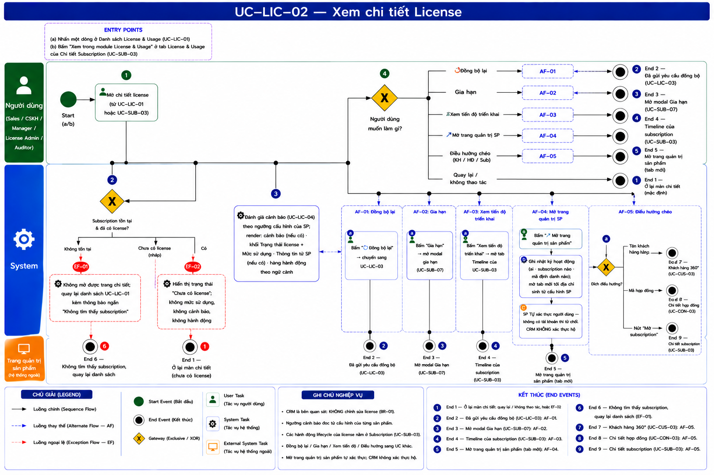
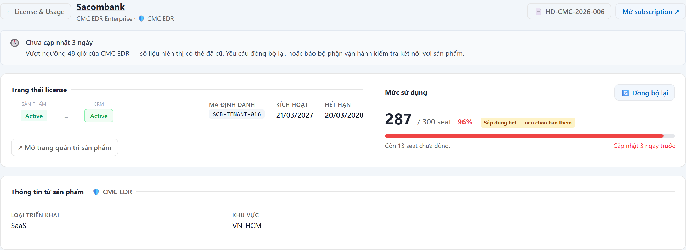
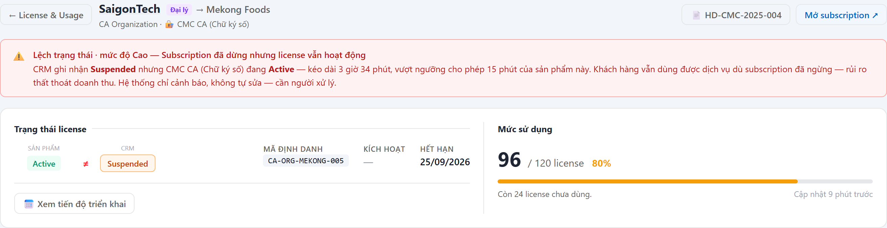
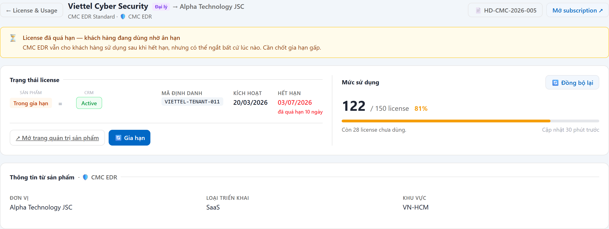
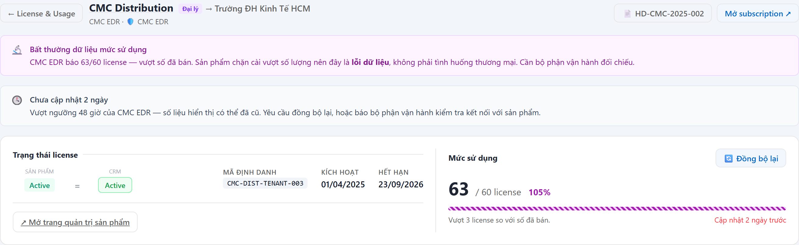
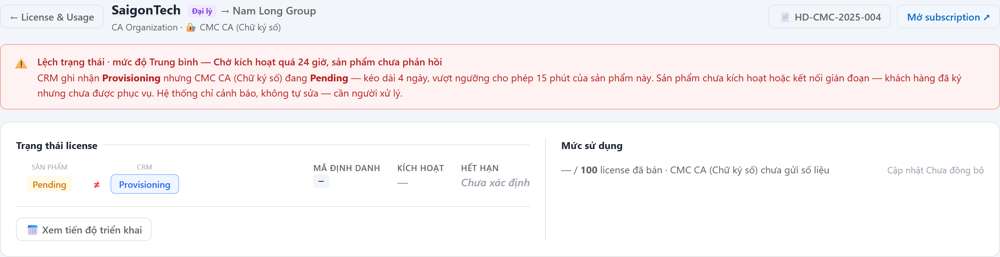
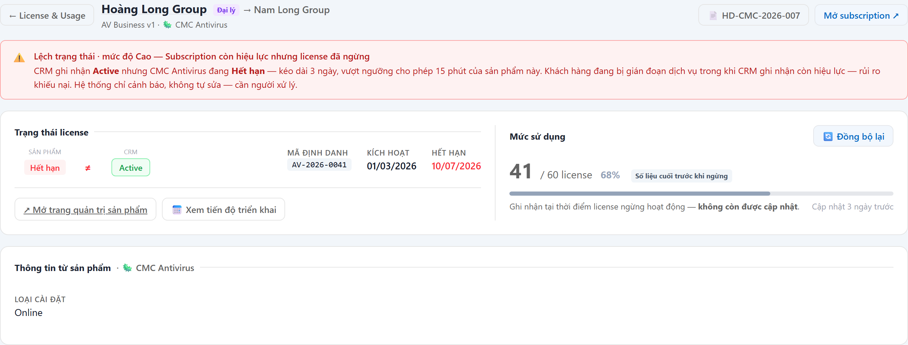
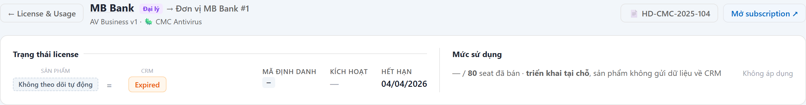

# UC-LIC-02 — Xem chi tiết License

> Module: M-05 License Mirror & Usage Tracking | Phiên bản: 1.0 | Ngày: 13/07/2026
> Trạng thái: Draft for Review

---

## 1. Thông tin chung

| Thuộc tính | Nội dung |
|---|---|
| **Mã Use Case** | UC-LIC-02 |
| **Tên** | Xem chi tiết License |
| **Mô tả** | Xem tình trạng license thật của một subscription tại sản phẩm: trạng thái (so với trạng thái CRM), mức sử dụng, ngày kích hoạt/hết hạn, mã định danh, thông tin bổ sung từ sản phẩm. CRM là bên **quan sát** — màn hình này **không có** thao tác chỉnh sửa license. |
| **Tác nhân** | Sales, CSKH, Manager, License Admin, **Auditor** (chỉ đọc) |
| **Tiền điều kiện** | Đã đăng nhập; có quyền `license:view`; subscription tồn tại và **đã có license mirror**. |
| **Hậu điều kiện** | (Thành công) Hiển thị đầy đủ thông tin license. Chỉ đọc. (Thất bại) 404 nếu subscription không tồn tại. |
| **Trigger** | (1) Nhấn một dòng từ UC-LIC-01. (2) Bấm "Xem trong module License & Usage" từ tab License & Usage của UC-SUB-03. |
| **Liên kết** | UC-LIC-01 (Danh sách), UC-LIC-03 (Đồng bộ lại mức sử dụng), UC-LIC-04 (Phát hiện lệch), UC-SUB-03 (Chi tiết Sub), UC-SUB-07 (Gia hạn), UC-CON-03 (Chi tiết HĐ), UC-CUS-03 (KH 360°) |

### Business Rules

| Mã | Nội dung |
|---|---|
| **BR-01** | **Ranh giới quan sát**: màn hình **không có bất kỳ thao tác nào chỉnh sửa license** (không đổi trạng thái, không set số lượng, không thu hồi). Các hành động vòng đời (Tạm dừng / Thu hồi / Gia hạn) thuộc **subscription**, thực hiện ở UC-SUB-03. |
| **BR-02** | **Component dùng chung**: toàn bộ nội dung (cảnh báo + khối Trạng thái/Mức sử dụng + Thông tin từ sản phẩm + hành động ngữ cảnh) **dùng chung** với tab License & Usage trong UC-SUB-03. Khác biệt duy nhất: màn này có header điều hướng riêng. **Mọi thay đổi mô tả phải sửa tại UC-LIC-02, UC-SUB-03 chỉ trỏ sang.** |
| **BR-03** | **Không lặp dữ liệu**: mỗi thông tin xuất hiện **đúng một lần**. Mã định danh, ngày kích hoạt, ngày hết hạn thuộc nhóm *vòng đời license* (khối Trạng thái) — **không** lặp lại ở section Thông tin từ sản phẩm. |
| **BR-04** | Section **Thông tin từ sản phẩm** chỉ dựng khi sản phẩm **thực sự có metadata riêng** (Loại triển khai, Khu vực, Nền tảng, Loại chứng chỉ...). Không có metadata → **không dựng section rỗng**. |
| **BR-05** | Mức sử dụng là **số liệu hiện tại do sản phẩm gửi về**. Sản phẩm chưa gửi → hiển thị "— / {tổng} {đơn vị} đã bán", **không** vẽ thanh 0% (0% nghĩa là "đã có dữ liệu và bằng 0" — người dùng sẽ hiểu nhầm là license hỏng). |
| **BR-06** | License **đã ngừng** (Hết hạn / Thu hồi): vẫn hiển thị số liệu cuối cùng nhưng **bắt buộc gắn nhãn "Số liệu cuối trước khi ngừng"** và tô xám — không được hiển thị như số đang chạy. |
| **BR-07** | **Cảnh báo chỉ hiện khi có việc phải làm.** License khoẻ mạnh → không có banner nào. |
| **BR-08** | Ngưỡng hiển thị **lấy theo cấu hình của từng sản phẩm** (`PRODUCT_MODULE_CONFIG.runtime_config`) — **không hardcode**. Giá trị hiện hành *(chốt 14/07/2026, đổi được bằng cấu hình)*: chu kỳ cập nhật mức dùng **3 giờ** (→ ngưỡng "chưa cập nhật" = **6 giờ**) · SLA lệch trạng thái **15 phút** · báo gia hạn trước **60 ngày** · "sắp dùng hết" khi **≥ 90%**. |
| **BR-09** | **Khách hàng triển khai tại chỗ (on-premise)**: hiển thị nhãn **"Không theo dõi tự động"**, không có mức sử dụng / thời điểm cập nhật, không có cảnh báo, không có nút Đồng bộ lại. |

---

## 2. Luồng nghiệp vụ

### 2.1 Luồng chính

> Số bước khớp badge trong ảnh BPMN. Bước **2** và **4** là Gateway (XOR).

| Bước | Actor | Hành động / Phản hồi |
|---|---|---|
| **1** | Người dùng | Mở chi tiết license (từ UC-LIC-01 hoặc từ tab License & Usage của UC-SUB-03). |
| **2** | System | **[Gateway — Subscription tồn tại và đã có license?]** Không tồn tại → **EF-01** (**End 6**). Chưa có license (Draft) → **EF-02** (**End 1**). Có → tiếp bước 3. |
| **3** | System | Đọc license mirror; đánh giá cảnh báo (UC-LIC-04) theo ngưỡng cấu hình của sản phẩm; render: (a) cảnh báo — nếu có; (b) khối **Trạng thái license + Mức sử dụng**; (c) **Thông tin từ sản phẩm** — nếu sản phẩm có metadata riêng; (d) hàng **hành động theo ngữ cảnh**. |
| **4** | Người dùng | **[Gateway — Người dùng muốn làm gì?]** → Đồng bộ lại → **AF-01** (**End 2**) · Gia hạn → **AF-02** (**End 3**) · Xem tiến độ triển khai → **AF-03** (**End 4**) · Mở trang quản trị sản phẩm → **AF-04** (**End 5**) · Điều hướng chéo (KH / HĐ / Sub) → **AF-05** (**End 7 / End 8 / End 9**) · Quay lại / không thao tác → **End 1**. |

### 2.2 Luồng phụ

**[AF-01: Đồng bộ lại mức sử dụng]** — kích hoạt tại bước 4, chỉ hiện theo điều kiện §3.6.

| Bước | Actor | Hành động / Phản hồi |
|---|---|---|
| **AF-01a** | Người dùng | Bấm **🔄 Đồng bộ lại** → chuyển sang **UC-LIC-03**. |
| → | — | Kết thúc tại **End 2**. |

**[AF-02: Gia hạn]** — kích hoạt tại bước 4, chỉ hiện khi license còn hiệu lực và sắp/đã quá hạn.

| Bước | Actor | Hành động / Phản hồi |
|---|---|---|
| **AF-02a** | Người dùng | Bấm **Gia hạn** → mở modal gia hạn (**UC-SUB-07**). |
| → | — | Kết thúc tại **End 3**. |

**[AF-03: Xem tiến độ triển khai]** — kích hoạt tại bước 4, chỉ hiện khi license **đang chờ kích hoạt** hoặc **đang lệch trạng thái**.

| Bước | Actor | Hành động / Phản hồi |
|---|---|---|
| **AF-03a** | Người dùng | Bấm **Xem tiến độ triển khai** → mở tab Timeline của **UC-SUB-03**. |
| → | — | Kết thúc tại **End 4**. |

**[AF-04: Mở trang quản trị sản phẩm]** — kích hoạt tại bước 4, chỉ với người có quyền `license:view_portal`.

| Bước | Actor | Hành động / Phản hồi |
|---|---|---|
| **AF-04a** | Người dùng | Bấm **↗ Mở trang quản trị sản phẩm**. |
| **AF-04b** | System | **Ghi nhật ký hoạt động** (ai · subscription nào · mã định danh nào) rồi mở tab mới tới địa chỉ sinh từ cấu hình sản phẩm. |
| **AF-04c** | Trang quản trị sản phẩm | Tự xác thực người dùng. Không có tài khoản → sản phẩm từ chối. **CRM không xác thực hộ.** |
| → | — | Kết thúc tại **End 5**. |

**[AF-05: Điều hướng chéo]** — kích hoạt tại bước 4.

| Bước | Actor | Hành động / Phản hồi |
|---|---|---|
| **AF-05a** | Người dùng | Bấm tên khách hàng → **UC-CUS-03** (**End 7**) · mã hợp đồng → **UC-CON-03** (**End 8**) · **Mở subscription** → **UC-SUB-03** (**End 9**). |

### 2.3 Luồng ngoại lệ

**[EF-01: Subscription không tồn tại]** — kích hoạt tại bước 2.

| Bước | Actor | Hành động / Phản hồi |
|---|---|---|
| **EF-01a** | System | Không mở được trang chi tiết; quay lại danh sách UC-LIC-01 kèm thông báo ngắn "Không tìm thấy subscription". |
| → | — | Kết thúc tại **End 6**. |

**[EF-02: Subscription chưa có license]** — kích hoạt tại bước 2, subscription ở trạng thái Draft / chưa gửi sang sản phẩm.

| Bước | Actor | Hành động / Phản hồi |
|---|---|---|
| **EF-02a** | System | Hiển thị trạng thái **"Chưa có license"**; không có mức sử dụng, không có cảnh báo, không có hành động. *(Nhóm này không nằm trong danh sách UC-LIC-01 — BR-03; chỉ tới được khi truy cập trực tiếp hoặc từ tab License & Usage của UC-SUB-03.)* |
| → | — | **Ở lại màn chi tiết** (**End 1**). |

### 2.4 Điểm kết thúc

| End | Mô tả | Đến từ |
|---|---|---|
| **End 1** | Ở lại màn chi tiết (mặc định; cũng là kết thúc của EF-02 "Chưa có license"). | Bước 4 · EF-02 |
| **End 2** | Đã gửi yêu cầu đồng bộ (UC-LIC-03). | AF-01 |
| **End 3** | Mở modal gia hạn (UC-SUB-07). | AF-02 |
| **End 4** | Chuyển sang Timeline của subscription (UC-SUB-03). | AF-03 |
| **End 5** | Mở trang quản trị sản phẩm (tab mới). | AF-04 |
| **End 6** | Không tìm thấy subscription — quay lại danh sách UC-LIC-01. | EF-01 |
| **End 7** | Điều hướng sang Khách hàng 360° (UC-CUS-03). | AF-05 |
| **End 8** | Điều hướng sang Chi tiết hợp đồng (UC-CON-03). | AF-05 |
| **End 9** | Điều hướng sang Chi tiết subscription (UC-SUB-03). | AF-05 |

---

## 3. Mô tả giao diện

> **Demo HTML:** [docs/demo/v2.6.0_license.html](../../demo/v2.6.0_license.html) — module License & Usage → nhấn một dòng.
> Ảnh dưới đây **chụp trực tiếp từ demo**. Màn này **dùng chung component** với tab License & Usage của UC-SUB-03 (BR-02).

### 3.1 Bố cục 4 tầng (theo tần suất sử dụng)

| Tầng | Thành phần | Điều kiện hiển thị |
|---|---|---|
| **Header** | Nút **← License & Usage** · Tên KH (link → UC-CUS-03) + nhãn **Đại lý** + "→ {đơn vị thụ hưởng}" · dòng phụ "{tên gói} · {icon} {tên sản phẩm}" · nút **📄 {mã hợp đồng}** (→ UC-CON-03) · nút **Mở subscription ↗** (→ UC-SUB-03) | Luôn |
| **Tầng 0** | Cảnh báo | **Chỉ khi có việc phải làm** (BR-07) — xem §3.2 |
| **Tầng 1** | Khối **Trạng thái license** (trái) + **Mức sử dụng** (phải), ngăn nhau bằng đường kẻ dọc | Luôn (trừ 2 trạng thái ở §3.5) |
| **Tầng 2** | **Thông tin từ sản phẩm** | **Chỉ khi sản phẩm có metadata riêng** (BR-04) |

### 3.2 Tầng 0 — Cảnh báo

| # | Điều kiện | Tiêu đề banner | Màu nền |
|---|---|---|---|
| 1 | Lệch trạng thái quá ngưỡng của sản phẩm | "Lệch trạng thái · mức độ {Cao/Trung bình} — {tên vấn đề}" | Đỏ |
| 2 | Vừa gia hạn, đang chờ sản phẩm kích hoạt | "Vừa gia hạn — đang chờ sản phẩm kích hoạt" | Xanh dương |
| 3 | License trong ân hạn | "License đã quá hạn — khách hàng đang dùng nhờ ân hạn" | Vàng |
| 4 | Sản phẩm báo dùng > số đã bán | "Bất thường dữ liệu mức sử dụng" | Tím |
| 5 | Chưa cập nhật quá ngưỡng | "Chưa cập nhật {X}" | Xám |
| 6 | License tạm dừng | "License đang tạm dừng" | Cam |
| 7 | License hết hạn | "License đã hết hạn" | Đỏ |
| 8 | License bị thu hồi | "License đã bị thu hồi" | Đỏ |

**Nội dung bắt buộc của banner lệch trạng thái:** *"CRM ghi nhận **{trạng thái sub}** nhưng {tên sản phẩm} đang **{trạng thái license}** — kéo dài {thời lượng}, vượt ngưỡng cho phép {sla} phút của sản phẩm này. {Hậu quả với khách hàng}. Hệ thống chỉ cảnh báo, không tự sửa — cần người xử lý."*

### 3.3 Tầng 1 — Trạng thái license (cột trái)

| # | Thành phần | Nội dung |
|---|---|---|
| 1 | Cặp trạng thái | Nhãn `SẢN PHẨM` + badge trạng thái license — dấu **=** (xám) / **≠** (đỏ) — nhãn `CRM` + badge trạng thái subscription. *Dấu là kết luận của quy tắc phát hiện lệch, không phải so sánh chuỗi.* |
| 2 | Mã định danh | `external_ref` do sản phẩm sinh (nền xám, chữ đơn cách). Chưa có → "—" |
| 3 | Kích hoạt | Ngày kích hoạt thật từ sản phẩm. Chưa có → "—" |
| 4 | Hết hạn | Ngày hết hạn thật. **Đỏ** + dòng phụ **"còn {n} ngày"** / **"đã quá hạn {n} ngày"** khi trong ngưỡng cảnh báo của sản phẩm. Chưa có → "Chưa xác định" |
| 5 | Hàng hành động | Chỉ hiện nút **đang thực sự cần** — xem §3.6 |

### 3.4 Tầng 1 — Mức sử dụng (cột phải)

| # | Thành phần | Nội dung |
|---|---|---|
| 1 | Tiêu đề + nút | "Mức sử dụng" · nút **🔄 Đồng bộ lại** (UC-LIC-03) đặt **cạnh dữ liệu mà nó làm mới** |
| 2 | Số lớn | "{used} / {total} {đơn vị} · {pct}%" |
| 3 | Nhãn phụ | **"Sắp dùng hết — nên chào bán thêm"** khi ≥ ngưỡng của sản phẩm · **"Số liệu cuối trước khi ngừng"** khi license đã ngừng |
| 4 | Thanh tiến độ | Màu theo % (xanh / cam / đỏ) · **xám** khi license đã ngừng · **gạch chéo tím** khi vượt số đã bán |
| 5 | Dòng chú thích | Trái: "Còn {n} {đơn vị} chưa dùng." / "Vượt {n} {đơn vị} so với số đã bán." / "Ghi nhận tại thời điểm license ngừng hoạt động — không còn được cập nhật." Phải: "Cập nhật {X}" (**đỏ** nếu vượt ngưỡng) |

### 3.5 Bảy trường hợp hiển thị — dev phải làm đủ

**(1) Bình thường** — xem ảnh §3.1: có đủ 4 tầng, không có cảnh báo.

**(2) Lệch trạng thái (mức độ Cao)**

Dấu **≠ đỏ** · banner đỏ ở tầng 0 · nút **📅 Xem tiến độ triển khai** xuất hiện. *(Ảnh: sản phẩm CMC CA khai báo `supports_force_sync = false` và không có link portal → **cả hai nút đều bị ẩn** — đúng BR của UC-LIC-03.)*

**(3) License trong ân hạn**

Badge **Trong gia hạn** · dấu **=** (không phải lệch) · banner vàng · ô **Hết hạn** đỏ kèm "đã quá hạn {n} ngày" · nút **🔄 Gia hạn** xuất hiện.

**(4) Bất thường dữ liệu**

Thanh **gạch chéo tím** · banner tím nêu rõ **là lỗi dữ liệu, không phải tình huống thương mại**.

**(5) Đang chờ sản phẩm kích hoạt**

**KHÔNG** vẽ thanh 0% · mức sử dụng ghi "— / {total} {đơn vị} đã bán · {sản phẩm} chưa gửi số liệu" · nút Đồng bộ lại **disable** (chỉ Active/Tạm dừng mới yêu cầu được).

**(6) License đã ngừng (hết hạn / thu hồi)**

Số liệu **xám** + nhãn **"Số liệu cuối trước khi ngừng"** + câu "không còn được cập nhật".

**(7) Khách hàng triển khai tại chỗ (on-premise)**

Badge phía sản phẩm = nhãn viền đứt **"Không theo dõi tự động"** · mức sử dụng ghi "— / {total} {đơn vị} đã bán · **triển khai tại chỗ**, sản phẩm không gửi dữ liệu về CRM" · cột Cập nhật = **"Không áp dụng"** · **không có** nút Đồng bộ lại · **không có** cảnh báo nào (BR-09).

### 3.6 Hành động theo ngữ cảnh — chỉ hiện việc đang thực sự cần

| # | Nút | Điều kiện hiển thị |
|---|---|---|
| 1 | **🔄 Đồng bộ lại** | Có quyền `license:force_sync` **và** sản phẩm khai báo `supports_force_sync = true` **và** không phải on-premise. Sub không ở Active/Tạm dừng → **disable + tooltip** |
| 2 | **🔄 Gia hạn** | License còn hiệu lực **và** sắp/đã quá hạn (theo ngưỡng sản phẩm) **và** subscription đủ điều kiện gia hạn → mở UC-SUB-07. ⚠️ **Chỉ hiện ở màn này.** Khi component chạy trong tab License & Usage của UC-SUB-03 → **ẩn nút**, vì trang subscription đã có nút Gia hạn ở Hero — một hành động chỉ được xuất hiện một chỗ trên cùng một màn *(chốt 14/07/2026)*. |
| 3 | **📅 Xem tiến độ triển khai** | License đang chờ kích hoạt **hoặc** đang lệch trạng thái → tab Timeline của UC-SUB-03 |
| 4 | **↗ Mở trang quản trị sản phẩm** | Có quyền `license:view_portal` **và** đã có mã định danh **và** sản phẩm khai báo link. Ghi audit khi nhấn |
| 5 | *(không nút nào)* | License khoẻ mạnh, còn xa hạn, dữ liệu mới → **trang sạch** |

### 3.7 Tầng 2 — Thông tin từ sản phẩm

Chỉ dựng khi sản phẩm **thực sự có metadata riêng** (BR-04). Nội dung do Product Module khai báo:

| Sản phẩm | Trường hiển thị |
|---|---|
| CMC EDR | Loại triển khai · Khu vực |
| C-Shield | Nền tảng · Phiên bản SDK |
| CMC Antivirus | Loại cài đặt |
| CMC CA | Loại chứng chỉ · Tổ chức CA |

**Không** lặp lại mã định danh / ngày kích hoạt / ngày hết hạn ở đây — chúng thuộc khối Trạng thái license (BR-03).

---

## 4. Acceptance Criteria

### Nhóm 1: Hiển thị trạng thái

| Mã | Given | When | Then |
|---|---|---|---|
| AC-LIC-02-01 | Sub ACTIVE, license Active. | Mở chi tiết. | Cặp trạng thái hiển thị **SẢN PHẨM `Active` = CRM `Active`**, dấu **=** màu xám. **Không** có banner cảnh báo nào (BR-07). |
| AC-LIC-02-02 | Sub SUSPENDED, license vẫn Active, lệch quá SLA của sản phẩm. | Mở chi tiết. | Dấu **≠ đỏ**; banner "Lệch trạng thái · mức độ Cao" ghi rõ CRM ghi nhận Suspended, sản phẩm đang Active, thời gian kéo dài, **ngưỡng SLA lấy từ cấu hình sản phẩm** và câu "Hệ thống chỉ cảnh báo, không tự sửa". |
| AC-LIC-02-03 | Sub vừa gia hạn, license đang chờ kích hoạt. | Mở chi tiết. | Hiển thị banner "Vừa gia hạn — đang chờ sản phẩm kích hoạt", **không** có banner lệch trạng thái. |
| AC-LIC-02-04 | License trong ân hạn (đã quá hạn 10 ngày, KH vẫn dùng được). | Mở chi tiết. | Banner ân hạn hiển thị; ô "Hết hạn" tô **đỏ** kèm ghi chú **"đã quá hạn 10 ngày"**; nút **Gia hạn** xuất hiện. |

### Nhóm 2: Mức sử dụng

| Mã | Given | When | Then |
|---|---|---|---|
| AC-LIC-02-05 | Sản phẩm báo 287/300 seat. | Mở chi tiết. | Hiển thị "287 / 300 seat · 96%", thanh 96%, nhãn "Sắp dùng hết — nên chào bán thêm", dòng "Còn 13 seat chưa dùng." + "Cập nhật {X}". |
| AC-LIC-02-06 | Sản phẩm **chưa gửi** số liệu, sub đã bán 100 seat. | Mở chi tiết. | Hiển thị "— / 100 seat đã bán · Sản phẩm chưa gửi số liệu". **Không** vẽ thanh 0% (BR-05). |
| AC-LIC-02-07 | License đã hết hạn, số liệu cuối là 486/500. | Mở chi tiết. | Số tô xám + nhãn **"Số liệu cuối trước khi ngừng"** + câu "không còn được cập nhật" (BR-06). |
| AC-LIC-02-08 | Sản phẩm báo 63/60 license. | Mở chi tiết. | Thanh **gạch chéo**; banner "Bất thường dữ liệu mức sử dụng" nêu rõ là **lỗi dữ liệu**, không phải tình huống thương mại. |

### Nhóm 3: Thông tin từ sản phẩm & không trùng lặp

| Mã | Given | When | Then |
|---|---|---|---|
| AC-LIC-02-09 | Sub EDR có metadata: Loại triển khai, Khu vực. | Mở chi tiết. | Section "Thông tin từ sản phẩm · CMC EDR" hiển thị đúng 2 trường. |
| AC-LIC-02-10 | Sub của sản phẩm **không** gửi metadata nào. | Mở chi tiết. | Section "Thông tin từ sản phẩm" **không được dựng** (BR-04). |
| AC-LIC-02-11 | Bất kỳ license nào. | Mở chi tiết, rà toàn màn. | **Mã định danh**, **Ngày kích hoạt**, **Ngày hết hạn**, **thời điểm cập nhật** mỗi thứ xuất hiện **đúng 1 lần** (BR-03). |

### Nhóm 4: Hành động & điều hướng

| Mã | Given | When | Then |
|---|---|---|---|
| AC-LIC-02-12 | License khoẻ mạnh, còn xa hạn, dữ liệu mới. | Mở chi tiết. | **Không** hiện nút Gia hạn, không hiện Xem tiến độ. |
| AC-LIC-02-13 | License đang chờ kích hoạt. | Mở chi tiết. | Hiện nút **📅 Xem tiến độ triển khai**; bấm → mở tab Timeline của subscription (**End 4**). |
| AC-LIC-02-14 | Manager/License Admin, sản phẩm có khai báo link portal, license đã có mã định danh. | Bấm **↗ Mở trang quản trị sản phẩm**. | **Ghi audit** (actor + subscription + mã định danh) rồi mở tab mới (**End 5**). |
| AC-LIC-02-15 | Sales (không có quyền xem link portal). | Mở chi tiết. | Nút portal **không hiển thị**. |
| AC-LIC-02-16 | License đang chờ kích hoạt (**chưa có mã định danh**), người dùng có quyền. | Mở chi tiết. | Nút portal **không hiển thị** — chưa có gì để trỏ tới. |
| AC-LIC-02-17 | Bất kỳ. | Bấm tên khách hàng / mã hợp đồng / "Mở subscription". | Điều hướng đúng sang UC-CUS-03 / UC-CON-03 / UC-SUB-03. |
| AC-LIC-02-18 | Bất kỳ vai trò nào. | Rà toàn màn hình. | **Không có** bất kỳ thao tác nào chỉnh sửa license (đổi trạng thái, set số lượng, thu hồi) — BR-01. |

---

## 5. Review Checklist

### Lịch sử thay đổi

| Phiên bản | Ngày | Tác giả | Mô tả |
|---|---|---|---|
| 1.0 | 13/07/2026 | Claude (AI) | Khởi tạo — base theo demo `v2.6.0_license.html`. Trace: PRD v2.6 §6.5.2 FR-LIC-01 (xem chi tiết mirror), BR-01.4 (deep-link portal). **Là nguồn mô tả duy nhất** cho component hiển thị license — UC-SUB-03 §3.5 trỏ sang đây (BR-02). |

### Nghiệp vụ
- ✅ Không có thao tác sửa license — giữ đúng vai quan sát (BR-01)
- ✅ Ngưỡng (SLA, cập nhật, sắp hết hạn, sắp dùng hết) đều theo cấu hình sản phẩm (BR-08)
- ✅ Ân hạn ≠ lệch trạng thái; sub vừa gia hạn chờ kích hoạt ≠ lệch trạng thái
- ✅ `used > total` là lỗi dữ liệu, không phải overage thương mại

### Giao diện
- ✅ Không trùng lặp trường nào trong màn (BR-03) và với UC-SUB-03 tab Thông tin
- ✅ Không dựng section rỗng (BR-04)
- ✅ Cảnh báo chỉ hiện khi có việc (BR-07)
- ✅ Nút đặt cạnh dữ liệu nó tác động; hành động theo ngữ cảnh

### Phạm vi
- ⏸️ **License đã phát hành (LICENSE_INSTANCE)** — hoãn sang phase sau. Cần chốt trước: CRM mirror **toàn bộ** instance (→ phân trang trong CRM, đúng FR-LIC-05 BR-05.3) hay chỉ tra cứu tại trang quản trị sản phẩm (→ phải sửa BR-05.3). Phase 1: EDR có `has_instances = false` → không có dữ liệu.

---

## Footer

| Mục | Nội dung |
|---|---|
| **Figma** | Chưa có — **demo HTML là chuẩn giao diện**: [docs/demo/v2.6.0_license.html](../../demo/v2.6.0_license.html) |
| **API contract** | Chưa có — cần dev bổ sung khi thiết kế API |
| **UC liên quan** | UC-LIC-01 (Danh sách License & Usage), UC-LIC-03 (Đồng bộ lại mức sử dụng), UC-LIC-04 (Phát hiện & cảnh báo sự cố license), UC-SUB-03 (Chi tiết Subscription), UC-SUB-07 (Gia hạn Subscription), UC-CON-03 (Chi tiết Hợp đồng), UC-CUS-03 (Khách hàng 360°) |
| **Trace PRD** | OneCRM_PRD_v2.6.md §6.5 (M-05 License Mirror & Usage Tracking) |

