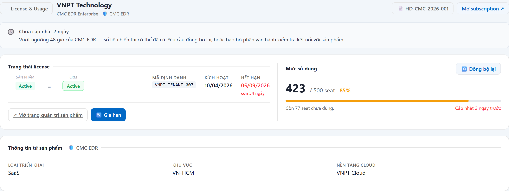
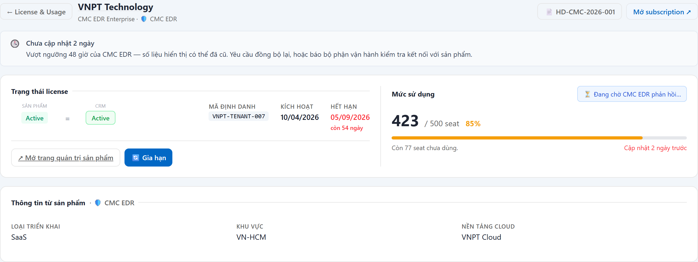
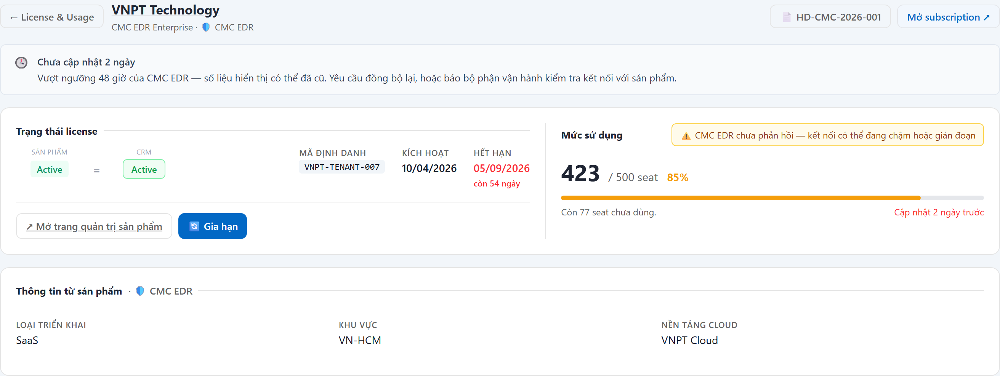

# UC-LIC-03 — Đồng bộ lại mức sử dụng

> Module: M-05 License Mirror & Usage Tracking | Phiên bản: 1.0 | Ngày: 13/07/2026
> Trạng thái: Draft for Review

---

## 1. Thông tin chung

| Thuộc tính | Nội dung |
|---|---|
| **Mã Use Case** | UC-LIC-03 |
| **Tên** | Đồng bộ lại mức sử dụng |
| **Mô tả** | Người dùng yêu cầu sản phẩm **gửi lại** số liệu mức sử dụng mới nhất. CRM **xin dữ liệu**, không ra lệnh kỹ thuật. Dùng khi đang nói chuyện với khách và cần con số mới, hoặc khi phát hiện license lâu chưa cập nhật. |
| **Tác nhân** | Sales, CSKH, Manager, License Admin (theo quyền `license:force_sync`) |
| **Tiền điều kiện** | Có quyền `license:force_sync`; sản phẩm **hỗ trợ** gửi lại số liệu theo yêu cầu; subscription đang **Active hoặc Tạm dừng**. |
| **Hậu điều kiện** | (Thành công) Yêu cầu được ghi nhận (**HTTP 202**), gửi sang sản phẩm; số liệu **chỉ cập nhật khi sản phẩm gửi về**. (Thất bại) Không phát sinh yêu cầu nào. |
| **Trigger** | Bấm **🔄 Đồng bộ lại** ở UC-LIC-02 hoặc tab License & Usage của UC-SUB-03. |
| **Liên kết** | UC-LIC-02, UC-SUB-03, PRD v2.6 §6.5.5 FR-LIC-04 |

### Business Rules

| Mã | Nội dung | Trace PRD |
|---|---|---|
| **BR-01** | Chỉ áp dụng cho subscription **Active** hoặc **Tạm dừng**. Trạng thái khác → từ chối **400**. **Vẫn cho phép khi license đã ngừng** (Hết hạn / Thu hồi) — đúng lúc lệch trạng thái là lúc cần hỏi lại sản phẩm để xác minh *(chốt 13/07/2026)*. | BR-04.1 |
| **BR-02** | **Giới hạn theo subscription**: tối đa **1 lần / subscription / 5 phút**. Vượt → **429**. | BR-04.4 |
| **BR-03** | **KHÔNG giới hạn số lượt theo người dùng.** *Lý do (chốt 13/07/2026): sau sự cố kết nối, vận hành cần đồng bộ lại nhiều license cùng lúc để lấy trạng thái mới nhất — chặn theo người dùng sẽ cản đúng lúc cần nhất. Bảo vệ tải là việc của sản phẩm (backpressure).* | Chốt mới |
| **BR-04** | Quyền bấm gán theo **** (cấu hình vận hành, không hardcode theo vai trò). Mặc định: Sales, CSKH, Manager, License Admin. **Auditor KHÔNG có** — hành động này để lại dấu vết trong hệ thống mà auditor đang kiểm toán. Gọi API khi không có quyền → **403**. | BR-04.6 |
| **BR-05** | Sản phẩm khai báo **không hỗ trợ** gửi lại số liệu theo yêu cầu → **ẩn hẳn nút**, không phát sinh yêu cầu. Gọi thẳng API → **400 NOT_SUPPORTED**. | BR-04.8 |
| **BR-06** | **Không cam kết thời gian phản hồi.** Giao diện phải nói rõ đang chờ sản phẩm. | BR-04.5 |
| **BR-07** | Ghi **nhật ký hoạt động** (ai, subscription nào, lúc nào) và **một dòng tiến độ** trong Timeline của subscription. | BR-04.2 |
| **BR-08** | Số liệu mức sử dụng **chỉ đổi khi sản phẩm gửi về** — CRM **không** tự sửa số. | YT-1 |

---

## 2. Luồng nghiệp vụ

### 2.1 Luồng chính

| Bước | Actor | Hành động / Phản hồi |
|---|---|---|
| **1** | Người dùng | Bấm **🔄 Đồng bộ lại** (cạnh khối Mức sử dụng). |
| **2** | System | Kiểm tra: quyền (BR-04) → sản phẩm có hỗ trợ (BR-05) → trạng thái sub (BR-01) → giới hạn theo sub (BR-02) → hạn mức theo người dùng (BR-03). |
| **3** | System | Ghi nhận yêu cầu (**202**), gửi sang sản phẩm; ghi nhật ký + một dòng tiến độ vào Timeline (BR-07). |
| **4** | System | Hiển thị thông báo *"Đã gửi yêu cầu đồng bộ — đang chờ {sản phẩm} gửi lại số liệu. Thời gian phản hồi không cam kết."* |
| **5** | System | Nút đổi thành chỉ báo tại chỗ **"⏳ Đang chờ {sản phẩm} phản hồi…"** (không chỉ thông báo ngắn — thông báo ngắn biến mất, người dùng tưởng nút hỏng). |
| **6** | Sản phẩm | Gửi lại số liệu mức sử dụng. |
| **7** | System | Cập nhật mức sử dụng + thời điểm cập nhật; chỉ báo chờ biến mất. Kết thúc tại **End 1**. |

### 2.2 Luồng phụ

**[AF-01: Sản phẩm không phản hồi]** — sau bước 5.

| Bước | Actor | Hành động / Phản hồi |
|---|---|---|
| **5a** | System | Quá ngưỡng chờ mà chưa nhận được số liệu → đổi chỉ báo thành **"⚠️ {Sản phẩm} chưa phản hồi — kết nối có thể đang chậm hoặc gián đoạn"**. |
| → | — | Số liệu **giữ nguyên** (BR-08). Kết thúc tại **End 2**. |

### 2.3 Luồng ngoại lệ

| Mã | Điều kiện | Xử lý |
|---|---|---|
| **EF-01** | Không có quyền | **403**; giao diện **không render nút**. |
| **EF-02** | Sản phẩm không hỗ trợ | Nút **ẩn hẳn**; gọi API → **400 NOT_SUPPORTED**, không sinh yêu cầu nào. |
| **EF-03** | Sub không ở trạng thái Active/Tạm dừng | Nút **disable** kèm tooltip giải thích; gọi API → **400**. |
| **EF-04** | Vượt giới hạn 1 lần/5 phút cho cùng subscription | **429 RATE_LIMITED** + thông báo còn bao nhiêu phút nữa được thử lại. |
| **EF-05** | Vượt hạn mức 20 lượt/giờ/người | **429 QUOTA_EXCEEDED** + thông báo hạn mức. |

> **Nguyên tắc hiển thị:** *sản phẩm không hỗ trợ* → **ẩn nút** (tính năng không tồn tại); *các lý do khác* → **disable + tooltip** (tính năng có, nhưng lúc này chưa dùng được) — ẩn im lặng khiến người dùng tưởng tính năng biến mất.

### 2.4 Điểm kết thúc

| End | Mô tả |
|---|---|
| **End 1** | Sản phẩm đã gửi lại số liệu — mức sử dụng cập nhật. |
| **End 2** | Đã gửi yêu cầu nhưng sản phẩm chưa phản hồi — giao diện báo rõ. |
| **End 3** | Từ chối (403 / 400 / 429) — không phát sinh yêu cầu. |

---

## 3. Mô tả giao diện

> **Demo HTML:** [docs/demo/v2.6.0_license.html](../../demo/v2.6.0_license.html)

Nút **🔄 Đồng bộ lại** đặt **cạnh tiêu đề "Mức sử dụng"** — tức cạnh chính dữ liệu mà nó làm mới. Nhu cầu bấm nút sinh ra đúng lúc người dùng nhìn thấy số liệu cũ.

### 3.1 Trước khi nhấn

Banner xám "Chưa cập nhật {X}" + dòng "Cập nhật {X}" tô **đỏ** (đã vượt ngưỡng của sản phẩm).

### 3.2 Sau khi nhấn — đang chờ

| # | Thành phần | Nội dung |
|---|---|---|
| 1 | Thông báo ngắn | *"Đã gửi yêu cầu đồng bộ (202) — {mã sub} · đang chờ {sản phẩm} gửi lại usage. Thời gian phản hồi không cam kết."* |
| 2 | Nút | Đổi thành chỉ báo tại chỗ **"⏳ Đang chờ {sản phẩm} phản hồi…"** (nền xanh nhạt) |
| 3 | Số liệu | **Giữ nguyên** — chỉ đổi khi sản phẩm gửi về (BR-08) |
| 4 | Timeline + nhật ký | Ghi 1 dòng tiến độ + 1 dòng nhật ký (BR-07) |

### 3.3 Sản phẩm không phản hồi

Quá ngưỡng chờ → chỉ báo đổi thành **"⚠️ {Sản phẩm} chưa phản hồi — kết nối có thể đang chậm hoặc gián đoạn"** (nền vàng). Số liệu **giữ nguyên**.

> **Vì sao không để im lặng:** PRD quy định *không cam kết thời gian phản hồi* (BR-06). Nhưng nếu giao diện im lặng vĩnh viễn, người dùng sẽ tưởng nút hỏng và bấm lại — rồi ăn lỗi giới hạn tần suất.

### 3.4 Bốn trạng thái của nút

| # | Trạng thái | Hiển thị | Điều kiện |
|---|---|---|---|
| 1 | Bình thường | **🔄 Đồng bộ lại** | Đủ quyền · sản phẩm hỗ trợ · sub Active/Tạm dừng |
| 2 | **Disable + tooltip** | Nút xám, di chuột hiện lý do | Sub không ở Active/Tạm dừng (vd Draft, Chờ kích hoạt) |
| 3 | **Ẩn hoàn toàn** | Không render nút | Không có quyền `license:force_sync` · **hoặc** sản phẩm khai báo `supports_force_sync = false` · **hoặc** khách hàng triển khai tại chỗ |
| 4 | Đang chờ / chưa phản hồi | Xem §3.2, §3.3 | Vừa nhấn |

> **Nguyên tắc ẩn vs disable:** *sản phẩm không hỗ trợ* → **ẩn** (tính năng không tồn tại với sản phẩm này); *các lý do khác* → **disable + tooltip** (tính năng có, lúc này chưa dùng được). Ẩn im lặng khiến người dùng tưởng tính năng biến mất.

---

## 4. Acceptance Criteria

| Mã | Given | When | Then |
|---|---|---|---|
| AC-LIC-03-01 | Sales, sub **Active**, sản phẩm hỗ trợ. | Bấm Đồng bộ lại. | **202**; thông báo "đã gửi yêu cầu… không cam kết thời gian"; nút đổi thành **⏳ Đang chờ … phản hồi**; ghi nhật ký + 1 dòng Timeline (BR-07). |
| AC-LIC-03-02 | Sub ở trạng thái **Draft / Chờ kích hoạt**. | Mở màn. | Nút **disable** kèm tooltip; gọi API → **400** (BR-01). |
| AC-LIC-03-03 | Vừa đồng bộ subscription X cách đây 2 phút. | Bấm Đồng bộ lại **cùng** subscription X. | **429 RATE_LIMITED**; thông báo còn ~3 phút nữa mới được thử lại (BR-02). |
| AC-LIC-03-04 | Người dùng đã đồng bộ 30 subscription khác nhau trong 1 giờ. | Bấm Đồng bộ lại trên subscription thứ 31. | **Cho phép** — không có hạn mức theo người dùng (BR-03). |
| AC-LIC-03-05 | **Auditor** đăng nhập. | Mở màn chi tiết license. | Nút **không hiển thị**; gọi thẳng API → **403** (BR-04). |
| AC-LIC-03-06 | Sản phẩm khai báo **không hỗ trợ** gửi lại số liệu (vd CMC CA). | Mở màn chi tiết license. | Nút **ẩn hẳn**; gọi API → **400 NOT_SUPPORTED**; **không** phát sinh yêu cầu nào (BR-05). |
| AC-LIC-03-07 | Đã gửi yêu cầu, sản phẩm chưa phản hồi sau ngưỡng chờ. | Quan sát màn hình. | Chỉ báo đổi thành **"⚠️ … chưa phản hồi — kết nối có thể đang chậm hoặc gián đoạn"**; số liệu **giữ nguyên** (BR-08). |
| AC-LIC-03-08 | Sản phẩm gửi lại số liệu mới. | — | Mức sử dụng và "Cập nhật lần cuối" đổi theo; chỉ báo chờ biến mất. |

---

## 5. Review Checklist

### Lịch sử thay đổi

| Phiên bản | Ngày | Tác giả | Mô tả |
|---|---|---|---|
| 1.0 | 13/07/2026 | Claude (AI) | Khởi tạo — base theo demo `v2.6.0_license.html`. Trace PRD v2.6 §6.5.5 FR-LIC-04 (BR-04.1…04.8, AC-04.1…04.7). |

### Nghiệp vụ
- ✅ Là **xin dữ liệu**, không phải ra lệnh kỹ thuật — không vi phạm ranh giới quan sát
- ✅ Chỉ chặn theo subscription (5 phút/sub) — **không** chặn theo người dùng, để vận hành đồng bộ lại hàng loạt sau sự cố
- ✅ Auditor bị loại — không để lại dấu vết trong hệ thống mình kiểm toán
- ✅ Sản phẩm không hỗ trợ → ẩn nút, không publish yêu cầu vô ích
- ✅ Không cam kết thời gian, nhưng **không im lặng vĩnh viễn** — quá ngưỡng thì UI thú nhận

---

## Footer

| Mục | Nội dung |
|---|---|
| **Figma** | Chưa có — **demo HTML là chuẩn giao diện**: [docs/demo/v2.6.0_license.html](../../demo/v2.6.0_license.html) |
| **API contract** | Chưa có — cần dev bổ sung khi thiết kế API |
| **UC liên quan** | UC-LIC-01 (Danh sách License & Usage), UC-LIC-02 (Xem chi tiết License), UC-SUB-03 (Chi tiết Subscription) |
| **Trace PRD** | OneCRM_PRD_v2.6.md §6.5 (M-05 License Mirror & Usage Tracking) |

