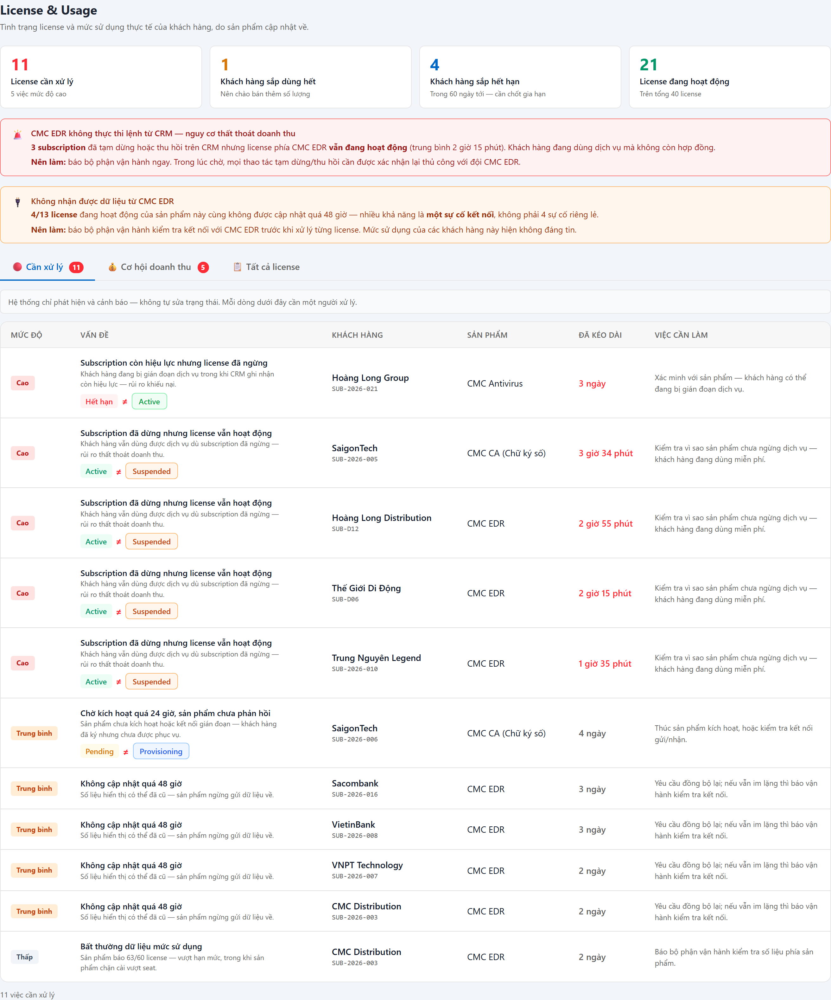

# UC-LIC-04 — Phát hiện & cảnh báo sự cố license

> Module: M-05 License Mirror & Usage Tracking | Phiên bản: 1.0 | Ngày: 13/07/2026
> Trạng thái: Draft for Review

---

## 1. Thông tin chung

| Thuộc tính | Nội dung |
|---|---|
| **Mã Use Case** | UC-LIC-04 |
| **Tên** | Phát hiện & cảnh báo sự cố license |
| **Mô tả** | Hệ thống tự quét định kỳ, phát hiện **3 loại sự cố** ở cấp từng license và **2 sự cố diện rộng** ở cấp sản phẩm; chấm mức độ theo hậu quả và đưa vào hàng đợi "Cần xử lý" (UC-LIC-01). **Hệ thống chỉ cảnh báo, không tự sửa trạng thái.** |
| **Tác nhân** | System (quét định kỳ) · License Admin, Manager (xem & xử lý) |
| **Tiền điều kiện** | Có license mirror; sản phẩm đã khai báo cấu hình ngưỡng. |
| **Hậu điều kiện** | (Thành công) Sự cố xuất hiện trong hàng đợi + banner diện rộng nếu đủ điều kiện. **Không thay đổi trạng thái license hay subscription.** |
| **Trigger** | Cron quét định kỳ; và mỗi lần render màn License & Usage. |
| **Liên kết** | UC-LIC-01 (hiển thị hàng đợi), UC-LIC-02 (cảnh báo trong chi tiết), UC-LIC-03 (xử lý số liệu cũ), PRD v2.6 §6.5.8 FR-LIC-07 |

### Business Rules — điều kiện vào hàng đợi

Một license vào **"Cần xử lý"** khi có **ít nhất một** trong 3 dấu hiệu:

| Mã | Dấu hiệu | Định nghĩa | Trace |
|---|---|---|---|
| **BR-01** | **Lệch trạng thái** | Trạng thái trên CRM ≠ thực tế tại sản phẩm, kéo dài quá **`mismatch_sla_minutes`** (chốt: **15 phút** cho mọi sản phẩm). 3 kiểu: **(A)** Subscription đã dừng nhưng license vẫn hoạt động · **(B)** Subscription còn hiệu lực nhưng license đã ngừng · **(C)** Chờ kích hoạt quá `auto_reconcile_after_hours` mà sản phẩm chưa phản hồi. | FR-LIC-07 |
| **BR-01b** | **Kiểu (C) chỉ kiểm tra khi sản phẩm CÓ KHAI BÁO `auto_reconcile_after_hours`.** Sản phẩm chưa có số liệu thật để trống → **không kiểm tra**. *Lý do (chốt 13/07/2026): EDR triển khai kéo dài **1–2 tháng là bình thường**; áp ngưỡng cứng sẽ gắn cờ **mọi** subscription EDR mới → dashboard vô dụng ngay ngày đầu.* | Chốt mới |
| **BR-02** | **Chưa cập nhật** | License còn hiệu lực nhưng sản phẩm không gửi số liệu mức dùng quá ngưỡng = **2 × chu kỳ đẩy đã khai báo của sản phẩm**. Chốt 13/07/2026: chu kỳ đẩy **24 giờ** cho mọi sản phẩm → **ngưỡng 48 giờ**. *Công thức "2 ×" thay cho số cứng, để sản phẩm nào đẩy dày hơn thì được phát hiện sớm hơn — không phải sửa lõi.* | FR-LIC-06 / US-07 |
| **BR-03** | **Bất thường dữ liệu** | Sản phẩm báo số dùng **> số đã bán** — không thể xảy ra vì sản phẩm chặn cài vượt số lượng. | BR-03.6 |

**Cố ý KHÔNG đưa vào hàng đợi** (cảnh báo sai làm người dùng mù cảnh báo):

| Mã | Trường hợp | Lý do |
|---|---|---|
| **BR-04** | License **trong ân hạn** (đã quá hạn nhưng KH vẫn dùng được), subscription vẫn còn hiệu lực | Trạng thái **hợp lệ theo thiết kế**, không phải sự cố |
| **BR-05** | Subscription **vừa gia hạn**, license đang chờ sản phẩm kích hoạt | Khoảng chờ bình thường — nếu cảnh báo thì **mỗi lần gia hạn đẻ một báo động giả** |
| **BR-06** | Subscription đã bàn giao cho bản gia hạn kế tiếp | Không còn là đối tượng theo dõi |
| **BR-07** | Chờ kích hoạt **trong** ngưỡng cho phép | Chưa có gì sai |
| **BR-08** | Mức dùng cao (sắp dùng hết) | Đây là **cơ hội**, không phải sự cố → thuộc view Cơ hội doanh thu (UC-LIC-01) |
| **BR-08b** | **Khách hàng triển khai tại chỗ (on-premise)** | Không có kênh cập nhật tự động → CRM **không quan sát được**, nên **không được kết luận** là lệch hay chưa cập nhật. Vẫn hiện trong danh sách với nhãn "Không theo dõi tự động" (UC-LIC-01 BR-08). |

### Business Rules — chấm mức độ

**Nguyên tắc:** chấm theo **hậu quả nếu để yên**, không theo độ lạ về kỹ thuật. Ba câu hỏi, trả lời được bằng **đúng những trường CRM đang có** (`subscription.status`, `license_mirror.status`, `usage_snapshot`, `last_synced_at`) — không cần dữ liệu nào mới:

| Câu hỏi | Trả lời được từ | Nếu ĐÚNG → |
|---|---|---|
| **1. Có ai đang chịu thiệt hại tài chính hoặc mất dịch vụ *ngay lúc này* không?** | So `subscription.status` với `license_mirror.status` | **Cao** |
| **2. Nếu không — có rủi ro đang tích tụ, hoặc ta đang ra quyết định trên số liệu không đáng tin không?** | `last_synced_at` · trạng thái chờ kích hoạt | **Trung bình** |
| **3. Nếu không — chỉ là dữ liệu nội bộ sai, khách hàng không bị ảnh hưởng?** | `usage_snapshot` so với số đã bán | **Thấp** |

**Bảng quyết định (đầy đủ, không có vùng xám):**

| Mã | Dấu hiệu | Điều kiện dữ liệu (CRM có sẵn) | Ai chịu thiệt | Mức độ |
|---|---|---|---|---|
| **BR-09** | Lệch kiểu **A** | `subscription.status ∈ {Tạm dừng, Thu hồi}` **và** `license_mirror.status ∈ {Đang hoạt động, Ân hạn}` quá SLA | **Công ty** — KH dùng dịch vụ mà không còn hợp đồng → **thất thoát doanh thu ngay** | **Cao** |
| **BR-10** | Lệch kiểu **B** | `subscription.status = Đang hiệu lực` **và** `license_mirror.status ∈ {Tạm dừng, Hết hạn, Thu hồi}` quá SLA | **Khách hàng** — đang **mất dịch vụ** dù đã trả tiền → mất uy tín, nguy cơ huỷ hợp đồng | **Cao** *(chốt 13/07/2026: ngang kiểu A — mất khách đắt ngang mất tiền)* |
| **BR-11** | Lệch kiểu **C** | `subscription.status = Chờ kích hoạt` **và** không có phản hồi nào quá `auto_reconcile_after_hours` **và** sản phẩm **có khai báo** ngưỡng (BR-01b) | **Khách hàng** — đã ký, chưa được phục vụ. *Chưa mất dịch vụ đang dùng, nên chưa phải mức Cao.* | **Trung bình** |
| **BR-12** | **Chưa cập nhật** | `license_mirror.status ∈ {Đang hoạt động, Ân hạn}` **và** `now − last_synced_at > 2 × chu kỳ đẩy` | **Chưa ai** — nhưng mọi quyết định (chào bán thêm, báo số cho KH) đang dựa trên số liệu **không đáng tin** | **Trung bình** |
| **BR-13** | **Bất thường dữ liệu** | `usage_snapshot.used > số đã bán` | **Không ai** — sản phẩm đã chặn cài vượt số lượng, nên đây thuần là lỗi dữ liệu | **Thấp** |

> **Kiểm tra tính khả thi:** cả 5 dòng trên chỉ dùng 4 trường CRM đã lưu. Không có tiêu chí nào cần dữ liệu runtime của sản phẩm hay phán đoán chủ quan — **hai người chấm độc lập phải ra cùng kết quả**.

> **Kiểm tra tính hữu dụng:** mức độ trả lời đúng câu hỏi vận hành *"xử lý cái nào trước?"* — **Cao** = có người đang chịu thiệt ngay bây giờ; **Trung bình** = chưa thiệt nhưng đang mù thông tin; **Thấp** = dọn dữ liệu, làm lúc rảnh.

### Business Rules — sự cố diện rộng (banner)

Khi nhiều license **cùng một sản phẩm** cùng hỏng theo **cùng một kiểu**, đó gần như chắc chắn là **một** nguyên nhân chung ở tầng kết nối, **không phải N sự cố lẻ**. Banner tồn tại để **đổi hành động**: từ "xử lý 7 dòng" sang "gọi một cuộc điện thoại".

| Mã | Banner | Điều kiện | Nội dung |
|---|---|---|---|
| **BR-14** | **Lệnh không được thực thi** *(ưu tiên hiển thị trên cùng)* | ≥ 3 subscription cùng sản phẩm bị **lệch kiểu A** (đã dừng trên CRM nhưng license vẫn chạy) | "Sản phẩm không thực thi lệnh từ CRM — nguy cơ thất thoát doanh thu". Nêu số lượng + thời gian trung bình + hướng dẫn: **báo vận hành ngay**, trong lúc chờ phải xác nhận thủ công mọi thao tác tạm dừng/thu hồi. |
| **BR-15** | **Không nhận được dữ liệu** | **Ngưỡng kép**: ≥ 3 license **và** ≥ 30% số license đang hoạt động của sản phẩm đó cùng chưa cập nhật quá ngưỡng (BR-02) | "Không nhận được dữ liệu từ {sản phẩm}" — nêu **{n}/{tổng} license**, nói rõ *"nhiều khả năng là **một sự cố kết nối**, không phải {n} sự cố riêng lẻ"* + báo vận hành **trước khi** xử lý từng license; số liệu của nhóm này **không đáng tin**. |
| **BR-16** | **Vì sao phải có ĐỦ CẢ HAI ngưỡng** | — | Hai ngưỡng canh **hai đầu ngược nhau**: · **Tỷ lệ (≥ 30%)** chặn đầu **sản phẩm lớn** — 3/200 license hỏng là chuyện thường, không phải sự cố diện rộng. · **Số tuyệt đối (≥ 3)** chặn đầu **sản phẩm nhỏ** — 1/1 hoặc 1/2 license hỏng vẫn cho tỷ lệ 100%/50%, nhưng **banner không gộp được gì** (chỉ có 1 dòng), chỉ gây hoảng. Banner tồn tại để **thay thế nhiều dòng bằng một hành động**; dưới 3 dòng thì hàng đợi là đủ. |
| **BR-17** | **Không tự sửa** | — | Banner và hàng đợi **chỉ cảnh báo**. Hệ thống không tự đổi trạng thái, không gọi sang sản phẩm. |
| **BR-18** | **Tự tắt** | — | Banner biến mất khi tỷ lệ về dưới ngưỡng — phản ánh **hiện trạng**, không phải lịch sử. Không có nút "đã đọc". |
| **BR-19** | **Không lặp** | — | Một banner cho một sản phẩm cho một loại sự cố. |
| **BR-20** | **Loại trừ** | — | Khách hàng **triển khai tại chỗ (on-premise)** và sản phẩm **đang bảo trì theo kế hoạch** không tính vào cảnh báo diện rộng. |

---

## 2. Luồng nghiệp vụ

### 2.1 Luồng chính (System)

| Bước | Actor | Hành động / Phản hồi |
|---|---|---|
| **1** | System | Quét định kỳ toàn bộ license mirror. |
| **2** | System | Với mỗi license: đối chiếu BR-01/02/03, áp dụng loại trừ BR-04…BR-08. |
| **3** | System | Chấm mức độ theo bảng quyết định BR-09…BR-13. |
| **4** | System | Gom theo sản phẩm, đánh giá sự cố diện rộng theo BR-14/15/16 + loại trừ BR-20. |
| **5** | System | Đẩy vào hàng đợi "Cần xử lý" và banner (UC-LIC-01); ghi cảnh báo cho vận hành. **Không thay đổi trạng thái nào** (BR-17). |

### 2.2 Luồng người dùng

| Bước | Actor | Hành động / Phản hồi |
|---|---|---|
| **6** | License Admin | Mở view **Cần xử lý**, đọc cột **Việc cần làm**. |
| **7** | License Admin | Nhấn dòng → mở **UC-LIC-02** để xem chi tiết; hoặc bấm **Xem tiến độ triển khai**; hoặc **Đồng bộ lại** (UC-LIC-03) với sự cố "chưa cập nhật". |
| **8** | License Admin | Xử lý ngoài hệ thống (liên hệ đội sản phẩm / vận hành). |
| → | — | Sự cố **tự biến mất** khỏi hàng đợi khi dữ liệu về đúng (BR-18). |

---

## 3. Mô tả giao diện

> Hàng đợi và banner hiển thị tại **UC-LIC-01**; cảnh báo cấp từng license hiển thị tại **UC-LIC-02**.

**Thứ tự banner (cố định):** *Lệnh không được thực thi* (nền đỏ, thất thoát doanh thu) → *Không nhận được dữ liệu* (nền cam). Mỗi banner gồm 3 phần: **tiêu đề** · **số liệu + kết luận** ("nhiều khả năng là **một sự cố kết nối**, không phải {n} sự cố riêng lẻ") · **Nên làm** (báo vận hành trước khi xử lý từng dòng).

### 3.1 Cột "Việc cần làm" — nội dung theo loại sự cố

| Loại sự cố | Việc cần làm |
|---|---|
| Lệch kiểu **A** | "Kiểm tra vì sao sản phẩm chưa ngừng dịch vụ — khách hàng đang dùng miễn phí." |
| Lệch kiểu **B** | "Xác minh với sản phẩm — khách hàng có thể đang bị gián đoạn dịch vụ." |
| Lệch kiểu **C** | "Thúc sản phẩm kích hoạt, hoặc kiểm tra kết nối gửi/nhận." |
| Chưa cập nhật | "Yêu cầu đồng bộ lại; nếu vẫn im lặng thì báo vận hành kiểm tra kết nối." |
| Bất thường dữ liệu | "Báo bộ phận vận hành kiểm tra số liệu phía sản phẩm." |

---

## 4. Acceptance Criteria

### Nhóm 1: Điều kiện vào hàng đợi

| Mã | Given | When | Then |
|---|---|---|---|
| AC-LIC-04-01 | Sub **Tạm dừng** nhưng license vẫn **Active**, kéo dài quá SLA của sản phẩm. | Hệ thống quét. | Vào hàng đợi, mức độ **Cao**, kèm việc cần làm "Kiểm tra vì sao sản phẩm chưa ngừng dịch vụ…" (BR-01, BR-09). |
| AC-LIC-04-02 | License **trong ân hạn**, subscription vẫn còn hiệu lực. | Hệ thống quét. | **KHÔNG** vào hàng đợi (BR-04). Vẫn hiển thị banner ân hạn ở UC-LIC-02. |
| AC-LIC-04-03 | Subscription **vừa gia hạn**, license đang chờ kích hoạt. | Hệ thống quét. | **KHÔNG** vào hàng đợi (BR-05) — nếu không thì mỗi lần gia hạn đều đẻ ra một cảnh báo giả. |
| AC-LIC-04-04 | License còn hiệu lực, chưa cập nhật **30 giờ**; chu kỳ đẩy 24h → ngưỡng 48h. | Hệ thống quét. | **KHÔNG** vào hàng đợi (BR-02) — chưa vượt ngưỡng. |
| AC-LIC-04-05 | License còn hiệu lực, chưa cập nhật **60 giờ** (> ngưỡng 48h). | Hệ thống quét. | **Vào** hàng đợi, mức độ **Trung bình** (BR-02, BR-12). |
| AC-LIC-04-05b | Subscription EDR **chờ kích hoạt 20 ngày**; EDR **không khai báo** `auto_reconcile_after_hours`. | Hệ thống quét. | **KHÔNG** vào hàng đợi (BR-01b) — triển khai EDR kéo dài là bình thường. |
| AC-LIC-04-05c | Subscription của sản phẩm **có khai báo** ngưỡng 24h, chờ kích hoạt **96 giờ**. | Hệ thống quét. | **Vào** hàng đợi, mức độ **Trung bình** (BR-11). |
| AC-LIC-04-05d | Khách hàng **triển khai tại chỗ**, không có dữ liệu cập nhật nào. | Hệ thống quét. | **KHÔNG** vào hàng đợi và **không** tính vào banner (BR-08b, BR-20). Vẫn hiện trong danh sách với nhãn "Không theo dõi tự động". |
| AC-LIC-04-06 | Sản phẩm báo dùng **63/60** license. | Hệ thống quét. | Vào hàng đợi, mức độ **Thấp** (BR-03, BR-13). Số liệu **vẫn được lưu**, không chặn. |

### Nhóm 2: Sự cố diện rộng

| Mã | Given | When | Then |
|---|---|---|---|
| AC-LIC-04-07 | **3** subscription EDR đã tạm dừng trên CRM nhưng license vẫn chạy. | Mở màn License & Usage. | Banner **"CMC EDR không thực thi lệnh từ CRM — nguy cơ thất thoát doanh thu"** hiển thị **trên cùng**, trước banner khác (BR-14). |
| AC-LIC-04-08 | Sản phẩm có **13** license đang hoạt động, **3** cái chưa cập nhật (23% < 30%). | Mở màn. | Banner "Không nhận được dữ liệu" **KHÔNG** hiển thị (BR-15, BR-16) — 3 cái vẫn nằm trong hàng đợi từng dòng. |
| AC-LIC-04-08b | Sản phẩm chỉ có **1** license đang hoạt động và nó chưa cập nhật (**100%** ≥ 30%, nhưng chỉ 1 bản ghi). | Mở màn. | Banner **KHÔNG** hiển thị (BR-16) — không có gì để gộp; license đó vẫn nằm trong hàng đợi. |
| AC-LIC-04-09 | EDR có 13 license đang hoạt động, **4** cái chưa cập nhật (31% ≥ 30%). | Mở màn. | Banner hiển thị: "Không nhận được dữ liệu từ CMC EDR — **4/13 license** … nhiều khả năng là **một sự cố kết nối**, không phải 4 sự cố riêng lẻ." |
| AC-LIC-04-10 | Vận hành đã khắc phục, sản phẩm cập nhật lại bình thường. | Mở lại màn. | Banner **tự biến mất**, không cần bấm "đã đọc" (BR-18). |
| AC-LIC-04-11 | Sales đăng nhập. | Mở màn License & Usage. | **Không** thấy banner sự cố diện rộng và không thấy hàng đợi (UC-LIC-01 BR-02). |

### Nhóm 3: Ranh giới

| Mã | Given | When | Then |
|---|---|---|---|
| AC-LIC-04-12 | Bất kỳ sự cố nào. | Hệ thống xử lý. | **Không** có thay đổi nào lên `license_mirror.status` hay `subscription.status`; **không** gọi sang sản phẩm (BR-17). |
| AC-LIC-04-13 | Bất kỳ hàng đợi nào. | Xem giao diện. | Có ghi chú "Hệ thống chỉ phát hiện và cảnh báo — không tự sửa trạng thái. Mỗi dòng cần một người xử lý." |

---

## 5. Review Checklist

### Lịch sử thay đổi

| Phiên bản | Ngày | Tác giả | Mô tả |
|---|---|---|---|
| 1.0 | 13/07/2026 | Claude (AI) | Khởi tạo — base theo demo `v2.6.0_license.html`. Trace: PRD v2.6 §6.5.8 FR-LIC-07, §6.5.7 FR-LIC-06, BR-03.6. |
| 1.1 | 13/07/2026 | Claude (AI) | **Chốt theo phiên trả lời Open Question (`docs/plans/M-05_open_questions.md`).** (1) BR-01b: kiểu C chỉ kiểm tra khi sản phẩm khai báo ngưỡng — EDR để trống *(Q1)*. (2) BR-02: chu kỳ đẩy **24h** cho mọi sản phẩm → ngưỡng chưa-cập-nhật **48h** *(Q4)*; SLA lệch **15 phút** cho mọi sản phẩm *(Q5)*. (3) **Viết lại phần chấm mức độ thành bảng quyết định BR-09…BR-13** — 3 câu hỏi, chỉ dùng 4 trường CRM đã có, hai người chấm độc lập ra cùng kết quả *(Q14, Q15)*. (4) BR-16: viết lại **lý do ngưỡng kép** — tỷ lệ chặn đầu sản phẩm lớn, số tuyệt đối chặn đầu sản phẩm nhỏ (banner không gộp được gì khi chỉ 1–2 dòng) *(Q16)*. (5) BR-08b/BR-20: **on-premise** loại khỏi mọi cảnh báo, vẫn hiện trong danh sách *(Q13)*. |

### Nghiệp vụ
- ✅ Chỉ cảnh báo, không tự sửa (BR-15)
- ✅ Loại trừ đúng các trạng thái hợp lệ (ân hạn, vừa gia hạn) — chống báo động giả
- ✅ Chấm mức độ theo **hậu quả**, không theo độ lạ kỹ thuật
- ✅ Ngưỡng theo cấu hình từng sản phẩm — không hardcode
- ✅ **Chốt 13/07/2026**: kiểm tra "chờ kích hoạt quá lâu" (kiểu C) **chỉ chạy khi sản phẩm khai báo ngưỡng**; EDR để trống → không kiểm tra (BR-01b).
- ✅ **Chốt 13/07/2026**: thang **Cao / Trung bình / Thấp** được duyệt; lệch kiểu **B** giữ mức **Cao**; bảng quyết định BR-09…BR-13 chỉ dùng 4 trường CRM đã có.
- ⚠️ **OQ-LIC-02** *(còn treo, không chặn dev)*: 3 số liệu về quy trình triển khai EDR — (1) bao lâu không phản hồi thì bất thường, (2) bao lâu không có tiến triển thì coi là treo, (3) triển khai kéo dài bao lâu thì Sales phải vào cuộc. Có số → khai báo `auto_reconcile_after_hours` cho EDR và bật lại kiểm tra kiểu C.
- ⚠️ **OQ-LIC-03**: chưa phân biệt được "sản phẩm không gửi gì" với "có gửi nhưng CRM xử lý lỗi" — hai nguyên nhân cần hành động **ngược nhau**. Cần dữ liệu từ M-07 Integration Layer.
- ✅ **OQ-LIC-04 đã chốt**: **M-08 Notification sẽ được viết trước release** → cảnh báo sẽ được đẩy chủ động, không chỉ chờ người dùng mở màn.

---

## Footer

| Mục | Nội dung |
|---|---|
| **Figma** | Chưa có — **demo HTML là chuẩn giao diện**: [docs/demo/v2.6.0_license.html](../../demo/v2.6.0_license.html) |
| **API contract** | Chưa có — cần dev bổ sung khi thiết kế API |
| **UC liên quan** | UC-LIC-01 (Danh sách License & Usage), UC-LIC-02 (Xem chi tiết License), UC-LIC-03 (Đồng bộ lại mức sử dụng) |
| **Trace PRD** | OneCRM_PRD_v2.6.md §6.5 (M-05 License Mirror & Usage Tracking) |

