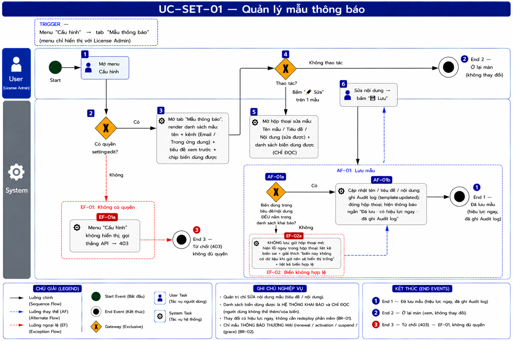
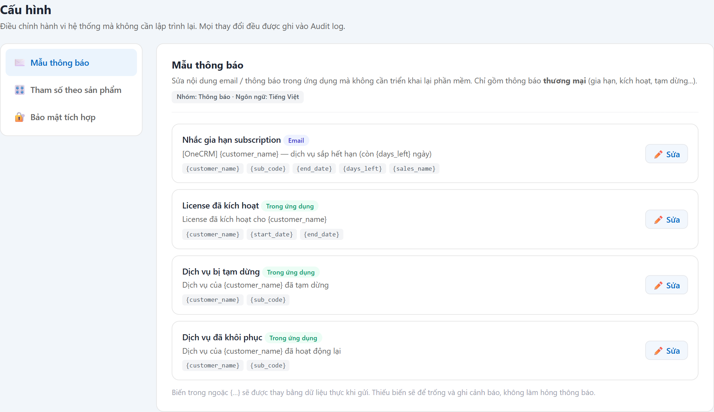

# UC-SET-01 — Quản lý mẫu thông báo

> Module: Cấu hình (menu gom) — nội dung thuộc **M-08 Notification** | Phiên bản: 1.0 | Ngày: 17/07/2026
> Trạng thái: Draft for Review

---

## 1. Thông tin chung

| Thuộc tính | Nội dung |
|---|---|
| **Mã Use Case** | UC-SET-01 |
| **Tên** | Quản lý mẫu thông báo |
| **Mô tả** | Admin **sửa nội dung** email / thông báo trong ứng dụng (tiêu đề, thân) **không cần triển khai lại phần mềm**. Chỉ gồm mẫu **thương mại** (nhắc gia hạn, kích hoạt, tạm dừng, khôi phục). Biến động (`{customer_name}`, `{sub_code}`…) do hệ thống khai báo theo từng mẫu; admin chỉ *dùng*, không tự thêm. |
| **Tác nhân** | License Admin |
| **Tiền điều kiện** | Đã đăng nhập; có quyền `setting:edit`. |
| **Hậu điều kiện** | (Success) Mẫu được lưu, có hiệu lực **ngay** cho lần gửi kế tiếp; ghi Audit log. (Failure) Không lưu; giữ nội dung cũ. |
| **Trigger** | Menu **Cấu hình** → tab **Mẫu thông báo** → nút **"✏️ Sửa"** trên 1 mẫu. |
| **Liên kết** | UC-NOT-01/02/03 (dùng mẫu để gửi & hiển thị), UC-AUD-01 (thay đổi ghi vào Audit log), [`_notification_variable_catalog`] *(nguồn biến — chưa tạo, OQ-S1)*. |

### Business Rules

| Mã | Nội dung | Lý do / Ghi chú |
|---|---|---|
| **BR-01** | **Phân quyền**: chỉ `setting:edit` — **License Admin**. Sales / CSKH / Manager / Auditor **không thấy menu Cấu hình**; gọi thẳng API → **403**. | PRD FR-NOT-02 actor = License Admin; đây là quản trị hệ thống, không phải quản lý thương mại. |
| **BR-02** | **Chỉ mẫu THƯƠNG MẠI** (renewal_reminder, license_activated, subscription_suspended, subscription_resumed). **Không** chứa: (a) template *operational* (credentials, cảnh báo kỹ thuật — product tự lo, YT-3); (b) câu diễn giải sự kiện trên **Timeline (M-06)** — đó là mục khác. | Ranh giới observer YT-3; tránh nhầm 2 loại "template". |
| **BR-03** | **Biến do hệ thống khai báo theo TỪNG mẫu** (`expected_variables`) — admin chỉ *dùng* biến có sẵn, **không thêm biến mới**. Danh sách biến hiển thị **chỉ-đọc** trong modal. | Biến = dữ liệu `context` mà điểm gửi (FR-NOT-01/04) truyền vào; thêm biến lạ → không có dữ liệu để thay (xem OQ-S1). |
| **BR-04** | **Dùng biến ngoài danh sách khai báo → CHẶN LƯU** (không chỉ cảnh báo): chỉ rõ biến sai + nhắc danh sách biến hợp lệ, giữ hộp thoại để sửa. **Không** bắt lỗi biến *không dùng hết* — viết mẫu ngắn là hợp lệ.<br>Ở khâu **gửi**: biến thiếu dữ liệu → để **trống** + ghi cảnh báo, **không** làm hỏng thông báo. | PRD FR-NOT-02 BR-02.2 (validate khớp expected), FR-NOT-01 AC-01.3.<br>**Vì sao chặn cứng (chốt 17/07):** biến lạ là lỗi **100%** — `context` không bao giờ có khóa đó nên vĩnh viễn render trống; hậu quả **lộ ra người thật** (email tới Sales/KH thành *"hết hiệu lực ngày ___"*). Bắt lúc Lưu rẻ hơn nhiều so với phát hiện sau khi đã gửi. |
| **BR-05** | **Sửa nội dung không cần deploy** — name / subject / body sửa được qua UI, hiệu lực ngay. | PRD FR-NOT-02 US-06 ("sửa nội dung email không cần deploy code"). |
| **BR-06** | **Mọi thay đổi ghi Audit log** (`template.updated`, actor + before/after). | PRD FR-NOT-02 BR-02.3; trace UC-AUD-01. |
| **BR-07** | `code` mẫu **unique**; **Tiếng Việt** (Phase 1). | PRD FR-NOT-02 BR-02.1/02.4. |

---

## 2. Luồng nghiệp vụ



### 2.1 Luồng chính

| Bước | Actor | Hành động / Phản hồi |
|---|---|---|
| **1** | License Admin | Mở menu **Cấu hình**. |
| **2** | System | **[Gateway — Có quyền `setting:edit`?]**<br>→ **[Có]**: tiếp bước 3.<br>→ **[Không]**: sang **EF-01**. |
| **3** | System | Mở tab **Mẫu thông báo** (mặc định); render danh sách mẫu: tên + kênh (Email / Trong ứng dụng) + tiêu đề xem trước + chip biến dùng được (BR-02, BR-03). |
| **4** | License Admin | **[Gateway — Thao tác?]**<br>→ Bấm **"✏️ Sửa"** trên 1 mẫu: tiếp bước 5.<br>→ Không thao tác: **End 2** (ở lại màn, không thay đổi). |
| **5** | System | Mở modal: **Tên mẫu · Tiêu đề · Nội dung** (sửa được) + danh sách **biến dùng được** (chỉ-đọc) (BR-03). |
| **6** | License Admin | Sửa nội dung → bấm **"💾 Lưu"** → **AF-01** (validate & lưu). |

### 2.2 Luồng phụ

**[AF-01: Lưu mẫu]** — tại bước 6.

| Bước | Actor | Hành động / Phản hồi |
|---|---|---|
| **6a** | System | Quét biến `{…}` dùng trong Tiêu đề + Nội dung, đối chiếu danh sách biến khai báo của mẫu.<br>**[Gateway — Biến đều hợp lệ?]**<br>→ **[Có]**: tiếp 6b.<br>→ **[Không]**: sang **EF-02**. |
| **6b** | System | Cập nhật tên / tiêu đề / nội dung; ghi **Audit log** (`template.updated` — BR-06); đóng hộp thoại; hiện thông báo ngắn *"Đã lưu · có hiệu lực ngay · đã ghi vào Audit log"* → **End 1**. |

### 2.3 Luồng ngoại lệ

**[EF-01: Không có quyền]** — tại bước 2.

| Bước | Actor | Hành động / Phản hồi |
|---|---|---|
| **EF-01a** | System | Menu **Cấu hình** **không hiển thị** với vai trò ≠ License Admin; gọi thẳng API → **403** → **End 3**. |

**[EF-02: Biến không hợp lệ]** — tại 6a.

| Bước | Actor | Hành động / Phản hồi |
|---|---|---|
| **EF-02a** | System | **KHÔNG lưu**; **giữ hộp thoại mở**; hiện lỗi ngay trong hộp thoại: liệt kê **biến sai**, giải thích *"biến này không có dữ liệu khi gửi nên sẽ hiển thị trống trong thông báo tới khách"*, kèm **danh sách biến hợp lệ** (BR-04). |
| → | — | Quay lại bước 6 để sửa. |

### 2.4 Điểm kết thúc

| End | Mô tả |
|---|---|
| **End 1** | Đã lưu mẫu (hiệu lực ngay, đã ghi Audit log). |
| **End 2** | Ở lại màn — xem, không thay đổi. |
| **End 3** | Từ chối (403) — không đủ quyền. |

---

## 3. Mô tả giao diện

Demo: `v2.8.0_audit_notification.html`, menu **Cấu hình** → tab **Mẫu thông báo** (`setPanelTemplates` / `setEditTemplate`).



```
┌ Cấu hình ────────────────────────────────────────────────────────────┐
│ [✉️ Mẫu thông báo] [🎛️ Tham số theo sản phẩm] [🔐 Bảo mật tích hợp]     │
│ ┌ Mẫu thông báo — Nhóm: Thông báo · Tiếng Việt ──────────────────────┐ │
│ │ Nhắc gia hạn subscription  [Email]                        [✏️ Sửa] │ │
│ │ [OneCRM] {customer_name} — dịch vụ sắp hết hạn (còn {days_left}...) │ │
│ │ {customer_name} {sub_code} {end_date} {days_left} {sales_name}      │ │
│ │ License đã kích hoạt  [Trong ứng dụng]                    [✏️ Sửa] │ │
│ │ ...                                                                 │ │
│ └────────────────────────────────────────────────────────────────────┘ │
└───────────────────────────────────────────────────────────────────────┘
```

### 3.1 Các thành phần

| # | Thành phần | Loại | Mô tả |
|---|---|---|---|
| 1 | Sub-nav Cấu hình | Danh sách dọc | 3 mục: Mẫu thông báo / Tham số / Bảo mật tích hợp. |
| 2 | Thẻ mẫu | Card | Tên + badge kênh + tiêu đề xem trước + chip biến + nút "✏️ Sửa". |
| 3 | Modal Sửa mẫu | Hộp thoại | Tên mẫu, Tiêu đề, Nội dung (textarea) + danh sách biến chỉ-đọc; nút Hủy / 💾 Lưu. |

### 3.2 Các field trong modal

| # | Field | Bắt buộc | Mô tả & Validation |
|---|---|---|---|
| 1 | Tên mẫu | ✓ | Chuỗi hiển thị nội bộ. |
| 2 | Tiêu đề | ✓ | Có thể chứa biến `{…}` trong `expected_variables`. |
| 3 | Nội dung | ✓ | Thân email/thông báo; biến `{…}`. Dùng biến ngoài danh sách → cảnh báo (BR-04). |
| — | Biến dùng được | — | **Chỉ-đọc** — do hệ thống khai báo, không sửa (BR-03). |

---

## 4. Acceptance Criteria

| Mã | Given | When | Then |
|---|---|---|---|
| AC-SET-01-01 | **License Admin** đăng nhập. | Mở Cấu hình. | Thấy tab **Mẫu thông báo** + danh sách mẫu thương mại (BR-01, BR-02). |
| AC-SET-01-02 | **Sales / Manager / Auditor** đăng nhập. | — | **Không thấy** menu Cấu hình; API → **403** (BR-01, EF-01). |
| AC-SET-01-03 | Sửa tiêu đề mẫu "Nhắc gia hạn". | Bấm 💾 Lưu. | Lưu thành công; hiện thông báo ngắn "có hiệu lực ngay · đã ghi Audit log"; lần gửi kế tiếp dùng nội dung mới (BR-05, BR-06). |
| AC-SET-01-04 | Modal đang mở. | Xem danh sách biến. | Biến hiển thị **chỉ-đọc**; không có ô để thêm biến mới (BR-03). |
| AC-SET-01-05 | Nội dung dùng biến `{ngay_het_han}` (ngoài danh sách khai báo). | Bấm 💾 Lưu. | **KHÔNG lưu**; hộp thoại vẫn mở; hiện lỗi chỉ rõ `{ngay_het_han}` + liệt kê biến hợp lệ (BR-04, EF-02). |
| AC-SET-01-05b | Mẫu chỉ dùng 2/5 biến khai báo. | Bấm 💾 Lưu. | **Lưu bình thường** — không bắt lỗi biến chưa dùng hết (BR-04). |
| AC-SET-01-06 | Thông báo gửi đi thiếu 1 biến. | Render lúc gửi. | Biến để trống + ghi cảnh báo; thông báo **không** hỏng (BR-04). |

---

## 5. Review Checklist

### Lịch sử thay đổi

| Phiên bản | Ngày | Tác giả | Mô tả |
|---|---|---|---|
| 1.0 | 17/07/2026 | Claude (AI) | Khởi tạo từ demo v2.8 + PRD FR-NOT-02. Ghi rõ ranh giới (chỉ mẫu thương mại, không operational/timeline — BR-02), biến per-template chỉ-đọc (BR-03), và **gap demo chưa validate biến lúc Lưu** (OQ-S2). |
| 1.1 | 17/07/2026 | Claude (AI) | Nhúng **ảnh chụp màn thật** từ demo v2.8 vào §3 (`UC-SET-01_screen_templates.png`). Đối chiếu ảnh: khớp sub-nav 3 mục, 4 mẫu thương mại + badge kênh + tiêu đề xem trước + **chip biến (chỉ-đọc)** + nút "✏️ Sửa", ghi chú xử lý thiếu biến. |
| 1.2 | 17/07/2026 | Claude (AI) | **Bổ sung nhánh "Không thao tác → Ở lại màn"** ở bước 4 (§2.1). Trước đó luồng mặc định admin luôn bấm Sửa → **không có điểm kết thúc cho trường hợp chỉ mở xem rồi thoát** (BPMN bị treo nhánh), và thiếu cơ sở viết AC *"chỉ xem thì KHÔNG ghi Audit log"*. Kéo theo: thêm **End 2 (Ở lại màn)**, dời **403 → End 3** (§2.4). Đã đồng bộ sang prompt BPMN → FRS ↔ BPMN map 1:1. |
| 1.3 | 17/07/2026 | Claude (AI) | **Chốt OQ-S2 — CHẶN LƯU khi dùng biến ngoài danh sách khai báo** (thay vì chỉ cảnh báo). Lý do ghi vào BR-04: biến lạ là lỗi **100%** (context không bao giờ có khóa đó) → vĩnh viễn render trống, **lộ ra người thật** (email tới Sales/KH bị khuyết chỗ). Kéo theo: thêm **gateway "Biến đều hợp lệ?"** ở 6a, thêm **EF-02** (giữ hộp thoại + chỉ rõ biến sai + liệt kê biến hợp lệ), thêm **AC-SET-01-05/05b**. Làm rõ: **không** bắt lỗi biến chưa dùng hết. Đã áp vào demo. |

### Nghiệp vụ
- ✅ Sửa nội dung không cần deploy; mọi thay đổi ghi Audit log
- ✅ Chỉ mẫu thương mại (YT-3); biến do hệ thống khai báo, admin không tự thêm
- ⚠️ **OQ-S1**: nguồn/định nghĩa biến `expected_variables` per-template — nên tách thành `_notification_variable_catalog.md` (data lineage: customer_name ← CUSTOMER.name; end_date ← LICENSE_MIRROR.expiration_date; …) và verify field `sales_name` trong PRD.
- ✅ ~~**OQ-S2**~~ — **ĐÃ CHỐT 17/07/2026: chặn lưu khi có biến lạ** (không chỉ cảnh báo). Đã áp vào demo + FRS (BR-04, EF-02, AC-05/05b). Chỉ chặn biến **lạ**; biến *không dùng hết* vẫn lưu bình thường.

---

## Footer

| Mục | Nội dung |
|---|---|
| **Giao diện** | ✅ Có demo — `v2.8.0_audit_notification.html`, Cấu hình → Mẫu thông báo |
| **UC liên quan** | UC-SET-02, UC-SET-03, UC-USR-01, UC-NOT-01/02/03, UC-AUD-01 |
| **Trace PRD** | OneCRM_PRD §6.8.6 (FR-NOT-02) |
