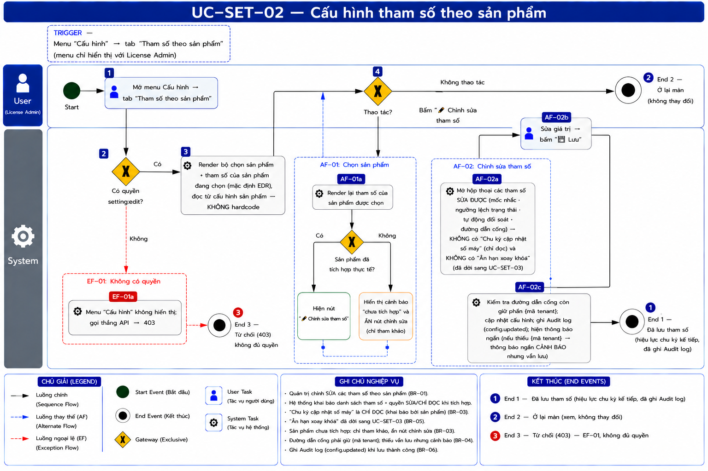
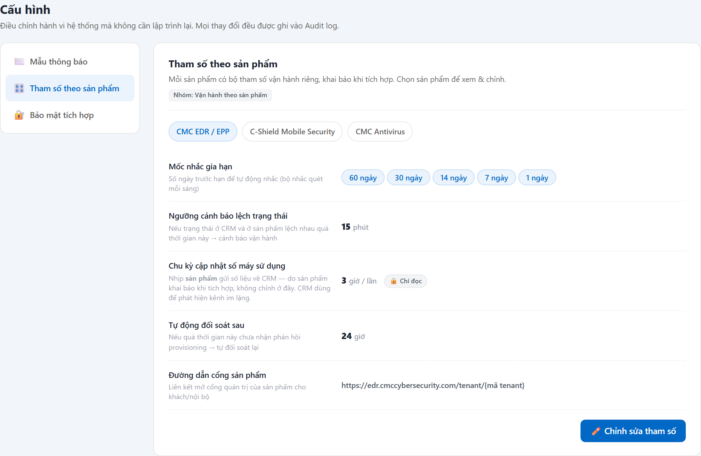

# UC-SET-02 — Cấu hình tham số theo sản phẩm

> Module: Cấu hình (menu gom) — nội dung thuộc **khai báo Product Module (M-04 / M-07)** | Phiên bản: 1.0 | Ngày: 17/07/2026
> Trạng thái: Draft for Review

---

## 1. Thông tin chung

| Thuộc tính | Nội dung |
|---|---|
| **Mã Use Case** | UC-SET-02 |
| **Tên** | Cấu hình tham số theo sản phẩm |
| **Mô tả** | Xem & chỉnh **bộ tham số vận hành riêng của từng sản phẩm** (`runtime_config` §6.9.9): mốc nhắc gia hạn, ngưỡng cảnh báo lệch trạng thái, chu kỳ cập nhật số máy *(chỉ đọc)*, tự động đối soát, đường dẫn cổng sản phẩm. **Chọn sản phẩm trước**, rồi mới xem/sửa. Sản phẩm chưa tích hợp thực tế → chỉ hiển thị tham khảo. *(Ân hạn xoay khóa đã dời sang UC-SET-03.)* |
| **Tác nhân** | License Admin |
| **Tiền điều kiện** | Đã đăng nhập; có quyền `setting:edit`. Sản phẩm đã register (M-04) và khai báo `runtime_config`. |
| **Hậu điều kiện** | (Success) Tham số được lưu, có hiệu lực ở chu kỳ vận hành **kế tiếp** (nhắc/đối soát); ghi Audit log. |
| **Trigger** | Menu **Cấu hình** → tab **Tham số theo sản phẩm** → chọn sản phẩm → **"✏️ Chỉnh sửa tham số"**. |
| **Liên kết** | UC-NOT-02 (đọc *mốc nhắc*), UC-LIC-04 (đọc *ngưỡng lệch trạng thái*), UC-SET-03 (ân hạn xoay khóa — **trùng chỗ**, xem OQ-S3), UC-LIC-01 (portal deep-link), UC-AUD-01 (ghi Audit log). |

### Business Rules

| Mã | Nội dung | Lý do / Ghi chú |
|---|---|---|
| **BR-01** | **Phân quyền**: chỉ `setting:edit` — **License Admin**; vai trò khác không thấy menu → **403**. | Quản trị vận hành. |
| **BR-02** | **Tham số gắn theo SẢN PHẨM** (khai báo khi register Product Module) → phải **chọn sản phẩm trước**, không có cấu hình toàn cục. | PRD §6.9.9 Runtime Config gắn theo Product Module. |
| **BR-03** | **Sản phẩm chưa tích hợp thực tế** (skeleton: C-Shield, AV) → hiển thị tham số **chỉ tham khảo**, **không** nút chỉnh sửa; kèm cảnh báo "chưa tích hợp". | Roadmap YT-5: chỉ EDR full Phase 1-2; tránh chỉnh tham số cho tích hợp chưa tồn tại. |
| **BR-04** | **Ngưỡng KHÔNG hardcode** — các module đọc từ đây: mốc nhắc (UC-NOT-02), ngưỡng lệch trạng thái `mismatch_sla_minutes` (UC-LIC-04, FR-LIC-07), chu kỳ đối soát, portal deep-link. | Quy tắc UI #6; PRD FR-LIC-07 (`mismatch_sla_minutes` default 15), FR-NOT-04 BR-04.3. |
| **BR-05** | **Đường dẫn cổng sản phẩm** phải chứa placeholder **`{mã tenant}`** — hệ thống thay bằng mã thật khi mở link cho từng khách. Thiếu placeholder → **cảnh báo** (vẫn lưu best-effort). | OQ-07 (đã chốt v2.6): `runtime_config.portal_url_template` + `license:view_portal`. |
| **BR-06** | **Mọi thay đổi ghi Audit log** (`config.updated`, actor + before/after). | Trace UC-AUD-01. |
| **BR-07** | **Ranh giới quyền chỉnh (YT-3) — phân loại tham số:** tham số **CRM tự thực thi** → cho sửa; tham số **phản ánh hành vi phía sản phẩm** → **chỉ đọc**. Cụ thể xem bảng dưới. | Observer boundary — tránh ảo giác CRM điều khiển product. **Đã áp dụng 17/07/2026: `usage_push_interval` chuyển read-only.** |

### Phân loại tham số (BR-07)

| Tham số (nhãn UI) | `runtime_config` | Chủ | Nên cho sửa? |
|---|---|---|---|
| Mốc nhắc gia hạn | `notification_thresholds_days` | CRM (scheduler) | ✅ Có |
| Ngưỡng cảnh báo lệch trạng thái | `mismatch_sla_minutes` | CRM (mismatch detect) | ✅ Có |
| Tự động đối soát sau | `auto_reconcile_after_hours` | CRM (reconcile) | ✅ Có |
| Đường dẫn cổng sản phẩm | `portal_url_template` | CRM (dựng link) | ✅ Có |
| **Chu kỳ cập nhật số máy** | `usage_push_interval_hours` | **Product (nhịp push)** | ❌ **KHÔNG — chỉ đọc** *(chốt 17/07/2026)*.<br>Lý do: (1) CRM không điều khiển nhịp push (YT-3) — sửa ở CRM thì product **vẫn gửi như cũ**; (2) CRM dùng nó tính **ngưỡng im lặng = 2 × chu kỳ** (UC-INT-03 BR-04) → đặt sai gây **mù cảnh báo** hoặc **báo động giả**; (3) đây là **dữ kiện thỏa thuận khi tích hợp**, đổi qua luồng khai báo Product Module. |
| ~~Ân hạn khi xoay khóa~~ | `secret_rotation_grace_days` | Bảo mật 2 bên | ➡️ **ĐÃ DỜI sang UC-SET-03** *(chốt 17/07/2026)* — không còn hiển thị/sửa ở màn này. Lý do: thuộc **ngữ cảnh bảo mật**, chỉ có ý nghĩa tại thời điểm xoay khóa; nhất quán với `webhook_secret` (cũng là runtime_config nhưng đặt ở màn Bảo mật). |

---

## 2. Luồng nghiệp vụ



### 2.1 Luồng chính

| Bước | Actor | Hành động / Phản hồi |
|---|---|---|
| **1** | License Admin | Mở menu **Cấu hình** → tab **Tham số theo sản phẩm**. |
| **2** | System | **[Gateway — Có quyền `setting:edit`?]**<br>→ **[Có]**: tiếp bước 3.<br>→ **[Không]**: sang **EF-01**. |
| **3** | System | Render bộ chọn sản phẩm (chip) + tham số của sản phẩm đang chọn (mặc định EDR); đọc từ `runtime_config` (BR-02, BR-04). |
| **4** | License Admin | **[Gateway — Thao tác?]**<br>→ Chọn sản phẩm khác: **AF-01**.<br>→ Bấm **"✏️ Chỉnh sửa tham số"**: **AF-02**.<br>→ Không thao tác: **End 2** (ở lại màn, không thay đổi). |

### 2.2 Luồng phụ

**[AF-01: Chọn sản phẩm]** — tại bước 4.

| Bước | Actor | Hành động / Phản hồi |
|---|---|---|
| **4a** | System | Render lại tham số của sản phẩm được chọn.<br>**[Gateway — Sản phẩm đã tích hợp?]**<br>→ **[Có]** (EDR): hiện nút "✏️ Chỉnh sửa".<br>→ **[Không]** (skeleton): cảnh báo "chưa tích hợp", **ẩn** nút chỉnh sửa (BR-03). |
| → | — | Quay lại bước 4. |

**[AF-02: Chỉnh sửa tham số]** — tại bước 4 (chỉ sản phẩm đã tích hợp).

| Bước | Actor | Hành động / Phản hồi |
|---|---|---|
| **4b** | System | Mở hộp thoại các trường **sửa được**: mốc nhắc · ngưỡng lệch trạng thái · tự động đối soát · đường dẫn cổng. **Không** có "Chu kỳ cập nhật số máy" (chỉ đọc — BR-07) và **không** có "Ân hạn xoay khóa" (đã dời sang UC-SET-03). |
| **4c** | License Admin | Sửa giá trị → bấm **"💾 Lưu"**. |
| **4d** | System | Validate đường dẫn cổng chứa `{…}` (BR-05); cập nhật `runtime_config`; ghi **Audit log** (`config.updated` — BR-06); hiện thông báo ngắn → **End 1**.<br>Nếu portal thiếu placeholder → hiện thông báo ngắn **cảnh báo** (vẫn lưu). |

### 2.3 Luồng ngoại lệ

**[EF-01: Không có quyền]** — tại bước 2 → **403** → **End 3**.

### 2.4 Điểm kết thúc

| End | Mô tả |
|---|---|
| **End 1** | Đã lưu tham số (hiệu lực chu kỳ kế tiếp, đã ghi Audit log). |
| **End 2** | Ở lại màn — xem, không thay đổi. |
| **End 3** | Từ chối (403). |

---

## 3. Mô tả giao diện

Demo: `v2.8.0_audit_notification.html`, Cấu hình → **Tham số theo sản phẩm** (`setPanelParams` / `setEditParams`).



```
Tham số theo sản phẩm — Nhóm: Vận hành theo sản phẩm
[ CMC EDR / EPP ] [ C-Shield ] [ CMC Antivirus ]
Mốc nhắc gia hạn              [60 ngày][30 ngày][14 ngày][7 ngày][1 ngày]
Ngưỡng cảnh báo lệch trạng thái          15 phút
Chu kỳ cập nhật số máy sử dụng            3 giờ / lần   🔒 Chỉ đọc
Tự động đối soát sau                      24 giờ
Đường dẫn cổng sản phẩm     https://edr.cmccybersecurity.com/tenant/{mã tenant}
                                                     [✏️ Chỉnh sửa tham số]
```

### 3.1 Các thành phần

| # | Thành phần | Loại | Mô tả |
|---|---|---|---|
| 1 | Bộ chọn sản phẩm | Chip | EDR / C-Shield / AV; sản phẩm skeleton kèm cảnh báo. |
| 2 | Danh sách tham số | Key-value | **5 tham số**, đặt tên nghiệp vụ + gợi ý; mốc nhắc dạng chip ngày. **"Chu kỳ cập nhật số máy" gắn nhãn 🔒 Chỉ đọc** + gợi ý nêu rõ do sản phẩm khai báo (BR-07). |
| 3 | Nút Chỉnh sửa | Button | Chỉ hiện với sản phẩm đã tích hợp (BR-03). |
| 4 | Hộp thoại chỉnh tham số | Hộp thoại | **4 trường sửa được** (không có Chu kỳ cập nhật số máy — chỉ đọc; không có Ân hạn xoay khóa — đã dời sang UC-SET-03) + ô đường dẫn cổng (full-width, nhắc giữ `{mã tenant}`). |

---

## 4. Acceptance Criteria

| Mã | Given | When | Then |
|---|---|---|---|
| AC-SET-02-01 | License Admin, sản phẩm **EDR**. | Mở tab Tham số. | Thấy 6 tham số + nút "✏️ Chỉnh sửa tham số" (BR-02). |
| AC-SET-02-02 | Chọn **C-Shield** (skeleton). | — | Cảnh báo "chưa tích hợp"; **không** có nút chỉnh sửa (BR-03). |
| AC-SET-02-03 | Sửa mốc nhắc EDR `60,30,14,7,1` → `30,7`. | Lưu. | Tab Lịch nhắc (UC-NOT-02) còn 2 bucket 30 & 7; **không sửa code** (BR-04). |
| AC-SET-02-04 | Đường dẫn cổng xóa mất `{mã tenant}`. | Lưu. | **Cảnh báo** thiếu placeholder; vẫn lưu (BR-05). |
| AC-SET-02-05 | Sửa bất kỳ tham số. | Lưu. | Ghi Audit log `config.updated` (BR-06); hiện thông báo ngắn "hiệu lực chu kỳ kế tiếp". |
| AC-SET-02-06 | **Sales / Manager** đăng nhập. | — | Không thấy menu Cấu hình; API → 403 (BR-01, EF-01). |
| AC-SET-02-07 | License Admin xem tham số EDR. | Mở tab Tham số. | **"Chu kỳ cập nhật số máy" gắn nhãn 🔒 Chỉ đọc**, gợi ý ghi rõ *do sản phẩm khai báo*; giá trị **3 giờ/lần** (BR-07). |
| AC-SET-02-08 | License Admin mở hộp thoại chỉnh tham số. | Xem các trường. | **Không có ô nhập "Chu kỳ cập nhật số máy"** — chỉ 5 trường sửa được; gọi API sửa trường này → bị từ chối (BR-07). |

---

## 5. Review Checklist

### Lịch sử thay đổi

| Phiên bản | Ngày | Tác giả | Mô tả |
|---|---|---|---|
| 1.0 | 17/07/2026 | Claude (AI) | Khởi tạo từ demo v2.8 + PRD §6.9.9. Ghi rõ **phân loại tham số theo ranh giới observer YT-3** (BR-07): `usage_push` là nhịp push của product (nên read-only), `secret_rotation_grace` là bảo mật 2 bên (nên dời SET-03) — **demo hiện cho sửa tất cả → OQ-S3**. |
| 1.1 | 17/07/2026 | Claude (AI) | Nhúng **ảnh chụp màn thật** từ demo v2.8 vào §3 (`UC-SET-02_screen_params.png`, sản phẩm EDR). Đối chiếu ảnh: khớp chip chọn 3 sản phẩm, 6 tham số đặt tên nghiệp vụ + dòng gợi ý, mốc nhắc dạng chip ngày, đường dẫn cổng giữ `{mã tenant}`, nút "✏️ Chỉnh sửa tham số". |
| 1.2 | 17/07/2026 | Claude (AI) | **Bổ sung nhánh "Không thao tác → Ở lại màn"** ở gateway bước 4 (§2.1) — trước đó không có điểm kết thúc cho trường hợp admin chỉ mở xem tham số rồi thoát (BPMN bị treo nhánh). Kéo theo: thêm **End 2 (Ở lại màn)**, dời **403 → End 3** (§2.4). Đã đồng bộ sang prompt BPMN → FRS ↔ BPMN map 1:1. |
| 1.3 | 17/07/2026 | Claude (AI) | **Chốt OQ-S3a — `usage_push_interval` chuyển CHỈ ĐỌC** (phương án A). Lý do ghi vào BR-07: CRM không điều khiển nhịp push (YT-3) → sửa ở CRM product vẫn gửi như cũ; CRM dùng giá trị này tính **ngưỡng im lặng = 2 × chu kỳ** (UC-INT-03 BR-04) nên đặt sai gây **mù cảnh báo / báo động giả**; giá trị đúng là **dữ kiện thỏa thuận khi tích hợp**. Kéo theo: gỡ ô nhập khỏi hộp thoại (§2 bước 4b, §3.1), gắn nhãn 🔒 Chỉ đọc, thêm **AC-SET-02-07/08**.<br>**Sửa lệch dữ liệu**: EDR `usage_push` **1 giờ → 3 giờ** cho khớp quyết định "chốt chu kỳ đẩy 3h" + UC-INT-03 BR-04. Đã chụp lại ảnh §3. |
| 1.4 | 17/07/2026 | Claude (AI) | **Chốt OQ-S3b — dời `secret_rotation_grace_days` sang UC-SET-03.** Gỡ khỏi màn này (hiển thị + ô nhập + wireframe) → còn **5 tham số** (4 sửa được + 1 chỉ đọc). Lý do: thuộc **ngữ cảnh bảo mật**, chỉ có ý nghĩa tại thời điểm xoay khóa; nhất quán với `webhook_secret` (cũng runtime_config nhưng đặt ở màn Bảo mật); **hết trùng lặp** (trước đó giá trị hiện ở 2 tab, demo còn giữ 2 nguồn dữ liệu). |

### Nghiệp vụ
- ✅ Chọn sản phẩm trước; ngưỡng đọc từ cấu hình, không hardcode; ghi Audit log
- ✅ Skeleton products chỉ tham khảo; portal giữ placeholder
- ✅ ~~**OQ-S3a**~~ — **ĐÃ CHỐT 17/07/2026: `usage_push_interval` = chỉ đọc** (phương án A — read-only hoàn toàn). Đổi giá trị chỉ qua luồng khai báo Product Module. Đã áp vào demo + FRS. Đồng thời **sửa giá trị EDR 1 giờ → 3 giờ** cho khớp quyết định "chốt chu kỳ đẩy 3h" và UC-INT-03 BR-04 (ngưỡng im lặng 6 giờ).
- ✅ ~~**OQ-S3b**~~ — **ĐÃ CHỐT 17/07/2026: dời hẳn `secret_rotation_grace_days` sang UC-SET-03.** Gỡ khỏi màn này (cả hiển thị lẫn ô nhập); nguồn dữ liệu gộp về một chỗ (không còn 2 nơi giữ cùng giá trị).
- ⚠️ **OQ-S4**: các tham số này admin **override lúc chạy** được, hay chỉ **set khi register Product Module** (code-controlled)? Nếu là declaration của module thì cả nhóm ✅ cũng chỉ nên "xem".

---

## Footer

| Mục | Nội dung |
|---|---|
| **Giao diện** | ✅ Có demo — `v2.8.0_audit_notification.html`, Cấu hình → Tham số theo sản phẩm |
| **UC liên quan** | UC-SET-01, UC-SET-03, UC-NOT-02, UC-LIC-01, UC-LIC-04, UC-AUD-01 |
| **Trace PRD** | OneCRM_PRD §6.9.9 (Runtime Config), FR-LIC-07 (mismatch SLA), §6.5.2 BR-01.4 (portal, OQ-07 đã chốt) |
