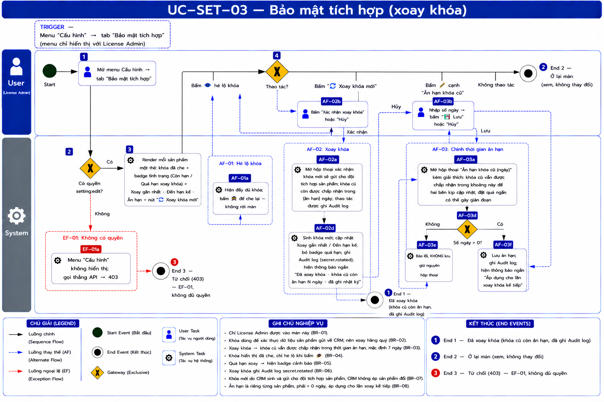
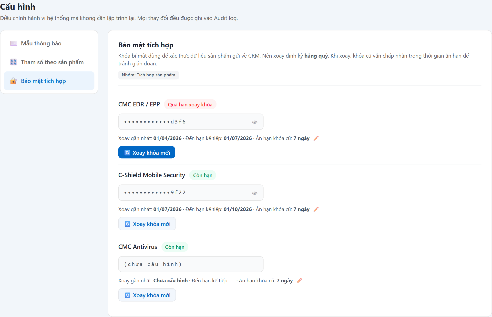

# UC-SET-03 — Bảo mật tích hợp (xoay khóa)

> Module: Cấu hình (menu gom) — nội dung thuộc **M-07 Integration Layer** | Phiên bản: 1.0 | Ngày: 17/07/2026
> Trạng thái: Draft for Review

---

## 1. Thông tin chung

| Thuộc tính | Nội dung |
|---|---|
| **Mã Use Case** | UC-SET-03 |
| **Tên** | Bảo mật tích hợp (xoay khóa) |
| **Mô tả** | Quản lý **khóa bí mật** dùng để **xác thực dữ liệu sản phẩm gửi về CRM** (webhook inbound). Với mỗi sản phẩm: xem tình trạng khóa (đã che, hé lộ có kiểm soát), hạn xoay, và **xoay khóa** định kỳ. Khi xoay, khóa cũ vẫn được chấp nhận trong **thời gian ân hạn** để tránh gián đoạn. |
| **Tác nhân** | License Admin |
| **Tiền điều kiện** | Đã đăng nhập; có quyền `setting:edit`. Sản phẩm đã tích hợp webhook. |
| **Hậu điều kiện** | (Success) Khóa mới có hiệu lực; khóa cũ còn nhận trong ân hạn; ghi Audit log. |
| **Trigger** | Menu **Cấu hình** → tab **Bảo mật tích hợp** → nút **"🔄 Xoay khóa mới"** trên 1 sản phẩm. |
| **Liên kết** | UC-INT-02 (webhook inbound dùng khóa để xác thực HMAC), UC-SET-02 (ân hạn `secret_rotation_grace_days` — **nên gộp về đây**, OQ-S3), UC-AUD-01 (ghi Audit log). |

### Business Rules

| Mã | Nội dung | Lý do / Ghi chú |
|---|---|---|
| **BR-01** | **Phân quyền**: chỉ `setting:edit` — **License Admin**; vai trò khác → **403**. Đây là thao tác bảo mật nhạy cảm. | PRD personas: "License Admin — rotate webhook secret". |
| **BR-02** | Khóa dùng **xác thực dữ liệu product gửi về** (webhook inbound HMAC — YT-3). Nên **xoay định kỳ hằng quý**. | PRD YT-3 (inbound HMAC + idempotency); §6.9.9 "webhook_secret: rotate hàng quý". |
| **BR-03** | **Xoay khóa → sinh khóa mới + khóa CŨ vẫn được chấp nhận trong ân hạn** (`secret_rotation_grace_days`, mặc định **7 ngày**), sau đó tự vô hiệu. | Tránh gián đoạn webhook khi hai bên chưa kịp đồng bộ; PRD `secret_rotation_state` (old_secret + rotated_at, grace 7 ngày). |
| **BR-04** | Khóa hiển thị **đã che** (chỉ 4 ký tự cuối); **hé lộ có kiểm soát** (nút 👁) — chỉ License Admin. | Bảo mật; không phơi khóa mặc định. |
| **BR-05** | **Cảnh báo quá hạn xoay** — badge "Quá hạn xoay khóa" khi vượt hạn `nextDue`. | Nhắc admin xoay đúng chu kỳ. |
| **BR-06** | **Xoay khóa ghi Audit log** (`secret.rotated`, actor + thời điểm). | Trace UC-AUD-01; thao tác bảo mật phải truy vết được. |
| **BR-07** | CRM **tạo khóa mới và gửi cho đội tích hợp sản phẩm** để cập nhật phía product (phối hợp 2 bên). CRM **không** ép product đổi (YT-3 — observer). | Ranh giới observer: CRM quản khóa phía nhận, product tự cập nhật phía gửi. |
| **BR-08** | **Thời gian ân hạn (`secret_rotation_grace_days`) được xem & chỉnh TẠI MÀN NÀY** — mỗi sản phẩm một giá trị, sửa qua nút ✏️ cạnh dòng "Ân hạn khóa cũ". Giá trị phải **> 0 ngày**. Thay đổi ghi Audit log, áp dụng cho **lần xoay kế tiếp**. | *(Chốt 17/07/2026 — OQ-S3b)* Trước đây sửa ở UC-SET-02 (màn Tham số) nhưng chỉ hiển thị ở đây → **trùng chỗ**. Gộp về đây vì: thuộc ngữ cảnh bảo mật, chỉ có ý nghĩa khi xoay khóa, và nhất quán với `webhook_secret` (cùng là runtime_config nhưng đặt ở màn Bảo mật). |

---

## 2. Luồng nghiệp vụ



> ⚠️ **Sơ đồ đang là bản tạm — có 2 chỗ nối sai, khi đọc hãy lấy bảng luồng bên dưới làm chuẩn:**
> 1. Nhánh **"Hủy"** của AF-02b trên hình đang nối sang AF-03b; đúng ra phải **quay về bước 4**.
> 2. AF-03a trên hình đang nối thẳng xuống AF-03d; đúng ra phải qua **AF-03b (người dùng nhập số ngày)** trước.
>
> Sẽ dựng lại bằng bpmn-js (`docs/tools/bpmn_editor.html`) ở đợt sau.

### 2.1 Luồng chính

| Bước | Actor | Hành động / Phản hồi |
|---|---|---|
| **1** | License Admin | Mở menu **Cấu hình** → tab **Bảo mật tích hợp**. |
| **2** | System | **[Gateway — Có quyền `setting:edit`?]**<br>→ **[Có]**: tiếp bước 3.<br>→ **[Không]**: sang **EF-01**. |
| **3** | System | Render mỗi sản phẩm một thẻ: khóa (đã che) + badge tình trạng (Còn hạn / Quá hạn xoay khóa) + "Xoay gần nhất · Đến hạn kế · Ân hạn" + nút "🔄 Xoay khóa mới" (BR-04, BR-05). |
| **4** | License Admin | **[Gateway — Thao tác?]**<br>→ Bấm **👁** hé lộ khóa: **AF-01**.<br>→ Bấm **"🔄 Xoay khóa mới"**: **AF-02**.<br>→ Bấm **✏️** cạnh "Ân hạn khóa cũ": **AF-03**.<br>→ Không thao tác: **End 2** (ở lại màn, không thay đổi). |

### 2.2 Luồng phụ

**[AF-01: Hé lộ khóa]** — tại bước 4.

| Bước | Actor | Hành động / Phản hồi |
|---|---|---|
| **4a** | System | Hiện đầy đủ khóa (toggle); bấm lại 🙈 để che. Không rời màn. |
| → | — | Quay lại bước 4. |

**[AF-02: Xoay khóa]** — tại bước 4.

| Bước | Actor | Hành động / Phản hồi |
|---|---|---|
| **4b** | System | Mở modal xác nhận: giải thích **khóa mới sẽ gửi cho đội tích hợp**, **khóa cũ còn nhận trong {ân hạn} ngày** (BR-03, BR-07); nhắc thao tác được ghi Audit log. |
| **4c** | License Admin | Bấm **"Xác nhận xoay khóa"** (hoặc Hủy → về bước 4). |
| **4d** | System | Sinh khóa mới; cập nhật `lastRotated`, `nextDue`, bỏ trạng thái quá hạn; ghi **Audit log** (`secret.rotated` — BR-06); hiện thông báo ngắn *"Đã xoay khóa · khóa cũ còn ân hạn N ngày · đã ghi nhật ký"* → **End 1**. |

**[AF-03: Chỉnh thời gian ân hạn]** — tại bước 4.

| Bước | Actor | Hành động / Phản hồi |
|---|---|---|
| **4e** | System | Mở hộp thoại nhỏ: ô **Ân hạn khóa cũ (ngày)** + giải thích *"khóa cũ vẫn được chấp nhận trong khoảng này để hai bên kịp cập nhật"* + nhắc **đây là thỏa thuận với đội tích hợp, đặt quá ngắn có thể gây gián đoạn** (BR-08). |
| **4f** | License Admin | Nhập số ngày → bấm **"💾 Lưu"** (hoặc Hủy → quay bước 4). |
| **4g** | System | Validate **> 0 ngày**; lưu; ghi **Audit log**; hiện thông báo ngắn *"Áp dụng cho lần xoay khóa kế tiếp"* → **quay bước 4**.<br>Nếu ≤ 0 hoặc không phải số → báo lỗi, **không lưu**, giữ hộp thoại. |

### 2.3 Luồng ngoại lệ

**[EF-01: Không có quyền]** — tại bước 2 → **403** → **End 3**.

### 2.4 Điểm kết thúc

| End | Mô tả |
|---|---|
| **End 1** | Đã xoay khóa (khóa cũ còn ân hạn, đã ghi Audit log). |
| **End 2** | Ở lại màn — xem, không thay đổi. |
| **End 3** | Từ chối (403). |

---

## 3. Mô tả giao diện

Demo: `v2.8.0_audit_notification.html`, Cấu hình → **Bảo mật tích hợp** (`setPanelSecurity` / `setRotate`).



```
Bảo mật tích hợp — Nhóm: Tích hợp sản phẩm
┌ CMC EDR / EPP        [Quá hạn xoay khóa] ─────────────────────────────┐
│ ••••••••••••d3f6  👁                                                   │
│ Xoay gần nhất: 01/04/2026 · Đến hạn kế: 01/07/2026 · Ân hạn: 7 ngày   │
│ [🔄 Xoay khóa mới]                                                     │
└───────────────────────────────────────────────────────────────────────┘
┌ C-Shield Mobile Security   [Còn hạn] ... ┐   ┌ CMC Antivirus  (chưa cấu hình) ... ┐
```

### 3.1 Các thành phần

| # | Thành phần | Loại | Mô tả |
|---|---|---|---|
| 1 | Thẻ sản phẩm | Card | Tên + badge tình trạng + khóa (đã che) + nút 👁 hé lộ + dòng meta hạn xoay, kèm **nút ✏️ sửa "Ân hạn khóa cũ"** (BR-08). |
| 1b | Hộp thoại Ân hạn | Hộp thoại | Ô số ngày + giải thích ảnh hưởng 2 bên; validate > 0 (AF-03). |
| 2 | Nút Xoay khóa mới | Button | Mở modal xác nhận; nổi bật (primary) khi quá hạn. |
| 3 | Modal xác nhận xoay | Hộp thoại | Giải thích ân hạn + gửi khóa cho product team + ghi Audit log; Hủy / Xác nhận. |

---

## 4. Acceptance Criteria

| Mã | Given | When | Then |
|---|---|---|---|
| AC-SET-03-01 | License Admin; EDR quá hạn xoay. | Mở tab Bảo mật. | Badge **"Quá hạn xoay khóa"**; nút Xoay nổi bật (BR-05). |
| AC-SET-03-02 | Khóa đang che. | Bấm 👁. | Hiện đầy đủ khóa; bấm lại 🙈 → che (BR-04, AF-01). |
| AC-SET-03-03 | Bấm "🔄 Xoay khóa mới" EDR. | Xem modal. | Giải thích **khóa cũ còn nhận 7 ngày** + gửi đội tích hợp + ghi Audit log (BR-03, BR-07). |
| AC-SET-03-04 | Ở modal xác nhận. | Bấm "Xác nhận xoay khóa". | Khóa mới hiệu lực; badge về "Còn hạn"; ghi Audit log `secret.rotated`; hiện thông báo ngắn (BR-06). |
| AC-SET-03-05 | **Sales / Manager / Auditor** đăng nhập. | — | Không thấy menu Cấu hình; API → 403 (BR-01, EF-01). |
| AC-SET-03-06 | Thẻ EDR, ân hạn hiện 7 ngày. | Bấm ✏️ cạnh "Ân hạn khóa cũ", đổi thành 14 → Lưu. | Lưu thành công; thẻ hiện **14 ngày**; ghi Audit log; áp dụng cho lần xoay kế tiếp (BR-08, AF-03). |
| AC-SET-03-07 | Hộp thoại ân hạn đang mở. | Nhập `0` (hoặc bỏ trống) → Lưu. | **Không lưu**; báo lỗi giá trị phải > 0; hộp thoại vẫn mở (AF-03 bước 4g). |
| AC-SET-03-08 | Mở tab **Tham số theo sản phẩm** (UC-SET-02). | Xem danh sách tham số. | **Không còn** dòng "Thời gian ân hạn khi xoay khóa" — đã dời về màn này, không trùng chỗ (BR-08). |

---

## 5. Review Checklist

### Lịch sử thay đổi

| Phiên bản | Ngày | Tác giả | Mô tả |
|---|---|---|---|
| 1.0 | 17/07/2026 | Claude (AI) | Khởi tạo từ demo v2.8 + PRD YT-3 / §6.9.9 / `secret_rotation_state`. Nhấn ranh giới observer (BR-07: CRM quản khóa phía nhận, product tự cập nhật phía gửi). Đề xuất **gộp "ân hạn xoay khóa" từ UC-SET-02 về đây** (OQ-S3). |
| 1.1 | 17/07/2026 | Claude (AI) | Nhúng **ảnh chụp màn thật** từ demo v2.8 vào §3 (`UC-SET-03_screen_security.png`). Đối chiếu ảnh: khớp 3 thẻ sản phẩm, EDR badge **"Quá hạn xoay khóa"** + nút nổi bật, khóa đã che + nút 👁, dòng meta hạn xoay/ân hạn. **Phát hiện lỗi trạng thái → OQ-S7.** |
| 1.2 | 17/07/2026 | Claude (AI) | **Bổ sung nhánh "Không thao tác → Ở lại màn"** ở gateway bước 4 (§2.1) — trước đó không có điểm kết thúc cho trường hợp admin chỉ mở xem tình trạng khóa rồi thoát (BPMN bị treo nhánh). Kéo theo: thêm **End 2 (Ở lại màn)**, dời **403 → End 3** (§2.4). Đồng bộ sang prompt BPMN → map 1:1.<br>**Đóng OQ-S7** theo quyết định BA: badge "Còn hạn" cho sản phẩm chưa cấu hình khóa **không sửa ở giai đoạn demo**, xử lý khi tích hợp thực tế module AV (Phase 4). |
| 1.3 | 17/07/2026 | Claude (AI) | **Chốt OQ-S3b — tiếp nhận "Thời gian ân hạn khi xoay khóa" từ UC-SET-02.** Thêm **BR-08** (sửa tại màn này, validate > 0, ghi Audit log, áp dụng lần xoay kế tiếp), **AF-03** (hộp thoại chỉnh ân hạn, bước 4e-4g), nhánh mới ở gateway bước 4, thành phần UI, và **AC-SET-03-06/07/08**. Lý do gộp về đây: đúng ngữ cảnh bảo mật + nhất quán với `webhook_secret` + hết trùng lặp 2 tab. Đã áp vào demo (gộp về một nguồn dữ liệu duy nhất). |

### Nghiệp vụ
- ✅ Xoay khóa có ân hạn → không gián đoạn webhook; ghi Audit log; cảnh báo quá hạn
- ✅ Khóa đã che, hé lộ có kiểm soát; chỉ License Admin
- ✅ Ranh giới observer: CRM tạo khóa phía nhận, không ép product (YT-3)
- ✅ ~~**OQ-S3b**~~ — **ĐÃ CHỐT 17/07/2026: đã dời "Thời gian ân hạn khi xoay khóa" về màn này** (BR-08, AF-03). Gỡ khỏi UC-SET-02; nguồn dữ liệu gộp về một chỗ.
- ⚠️ **OQ-S5**: khóa mới sinh ra được **hiển thị 1 lần** cho admin sao chép, hay gửi tự động cho product? (chưa chốt kênh trao khóa).
- ✅ ~~**OQ-S7**~~ — **ĐÃ CHỐT 17/07/2026: không sửa ở giai đoạn này.** Sản phẩm **chưa cấu hình khóa** (CMC Antivirus) đang hiện badge **"Còn hạn"** — sai ngữ nghĩa (đúng ra phải là trạng thái thứ ba **"Chưa cấu hình"**, nút đổi nhãn thành "Tạo khóa"). BA quyết định **giữ nguyên vì hiện chỉ là demo**; sẽ xử lý **khi tích hợp thực tế module AV (Phase 4)** — ghi nhận ở đây để không quên.

---

## Footer

| Mục | Nội dung |
|---|---|
| **Giao diện** | ✅ Có demo — `v2.8.0_audit_notification.html`, Cấu hình → Bảo mật tích hợp |
| **UC liên quan** | UC-SET-01, UC-SET-02, UC-INT-02, UC-AUD-01 |
| **Trace PRD** | OneCRM_PRD YT-3 (inbound HMAC), §6.9.9 (webhook_secret rotate), §5.3 (`secret_rotation_state`) |
