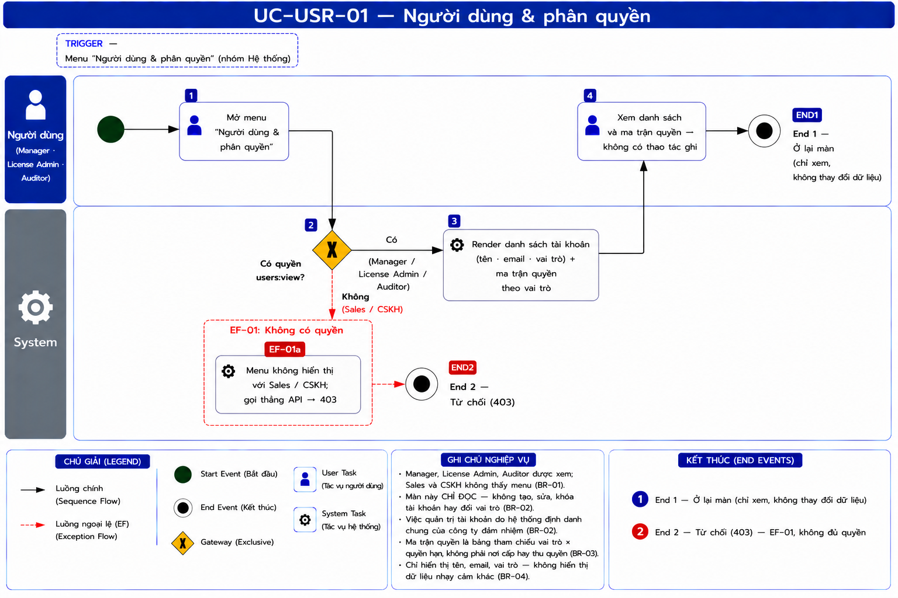
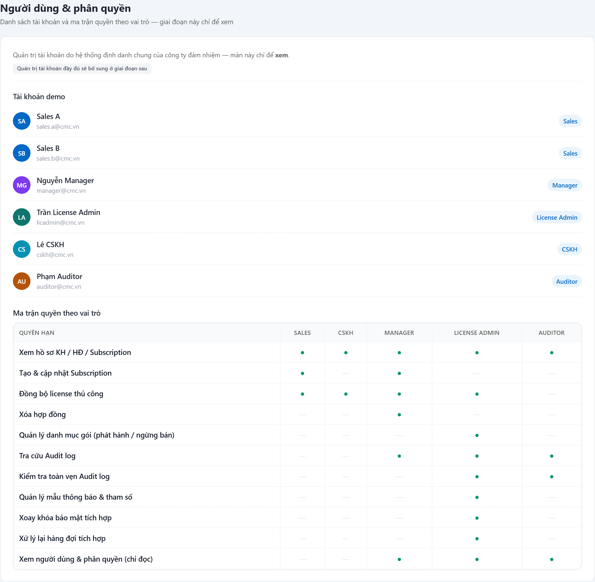

# UC-USR-01 — Người dùng & phân quyền

> Module: Nền tảng (menu riêng, nhóm Hệ thống) — liên quan **USER_PROFILE (Phase 2+ skeleton)** | Phiên bản: 1.0 | Ngày: 17/07/2026
> Trạng thái: Draft for Review

---

## 1. Thông tin chung

| Thuộc tính | Nội dung |
|---|---|
| **Mã Use Case** | UC-USR-01 |
| **Tên** | Người dùng & phân quyền |
| **Mô tả** | Màn **chỉ-đọc** để tra cứu **danh sách tài khoản** và **ma trận quyền theo vai trò** (ai được làm gì). Giai đoạn này quản trị tài khoản do **hệ thống định danh chung của công ty (IAM)** đảm nhiệm — màn này chỉ để **xem**, chưa CRUD tài khoản. |
| **Tác nhân** | License Admin · Manager · Auditor *(đều chỉ đọc)* |
| **Tiền điều kiện** | Đã đăng nhập; có quyền xem (`users:view`). |
| **Hậu điều kiện** | Chỉ đọc — không thay đổi dữ liệu. |
| **Trigger** | Menu **Người dùng & phân quyền** (nhóm Hệ thống). |
| **Liên kết** | UC-AUD-01 / UC-SET-* (các quyền trong ma trận map tới hành động ở những UC đó), USER_PROFILE (§5.3.15). |

### Business Rules

| Mã | Nội dung | Lý do / Ghi chú |
|---|---|---|
| **BR-01** | **Phân quyền xem = License Admin · Manager · Auditor.** Sales / CSKH **không thấy menu**; gọi thẳng API → **403**. | Đây là màn **read-only tham chiếu**: Manager giám sát đội → cần biết ai vai trò gì; Auditor kiểm toán → cần biết ai được làm gì. Xem không rủi ro nên mở rộng hơn Cấu hình (chỉ Admin). |
| **BR-02** | **Chỉ ĐỌC — không CRUD tài khoản** ở màn này (Phase 1). Tạo/khóa/đổi vai trò tài khoản do **IAM chung của công ty** đảm nhiệm. | PRD USER_PROFILE là **skeleton Phase 2+** (§5.3.15) — chưa implement quản trị đầy đủ. |
| **BR-03** | **Ma trận quyền = tham chiếu persona × capability** (Sales / CSKH / Manager / License Admin / Auditor). Nguồn sự thật là **cấu hình quyền phía code** (capability sets per module). | Giúp mọi bên hiểu ranh giới quyền; không phải nơi cấp/thu quyền. |
| **BR-04** | **Không hiển thị dữ liệu nhạy cảm** ngoài mức cần (tên, email, vai trò). | Bảo vệ dữ liệu tài khoản. |

### Ma trận quyền (tham chiếu — BR-03)

| Quyền hạn | Sales | CSKH | Manager | License Admin | Auditor |
|---|:--:|:--:|:--:|:--:|:--:|
| Xem hồ sơ KH / HĐ / Subscription | ● | ● | ● | ● | ● |
| Tạo & cập nhật Subscription | ● | — | ● | — | — |
| Đồng bộ license thủ công | ● | ● | ● | ● | — |
| Xóa hợp đồng | — | — | ● | — | — |
| Quản lý danh mục gói (phát hành / ngừng bán) | — | — | — | ● | — |
| Tra cứu Audit log | — | — | ● | ● | ● |
| Kiểm tra toàn vẹn Audit log | — | — | — | ● | ● |
| Quản lý mẫu thông báo & tham số | — | — | — | ● | — |
| Xoay khóa bảo mật tích hợp | — | — | — | ● | — |
| Xử lý lại hàng đợi tích hợp | — | — | — | ● | — |
| Xem người dùng & phân quyền (chỉ đọc) | — | — | ● | ● | ● |

---

## 2. Luồng nghiệp vụ



### 2.1 Luồng chính

| Bước | Actor | Hành động / Phản hồi |
|---|---|---|
| **1** | Người dùng | Mở menu **Người dùng & phân quyền**. |
| **2** | System | **[Gateway — Có quyền `users:view`?]**<br>→ **[Có]** (Manager / License Admin / Auditor): tiếp bước 3.<br>→ **[Không]** (Sales / CSKH): sang **EF-01**. |
| **3** | System | Render **danh sách tài khoản** (tên, email, vai trò) + **ma trận quyền** theo vai trò (BR-03). |
| **4** | Người dùng | Xem / cuộn. Không có thao tác ghi → **End 1**. |

### 2.2 Luồng ngoại lệ

**[EF-01: Không có quyền]** — tại bước 2.

| Bước | Actor | Hành động / Phản hồi |
|---|---|---|
| **EF-01a** | System | Menu **không hiển thị** với Sales / CSKH; gọi thẳng API → **403** → **End 2**. |

### 2.3 Điểm kết thúc

| End | Mô tả |
|---|---|
| **End 1** | Ở lại màn (xem). |
| **End 2** | Từ chối (403). |

---

## 3. Mô tả giao diện

Demo: `v2.8.0_audit_notification.html`, menu **Người dùng & phân quyền** (`usersRender`).



```
Người dùng & phân quyền — chỉ để xem
Tài khoản demo
  SA  Sales A            sales.a@cmc.vn         [Sales]
  MG  Nguyễn Manager     manager@cmc.vn         [Manager]
  LA  Trần License Admin licadmin@cmc.vn        [License Admin]
  ...
Ma trận quyền theo vai trò
  Quyền hạn                         │ Sales │ CSKH │ Manager │ Lic.Admin │ Auditor
  Xem hồ sơ KH/HĐ/Sub               │  ●    │  ●   │   ●     │    ●      │   ●
  Xóa hợp đồng                      │  —    │  —   │   ●     │    —      │   —
  ...
```

### 3.1 Các thành phần

| # | Thành phần | Loại | Mô tả |
|---|---|---|---|
| 1 | Danh sách tài khoản | List | Avatar + tên + email + badge vai trò. |
| 2 | Ma trận quyền | Table | Hàng = quyền hạn; cột = vai trò; ● có / — không. |
| 3 | *(Không có nút ghi)* | — | Read-only — không CRUD (BR-02). |

---

## 4. Acceptance Criteria

| Mã | Given | When | Then |
|---|---|---|---|
| AC-USR-01-01 | **Manager** đăng nhập. | Mở menu Người dùng & phân quyền. | Xem được danh sách tài khoản + ma trận quyền (BR-01). |
| AC-USR-01-02 | **Auditor** đăng nhập. | Mở màn. | Xem được đầy đủ; **không** có nút tạo/sửa/xóa (BR-01, BR-02). |
| AC-USR-01-03 | **License Admin** đăng nhập. | Mở màn. | Xem được đầy đủ (BR-01). |
| AC-USR-01-04 | **Sales / CSKH** đăng nhập. | — | **Không thấy** menu; API → **403** (BR-01, EF-01). |
| AC-USR-01-05 | Bất kỳ vai trò xem được. | Đọc ma trận quyền. | Ô đúng khớp cấu hình quyền phía code (vd Xóa hợp đồng = chỉ Manager) (BR-03). |

---

## 5. Review Checklist

### Lịch sử thay đổi

| Phiên bản | Ngày | Tác giả | Mô tả |
|---|---|---|---|
| 1.0 | 17/07/2026 | Claude (AI) | Khởi tạo từ demo v2.8. Tách **menu riêng** (khỏi Cấu hình) trong nhóm Hệ thống; mở quyền xem cho **Manager + Auditor** (không chỉ Admin) vì là màn read-only tham chiếu (BR-01). USER_PROFILE full CRUD defer Phase 2+ (BR-02). |
| 1.1 | 17/07/2026 | Claude (AI) | Nhúng **ảnh chụp màn thật** từ demo v2.8 vào §3 (`UC-USR-01_screen_users.png`). Đối chiếu ảnh: khớp 6 tài khoản (tên/email/badge vai trò) + **ma trận 11 quyền × 5 vai trò**, không có nút ghi nào (read-only). |

### Nghiệp vụ
- ✅ Read-only tham chiếu; mở đúng cho Manager/Auditor giám sát-kiểm toán, chặn Sales/CSKH
- ✅ Không kéo CRUD tài khoản vào Phase 1 (do IAM chung); ma trận quyền là tham chiếu
- ⚠️ **OQ-S6**: khi triển khai USER_PROFILE (Phase 2+), chốt ranh giới giữa **IAM chung** (định danh, tạo/khóa tài khoản) và **CRM** (gán vai trò/capability) — ai là nguồn sự thật cho vai trò?

---

## Footer

| Mục | Nội dung |
|---|---|
| **Giao diện** | ✅ Có demo — `v2.8.0_audit_notification.html`, menu "Người dùng & phân quyền" |
| **UC liên quan** | UC-SET-01/02/03, UC-AUD-01, và mọi UC có kiểm quyền |
| **Trace PRD** | OneCRM_PRD §5.3.15 (USER_PROFILE, Phase 2+ skeleton); mục Personas |
