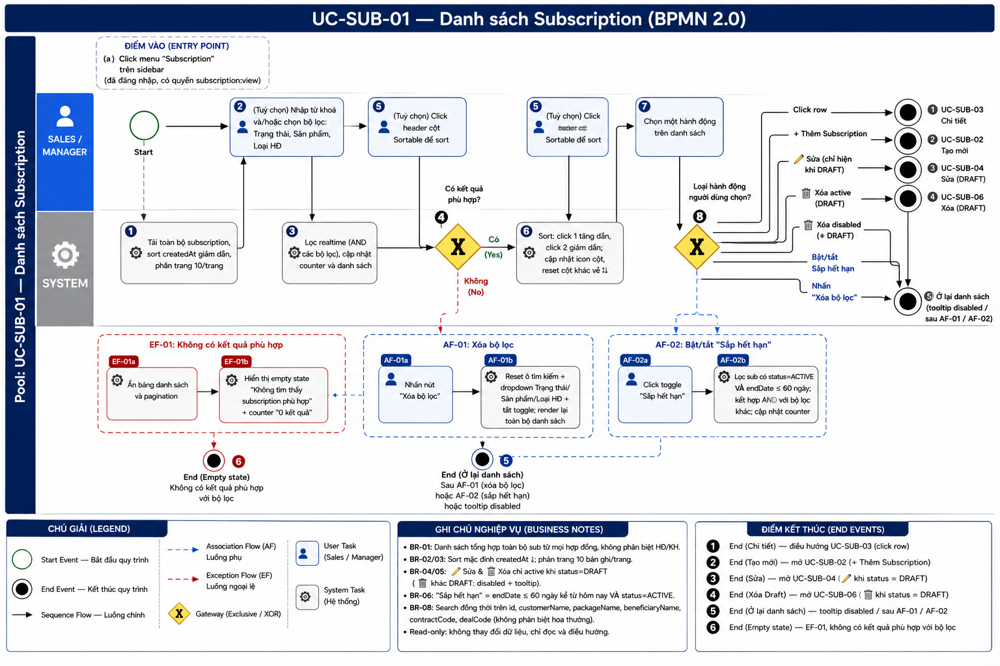
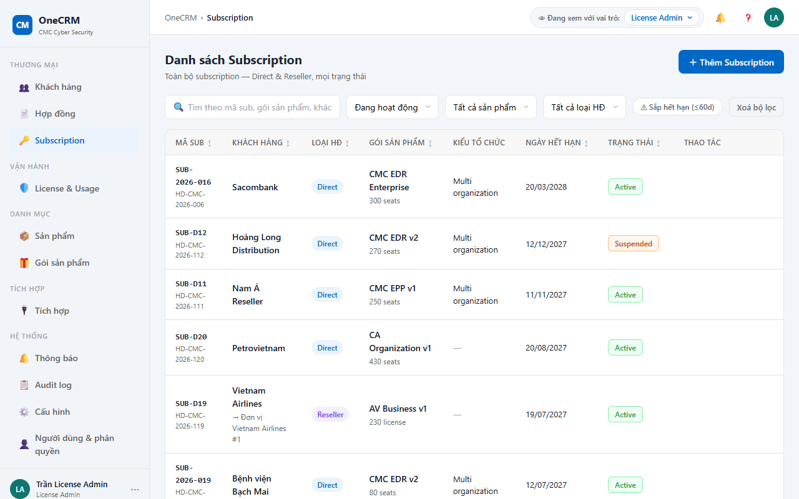
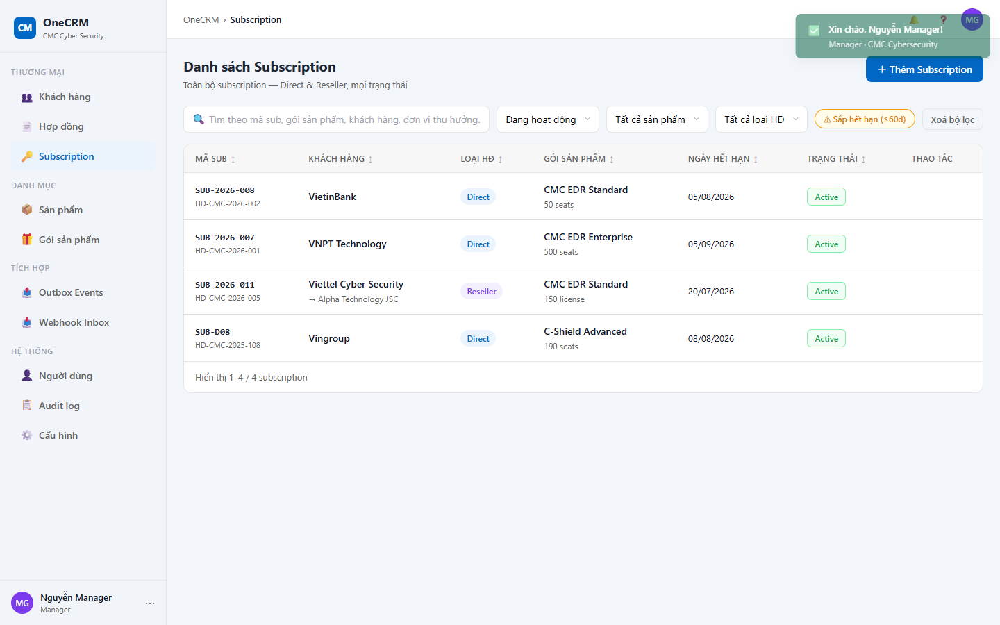

# UC-SUB-01 — Danh sách Subscription

> Module: M-03 Subscription Management | Phiên bản: 1.1 | Ngày: 08/07/2026
> Trạng thái: Draft for Review

---

## 1. Thông tin chung

| Thuộc tính | Nội dung |
|---|---|
| **Mã Use Case** | UC-SUB-01 |
| **Tên** | Danh sách Subscription |
| **Mô tả** | Sales / Manager xem, tìm kiếm, lọc và sort toàn bộ subscription từ tất cả hợp đồng. Đây là điểm vào trung tâm của module Subscription. |
| **Tác nhân** | Sales, Manager |
| **Tiền điều kiện** | Đã đăng nhập hệ thống; có quyền `subscription:view`. |
| **Hậu điều kiện** | Không thay đổi dữ liệu. Chỉ đọc và điều hướng. Danh sách hiển thị mặc định theo `sub.createdAt` giảm dần. |
| **Trigger** | Người dùng click menu "Subscription" trên sidebar. |
| **Liên kết** | UC-SUB-02 (Tạo mới), UC-SUB-03 (Chi tiết), UC-SUB-04 (Chỉnh sửa), UC-SUB-06 (Xóa Draft) |

### Business Rules

| Mã | Nội dung |
|---|---|
| **BR-01** | Danh sách tổng hợp toàn bộ subscription từ tất cả hợp đồng, không phân biệt hợp đồng hay khách hàng. |
| **BR-02** | Sort mặc định theo `sub.createdAt` giảm dần (bản ghi mới nhất lên đầu). |
| **BR-03** | Phân trang 10 bản ghi/trang. |
| **BR-04** | Nút ✏️ Sửa: chỉ hiển thị và active khi `sub.status = DRAFT`. Ẩn hoàn toàn với các trạng thái khác. |
| **BR-05** | Nút 🗑️ Xóa: chỉ hiển thị và active khi `sub.status = DRAFT`. Với các trạng thái khác: hiển thị ở trạng thái `disabled`, tooltip "Chỉ xóa được khi ở trạng thái Draft". |
| **BR-06** | Filter "Sắp hết hạn": lọc các sub có `sub.endDate` trong vòng 60 ngày kể từ hôm nay VÀ `sub.status = ACTIVE`. |
| **BR-07** | Bảy trạng thái subscription: `DRAFT`, `PENDING_PROVISION`, `ACTIVE`, `SUSPENDED`, `EXPIRED`, `REVOKED`, `RENEWED`. Mỗi trạng thái hiển thị badge màu riêng biệt (xem §3.2). |
| **BR-08** | Tìm kiếm áp dụng đồng thời trên các field: `sub.id`, `sub.customerName`, `sub.packageName`, `sub.beneficiaryName`, `sub.contractCode`, `sub.dealCode`. Không phân biệt hoa thường. |
| **BR-09** | Filter Sản phẩm lọc theo `sub.productId` (CMC_EDR / C_SHIELD / AV / CA). Mặc định là "Tất cả sản phẩm" (không filter). Kết hợp AND với các bộ lọc khác. |

---

## 2. Luồng nghiệp vụ

### 2.1 Luồng chính

> Số bước khớp badge trong ảnh BPMN. Bước **4** và **8** là Gateway (XOR) — điều kiện rẽ nhánh ghi gọn trong cùng ô. Trigger (click menu "Subscription") là **điểm vào**, không đánh số bước. Đây là màn hình hub-lite: gateway hành động (bước 8) fan ra nhiều End Event.

| Bước | Tác nhân | Hành động / Phản hồi | Ghi chú |
|---|---|---|---|
| **1** | System | Tải toàn bộ subscription, sort mặc định `sub.createdAt` giảm dần, phân trang 10 bản ghi/trang. | BR-01, BR-02, BR-03 |
| **2** | Sales / Manager | *(Tuỳ chọn)* Nhập từ khoá và/hoặc chọn bộ lọc: Trạng thái, Sản phẩm, Loại HĐ. | BR-08, BR-09 |
| **3** | System | Lọc realtime (AND các bộ lọc), cập nhật counter và danh sách. | — |
| **4** | System | **[Gateway — Có kết quả phù hợp?]** Có → tiếp bước 5. Không → **EF-01**. | — |
| **5** | Sales / Manager | *(Tuỳ chọn)* Click header cột Sortable để sort. | Chỉ các cột có nhãn "Sortable" |
| **6** | System | Áp dụng sort (click lần 1 → tăng dần, lần 2 → giảm dần); cập nhật icon cột đó; reset các cột còn lại về `↕`. | — |
| **7** | Sales / Manager | Chọn một hành động trên danh sách. | — |
| **8** | System | **[Gateway — Loại hành động?]** — fan nhiều nhánh: • Click row → **End 1** • "+ Thêm Subscription" → **End 2** • ✏️ Sửa (DRAFT) → **End 3** • 🗑️ Xóa active (DRAFT) → **End 4** • 🗑️ Xóa disabled (≠ DRAFT: hiện tooltip) → **End 5** • Bật/tắt "Sắp hết hạn" → **AF-02** • Nhấn "Xóa bộ lọc" → **AF-01** | BR-04, BR-05 |

### 2.2 Luồng phụ

**[AF-01: Xóa bộ lọc]** — kích hoạt tại **bước 8** (và từ **EF-01** khi nhấn "Xóa bộ lọc" trên empty state).

| Bước | Tác nhân | Hành động / Phản hồi |
|---|---|---|
| **AF-01a** | Sales / Manager | Nhấn nút "Xóa bộ lọc". |
| **AF-01b** | System | Reset ô tìm kiếm về rỗng + dropdown (Trạng thái, Sản phẩm, Loại HĐ) về "Tất cả" + tắt toggle "Sắp hết hạn"; render lại toàn bộ danh sách không filter. |
| → | — | **End 5 (Ở lại danh sách)** — danh sách đầy đủ hiển thị lại, không điều hướng. |

**[AF-02: Bật / tắt filter "Sắp hết hạn"]** — kích hoạt tại **bước 8**.

| Bước | Tác nhân | Hành động / Phản hồi |
|---|---|---|
| **AF-02a** | Sales / Manager | Click toggle "Sắp hết hạn". |
| **AF-02b** | System | Lọc sub có `status = ACTIVE` VÀ `endDate` ≤ 60 ngày kể từ hôm nay (kết hợp AND với các bộ lọc khác); cập nhật counter và danh sách. Click lại toggle để bỏ điều kiện, render lại với các bộ lọc còn lại. |
| → | — | **End 5 (Ở lại danh sách)** — không điều hướng. |

### 2.3 Luồng ngoại lệ

**[EF-01: Không có kết quả phù hợp]** — kích hoạt tại **bước 4** khi tìm kiếm / bộ lọc không khớp bản ghi nào.

| Bước | Tác nhân | Hành động / Phản hồi |
|---|---|---|
| **EF-01a** | System | Ẩn bảng danh sách và pagination. |
| **EF-01b** | System | Hiển thị empty state: icon minh hoạ + text "Không tìm thấy subscription phù hợp với bộ lọc hiện tại"; counter "0 kết quả"; nút "Xóa bộ lọc". |
| **EF-01c** | Sales / Manager | *(Tuỳ chọn)* Nhấn "Xóa bộ lọc" trên empty state → **AF-01**. |
| → | — | **End 6 (Empty state)** — không có kết quả phù hợp với bộ lọc hiện tại. |

### 2.4 Điểm kết thúc (End Events)

| # | Tên | Điều kiện |
|---|---|---|
| **End 1** | Chi tiết — điều hướng UC-SUB-03 | Click row trong danh sách (bước 8) |
| **End 2** | Tạo mới — mở UC-SUB-02 | Nhấn "+ Thêm Subscription" (bước 8) |
| **End 3** | Sửa — mở UC-SUB-04 | Nhấn ✏️ khi `sub.status = DRAFT` (bước 8, BR-04) |
| **End 4** | Xóa Draft — mở UC-SUB-06 | Nhấn 🗑️ khi `sub.status = DRAFT` (bước 8, BR-05) |
| **End 5** | Ở lại danh sách | Nhấn 🗑️ disabled (≠ DRAFT → chỉ hiện tooltip) / sau **AF-01** (Xóa bộ lọc) / sau **AF-02** (Sắp hết hạn) |
| **End 6** | Empty state | **EF-01** — không có kết quả phù hợp với bộ lọc |

---

## 3. Mô tả giao diện

### 3.1 Tổng quan màn hình

> **Demo HTML:** [docs/demo/v2.4.0_subscriptions.html](../../demo/v2.4.0_subscriptions.html)

Màn hình Danh sách Subscription gồm 3 khu vực chính:
1. **Thanh công cụ (Toolbar):** Ô tìm kiếm, multi-select Trạng thái, dropdown Sản phẩm, dropdown Loại HĐ, toggle "Sắp hết hạn", nút "Xóa bộ lọc", nút "+ Thêm Subscription".
2. **Bảng danh sách:** Hiển thị subscription theo bộ lọc và sort hiện tại.
3. **Thanh phân trang (Pagination):** Counter tổng số kết quả và điều hướng trang.

**Screenshot — Màn hình mặc định:**

**Screenshot — Filter "Sắp hết hạn" đang bật:**

### 3.2 Mô tả component

#### Thanh công cụ

| Component | Loại | Mô tả |
|---|---|---|
| Ô tìm kiếm | Text input | Tìm theo mã sub, tên khách hàng, gói sản phẩm, đơn vị thụ hưởng, mã hợp đồng, deal code. Filter realtime khi gõ. Placeholder: "Tìm theo mã sub, gói sản phẩm, khách hàng, đơn vị thụ hưởng, mã HĐ, deal code...". |
| Multi-select Trạng thái | Multi-select checkbox dropdown | Mặc định: **Tất cả trạng thái** (không chọn gì). Cho phép tích chọn nhiều trạng thái đồng thời. Label nhãn bằng tiếng Việt (xem bảng badge). Khi chọn N option → chỉ hiển thị sub có status thuộc tập đã chọn (OR logic). |
| Dropdown Sản phẩm | Select | Các giá trị: **Tất cả sản phẩm** (mặc định), CMC EDR, C-Shield, AV, CA. Lọc theo `sub.productId`. |
| Dropdown Loại HĐ | Select | Các giá trị: **Tất cả loại** (mặc định), DIRECT, RESELLER. |
| Toggle "Sắp hết hạn" | Toggle button | Khi bật: chỉ hiện sub ACTIVE có `endDate` ≤ 60 ngày. Kết hợp AND với các filter khác. |
| Nút "Xóa bộ lọc" | Ghost button | Luôn hiển thị. Thực hiện AF-01. |
| Nút "+ Thêm Subscription" | Primary button | Mở UC-SUB-02. |

#### Bảng danh sách

| # | Cột | Nguồn dữ liệu | Mô tả hiển thị | Sortable |
|---|---|---|---|---|
| 1 | **Mã Sub** | `sub.id` | Font monospace, màu navy, bold. | ✅ |
| 2 | **Khách hàng** | `sub.customerName`, `sub.beneficiaryName` | Dòng 1: tên khách hàng. Dòng 2 (chỉ RESELLER): "→ {tên đơn vị thụ hưởng}", font nhỏ, màu xám. | ✅ |
| 3 | **Loại HĐ** | `sub.contractType` | Badge: `DIRECT` → nền xanh dương nhạt, chữ xanh đậm; `RESELLER` → nền vàng nhạt, chữ nâu. | ✅ |
| 4 | **Gói sản phẩm** | `sub.packageName` | Text thường. | ✅ |
| 5 | **Ngày hết hạn** | `sub.endDate` | Định dạng `dd/MM/yyyy`. Hiển thị "—" khi `endDate = null`. Màu đỏ khi `endDate` < hôm nay VÀ `status = ACTIVE`. | ✅ |
| 6 | **Trạng thái** | `sub.status` | Badge màu theo trạng thái (xem bảng badge bên dưới). | ✅ |
| 7 | **Thao tác** | — | Nút ✏️ Sửa: chỉ hiện khi `status = DRAFT` (BR-04). Nút 🗑️ Xóa: disabled với tooltip khi không phải DRAFT, active khi DRAFT (BR-05). | ❌ |

#### Badge trạng thái

| Trạng thái | Màu nền | Màu chữ | Nhãn hiển thị |
|---|---|---|---|
| DRAFT | Xám nhạt | Xám đậm | Draft |
| PENDING_PROVISION | Vàng nhạt | Nâu vàng | Chờ kích hoạt |
| ACTIVE | Xanh lá nhạt | Xanh lá đậm | Đang hoạt động |
| SUSPENDED | Cam nhạt | Cam đậm | Tạm dừng |
| EXPIRED | Đỏ nhạt | Đỏ đậm | Hết hạn |
| REVOKED | Đỏ đậm | Trắng | Đã thu hồi |
| RENEWED | Xanh dương nhạt | Xanh dương đậm | Đã gia hạn |

#### Pagination

| Component | Mô tả |
|---|---|
| Counter | Hiển thị "X–Y / N subscription". |
| Phân trang | 10 bản ghi/trang (BR-03). Nút trang hiện tại được highlight. |
| Ẩn khi EF-01 | Không hiển thị khi danh sách rỗng. |

---

## 4. Acceptance Criteria

### Nhóm 1: Hiển thị danh sách cơ bản

| Mã | Given | When | Then |
|---|---|---|---|
| AC-SUB-01-01 | Hệ thống có 15 subscription từ 5 hợp đồng khác nhau. | Mở màn hình Danh sách. | Hiển thị 10 bản ghi đầu tiên (trang 1/2), sort theo `createdAt` giảm dần. Counter hiển thị "1–10 / 15 subscription". |
| AC-SUB-01-02 | Sub thuộc hợp đồng RESELLER, có `beneficiaryName = "Công ty ABC"`. | Xem cột Khách hàng. | Dòng 1: tên khách hàng. Dòng 2: "→ Công ty ABC". |
| AC-SUB-01-03 | Sub có `endDate = null`. | Xem cột Ngày hết hạn. | Hiển thị "—". |
| AC-SUB-01-04 | Sub có status = DRAFT. | Xem cột Thao tác. | Nút ✏️ và 🗑️ cùng hiển thị và active. |
| AC-SUB-01-05 | Sub có status = ACTIVE. | Xem cột Thao tác. | Nút ✏️ ẩn. Nút 🗑️ hiển thị ở trạng thái disabled. Hover hiện tooltip "Chỉ xóa được khi ở trạng thái Draft". |

### Nhóm 2: Tìm kiếm

| Mã | Given | When | Then |
|---|---|---|---|
| AC-SUB-01-06 | Có sub mã "SUB-2026-001". | Nhập "2026-001" vào ô tìm kiếm. | Chỉ hiển thị sub match. Counter cập nhật. |
| AC-SUB-01-07 | Có sub của khách hàng "FPT Software". | Nhập "fpt" (chữ thường) vào ô tìm kiếm. | Hiển thị tất cả sub của FPT Software (không phân biệt hoa thường). |
| AC-SUB-01-08 | Có sub với `beneficiaryName = "Mekong Foods"`. | Nhập "Mekong" vào ô tìm kiếm. | Sub đó hiển thị trong kết quả. |
| AC-SUB-01-09 | Nhập từ khoá không khớp bất kỳ field nào. | Nhập "xxxxxxx". | Gateway bước 4 → **EF-01**: empty state hiển thị, counter "0 kết quả", pagination ẩn. Kết thúc tại **End 6 (Empty state)**. |

### Nhóm 3: Lọc

| Mã | Given | When | Then |
|---|---|---|---|
| AC-SUB-01-10 | Danh sách có sub với nhiều trạng thái khác nhau. | Tích chọn "Đang hoạt động" trong filter Trạng thái. | Chỉ hiển thị sub có `status = ACTIVE`. |
| AC-SUB-01-11 | Danh sách có cả sub DIRECT và RESELLER. | Chọn filter "RESELLER". | Chỉ hiển thị sub thuộc hợp đồng RESELLER. |
| AC-SUB-01-12 | Có 3 sub ACTIVE: 1 hết hạn sau 15 ngày, 1 sau 45 ngày, 1 sau 90 ngày. | Bật toggle "Sắp hết hạn" (AF-02). | Chỉ hiển thị sub ACTIVE hết hạn sau 15 ngày và 45 ngày (cả hai ≤ 60 ngày). Sub 90 ngày không hiển thị. Ở lại danh sách (**End 5**). |
| AC-SUB-01-13 | Đang filter "ACTIVE" (status checkbox) + search "FPT" + toggle "Sắp hết hạn" bật. | Nhấn "Xóa bộ lọc" (AF-01). | Tất cả filter reset (tất cả checkbox bỏ chọn, ô tìm kiếm rỗng, toggle tắt), toàn bộ subscription hiển thị. Ở lại danh sách (**End 5**). |
| AC-SUB-01-14 | Đang filter "RESELLER" + search "CMC". | Kết hợp 2 bộ lọc. | Chỉ hiển thị sub RESELLER có chứa "CMC" trong các field tìm kiếm (AND logic). |

### Nhóm 4: Sort

| Mã | Given | When | Then |
|---|---|---|---|
| AC-SUB-01-15 | Chưa sort theo "Ngày hết hạn". | Click header "Ngày hết hạn" lần 1. | Sort tăng dần (gần nhất lên đầu), icon ↑ trên cột đó, các cột khác reset về ↕. |
| AC-SUB-01-16 | Đang sort "Ngày hết hạn" tăng dần. | Click header "Ngày hết hạn" lần 2. | Sort giảm dần, icon ↓. |
| AC-SUB-01-17 | Đang sort "Ngày hết hạn". | Click header "Trạng thái". | Sort theo trạng thái, icon ↑ trên "Trạng thái", cột "Ngày hết hạn" reset về ↕. |

### Nhóm 5: Điều hướng và thao tác

| Mã | Given | When | Then |
|---|---|---|---|
| AC-SUB-01-18 | Sales đang xem danh sách. | Click vào row bất kỳ. | Điều hướng sang UC-SUB-03 (Chi tiết). Kết thúc tại **End 1**. |
| AC-SUB-01-19 | Sales đang xem danh sách. | Click nút "+ Thêm Subscription". | Mở modal UC-SUB-02. Kết thúc tại **End 2**. |
| AC-SUB-01-20 | Sub có status = DRAFT. | Sales click ✏️. | Mở modal UC-SUB-04 với dữ liệu của sub đó. Kết thúc tại **End 3**. |
| AC-SUB-01-21 | Sub có status = DRAFT. | Sales click 🗑️. | Mở modal xác nhận UC-SUB-06. Kết thúc tại **End 4**. |
| AC-SUB-01-22 | Sub có status ≠ DRAFT (ví dụ ACTIVE). | Sales click nút 🗑️ (đang disabled). | Không điều hướng: chỉ hiện tooltip "Chỉ xóa được khi ở trạng thái Draft", ở lại danh sách. Kết thúc tại **End 5**. |

---

## 5. Lịch sử thay đổi

| Phiên bản | Ngày | Người cập nhật | Nội dung |
|---|---|---|---|
| 1.0 | 08/07/2026 | BA Team | Khởi tạo tài liệu — Draft for Review. |
| 1.1 | 08/07/2026 | Claude (AI) | Đồng bộ §2 theo BPMN UC-SUB-01: nhúng ảnh BPMN; gộp "click menu Subscription" vào Trigger, đánh lại số bước 1–8 (bước 1 = System load); tách bước 4 (gateway "Có kết quả?") và bước 8 (gateway hành động fan nhiều nhánh) thành Gateway XOR; chuẩn prefix AF-01/AF-02/EF-01 + gắn End Event; thêm §2.4 liệt kê đủ 6 End Events. §4: căn AC theo bước/End; thêm **AC-22** (🗑️ disabled → End 5); gắn End 1–6 vào AC-09, AC-12, AC-13, AC-18..21. |

### Review Checklist

> Claude tự review — đánh dấu ✅/❌ trước khi submit cho BA review.

#### Nghiệp vụ
- ✅ Luồng chính bao phủ happy path
- ✅ Luồng phụ đã định nghĩa (AF-01 xóa bộ lọc, AF-02 sắp hết hạn)
- ✅ Luồng ngoại lệ đã xử lý (EF-01 không có kết quả)
- ✅ End Events liệt kê đầy đủ (§2.4 — 6 End)
- ✅ BR đã định nghĩa rõ (BR-01 đến BR-09)
- ✅ AC bao phủ các trường hợp quan trọng (5 nhóm, 22 AC)
- ✅ Nội dung bám sát demo v2.4.0

#### Giao diện
- ✅ Mô tả UI đủ chi tiết (toolbar, bảng, badge, pagination)
- ✅ Component states đã mô tả (disabled button + tooltip, empty state)
- ✅ Badge trạng thái đã định nghĩa đủ 7 loại
