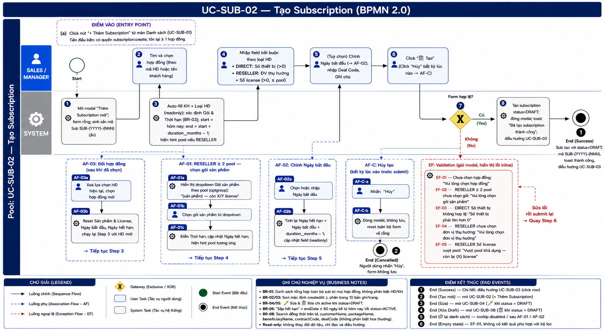
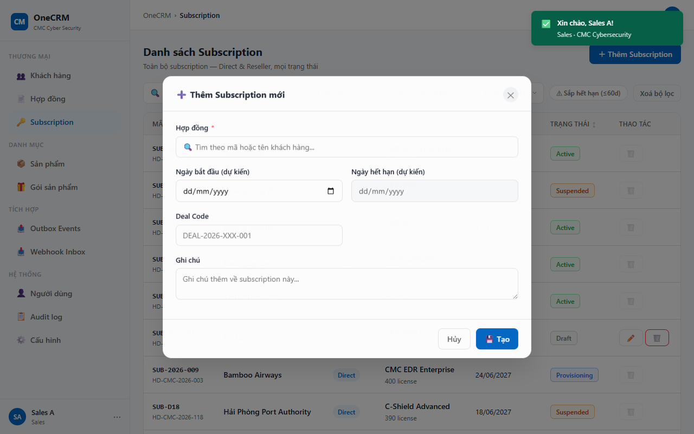
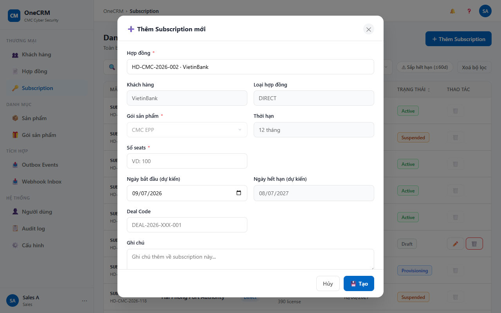
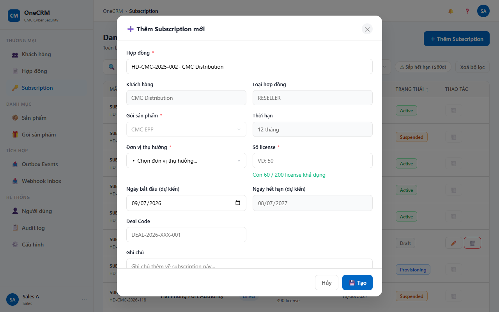

# UC-SUB-02 — Tạo Subscription

> Module: M-03 Subscription Management | Phiên bản: 1.3 | Ngày: 13/07/2026
> Trạng thái: Draft for Review

---

## 1. Thông tin chung

| Thuộc tính | Nội dung |
|---|---|
| **Mã Use Case** | UC-SUB-02 |
| **Tên** | Tạo Subscription |
| **Mô tả** | Sales / Manager tạo mới một subscription ở trạng thái DRAFT. Subscription được liên kết với một hợp đồng cụ thể. Gói sản phẩm và thời hạn được xác định tự động từ hợp đồng hoặc do người dùng chọn tuỳ theo loại hợp đồng. |
| **Tác nhân** | Sales, Manager |
| **Tiền điều kiện** | Đã đăng nhập; có quyền `subscription:create`; tồn tại ít nhất một hợp đồng trong hệ thống. |
| **Hậu điều kiện** | (Thành công) Subscription mới được tạo với `status = DRAFT`. Hệ thống điều hướng sang UC-SUB-03 (Chi tiết). (Thất bại) Dữ liệu không thay đổi, form giữ nguyên giá trị đã nhập. |
| **Trigger** | Người dùng click nút "+ Thêm Subscription" từ UC-SUB-01. |
| **Liên kết** | UC-SUB-01 (Danh sách), UC-SUB-03 (Chi tiết — điều hướng sau khi tạo), UC-SUB-05 (Xác nhận) |

### Business Rules

| Mã | Nội dung |
|---|---|
| **BR-01** | Mã Subscription được hệ thống tự động sinh theo định dạng `SUB-{YYYY}-{NNN}` (năm hiện tại, số thứ tự 3 chữ số, tăng dần). Người dùng không nhập tay. |
| **BR-02** | Subscription mới tạo luôn có `status = DRAFT`. |
| **BR-03** | Gói sản phẩm (package) được xác định theo loại hợp đồng: (a) DIRECT → tự động lấy `contract.packages[0]`, người dùng không được thay đổi; (b) RESELLER có 1 pool → tự động lấy **gói đã ghim của pool đó** (`pool.packageId`), người dùng không được thay đổi; (c) RESELLER có ≥ 2 pool → người dùng chọn từ dropdown, **mỗi pool là một lựa chọn** (1 pool = 1 gói). |
| **BR-12** | Gói sản phẩm **kế thừa từ hợp đồng đã ghim phiên bản** (`contract.packages[]` / `pool.packageId` = `package_id` của 1 version cụ thể). Hệ thống **KHÔNG** tra cứu bản `ACTIVE` hiện hành của catalog. Nếu catalog đã publish version mới hoặc đã ngừng bán version đã ghim, sub mới vẫn dùng **đúng version của hợp đồng** — kể cả khi gói đó `RETIRED` (ngừng bán chỉ chặn **tạo HĐ mới**, không chặn tạo sub trong HĐ đã ký). |
| **BR-04** | Thời hạn (duration) được tự động lấy từ `package.duration_months` sau khi gói được xác định. Người dùng không nhập tay. |
| **BR-05** | Ngày hết hạn (dự kiến) = Ngày bắt đầu + `duration_months` - 1 ngày. Nếu người dùng chưa nhập ngày bắt đầu khi gói được xác định, hệ thống mặc định lấy ngày hiện tại làm ngày bắt đầu. |
| **BR-06** | DIRECT: bắt buộc nhập Số thiết bị (> 0). Không có Đơn vị thụ hưởng, không có Số license. |
| **BR-07** | RESELLER: bắt buộc chọn Đơn vị thụ hưởng và nhập Số license (> 0). Không có Số thiết bị. |
| **BR-08** | Số license không được vượt quá số license còn lại trong pool tương ứng. **Pool tương ứng được tra theo `packageId`** (pool ghim theo gói, không theo sản phẩm). Hệ thống hiển thị hint "Còn X / Y license khả dụng" ngay sau khi xác định được gói sản phẩm. |
| **BR-09** | Các field Khách hàng, Loại hợp đồng, Gói sản phẩm, Thời hạn, Ngày hết hạn đều là readonly — tự động điền từ dữ liệu hợp đồng, người dùng không chỉnh sửa. |
| **BR-10** | Ngày bắt đầu và Ngày hết hạn là **dự kiến** — không phải nguồn sự thật. Sau khi Product Module kích hoạt license, ngày hết hạn thực sẽ được đồng bộ lại qua webhook `license.active`. |
| **BR-11** | **Cấu hình sản phẩm (scope):** sau khi xác định gói, nếu Product Module của sản phẩm khai báo `scope_schema` (PRD §5.3.7), form hiển thị mục "Cấu hình sản phẩm" với các trường do sản phẩm định nghĩa. Với **CMC EDR**: trường **Kiểu tổ chức** (`tenant_mode`) — `MULTI` (Multi organization) hoặc `SINGLE` (Single organization), bắt buộc, mặc định `MULTI`. Scope là cấu hình riêng của từng sub (per-customer), lưu vào `subscription.scope` (jsonb). Sản phẩm không khai báo `scope_schema` → không hiển thị mục này, `scope = null`. |

---

## 2. Luồng nghiệp vụ

### 2.1 Luồng chính

> Số bước khớp badge trong ảnh BPMN (1–8). Bước **7** là Gateway (XOR) — điều kiện rẽ nhánh ghi gọn trong cùng ô. Điểm vào (Entry Point): người dùng click "+ Thêm Subscription" từ UC-SUB-01 (xem §1 Trigger / Tiền điều kiện).

| Bước | Tác nhân | Hành động / Phản hồi | Ghi chú |
|---|---|---|---|
| **1** | System | Mở modal "Thêm Subscription mới"; form rỗng; sinh sẵn mã Sub `SUB-{YYYY}-{NNN}` (ẩn, không hiện trên form). | BR-01 |
| **2** | User (Sales / Manager) | Tìm và chọn hợp đồng (theo mã HĐ hoặc tên khách hàng). | Chọn lại HĐ khác → **AF-03** |
| **3** | System | Auto-fill Khách hàng + Loại hợp đồng (readonly); xác định Gói & Thời hạn theo loại HĐ; mặc định Ngày bắt đầu = hôm nay; tính Ngày hết hạn = start + `duration_months` − 1; hiện hint pool nếu RESELLER; nếu sản phẩm khai báo `scope_schema` → hiển thị mục **Cấu hình sản phẩm** với giá trị mặc định. | BR-03, BR-04, BR-05, BR-11; RESELLER ≥ 2 pool → **AF-01** |
| **4** | User | Nhập field bắt buộc theo loại HĐ — DIRECT: Số thiết bị (> 0); RESELLER: Đơn vị thụ hưởng + Số license (> 0, ≤ pool); chọn **Cấu hình sản phẩm** (scope) nếu có — vd EDR: Kiểu tổ chức. | BR-06, BR-07, BR-08, BR-11 |
| **5** | User | (Tuỳ chọn) Chỉnh Ngày bắt đầu → Ngày hết hạn tự cập nhật (**AF-02**); nhập Deal Code, Ghi chú. | BR-05 |
| **6** | User | Click "💾 Tạo". | "Hủy" / ✕ bất kỳ lúc nào → **AF-C** |
| **7** | System | **[Gateway — Form hợp lệ?]** Có → tiếp bước 8. Không → **EF** (validation inline). | Validate theo loại HĐ |
| **8** | System | Tạo subscription `status = DRAFT`; đóng modal; toast "Đã tạo subscription thành công"; điều hướng UC-SUB-03 với sub vừa tạo. | BR-02 |
| → | — | **End 1 (Success)** — Sub tạo với `status = DRAFT`, mã `SUB-{YYYY}-{NNN}`; điều hướng sang UC-SUB-03. | — |

### 2.2 Luồng phụ

**[AF-01: RESELLER ≥ 2 pool — chọn gói sản phẩm]** — kích hoạt tại bước 3 khi hợp đồng RESELLER có từ 2 pool trở lên.

| Bước | Tác nhân | Hành động / Phản hồi |
|---|---|---|
| **AF-01a** | System | Hiển thị dropdown Gói sản phẩm — **mỗi pool là 1 option** (1 pool = 1 gói đã ghim), nhãn "{Tên gói} v{version} — còn {X}/{Y} license". |
| **AF-01b** | User | Chọn gói sản phẩm từ dropdown. |
| **AF-01c** | System | Điền Thời hạn từ gói đã chọn; cập nhật Ngày hết hạn (BR-05); hiển thị hint pool khả dụng của pool tương ứng — tra theo `packageId` (BR-08). |
| → | — | Tiếp tục luồng chính từ **bước 4**. |

**[AF-02: Người dùng chỉnh Ngày bắt đầu]** — kích hoạt tại bước 5.

| Bước | Tác nhân | Hành động / Phản hồi |
|---|---|---|
| **AF-02a** | User | Chọn hoặc nhập Ngày bắt đầu. |
| **AF-02b** | System | Tính lại Ngày hết hạn = Ngày bắt đầu + `duration_months` − 1 ngày; cập nhật field Ngày hết hạn (readonly). |
| → | — | Tiếp tục luồng chính từ **bước 5**. |

**[AF-03: Đổi hợp đồng sau khi đã chọn]** — kích hoạt tại bước 2 khi người dùng xoá ô tìm kiếm và chọn lại hợp đồng khác.

| Bước | Tác nhân | Hành động / Phản hồi |
|---|---|---|
| **AF-03a** | User | Xoá lựa chọn hợp đồng hiện tại, chọn hợp đồng mới. |
| **AF-03b** | System | Reset toàn bộ Sản phẩm & License, Ngày bắt đầu, Ngày hết hạn; chạy lại bước 3 với hợp đồng mới. |
| → | — | Tiếp tục luồng chính từ **bước 3**. |

**[AF-C: Hủy tạo]** — kích hoạt tại bất kỳ bước nào (2–6) khi người dùng nhấn "Hủy" hoặc ✕ (nguồn: footer modal §3.3).

| Bước | Tác nhân | Hành động / Phản hồi |
|---|---|---|
| **AF-Ca** | User | Nhấn "Hủy" hoặc ✕ đóng modal. |
| **AF-Cb** | System | Đóng modal, không lưu; reset toàn bộ form về rỗng. |
| → | — | **End 2 (Cancelled)** — không tạo sub, dữ liệu không thay đổi. |

### 2.3 Luồng ngoại lệ

**[EF: Validation — form không hợp lệ]** — kích hoạt tại **bước 7** (Gateway) khi form vi phạm ràng buộc. Lỗi hiển thị inline, giữ nguyên modal; người dùng sửa rồi submit lại (**quay bước 6**). Đây là **vòng lặp sửa lỗi, không phải End Event**.

| Mã | Điều kiện | Thông báo lỗi inline |
|---|---|---|
| **EF-01** | Chưa chọn hợp đồng | "Vui lòng chọn hợp đồng" — dưới ô tìm kiếm hợp đồng |
| **EF-02** | RESELLER ≥ 2 pool — chưa chọn gói sản phẩm | "Vui lòng chọn gói sản phẩm" — dưới dropdown Gói sản phẩm |
| **EF-03** | DIRECT — Số thiết bị ≤ 0 | "Số thiết bị phải lớn hơn 0" — dưới field Số thiết bị |
| **EF-04** | RESELLER — chưa chọn Đơn vị thụ hưởng | "Vui lòng chọn đơn vị thụ hưởng" — dưới dropdown Đơn vị thụ hưởng |
| **EF-05** | RESELLER — Số license > pool khả dụng | "Vượt pool khả dụng — còn lại {X} license" — dưới field Số license |

Với mọi EF: System giữ nguyên form, không đóng modal. Người dùng sửa lỗi rồi submit lại → **quay bước 6** (không kết thúc luồng).

### 2.4 Điểm kết thúc (End Events)

| # | Tên | Điều kiện |
|---|---|---|
| **End 1** | Success — Tạo thành công | Sub tạo với `status = DRAFT`, mã `SUB-{YYYY}-{NNN}`; modal đóng; toast "Đã tạo subscription thành công"; điều hướng UC-SUB-03 |
| **End 2** | Cancelled — AF-C | Người dùng nhấn "Hủy" / ✕ tại bất kỳ bước nào (2–6); không tạo sub; dữ liệu không thay đổi |

*Ghi chú: EF (validation) là vòng lặp sửa lỗi quay về **bước 6**, không phải End Event.*

---

## 3. Mô tả giao diện

### 3.1 Tổng quan

> **Demo HTML:** [docs/demo/v2.4.0_subscriptions.html](../../demo/v2.4.0_subscriptions.html)

Modal "Thêm Subscription mới" gồm 5 phần theo thứ tự từ trên xuống:

1. **Hợp đồng** — ô tìm kiếm có thể tìm theo mã hoặc tên khách hàng.
2. **Thông tin hợp đồng** — readonly, tự hiện sau khi chọn HĐ.
3. **Sản phẩm & License** — gói, thời hạn, fields license/seats tuỳ theo loại HĐ, và mục **Cấu hình sản phẩm** (scope) nếu sản phẩm khai báo schema — vd EDR: Kiểu tổ chức (Multi/Single organization).
4. **Thời gian** — ngày bắt đầu (dự kiến) và ngày hết hạn (dự kiến, readonly).
5. **Bổ sung** — Deal Code và Ghi chú (tuỳ chọn).

**Screenshot — Form khởi đầu (chưa chọn hợp đồng):**

**Screenshot — Form sau khi chọn hợp đồng DIRECT:**

**Screenshot — Form sau khi chọn hợp đồng RESELLER:**

### 3.2 Mô tả các field

| # | Field | Bắt buộc | Loại | Mô tả & Validation |
|---|---|---|---|---|
| 1 | Hợp đồng | ✓ | Searchable dropdown | Tìm theo mã HĐ hoặc tên khách hàng. Mỗi option hiển thị: mã HĐ (monospace) + badge DIRECT/RESELLER + tên khách hàng. Sau khi chọn: hiển thị tên hợp đồng đã chọn trong ô, giá trị ID lưu vào hidden input. |
| 2 | Khách hàng | — | Text readonly | Tự điền từ `contract.customerName` sau khi chọn HĐ. |
| 3 | Loại hợp đồng | — | Text readonly | Tự điền từ `contract.type` (`DIRECT` / `RESELLER`). |
| 4 | Gói sản phẩm | ✓ | Select / Text readonly | Hiển thị tên gói **kèm phiên bản** (vd "CMC EDR v2"). DIRECT & RESELLER 1 pool: readonly, tự điền từ gói đã ghim trên HĐ. RESELLER ≥ 2 pool: dropdown, mỗi pool 1 option kèm số license còn lại. |
| 5 | Thời hạn | — | Text readonly | Tự điền từ `package.duration_months`, định dạng "X tháng". |
| 5b | Cấu hình sản phẩm — Kiểu tổ chức (EDR) | ✓ (EDR) | Radio (2 card ngang) | Thuộc mục "Cấu hình sản phẩm" — chỉ hiện khi sản phẩm khai báo `scope_schema`. EDR: 2 lựa chọn **Multi organization** (`MULTI`, mặc định) / **Single organization** (`SINGLE`), bố cục 2 card ngang, mỗi card có tên + mô tả ngắn. Lưu vào `subscription.scope.tenant_mode`. |
| 6 | Số thiết bị | ✓ (DIRECT) | Number input | Chỉ hiện với DIRECT. Phải > 0. |
| 7 | Đơn vị thụ hưởng | ✓ (RESELLER) | Select | Chỉ hiện với RESELLER. Chọn từ danh sách đơn vị thụ hưởng đã đăng ký. |
| 8 | Số license | ✓ (RESELLER) | Number input | Chỉ hiện với RESELLER. Phải > 0 và ≤ số license còn lại trong pool. Hint "Còn X / Y license khả dụng" hiển thị bên dưới. |
| 9 | Ngày bắt đầu (dự kiến) | — | Date picker | Tuỳ chọn. Nếu để trống khi gói được xác định, hệ thống mặc định hôm nay. |
| 10 | Ngày hết hạn (dự kiến) | — | Date readonly | Tự tính = Ngày bắt đầu + `duration_months` - 1 ngày. Cập nhật realtime khi Ngày bắt đầu thay đổi. |
| 11 | Deal Code | — | Text input | Tuỳ chọn. Không validate format. |
| 12 | Ghi chú | — | Textarea | Tuỳ chọn. |

### 3.3 Footer modal

| Nút | Loại | Hành động |
|---|---|---|
| Hủy | Ghost button | Đóng modal, không lưu (**AF-C** → End 2). |
| 💾 Tạo | Primary button | Submit form, kích hoạt Gateway validate (**bước 7**) rồi tạo sub (**bước 8**). |

---

## 4. Acceptance Criteria

### Nhóm 1: Mở form và reset

| Mã | Given | When | Then |
|---|---|---|---|
| AC-SUB-02-01 | Sales đang ở màn UC-SUB-01. | Click "+ Thêm Subscription" (Điểm vào). | **Bước 1**: Modal mở, ô tìm kiếm HĐ rỗng; phần Thông tin HĐ và Sản phẩm & License ẩn; Ngày bắt đầu và hết hạn rỗng; mã Sub `SUB-{YYYY}-{NNN}` sinh sẵn (ẩn). |
| AC-SUB-02-02 | Đang mở modal, đã chọn HĐ và điền một số field. | Click "Hủy" (**AF-C**) rồi mở lại. | Modal đóng không lưu (**End 2 Cancelled**); mở lại → toàn bộ form reset về trạng thái rỗng ban đầu. |

### Nhóm 2: Chọn hợp đồng và auto-fill

| Mã | Given | When | Then |
|---|---|---|---|
| AC-SUB-02-03 | Có HĐ mã "HD-CMC-2025-001" của "FPT Software". | Nhập "FPT" vào ô tìm kiếm HĐ. | Dropdown hiển thị HĐ của FPT. Mỗi option có badge DIRECT/RESELLER màu tương ứng và tên khách hàng ở dòng 2. |
| AC-SUB-02-04 | Chọn HĐ DIRECT ghim gói "CMC EDR v2, 12 tháng". | Chọn HĐ từ dropdown. | Khách hàng và Loại HĐ tự điền (readonly). Gói sản phẩm tự điền "CMC EDR v2" (readonly). Thời hạn tự điền "12 tháng". Ngày hết hạn tự tính = hôm nay + 12 tháng - 1 ngày. |
| AC-SUB-02-05 | Chọn HĐ RESELLER có 1 pool (gói "CMC EDR v2"). | Chọn HĐ. | Gói sản phẩm tự điền **gói đã ghim của pool** (readonly). Hint "Còn X / Y license khả dụng" hiển thị. Phần Đơn vị thụ hưởng + Số license hiện ra. |
| AC-SUB-02-06 | Chọn HĐ RESELLER có 2 pool (gói "CA Organization v1" + gói "CMC EPP v1"). | Chọn HĐ. | Dropdown Gói sản phẩm hiển thị **2 option** — mỗi option 1 pool, nhãn "{Tên gói} v{version} — còn X/Y license". |
| AC-SUB-02-23 | HĐ DIRECT ghim gói "CMC EDR v2". Catalog sau đó publish "CMC EDR v3" (`ACTIVE`) và ngừng bán v2 (`RETIRED`). | Sales tạo sub mới trên HĐ này. | Gói sản phẩm vẫn tự điền **"CMC EDR v2"** (không nhảy sang v3). Sub tạo được bình thường với `package_id` của v2 (BR-12). |
| AC-SUB-02-07 | Đã chọn HĐ A. | Xoá và chọn lại HĐ B (loại khác) — **AF-03** tại bước 2. | Toàn bộ phần Sản phẩm & License, Ngày bắt đầu, Ngày hết hạn reset và tính lại theo HĐ B (chạy lại **bước 3**). |

### Nhóm 3: Tính ngày

| Mã | Given | When | Then |
|---|---|---|---|
| AC-SUB-02-08 | Đã chọn HĐ, gói 12 tháng, chưa nhập Ngày bắt đầu. | Gói được xác định (auto-fill hoặc người dùng chọn). | Ngày bắt đầu tự điền = hôm nay. Ngày hết hạn = hôm nay + 12 tháng - 1 ngày. |
| AC-SUB-02-09 | Gói 12 tháng. Ngày bắt đầu = 01/08/2026. | Nhập ngày bắt đầu. | Ngày hết hạn tự tính = 31/07/2027. |
| AC-SUB-02-10 | Gói 6 tháng. Ngày bắt đầu = 01/03/2026. | Nhập ngày bắt đầu. | Ngày hết hạn = 31/08/2026 (01/09/2026 - 1 ngày). |

### Nhóm 4: Validate và lỗi

| Mã | Given | When | Then |
|---|---|---|---|
| AC-SUB-02-11 | Form chưa chọn HĐ. | Click "💾 Tạo" (**bước 6**). | Gateway (**bước 7**) → **EF-01**: lỗi inline "Vui lòng chọn hợp đồng"; modal không đóng; giữ modal để sửa rồi submit lại (**quay bước 6**). |
| AC-SUB-02-12 | HĐ DIRECT, Số thiết bị để trống hoặc ≤ 0. | Click "💾 Tạo". | Gateway (**bước 7**) → **EF-03**: lỗi inline "Số thiết bị phải lớn hơn 0"; modal không đóng. |
| AC-SUB-02-13 | HĐ RESELLER, chưa chọn Đơn vị thụ hưởng. | Click "💾 Tạo". | Gateway (**bước 7**) → **EF-04**: lỗi inline "Vui lòng chọn đơn vị thụ hưởng"; modal không đóng. |
| AC-SUB-02-14 | HĐ RESELLER, pool còn 50 license, nhập Số license = 80. | Click "💾 Tạo". | Gateway (**bước 7**) → **EF-05**: lỗi inline "Vượt pool khả dụng — còn lại 50 license"; modal không đóng. |
| AC-SUB-02-15 | HĐ RESELLER ≥ 2 pool, chưa chọn Gói sản phẩm. | Click "💾 Tạo". | Gateway (**bước 7**) → **EF-02**: lỗi inline "Vui lòng chọn gói sản phẩm"; modal không đóng. |

### Nhóm 5: Tạo thành công

| Mã | Given | When | Then |
|---|---|---|---|
| AC-SUB-02-16 | Form hợp lệ (HĐ DIRECT, đủ fields bắt buộc). | Click "💾 Tạo" → Gateway hợp lệ (**bước 7 → 8**). | Sub mới tạo với `status = DRAFT`; mã Sub theo định dạng `SUB-{YYYY}-{NNN}`; modal đóng; toast "Đã tạo subscription thành công"; điều hướng UC-SUB-03. Kết thúc tại **End 1 (Success)**. |
| AC-SUB-02-17 | Form hợp lệ (HĐ RESELLER, đủ fields bắt buộc). | Click "💾 Tạo" → Gateway hợp lệ (**bước 7 → 8**). | Sub mới tạo với `status = DRAFT`, có `beneficiaryId` và `licenseQty`; modal đóng; điều hướng UC-SUB-03. Kết thúc tại **End 1 (Success)**. |
| AC-SUB-02-18 | Sub mới vừa tạo. | Xem màn UC-SUB-03. | Badge trạng thái hiển thị "Draft". Mã Sub, HĐ, gói, ngày hết hạn khớp với form vừa nhập. |
| AC-SUB-02-19 | Đang mở modal, đã nhập một phần dữ liệu. | Nhấn "Hủy" / ✕ tại bất kỳ bước nào (**AF-C**). | Modal đóng, không tạo sub; dữ liệu không thay đổi. Kết thúc tại **End 2 (Cancelled)**. |

### Nhóm 6: Cấu hình sản phẩm (scope)

| Mã | Given | When | Then |
|---|---|---|---|
| AC-SUB-02-20 | Chọn HĐ có sản phẩm CMC EDR. | Gói được xác định (auto-fill hoặc chọn). | Mục "Cấu hình sản phẩm" hiện với trường "Kiểu tổ chức" — 2 card ngang Multi organization / Single organization, mặc định chọn **Multi organization**. |
| AC-SUB-02-21 | HĐ sản phẩm EDR, chọn Kiểu tổ chức = Single organization, form hợp lệ. | Click "💾 Tạo". | Sub tạo với `scope.tenant_mode = "SINGLE"`; giá trị hiển thị lại ở UC-SUB-03. Kết thúc tại **End 1 (Success)**. |
| AC-SUB-02-22 | Chọn HĐ có sản phẩm không khai báo `scope_schema`. | Gói được xác định. | Mục "Cấu hình sản phẩm" **không** hiển thị; sub tạo với `scope = null`. |

---

## 5. Lịch sử thay đổi

| Phiên bản | Ngày | Tác giả | Mô tả |
|---|---|---|---|
| 1.0 | 08/07/2026 | BA Team | Khởi tạo tài liệu — Draft for Review. |
| 1.1 | 09/07/2026 | Claude (AI) | Đồng bộ §2 theo BPMN UC-SUB-02: đánh lại còn 8 bước khớp badge (gateway = **bước 7**); DIRECT/RESELLER gộp trong nội dung task, không tách gateway loại HĐ; chuyển AF/EF sang style block `**[…]** — kích hoạt tại bước N`; **bổ sung AF-C (Hủy tạo) → End 2**; gom trigger EF-01..EF-05 về **bước 7** và nêu rõ EF là vòng lặp sửa lỗi quay **bước 6** (không phải End Event); thêm **§2.4 End Events** (End 1 Success, End 2 Cancelled). §4: căn AC theo bước/End Event; thêm **AC-19** (AF-C → End 2). |
| 1.2 | 10/07/2026 | Claude (AI) | Bổ sung **Cấu hình sản phẩm (scope)** per-sub do Product Module khai báo (`scope_schema`, PRD §5.3.7): thêm **BR-11**; §2.1 bước 3–4 hiển thị & chọn scope; §3.1/§3.2 mô tả mục "Cấu hình sản phẩm" (EDR: Kiểu tổ chức MULTI/SINGLE, 2 card ngang); §4 thêm Nhóm 6 (AC-20..22). Đồng bộ demo `v2.4.0_subscriptions.html` + PRD §5.3.4/§5.3.5 (gỡ `scope_template` khỏi PACKAGE)/§5.3.7. |
| 1.3 | 13/07/2026 | Claude (AI) | **Đồng bộ versioning gói (M-04)**: thêm **BR-12** — gói **kế thừa từ HĐ đã ghim phiên bản**, KHÔNG lấy bản `ACTIVE` hiện hành của catalog; gói `RETIRED` vẫn tạo được sub trong HĐ đã ký. Cập nhật **BR-03** (RESELLER: 1 pool = 1 gói) và **BR-08** (tra pool theo `packageId`). AF-01 đổi từ `optgroup` theo sản phẩm → **mỗi pool 1 option**. Tên gói hiển thị kèm phiên bản. Thêm **AC-SUB-02-23**. Nguồn: `docs/plans/M-04_versioning_decisions.md` (D1, D2, D3). |

### Review Checklist (self-review)

**Nghiệp vụ**
- ✅ Luồng chính 8 bước khớp badge BPMN, gateway ở bước 7
- ✅ Luồng phụ: AF-01 (RESELLER ≥ 2 pool), AF-02 (chỉnh ngày), AF-03 (đổi HĐ), AF-C (hủy tạo)
- ✅ Luồng ngoại lệ EF-01..EF-05 gom về bước 7, là vòng lặp quay bước 6
- ✅ §2.4 End Events: End 1 (Success), End 2 (Cancelled)
- ✅ BR đã định nghĩa rõ (BR-01 đến BR-10)
- ✅ AC bao phủ 5 nhóm, 19 AC, có tham chiếu bước/End Event

**Giao diện**
- ✅ Thứ tự 5 phần của form đã mô tả
- ✅ Readonly fields ghi rõ nguồn dữ liệu
- ✅ Hint pool khả dụng đã mô tả
- ✅ Footer button order đúng: [Hủy] trái · [💾 Tạo] phải
- ✅ Ngày bắt đầu / hết hạn ghi rõ là "dự kiến" (BR-10)
