# UC-SUB-03 — Chi tiết Subscription

> Module: M-03 Subscription Management | Phiên bản: 1.1 | Ngày: 09/07/2026
> Trạng thái: Draft for Review

---

## 1. Thông tin chung

| Thuộc tính | Nội dung |
|---|---|
| **Mã Use Case** | UC-SUB-03 |
| **Tên** | Chi tiết Subscription |
| **Mô tả** | Sales / CSKH / License Admin / Manager / Auditor xem toàn bộ thông tin của một subscription, bao gồm thông tin chung, trạng thái license mirror, timeline sự kiện và audit log. Trang chi tiết là điểm khởi đầu cho mọi hành động chỉnh sửa, xác nhận, gia hạn, tạm dừng hay thu hồi subscription. |
| **Tác nhân** | Sales, CSKH, License Admin, Manager, Auditor |
| **Tiền điều kiện** | Đã đăng nhập hệ thống; có quyền `subscription:view`; subscription tồn tại trong hệ thống. |
| **Hậu điều kiện** | (Thành công) Hiển thị đầy đủ thông tin subscription. Không thay đổi dữ liệu (chỉ đọc). (Thất bại) Giữ nguyên màn hình danh sách, hiển thị toast lỗi. |
| **Trigger** | (1) Người dùng click vào row subscription từ UC-SUB-01. (2) Hệ thống tự điều hướng sau khi tạo thành công ở UC-SUB-02. |
| **Liên kết** | UC-SUB-01 (Danh sách), UC-SUB-02 (Tạo mới), UC-SUB-04 (Chỉnh sửa), UC-SUB-05 (Xác nhận), UC-SUB-06 (Xóa Draft), UC-SUB-07 (Gia hạn), UC-SUB-08 (Thu hồi), UC-SUB-09 (Tạm dừng), UC-SUB-10 (Khôi phục), UC-CON-03 (Chi tiết HĐ), UC-CUS-03 (Khách hàng 360°) |

### Business Rules

| Mã | Nội dung |
|---|---|
| **BR-01** | Trang chi tiết gồm 4 tab: **Thông tin chung** (`sub-tp-info`), **License** (`sub-tp-license`), **Timeline** (`sub-tp-timeline`), **Audit** (`sub-tp-audit`). |
| **BR-02** | Tab mặc định khi mở trang là "Thông tin chung" (`sub-tp-info`). |
| **BR-03** | Các nút hành động hiển thị có điều kiện dựa trên `sub.status` và role của người dùng hiện tại. |
| **BR-04** | Nút "✅ Xác nhận" chỉ hiện khi `sub.status = DRAFT`; visible với Sales, CSKH, License Admin, Manager. Dẫn sang UC-SUB-05. |
| **BR-05** | Nút "🗑️ Xóa" chỉ hiện khi `sub.status = DRAFT`. Dẫn sang UC-SUB-06. |
| **BR-06** | Nút "✏️ Sửa" chỉ hiện khi `sub.status = DRAFT`. Dẫn sang UC-SUB-04. |
| **BR-07** | Nút "⊘ Thu hồi" chỉ hiện với role Manager hoặc License Admin **VÀ** `sub.status ∈ {ACTIVE, SUSPENDED, PENDING_PROVISION}`. Ẩn hoàn toàn với role khác và ẩn hoàn toàn khi `sub.status ∈ {REVOKED, EXPIRED, DRAFT, RENEWED}`. Dẫn sang UC-SUB-08. |
| **BR-08** | Nút "🔄 Gia hạn" hiển thị với mọi role khi `sub.status ∈ {ACTIVE, SUSPENDED, EXPIRED}`. Dẫn sang UC-SUB-07. |
| **BR-09** | Nút "⏸ Tạm dừng" hiển thị với Sales, Manager khi `sub.status = ACTIVE`. Dẫn sang UC-SUB-09. |
| **BR-10** | Nút "▶ Khôi phục" hiển thị với Sales, Manager khi `sub.status = SUSPENDED`. Dẫn sang UC-SUB-10. |
| **BR-11** | Banner Draft hiển thị phía trên hero section khi `sub.status = DRAFT`: "⏳ Subscription đang ở trạng thái Draft — chờ phê duyệt trước khi gửi provisioning." |
| **BR-12** | Sub Chain (chuỗi gia hạn) hiển thị trong tab Thông tin chung khi `sub.previousSubId` tồn tại hoặc khi sub có successor. Hiển thị liên kết đến sub trước và/hoặc sub kế tiếp. |
| **BR-13** | Link Hợp đồng và Khách hàng trong tab Thông tin chung điều hướng sang module tương ứng: Contract Detail (UC-CON-03) và Customer 360° (UC-CUS-03). |

---

## 2. Luồng nghiệp vụ

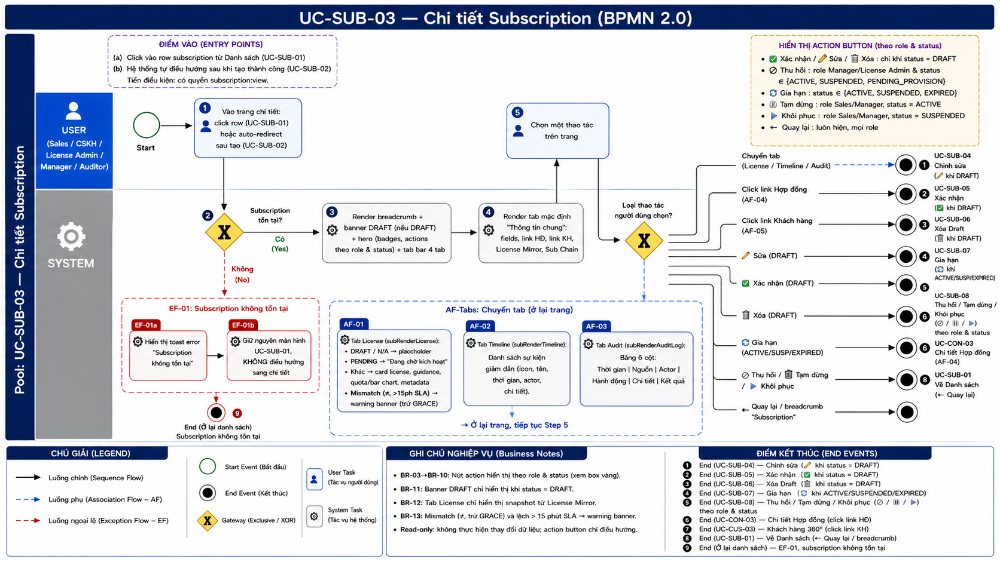

### 2.1 Luồng chính

> Số bước khớp badge trong ảnh BPMN. Bước **2** và **6** là Gateway (XOR). Đây là **trang chi tiết (hub)**: gateway "Loại thao tác" ở bước 6 fan ra 9 End Event / các nhánh AF — mỗi nhánh liệt kê một dòng ngắn bên dưới.

| Bước | Tác nhân | Hành động / Phản hồi | Ghi chú |
|---|---|---|---|
| **1** | User (Sales / CSKH / License Admin / Manager / Auditor) | Vào trang chi tiết: click vào row subscription từ Danh sách (UC-SUB-01), hoặc được điều hướng tự động sau khi tạo thành công ở UC-SUB-02. | — |
| **2** | System | **[Gateway — Subscription tồn tại?]** Có → tiếp bước 3. Không → **EF-01** (→ **End 9**). | — |
| **3** | System | Render breadcrumb ("Subscription › {sub.id}") + banner DRAFT (nếu `sub.status = DRAFT`, BR-11) + hero section (ID badge, status badge, tên KH, action buttons hiện có điều kiện theo role & status) + tab bar 4 tab. | BR-01, BR-02, BR-03→BR-10, BR-11 |
| **4** | System | Render tab mặc định "Thông tin chung" (`sub-tp-info`): các trường, link HĐ, link KH, trạng thái License Mirror, Sub Chain (nếu có). | BR-02, BR-12, BR-13 |
| **5** | User | Chọn một thao tác trên trang (chuyển tab, click link, hoặc click action button). | — |
| **6** | System | **[Gateway — Loại thao tác người dùng chọn?]** Rẽ nhánh theo lựa chọn ở bước 5 — mỗi nhánh dưới đây. | BR-03→BR-13 |
| → | User | **Chuyển tab** License / Timeline / Audit → **AF-Tabs** (AF-01 / AF-02 / AF-03): render nội dung tab, **ở lại trang, tiếp tục bước 5**. | BR-01 |
| → | User | **Click link Hợp đồng** → **AF-04** → **End 6** (UC-CON-03). | BR-13 |
| → | User | **Click link Khách hàng** → **AF-05** → **End 7** (UC-CUS-03). | BR-13 |
| → | User | **✏️ Sửa** (chỉ khi `status = DRAFT`) → **End 1** (UC-SUB-04). | BR-06 |
| → | User | **✅ Xác nhận** (chỉ khi `status = DRAFT`) → **End 2** (UC-SUB-05). | BR-04 |
| → | User | **🗑️ Xóa** (chỉ khi `status = DRAFT`) → **End 3** (UC-SUB-06). | BR-05 |
| → | User | **🔄 Gia hạn** (`status ∈ {ACTIVE, SUSPENDED, EXPIRED}`) → **End 4** (UC-SUB-07). | BR-08 |
| → | User | **⊘ Thu hồi** → **End 5** (UC-SUB-08) · **⏸ Tạm dừng** → **End 5** (UC-SUB-09) · **▶ Khôi phục** → **End 5** (UC-SUB-10). Theo role & status. | BR-07, BR-09, BR-10 |
| → | User | **← Quay lại** / breadcrumb "Subscription" → **End 8** (UC-SUB-01). | — |

### 2.2 Luồng phụ

**[AF-01: Chuyển tab License]** — kích hoạt tại bước 6 khi user click tab "License".

| Bước | Tác nhân | Hành động / Phản hồi |
|---|---|---|
| **AF-01a** | User | Click tab "License" trên tab bar. |
| **AF-01b** | System | Gọi `subRenderLicense(sub)`. Render `sub-tp-license` theo trạng thái: (a) `sub.status = DRAFT` hoặc `licMirrorStatus = N/A` → placeholder "Chưa có thông tin license"; (b) `licMirrorStatus = PENDING` → placeholder "Đang chờ kích hoạt"; (c) các trạng thái khác → card "Thông tin License" (badge, ngày kích hoạt, ngày hết hạn), guidance banner (GRACE/SUSPENDED/EXPIRED/REVOKED), quota/bar chart (DIRECT: seats; RESELLER: license đang active), metadata từ sản phẩm. Nếu `sub.status ≠ license_mirror.status` (GRACE không tính) và lệch > 15 phút SLA → warning banner mismatch. |
| → | — | **Ở lại trang, tiếp tục bước 5.** |

**[AF-02: Chuyển tab Timeline]** — kích hoạt tại bước 6 khi user click tab "Timeline".

| Bước | Tác nhân | Hành động / Phản hồi |
|---|---|---|
| **AF-02a** | User | Click tab "Timeline" trên tab bar. |
| **AF-02b** | System | Gọi `subRenderTimeline(sub)`. Render danh sách sự kiện theo thứ tự thời gian giảm dần (mới nhất lên đầu). Mỗi sự kiện: icon màu theo loại, tên sự kiện, thời gian (dd/MM/yyyy HH:mm), actor, chi tiết. |
| → | — | **Ở lại trang, tiếp tục bước 5.** |

**[AF-03: Chuyển tab Audit]** — kích hoạt tại bước 6 khi user click tab "Audit".

| Bước | Tác nhân | Hành động / Phản hồi |
|---|---|---|
| **AF-03a** | User | Click tab "Audit" trên tab bar. |
| **AF-03b** | System | Gọi `subRenderAuditLog(sub)`. Render bảng audit log 6 cột: Thời gian \| Nguồn \| Actor \| Hành động \| Chi tiết \| Kết quả. |
| → | — | **Ở lại trang, tiếp tục bước 5.** |

**[AF-04: Click link Hợp đồng]** — kích hoạt tại bước 6 khi user click link mã hợp đồng.

| Bước | Tác nhân | Hành động / Phản hồi |
|---|---|---|
| **AF-04a** | User | Click link mã hợp đồng trong tab Thông tin chung. |
| **AF-04b** | System | Gọi `showModule('contract')`. Mở UC-CON-03 với hợp đồng tương ứng. |
| → | — | **End 6 (Điều hướng UC-CON-03)** |

**[AF-05: Click link Khách hàng]** — kích hoạt tại bước 6 khi user click link tên khách hàng.

| Bước | Tác nhân | Hành động / Phản hồi |
|---|---|---|
| **AF-05a** | User | Click link tên khách hàng trong tab Thông tin chung. |
| **AF-05b** | System | Gọi `showModule('customer')`. Mở UC-CUS-03 với khách hàng tương ứng. |
| → | — | **End 7 (Điều hướng UC-CUS-03)** |

### 2.3 Luồng ngoại lệ

**[EF-01: Subscription không tồn tại]** — kích hoạt tại **bước 2** khi subscription không tồn tại trong hệ thống.

| Bước | Tác nhân | Hành động / Phản hồi |
|---|---|---|
| **EF-01a** | System | Hiển thị toast error: "Subscription không tồn tại". |
| **EF-01b** | System | Giữ nguyên màn hình danh sách UC-SUB-01, **không** điều hướng sang trang chi tiết. |
| → | — | **End 9 (Ở lại danh sách — EF-01)** |

### 2.4 Điểm kết thúc (End Events)

| # | Tên | Điều kiện |
|---|---|---|
| **End 1** | Điều hướng UC-SUB-04 (Chỉnh sửa) | bước 6: **✏️ Sửa** khi `status = DRAFT` |
| **End 2** | Điều hướng UC-SUB-05 (Xác nhận) | bước 6: **✅ Xác nhận** khi `status = DRAFT` |
| **End 3** | Điều hướng UC-SUB-06 (Xóa Draft) | bước 6: **🗑️ Xóa** khi `status = DRAFT` |
| **End 4** | Điều hướng UC-SUB-07 (Gia hạn) | bước 6: **🔄 Gia hạn** khi `status ∈ {ACTIVE, SUSPENDED, EXPIRED}` |
| **End 5** | Điều hướng UC-SUB-08 / UC-SUB-09 / UC-SUB-10 | bước 6: **⊘ Thu hồi** → UC-SUB-08 · **⏸ Tạm dừng** → UC-SUB-09 · **▶ Khôi phục** → UC-SUB-10 (theo role & status) |
| **End 6** | Điều hướng UC-CON-03 (Chi tiết Hợp đồng) | AF-04: click link Hợp đồng |
| **End 7** | Điều hướng UC-CUS-03 (Khách hàng 360°) | AF-05: click link Khách hàng |
| **End 8** | Về Danh sách UC-SUB-01 | bước 6: **← Quay lại** / breadcrumb "Subscription" |
| **End 9** | Ở lại danh sách — EF-01 | bước 2: subscription không tồn tại, không điều hướng |

---

## 3. Mô tả giao diện

### 3.1 Tổng quan màn hình

> **Demo HTML:** [docs/demo/v2.4.0_subscriptions.html](../../demo/v2.4.0_subscriptions.html)
> **Hàm chính:** `subOpenDetail(id)`, `subRenderHero(sub)`, `subSwitchTab(el, sub, panelId)`, `subRenderInfo(sub)`, `subRenderLicense(sub)`, `subRenderTimeline(sub)`, `subRenderAuditLog(sub)`

Trang Chi tiết Subscription gồm 4 khu vực xếp dọc từ trên xuống:
1. **Breadcrumb:** Subscription › {sub.id}
2. **Banner DRAFT** (chỉ hiện khi `sub.status = DRAFT`): thông báo chờ phê duyệt.
3. **Hero section:** ID avatar + mã sub + badges + tên khách hàng + action buttons.
4. **Tab bar + nội dung tab:** 4 tab, mặc định "Thông tin chung".

#### Wireframe tổng quan

```
┌─ Breadcrumb: Subscription › SUB-2026-001 ─────────────────────────────────┐
│ ⏳ Banner Draft (chỉ hiện khi DRAFT)                                        │
│ ┌──[ID Avatar]── SUB-2026-001 ──────────────────────────────────────────┐  │
│ │               [DIRECT] | [● ACTIVE]  FPT Software                     │  │
│ │                                       [← Quay lại] [✅ Xác nhận]*     │  │
│ │                                       [✏️ Sửa]* [🗑️ Xóa]* [⊘ Thu hồi]* [🔄 Gia hạn]* │
│ └───────────────────────────────────────────────────────────────────────┘  │
│ [Thông tin chung▼] [License] [Timeline] [Audit]                            │
│ ┌────────────────────────────────────────────────────────────────────────┐ │
│ │ Khách hàng      Hợp đồng        Gói sản phẩm     Số seats             │ │
│ │ FPT Software    HĐ-2024-001     EDR Pro (12T)    500 seats             │ │
│ │ Ngày bắt đầu   Ngày hết hạn    Deal Code        Ghi chú              │ │
│ │ 20/01/2025     20/01/2026       DEAL-001         —                     │ │
│ │ License Mirror  ACTIVE · Đồng bộ: 10/07/2026                         │ │
│ └────────────────────────────────────────────────────────────────────────┘ │
└────────────────────────────────────────────────────────────────────────────┘
* = hiển thị có điều kiện theo role và sub.status
```

**Screenshot — Tab Thông tin Sub (DIRECT - ACTIVE):**

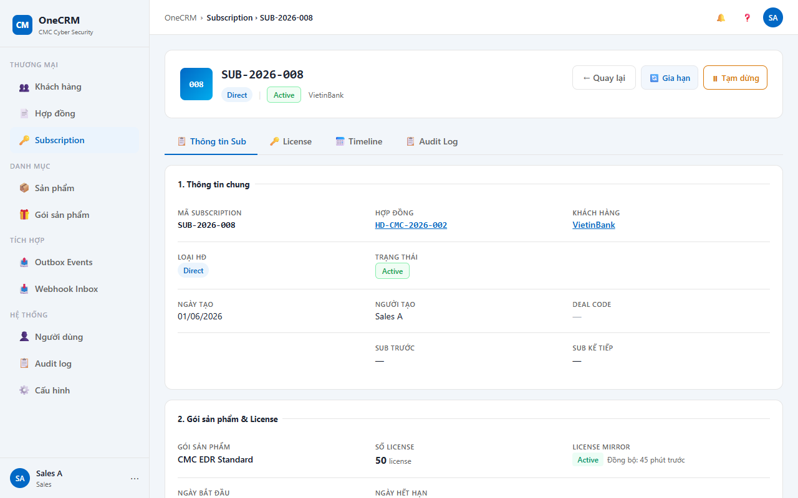

**Screenshot — Tab Thông tin Sub (RESELLER - ACTIVE):**

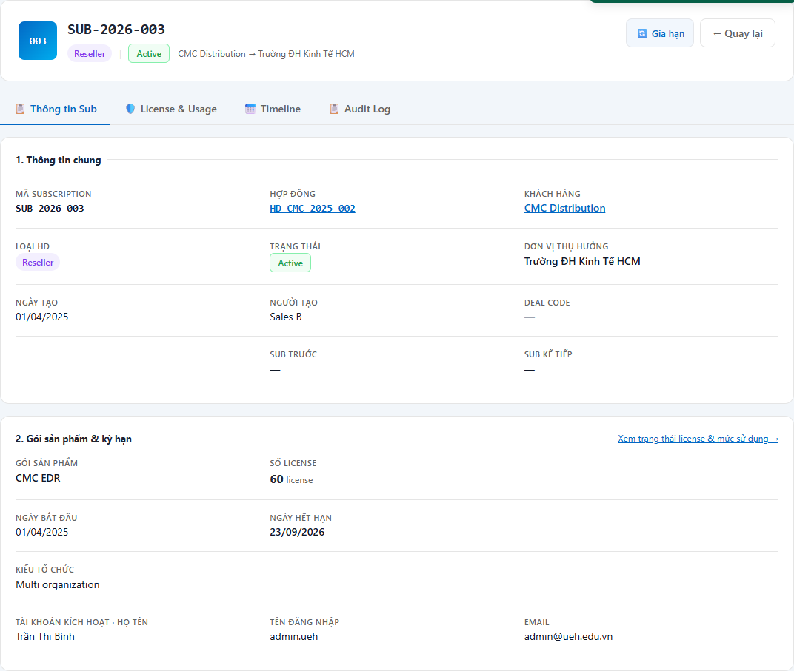

**Screenshot — Hero DRAFT (với action buttons Xác nhận / Xóa / Sửa):**

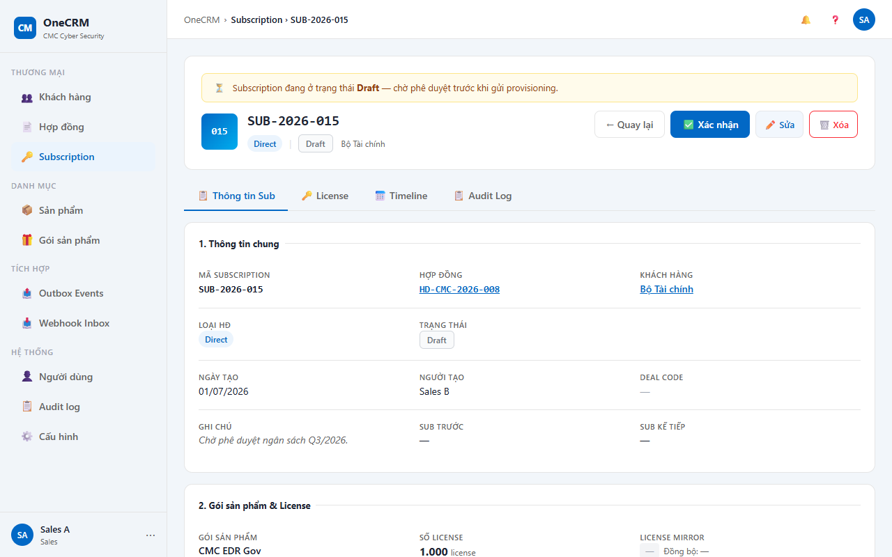

**Screenshot — Hero SUSPENDED (với action button Khôi phục):**

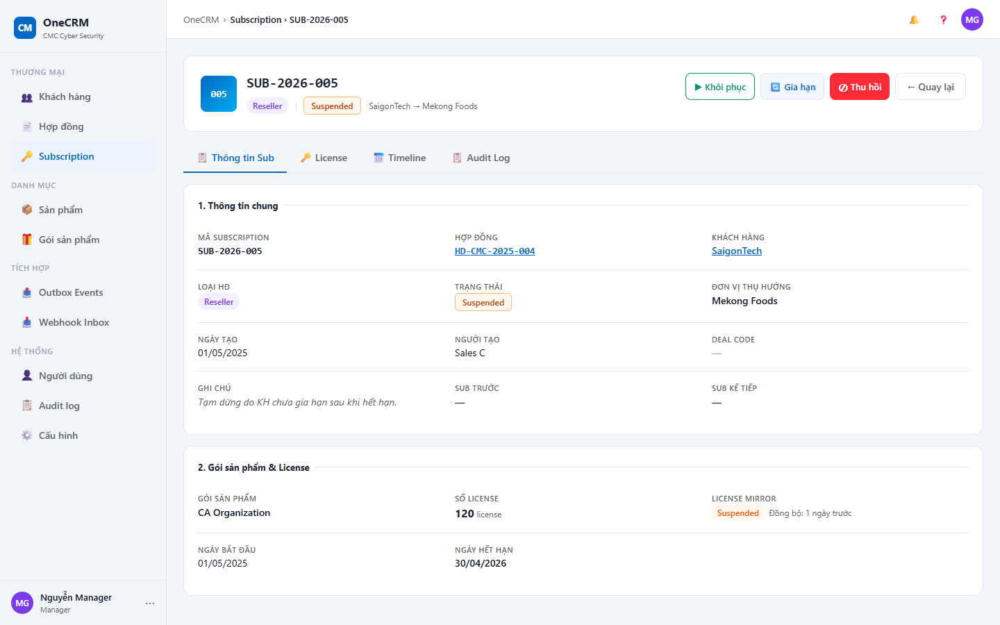

**Screenshot — Tab License (ACTIVE — quota bar):**

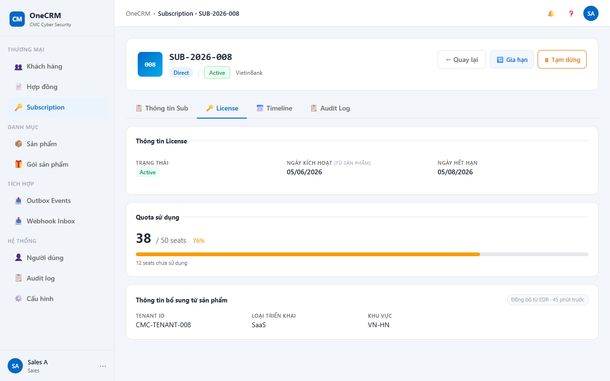

**Screenshot — Tab License (GRACE — guidance banner):**

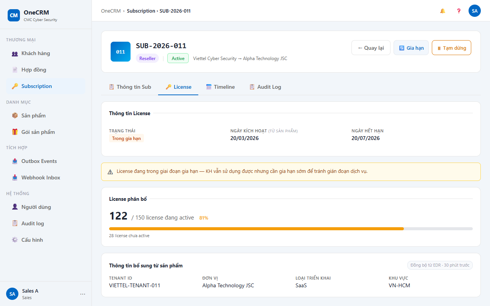

**Screenshot — Tab License (PENDING_PROVISION — đang chờ kích hoạt):**

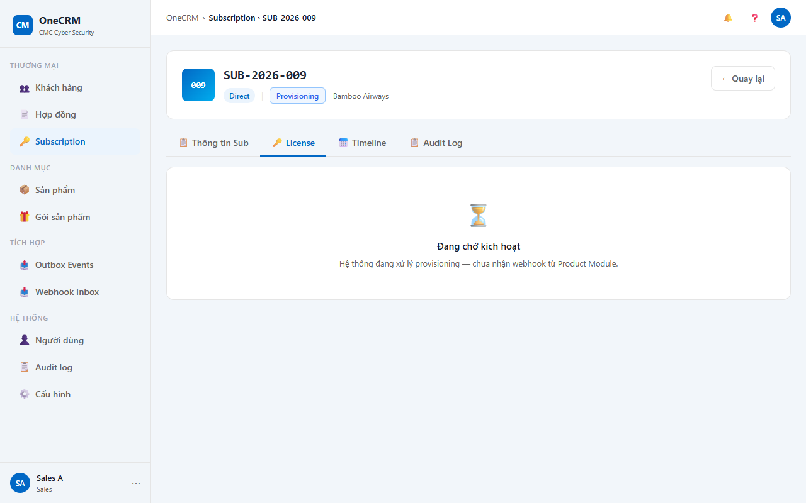

**Screenshot — Tab License (REVOKED — guidance đỏ):**

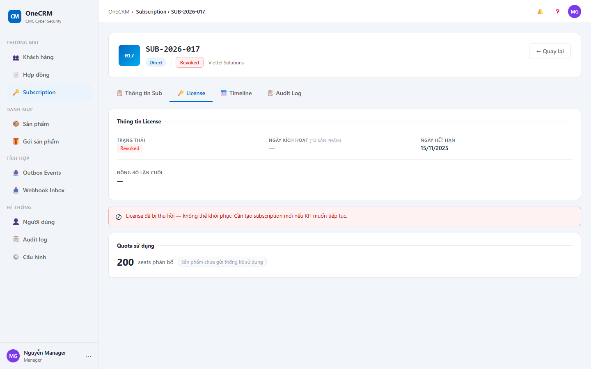

**Screenshot — Tab License (DRAFT — placeholder):**

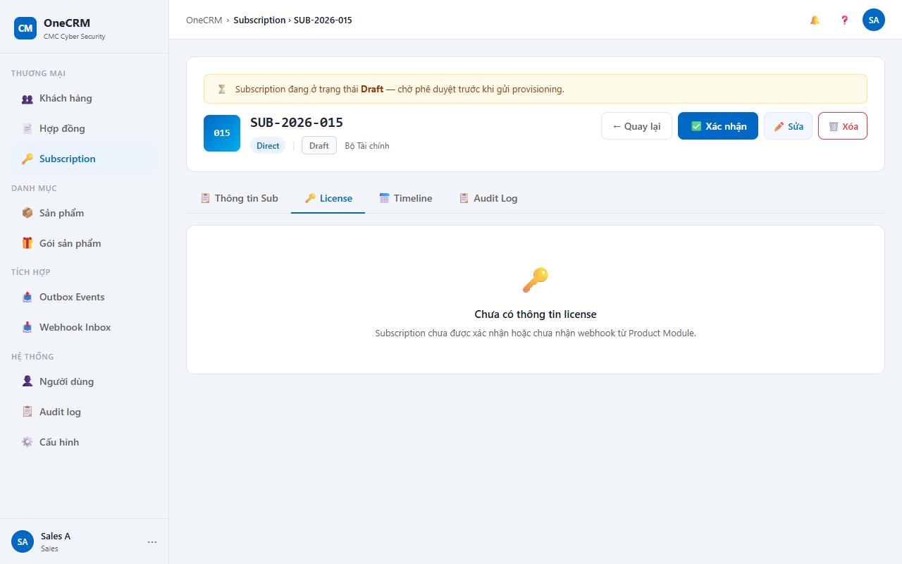

**Screenshot — Tab Timeline:**

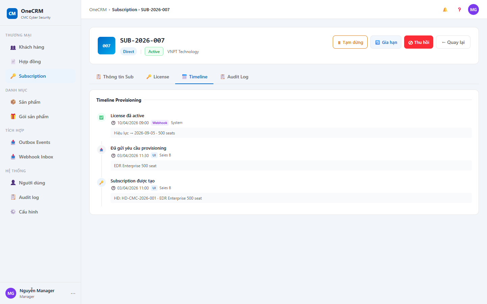

**Screenshot — Tab Audit Log:**

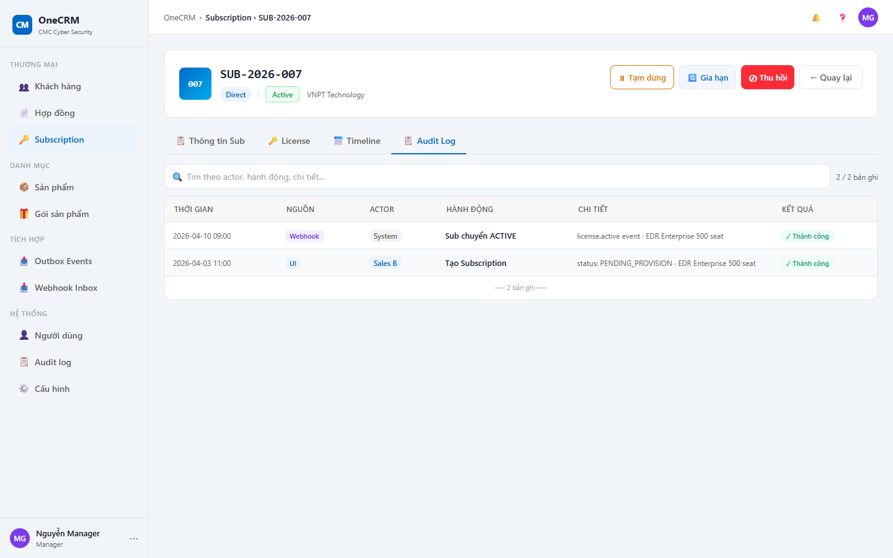

### 3.2 Hero section

| Component | Mô tả |
|---|---|
| ID Avatar | Ký tự đầu của mã sub, nền màu theo loại HĐ (xanh dương: DIRECT, vàng: RESELLER). |
| Mã Sub | Font monospace, cỡ lớn, màu navy, bold. |
| Badge Loại HĐ | `DIRECT` → nền xanh dương nhạt, chữ xanh đậm; `RESELLER` → nền vàng nhạt, chữ nâu. |
| Badge Trạng thái | Màu theo bảng badge trạng thái (xem §3.3). |
| Tên Khách hàng | Text xám, hiển thị ngay dưới hoặc bên cạnh badges. |
| Action buttons | Hiển thị có điều kiện theo BR-04 → BR-10. Thứ tự từ trái sang phải: [← Quay lại] [✅ Xác nhận] [✏️ Sửa] [🗑️ Xóa] [⊘ Thu hồi] [🔄 Gia hạn] [⏸ Tạm dừng] [▶ Khôi phục]. |

#### Điều kiện hiển thị action buttons

| Nút | Điều kiện hiện | Điều kiện active/disabled | Role |
|---|---|---|---|
| ← Quay lại | Luôn hiện | Luôn active | Mọi role |
| ✅ Xác nhận | `status = DRAFT` | Luôn active | Sales, CSKH, License Admin, Manager |
| ✏️ Sửa | `status = DRAFT` | Luôn active | Mọi role có quyền |
| 🗑️ Xóa | `status = DRAFT` | Luôn active | Mọi role có quyền |
| ⊘ Thu hồi | Chỉ hiện khi role Manager/LicenseAdmin VÀ `status ∈ {ACTIVE, SUSPENDED, PENDING_PROVISION}` | Luôn active khi hiện; ẩn hoàn toàn khi status không đủ điều kiện | Manager, License Admin |
| 🔄 Gia hạn | `status ∈ {ACTIVE, SUSPENDED, EXPIRED}` | Luôn active | Mọi role |
| ⏸ Tạm dừng | `status = ACTIVE` | Luôn active | Sales, Manager |
| ▶ Khôi phục | `status = SUSPENDED` | Luôn active | Sales, Manager |

### 3.3 Badge trạng thái

| Trạng thái | Màu nền | Màu chữ | Nhãn hiển thị |
|---|---|---|---|
| DRAFT | Xám nhạt | Xám đậm | Draft |
| PENDING_PROVISION | Vàng nhạt | Nâu vàng | Chờ kích hoạt |
| ACTIVE | Xanh lá nhạt | Xanh lá đậm | Đang hoạt động |
| SUSPENDED | Cam nhạt | Cam đậm | Tạm dừng |
| EXPIRED | Đỏ nhạt | Đỏ đậm | Hết hạn |
| REVOKED | Đỏ đậm | Trắng | Đã thu hồi |
| RENEWED | Xanh dương nhạt | Xanh dương đậm | Đã gia hạn |

### 3.4 Tab Thông tin chung (`sub-tp-info`)

Được render bởi `subRenderInfo(sub)`. Các trường hiển thị:

| # | Nhãn | Nguồn dữ liệu | Ghi chú hiển thị |
|---|---|---|---|
| 1 | Mã Subscription | `sub.id` | Readonly, font monospace. |
| 2 | Khách hàng | `sub.customerName` | Link → UC-CUS-03 (AF-05). |
| 3 | Hợp đồng | `sub.contractId` | Link → UC-CON-03 (AF-04). |
| 4 | Loại hợp đồng | `sub.contractType` | Badge DIRECT / RESELLER. |
| 5 | Gói sản phẩm | `sub.packageName` | Text thường. |
| 6 | Số seats | `sub.seatQty` | Chỉ hiện với DIRECT. |
| 7 | Số license | `sub.licenseQty` | Chỉ hiện với RESELLER. |
| 8 | Đơn vị thụ hưởng | `sub.beneficiaryName` | Chỉ hiện với RESELLER. |
| 9 | Ngày bắt đầu | `sub.startDate` | Định dạng dd/MM/yyyy. Hiển thị "—" nếu null. |
| 10 | Ngày hết hạn | `sub.endDate` | Định dạng dd/MM/yyyy. Màu đỏ nếu đã qua và `status = ACTIVE`. |
| 11 | Deal Code | `sub.dealCode` | Hiển thị "—" nếu null. |
| 12 | Ghi chú | `sub.notes` | Hiển thị "—" nếu null. |
| 13 | Trạng thái License Mirror | `sub.licMirrorStatus` | Badge trạng thái + nhãn. |
| 14 | Lần đồng bộ cuối | `sub.licMirrorLastSync` | Định dạng dd/MM/yyyy HH:mm. Hiển thị "—" nếu chưa đồng bộ. |
| 15 | Sub Chain | `sub.previousSubId`, `sub.successorSubId` | Chỉ hiện khi có predecessor hoặc successor (BR-12). Link đến sub tương ứng. |

### 3.5 Tab License (`sub-tp-license`)

Được render bởi `subRenderLicense(sub)`. Nội dung phụ thuộc vào trạng thái:

| Điều kiện | Nội dung hiển thị |
|---|---|
| `sub.status = DRAFT` hoặc `licMirrorStatus = N/A` | Placeholder: icon + "Chưa có thông tin license". |
| `licMirrorStatus = PENDING` | Placeholder: icon + "Đang chờ kích hoạt". |
| Các trạng thái còn lại | Card "Thông tin License" gồm: (1) Badge trạng thái license; (2) Ngày kích hoạt (từ Product Module); (3) Ngày hết hạn license; (4) Guidance banner theo trạng thái (GRACE: cảnh báo hết hạn sớm; SUSPENDED: thông báo tạm dừng; EXPIRED: đã hết hạn; REVOKED: đã thu hồi); (5) Quota/bar chart (DIRECT: tổng seats / đã dùng; RESELLER: license đang active / tổng); (6) Section metadata từ Product Module (nếu có). |
| Mismatch: `sub.status ≠ license_mirror.status` (GRACE không tính) VÀ lệch > 15 phút SLA | Warning banner: "⚠️ Trạng thái subscription và license mirror không đồng bộ — vui lòng kiểm tra lại." |

### 3.6 Tab Timeline (`sub-tp-timeline`)

Được render bởi `subRenderTimeline(sub)`. Danh sách sự kiện theo thứ tự thời gian **giảm dần** (mới nhất lên đầu). Mỗi dòng sự kiện gồm:

| Thành phần | Mô tả |
|---|---|
| Icon màu | Màu và biểu tượng khác nhau theo loại sự kiện (tạo, xác nhận, kích hoạt, tạm dừng, thu hồi, gia hạn...). |
| Tên sự kiện | Ví dụ: "Subscription được tạo", "Đã xác nhận", "License kích hoạt". |
| Thời gian | Định dạng dd/MM/yyyy HH:mm. |
| Actor | Tên người thực hiện hoặc "System". |
| Chi tiết | Mô tả ngắn bổ sung (tuỳ sự kiện). |

### 3.7 Tab Audit (`sub-tp-audit`)

Được render bởi `subRenderAuditLog(sub)`. Bảng audit log gồm các cột:

| Cột | Mô tả |
|---|---|
| Thời gian | Định dạng dd/MM/yyyy HH:mm:ss. |
| Nguồn | UI / Webhook / API / System. |
| Actor | Tên người dùng hoặc tên service. |
| Hành động | Mã hoặc tên hành động (CREATE, CONFIRM, REVOKE...). |
| Chi tiết | Dữ liệu thay đổi (field before/after hoặc payload). |
| Kết quả | SUCCESS / FAILED + mã lỗi (nếu có). |

---

## 4. Acceptance Criteria

### Nhóm 1: Mở trang chi tiết

| Mã | Given | When | Then |
|---|---|---|---|
| AC-SUB-03-01 | Sub "SUB-2026-001" tồn tại trong hệ thống, `status = ACTIVE`. | Sales click vào row "SUB-2026-001" ở UC-SUB-01. | Trang chi tiết mở. Breadcrumb hiển thị "Subscription › SUB-2026-001". Tab "Thông tin chung" được chọn mặc định. |
| AC-SUB-03-02 | Sub vừa được tạo thành công ở UC-SUB-02. | System tự điều hướng sau khi tạo. | Trang chi tiết của sub vừa tạo mở. Tab "Thông tin chung" được chọn. Banner DRAFT hiển thị. |
| AC-SUB-03-03 | Sub "SUB-2026-001" tồn tại, loại DIRECT. | Sales click vào row. | Hero section hiển thị badge "DIRECT" màu xanh dương và badge trạng thái tương ứng. |

### Nhóm 2: Hero section — Banner DRAFT và action buttons

| Mã | Given | When | Then |
|---|---|---|---|
| AC-SUB-03-04 | Sub có `status = DRAFT`. | Mở trang chi tiết. | Banner DRAFT hiển thị phía trên hero section: "⏳ Subscription đang ở trạng thái Draft — chờ phê duyệt trước khi gửi provisioning." |
| AC-SUB-03-05 | Sub có `status = ACTIVE`. | Mở trang chi tiết. | Banner DRAFT không hiển thị. |
| AC-SUB-03-06 | Sub có `status = DRAFT`. User là Sales. | Mở trang chi tiết. | Các nút hiển thị: ✅ Xác nhận, ✏️ Sửa, 🗑️ Xóa. Nút ⊘ Thu hồi không hiển thị. |
| AC-SUB-03-07 | Sub có `status = DRAFT`. User là Manager. | Mở trang chi tiết. | Nút ⊘ Thu hồi **không hiển thị** (ẩn hoàn toàn — status DRAFT không đủ điều kiện). |
| AC-SUB-03-08 | Sub có `status = ACTIVE`. User là Manager. | Mở trang chi tiết. | Nút ⊘ Thu hồi hiển thị và active. Nút ⏸ Tạm dừng hiển thị. Nút 🔄 Gia hạn hiển thị. Các nút ✅ Xác nhận, ✏️ Sửa, 🗑️ Xóa không hiển thị. |
| AC-SUB-03-08b | Sub có `status = ACTIVE`. User là License Admin. | Mở trang chi tiết. | Nút ⊘ Thu hồi hiển thị và active (giống Manager). |
| AC-SUB-03-09 | Sub có `status = SUSPENDED`. User là Sales. | Mở trang chi tiết. | Nút ▶ Khôi phục và 🔄 Gia hạn hiển thị. Nút ⏸ Tạm dừng không hiển thị. |
| AC-SUB-03-10 | Sub có `status = EXPIRED`. User là Auditor. | Mở trang chi tiết. | Nút 🔄 Gia hạn hiển thị. Các nút ✅ Xác nhận, ✏️ Sửa, 🗑️ Xóa, ⏸ Tạm dừng, ▶ Khôi phục không hiển thị. |

### Nhóm 3: Tab Thông tin chung

| Mã | Given | When | Then |
|---|---|---|---|
| AC-SUB-03-11 | Sub RESELLER, có `beneficiaryName = "Mekong Foods"`. | Mở tab Thông tin chung. | Trường "Đơn vị thụ hưởng" hiển thị "Mekong Foods". Trường "Số seats" không hiển thị. |
| AC-SUB-03-12 | Sub có `previousSubId = "SUB-2025-010"`. | Mở tab Thông tin chung. | Section Sub Chain hiển thị link đến "SUB-2025-010" (predecessor). |
| AC-SUB-03-13 | Sub thuộc HĐ "HĐ-2024-001", KH "FPT Software". | Click link "HĐ-2024-001" trong tab Thông tin chung. | Hệ thống mở UC-CON-03 của hợp đồng đó (AF-04). Kết thúc tại **End 6**. |
| AC-SUB-03-13b | Sub thuộc KH "FPT Software". | Click link "FPT Software" trong tab Thông tin chung. | Hệ thống mở UC-CUS-03 (Khách hàng 360°) của KH đó (AF-05). Kết thúc tại **End 7**. |

### Nhóm 4: Tab License

| Mã | Given | When | Then |
|---|---|---|---|
| AC-SUB-03-14 | Sub có `status = DRAFT`. | Click tab "License". | Placeholder "Chưa có thông tin license" hiển thị. Không có card thông tin license. |
| AC-SUB-03-15 | Sub có `licMirrorStatus = PENDING`. | Click tab "License". | Placeholder "Đang chờ kích hoạt" hiển thị. |
| AC-SUB-03-16 | Sub có `status = ACTIVE`, `licMirrorStatus = ACTIVE`. DIRECT với 300 / 500 seats đang dùng. | Click tab "License". | Card "Thông tin License" hiển thị badge ACTIVE, ngày kích hoạt, ngày hết hạn. Bar chart hiển thị "300 / 500 seats". Không có warning banner mismatch. |
| AC-SUB-03-17 | Sub có `status = ACTIVE`, `licMirrorStatus = GRACE`. | Click tab "License". | Tab License hiển thị guidance banner GRACE. Warning banner mismatch KHÔNG hiển thị (GRACE không tính là mismatch). |
| AC-SUB-03-18 | Sub có `status = ACTIVE`, `licMirrorStatus = SUSPENDED`, lệch > 15 phút. | Click tab "License". | Warning banner mismatch hiển thị: "⚠️ Trạng thái subscription và license mirror không đồng bộ — vui lòng kiểm tra lại." |

### Nhóm 5: Tab Timeline và Audit

| Mã | Given | When | Then |
|---|---|---|---|
| AC-SUB-03-19 | Sub có 5 sự kiện: tạo (01/01), xác nhận (02/01), kích hoạt (03/01), tạm dừng (04/01), khôi phục (05/01). | Click tab "Timeline". | Hiển thị 5 sự kiện theo thứ tự giảm dần: khôi phục (05/01) → tạm dừng (04/01) → ... → tạo (01/01). Mỗi sự kiện có icon màu, tên, thời gian, actor. |
| AC-SUB-03-20 | Sub có 3 audit log: 2 SUCCESS và 1 FAILED. | Click tab "Audit". | Bảng audit hiển thị 3 dòng với đủ 6 cột. Dòng FAILED hiển thị màu/nhãn khác biệt với SUCCESS. |

### Nhóm 6: Navigation — gateway "Loại thao tác" (bước 6)

| Mã | Given | When | Then |
|---|---|---|---|
| AC-SUB-03-21 | Đang ở trang chi tiết sub "SUB-2026-001". | Click "← Quay lại". | Quay về màn hình UC-SUB-01 (danh sách subscription). Kết thúc tại **End 8**. |
| AC-SUB-03-22 | Đang ở trang chi tiết sub "SUB-2026-001". | Click breadcrumb "Subscription". | Quay về màn hình UC-SUB-01. Kết thúc tại **End 8**. |
| AC-SUB-03-23 | Sub DIRECT, `status = DRAFT`. Sales click ✅ Xác nhận. | Click nút ✅ Xác nhận. | Điều hướng sang UC-SUB-05 với sub hiện tại. Kết thúc tại **End 2**. |
| AC-SUB-03-25 | Sub `status = DRAFT`. | Click nút ✏️ Sửa. | Điều hướng sang UC-SUB-04 với sub hiện tại. Kết thúc tại **End 1**. |
| AC-SUB-03-26 | Sub `status = DRAFT`. | Click nút 🗑️ Xóa. | Điều hướng sang UC-SUB-06 với sub hiện tại. Kết thúc tại **End 3**. |
| AC-SUB-03-27 | Sub `status = ACTIVE`. | Click nút 🔄 Gia hạn. | Điều hướng sang UC-SUB-07 với sub hiện tại. Kết thúc tại **End 4**. |
| AC-SUB-03-28 | Sub `status = ACTIVE`. User là Manager. | Click nút ⊘ Thu hồi. | Điều hướng sang UC-SUB-08 (Thu hồi) với sub hiện tại. Kết thúc tại **End 5**. |
| AC-SUB-03-29 | Sub `status = ACTIVE`. User là Sales/Manager. | Click nút ⏸ Tạm dừng. | Điều hướng sang UC-SUB-09 (Tạm dừng) với sub hiện tại. Kết thúc tại **End 5**. |
| AC-SUB-03-30 | Sub `status = SUSPENDED`. User là Sales/Manager. | Click nút ▶ Khôi phục. | Điều hướng sang UC-SUB-10 (Khôi phục) với sub hiện tại. Kết thúc tại **End 5**. |
| AC-SUB-03-31 | Đang ở tab "Thông tin chung". | Click tab "License" (hoặc Timeline / Audit). | Nội dung tab tương ứng được render (AF-Tabs), **ở lại trang chi tiết** — không điều hướng, không tạo End Event. |

### Nhóm 7: Exception

| Mã | Given | When | Then |
|---|---|---|---|
| AC-SUB-03-24 | Sub "SUB-2026-999" không tồn tại trong hệ thống. | Hệ thống cố điều hướng đến trang chi tiết SUB-2026-999 (gateway bước 2). | Toast error hiển thị "Subscription không tồn tại". Màn hình danh sách UC-SUB-01 được giữ nguyên. Không điều hướng sang trang chi tiết. Kết thúc tại **End 9** (EF-01). |

---

## 5. Review Checklist

### Lịch sử thay đổi

| Phiên bản | Ngày | Tác giả | Mô tả |
|---|---|---|---|
| 1.0 | 09/07/2026 | BA Team | Khởi tạo tài liệu — Draft for Review. |
| 1.1 | 09/07/2026 | Claude (AI) | Đồng bộ §2/§4 theo BPMN UC-SUB-03 (trang chi tiết hub): §2.1 đánh lại 6 bước khớp badge, gộp thao tác vào gateway "Loại thao tác" (bước 6) fan ra 9 End Event; AF-01/02/03 gộp thành AF-Tabs (ở lại trang), AF-04→End 6, AF-05→End 7; EF-01→End 9; thêm §2.4 với 9 End Events. §4: căn AC theo bước/End, thêm AC-13b, AC-25→31 cho các nhánh điều hướng. Đồng bộ mục tiêu điều hướng: ⏸ Tạm dừng → UC-SUB-09, ▶ Khôi phục → UC-SUB-10 (BR-09, BR-10, §1 Liên kết). |

> Claude tự review — đánh dấu ✅/❌ trước khi submit cho BA review.

### Nghiệp vụ
- ✅ Luồng chính bao phủ happy path (click từ UC-SUB-01 và auto-redirect sau UC-SUB-02)
- ✅ Trang chi tiết hub: gateway "Loại thao tác" (bước 6) fan ra 9 End Event
- ✅ Luồng phụ đã định nghĩa: AF-Tabs (AF-01 License / AF-02 Timeline / AF-03 Audit — ở lại trang), AF-04 (link HĐ → End 6), AF-05 (link KH → End 7)
- ✅ Luồng ngoại lệ đã xử lý: EF-01 (sub không tồn tại → End 9)
- ✅ §2.4 liệt kê đầy đủ 9 End Events, khớp ảnh BPMN
- ✅ BR đã định nghĩa rõ (BR-01 đến BR-13)
- ✅ AC bao phủ 7 nhóm, 33 AC — vượt ngưỡng tối thiểu 15
- ✅ Phân biệt rõ điều kiện hiển thị từng action button theo role và status

### Giao diện
- ✅ Wireframe ASCII mô tả đúng cấu trúc trang
- ✅ Bảng điều kiện action buttons đầy đủ (8 nút, role và status)
- ✅ Badge trạng thái định nghĩa đủ 7 loại (đồng nhất với UC-SUB-01)
- ✅ Tab License mô tả đủ 4 nhánh trạng thái + warning mismatch
- ✅ Tab Timeline mô tả thứ tự giảm dần và các thành phần hiển thị
- ✅ Tab Audit mô tả đủ 6 cột
- ✅ Sub Chain ghi rõ điều kiện hiện (BR-12) và dạng hiển thị
- ✅ Ghi chú Demo HTML và tên hàm JavaScript tương ứng
