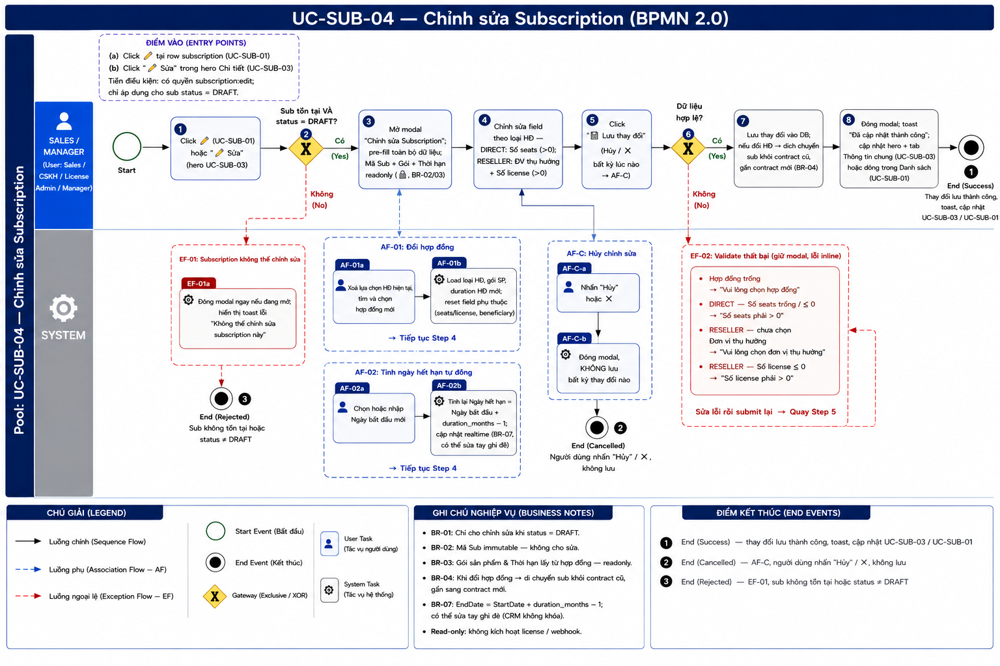

# UC-SUB-04 — Chỉnh sửa Subscription

> Module: M-03 Subscription Management | Phiên bản: 1.3 | Ngày: 28/07/2026
> Trạng thái: Draft for Review

---

## 1. Thông tin chung

| Thuộc tính | Nội dung |
|---|---|
| **Mã Use Case** | UC-SUB-04 |
| **Tên** | Chỉnh sửa Subscription |
| **Mô tả** | Sales / CSKH / License Admin / Manager chỉnh sửa thông tin của một subscription đang ở trạng thái DRAFT. Người dùng có thể cập nhật hợp đồng, số lượng, ngày tháng và thông tin bổ sung. Nếu đổi sang hợp đồng khác, subscription sẽ được dịch chuyển sang contract mới. |
| **Tác nhân** | Sales, CSKH, License Admin, Manager |
| **Tiền điều kiện** | (1) Đã đăng nhập; có quyền `subscription:edit`. (2) Subscription tồn tại và `sub.status = DRAFT`. |
| **Hậu điều kiện** | (Thành công) Thông tin subscription được cập nhật; nếu chuyển sang hợp đồng khác thì sub bị dịch chuyển sang contract mới. (Thất bại) Dữ liệu không thay đổi, form giữ nguyên giá trị với thông báo lỗi. |
| **Trigger** | (1) Click ✏️ tại row subscription trong UC-SUB-01. (2) Click "✏️ Sửa" trong hero section UC-SUB-03. |
| **Liên kết** | UC-SUB-01 (Danh sách), UC-SUB-03 (Chi tiết — quay lại sau khi lưu) |

### Business Rules

| Mã | Nội dung |
|---|---|
| **BR-01** | Chỉ subscription có `sub.status = DRAFT` mới được chỉnh sửa. Mọi trạng thái khác: không hiển thị nút "✏️ Sửa". |
| **BR-02** | Các trường không thể thay đổi sau khi tạo: Mã Subscription (`sub.id`), Product (`sub.productId`). |
| **BR-03** | Gói sản phẩm (`packageName`) là readonly trong form edit — được xác định bởi hợp đồng, không thể thay đổi độc lập. |
| **BR-04** | Nếu người dùng đổi sang hợp đồng khác, subscription sẽ được dịch chuyển khỏi contract cũ và gắn vào contract mới. |
| **BR-05** | Số seats (DIRECT) phải > 0. Số license (RESELLER) phải > 0. |
| **BR-06** | Đơn vị thụ hưởng (`beneficiaryId`) là bắt buộc khi `contractType = RESELLER`, không hiển thị khi `contractType = DIRECT`. |
| **BR-07** | Ngày hết hạn (`endDate`) được tự động tính khi người dùng nhập `startDate` (endDate = startDate + duration_months - 1 ngày). Người dùng vẫn có thể sửa trực tiếp `endDate`. |
| **BR-08** | Deal Code và Ghi chú là tùy chọn. |
| **BR-09** | Sau khi lưu thành công, form đóng lại, hệ thống cập nhật hero + tab Thông tin chung của trang UC-SUB-03 (nếu đang mở detail) hoặc cập nhật dòng trong danh sách UC-SUB-01. |
| **BR-10** | **Cấu hình sản phẩm (scope):** nếu sản phẩm có khai báo `scope_schema` (PRD §5.3.7), form hiển thị mục "Cấu hình sản phẩm" với giá trị hiện tại của sub (`subscription.scope`); người dùng sửa được. Với **CMC EDR**: trường **Kiểu tổ chức** (`tenant_mode`) — `MULTI` / `SINGLE`. Lưu lại vào `subscription.scope`. Sản phẩm không khai báo → không hiển thị mục này. |
| **BR-11** | **Tài khoản kích hoạt:** form hiển thị mục "Tài khoản kích hoạt" với giá trị hiện tại của sub (`subscription.activation_account`) — **Họ tên**, **Tên đăng nhập**, **Email** — pre-fill để người dùng chỉnh. Cả 3 bắt buộc; Email phải đúng định dạng. Lưu lại vào `subscription.activation_account` (PRD §5.3.4). |

---

## 2. Luồng nghiệp vụ



### 2.1 Luồng chính

> Số bước khớp badge trong ảnh BPMN. Bước **2** và **6** là Gateway (XOR) — điều kiện rẽ nhánh ghi gọn trong cùng ô.

| Bước | Tác nhân | Hành động / Phản hồi | Ghi chú |
|---|---|---|---|
| **1** | User (Sales / CSKH / License Admin / Manager) | Click ✏️ tại row subscription (UC-SUB-01) hoặc click "✏️ Sửa" trong hero section (UC-SUB-03). | Nút chỉ hiện khi `sub.status = DRAFT` — BR-01 |
| **2** | System | **[Gateway — Sub tồn tại VÀ `sub.status = DRAFT`?]** Có → tiếp bước 3. Không → **EF-01**. | Pre-check tại thời điểm click |
| **3** | System | Mở modal "Chỉnh sửa Subscription"; pre-fill toàn bộ dữ liệu hiện tại; Mã Sub + Gói sản phẩm + Thời hạn readonly (🔒). | BR-02, BR-03 |
| **4** | User | Chỉnh sửa field theo loại HĐ — DIRECT: Số seats (>0); RESELLER: Đơn vị thụ hưởng + Số license (>0); chỉnh **Cấu hình sản phẩm** (scope) nếu có — vd EDR: Kiểu tổ chức; chỉnh **Tài khoản kích hoạt** (Họ tên, Tên đăng nhập, Email — pre-fill sẵn). Tùy chọn: đổi hợp đồng → **AF-01**; nhập Ngày bắt đầu → **AF-02**. | BR-05, BR-06, BR-10, BR-11 |
| **5** | User | Click "💾 Lưu thay đổi". "Hủy" / ✕ → **AF-C**. | — |
| **6** | System | **[Gateway — Dữ liệu hợp lệ?]** Có → tiếp bước 7. Không → **EF-02**. | Validate toàn bộ form |
| **7** | System | Lưu thay đổi vào DB; nếu đổi hợp đồng → dịch chuyển sub khỏi contract cũ, gắn contract mới. | BR-04 |
| **8** | System | Đóng modal; toast "Đã cập nhật thành công"; cập nhật hero + tab Thông tin chung (UC-SUB-03) hoặc dòng trong Danh sách (UC-SUB-01). | BR-09 |
| → | — | **End 1 (Success)** — thay đổi lưu thành công, toast hiển thị, cập nhật in-place UC-SUB-03 / UC-SUB-01. | — |

### 2.2 Luồng phụ

**[AF-01: Đổi hợp đồng]** — kích hoạt tại bước 4 khi người dùng chọn hợp đồng khác trong dropdown.

| Bước | Tác nhân | Hành động / Phản hồi |
|---|---|---|
| **AF-01a** | User | Xoá lựa chọn hợp đồng hiện tại, tìm và chọn hợp đồng mới. |
| **AF-01b** | System | Load loại HĐ / gói sản phẩm / duration mới; reset các field phụ thuộc (seats/license, beneficiary). |
| → | — | Tiếp tục **bước 4** (BR-04). |

**[AF-02: Tính ngày hết hạn tự động]** — kích hoạt tại bước 4 khi người dùng nhập hoặc thay đổi Ngày bắt đầu.

| Bước | Tác nhân | Hành động / Phản hồi |
|---|---|---|
| **AF-02a** | User | Chọn hoặc nhập Ngày bắt đầu mới. |
| **AF-02b** | System | Tính lại Ngày hết hạn = Ngày bắt đầu + `duration_months` − 1 ngày; cập nhật realtime (có thể sửa tay ghi đè). |
| → | — | Tiếp tục **bước 4** (BR-07). |

**[AF-C: Hủy chỉnh sửa]** — kích hoạt tại bước 5 khi người dùng nhấn "Hủy" / ✕ (§3.2).

| Bước | Tác nhân | Hành động / Phản hồi |
|---|---|---|
| **AF-Ca** | User | Nhấn "Hủy" hoặc ✕. |
| **AF-Cb** | System | Đóng modal, KHÔNG lưu bất kỳ thay đổi nào; sub giữ nguyên `DRAFT`. |
| → | — | **End 2 (Cancelled)** — quay lại UC-SUB-03 / UC-SUB-01, dữ liệu sub không đổi. |

### 2.3 Luồng ngoại lệ

**[EF-01: Subscription không thể chỉnh sửa]** — kích hoạt tại **bước 2** khi sub không tồn tại hoặc `sub.status ≠ DRAFT`.

| Bước | Tác nhân | Hành động / Phản hồi |
|---|---|---|
| **EF-01a** | System | Đóng modal ngay (nếu đang mở); hiển thị toast lỗi "Không thể chỉnh sửa subscription này". |
| **EF-01b** | System | Không thay đổi dữ liệu; trạng thái sub giữ nguyên. |
| → | — | **End 3 (Rejected)** — kết thúc luồng. |

**[EF-02: Validate thất bại]** — kích hoạt tại **bước 6** khi dữ liệu không hợp lệ (Hợp đồng trống / DIRECT seats ≤ 0 / RESELLER chưa chọn ĐVTH / RESELLER license ≤ 0 / thiếu trường Tài khoản kích hoạt / Email tài khoản sai định dạng).

| Bước | Tác nhân | Hành động / Phản hồi |
|---|---|---|
| **EF-02a** | System | Hiển thị lỗi inline bên dưới từng field không hợp lệ (BR-05, BR-06, BR-11). |
| **EF-02b** | System | Giữ nguyên form với dữ liệu đã nhập; không lưu; modal không đóng. |
| → | — | Sửa lỗi rồi submit lại → **quay bước 5** (KHÔNG phải End Event). |

### 2.4 Điểm kết thúc (End Events)

| # | Tên | Điều kiện |
|---|---|---|
| **End 1** | Success — Cập nhật thành công | Thay đổi lưu vào DB; nếu đổi HĐ thì sub dịch chuyển sang contract mới; toast "Đã cập nhật thành công"; hero + tab Thông tin chung (UC-SUB-03) hoặc dòng Danh sách (UC-SUB-01) cập nhật in-place |
| **End 2** | Cancelled — AF-C | Người dùng nhấn "Hủy" / ✕; modal đóng, không lưu; sub giữ nguyên `DRAFT` |
| **End 3** | Rejected — EF-01 | Sub không tồn tại hoặc `sub.status ≠ DRAFT` tại pre-check (bước 2); modal đóng, không thay đổi dữ liệu |

---

## 3. Mô tả giao diện

### 3.1 Wireframe

> **Demo HTML:** [docs/demo/v2.4.0_subscriptions.html](../../demo/v2.4.0_subscriptions.html)
> Hàm liên quan: `subOpenEditSub(id)`, `subSubmitEditSub()`, `subEditSubCalcEndDate()`, `subEditSubOnContractChange()`

```
┌──────────────────────────────────────────────────────────┐
│  Chỉnh sửa Subscription        [SUB-2026-001]         ✕ │
├──────────────────────────────────────────────────────────┤
│                                                          │
│  Hợp đồng *                                             │
│  [🔍 HD-CMC-2025-001 · FPT Software              ▼]     │
│                                                          │
│  Gói sản phẩm (readonly)      Thời hạn (readonly)       │
│  [CMC EDR Standard        🔒] [12 tháng          🔒]    │
│                                                          │
│  ── Cấu hình sản phẩm (nếu sản phẩm có scope) ───────    │
│  Kiểu tổ chức *                                         │
│  (•) Multi organization      ( ) Single organization   │
│                                                          │
│  ── DIRECT only ─────────────────────────────────────   │
│  Số seats *                                             │
│  [50                                                 ]  │
│                                                          │
│  ── RESELLER only ───────────────────────────────────   │
│  Đơn vị thụ hưởng *           Số license *             │
│  [Chọn đơn vị thụ hưởng   ▼] [100                   ]  │
│                                                          │
│  ── Tài khoản kích hoạt ─────────────────────────────    │
│  Họ tên *                     Email *                    │
│  [Nguyễn Văn An            ]  [admin@fpt.com.vn       ]  │
│  Tên đăng nhập *                                         │
│  [admin.fpt                                           ]  │
│                                                          │
│  Ngày bắt đầu                 Ngày hết hạn (tự tính)   │
│  [01/08/2026               ]  [31/07/2027          🔒]  │
│                                                          │
│  Deal Code (tùy chọn)                                   │
│  [                                                   ]  │
│                                                          │
│  Ghi chú (tùy chọn)                                     │
│  [                                                   ]  │
│  [                                                   ]  │
│                                                          │
├──────────────────────────────────────────────────────────┤
│                          [Hủy]  [💾 Lưu thay đổi]       │
└──────────────────────────────────────────────────────────┘
```

**Screenshot — Modal Chỉnh sửa Draft Subscription:**


### 3.2 Thành phần UI

| # | Thành phần | Loại | Mô tả |
|---|---|---|---|
| 1 | Header modal | Text + Badge | Tiêu đề "Chỉnh sửa Subscription" kèm badge mã sub (`SUB-YYYY-NNN`). Nút ✕ đóng modal không lưu. |
| 2 | Dropdown Hợp đồng | Searchable dropdown | Tìm kiếm theo mã HĐ hoặc tên khách hàng. Hiển thị `contractCode · customerName`. Khi thay đổi → kích hoạt AF-01. |
| 3 | Gói sản phẩm | Text readonly | Tự điền từ hợp đồng đã chọn. Hiển thị icon 🔒. Không thể chỉnh sửa trực tiếp (BR-03). |
| 4 | Thời hạn | Text readonly | Tự điền từ package của hợp đồng. Định dạng "X tháng". Hiển thị icon 🔒. |
| 4b | Cấu hình sản phẩm | Radio group (2 card ngang) | Chỉ hiển thị khi sản phẩm có `scope_schema`. EDR: "Kiểu tổ chức" — 2 card Multi/Single organization, pre-fill giá trị hiện tại của sub (`sub.scope`). |
| 4c | Tài khoản kích hoạt — Họ tên | Text input | Pre-fill `sub.activationAccount.fullName`. Bắt buộc. |
| 4d | Tài khoản kích hoạt — Email | Email input | Pre-fill `sub.activationAccount.email`. Bắt buộc, đúng định dạng. |
| 4e | Tài khoản kích hoạt — Tên đăng nhập | Text input | Pre-fill `sub.activationAccount.username`. Bắt buộc. Bố cục: Họ tên \| Email cùng hàng, Tên đăng nhập ở hàng dưới. |
| 5 | Số seats | Number input | Chỉ hiển thị khi `contractType = DIRECT`. Placeholder: "Nhập số seats". |
| 6 | Đơn vị thụ hưởng | Select dropdown | Chỉ hiển thị khi `contractType = RESELLER`. Danh sách đơn vị thụ hưởng đã đăng ký. |
| 7 | Số license | Number input | Chỉ hiển thị khi `contractType = RESELLER`. Placeholder: "Nhập số license". |
| 8 | Ngày bắt đầu | Date picker | Tùy chọn. Khi thay đổi → kích hoạt AF-02. |
| 9 | Ngày hết hạn | Date picker | Tự tính theo AF-02. Người dùng có thể sửa trực tiếp để ghi đè (BR-07). |
| 10 | Deal Code | Text input | Tùy chọn. Không validate format. |
| 11 | Ghi chú | Textarea | Tùy chọn. 2 rows mặc định. |
| 12 | Nút "💾 Lưu thay đổi" | Primary button | Submit form. Kích hoạt bước 5–9 luồng chính. |
| 13 | Nút "Hủy" | Ghost button | Đóng modal, không lưu bất kỳ thay đổi nào. |

### 3.3 Bảng field

| # | Field | Bắt buộc | Điều kiện hiển thị | Validation & Mô tả |
|---|---|---|---|---|
| 1 | Hợp đồng | ✓ | Tất cả | Searchable; hiện `contractCode · customerName`; lỗi: "Vui lòng chọn hợp đồng". |
| 2 | Gói sản phẩm | — | Tất cả | Readonly; tự động từ hợp đồng. Hiển thị icon 🔒. |
| 3 | Thời hạn | — | Tất cả | Readonly; VD: "12 tháng". Hiển thị icon 🔒. |
| 3b | Kiểu tổ chức (scope) | ✓ | Sản phẩm có scope (EDR) | Radio; `MULTI` / `SINGLE`; pre-fill giá trị hiện tại. Lưu `subscription.scope.tenant_mode`. |
| 3c | Tài khoản kích hoạt — Họ tên | ✓ | Tất cả | Pre-fill giá trị hiện tại; lỗi: "Vui lòng nhập họ tên". Lưu `activation_account.full_name`. |
| 3d | Tài khoản kích hoạt — Email | ✓ | Tất cả | Pre-fill; đúng định dạng email; lỗi: "Vui lòng nhập email hợp lệ". Lưu `activation_account.email`. |
| 3e | Tài khoản kích hoạt — Tên đăng nhập | ✓ | Tất cả | Pre-fill; lỗi: "Tên đăng nhập là bắt buộc". Lưu `activation_account.username`. |
| 4 | Số seats | ✓ | DIRECT only | Số nguyên > 0; lỗi: "Số seats phải > 0". |
| 5 | Đơn vị thụ hưởng | ✓ | RESELLER only | Dropdown; lỗi: "Vui lòng chọn đơn vị thụ hưởng". |
| 6 | Số license | ✓ | RESELLER only | Số nguyên > 0; lỗi: "Số license phải > 0". |
| 7 | Ngày bắt đầu | — | Tất cả | Date picker; tùy chọn. Khi thay đổi → tự tính ngày hết hạn (BR-07). |
| 8 | Ngày hết hạn | — | Tất cả | Tự tính từ startDate + duration_months - 1 ngày. Có thể sửa tay để ghi đè. |
| 9 | Deal Code | — | Tất cả | Text tự do; tùy chọn. |
| 10 | Ghi chú | — | Tất cả | Textarea; tùy chọn. |

---

## 4. Acceptance Criteria

### Nhóm 1: Mở form

| Mã | Given | When | Then |
|---|---|---|---|
| AC-SUB-04-01 | Sub "SUB-2026-001" có `status = DRAFT`, gắn với HĐ DIRECT "HD-CMC-2025-001", `seats = 50`, `startDate = 01/08/2026`, `endDate = 31/07/2027`. | Click ✏️ từ UC-SUB-01. | Modal "Chỉnh sửa Subscription" mở. Tất cả field điền sẵn đúng giá trị hiện tại. Gói sản phẩm và Thời hạn hiển thị readonly với icon 🔒. Header badge hiển thị "SUB-2026-001". |
| AC-SUB-04-02 | Sub "SUB-2026-002" có `status = ACTIVE`. | Xem cột Thao tác tại UC-SUB-01. | Nút ✏️ không hiển thị. Không có cách mở form chỉnh sửa từ UI. |
| AC-SUB-04-03 | Sub DIRECT đang mở form edit. | Quan sát form. | Chỉ hiển thị field Số seats. Không hiển thị Đơn vị thụ hưởng và Số license. |
| AC-SUB-04-04 | Sub RESELLER đang mở form edit. | Quan sát form. | Hiển thị Đơn vị thụ hưởng và Số license (có giá trị hiện tại). Không hiển thị Số seats. |
| AC-SUB-04-18 | Sub sản phẩm EDR có `scope.tenant_mode = "SINGLE"`. | Mở form edit. | Mục "Cấu hình sản phẩm" hiện; "Kiểu tổ chức" pre-fill chọn "Single organization" (card được tô nền xanh). |
| AC-SUB-04-20 | Sub DRAFT có `activation_account = {fullName:"Lê Quốc Cường", username:"admin.edrgov", email:"admin@edr-gov.vn"}`. | Mở form edit. | Mục "Tài khoản kích hoạt" hiện; 3 ô Họ tên / Email / Tên đăng nhập pre-fill đúng giá trị hiện tại của sub. |

### Nhóm 2: Validate

| Mã | Given | When | Then |
|---|---|---|---|
| AC-SUB-04-05 | Form đang mở, người dùng xóa trắng ô Hợp đồng. | Click "💾 Lưu thay đổi". | Lỗi inline bên dưới ô Hợp đồng: "Vui lòng chọn hợp đồng". Modal không đóng. |
| AC-SUB-04-06 | HĐ DIRECT, người dùng xóa trắng Số seats. | Click "💾 Lưu thay đổi". | Lỗi inline bên dưới Số seats: "Số seats phải > 0". Modal không đóng. |
| AC-SUB-04-07 | HĐ DIRECT, người dùng nhập Số seats = 0. | Click "💾 Lưu thay đổi". | Lỗi inline bên dưới Số seats: "Số seats phải > 0". Modal không đóng. |
| AC-SUB-04-08 | HĐ RESELLER, người dùng xóa lựa chọn Đơn vị thụ hưởng. | Click "💾 Lưu thay đổi". | Lỗi inline bên dưới Đơn vị thụ hưởng: "Vui lòng chọn đơn vị thụ hưởng". Modal không đóng. |
| AC-SUB-04-16 | HĐ RESELLER, người dùng nhập Số license = 0. | Click "💾 Lưu thay đổi". | Gateway (**bước 6**) phát hiện dữ liệu không hợp lệ → **EF-02**: lỗi inline "Số license phải > 0"; modal giữ nguyên; sau khi sửa, người dùng submit lại (**quay bước 5**), không kết thúc luồng. |
| AC-SUB-04-21 | Form edit đang mở; người dùng xóa trắng Họ tên (hoặc nhập Email = "admin@" sai định dạng). | Click "💾 Lưu thay đổi". | Gateway (**bước 6**) → **EF-02**: lỗi inline "Vui lòng nhập họ tên" / "Vui lòng nhập email hợp lệ" dưới field tương ứng; modal không đóng; sửa rồi submit lại (**quay bước 5**). |

### Nhóm 3: Lưu thành công

| Mã | Given | When | Then |
|---|---|---|---|
| AC-SUB-04-09 | Sub DIRECT "SUB-2026-001", `seats = 50`. Sửa Số seats thành 100. | Click "💾 Lưu thay đổi". | Gateway (**bước 6**) hợp lệ → `seats` cập nhật thành 100. Modal đóng. Toast "Đã cập nhật thành công". Dòng tại UC-SUB-01 cập nhật ngay, không cần tải lại trang. Kết thúc **End 1 (Success)**. |
| AC-SUB-04-10 | Sub RESELLER, sửa Đơn vị thụ hưởng và Số license. | Click "💾 Lưu thay đổi". | `beneficiaryId` và `licenseQty` cập nhật. Modal đóng. Toast "Đã cập nhật thành công". Kết thúc **End 1 (Success)**. |
| AC-SUB-04-11 | Sub đang gắn với HĐ "HD-A". Người dùng đổi sang HĐ "HD-B" (cùng loại). | Click "💾 Lưu thay đổi". | Sub bị tách khỏi HD-A và gắn vào HD-B (**bước 7**, BR-04). Modal đóng. Toast "Đã cập nhật thành công". Kết thúc **End 1 (Success)**. |
| AC-SUB-04-19 | Sub EDR có `scope.tenant_mode = "MULTI"`. Đổi Kiểu tổ chức thành Single organization. | Click "💾 Lưu thay đổi". | `scope.tenant_mode` cập nhật thành "SINGLE" (BR-10). Modal đóng. Toast "Đã cập nhật thành công". Chi tiết UC-SUB-03 hiển thị "Single organization". Kết thúc **End 1 (Success)**. |
| AC-SUB-04-22 | Sub DRAFT, sửa Email tài khoản kích hoạt thành "admin2@edr-gov.vn"; form hợp lệ. | Click "💾 Lưu thay đổi". | `activation_account.email` cập nhật (BR-11). Modal đóng. Toast "Đã cập nhật thành công". Chi tiết UC-SUB-03 hiển thị email mới ở mục Tài khoản kích hoạt. Kết thúc **End 1 (Success)**. |
| AC-SUB-04-17 | Sub DIRECT đang mở form edit, người dùng đã sửa Số seats. | Nhấn "Hủy" hoặc ✕ (**AF-C**). | Modal đóng, không lưu bất kỳ thay đổi nào; `seats` giữ nguyên giá trị cũ. Kết thúc **End 2 (Cancelled)**. |

### Nhóm 4: Tính toán tự động

| Mã | Given | When | Then |
|---|---|---|---|
| AC-SUB-04-12 | Gói 12 tháng. Ngày bắt đầu hiện tại = 01/01/2026, Ngày hết hạn = 31/12/2026. | Sửa Ngày bắt đầu thành 01/08/2026. | Field Ngày hết hạn tự động cập nhật = 31/07/2027 (01/08/2026 + 12 tháng - 1 ngày). |
| AC-SUB-04-13 | Gói 6 tháng. | Nhập Ngày bắt đầu = 01/03/2026. | Ngày hết hạn tự tính = 31/08/2026 (01/09/2026 - 1 ngày). |

### Nhóm 5: Exception

| Mã | Given | When | Then |
|---|---|---|---|
| AC-SUB-04-14 | Sub "SUB-2026-005" có `status = PENDING_PROVISION`. | Gửi request mở form edit (bypass UI). | Gateway pre-check (**bước 2**) phát hiện `status ≠ DRAFT` → **End 3 (EF-01)**: hệ thống không mở modal; toast lỗi "Không thể chỉnh sửa subscription này". |
| AC-SUB-04-15 | Sub "SUB-2026-999" không tồn tại trong hệ thống. | Gửi request chỉnh sửa. | Gateway pre-check (**bước 2**) phát hiện sub không tồn tại → **End 3 (EF-01)**: hệ thống không mở modal; toast lỗi "Không thể chỉnh sửa subscription này". |

---

## 5. Lịch sử thay đổi

| Phiên bản | Ngày | Tác giả | Mô tả |
|---|---|---|---|
| 1.0 | 09/07/2026 | BA Team | Khởi tạo tài liệu — Draft for Review. |
| 1.1 | 09/07/2026 | Claude (AI) | Đồng bộ §2 theo BPMN UC-SUB-04: đánh lại còn **8 bước** khớp badge; gộp Gateway vào 1 ô tại **bước 2** (pre-check DRAFT) và **bước 6** (validate); thêm §2.4 End Events (End 1 Success / End 2 Cancelled / End 3 Rejected); bổ sung **AF-C (Hủy chỉnh sửa)**; chuẩn hóa AF-01/AF-02/EF-01/EF-02 theo style bảng. §4: căn AC theo bước/End Event, thêm AC-16 (EF-02 loop RESELLER license ≤ 0) và AC-17 (AF-C → End 2). |
| 1.2 | 10/07/2026 | Claude (AI) | Bổ sung sửa **Cấu hình sản phẩm (scope)** per-sub do Product Module khai báo (`scope_schema`, PRD §5.3.7): thêm **BR-10**; §2.1 bước 4 chỉnh scope; §3.1 wireframe + §3.2/§3.3 mô tả mục "Cấu hình sản phẩm" (EDR: Kiểu tổ chức MULTI/SINGLE, 2 card ngang, pre-fill); §4 thêm AC-18 (pre-fill) và AC-19 (lưu scope). Đồng bộ demo `v2.4.0_subscriptions.html` (`subSubmitEditSub`) + PRD §5.3.4. |
| 1.3 | 28/07/2026 | Claude (AI) | **Bổ sung sửa Tài khoản kích hoạt (activation account)**: thêm **BR-11**; §2.1 bước 4 chỉnh tài khoản; §2.3 EF-02 thêm điều kiện thiếu trường / email sai định dạng; §3.1 wireframe + §3.2 (4c/4d/4e) + §3.3 (3c/3d/3e) mô tả mục "Tài khoản kích hoạt" (pre-fill giá trị hiện tại: Họ tên \| Email, Tên đăng nhập); §4 thêm **AC-20** (pre-fill), **AC-21** (validate), **AC-22** (lưu). Chụp lại ảnh modal. Đồng bộ demo `v2.8.0_audit_notification.html` (`subOpenEditSub`/`subSubmitEditSub`) + PRD §5.3.4. |
