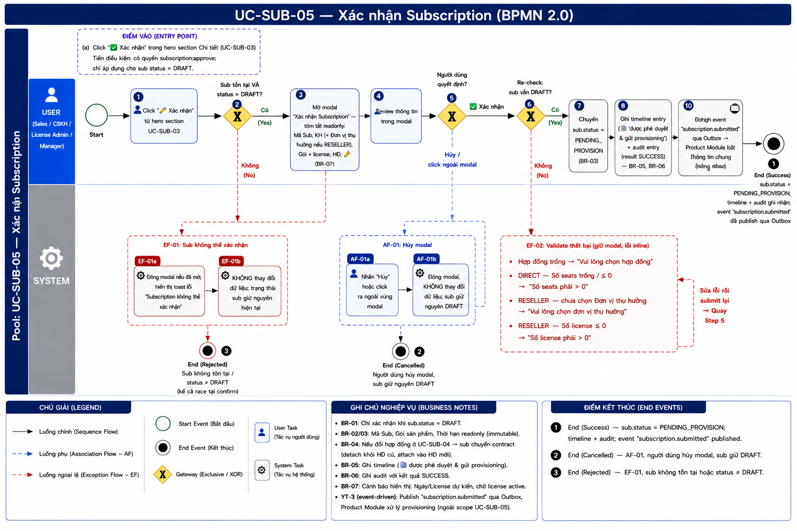
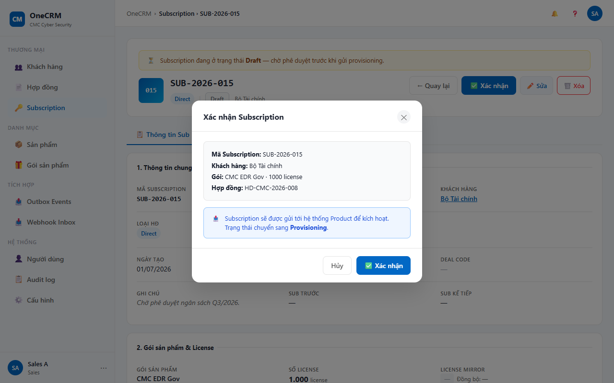

# UC-SUB-05 — Xác nhận Subscription

> Module: M-03 Subscription Management | Phiên bản: 1.2 | Ngày: 28/07/2026
> Trạng thái: Draft for Review

---

## 1. Thông tin chung

| Thuộc tính | Nội dung |
|---|---|
| **Mã Use Case** | UC-SUB-05 |
| **Tên** | Xác nhận Subscription |
| **Mô tả** | Sales / CSKH / License Admin / Manager xác nhận một subscription đang ở trạng thái DRAFT để đẩy vào quy trình provisioning. Hệ thống chuyển trạng thái sang `PENDING_PROVISION` và publish event `subscription.submitted` qua Outbox. |
| **Tác nhân** | Sales, CSKH, License Admin, Manager |
| **Tiền điều kiện** | (1) Đã đăng nhập; có quyền `subscription:approve`. (2) Subscription tồn tại và `sub.status = DRAFT`. |
| **Hậu điều kiện** | (Thành công) `sub.status` chuyển thành `PENDING_PROVISION`. Timeline và Audit ghi nhận sự kiện. Hệ thống publish event `subscription.submitted` qua Outbox. (Thất bại) Trạng thái không thay đổi. |
| **Trigger** | User click "✅ Xác nhận" trong hero section của UC-SUB-03. |
| **Liên kết** | UC-SUB-01 (Danh sách), UC-SUB-03 (Chi tiết — quay lại sau khi xác nhận) |

### Business Rules

| Mã | Nội dung |
|---|---|
| **BR-01** | Chỉ subscription có `sub.status = DRAFT` mới có thể xác nhận. Nút "✅ Xác nhận" chỉ hiển thị khi `sub.status = DRAFT`. |
| **BR-02** | Các actor có quyền xác nhận: Sales, CSKH, License Admin, Manager (bất kỳ ai trong các role này đã đăng nhập). |
| **BR-03** | Sau khi xác nhận: `sub.status = PENDING_PROVISION`. |
| **BR-04** | System publish event `subscription.submitted` qua Outbox → Product Module nhận và bắt đầu provisioning. Nội dung payload được đặc tả tại [Event Catalog §4.2.1](../integration/_event_catalog_v2.md) — bao gồm cấu hình sản phẩm (scope) và **Tài khoản kích hoạt** (`activation_account`: họ tên / tên đăng nhập / email) đã thu thập ở UC-SUB-02/04. |
| **BR-05** | Hệ thống ghi timeline entry: icon 📤, nội dung "Subscription được phê duyệt & gửi provisioning", mô tả trạng thái `DRAFT → PENDING_PROVISION · Sự kiện subscription.submitted đã publish`. |
| **BR-06** | Hệ thống ghi audit entry: action `Phê duyệt Subscription (DRAFT → PENDING_PROVISION)`, detail `Gửi yêu cầu provisioning tới hệ thống product`, result `SUCCESS`. |
| **BR-07** | Modal xác nhận hiển thị tóm tắt thông tin sub (Mã Sub, Khách hàng, Gói, Hợp đồng) để người dùng review trước khi confirm. Với hợp đồng RESELLER, bổ sung dòng Đơn vị thụ hưởng. |
| **BR-08** | Sau khi xác nhận thành công: hero section và tab Thông tin chung được cập nhật ngay lập tức (không cần reload trang). |

---

## 2. Luồng nghiệp vụ



### 2.1 Luồng chính

> Số bước khớp badge trong ảnh BPMN. Bước **2**, **5**, **6** là Gateway (XOR) — điều kiện rẽ nhánh ghi gọn trong cùng ô.

| Bước | Tác nhân | Hành động / Phản hồi | Ghi chú |
|---|---|---|---|
| **1** | User (Sales / CSKH / License Admin / Manager) | Click "✅ Xác nhận" từ hero section UC-SUB-03. | Nút chỉ hiện khi `sub.status = DRAFT` — BR-01 |
| **2** | System | **[Gateway — Sub tồn tại VÀ `sub.status = DRAFT`?]** Có → tiếp bước 3. Không → **EF-01**. | Pre-check tại thời điểm click |
| **3** | System | Mở modal "Xác nhận Subscription" — tóm tắt readonly: Mã Sub, Khách hàng (+ Đơn vị thụ hưởng nếu RESELLER), Gói + số license, Hợp đồng; kèm cảnh báo ⚠ hậu quả. | BR-07 |
| **4** | User | Review thông tin trong modal. | — |
| **5** | User | **[Gateway — Người dùng quyết định?]** "✅ Xác nhận" → tiếp bước 6. "Hủy" / click ngoài modal → **AF-01**. | — |
| **6** | System | **[Gateway — Re-check: sub vẫn `DRAFT`? (race condition)]** Có → tiếp bước 7. Không → **EF-01**. | Chống race khi sub bị đổi trạng thái lúc modal đang mở |
| **7** | System | Chuyển `sub.status = PENDING_PROVISION`. | BR-03 |
| **8** | System | Ghi timeline entry (icon 📤) và audit entry (result SUCCESS). | BR-05, BR-06 |
| **9** | System | Publish event `subscription.submitted` qua Outbox → Product Module bắt đầu provisioning. | BR-04 |
| **10** | System | Đóng modal; toast "Đã phê duyệt — trạng thái chuyển sang PENDING_PROVISION"; cập nhật hero + tab Thông tin chung ngay (không reload). | BR-08 |
| → | — | **End 1 (Success)** — `status = PENDING_PROVISION`, event đã publish, timeline+audit ghi nhận, cập nhật in-place. | — |

### 2.2 Luồng phụ

**[AF-01: Người dùng hủy modal]** — kích hoạt tại bước 5 khi người dùng không xác nhận.

| Bước | Tác nhân | Hành động / Phản hồi |
|---|---|---|
| **AF-01a** | User | Nhấn "Hủy" hoặc click ra ngoài vùng modal. |
| **AF-01b** | System | Đóng modal. Không thay đổi dữ liệu; sub giữ nguyên `DRAFT`. |
| → | — | **End 2 (Cancelled)** — quay lại UC-SUB-03, trạng thái sub không đổi. |

### 2.3 Luồng ngoại lệ

**[EF-01: Sub không thể xác nhận]** — kích hoạt tại **bước 2** (pre-check) hoặc **bước 6** (re-check race condition) khi sub không tồn tại hoặc `sub.status ≠ DRAFT`.

| Bước | Tác nhân | Hành động / Phản hồi |
|---|---|---|
| **EF-01a** | System | Đóng modal (nếu đã mở). Hiển thị toast error "Subscription không thể xác nhận". |
| **EF-01b** | System | Không thay đổi dữ liệu. Trạng thái sub giữ nguyên. |
| → | — | **End 3 (Rejected)** — kết thúc luồng. |

### 2.4 Điểm kết thúc (End Events)

| # | Tên | Điều kiện |
|---|---|---|
| **End 1** | Success — Xác nhận thành công | `sub.status = PENDING_PROVISION`; timeline + audit ghi nhận; event `subscription.submitted` đã publish qua Outbox; hero + tab Thông tin chung cập nhật in-place tại UC-SUB-03 |
| **End 2** | Cancelled — AF-01 | Người dùng nhấn "Hủy" / click ngoài modal; sub giữ nguyên `DRAFT` |
| **End 3** | Rejected — EF-01 | Sub không tồn tại hoặc `sub.status ≠ DRAFT` — kể cả **race condition** phát hiện tại bước 6 (confirm) |

---

## 3. Mô tả giao diện

### 3.1 Wireframe

> **Demo HTML:** [docs/demo/v2.4.0_subscriptions.html](../../demo/v2.4.0_subscriptions.html)
> **Hàm demo:** `subOpenApproveDraft(id)`, `subConfirmApproveDraft()`

Modal "Xác nhận Subscription" xuất hiện từ hero section của màn UC-SUB-03 khi user click "✅ Xác nhận":

```
┌─ Xác nhận Subscription ───────────────────────────────────┐
│                                                             │
│  ┌── Thông tin subscription ────────────────────────────┐  │
│  │  Mã Subscription:  SUB-2026-001                      │  │
│  │  Khách hàng:       FPT Software                      │  │
│  │  Gói:              EDR Pro · 500 license             │  │
│  │  Hợp đồng:         HĐ-2024-001                       │  │
│  └──────────────────────────────────────────────────────┘  │
│                                                             │
│  ⚠ Sau khi xác nhận, subscription sẽ được gửi đến hệ      │
│    thống sản phẩm để khởi tạo license.                     │
│                                                             │
│              [Hủy]          [✅ Xác nhận]                  │
└─────────────────────────────────────────────────────────────┘
```

*Lưu ý: Với hợp đồng RESELLER, bổ sung dòng "Đơn vị thụ hưởng" trong bảng thông tin subscription.*

**Screenshot — Modal Gửi Subscription đi (Phê duyệt):**



### 3.2 Thành phần UI

| Component | Mô tả |
|---|---|
| Modal header | Tiêu đề "Xác nhận Subscription" + nút ✕ đóng modal. |
| Bảng thông tin summary | Hiển thị readonly 4 dòng (DIRECT) hoặc 5 dòng (RESELLER). Nền xám nhạt, border-radius `r-sm`. |
| Cảnh báo | Icon ⚠ màu cam + text giải thích hậu quả của hành động. |
| Nút "Hủy" | Ghost button, căn trái trong footer. Thực hiện AF-01. |
| Nút "✅ Xác nhận" | Primary button, căn phải trong footer. Thực hiện bước 5–9 luồng chính. |
| Toast thành công | Hiển thị sau khi đóng modal: "Đã phê duyệt — trạng thái chuyển sang PENDING_PROVISION". |
| Toast lỗi | Hiển thị khi EF-01: "Subscription không thể xác nhận". |

### 3.3 Bảng field hiển thị trong modal

| # | Field | Nguồn dữ liệu | Hiển thị theo loại HĐ |
|---|---|---|---|
| 1 | Mã Subscription | `sub.id` | DIRECT + RESELLER |
| 2 | Khách hàng | `sub.customerName` | DIRECT + RESELLER |
| 3 | Đơn vị thụ hưởng | `sub.beneficiaryName` | Chỉ RESELLER |
| 4 | Gói | `sub.packageName` + `sub.licenseQty \|\| sub.seatCount` | DIRECT + RESELLER: "{tên gói} · {N} license". |
| 5 | Hợp đồng | `sub.contractCode` | DIRECT + RESELLER |

*Tất cả field là readonly — không có input nhập liệu trong modal này.*

---

## 4. Acceptance Criteria

### Nhóm 1: Điều kiện hiển thị nút

| Mã | Given | When | Then |
|---|---|---|---|
| AC-SUB-05-01 | Sub có `status = DRAFT`. | Xem hero section UC-SUB-03. | Nút "✅ Xác nhận" hiển thị và active. |
| AC-SUB-05-02 | Sub có `status = ACTIVE`. | Xem hero section UC-SUB-03. | Nút "✅ Xác nhận" không hiển thị. |
| AC-SUB-05-03 | Sub có `status = PENDING_PROVISION`. | Xem hero section UC-SUB-03. | Nút "✅ Xác nhận" không hiển thị. |
| AC-SUB-05-04 | User đăng nhập với role Sales (hoặc CSKH, License Admin, Manager), sub có `status = DRAFT`. | Xem hero section UC-SUB-03. | Nút "✅ Xác nhận" hiển thị và active cho tất cả các role trên. |

### Nhóm 2: Modal hiển thị đúng thông tin

| Mã | Given | When | Then |
|---|---|---|---|
| AC-SUB-05-05 | Sub DIRECT: mã "SUB-2026-001", khách hàng "FPT Software", gói "EDR Pro · 200 license", hợp đồng "HĐ-2024-001". | Click "✅ Xác nhận". | Modal mở, hiển thị đúng 4 dòng thông tin. Không có dòng Đơn vị thụ hưởng. |
| AC-SUB-05-06 | Sub RESELLER có `beneficiaryName = "Mekong Foods"`. | Click "✅ Xác nhận". | Modal mở, hiển thị 5 dòng thông tin bao gồm "Đơn vị thụ hưởng: Mekong Foods". |
| AC-SUB-05-07 | Modal đang mở. | Nhấn "Hủy". | Modal đóng. `sub.status` vẫn là DRAFT. Không có toast. |
| AC-SUB-05-08 | Modal đang mở. | Click ra ngoài vùng modal. | Modal đóng. `sub.status` vẫn là DRAFT. |

### Nhóm 3: Xác nhận thành công

| Mã | Given | When | Then |
|---|---|---|---|
| AC-SUB-05-09 | Sub có `status = DRAFT`. | Click "✅ Xác nhận" trong modal. | `sub.status` chuyển thành `PENDING_PROVISION`. |
| AC-SUB-05-10 | Xác nhận thành công. | Sau khi modal đóng. | Toast hiển thị: "Đã phê duyệt — trạng thái chuyển sang PENDING_PROVISION". |
| AC-SUB-05-11 | Xác nhận thành công. | Xem tab Timeline UC-SUB-03. | Có entry mới nhất: icon 📤, "Subscription được phê duyệt & gửi provisioning", mô tả "DRAFT → PENDING_PROVISION · Sự kiện subscription.submitted đã publish". |
| AC-SUB-05-12 | Xác nhận thành công. | Xem tab Audit Log UC-SUB-03. | Có entry: action "Phê duyệt Subscription (DRAFT → PENDING_PROVISION)", detail "Gửi yêu cầu provisioning tới hệ thống product", result "SUCCESS". |
| AC-SUB-05-13 | Xác nhận thành công. | Xem hero section UC-SUB-03 (không reload trang). | Badge trạng thái hiển thị "Chờ kích hoạt" (PENDING_PROVISION). Nút "✅ Xác nhận" không còn hiển thị. Kết thúc tại **End 1 (Success)**. |
| AC-SUB-05-15 | Xác nhận hợp lệ, đã qua re-check (bước 6). | Sau khi `sub.status` chuyển `PENDING_PROVISION` (bước 7). | Event `subscription.submitted` được publish vào Outbox (**bước 9**, BR-04) để Product Module bắt đầu provisioning. CRM **không** gọi API product trực tiếp (YT-3). |

### Nhóm 4: Luồng ngoại lệ

| Mã | Given | When | Then |
|---|---|---|---|
| AC-SUB-05-14 | Sub đã được xác nhận bởi người dùng khác (race condition, `status ≠ DRAFT`) trong khi modal đang mở. | Nhấn "✅ Xác nhận" trong modal. | Gateway re-check (**bước 6**) phát hiện `status ≠ DRAFT` → **End 3 (EF-01)**: toast error "Subscription không thể xác nhận", modal đóng, `sub.status` không thay đổi. |
| AC-SUB-05-16 | Sub bị xóa / không còn tồn tại tại thời điểm click "✅ Xác nhận" ở hero. | Click "✅ Xác nhận". | Gateway pre-check (**bước 2**) phát hiện sub không hợp lệ → **End 3 (EF-01)**: toast error "Subscription không thể xác nhận"; modal không mở. |

---

## 5. Lịch sử thay đổi

| Phiên bản | Ngày | Tác giả | Mô tả |
|---|---|---|---|
| 1.0 | 09/07/2026 | BA Team | Khởi tạo tài liệu — Draft for Review. |
| 1.1 | 09/07/2026 | Claude (AI) | Đồng bộ §2 theo BPMN UC-SUB-05: nhúng ảnh BPMN; tách bước 2/5/6 thành Gateway riêng; **bổ sung bước 6 — gateway re-check race condition**; đánh lại số bước 1–10 khớp badge; thêm §2.4 End Events. AC: căn lại tham chiếu bước/End Event, thêm AC-15 (Outbox publish) và AC-16 (pre-check bước 2). |
| 1.2 | 28/07/2026 | Claude (AI) | **BR-04**: ghi chú payload `subscription.submitted` (đặc tả tại Event Catalog §4.2.1) nay bao gồm **Tài khoản kích hoạt** (`activation_account`) thu thập ở UC-SUB-02/04. Không đổi luồng/AC. Đồng bộ activation account (PRD §5.3.4, catalog v2). |
