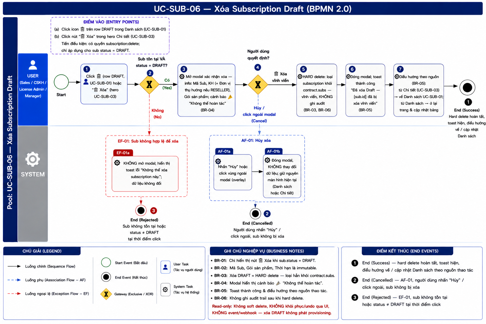
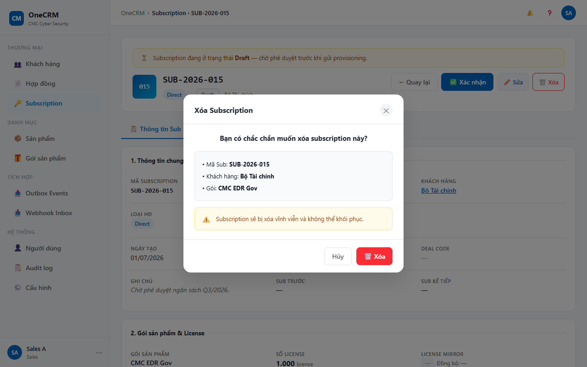

# UC-SUB-06 — Xóa Subscription Draft

> Module: M-03 Subscription Management | Phiên bản: 1.0 | Ngày: 09/07/2026
> Trạng thái: Draft for Review

---

## 1. Thông tin chung

| Thuộc tính | Nội dung |
|---|---|
| **Mã Use Case** | UC-SUB-06 |
| **Tên** | Xóa Subscription Draft |
| **Mô tả** | Sales / CSKH / License Admin / Manager xóa vĩnh viễn một subscription đang ở trạng thái DRAFT khỏi hệ thống (hard delete). Thao tác yêu cầu xác nhận qua modal và không thể hoàn tác. |
| **Tác nhân** | Sales, CSKH, License Admin, Manager |
| **Tiền điều kiện** | (1) Đã đăng nhập hệ thống; có quyền `subscription:delete`. (2) Subscription tồn tại trong hệ thống và `sub.status = DRAFT`. |
| **Hậu điều kiện** | (Thành công) Subscription bị xóa vĩnh viễn khỏi hệ thống (hard delete — loại khỏi `contract.subs`). Hệ thống hiển thị toast xác nhận và điều hướng về UC-SUB-01 nếu đang ở trang chi tiết. (Thất bại) Dữ liệu không thay đổi. Subscription vẫn tồn tại nguyên vẹn. |
| **Trigger** | (1) Click 🗑️ tại row subscription trong UC-SUB-01 (chỉ khi `status = DRAFT`). (2) Click nút "🗑️ Xóa" trong hero section UC-SUB-03 (chỉ khi `status = DRAFT`). |
| **Liên kết** | UC-SUB-01 (Danh sách — điểm vào & điều hướng về sau khi xóa thành công), UC-SUB-03 (Chi tiết — điểm vào thứ hai) |

### Business Rules

| Mã | Nội dung |
|---|---|
| **BR-01** | Chỉ subscription có `sub.status = DRAFT` mới được xóa (hard delete). Mọi trạng thái khác đều bị chặn. |
| **BR-02** | Với các status khác DRAFT: nút 🗑️ trong danh sách (UC-SUB-01) hiển thị ở trạng thái `disabled` với tooltip *"Chỉ xóa được khi ở trạng thái Draft"*. Nút "🗑️ Xóa" trong hero UC-SUB-03 không hiển thị (ẩn hoàn toàn). |
| **BR-03** | Xóa là **vĩnh viễn** (hard delete) — subscription bị loại khỏi mảng `contract.subs`. Không có khả năng khôi phục qua UI. |
| **BR-04** | Modal xác nhận phải hiển thị đầy đủ thông tin nhận diện: Mã Sub, Khách hàng (+ đơn vị thụ hưởng nếu hợp đồng RESELLER), Gói sản phẩm. |
| **BR-05** | Sau khi xóa thành công: hiển thị toast *"Đã xóa Draft — [sub.id] đã bị xóa vĩnh viễn"*. Hệ thống điều hướng về UC-SUB-01 nếu thao tác xuất phát từ trang chi tiết (UC-SUB-03); nếu từ danh sách thì ở lại trang và cập nhật bảng. |
| **BR-06** | Không ghi audit trail sau khi xóa vì bản ghi không còn tồn tại trong hệ thống. |

---

## 2. Luồng nghiệp vụ



### 2.1 Luồng chính

> Số bước khớp badge trong ảnh BPMN. Bước **2** và **4** là Gateway (XOR) — điều kiện rẽ nhánh ghi gọn trong cùng ô.

| Bước | Tác nhân | Hành động / Phản hồi | Ghi chú |
|---|---|---|---|
| **1** | User (Sales / CSKH / License Admin / Manager) | Click 🗑️ trên row DRAFT tại UC-SUB-01 hoặc nhấn "🗑️ Xóa" trong hero section UC-SUB-03. | Nút chỉ khả dụng khi `sub.status = DRAFT` — BR-01, BR-02 |
| **2** | System | **[Gateway — Sub tồn tại VÀ `sub.status = DRAFT`? (tại thời điểm click)]** Có → tiếp bước 3. Không → **EF-01**. | Pre-check tại thời điểm click |
| **3** | System | Mở modal "Xác nhận xóa" — hiển thị info: Mã Sub, Khách hàng (+ Đơn vị thụ hưởng nếu RESELLER), Gói sản phẩm; kèm cảnh báo ⚠ "Không thể hoàn tác". | BR-04 |
| **4** | User | **[Gateway — Người dùng quyết định?]** "🗑️ Xóa vĩnh viễn" → tiếp bước 5 (nút chuyển loading, disabled chống double-submit). "Hủy" / click ngoài modal → **AF-01**. | — |
| **5** | System | HARD delete — loại subscription khỏi `contract.subs`, vĩnh viễn, **KHÔNG** ghi audit trail. | BR-03, BR-06 |
| **6** | System | Đóng modal; toast thành công "Đã xóa Draft — [sub.id] đã bị xóa vĩnh viễn". | BR-05 |
| **7** | System | Điều hướng theo nguồn: từ Chi tiết (UC-SUB-03) → về UC-SUB-01; từ Danh sách → ở lại trang & cập nhật bảng (sub vừa xóa không còn xuất hiện). | BR-05 |
| → | — | **End 1 (Success)** — hard delete hoàn tất, toast hiện, điều hướng về / cập nhật Danh sách theo nguồn thao tác. | — |

### 2.2 Luồng phụ

**[AF-01: Hủy xóa]** — kích hoạt tại bước 4 khi người dùng không xác nhận.

| Bước | Tác nhân | Hành động / Phản hồi |
|---|---|---|
| **AF-01a** | User | Nhấn "Hủy" hoặc click vùng ngoài modal (overlay). |
| **AF-01b** | System | Đóng modal, **KHÔNG** thay đổi dữ liệu; giữ nguyên màn hình hiện tại (Danh sách hoặc Chi tiết). |
| → | — | **End 2 (Cancelled)** — sub không bị xóa, giữ nguyên `DRAFT`. |

### 2.3 Luồng ngoại lệ

**[EF-01: Sub không hợp lệ để xóa]** — kích hoạt tại **bước 2** khi sub không tồn tại hoặc `sub.status ≠ DRAFT` tại thời điểm click.

| Bước | Tác nhân | Hành động / Phản hồi |
|---|---|---|
| **EF-01a** | System | **KHÔNG** mở modal; hiển thị toast lỗi "Không thể xóa subscription này."; dữ liệu không đổi. |
| → | — | **End 3 (Rejected)** — kết thúc luồng, sub giữ nguyên. |

### 2.4 Điểm kết thúc (End Events)

| # | Tên | Điều kiện |
|---|---|---|
| **End 1** | Success — Xóa thành công | Hard delete hoàn tất; sub bị loại khỏi `contract.subs`; toast hiện; điều hướng về / cập nhật Danh sách theo nguồn thao tác; không ghi audit |
| **End 2** | Cancelled — AF-01 | Người dùng nhấn "Hủy" / click ngoài modal; sub không bị xóa, giữ nguyên `DRAFT` |
| **End 3** | Rejected — EF-01 | Sub không tồn tại hoặc `sub.status ≠ DRAFT` tại thời điểm click; modal không mở, dữ liệu không đổi |

---

## 3. Mô tả giao diện

> **Demo HTML:** [docs/demo/v2.4.0_subscriptions.html](../../demo/v2.4.0_subscriptions.html)
> Hàm demo: `subOpenDeleteDraft(id)` mở modal; `subConfirmDeleteDraft()` thực thi xóa.

### 3.1 Modal xác nhận xóa

```
┌─ Xóa Subscription Draft ──────────────────────────────────┐
│                                                             │
│  ⚠ Bạn sắp xóa vĩnh viễn subscription sau:               │
│                                                             │
│  • Mã Sub:      SUB-2026-001                               │
│  • Khách hàng:  FPT Software                               │
│  • Gói:         EDR Pro                                     │
│                                                             │
│  Hành động này không thể hoàn tác.                         │
│                                                             │
│              [Hủy]    [🗑️ Xóa vĩnh viễn]                  │
└─────────────────────────────────────────────────────────────┘
```

> Với hợp đồng RESELLER: bổ sung dòng `• Đơn vị thụ hưởng: {beneficiaryName}` ngay sau dòng Khách hàng.

**Screenshot — Modal Xóa Subscription:**



### 3.2 Thành phần giao diện

| # | Thành phần | Loại | Mô tả |
|---|---|---|---|
| 1 | Tiêu đề modal | Heading | *"Xóa Subscription Draft"* — căn trái trong header modal. |
| 2 | Cảnh báo | Alert (warn) | Icon ⚠. Text: *"Bạn sắp xóa vĩnh viễn subscription sau:"*. Background vàng nhạt. |
| 3 | Info box | Read-only card | Hiển thị: `• Mã Sub: {sub.id}` · `• Khách hàng: {customerName}` · `• Đơn vị thụ hưởng: {beneficiaryName}` (chỉ RESELLER) · `• Gói: {packageName}`. Background `#F9FAFB`, border `var(--border)`. |
| 4 | Văn bản cảnh báo | Text (muted) | *"Hành động này không thể hoàn tác."* Căn giữa, màu xám đậm. |
| 5 | Nút "🗑️ Xóa vĩnh viễn" | Button (Danger) | Màu đỏ (`btn-danger`). Luôn active khi modal mở (không có field bắt buộc). Sau khi nhấn: loading state, disabled để ngăn double-submit. |
| 6 | Nút "Hủy" | Button (Ghost) | Đóng modal, không thay đổi dữ liệu. |
| 7 | Nút 🗑️ trong Danh sách (UC-SUB-01) | Icon Button | Active (đỏ) khi `status = DRAFT`; disabled với tooltip khi status khác DRAFT (BR-02). |
| 8 | Nút "🗑️ Xóa" trong hero UC-SUB-03 | Button (Danger) | Chỉ hiển thị khi `status = DRAFT`; ẩn hoàn toàn với status khác (BR-02). |
| 9 | Toast thành công | Toast (Success) | *"Đã xóa Draft — [sub.id] đã bị xóa vĩnh viễn"*. Hiển thị sau khi xóa hoàn tất. |
| 10 | Toast lỗi EF-01 | Toast (Error) | *"Không thể xóa subscription này."* Hiển thị khi sub không hợp lệ tại thời điểm click. |

### 3.3 Trạng thái nút 🗑️ Xóa

| Vị trí | Điều kiện | Trạng thái | Tooltip khi hover |
|---|---|---|---|
| Cột Thao tác — UC-SUB-01 | `status = DRAFT` | Active — màu đỏ, click được | Không có tooltip |
| Cột Thao tác — UC-SUB-01 | `status ≠ DRAFT` | Disabled — opacity thấp, cursor `not-allowed` | *"Chỉ xóa được khi ở trạng thái Draft"* |
| Hero section — UC-SUB-03 | `status = DRAFT` | Hiển thị — màu đỏ, click được | Không có tooltip |
| Hero section — UC-SUB-03 | `status ≠ DRAFT` | Ẩn hoàn toàn | — |

---

## 4. Acceptance Criteria

### Nhóm 1: Điều kiện hiển thị nút

| Mã | Given | When | Then |
|---|---|---|---|
| AC-SUB-06-01 | Sub có `status = DRAFT`. | Sales xem cột Thao tác trong UC-SUB-01. | Nút 🗑️ hiển thị, active (màu đỏ), click được. |
| AC-SUB-06-02 | Sub có `status = ACTIVE`. | Sales xem cột Thao tác trong UC-SUB-01. | Nút 🗑️ hiển thị ở trạng thái disabled (opacity thấp, cursor `not-allowed`). Hover hiện tooltip *"Chỉ xóa được khi ở trạng thái Draft"*. |
| AC-SUB-06-03 | Sub có status là PENDING_PROVISION, SUSPENDED, EXPIRED, REVOKED hoặc RENEWED. | Sales xem cột Thao tác trong UC-SUB-01. | Nút 🗑️ hiển thị disabled với cùng tooltip. Không click được. |
| AC-SUB-06-04 | Sub có `status = DRAFT`. | Sales xem hero section trong UC-SUB-03. | Nút "🗑️ Xóa" hiển thị và click được. |
| AC-SUB-06-05 | Sub có `status ≠ DRAFT`. | Sales xem hero section trong UC-SUB-03. | Nút "🗑️ Xóa" không hiển thị (ẩn hoàn toàn). |

### Nhóm 2: Modal xác nhận

| Mã | Given | When | Then |
|---|---|---|---|
| AC-SUB-06-06 | Sub DRAFT thuộc hợp đồng DIRECT: `sub.id = SUB-2026-001`, `customerName = "FPT Software"`, `packageName = "EDR Pro"`. | Sales click 🗑️ tại UC-SUB-01. | Modal mở hiển thị đúng: Mã Sub "SUB-2026-001", Khách hàng "FPT Software", Gói "EDR Pro". Dòng "Đơn vị thụ hưởng" không xuất hiện. |
| AC-SUB-06-07 | Sub DRAFT thuộc hợp đồng RESELLER có `beneficiaryName = "Mekong Foods"`. | Sales click 🗑️ tại UC-SUB-01. | Modal hiển thị thêm dòng *"Đơn vị thụ hưởng: Mekong Foods"* ngay sau dòng Khách hàng. |
| AC-SUB-06-08 | Modal xác nhận xóa đang mở. | Sales nhấn "Hủy" (Gateway **bước 4**). | Modal đóng. Sub không bị xóa, giữ nguyên `DRAFT`. Màn hình hiện tại (Danh sách hoặc Chi tiết) giữ nguyên. Kết thúc tại **End 2 (Cancelled — AF-01)**. |
| AC-SUB-06-09 | Modal xác nhận xóa đang mở. | Sales click vùng ngoài modal (overlay) (Gateway **bước 4**). | Modal đóng. Sub không bị xóa. Kết thúc tại **End 2 (Cancelled — AF-01)**. |

### Nhóm 3: Xóa thành công

| Mã | Given | When | Then |
|---|---|---|---|
| AC-SUB-06-10 | Sub "SUB-2026-001" có `status = DRAFT`. Modal đang hiển thị đúng thông tin. | Sales nhấn "🗑️ Xóa vĩnh viễn" (Gateway **bước 4** → **bước 5**). | Hard delete: sub bị loại khỏi `contract.subs`. Không còn xuất hiện trong danh sách UC-SUB-01. |
| AC-SUB-06-11 | Xóa thành công từ UC-SUB-01 (**bước 6–7**). | — | Toast hiển thị: *"Đã xóa Draft — SUB-2026-001 đã bị xóa vĩnh viễn"*. Ở lại trang Danh sách, bảng cập nhật ngay, sub vừa xóa không còn trong bảng. Kết thúc tại **End 1 (Success)**. |
| AC-SUB-06-12 | Xóa thành công từ UC-SUB-03 (trang Chi tiết) (**bước 7**). | — | Modal đóng. Toast hiển thị. Hệ thống điều hướng về UC-SUB-01. Kết thúc tại **End 1 (Success)**. |
| AC-SUB-06-13 | Sales nhấn "🗑️ Xóa vĩnh viễn" trong modal (**bước 4**). | Nút đang xử lý. | Nút chuyển sang loading state và bị disabled để ngăn double-submit. |
| AC-SUB-06-16 | Hard delete hoàn tất (**bước 5**). | Sales / Admin kiểm tra Audit Log của hệ thống. | **KHÔNG** có audit entry nào được ghi cho thao tác xóa Draft — bản ghi không còn tồn tại (BR-06). Không phát event/webhook, không kích hoạt provisioning. |

### Nhóm 4: Luồng ngoại lệ (Exception)

| Mã | Given | When | Then |
|---|---|---|---|
| AC-SUB-06-14 | Sub đã bị xóa bởi user khác trước khi Sales click. | Sales click 🗑️ trong UC-SUB-01. | Gateway pre-check (**bước 2**) phát hiện sub không tồn tại → Modal không mở. Toast lỗi: *"Không thể xóa subscription này."* Dữ liệu không đổi. Kết thúc tại **End 3 (Rejected — EF-01)**. |
| AC-SUB-06-15 | Sub có `status` vừa được hệ thống chuyển từ DRAFT sang PENDING_PROVISION (do tác vụ nền). | Sales click 🗑️ trong UC-SUB-01. | Gateway pre-check (**bước 2**) kiểm tra lại status tại thời điểm click, phát hiện `status ≠ DRAFT`. Modal không mở. Toast lỗi: *"Không thể xóa subscription này."* Kết thúc tại **End 3 (Rejected — EF-01)**. |

---

## 5. Lịch sử thay đổi

| Phiên bản | Ngày | Người cập nhật | Nội dung |
|---|---|---|---|
| 1.0 | 09/07/2026 | Claude (AI) | Tạo mới — bóc tách từ PRD v2.3, bám sát spec UC-SUB-06 và demo `v2.4.0_subscriptions.html`. |
| 1.1 | 09/07/2026 | Claude (AI) | Đồng bộ §2 theo BPMN UC-SUB-06: chuẩn hóa §2.1 sang bảng 4 cột với Gateway (bước 2 & 4) ghi gọn trong 1 ô; đánh lại số bước **1–7** khớp badge; viết lại AF-01 / EF-01 theo style sub-step; chuẩn hóa §2.4 End Events (End 1 Success · End 2 Cancelled · End 3 Rejected). §4: căn lại tham chiếu bước/End Event cho AC-08..15, thêm **AC-16** (không ghi audit / không phát event — BR-06). |
