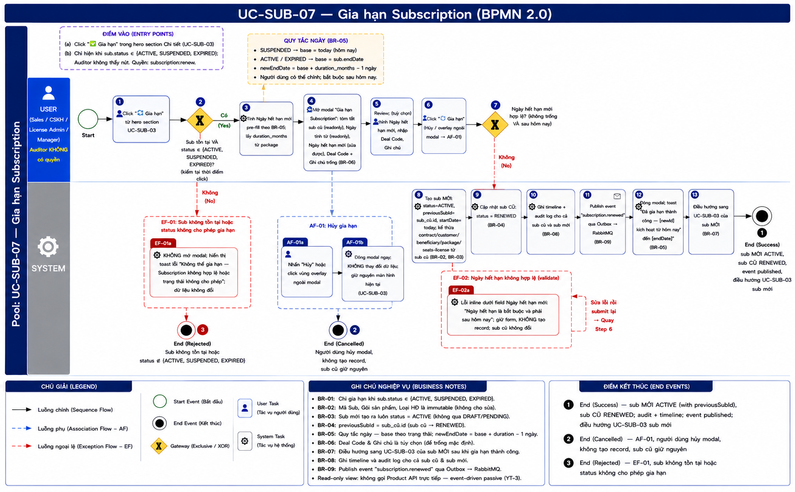
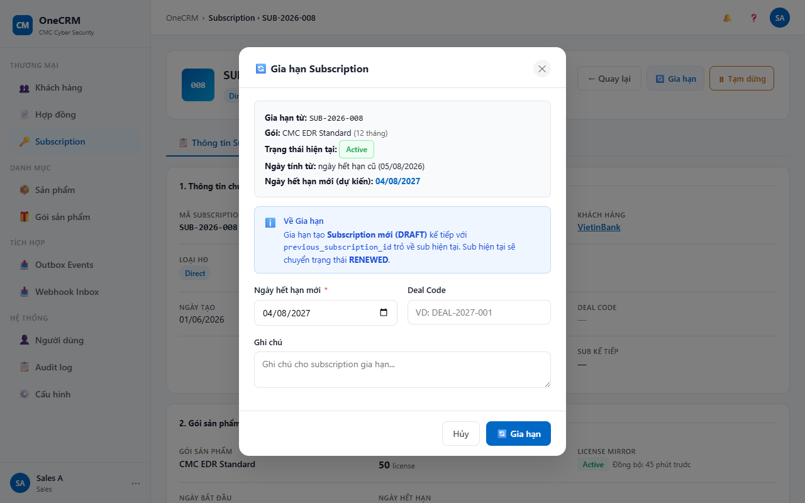
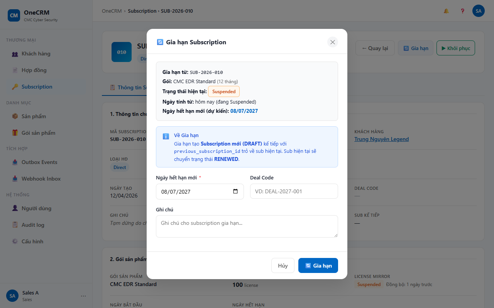

# UC-SUB-07 — Gia hạn Subscription

> Module: M-03 Subscription Management | Phiên bản: 1.2 | Ngày: 13/07/2026
> Trạng thái: Draft for Review

---

## 1. Thông tin chung

| Thuộc tính | Nội dung |
|---|---|
| **Mã Use Case** | UC-SUB-07 |
| **Tên** | Gia hạn Subscription |
| **Mô tả** | Sales / CSKH / License Admin / Manager gia hạn một subscription cũ. Khi xác nhận, hệ thống tạo subscription mới với `status = ACTIVE` (không qua DRAFT), publish event `subscription.renewed` để Product Module tạo license mới. Sub cũ chuyển sang RENEWED. |
| **Tác nhân** | Sales, CSKH, License Admin, Manager (Auditor không có quyền) |
| **Tiền điều kiện** | (1) Đã đăng nhập với role Sales / CSKH / License Admin / Manager; có quyền `subscription:renew`. (2) Subscription tồn tại và `sub.status ∈ {ACTIVE, SUSPENDED, EXPIRED}`. |
| **Hậu điều kiện** | (Thành công) Một subscription mới được tạo với `status = ACTIVE`, `previousSubId` trỏ về sub cũ. Sub cũ chuyển thành `status = RENEWED`. Event `subscription.renewed` được publish. (Thất bại) Không có thay đổi nào được thực hiện. |
| **Trigger** | User click "🔄 Gia hạn" trong hero section UC-SUB-03. |
| **Liên kết** | UC-SUB-01 (Danh sách), UC-SUB-03 (Chi tiết sub mới — điều hướng sau khi gia hạn) |

### Business Rules

| Mã | Nội dung |
|---|---|
| **BR-01** | Nút "🔄 Gia hạn" hiển thị khi `sub.status ∈ {ACTIVE, SUSPENDED, EXPIRED}`. Không hiển thị với các trạng thái DRAFT, REVOKED, RENEWED, PENDING_PROVISION. Role Auditor không thấy nút này. |
| **BR-02** | Subscription mới kế thừa toàn bộ thông tin từ sub cũ: `contractId`, `contractType`, `customerId`, `beneficiaryId`, `beneficiaryName`, `packageId`, `packageName`, `productId`, `seatCount`/`licenseQty`. |
| **BR-10** | **Gia hạn giữ nguyên `package_id` của sub cũ — kể cả khi gói đó đã `RETIRED` (grandfathering).** "Ngừng bán" là quyết định thương mại (không chào bán cho KH **mới**), **không** chấm dứt dịch vụ với KH hiện hữu: HĐ đã ký ghi rõ gói + giá + điều khoản. Hệ thống **KHÔNG** tự thay gói sang bản `ACTIVE` mới và **KHÔNG** chặn gia hạn vì lý do gói `RETIRED`. `duration_months` cũng lấy từ **đúng phiên bản gói đã ghim**. |
| **BR-11** | **Đổi sub sang phiên bản gói mới KHÔNG phải gia hạn — đó là Upgrade.** Upgrade cần KH đồng ý (thay đổi điều khoản thương mại) và thuộc **OQ-06 (Upgrade/Downgrade)** — **Phase 1 chưa hỗ trợ**, API trả `501 NOT_IMPLEMENTED`. Modal gia hạn **không có** lựa chọn đổi gói. |
| **BR-03** | Subscription mới có `status = ACTIVE` ngay khi tạo và `previousSubId = sub_cũ.id`. Không qua trạng thái DRAFT hay PENDING_PROVISION. |
| **BR-04** | Sub cũ chuyển thành `status = RENEWED` ngay khi gia hạn thành công. |
| **BR-05** | Tính ngày hết hạn mới theo quy tắc: (a) Nếu `sub.status = SUSPENDED`: base = today (ngày hiện tại); (b) Nếu `sub.status ∈ {ACTIVE, EXPIRED}`: base = `sub.endDate` (ngày hết hạn cũ); `newEndDate = base + duration_months - 1 ngày`. `duration_months` lấy từ gói sản phẩm (`package.duration_months`). Người dùng có thể chỉnh ngày hết hạn mới trong form trước khi xác nhận. Ngày hết hạn mới **bắt buộc phải sau ngày hiện tại**. |
| **BR-06** | Deal Code và Ghi chú là trường mới, không kế thừa từ sub cũ. Người dùng nhập cho lần gia hạn này. |
| **BR-07** | Sau khi tạo thành công, hệ thống điều hướng sang trang UC-SUB-03 của subscription mới. |
| **BR-08** | Timeline sub mới ghi: `"Subscription gia hạn — kích hoạt · Gia hạn từ [predecessor_id] · Event subscription.renewed published"`. Timeline sub cũ ghi: `"Đã được gia hạn · Subscription kế tiếp: [newId]"`. |
| **BR-09** | CRM publish event `subscription.renewed` qua Outbox → RabbitMQ. Product Module nhận, tạo Tenant License mới, đánh dấu license cũ là Renewed, và gửi inbound event `license.activated` về CRM để xác nhận. CRM không gọi Product API trực tiếp (YT-3). |

---

## 2. Luồng nghiệp vụ



### 2.1 Luồng chính

> Số bước khớp badge trong ảnh BPMN. Bước **2** và **7** là Gateway (XOR) — điều kiện rẽ nhánh ghi gọn trong cùng ô.

> **QUY TẮC NGÀY (BR-05):** `SUSPENDED` → base = today (hôm nay); `ACTIVE` / `EXPIRED` → base = `sub.endDate` cũ. `newEndDate = base + duration_months − 1 ngày`. Người dùng có thể chỉnh, nhưng **bắt buộc phải sau hôm nay**.

| Bước | Tác nhân | Hành động / Phản hồi | Ghi chú |
|---|---|---|---|
| **1** | User (Sales / CSKH / License Admin / Manager) | Click "🔄 Gia hạn" trong hero section UC-SUB-03. | Nút chỉ hiện khi `sub.status ∈ {ACTIVE, SUSPENDED, EXPIRED}` — BR-01 |
| **2** | System | **[Gateway — Sub tồn tại VÀ `sub.status ∈ {ACTIVE, SUSPENDED, EXPIRED}`?]** Có → tiếp bước 3. Không → **EF-01**. | Kiểm tra tại thời điểm click |
| **3** | System | Tính Ngày hết hạn mới pre-fill theo BR-05 (xem QUY TẮC NGÀY); lấy `duration_months` từ **đúng phiên bản gói đã ghim** (`sub.packageId`), kể cả khi gói đó `RETIRED`. | BR-05, BR-10 |
| **4** | System | Mở modal "Gia hạn Subscription": tóm tắt sub cũ (readonly), Ngày tính từ (readonly), Ngày hết hạn mới (pre-filled, sửa được), Deal Code + Ghi chú (trống). | BR-02, BR-06 |
| **5** | User | Review; (tuỳ chọn) chỉnh Ngày hết hạn mới, nhập Deal Code, nhập Ghi chú. | — |
| **6** | User | Click "🔄 Gia hạn". ["Hủy" / click overlay ngoài modal → **AF-01**] | — |
| **7** | System | **[Gateway — Ngày hết hạn mới hợp lệ? (không trống VÀ sau hôm nay)]** Có → tiếp bước 8. Không → **EF-02**. | Validate trước khi tạo record |
| **8** | System | Tạo subscription MỚI: `status = ACTIVE`, `previousSubId = sub_cũ.id`, `startDate = today`; kế thừa contract / customer / beneficiary / **package (giữ nguyên `package_id`, kể cả `RETIRED`)** / seats-license từ sub cũ. | BR-02, BR-03, BR-10 |
| **9** | System | Cập nhật sub CŨ: `status = RENEWED`. | BR-04 |
| **10** | System | Ghi timeline + audit log cho cả sub cũ và sub mới. | BR-08 |
| **11** | System | Publish event `subscription.renewed` qua Outbox → RabbitMQ. | BR-09 |
| **12** | System | Đóng modal; toast "Đã gia hạn thành công — [newId] kích hoạt từ hôm nay đến [endDate]". | BR-05 |
| **13** | System | Điều hướng sang trang UC-SUB-03 của subscription MỚI. | BR-07 |
| → | — | **End 1 (Success)** — sub MỚI `ACTIVE` (với `previousSubId`); sub CŨ `RENEWED`; timeline + audit ghi nhận; event `subscription.renewed` đã publish; điều hướng UC-SUB-03 sub mới. | — |

### 2.2 Luồng phụ

**[AF-01: Hủy gia hạn]** — kích hoạt tại **bước 6** khi người dùng không muốn gia hạn.

| Bước | Tác nhân | Hành động / Phản hồi |
|---|---|---|
| **AF-01a** | User | Nhấn "Hủy" hoặc click vùng overlay ngoài modal. |
| **AF-01b** | System | Đóng modal ngay lập tức; KHÔNG tạo record; giữ nguyên sub cũ. |
| → | — | **End 2 (Cancelled)** — quay lại UC-SUB-03 của sub cũ, trạng thái sub không đổi. |

### 2.3 Luồng ngoại lệ

**[EF-01: Status không hợp lệ]** — kích hoạt tại **bước 2** khi sub không tồn tại hoặc `sub.status ∉ {ACTIVE, SUSPENDED, EXPIRED}`.

| Bước | Tác nhân | Hành động / Phản hồi |
|---|---|---|
| **EF-01a** | System | KHÔNG mở modal; hiển thị toast lỗi "Không thể gia hạn — Subscription không hợp lệ hoặc trạng thái không cho phép gia hạn"; dữ liệu không đổi. |
| → | — | **End 3 (Rejected)** — kết thúc luồng, không có thay đổi nào. |

**[EF-02: Ngày hết hạn không hợp lệ]** — kích hoạt tại **bước 7** khi Ngày hết hạn mới trống hoặc không sau hôm nay.

| Bước | Tác nhân | Hành động / Phản hồi |
|---|---|---|
| **EF-02a** | System | Lỗi inline dưới field Ngày hết hạn mới: "Ngày hết hạn là bắt buộc và phải sau hôm nay"; giữ form, KHÔNG tạo record; sub cũ không đổi. |
| → | — | Sửa lỗi rồi submit lại → **quay bước 6** (KHÔNG phải End Event — đây là validation loop). |

### 2.4 Điểm kết thúc (End Events)

| # | Tên | Điều kiện |
|---|---|---|
| **End 1** | Success — Gia hạn thành công | Sub MỚI `status = ACTIVE` (với `previousSubId`); sub CŨ `status = RENEWED`; timeline + audit ghi nhận; event `subscription.renewed` đã publish qua Outbox; điều hướng sang UC-SUB-03 của sub mới |
| **End 2** | Cancelled — AF-01 | Người dùng nhấn "Hủy" / click overlay ngoài modal; không tạo record; sub cũ giữ nguyên |
| **End 3** | Rejected — EF-01 | Sub không tồn tại hoặc `sub.status ∉ {ACTIVE, SUSPENDED, EXPIRED}` — không cho phép gia hạn |

---

## 3. Mô tả giao diện

### 3.1 Wireframe

```
┌─ Gia hạn Subscription ────────────────────────────────────┐
│                                                             │
│  ┌── Thông tin gia hạn ──────────────────────────────────┐ │
│  │  Gia hạn từ:            SUB-2026-001                  │ │
│  │  Gói:                   EDR Pro (12 tháng)            │ │
│  │  Trạng thái hiện tại:   [● ACTIVE]                    │ │
│  │  Ngày tính từ:          ngày hết hạn cũ (20/01/2026)  │ │
│  │  Ngày hết hạn mới:      [  20/01/2027  ▼]             │ │
│  └───────────────────────────────────────────────────────┘ │
│                                                             │
│  Deal Code (tùy chọn):  [________________________]         │
│  Ghi chú (tùy chọn):   [________________________]         │
│                                                             │
│              [Hủy]              [🔄 Gia hạn]              │
└─────────────────────────────────────────────────────────────┘
```

> **Demo HTML:** [docs/demo/v2.4.0_subscriptions.html](../../demo/v2.4.0_subscriptions.html) — hàm `subOpenRenew(id)`, `subConfirmRenew()`

**Screenshot — Modal Gia hạn (sub đang ACTIVE):**



**Screenshot — Modal Gia hạn (sub đang SUSPENDED — ngày tính từ hôm nay):**



### 3.2 Thành phần giao diện

| # | Thành phần | Loại | Mô tả |
|---|---|---|---|
| 1 | Modal header | Text | Tiêu đề "Gia hạn Subscription", không thể kéo thay đổi kích thước. |
| 2 | Khung "Thông tin gia hạn" | Panel readonly | Hiển thị: mã sub cũ (Gia hạn từ), tên gói + thời hạn (Gói), badge trạng thái hiện tại (Trạng thái hiện tại), ngày tính từ kèm ghi chú (Ngày tính từ). Toàn bộ readonly — không chỉnh sửa được. |
| 3 | Field "Ngày hết hạn mới" | Date picker | Pre-filled theo BR-05. Cho phép người dùng chọn lại ngày khác. Bắt buộc khi submit. |
| 4 | Field "Deal Code" | Text input | Tuỳ chọn. Trống ban đầu. Không validate format. |
| 5 | Field "Ghi chú" | Textarea | Tuỳ chọn. Trống ban đầu. |
| 6 | Nút "Hủy" | Ghost button | Đóng modal, không thay đổi dữ liệu. Kích hoạt AF-01. |
| 7 | Nút "🔄 Gia hạn" | Primary button | Submit form, thực hiện bước 7–12 luồng chính. Disabled trong khi đang xử lý (loading state). |

### 3.3 Bảng field

| # | Field | Bắt buộc | Mô tả |
|---|---|---|---|
| 1 | Ngày hết hạn mới | Có | Pre-filled theo BR-05 (tính từ endDate cũ hoặc today tuỳ trạng thái sub). Người dùng có thể chỉnh. Bắt buộc khi submit. |
| 2 | Deal Code | Không | Text input mới cho lần gia hạn này. Không kế thừa từ sub cũ (BR-06). |
| 3 | Ghi chú | Không | Textarea. Không kế thừa từ sub cũ (BR-06). |

---

## 4. Acceptance Criteria

### Nhóm 1: Điều kiện hiển thị nút Gia hạn

| Mã | Given | When | Then |
|---|---|---|---|
| AC-SUB-07-01 | Sub có `status = ACTIVE`. | Xem hero section UC-SUB-03. | Nút "🔄 Gia hạn" hiển thị và active. |
| AC-SUB-07-02 | Sub có `status = SUSPENDED`. | Xem hero section UC-SUB-03. | Nút "🔄 Gia hạn" hiển thị và active. |
| AC-SUB-07-03 | Sub có `status = EXPIRED`. | Xem hero section UC-SUB-03. | Nút "🔄 Gia hạn" hiển thị và active. |
| AC-SUB-07-04 | Sub có `status ∈ {DRAFT, REVOKED, RENEWED, PENDING_PROVISION}`. | Xem hero section UC-SUB-03. | Nút "🔄 Gia hạn" không hiển thị. |
| AC-SUB-07-04b | User đăng nhập với role Auditor, sub có `status = ACTIVE`. | Xem hero section UC-SUB-03. | Nút "🔄 Gia hạn" không hiển thị (Auditor không có quyền gia hạn). |

### Nhóm 2: Nội dung modal

| Mã | Given | When | Then |
|---|---|---|---|
| AC-SUB-07-05 | Sub ACTIVE "SUB-2026-001", gói "EDR Pro 12 tháng", `endDate = 20/01/2026`. | Click "🔄 Gia hạn". | Modal mở. Hiển thị "Gia hạn từ: SUB-2026-001", "Gói: EDR Pro (12 tháng)", "Trạng thái hiện tại: ACTIVE", "Ngày tính từ: 20/01/2026 (ngày hết hạn cũ)". Ngày hết hạn mới pre-filled = 20/01/2027. |
| AC-SUB-07-06 | Sub SUSPENDED "SUB-2026-002", `endDate = 30/06/2026`, ngày hiện tại = 09/07/2026. | Click "🔄 Gia hạn". | "Ngày tính từ" hiển thị "09/07/2026 (hôm nay)". Ngày hết hạn mới pre-filled = 08/07/2027 (09/07/2026 + 12 tháng - 1 ngày). |
| AC-SUB-07-07 | Modal vừa mở. | Xem các field Deal Code và Ghi chú. | Cả 2 field đều trống. Không có giá trị kế thừa từ sub cũ. |

### Nhóm 3: Tạo subscription mới thành công

| Mã | Given | When | Then |
|---|---|---|---|
| AC-SUB-07-08 | Form hợp lệ, ngày hết hạn mới = 20/01/2027. | Click "🔄 Gia hạn". | Sub mới được tạo với `status = ACTIVE`, `previousSubId = sub_cũ.id`, kế thừa `contractId`, `beneficiaryId`, `packageId`, `packageName`, `customerId`, `seatCount`/`licenseQty` từ sub cũ. |
| AC-SUB-07-09 | Gia hạn thành công. | Kiểm tra sub cũ. | Sub cũ có `status = RENEWED`. |
| AC-SUB-07-10 | Gia hạn thành công, sub cũ = "SUB-2026-001", sub mới = "SUB-2026-005". | Xem timeline của cả 2 sub. | Timeline sub mới ghi: "Subscription gia hạn — kích hoạt · Gia hạn từ SUB-2026-001 · Event subscription.renewed published". Timeline sub cũ ghi: "Đã được gia hạn · Subscription kế tiếp: SUB-2026-005". |
| AC-SUB-07-11 | Gia hạn thành công. | Hệ thống xử lý xong (**bước 12–13**). | Modal đóng. Toast hiển thị "Đã gia hạn thành công — [newId] kích hoạt từ hôm nay đến [endDate]". Hệ thống điều hướng sang UC-SUB-03 của sub mới (status = ACTIVE). Kết thúc tại **End 1 (Success)**. |
| AC-SUB-07-18 | Gia hạn hợp lệ, đã qua gateway bước 7; sub mới `ACTIVE` (bước 8), sub cũ `RENEWED` (bước 9). | Sau khi cập nhật trạng thái xong. | Event `subscription.renewed` được publish vào Outbox → RabbitMQ (**bước 11**, BR-09) để Product Module tạo Tenant License mới. CRM **không** gọi Product API trực tiếp (YT-3). |

### Nhóm 3b: Gia hạn trên gói đã ngừng bán (grandfathering — BR-10, BR-11)

| Mã | Given | When | Then |
|---|---|---|---|
| AC-SUB-07-19 | Sub ACTIVE ghim gói "CMC EDR v2". Catalog đã chuyển v2 sang `RETIRED` và publish "CMC EDR v3" (`ACTIVE`). | Mở màn UC-SUB-03 của sub đó. | Nút "🔄 Gia hạn" **vẫn hiển thị và bấm được** — gói `RETIRED` không chặn gia hạn (BR-10). |
| AC-SUB-07-20 | Cùng bối cảnh AC-19. | Click "🔄 Gia hạn" rồi xác nhận. | Sub mới tạo với **`packageId` của "CMC EDR v2"** (không nhảy sang v3). `duration_months` lấy từ v2. Modal **không** có lựa chọn đổi gói (BR-11). |
| AC-SUB-07-21 | Sales muốn chuyển KH sang "CMC EDR v3". | Tìm chức năng đổi phiên bản gói trong modal gia hạn. | Không có. Đây là **Upgrade** — thuộc OQ-06, **Phase 1 chưa hỗ trợ**; API Upgrade trả `501 NOT_IMPLEMENTED` (BR-11). |

### Nhóm 4: Tính ngày hết hạn theo trạng thái sub cũ

| Mã | Given | When | Then |
|---|---|---|---|
| AC-SUB-07-12 | Sub ACTIVE, `endDate = 01/03/2026`, gói 12 tháng. | Mở modal gia hạn. | Ngày hết hạn mới pre-filled = 28/02/2027 (01/03/2026 + 12 tháng - 1 ngày). "Ngày tính từ" hiển thị "01/03/2026 (ngày hết hạn cũ)". |
| AC-SUB-07-13 | Sub EXPIRED, `endDate = 15/12/2025`, gói 6 tháng. | Mở modal gia hạn. | Ngày hết hạn mới pre-filled = 14/06/2026 (15/12/2025 + 6 tháng - 1 ngày). "Ngày tính từ" hiển thị "15/12/2025 (ngày hết hạn cũ)". |
| AC-SUB-07-14 | Sub SUSPENDED, `endDate = 30/04/2026`, gói 12 tháng, ngày hiện tại = 09/07/2026. | Mở modal gia hạn. | Ngày hết hạn mới pre-filled = 08/07/2027 (09/07/2026 + 12 tháng - 1 ngày). "Ngày tính từ" hiển thị "09/07/2026 (hôm nay)". Không dùng endDate cũ. |

### Nhóm 5: Ngoại lệ

| Mã | Given | When | Then |
|---|---|---|---|
| AC-SUB-07-15 | Sub có `status = RENEWED`. | URL trực tiếp hoặc gọi API gia hạn. | Gateway pre-check (**bước 2**) phát hiện status không hợp lệ → **End 3 (EF-01)**: toast lỗi "Không thể gia hạn — Subscription không hợp lệ hoặc trạng thái không cho phép gia hạn". Modal không mở. Không có record nào được tạo. |
| AC-SUB-07-16 | Modal đang mở, người dùng xóa ngày hết hạn mới thành trống. | Click "🔄 Gia hạn". | Gateway bước 7 phát hiện ngày trống → **EF-02**: lỗi inline bên dưới field "Ngày hết hạn là bắt buộc và phải sau hôm nay". Modal không đóng; **quay bước 6** (không phải End Event). Không có record nào được tạo. Sub cũ không thay đổi trạng thái. |
| AC-SUB-07-17 | Modal đang mở, người dùng nhập ngày hết hạn = ngày hôm nay hoặc ngày quá khứ. | Click "🔄 Gia hạn". | Gateway bước 7 phát hiện ngày không sau hôm nay → **EF-02**: lỗi inline "Ngày hết hạn là bắt buộc và phải sau hôm nay". Modal không đóng; **quay bước 6**. Không có record nào được tạo. |

---

## 5. Lịch sử thay đổi

| Phiên bản | Ngày | Người thực hiện | Mô tả thay đổi |
|---|---|---|---|
| 1.0 | 09/07/2026 | BA | Khởi tạo tài liệu — Draft for Review |
| 1.1 | 09/07/2026 | Claude (AI) | Đồng bộ §2 theo BPMN UC-SUB-07: nhúng ảnh; chuẩn hoá bước **1–13** khớp badge; gộp Gateway bước 2 & 7 vào một ô; thêm note "QUY TẮC NGÀY (BR-05)"; đưa End 1 vào cuối luồng chính; §2.4 End Events (End 1/2/3). AC: căn lại tham chiếu bước/End, thêm **AC-SUB-07-18** (publish `subscription.renewed` qua Outbox — bước 11). |
| 1.2 | 13/07/2026 | Claude (AI) | **Đồng bộ versioning gói (M-04)**: thêm **BR-10** (gia hạn **giữ nguyên `package_id`, kể cả gói `RETIRED`** — grandfathering theo chuẩn thị trường VN) và **BR-11** (đổi phiên bản gói = **Upgrade**, thuộc **OQ-06**, Phase 1 trả `501 NOT_IMPLEMENTED`; modal gia hạn không có lựa chọn đổi gói). Bước 3 & 8 lấy `duration_months` / package từ **đúng phiên bản đã ghim**. Thêm **Nhóm 3b** (AC-SUB-07-19..21). Nguồn: `docs/plans/M-04_versioning_decisions.md` (D1, D4). |

### Review Checklist

> Claude tự review — đánh dấu ✅/❌ trước khi submit cho BA review.

#### Nghiệp vụ
- ✅ Luồng chính bao phủ happy path (13 bước, Gateway XOR tại bước 2 & 7, kết thúc End 1)
- ✅ Luồng phụ đã định nghĩa: AF-01 (Hủy modal, bước 6 → End 2)
- ✅ Luồng ngoại lệ đầy đủ: EF-01 (status không hợp lệ, bước 2 → End 3), EF-02 (ngày hết hạn không hợp lệ, bước 7 → quay bước 6)
- ✅ BR đã định nghĩa rõ (BR-01 đến BR-09), bao gồm logic tính ngày theo từng trạng thái
- ✅ §2.4 End Events chuẩn hoá: End 1 Success / End 2 Cancelled / End 3 Rejected
- ✅ AC bao phủ 5 nhóm, 18 AC (≥ 12 theo yêu cầu); AC-SUB-07-18 kiểm tra publish event qua Outbox
- ✅ Phân biệt rõ 3 case tính ngày: ACTIVE / EXPIRED (từ endDate) vs SUSPENDED (từ today)
- ✅ Sub mới tạo trực tiếp ACTIVE — không qua DRAFT/PENDING_PROVISION (BR-03, OQ-D resolved)
- ✅ BR-09 publish event subscription.renewed (không phải passive observer cho renewal)
- ✅ Auditor không có quyền gia hạn (BR-01, AC-SUB-07-04b)

#### Giao diện
- ✅ Wireframe ASCII đúng layout modal
- ✅ Readonly fields đã ghi rõ nguồn dữ liệu và lý do không chỉnh sửa
- ✅ Deal Code và Ghi chú rõ ràng là trường mới, không kế thừa (BR-06)
- ✅ Footer button order đúng: [Hủy] trái · [🔄 Gia hạn] phải
- ✅ Demo reference đúng file `v2.4.0_subscriptions.html` với hàm `subOpenRenew(id)`, `subConfirmRenew()`
