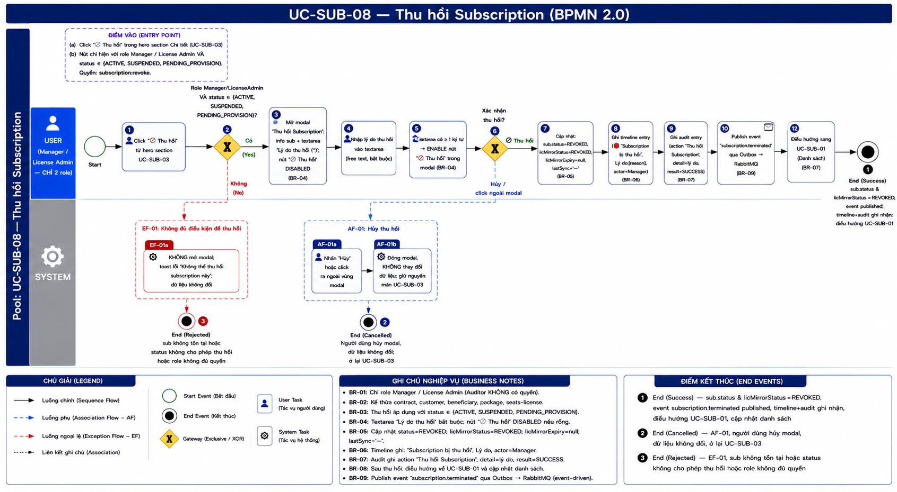
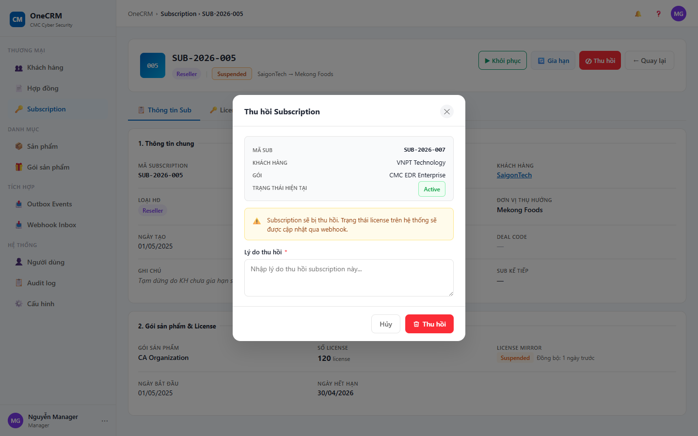
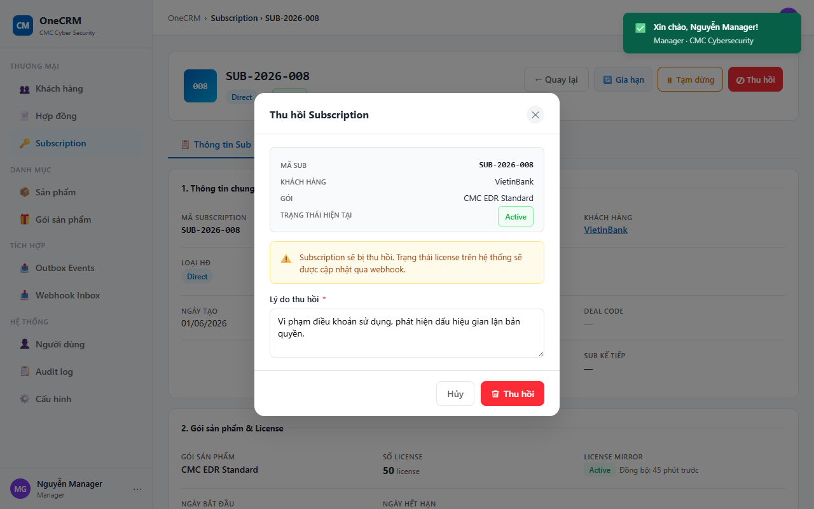

# UC-SUB-08 — Thu hồi Subscription

> Module: M-03 Subscription Management | Phiên bản: 1.0 | Ngày: 09/07/2026
> Trạng thái: Draft for Review

---

## 1. Thông tin chung

| Thuộc tính | Nội dung |
|---|---|
| **Mã Use Case** | UC-SUB-08 |
| **Tên** | Thu hồi Subscription |
| **Mô tả** | Manager hoặc License Admin thu hồi một subscription đang hoạt động, bị treo, hoặc đang chờ cấp phát. Thao tác yêu cầu nhập lý do thu hồi và xác nhận. Sau khi thu hồi, `sub.status` chuyển sang `REVOKED` (CRM không đụng `licMirrorStatus` — mirror chỉ-đọc, §3.4). CRM publish event `subscription.terminated` qua Outbox → RabbitMQ để Product Module xử lý phía kỹ thuật (YT-3). Thu hồi là hành động không thể hoàn tác trong Phase 1. |
| **Tác nhân** | Manager, License Admin |
| **Tiền điều kiện** | (1) Đã đăng nhập với role Manager hoặc License Admin; có quyền `subscription:revoke`. (2) Subscription tồn tại và `sub.status ∈ {ACTIVE, SUSPENDED, PENDING_PROVISION}`. |
| **Hậu điều kiện** | (Thành công) `sub.status = REVOKED`, `sub.licMirrorExpiry = null`, `sub.lastSync = '—'`. Event `subscription.terminated` được publish vào Outbox. Timeline và Audit ghi nhận hành động. Hệ thống điều hướng về UC-SUB-01. (Thất bại) Trạng thái không thay đổi. |
| **Trigger** | Manager click "⊘ Thu hồi" trong hero section UC-SUB-03. |
| **Liên kết** | UC-SUB-01 (Danh sách — điều hướng về sau khi thu hồi), UC-SUB-03 (Chi tiết — nơi trigger hành động) |

### Business Rules

| Mã | Nội dung |
|---|---|
| **BR-01** | Chỉ role Manager hoặc License Admin mới có quyền thực hiện thu hồi. Với các role khác (Sales, CSKH, v.v.): nút "⊘ Thu hồi" không hiển thị trong hero section. |
| **BR-02** | Subscription có thể bị thu hồi khi `sub.status ∈ {ACTIVE, SUSPENDED, PENDING_PROVISION}`. Nút "⊘ Thu hồi" hiển thị ở trạng thái active với các status này. |
| **BR-03** | Subscription không thể bị thu hồi khi `sub.status ∈ {REVOKED, EXPIRED, DRAFT, RENEWED}`. Nút "⊘ Thu hồi" **ẩn hoàn toàn** với các status này (không hiển thị disabled). |
| **BR-04** | Lý do thu hồi (free text) là **bắt buộc**. Nút "⊘ Thu hồi" trong modal bị disable cho đến khi người dùng nhập ít nhất một ký tự vào textarea lý do. |
| **BR-05** | Sau khi thu hồi thành công: `sub.status = REVOKED`, `sub.licMirrorExpiry = null`, `sub.lastSync = '—'`. **CRM KHÔNG tự ghi `licMirrorStatus`** — mirror là bản soi chiếu chỉ-đọc, chỉ đổi khi product gửi `license.revoked` (YT-1, §3.4); Phase 1 EDR chưa gửi nên mirror giữ nguyên và mismatch REVOKED được ẩn. |
| **BR-06** | Hệ thống ghi timeline entry: icon 🔴, nội dung "Subscription bị thu hồi", `Lý do: [reason]`, actor = tên Manager thực hiện. |
| **BR-07** | Hệ thống ghi audit entry: action "Thu hồi Subscription", detail = lý do thu hồi, result = SUCCESS. |
| **BR-08** | Sau khi thu hồi thành công: toast "Đã thu hồi — [sub.id] trạng thái chuyển sang REVOKED". Hệ thống điều hướng về UC-SUB-01 (Danh sách Subscription). |
| **BR-09** | Thu hồi là hành động **không thể hoàn tác** trong OneCRM Phase 1. CRM publish event `subscription.terminated` qua Outbox → RabbitMQ. Product Module nhận và xử lý (đình chỉ license vĩnh viễn phía kỹ thuật). CRM không gọi API Product trực tiếp (YT-3: publish outbound event, không command trực tiếp). Chi tiết payload và response event sẽ được định nghĩa đầy đủ trong module Inbound/Outbound. |

---

## 2. Luồng nghiệp vụ



### 2.1 Luồng chính

> Số bước khớp badge trong ảnh BPMN. Bước **2** và **6** là Gateway (XOR) — điều kiện rẽ nhánh ghi gọn trong cùng ô. (Badge cuối trong ảnh hiển thị số "12" — lỗi đánh số nhỏ, tương ứng **bước 11** điều hướng.)

| Bước | Tác nhân | Hành động / Phản hồi | Ghi chú |
|---|---|---|---|
| **1** | User (Manager / License Admin) | Click "⊘ Thu hồi" từ hero section UC-SUB-03. | Nút chỉ hiện với role Manager / License Admin — BR-01 |
| **2** | System | **[Gateway — Role Manager/License Admin VÀ `sub.status ∈ {ACTIVE, SUSPENDED, PENDING_PROVISION}`?]** Có → tiếp bước 3. Không → **EF-01**. | Pre-check tại thời điểm click — BR-01, BR-02 |
| **3** | System | Mở modal "Thu hồi Subscription" — tóm tắt sub (Mã Sub, Khách hàng, Gói, Trạng thái hiện tại) + textarea "Lý do thu hồi (*)"; nút "⊘ Thu hồi" trong modal **DISABLED**. | BR-04 |
| **4** | User | Nhập lý do thu hồi vào textarea (free text, bắt buộc). | — |
| **5** | System | Textarea có ≥ 1 ký tự → **ENABLE** nút "⊘ Thu hồi" trong modal. | BR-04 |
| **6** | User | **[Gateway — Xác nhận thu hồi?]** "⊘ Thu hồi" → tiếp bước 7. "Hủy" / click ngoài modal → **AF-01**. | — |
| **7** | System | Cập nhật: `sub.status = REVOKED`, `sub.licMirrorExpiry = null`, `sub.lastSync = '—'`. | BR-05 |
| **8** | System | Ghi timeline entry: icon 🔴, "Subscription bị thu hồi", `Lý do: [reason]`, actor = Manager. | BR-06 |
| **9** | System | Ghi audit entry: action "Thu hồi Subscription", detail = lý do, result = SUCCESS. | BR-07 |
| **10** | System | Publish event `subscription.terminated` qua Outbox → RabbitMQ. | BR-09 |
| **11** | System | Đóng modal; toast "Đã thu hồi — [sub.id] → REVOKED"; điều hướng về UC-SUB-01, cập nhật danh sách. | BR-08 |
| → | — | **End 1 (Success)** — `sub.status = REVOKED` (mirror giữ nguyên — §3.4), event đã publish, timeline+audit ghi nhận, điều hướng về UC-SUB-01. | — |

### 2.2 Luồng phụ

**[AF-01: Hủy thu hồi]** — kích hoạt tại bước 6 khi người dùng không xác nhận.

| Bước | Tác nhân | Hành động / Phản hồi |
|---|---|---|
| **AF-01a** | User | Nhấn "Hủy" hoặc click ra ngoài vùng modal. |
| **AF-01b** | System | Đóng modal. Không thay đổi dữ liệu; giữ nguyên màn UC-SUB-03. |
| → | — | **End 2 (Cancelled)** — quay lại UC-SUB-03, trạng thái sub không đổi. |

### 2.3 Luồng ngoại lệ

**[EF-01: Không đủ điều kiện để thu hồi]** — kích hoạt tại **bước 2** khi role không phải Manager / License Admin hoặc `sub.status ∉ {ACTIVE, SUSPENDED, PENDING_PROVISION}`.

| Bước | Tác nhân | Hành động / Phản hồi |
|---|---|---|
| **EF-01a** | System | KHÔNG mở modal; hiển thị toast error "Không thể thu hồi subscription này"; dữ liệu không đổi. |
| → | — | **End 3 (Rejected)** — sub không tồn tại hoặc status không cho phép hoặc role không đủ quyền. |

*Ghi chú: với role không đủ quyền, nút "⊘ Thu hồi" vốn đã ẩn (BR-01); EF-01a là guard chống trường hợp gọi trực tiếp hàm (bỏ qua UI).*

### 2.4 Điểm kết thúc (End Events)

| # | Tên | Điều kiện |
|---|---|---|
| **End 1** | Success — Thu hồi thành công | `sub.status = REVOKED`, `sub.licMirrorExpiry = null`, `sub.lastSync = '—'`; event `subscription.terminated` đã publish qua Outbox → RabbitMQ; timeline + audit ghi nhận; điều hướng về UC-SUB-01, cập nhật danh sách |
| **End 2** | Cancelled — AF-01 | Người dùng nhấn "Hủy" / click ngoài modal; dữ liệu không đổi; ở lại UC-SUB-03 |
| **End 3** | Rejected — EF-01 | Sub không tồn tại hoặc `sub.status` không cho phép hoặc role không đủ quyền — không mở modal, dữ liệu không đổi |

---

## 3. Mô tả giao diện

### 3.1 Wireframe modal

> **Demo HTML:** [docs/demo/v2.4.0_subscriptions.html](../../demo/v2.4.0_subscriptions.html)
> Hàm liên quan: `subOpenRevoke(id)`, `subConfirmRevoke()`, `subCanRevoke(sub)`, `subRevokeTooltip(sub)`

```
┌─ Thu hồi Subscription ────────────────────────────────────┐
│                                                             │
│  ┌── Thông tin ──────────────────────────────────────────┐ │
│  │  Mã Sub:              SUB-2026-001                    │ │
│  │  Khách hàng:          FPT Software                    │ │
│  │  Gói:                 EDR Pro                         │ │
│  │  Trạng thái hiện tại: [● ACTIVE]                      │ │
│  └───────────────────────────────────────────────────────┘ │
│                                                             │
│  Lý do thu hồi (*):                                        │
│  ┌───────────────────────────────────────────────────────┐ │
│  │  (Nhập lý do thu hồi...)                              │ │
│  └───────────────────────────────────────────────────────┘ │
│                                                             │
│  ⚠ Hành động này không thể hoàn tác.                       │
│                                                             │
│              [Hủy]          [⊘ Thu hồi] (disabled)        │
└─────────────────────────────────────────────────────────────┘
```

Nút "⊘ Thu hồi" trong modal chuyển sang **active** sau khi Manager nhập lý do (BR-04).

**Screenshot — Modal Thu hồi (chưa nhập lý do — nút disabled):**



**Screenshot — Modal Thu hồi (đã nhập lý do — nút enabled):**



### 3.2 Thành phần UI

| # | Thành phần | Loại | Mô tả |
|---|---|---|---|
| 1 | Tiêu đề modal | Heading | "Thu hồi Subscription" — căn trái, có icon ⊘. |
| 2 | Info box | Read-only card | Tóm tắt subscription: `Mã Sub`, `Khách hàng`, `Gói`, `Trạng thái hiện tại` (badge màu theo status). Background `#F9FAFB`, border nhẹ. |
| 3 | Label "Lý do thu hồi (\*)" | Label + Textarea | Bắt buộc. Placeholder: "Nhập lý do thu hồi...". Tối thiểu 3 rows. Nút "⊘ Thu hồi" disabled khi textarea trống (BR-04). |
| 4 | Cảnh báo không thể hoàn tác | Alert (warn) | Icon ⚠. Text: "Hành động này không thể hoàn tác." Background vàng nhạt. |
| 5 | Nút "⊘ Thu hồi" | Button (Danger) | Màu đỏ (`btn-danger`). **Disabled** khi textarea lý do trống; **active** khi đã điền. Sau khi nhấn: loading state, disabled để ngăn double-submit. |
| 6 | Nút "Hủy" | Button (Ghost) | Đóng modal, không thay đổi dữ liệu. |
| 7 | Toast thành công | Toast (Success) | "Đã thu hồi — [sub.id] trạng thái chuyển sang REVOKED". Hiển thị sau bước 10. |
| 8 | Toast lỗi | Toast (Error) | "Không thể thu hồi subscription này". Hiển thị khi EF-01. |

#### Trạng thái nút "⊘ Thu hồi" trong hero section UC-SUB-03

| Điều kiện | Trạng thái | Tooltip khi hover |
|---|---|---|
| Role Manager hoặc LicenseAdmin + `sub.status ∈ {ACTIVE, SUSPENDED, PENDING_PROVISION}` | Active — click được | Không có tooltip |
| Role Manager hoặc LicenseAdmin + `sub.status ∈ {REVOKED, EXPIRED, DRAFT, RENEWED}` | Ẩn hoàn toàn | — |
| Role khác (Sales, CSKH, v.v.) | Ẩn hoàn toàn | — |

---

## 4. Acceptance Criteria

### Nhóm 1: Phân quyền

| Mã | Given | When | Then |
|---|---|---|---|
| AC-SUB-08-01 | User đăng nhập với role Manager, sub có `status = ACTIVE`. | Xem hero section UC-SUB-03. | Nút "⊘ Thu hồi" hiển thị và ở trạng thái active (click được). |
| AC-SUB-08-01b | User đăng nhập với role License Admin, sub có `status = ACTIVE`. | Xem hero section UC-SUB-03. | Nút "⊘ Thu hồi" hiển thị và ở trạng thái active (giống Manager). |
| AC-SUB-08-02 | User đăng nhập với role Sales, sub có `status = ACTIVE`. | Xem hero section UC-SUB-03. | Nút "⊘ Thu hồi" **không hiển thị** trong hero section. |
| AC-SUB-08-03 | Role Manager, sub có `status = DRAFT`. | Xem hero section UC-SUB-03. | Nút "⊘ Thu hồi" **không hiển thị** (ẩn hoàn toàn — status DRAFT không đủ điều kiện). |

### Nhóm 2: Điều kiện status

| Mã | Given | When | Then |
|---|---|---|---|
| AC-SUB-08-04 | Role Manager, `sub.status = ACTIVE`. | Xem hero section. | Nút "⊘ Thu hồi" active, click được. |
| AC-SUB-08-05 | Role Manager, `sub.status = SUSPENDED`. | Xem hero section. | Nút "⊘ Thu hồi" active, click được. |
| AC-SUB-08-06 | Role Manager, `sub.status = PENDING_PROVISION`. | Xem hero section. | Nút "⊘ Thu hồi" active, click được. |
| AC-SUB-08-07 | Role Manager, `sub.status = REVOKED`. | Xem hero section UC-SUB-03. | Nút "⊘ Thu hồi" **không hiển thị** (ẩn hoàn toàn). |
| AC-SUB-08-08 | Role Manager, `sub.status = EXPIRED`. | Xem hero section UC-SUB-03. | Nút "⊘ Thu hồi" **không hiển thị** (ẩn hoàn toàn). |
| AC-SUB-08-09 | Role Manager, `sub.status = RENEWED`. | Xem hero section UC-SUB-03. | Nút "⊘ Thu hồi" **không hiển thị** (ẩn hoàn toàn). |

### Nhóm 3: Modal

| Mã | Given | When | Then |
|---|---|---|---|
| AC-SUB-08-10 | Role Manager (hoặc License Admin), sub ACTIVE "SUB-2026-001" của "FPT Software", gói "EDR Pro". | Click "⊘ Thu hồi". | Modal mở. Info box hiển thị đúng: Mã Sub = SUB-2026-001, Khách hàng = FPT Software, Gói = EDR Pro, Trạng thái hiện tại = badge ACTIVE. |
| AC-SUB-08-11 | Modal "Thu hồi Subscription" đang mở, textarea lý do trống. | Xem modal. | Nút "⊘ Thu hồi" trong modal ở trạng thái disabled. |
| AC-SUB-08-12 | Modal đang mở, textarea lý do trống. | Manager nhập lý do vào textarea. | Nút "⊘ Thu hồi" trong modal chuyển sang active ngay khi có ít nhất 1 ký tự. |

### Nhóm 4: Thu hồi thành công

| Mã | Given | When | Then |
|---|---|---|---|
| AC-SUB-08-13 | Modal đang mở, Manager đã nhập lý do "Khách hàng yêu cầu ngừng dịch vụ". | Click "⊘ Thu hồi" trong modal. | (**Bước 7**, BR-05) `sub.status` = REVOKED, `sub.licMirrorExpiry` = null, `sub.lastSync` = '—'. |
| AC-SUB-08-14 | Thu hồi thành công. | Xem timeline của sub. | (**Bước 8**, BR-06) Có entry mới nhất: icon 🔴, "Subscription bị thu hồi", "Lý do: Khách hàng yêu cầu ngừng dịch vụ", actor = tên Manager. |
| AC-SUB-08-15 | Thu hồi thành công. | Xem audit log của sub. | (**Bước 9**, BR-07) Có audit entry: action "Thu hồi Subscription", detail = lý do đã nhập, result = SUCCESS. |
| AC-SUB-08-20 | Thu hồi hợp lệ, sub đã chuyển REVOKED (**bước 7**). | Sau khi cập nhật trạng thái. | (**Bước 10**, BR-09) Event `subscription.terminated` được publish vào Outbox → RabbitMQ để Product Module xử lý. CRM **không** gọi API Product trực tiếp (YT-3: passive observer). |
| AC-SUB-08-16 | Thu hồi thành công. | Ngay sau khi xác nhận. | (**Bước 11**, BR-08) Modal đóng. Toast "Đã thu hồi — SUB-2026-001 → REVOKED" hiển thị. Hệ thống điều hướng về UC-SUB-01. Kết thúc tại **End 1 (Success)**. |
| AC-SUB-08-17 | Điều hướng về UC-SUB-01 sau thu hồi. | Xem danh sách. | Sub vừa thu hồi hiển thị badge "REVOKED". Dữ liệu danh sách được cập nhật không cần reload trang. |

### Nhóm 5: Exception

| Mã | Given | When | Then |
|---|---|---|---|
| AC-SUB-08-18 | Modal "Thu hồi Subscription" đang mở, Manager đã hoặc chưa nhập lý do. | Manager nhấn "Hủy" hoặc click ra ngoài vùng modal (**bước 6 → AF-01**). | Modal đóng. `sub.status` không thay đổi. Hệ thống giữ nguyên màn UC-SUB-03. Kết thúc tại **End 2 (Cancelled)**. |
| AC-SUB-08-19 | Sub có `sub.status = REVOKED` (hoặc role không đủ quyền). | Gọi trực tiếp hàm `subOpenRevoke(id)` (bỏ qua UI) — chạm **bước 2 → EF-01**. | System hiển thị toast error "Không thể thu hồi subscription này". Modal không mở. Dữ liệu không đổi. Kết thúc tại **End 3 (Rejected)**. |

---

## 5. Lịch sử thay đổi

| Phiên bản | Ngày | Người cập nhật | Nội dung |
|---|---|---|---|
| 1.0 | 09/07/2026 | Claude (AI) | Tạo mới — bóc tách từ yêu cầu BA, trace về PRD v2.3 (YT-3 passive observer). |
| 1.1 | 09/07/2026 | Claude (AI) | Đồng bộ §2 theo BPMN UC-SUB-08: nhúng ảnh; chuẩn hóa §2.1 (gateway bước 2 & 6 gọn 1 ô, số bước IN ĐẬM 1–11), §2.2 (AF-01a/b), §2.3 (EF-01a), thêm §2.4 End Events (End 1/2/3). §4: căn AC theo bước/End; **bổ sung AC-SUB-08-20 — kiểm tra publish event `subscription.terminated` qua Outbox (bước 10)**. |

### Review Checklist

> Claude tự review — đánh dấu ✅/❌ trước khi submit cho BA review.

#### Nghiệp vụ
- ✅ Luồng chính bao phủ happy path đầy đủ 11 bước, khớp badge ảnh BPMN (gateway bước 2 & 6)
- ✅ Luồng phụ đã định nghĩa: AF-01 (Hủy thu hồi) → End 2
- ✅ Luồng ngoại lệ đã định nghĩa: EF-01 (Không đủ điều kiện) → End 3
- ✅ §2.4 End Events: End 1 (Success) / End 2 (Cancelled) / End 3 (Rejected)
- ✅ BR đã định nghĩa rõ (BR-01 đến BR-09); BR-09 publish event subscription.terminated qua Outbox
- ✅ AC bao phủ 5 nhóm, 20 AC (thêm AC-SUB-08-20 kiểm tra Outbox publish tại bước 10)
- ✅ Điều kiện status cho phép (BR-02) và không cho phép (BR-03) ghi rõ, tooltip từng trường hợp

#### Giao diện
- ✅ Wireframe modal ASCII có đủ thành phần: info box, textarea, cảnh báo, footer buttons
- ✅ Mô tả 8 thành phần UI đầy đủ (§3.2)
- ✅ Bảng trạng thái nút hero section ghi đủ 6 trường hợp (3 status cho phép, 4 disabled, 1 ẩn)
- ✅ Footer button order đúng: [Hủy] trái · [⊘ Thu hồi] phải
- ✅ Demo reference có đủ 4 hàm: `subOpenRevoke`, `subConfirmRevoke`, `subCanRevoke`, `subRevokeTooltip`
