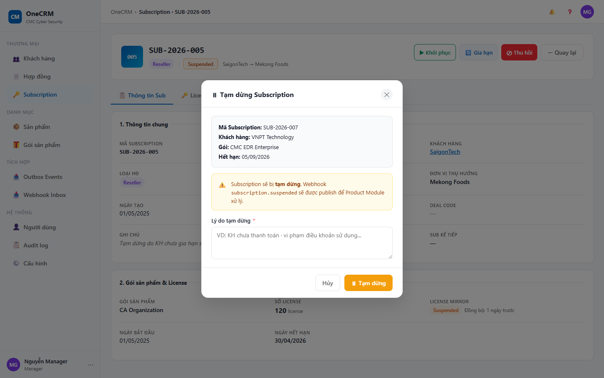
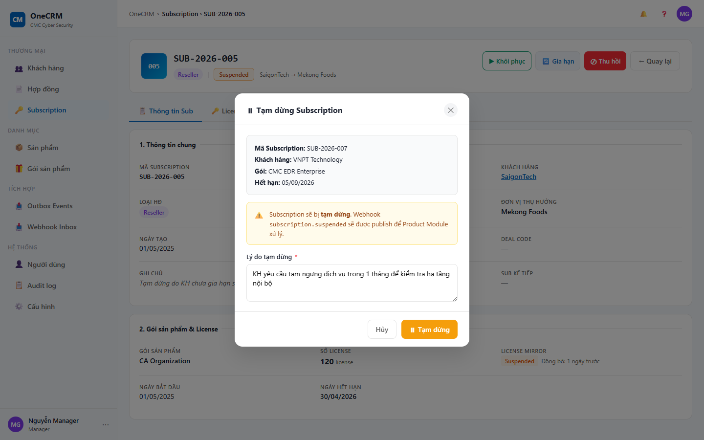

# UC-SUB-09 — Tạm dừng Subscription

> Module: M-03 Subscription Management | Phiên bản: 1.0 | Ngày: 09/07/2026
> Trạng thái: Draft for Review

---

## 1. Thông tin chung

| Thuộc tính | Nội dung |
|---|---|
| **Mã Use Case** | UC-SUB-09 |
| **Tên** | Tạm dừng Subscription |
| **Mô tả** | Sales hoặc Manager tạm dừng một subscription đang hoạt động. Thao tác yêu cầu nhập lý do và xác nhận qua modal. Sau khi tạm dừng, `sub.status` chuyển sang `SUSPENDED` và lý do được lưu lại để hiển thị tham khảo tại UC-SUB-10 (Khôi phục). CRM chỉ cập nhật trạng thái nội bộ và ghi nhận — không gửi lệnh kỹ thuật về Product Module (YT-3: passive observer). Tạm dừng có thể hoàn tác thông qua UC-SUB-10. |
| **Tác nhân** | Sales, Manager |
| **Tiền điều kiện** | (1) Đã đăng nhập với role Sales hoặc Manager; có quyền `subscription:suspend`. (2) Subscription tồn tại và `sub.status = ACTIVE`. |
| **Hậu điều kiện** | (Thành công) `sub.status = SUSPENDED`, `sub.suspendReason` được lưu. Timeline và Audit ghi nhận. Hero section và tab Thông tin chung cập nhật ngay trong trang UC-SUB-03 — không điều hướng khỏi trang. (Thất bại) Trạng thái không thay đổi. |
| **Trigger** | User click "⏸ Tạm dừng" trong hero section UC-SUB-03. |
| **Liên kết** | UC-SUB-03 (Chi tiết — trigger từ đây, cập nhật sau khi tạm dừng), UC-SUB-10 (Khôi phục — bước tiếp theo) |

### Business Rules

| Mã | Nội dung |
|---|---|
| **BR-01** | Chỉ Sales và Manager mới có quyền tạm dừng. CSKH và License Admin không thấy nút "⏸ Tạm dừng". |
| **BR-02** | Chỉ subscription có `sub.status = ACTIVE` mới có thể tạm dừng. Nút "⏸ Tạm dừng" không hiển thị với các trạng thái khác. |
| **BR-03** | Lý do tạm dừng (free text) là **bắt buộc**. Nút "⏸ Tạm dừng" trong modal bị disable đến khi người dùng nhập lý do. |
| **BR-04** | Sau khi tạm dừng: `sub.status = SUSPENDED`, `sub.suspendReason = reason`. |
| **BR-05** | Hệ thống ghi timeline entry: icon ⏸, nội dung "Tạm dừng subscription", `Lý do: [reason]`, `tl-dot-orange`, actor = người dùng hiện tại. |
| **BR-06** | Hệ thống ghi audit entry: action `SUSPEND`, detail = lý do, result = SUCCESS. |
| **BR-07** | Sau khi tạm dừng: toast "⏸ Đã tạm dừng — [sub.id] chuyển sang Suspended". Hệ thống cập nhật ngay hero section và tab Thông tin chung — **không điều hướng** khỏi trang UC-SUB-03. |
| **BR-08** | OneCRM là passive observer (YT-3) — không gửi lệnh kỹ thuật tạm dừng license về Product Module. Chỉ ghi nhận trạng thái nội bộ. |
| **BR-09** | Lý do tạm dừng (`suspendReason`) được hiển thị lại trong modal Khôi phục (UC-SUB-10) để người dùng tham khảo. |

---

## 2. Luồng nghiệp vụ

### 2.1 Luồng chính

| Bước | Tác nhân | Hành động | Ghi chú |
|---|---|---|---|
| 1 | Sales / Manager | Click "⏸ Tạm dừng" trong hero section màn UC-SUB-03. | Nút chỉ hiển thị với role Sales/Manager khi `sub.status = ACTIVE` (BR-01, BR-02). |
| 2 | System | Kiểm tra role thuộc {Sales, Manager} và `sub.status = ACTIVE` tại thời điểm click. | **[Gateway — Role hợp lệ và sub.status = ACTIVE?]** |
| — | — | → Có: tiếp bước 3. | — |
| — | — | → Không: **EF-01**. | Role không đủ hoặc status đã thay đổi |
| 3 | System | Mở modal "Tạm dừng Subscription" với thông tin tóm tắt (Mã Sub, Khách hàng, Gói, Ngày hết hạn), textarea lý do tạm dừng (trống), nút "⏸ Tạm dừng" ban đầu disabled. | BR-03 |
| 4 | Sales / Manager | Nhập lý do tạm dừng vào textarea (free text, bắt buộc). | — |
| 5 | System | Phát hiện textarea không trống → enable nút "⏸ Tạm dừng" trong modal. | BR-03 |
| 6 | Sales / Manager | Quyết định xác nhận hoặc hủy. | **[Gateway — Xác nhận tạm dừng?]** |
| — | — | → Nhấn "⏸ Tạm dừng": tiếp bước 7. | — |
| — | — | → Nhấn "Hủy" / click ngoài modal: **AF-01**. | — |
| 7 | System | Cập nhật: `sub.status = SUSPENDED`, `sub.suspendReason = reason`. | BR-04 |
| 8 | System | Ghi timeline entry: icon ⏸, "Tạm dừng subscription", `Lý do: [reason]`, `tl-dot-orange`, actor = người dùng hiện tại. | BR-05 |
| 9 | System | Ghi audit entry: action `SUSPEND`, detail = lý do, result = SUCCESS. | BR-06 |
| 10 | System | Đóng modal. Hiển thị toast "⏸ Đã tạm dừng — [sub.id] chuyển sang Suspended". Cập nhật hero section và tab Thông tin chung ngay trong trang UC-SUB-03. | BR-07 |
| → | — | **End 1 (Success)** | — |

### 2.2 Luồng phụ

**[AF-01: Hủy tạm dừng]** — kích hoạt tại bước 6 khi người dùng không xác nhận.

| Bước | Tác nhân | Hành động | Ghi chú |
|---|---|---|---|
| 6a | Sales / Manager | Nhấn "Hủy" hoặc click ra ngoài vùng modal. | — |
| 6b | System | Đóng modal. Không thay đổi bất kỳ dữ liệu nào. Giữ nguyên màn UC-SUB-03. | — |
| → | — | **End 2 (AF-01 — Hủy thao tác)** | — |

### 2.3 Luồng ngoại lệ

**[EF-01: Không đủ điều kiện để tạm dừng]** — kích hoạt tại bước 2 khi role không hợp lệ hoặc `sub.status ≠ ACTIVE`.

| Bước | Tác nhân | Hành động | Ghi chú |
|---|---|---|---|
| 2a | System | Không mở modal. Hiển thị toast error: "Không thể tạm dừng subscription này". | Role không phải Sales/Manager hoặc `sub.status ≠ ACTIVE` → nút đã ẩn (BR-01, BR-02); guard phòng trường hợp gọi trực tiếp. |
| → | — | **End 3 (EF-01 — Failure)** | — |

### 2.4 Điểm kết thúc (End Events)

| # | Tên | Điều kiện |
|---|---|---|
| **End 1** | Success — Tạm dừng thành công | `sub.status = SUSPENDED`, toast hiện, trang UC-SUB-03 cập nhật ngay |
| **End 2** | AF-01 — Hủy thao tác | Người dùng nhấn Hủy hoặc click ngoài modal |
| **End 3** | Failure — EF-01 (Không đủ điều kiện) | Role không hợp lệ hoặc `sub.status ≠ ACTIVE` tại thời điểm click |

---

## 3. Mô tả giao diện

> **Demo HTML:** [docs/demo/v2.4.0_subscriptions.html](../../demo/v2.4.0_subscriptions.html)
> Hàm liên quan: `subOpenSuspend(id)`, `subConfirmSuspend()`, `subCanSuspend(sub)`, `subOnSuspendReasonChange()`

### 3.1 Wireframe modal

```
┌─ Tạm dừng Subscription ───────────────────────────────────┐
│                                                             │
│  ┌── Thông tin ──────────────────────────────────────────┐ │
│  │  Mã Subscription:  SUB-2026-001                       │ │
│  │  Khách hàng:       FPT Software                       │ │
│  │  Gói:              EDR Pro                            │ │
│  │  Hết hạn:          20/01/2027                         │ │
│  └───────────────────────────────────────────────────────┘ │
│                                                             │
│  Lý do tạm dừng (*):                                       │
│  ┌───────────────────────────────────────────────────────┐ │
│  │  (Nhập lý do tạm dừng...)                             │ │
│  └───────────────────────────────────────────────────────┘ │
│                                                             │
│              [Hủy]          [⏸ Tạm dừng] (disabled)       │
└─────────────────────────────────────────────────────────────┘
```

Nút "⏸ Tạm dừng" chuyển sang **active** sau khi người dùng nhập lý do (BR-03).

**Screenshot — Modal Tạm dừng (chưa nhập lý do):**



**Screenshot — Modal Tạm dừng (đã nhập lý do — nút enabled):**



### 3.2 Thành phần UI

| # | Thành phần | Loại | Mô tả |
|---|---|---|---|
| 1 | Tiêu đề modal | Heading | "Tạm dừng Subscription" — căn trái, có icon ⏸. |
| 2 | Info box | Read-only card | Tóm tắt subscription: `Mã Subscription`, `Khách hàng`, `Gói`, `Hết hạn`. Background `#F9FAFB`, border nhẹ. |
| 3 | Label "Lý do tạm dừng (\*)" | Label + Textarea | Bắt buộc. Placeholder: "Nhập lý do tạm dừng...". Tối thiểu 3 rows. Nút "⏸ Tạm dừng" disabled khi textarea trống (BR-03). |
| 4 | Nút "⏸ Tạm dừng" | Button (Warning) | Màu cam / amber (`btn-warning`). **Disabled** khi textarea lý do trống; **active** khi đã điền. Sau khi nhấn: loading state, disabled để ngăn double-submit. |
| 5 | Nút "Hủy" | Button (Ghost) | Đóng modal, không thay đổi dữ liệu. |
| 6 | Toast thành công | Toast (Warning) | "⏸ Đã tạm dừng — [sub.id] chuyển sang Suspended". Hiển thị sau bước 10. |
| 7 | Toast lỗi | Toast (Error) | "Không thể tạm dừng subscription này". Hiển thị khi EF-01. |

### 3.3 Trạng thái nút "⏸ Tạm dừng" trong hero section UC-SUB-03

| Điều kiện | Trạng thái | Ghi chú |
|---|---|---|
| Role Sales hoặc Manager + `sub.status = ACTIVE` | Active — click được | BR-01, BR-02 |
| Role Sales hoặc Manager + `sub.status ≠ ACTIVE` | Ẩn hoàn toàn | BR-02 — không disabled, ẩn hẳn |
| Role CSKH hoặc License Admin (bất kỳ status) | Ẩn hoàn toàn | BR-01 |

---

## 4. Acceptance Criteria

### Nhóm 1: Phân quyền và điều kiện hiển thị nút

| Mã | Given | When | Then |
|---|---|---|---|
| AC-SUB-09-01 | User đăng nhập role Sales, sub có `status = ACTIVE`. | Xem hero section UC-SUB-03. | Nút "⏸ Tạm dừng" hiển thị và ở trạng thái active (click được). |
| AC-SUB-09-02 | User đăng nhập role Manager, sub có `status = ACTIVE`. | Xem hero section UC-SUB-03. | Nút "⏸ Tạm dừng" hiển thị và ở trạng thái active (click được). |
| AC-SUB-09-03 | User đăng nhập role CSKH, sub có `status = ACTIVE`. | Xem hero section UC-SUB-03. | Nút "⏸ Tạm dừng" **không hiển thị** (ẩn hoàn toàn). |
| AC-SUB-09-04 | User đăng nhập role License Admin, sub có `status = ACTIVE`. | Xem hero section UC-SUB-03. | Nút "⏸ Tạm dừng" **không hiển thị** (ẩn hoàn toàn). |
| AC-SUB-09-05 | User đăng nhập role Sales hoặc Manager, sub có `status = SUSPENDED`. | Xem hero section UC-SUB-03. | Nút "⏸ Tạm dừng" **không hiển thị** (ẩn hoàn toàn). |

### Nhóm 2: Modal

| Mã | Given | When | Then |
|---|---|---|---|
| AC-SUB-09-06 | Sub ACTIVE "SUB-2026-001", `customerName = "FPT Software"`, `packageName = "EDR Pro"`, `endDate = "20/01/2027"`. | Sales click "⏸ Tạm dừng". | Modal mở. Info box hiển thị đúng: Mã Subscription = SUB-2026-001, Khách hàng = FPT Software, Gói = EDR Pro, Hết hạn = 20/01/2027. |
| AC-SUB-09-07 | Modal "Tạm dừng Subscription" đang mở, textarea lý do trống. | Xem modal. | Nút "⏸ Tạm dừng" trong modal ở trạng thái disabled — không click được. |
| AC-SUB-09-08 | Modal đang mở, textarea lý do trống. | Sales nhập lý do vào textarea. | Nút "⏸ Tạm dừng" trong modal chuyển sang active ngay khi có ít nhất 1 ký tự. |
| AC-SUB-09-09 | Modal đang mở (đã hoặc chưa nhập lý do). | Sales nhấn "Hủy" hoặc click ra ngoài vùng modal. | Modal đóng. `sub.status` không thay đổi. Hệ thống giữ nguyên màn UC-SUB-03. |

### Nhóm 3: Tạm dừng thành công

| Mã | Given | When | Then |
|---|---|---|---|
| AC-SUB-09-10 | Modal đang mở. Sales đã nhập lý do "Chờ ký phụ lục điều chỉnh". | Click "⏸ Tạm dừng" trong modal. | `sub.status` = SUSPENDED; `sub.suspendReason` = "Chờ ký phụ lục điều chỉnh". |
| AC-SUB-09-11 | Tạm dừng thành công. | Xem timeline của sub. | Có entry mới nhất: icon ⏸, "Tạm dừng subscription", "Lý do: Chờ ký phụ lục điều chỉnh", `tl-dot-orange`, actor = tên người dùng hiện tại. |
| AC-SUB-09-12 | Tạm dừng thành công. | Xem audit log của sub. | Có audit entry: action = SUSPEND, detail = lý do đã nhập, result = SUCCESS. |
| AC-SUB-09-13 | Tạm dừng thành công. | Ngay sau khi xác nhận. | Modal đóng. Toast "⏸ Đã tạm dừng — SUB-2026-001 chuyển sang Suspended" hiển thị. Hero section cập nhật ngay: badge status = SUSPENDED. Hệ thống **không điều hướng** khỏi trang UC-SUB-03. |

### Nhóm 4: Exception

| Mã | Given | When | Then |
|---|---|---|---|
| AC-SUB-09-14 | User đăng nhập role CSKH. | Gọi trực tiếp hàm `subOpenSuspend(id)` (bỏ qua UI). | System hiển thị toast error "Không thể tạm dừng subscription này". Modal không mở. |
| AC-SUB-09-15 | Sub có `sub.status = SUSPENDED` (đã bị tạm dừng bởi user khác). | Sales click "⏸ Tạm dừng" trong hero section. | System kiểm tra lại status tại thời điểm click, phát hiện status ≠ ACTIVE. Toast error "Không thể tạm dừng subscription này" hiển thị. Modal không mở. |

---

## 5. Lịch sử thay đổi

| Phiên bản | Ngày | Người cập nhật | Nội dung |
|---|---|---|---|
| 1.0 | 09/07/2026 | Claude (AI) | Tạo mới — bóc tách từ yêu cầu BA, trace về PRD v2.3 (YT-3 passive observer, sub lifecycle). |

### Review Checklist

> Claude tự review — đánh dấu ✅/❌ trước khi submit cho BA review.

#### Nghiệp vụ
- ✅ Luồng chính bao phủ happy path đầy đủ 10 bước
- ✅ Luồng phụ đã định nghĩa: AF-01 (Hủy tạm dừng)
- ✅ Luồng ngoại lệ đã định nghĩa: EF-01 (Không đủ điều kiện)
- ✅ BR đã định nghĩa rõ (BR-01 đến BR-09), phân biệt rõ passive observer (BR-08) và liên kết UC-SUB-10 (BR-09)
- ✅ AC bao phủ 4 nhóm, 15 AC (vượt yêu cầu tối thiểu 10 AC)
- ✅ Phân biệt rõ: Sales VÀ Manager có quyền tạm dừng; CSKH và License Admin ẩn hoàn toàn

#### Giao diện
- ✅ Wireframe modal ASCII có đủ thành phần: info box (4 trường), textarea, footer buttons
- ✅ Mô tả 7 thành phần UI đầy đủ (§3.2)
- ✅ Bảng trạng thái nút hero section ghi đủ 3 trường hợp (§3.3)
- ✅ Khác biệt quan trọng: **không có cảnh báo "không thể hoàn tác"** (suspend khác revoke — có thể khôi phục qua UC-SUB-10)
- ✅ Khác biệt quan trọng: **không điều hướng** về UC-SUB-01 sau khi tạm dừng (khác UC-SUB-08)
- ✅ Demo reference có đủ 4 hàm: `subOpenSuspend`, `subConfirmSuspend`, `subCanSuspend`, `subOnSuspendReasonChange`
