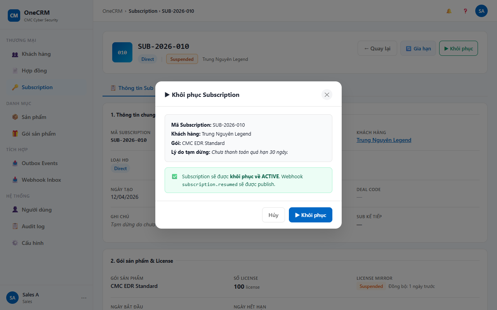

# UC-SUB-10 — Khôi phục Subscription

> Module: M-03 Subscription Management | Phiên bản: 1.0 | Ngày: 09/07/2026
> Trạng thái: Draft for Review

---

## 1. Thông tin chung

| Thuộc tính | Nội dung |
|---|---|
| **Mã Use Case** | UC-SUB-10 |
| **Tên** | Khôi phục Subscription |
| **Mô tả** | Sales hoặc Manager khôi phục một subscription đang bị tạm dừng (SUSPENDED) về trạng thái hoạt động (ACTIVE). Thao tác yêu cầu xác nhận qua modal hiển thị tóm tắt thông tin sub và lý do tạm dừng trước đó (nếu có). Không yêu cầu nhập lý do. Sau khi khôi phục, `sub.suspendReason` bị xóa khỏi record. CRM chỉ ghi nhận trạng thái nội bộ — không gửi lệnh kỹ thuật về Product Module (YT-3: passive observer). |
| **Tác nhân** | Sales, Manager |
| **Tiền điều kiện** | (1) Đã đăng nhập với role Sales hoặc Manager; có quyền `subscription:resume`. (2) Subscription tồn tại và `sub.status = SUSPENDED`. |
| **Hậu điều kiện** | (Thành công) `sub.status = ACTIVE`, `sub.suspendReason` bị xóa. Timeline và Audit ghi nhận hành động. Hero section và tab Thông tin chung cập nhật ngay trong trang UC-SUB-03 (không điều hướng). (Thất bại) Trạng thái không thay đổi. |
| **Trigger** | User click "▶ Khôi phục" trong hero section UC-SUB-03. |
| **Liên kết** | UC-SUB-03 (Chi tiết — trigger từ đây, cập nhật sau khi khôi phục), UC-SUB-09 (Tạm dừng — UC trước đó) |

### Business Rules

| Mã | Nội dung |
|---|---|
| **BR-01** | Chỉ Sales và Manager mới có quyền khôi phục. CSKH và License Admin không thấy nút "▶ Khôi phục". |
| **BR-02** | Chỉ subscription có `sub.status = SUSPENDED` mới có thể khôi phục. Nút không hiển thị với các trạng thái khác. |
| **BR-03** | Modal khôi phục hiển thị tóm tắt thông tin sub (Mã Sub, Khách hàng, Gói) và lý do tạm dừng trước đó (`sub.suspendReason`) nếu có — để người dùng tham khảo trước khi xác nhận. |
| **BR-04** | Khôi phục không yêu cầu nhập lý do — người dùng chỉ cần nhấn xác nhận. |
| **BR-05** | Sau khi khôi phục: `sub.status = ACTIVE`, `sub.suspendReason` bị xóa khỏi record. |
| **BR-06** | Hệ thống ghi timeline entry: icon ▶, "Khôi phục subscription", "Subscription được khôi phục về Active", tl-dot-green, actor = người dùng hiện tại. |
| **BR-07** | Hệ thống ghi audit entry: action `RESUME`, detail "Khôi phục từ Suspended", result = success. |
| **BR-08** | Sau khi khôi phục: toast "✅ Đã khôi phục — [sub.id] trở về Active". Hệ thống cập nhật ngay hero section và tab Thông tin chung (không điều hướng khỏi trang chi tiết). |
| **BR-09** | CRM publish event `subscription.resumed` qua Outbox → RabbitMQ. Product Module nhận và xử lý (khôi phục license phía kỹ thuật). CRM không gọi API Product trực tiếp (YT-3: publish outbound event, không command trực tiếp). |

---

## 2. Luồng nghiệp vụ

### 2.1 Luồng chính

| Bước | Tác nhân | Hành động | Ghi chú |
|---|---|---|---|
| 1 | Sales / Manager | Click "▶ Khôi phục" trong hero section UC-SUB-03. | Nút chỉ hiển thị với role Sales/Manager khi `sub.status = SUSPENDED` (BR-01, BR-02). |
| 2 | System | Kiểm tra role (Sales/Manager) và `sub.status = SUSPENDED`. | **[Gateway — Điều kiện hợp lệ?]** |
| — | — | → [Có]: tiếp bước 3. | — |
| — | — | → [Không]: **EF-01**. | Role không đủ hoặc status ≠ SUSPENDED |
| 3 | System | Mở modal "Khôi phục Subscription" hiển thị: Mã Sub, Khách hàng (+ Đơn vị thụ hưởng nếu RESELLER), Gói, và lý do tạm dừng (`sub.suspendReason`) nếu có. | BR-03 |
| 4 | Sales / Manager | Đọc thông tin tóm tắt trong modal. | **[Gateway — Xác nhận khôi phục?]** |
| — | — | → [Có]: Nhấn "▶ Khôi phục" → tiếp bước 5. | — |
| — | — | → [Không]: Nhấn "Hủy" hoặc click ngoài modal → **AF-01**. | — |
| 5 | System | Cập nhật `sub.status = ACTIVE`, xóa `sub.suspendReason`. | BR-05 |
| 6 | System | Ghi timeline entry: icon ▶, "Khôi phục subscription", "Subscription được khôi phục về Active", tl-dot-green, actor = người dùng hiện tại. | BR-06 |
| 7 | System | Ghi audit entry: action `RESUME`, detail "Khôi phục từ Suspended", result = success. | BR-07 |
| 8 | System | Đóng modal. Hiển thị toast "✅ Đã khôi phục — [sub.id] trở về Active". Cập nhật ngay hero section và tab Thông tin chung trong trang UC-SUB-03. | BR-08 |
| → | — | **End 1 (Success)** | — |

### 2.2 Luồng phụ

**[AF-01: Hủy khôi phục]** — kích hoạt tại bước 4 khi người dùng không xác nhận.

| Bước | Tác nhân | Hành động | Ghi chú |
|---|---|---|---|
| 4a | Sales / Manager | Nhấn **"Hủy"** hoặc click vùng ngoài modal. | — |
| 4b | System | Đóng modal. Không thay đổi dữ liệu. Giữ nguyên màn hình UC-SUB-03. | — |
| → | — | **End 2 (AF-01 — Hủy thao tác)** | — |

### 2.3 Luồng ngoại lệ

**[EF-01: Không đủ điều kiện để khôi phục]** — kích hoạt tại bước 2 khi role không phải Sales/Manager hoặc `sub.status ≠ SUSPENDED`.

| Bước | Tác nhân | Hành động | Ghi chú |
|---|---|---|---|
| 2a | System | Không mở modal. Hiển thị toast error: "Không thể khôi phục subscription này". | Nút ẩn hoàn toàn với role/status không hợp lệ (BR-01, BR-02) — đây là guard phòng trường hợp gọi trực tiếp qua hàm JS. |
| → | — | **End 3 (EF-01 — Failure)** | — |

---

## 3. Mô tả giao diện

> **Demo HTML:** [docs/demo/v2.4.0_subscriptions.html](../../demo/v2.4.0_subscriptions.html)
> Hàm liên quan: `subOpenResume(id)`, `subConfirmResume()`, `subCanResume(sub)`

### 3.1 Wireframe modal

```
┌─ Khôi phục Subscription ──────────────────────────────────┐
│                                                             │
│  ┌── Thông tin ──────────────────────────────────────────┐ │
│  │  Mã Subscription:   SUB-2026-001                      │ │
│  │  Khách hàng:        FPT Software                      │ │
│  │  Gói:               EDR Pro                           │ │
│  │  Lý do tạm dừng:    KH yêu cầu tạm ngưng 1 tháng     │ │
│  └───────────────────────────────────────────────────────┘ │
│                                                             │
│  Subscription sẽ được khôi phục về trạng thái Active.      │
│                                                             │
│              [Hủy]          [▶ Khôi phục]                  │
└─────────────────────────────────────────────────────────────┘
```

> Dòng "Lý do tạm dừng" chỉ hiển thị nếu `sub.suspendReason` tồn tại (BR-03).
> Với hợp đồng RESELLER: bổ sung dòng `Đơn vị thụ hưởng: {beneficiaryName}` ngay sau dòng Khách hàng.

**Screenshot — Modal Khôi phục Subscription:**



### 3.2 Thành phần UI

| # | Thành phần | Loại | Mô tả |
|---|---|---|---|
| 1 | Tiêu đề modal | Heading | "Khôi phục Subscription" — căn trái trong header modal. |
| 2 | Info box | Read-only card | Hiển thị: `Mã Subscription`, `Khách hàng`, `Đơn vị thụ hưởng` (chỉ RESELLER), `Gói`, `Lý do tạm dừng` (chỉ khi `sub.suspendReason` tồn tại). Background `#F9FAFB`, border `var(--border)`. |
| 3 | Văn bản xác nhận | Text | "Subscription sẽ được khôi phục về trạng thái Active." Căn trái, màu chữ mặc định. |
| 4 | Nút "▶ Khôi phục" | Button (Primary/Success) | Màu xanh lá (`btn-success`). Luôn active khi modal mở (không có field bắt buộc). Sau khi nhấn: loading state, disabled để ngăn double-submit. |
| 5 | Nút "Hủy" | Button (Ghost) | Đóng modal, không thay đổi dữ liệu. |
| 6 | Toast thành công | Toast (Success) | "✅ Đã khôi phục — [sub.id] trở về Active". Hiển thị sau khi cập nhật hoàn tất (bước 8). |
| 7 | Toast lỗi EF-01 | Toast (Error) | "Không thể khôi phục subscription này". Hiển thị khi EF-01. |
| 8 | Nút "▶ Khôi phục" trong hero UC-SUB-03 | Button (Primary/Success) | Chỉ hiển thị với role Sales/Manager khi `sub.status = SUSPENDED`. Ẩn hoàn toàn với mọi điều kiện khác. |

#### Trạng thái nút "▶ Khôi phục" trong hero section UC-SUB-03

| Điều kiện | Trạng thái | Tooltip khi hover |
|---|---|---|
| Role Sales hoặc Manager + `sub.status = SUSPENDED` | Active — click được | Không có tooltip |
| Role Sales hoặc Manager + `sub.status ≠ SUSPENDED` | Ẩn hoàn toàn | — |
| Role CSKH hoặc License Admin (bất kể status) | Ẩn hoàn toàn | — |

---

## 4. Acceptance Criteria

### Nhóm 1: Phân quyền và điều kiện hiển thị nút

| Mã | Given | When | Then |
|---|---|---|---|
| AC-SUB-10-01 | User đăng nhập với role Sales, sub có `status = SUSPENDED`. | Xem hero section UC-SUB-03. | Nút "▶ Khôi phục" hiển thị và ở trạng thái active (click được). |
| AC-SUB-10-02 | User đăng nhập với role Manager, sub có `status = SUSPENDED`. | Xem hero section UC-SUB-03. | Nút "▶ Khôi phục" hiển thị và ở trạng thái active (click được). |
| AC-SUB-10-03 | User đăng nhập với role CSKH, sub có `status = SUSPENDED`. | Xem hero section UC-SUB-03. | Nút "▶ Khôi phục" **không hiển thị** trong hero section. |
| AC-SUB-10-04 | User đăng nhập với role License Admin, sub có `status = SUSPENDED`. | Xem hero section UC-SUB-03. | Nút "▶ Khôi phục" **không hiển thị** trong hero section. |
| AC-SUB-10-05 | Role Sales, sub có `status = ACTIVE`. | Xem hero section UC-SUB-03. | Nút "▶ Khôi phục" **không hiển thị** (ẩn hoàn toàn). |
| AC-SUB-10-06 | Role Manager, sub có `status ∈ {DRAFT, PENDING_PROVISION, ACTIVE, EXPIRED, REVOKED, RENEWED}`. | Xem hero section UC-SUB-03. | Nút "▶ Khôi phục" **không hiển thị** (ẩn hoàn toàn). |

### Nhóm 2: Modal

| Mã | Given | When | Then |
|---|---|---|---|
| AC-SUB-10-07 | Role Sales, sub SUSPENDED "SUB-2026-001" của "FPT Software", gói "EDR Pro", `sub.suspendReason = "KH yêu cầu tạm ngưng 1 tháng"`. | Click "▶ Khôi phục". | Modal mở. Info box hiển thị đúng: Mã Subscription = SUB-2026-001, Khách hàng = FPT Software, Gói = EDR Pro, Lý do tạm dừng = "KH yêu cầu tạm ngưng 1 tháng". |
| AC-SUB-10-08 | Role Sales, sub SUSPENDED, `sub.suspendReason` là null hoặc rỗng. | Click "▶ Khôi phục". | Modal mở. Dòng "Lý do tạm dừng" **không hiển thị** trong info box. |
| AC-SUB-10-09 | Sub SUSPENDED thuộc hợp đồng RESELLER có `beneficiaryName = "Mekong Foods"`. | Click "▶ Khôi phục". | Modal hiển thị thêm dòng "Đơn vị thụ hưởng: Mekong Foods" ngay sau dòng Khách hàng. |
| AC-SUB-10-10 | Modal "Khôi phục Subscription" đang mở. | Sales nhấn "Hủy". | Modal đóng. `sub.status` không thay đổi. `sub.suspendReason` giữ nguyên. Hệ thống giữ nguyên màn UC-SUB-03. |
| AC-SUB-10-11 | Modal "Khôi phục Subscription" đang mở. | Sales click vùng ngoài modal (overlay). | Modal đóng. `sub.status` không thay đổi. |

### Nhóm 3: Khôi phục thành công

| Mã | Given | When | Then |
|---|---|---|---|
| AC-SUB-10-12 | Modal đang mở, sub "SUB-2026-001" có `sub.suspendReason = "KH yêu cầu tạm ngưng 1 tháng"`. | Sales nhấn "▶ Khôi phục" trong modal. | `sub.status` = ACTIVE. `sub.suspendReason` bị xóa (null / không còn trong record). |
| AC-SUB-10-13 | Khôi phục thành công. | Xem tab Timeline của sub. | Có entry mới nhất: icon ▶, "Khôi phục subscription", "Subscription được khôi phục về Active", tl-dot-green, actor = tên người dùng hiện tại. |
| AC-SUB-10-14 | Khôi phục thành công. | Xem tab Audit log của sub. | Có audit entry: action `RESUME`, detail "Khôi phục từ Suspended", result = success. |
| AC-SUB-10-15 | Khôi phục thành công. | Ngay sau khi xác nhận. | Modal đóng. Toast "✅ Đã khôi phục — SUB-2026-001 trở về Active" hiển thị. Hệ thống **không điều hướng** khỏi trang UC-SUB-03. |
| AC-SUB-10-16 | Khôi phục thành công. | Xem hero section và tab Thông tin chung trong UC-SUB-03. | Hero section cập nhật ngay: badge status hiển thị "ACTIVE". Tab Thông tin chung không còn hiển thị trường "Lý do tạm dừng". Nút "▶ Khôi phục" ẩn. |

### Nhóm 4: Exception

| Mã | Given | When | Then |
|---|---|---|---|
| AC-SUB-10-17 | Sub có `sub.status = ACTIVE` (không phải SUSPENDED). | Gọi trực tiếp hàm `subOpenResume(id)` (bỏ qua UI guard). | System hiển thị toast error "Không thể khôi phục subscription này". Modal không mở. |
| AC-SUB-10-18 | User có role CSKH (không có quyền `subscription:resume`). | Gọi trực tiếp hàm `subOpenResume(id)` (bỏ qua UI guard). | System hiển thị toast error "Không thể khôi phục subscription này". Modal không mở. |

---

## 5. Lịch sử thay đổi

| Phiên bản | Ngày | Người cập nhật | Nội dung |
|---|---|---|---|
| 1.0 | 09/07/2026 | Claude (AI) | Tạo mới — bóc tách từ yêu cầu BA, trace về PRD v2.3 (YT-3 passive observer). |

### Review Checklist

> Claude tự review — đánh dấu ✅/❌ trước khi submit cho BA review.

#### Nghiệp vụ
- ✅ Luồng chính bao phủ happy path đầy đủ 8 bước
- ✅ Luồng phụ đã định nghĩa: AF-01 (Hủy khôi phục)
- ✅ Luồng ngoại lệ đã định nghĩa: EF-01 (Không đủ điều kiện)
- ✅ BR đã định nghĩa rõ (BR-01 đến BR-09); BR-09 ghi rõ CRM publish outbound event (không passive)
- ✅ AC bao phủ 4 nhóm, 18 AC (vượt yêu cầu tối thiểu 10 AC)
- ✅ Điều kiện hiển thị nút phân rõ: Sales/Manager thấy khi SUSPENDED; CSKH/LicAdmin ẩn hoàn toàn; ẩn với mọi status khác SUSPENDED

#### Giao diện
- ✅ Wireframe modal ASCII có đủ thành phần: info box (với suspend reason có điều kiện), văn bản xác nhận, footer buttons
- ✅ Mô tả 8 thành phần UI đầy đủ (§3.2)
- ✅ Bảng trạng thái nút hero section ghi đủ 3 trường hợp (active / ẩn vì status / ẩn vì role)
- ✅ Footer button order đúng: [Hủy] trái · [▶ Khôi phục] phải
- ✅ Demo reference có đủ 3 hàm: `subOpenResume`, `subConfirmResume`, `subCanResume`
