**PRODUCT REQUIREMENTS DOCUMENT**

**HỆ THỐNG ONECRM**

**Phiên bản**: 2.5

**Ngày phát hành**: 13/07/2026

**Người soạn**: Nguyễn Công Giang

## Lịch sử phiên bản

| Phiên bản | Ngày | Người soạn | Thay đổi chính |
|----|----|----|----|
| 1.0 | 15/05/2026 | Nguyễn Thị Thái Hà | Bản đầu — 3 license strategy ngang nhau, OneCRM là License Management Platform |
| 2.0 | 22/05/2026 | Nguyễn Thị Thái Hà | Tái cấu trúc — OneCRM commercial thuần, Subscription là trung tâm, 1 sub : 1 package : 1 license. Event-driven passive (CRM publish event, KHÔNG gọi product). Kiến trúc Core + Product Module pluggable. License status & event type không chuẩn hoá — per Product Module declare. LICENSE_INSTANCE forward-compat skeleton. |
| 2.1 | 10/06/2026 | Nguyễn Thị Thái Hà | Bổ sung từ họp 09/06/2026:<br>Mô hình Đại lý (Reseller) + Pool License.Kích hoạt license theo actor cấu hình (gồm Sales-trigger cho EDR).Thông tin bắt buộc trên webhook (envelope + payload per event). |
| 2.2 | 23/06/2026 | Nguyễn Công Giang | Reseller Pool Multi-Product:<br>Thêm entity CONTRACT_POOL_ITEM thay pool_total:int trên CONTRACT.FR-CONT-01: input pool_items per product.FR-CONT-03: hiển thị Pool Balance per product.FR-SUB-01/04: pool check & deduction per product_id + optimistic lock.FR-LIC-06: filter reseller/beneficiary. Bổ sung OQ-NEW-01/02.Làm rõ HĐ DIRECT nhiều product là hợp lệ.<br>Update module Customer Management |
| 2.3 | 06/07/2026 | Nguyễn Công Giang | Bổ sung đặc tả đầy đủ module M-02 Contract Management: UC-CON-03 Xem Chi tiết HĐ (giao diện 4 tab: Thông tin HĐ, Subscriptions, Timeline, Audit Log; hỗ trợ cả DIRECT & RESELLER), UC-CON-04 Cập nhật HĐ (thêm Pool License cho RESELLER), UC-CON-05 Upload/Xóa file đính kèm, UC-CON-06 Xóa HĐ (soft delete; audit log best-effort; bắt buộc lý do xóa; chặn xóa khi đã có sub). |
| 2.4 | 09/07/2026 | Nguyễn Công Giang | Bổ sung đặc tả đầy đủ module **M-03 Subscription Management** qua bộ FRS UC-SUB-01..10 (Danh sách, Tạo, Chi tiết, Chỉnh sửa, Xác nhận, Xóa Draft, Gia hạn, Thu hồi, Tạm dừng, Khôi phục) — mỗi UC kèm sơ đồ BPMN 2.0 + Acceptance Criteria + mô tả giao diện.<br>**§6.3:** thay 10 bảng FR-SUB-01..10 bằng danh sách ánh xạ FR-SUB ↔ UC-SUB + link tới FRS; giữ FR-SUB-11 (auto-transition, hàm System).<br>**Thay đổi nghiệp vụ:** (1) Gia hạn — sub kế tiếp tạo **trực tiếp ACTIVE** + predecessor **RENEWED ngay**, license_mirror vẫn theo webhook inbound từ product (bỏ mô hình DRAFT→submit của v2.3; §5.5.1); (2) Xóa Draft là **hard delete, không ghi audit**; (3) Xác nhận thêm **re-check race condition** khi confirm.<br>**Data model (§5.3.4):** thêm cột `SUBSCRIPTION.suspend_reason` (lưu khi Tạm dừng, xóa khi Khôi phục). |
| 2.5 | 13/07/2026 | Nguyễn Công Giang | Bổ sung đặc tả đầy đủ module **M-04 Product & Package Catalog** (base lại theo FRS UC-CAT-01..07) + **versioning gói theo Model A (clone-forward)**.<br>**Thay đổi nghiệp vụ lan sang M-02 / M-03** — xem **§0 Changelog v2.5 cho Dev** ngay bên dưới. |

---

# §0. CHANGELOG v2.5 — HƯỚNG DẪN CHO DEV

> **Đọc mục này trước khi code.** Đây là danh sách đầy đủ những gì đổi từ v2.4 → v2.5, kèm nơi cần sửa.
>
> 📄 **Bản tóm tắt cho dev (đọc trước):** [`RELEASE_NOTE_v2.5.md`](./RELEASE_NOTE_v2.5.md) — gồm checklist bàn giao.
> ⚠️ **DB hiện tại phải ALTER** — DDL + kịch bản backfill tại **§0.3** bên dưới.
>
> Nguồn quyết định: `docs/plans/M-04_versioning_decisions.md` · FRS: `docs/frs/catalog/UC-CAT-01..07`

## 0.1. Quyết định nền (đọc để hiểu vì sao)

| # | Quyết định | Tóm tắt |
|---|---|---|
| **D0** | **Model A — Clone-forward versioning** | Mỗi version gói = **1 bản ghi PACKAGE bất biến**. Trạng thái (`DRAFT`/`ACTIVE`/`RETIRED`) nằm **trên bản ghi version**. **Rollback = tạo version MỚI (v+1)** sao chép cấu hình bản cũ; bản `RETIRED` không bị sửa. **Không** dùng Model B (re-activate + bảng `activation_history`). |
| **D1** | **Grandfathering khi gia hạn** | Sub gia hạn **giữ nguyên `package_id`** — **kể cả khi gói đó đã `RETIRED`**. "Ngừng bán" là hành động **thương mại** (không chào bán KH mới), KHÔNG chấm dứt dịch vụ với KH cũ. |
| **D2** | **Phạm vi chặn của RETIRED** | **Chặn:** chọn gói khi **tạo HĐ mới** / **thêm gói vào HĐ (pool)**. **KHÔNG chặn:** tạo sub trong HĐ đã ký, và **gia hạn**. |
| **D3** | **HĐ ghim phiên bản** | `CONTRACT` / `CONTRACT_POOL_ITEM` tham chiếu `package_id` = **1 bản ghi version cụ thể**, không phải "họ gói". Catalog publish v mới hay retire v cũ **không** đụng vào HĐ đã ký. |
| **D4** | **Đổi version = Upgrade** | Không được ngầm "nâng cấp" qua đường gia hạn. Upgrade thuộc **OQ-06** — **Phase 1 trả `501 NOT_IMPLEMENTED`**. |
| **D5** | **Pool ghim theo GÓI, không theo sản phẩm** | `CONTRACT_POOL_ITEM.package_id` thay cho `product_id` làm khoá nghiệp vụ. Lý do: pool theo `product_id` cho phép đại lý rút license của gói đắt tiền từ pool mua theo giá gói rẻ → **rò rỉ giá**. |

## 0.2. Việc phải làm — theo module

### M-04 Product & Package Catalog (mới, §6.4)

| # | Việc | Chi tiết |
|---|---|---|
| C1 | **Thay toàn bộ FR-CAT-01..09 cũ** | §6.4 được viết lại, base theo FRS UC-CAT-01..07. Bảng ánh xạ FR-CAT ↔ UC-CAT ở §6.4.2. |
| C2 | **PACKAGE: bỏ `tier`, bỏ `scope_template`** | `scope` đã chuyển sang SUBSCRIPTION từ v2.4 (§5.3.4/§5.3.7). `tier` không còn dùng. |
| C3 | **PACKAGE: thêm `version`, `status`, `rolled_back_from`** | `version` INT (tăng dần trong 1 họ gói theo `product_id`+`code`); `status ∈ {DRAFT, ACTIVE, RETIRED}`; `rolled_back_from` = `package_id` bản gốc khi version này sinh ra từ rollback (lineage). |
| C4 | **Bổ sung FR còn thiếu** | v2.4 chỉ có Publish/Retire. Nay thêm: **Xóa gói nháp** (hard delete, chỉ `DRAFT`) và **Rollback** (clone-forward v+1). |
| C5 | **Audit event bắt buộc** | Mọi **Publish / Retire / Delete / Rollback** phải ghi audit có **timestamp + actor**. Đây là điểm bù cho điểm yếu của Model A (không có timeline "version nào ACTIVE lúc nào" first-class). |
| C6 | **Clone-on-edit** | Sửa gói `DRAFT` **hoặc** `ACTIVE`-chưa-có-sub → **update tại chỗ**. Sửa gói `ACTIVE`-**đã có sub** → **tạo version mới ở trạng thái `DRAFT`**, không đụng bản đang chạy. |
| C7 | **Chọn tính năng ở mức Feature** | Gói tick feature từ `featureCatalog` của sản phẩm ở **mức Feature** (không phải mức module, không tách lẻ CRUD). Feature loại **"Mặc định"** luôn được include và **khóa** (không bỏ tick được). |
| C8 | **Danh sách gói gộp theo họ** | Màn danh sách gói hiển thị **1 dòng / 1 họ gói**, chọn phiên bản hiện hành theo ưu tiên **ACTIVE > DRAFT > RETIRED**. |

### M-02 Contract Management (§5.3.2, §5.3.3, §6.2)

| # | Việc | Chi tiết |
|---|---|---|
| B1 | **`CONTRACT` ghim `package_id` = version** (D3) | HĐ `DIRECT` **bắt buộc** chọn đúng 1 gói khi tạo. Lưu `package_id` của **1 phiên bản cụ thể**. |
| B2 | **`CONTRACT_POOL_ITEM`: khoá đổi từ `product_id` → `package_id`** (D5) | ⚠️ **Đây là thay đổi schema có ảnh hưởng lớn nhất.** Pool ghim theo gói. `product_id` giữ lại làm **cột dẫn xuất/hiển thị**, KHÔNG dùng làm khoá nghiệp vụ. Unique: `(contract_id, package_id)`. |
| B3 | **Dropdown gói chỉ hiện `ACTIVE`** (D2) | Áp dụng cho: tạo HĐ (DIRECT) và thêm pool (RESELLER). Gói `DRAFT` / `RETIRED` **không** được chọn. |
| B4 | **Trừ/hoàn pool tra theo `package_id`** | Mọi chỗ trước đây `poolItems.find(p => p.product_id === X)` phải đổi sang `p.package_id === X`. |
| B5 | **Hiển thị pool theo tên gói + phiên bản** | Danh sách HĐ (cột Pool License), Chi tiết HĐ (accordion Pool), Timeline, Audit — dùng `package_name` (kèm `v{version}`) thay cho `product_name`. |

**FRS đã cập nhật:** UC-CON-01 v1.1 · **UC-CON-02 v1.1** (thêm BR-07…BR-10) · UC-CON-03 v1.5 · **UC-CON-04 v1.1** (BR-02 viết lại, thêm BR-07).

### M-03 Subscription Management (§6.3, §6.9.6)

| # | Việc | Chi tiết |
|---|---|---|
| S1 | **Gói kế thừa từ HĐ đã ghim** (D3) | Tạo sub: lấy `package_id` từ `contract.packages[0]` (DIRECT) hoặc `pool.package_id` (RESELLER). **KHÔNG** tra bản `ACTIVE` hiện hành của catalog. |
| S2 | **Gia hạn giữ nguyên `package_id`, kể cả `RETIRED`** (D1) | Không chặn gia hạn vì gói ngừng bán. `duration_months` lấy từ **đúng phiên bản đã ghim**, không phải bản mới nhất. |
| S3 | **Đổi version ≠ gia hạn** (D4) | Modal gia hạn **không có** lựa chọn đổi gói. Upgrade → OQ-06, Phase 1 trả `501`. |
| S4 | **RESELLER: 1 pool = 1 gói** | Dropdown chọn gói khi tạo sub: mỗi pool là **1 option** (không còn `optgroup` theo sản phẩm). Hint pool tra theo `package_id`. |
| S5 | **Outbound payload thêm `package_code` + `package_version`** (§6.9.6) | Event `subscription.created` / `subscription.renewed` phải gửi đủ `package_code` **và** `package_version` — Product Module cần biết **chính xác cấu hình đã bán** (YT-3), tên gói không đủ. |

**FRS đã cập nhật:** **UC-SUB-02 v1.3** (thêm BR-12) · **UC-SUB-07 v1.2** (thêm BR-10, BR-11).

## 0.3. THAY ĐỔI SCHEMA v2.4 → v2.5 *(dev đọc kỹ — DB hiện tại phải ALTER)*

> ✅ **Xác nhận 13/07/2026: DB hiện tại là DỮ LIỆU TEST, chưa lên production.**
> → **Đường thực thi = §0.3.2 (DDL) + §0.3.3 (truncate & reseed).** Xong.
> → **§0.3.4 (backfill) KHÔNG áp dụng lần này** — giữ lại làm tham chiếu cho các lần đổi schema **sau khi đã có production**.

### 0.3.1. Tóm tắt

| Bảng | Loại thay đổi | Breaking? |
|---|---|---|
| `contract_package` | **TẠO MỚI** — HĐ DIRECT ghim gói (D3, D6) | Mới |
| `contract_pool_item` | **ĐỔI KHOÁ NGHIỆP VỤ** `product_id` → `package_id` (D5) | ⚠️ **BREAKING** |
| `package` | Thêm `rolled_back_from`; siết UNIQUE theo `(product_id, code, version)` (D0) | Nhẹ |
| `subscription` | **KHÔNG ĐỔI** — `package_id` vốn đã ghim 1 version cụ thể | Không |
| `contract` | **KHÔNG ĐỔI CỘT** — gói tách sang bảng `contract_package` | Không |
| `product_module_config.package_schema` (jsonb) | Gỡ `tier`, `tenant_mode`, `scope_template` khỏi nội dung schema EDR (§6.9.3) | Data-level |

### 0.3.2. DDL

> Cú pháp PostgreSQL. Chạy trong **1 transaction**; nếu bước backfill (§0.3.3) fail thì rollback toàn bộ.

```sql
-- ── 1. PACKAGE: lineage rollback + siết unique theo version
ALTER TABLE package
  ADD COLUMN rolled_back_from UUID NULL REFERENCES package(id);
COMMENT ON COLUMN package.rolled_back_from IS
  'Version này sinh ra từ Rollback bản nào (clone-forward, D0). NULL nếu tạo mới/clone-on-edit.';

-- v2.4 unique (product_id, code) sai với versioning — 1 họ gói có nhiều version
ALTER TABLE package DROP CONSTRAINT IF EXISTS package_product_code_uniq;
ALTER TABLE package
  ADD CONSTRAINT package_family_version_uniq UNIQUE (product_id, code, version);

-- ── 2. CONTRACT_PACKAGE: bảng mới — HĐ DIRECT ghim gói
CREATE TABLE contract_package (
  id          UUID PRIMARY KEY,
  contract_id UUID NOT NULL REFERENCES contract(id) ON DELETE CASCADE,
  package_id  UUID NOT NULL REFERENCES package(id),
  created_at  TIMESTAMPTZ NOT NULL DEFAULT now(),
  CONSTRAINT contract_package_uniq UNIQUE (contract_id, package_id)
);
-- Phase 1: ĐÚNG 1 gói / 1 HĐ DIRECT (D6). Enforce ở DB:
CREATE UNIQUE INDEX contract_package_one_per_contract ON contract_package (contract_id);
-- ↑ Phase sau muốn mở nhiều gói/HĐ: chỉ DROP INDEX này, không đổi schema.

-- ── 3. CONTRACT_POOL_ITEM: khoá đổi từ product_id → package_id  ⚠️ BREAKING
--    DB là dữ liệu test → xóa sạch pool cũ, KHÔNG backfill (xem §0.3.3)
TRUNCATE TABLE contract_pool_item;

ALTER TABLE contract_pool_item
  ADD COLUMN package_id UUID NOT NULL REFERENCES package(id);
ALTER TABLE contract_pool_item DROP CONSTRAINT IF EXISTS contract_pool_item_contract_product_uniq;
ALTER TABLE contract_pool_item
  ADD CONSTRAINT contract_pool_item_contract_package_uniq UNIQUE (contract_id, package_id);
COMMENT ON COLUMN contract_pool_item.product_id IS
  'CỘT DẪN XUẤT từ package.product_id — chỉ dùng hiển thị/lọc. KHÔNG dùng làm khoá nghiệp vụ (D5).';
```

> ⚠️ `TRUNCATE contract_pool_item` chỉ hợp lệ vì **DB đang là dữ liệu test**. Nếu tới lúc chạy migration mà DB **đã có số liệu hợp đồng thật**, **DỪNG LẠI** và làm theo **§0.3.4 (backfill)** thay vì truncate.

**Quy tắc bất di bất dịch sau migration:**

- `UNIQUE (contract_id, package_id)` — **1 pool = 1 gói**. **Tuyệt đối không nới** thành `(contract_id, product_id)`: nới ra là cho phép đại lý rút license **gói đắt** (vd CMC EPR ~4.5tr/seat) từ pool đã mua theo giá **gói rẻ** (vd CMC EPP ~800k/seat) → **rò rỉ giá, sai tiền thật**.
- 1 HĐ RESELLER có **N pool**; hai gói khác nhau của **cùng một sản phẩm** vẫn là **2 pool riêng biệt**.
- Mọi truy vấn trừ/kiểm tra pool phải join theo `package_id` của subscription, **không** theo `product_id`.

### 0.3.3. Reseed dữ liệu test ✅ *(ĐƯỜNG THỰC THI LẦN NÀY)*

DB là dữ liệu test → **không backfill**. Sau khi chạy DDL §0.3.2:

| Bảng | Việc |
|---|---|
| `contract_pool_item` | Đã `TRUNCATE` trong DDL. **Reseed** pool mới: mỗi dòng ghim `package_id` = 1 gói `ACTIVE`. Một HĐ RESELLER được có **nhiều pool** (mỗi pool 1 gói khác nhau, kể cả các gói cùng sản phẩm). |
| `contract_package` | Bảng mới → **seed**: mỗi HĐ `DIRECT` **đúng 1 dòng**, `package_id` = gói `ACTIVE`. |
| `package` | Seed lại theo Model A: mỗi version = 1 bản ghi riêng, `(product_id, code, version)` unique. Có ít nhất 1 họ gói **đa version** (vd `DRAFT` + `ACTIVE` + `RETIRED`) để test được luồng Publish / Retire / Rollback. |
| `subscription` | Kiểm tra `package_id` trỏ tới bản ghi `package` **có thật**. Nên có ≥ 1 sub trỏ gói **`RETIRED`** để test **grandfathering** (D1 — gia hạn vẫn phải chạy được). |

**Bộ seed tham chiếu:** `docs/demo/v2.5.0_catalog.html` (`CAT_PACKAGES`, `conContracts`) — đã dựng sẵn đúng các tình huống trên: gói đa version, HĐ RESELLER 2 pool, gói `RETIRED` đang có sub.

**Rào chắn sau reseed** — cả 3 query phải trả **0 dòng**:

```sql
-- (a) Pool trỏ gói không tồn tại
SELECT * FROM contract_pool_item p
  WHERE NOT EXISTS (SELECT 1 FROM package k WHERE k.id = p.package_id);

-- (b) product_id lệch với package.product_id (cột dẫn xuất phải khớp)
SELECT p.* FROM contract_pool_item p
  JOIN package k ON k.id = p.package_id
  WHERE p.product_id <> k.product_id;

-- (c) HĐ DIRECT không có đúng 1 gói
SELECT c.id, COUNT(cp.id) AS so_goi FROM contract c
  LEFT JOIN contract_package cp ON cp.contract_id = c.id
  WHERE c.type = 'DIRECT' GROUP BY c.id HAVING COUNT(cp.id) <> 1;
```

---

### 0.3.4. Backfill `contract_pool_item.package_id` — ⏸ **KHÔNG dùng lần này**

> **Chỉ áp dụng khi DB đã có số liệu hợp đồng THẬT.** Lần migration này DB là test → dùng §0.3.3 (reseed) thay thế.
> Giữ mục này để tham chiếu cho các lần đổi schema sau khi lên production.

Khi đó, thay `TRUNCATE` trong DDL bằng: thêm cột `package_id` **NULL tạm** → chạy backfill dưới đây → `SET NOT NULL` → thêm UNIQUE.

**Bước 1 — Phân loại pool đang có:**

```sql
-- Pool "SẠCH": mọi sub trong pool cùng 1 gói → backfill tự động được
-- Pool "BẨN":  sub trong pool thuộc ≥ 2 gói khác nhau → PHẢI TÁCH TAY
SELECT p.id AS pool_id, p.contract_id, p.product_id, p.pool_total, p.allocated_qty,
       COUNT(DISTINCT s.package_id) AS so_goi,
       ARRAY_AGG(DISTINCT s.package_id) AS cac_goi
FROM contract_pool_item p
LEFT JOIN subscription s
  ON s.contract_id = p.contract_id
 AND s.package_id IN (SELECT id FROM package WHERE product_id = p.product_id)
GROUP BY p.id, p.contract_id, p.product_id, p.pool_total, p.allocated_qty
ORDER BY so_goi DESC;
```

**Bước 2 — Xử lý theo từng nhóm:**

| Nhóm | `so_goi` | Cách xử lý |
|---|---|---|
| **Sạch** | `= 1` | `UPDATE contract_pool_item SET package_id = <gói đó>` — **tự động**. |
| **Rỗng** (pool chưa có sub nào) | `= 0` | **Không đoán được.** Gán `package_id` = gói `ACTIVE` của sản phẩm đó **chỉ khi sản phẩm có đúng 1 gói ACTIVE**; nếu có ≥ 2 gói → **BA/Sales tra hợp đồng giấy** để chọn. |
| **Bẩn** | `≥ 2` | ⛔ **KHÔNG có lời giải tự động.** Phải **tách thành N pool item** và **chia lại `pool_total`** — xem bên dưới. |

**Vì sao pool "bẩn" không tự động được:** giả sử pool `CMC EDR / pool_total=500 / allocated=300`, trong đó 250 sub dùng gói **CMC EPP v1** và 50 sub dùng gói **CMC EPR v1**. Máy biết 250 và 50 đã dùng, nhưng **200 seat còn trống thuộc pool nào thì chỉ hợp đồng giấy mới trả lời được**. Gán bừa 200 seat sang pool EPR = cho đại lý rút 200 license giá 4.5tr bằng tiền đã trả cho gói 800k.

**Quy trình tách pool bẩn (bắt buộc có BA/Sales ký xác nhận):**

1. BA/Sales mở **hợp đồng khung gốc**, xác định `pool_total` cam kết **cho từng gói**.
2. Dev tạo N pool item mới: mỗi gói 1 dòng, `package_id` = gói đó, `pool_total` = số BA xác nhận, `allocated_qty` = `COUNT` sub thực tế của gói đó.
3. Kiểm tra bất biến: `Σ pool_total mới` **=** `pool_total cũ` và `Σ allocated_qty mới` **=** `allocated_qty cũ`. Lệch → **dừng, hỏi lại BA**, không tự cân.
4. Xóa pool item cũ. Ghi `AUDIT_LOG` cho từng thao tác tách (actor = người chạy migration).

**Bước 3 — Rào chắn trước khi `SET NOT NULL`:**

```sql
-- Phải trả về 0 dòng, nếu không thì DỪNG, chưa được siết NOT NULL
SELECT id, contract_id, product_id FROM contract_pool_item WHERE package_id IS NULL;
```

> **Không đụng anchor YT-1 / YT-4.** Mức độ tác động M-02 / M-03: **MEDIUM**.

## 0.4. Open Questions còn treo (Phase sau)

| OQ | Nội dung |
|---|---|
| **OQ-CAT-01** | **EOL (End of Life)** — tách `RETIRED` (thương mại, gia hạn vẫn OK) khỏi `EOL` (kỹ thuật, Product khai tử → gia hạn KHÔNG được, phải migrate). EOL là quyết định của **Product Module**, không phải CRM (YT-1). |
| **OQ-CAT-02** | **Hint upsell** khi gia hạn trên gói `RETIRED` ("Gói đã ngừng bán, bản hiện hành là v{n}") → biến dọn catalog thành cơ hội bán (YT-2). |
| **OQ-CAT-03** | Bắt buộc **`change_note`** cho mỗi version + màn **so sánh diff 2 version**? |
| **OQ-CAT-04** | **On-prem = perpetual** (trọn đời) — có kèm **maintenance term** (cái renew được) không? Ảnh hưởng YT-2. |

---

## MỤC LỤC

# Contents

[Lịch sử phiên bản [2](#lịch-sử-phiên-bản)](#lịch-sử-phiên-bản)

[MỤC LỤC [3](#mục-lục)](#mục-lục)

[1. GIỚI THIỆU [13](#giới-thiệu)](#giới-thiệu)

[1.1. Mục đích tài liệu [13](#mục-đích-tài-liệu)](#mục-đích-tài-liệu)

[1.2. Đối tượng đọc [13](#đối-tượng-đọc)](#đối-tượng-đọc)

[1.3. Phạm vi tài liệu [13](#phạm-vi-tài-liệu)](#phạm-vi-tài-liệu)

[1.4. Tham chiếu [13](#tham-chiếu)](#tham-chiếu)

[2. TỔNG QUAN SẢN PHẨM [14](#tổng-quan-sản-phẩm)](#tổng-quan-sản-phẩm)

[2.1. Bối cảnh [14](#bối-cảnh)](#bối-cảnh)

[2.2. Vai trò OneCRM [14](#vai-trò-onecrm)](#vai-trò-onecrm)

[2.3. Lộ trình triển khai [14](#lộ-trình-triển-khai)](#lộ-trình-triển-khai)

[2.4. Phạm vi đặc tả trong PRD (Core + EDR) [15](#phạm-vi-đặc-tả-trong-prd-core-edr)](#phạm-vi-đặc-tả-trong-prd-core-edr)

[3. ANCHOR — 5 YẾU TỐ CỐT LÕI [16](#anchor-5-yếu-tố-cốt-lõi)](#anchor-5-yếu-tố-cốt-lõi)

[3.1. YT-1: Vai trò OneCRM [16](#yt-1-vai-trò-onecrm)](#yt-1-vai-trò-onecrm)

[3.2. YT-2: Mô hình thương mại [16](#yt-2-mô-hình-thương-mại)](#yt-2-mô-hình-thương-mại)

[3.3. YT-3: Cách CRM tương tác với product — Event-driven Passive [16](#yt-3-cách-crm-tương-tác-với-product-event-driven-passive)](#yt-3-cách-crm-tương-tác-với-product-event-driven-passive)

[3.4. YT-4: Phạm vi license trong CRM [17](#yt-4-phạm-vi-license-trong-crm)](#yt-4-phạm-vi-license-trong-crm)

[3.5. YT-5: Roadmap Phase [17](#yt-5-roadmap-phase)](#yt-5-roadmap-phase)

[3.6. Anchor cố định (chi tiết) [17](#anchor-cố-định-chi-tiết)](#anchor-cố-định-chi-tiết)

[4. PERSONAS & EXTERNAL ACTORS [18](#personas-external-actors)](#personas-external-actors)

[4.1. Personas nội bộ (User của OneCRM) [18](#personas-nội-bộ-user-của-onecrm)](#personas-nội-bộ-user-của-onecrm)

[4.2. External Actors [18](#external-actors)](#external-actors)

[4.3. Ranh giới OneCRM ↔ Product Backend [18](#ranh-giới-onecrm-product-backend)](#ranh-giới-onecrm-product-backend)

[4.4. Phạm vi triển khai: SaaS vs On-premise [19](#phạm-vi-triển-khai-saas-vs-on-premise)](#phạm-vi-triển-khai-saas-vs-on-premise)

[5. MÔ HÌNH DỮ LIỆU [20](#mô-hình-dữ-liệu)](#mô-hình-dữ-liệu)

[5.1. ERD Conceptual [20](#erd-conceptual)](#erd-conceptual)

[5.2. Cardinality [20](#cardinality)](#cardinality)

[5.3. Entity Detail [21](#entity-detail)](#entity-detail)

[5.3.1. CUSTOMER [21](#customer)](#customer)

[5.3.2. CONTRACT (lightweight) [22](#contract-lightweight)](#contract-lightweight)

[5.3.3. CONTRACT_POOL_ITEM [22](#contract_pool_item)](#contract_pool_item)

[5.3.4. SUBSCRIPTION [23](#subscription)](#subscription)

[5.3.5. PACKAGE [24](#package)](#package)

[5.3.6. PRODUCT [24](#product)](#product)

[5.3.7. PRODUCT_MODULE_CONFIG [25](#product_module_config)](#product_module_config)

[5.3.8. LICENSE_MIRROR [25](#license_mirror)](#license_mirror)

[5.3.9. LICENSE_INSTANCE (skeleton Phase 1) [26](#license_instance-skeleton-phase-1)](#license_instance-skeleton-phase-1)

[5.3.10. PROVISIONING_EVENT [26](#provisioning_event)](#provisioning_event)

[5.3.11. OUTBOX_EVENT [26](#outbox_event)](#outbox_event)

[5.3.12. WEBHOOK_INBOX [27](#webhook_inbox)](#webhook_inbox)

[5.3.13. ATTACHMENT (polymorphic) [27](#attachment-polymorphic)](#attachment-polymorphic)

[5.3.14. AUDIT_LOG [28](#audit_log)](#audit_log)

[5.3.15. USER_PROFILE (Phase 2+ skeleton) [28](#user_profile-phase-2-skeleton)](#user_profile-phase-2-skeleton)

[5.4. Ràng buộc Unique (Customer) [28](#ràng-buộc-unique-customer)](#ràng-buộc-unique-customer)

[5.5. State Machine [29](#state-machine)](#state-machine)

[5.5.1. SUBSCRIPTION Lifecycle [29](#subscription-lifecycle)](#subscription-lifecycle)

[5.5.2. LICENSE_MIRROR.status [29](#license_mirror.status)](#license_mirror.status)

[5.5.3. OUTBOX_EVENT Lifecycle [29](#outbox_event-lifecycle)](#outbox_event-lifecycle)

[5.5.4. WEBHOOK_INBOX Lifecycle [29](#webhook_inbox-lifecycle)](#webhook_inbox-lifecycle)

[5.5.5. Ngày tháng & Nguồn sự thật (Date Model) [30](#ngày-tháng-nguồn-sự-thật-date-model)](#ngày-tháng-nguồn-sự-thật-date-model)

[6. ĐẶC TẢ CHỨC NĂNG THEO MODULE [30](#đặc-tả-chức-năng-theo-module)](#đặc-tả-chức-năng-theo-module)

[6.1. M-01 Customer Management [31](#m-01-customer-management)](#m-01-customer-management)

[6.1.1. Mô tả nghiệp vụ [31](#mô-tả-nghiệp-vụ)](#mô-tả-nghiệp-vụ)

[6.1.2. UC-CUS-01 Xem danh sách Khách hàng [31](#uc-cus-01-xem-danh-sách-khách-hàng)](#uc-cus-01-xem-danh-sách-khách-hàng)

[1. Thông tin chung chức năng [31](#thông-tin-chung-chức-năng)](#thông-tin-chung-chức-năng)

[2. Luồng nghiệp vụ [32](#luồng-nghiệp-vụ)](#luồng-nghiệp-vụ)

[2.1 Luồng chính [32](#luồng-chính)](#luồng-chính)

[2.2 Luồng phụ [32](#luồng-phụ)](#luồng-phụ)

[2.3 Luồng ngoại lệ [33](#luồng-ngoại-lệ)](#luồng-ngoại-lệ)

[3. Mô tả giao diện [33](#mô-tả-giao-diện)](#mô-tả-giao-diện)

[3.1 Wireframe [33](#wireframe)](#wireframe)

[**3.2 Các thành phần giao diện** [34](#các-thành-phần-giao-diện)](#các-thành-phần-giao-diện)

[**3.3 Các cột trong bảng danh sách** [35](#các-cột-trong-bảng-danh-sách)](#các-cột-trong-bảng-danh-sách)

[4. Acceptance Criteria [36](#acceptance-criteria)](#acceptance-criteria)

[**Nhóm 1: Hiển thị mặc định (bước 1 → 2)** [36](#nhóm-1-hiển-thị-mặc-định-bước-1-2)](#nhóm-1-hiển-thị-mặc-định-bước-1-2)

[**Nhóm 2: Tìm kiếm & Lọc (bước 3 → 4 → 4a)** [36](#nhóm-2-tìm-kiếm-lọc-bước-3-4-4a)](#nhóm-2-tìm-kiếm-lọc-bước-3-4-4a)

[**Nhóm 3: Không có kết quả (bước 4b)** [36](#nhóm-3-không-có-kết-quả-bước-4b)](#nhóm-3-không-có-kết-quả-bước-4b)

[**Nhóm 4: Xoá bộ lọc (bước 5 → 6)** [36](#nhóm-4-xoá-bộ-lọc-bước-5-6)](#nhóm-4-xoá-bộ-lọc-bước-5-6)

[**Nhóm 5: Hiệu năng** [36](#nhóm-5-hiệu-năng)](#nhóm-5-hiệu-năng)

[6.1.3. UC-CUS-02 Tạo mới Khách hàng [37](#uc-cus-02-tạo-mới-khách-hàng)](#uc-cus-02-tạo-mới-khách-hàng)

[1. Thông tin chung chức năng [37](#thông-tin-chung-chức-năng-1)](#thông-tin-chung-chức-năng-1)

[2. Luồng nghiệp vụ [37](#luồng-nghiệp-vụ-1)](#luồng-nghiệp-vụ-1)

[2.1 Luồng chính [38](#luồng-chính-1)](#luồng-chính-1)

[2.2 Luồng phụ [38](#luồng-phụ-1)](#luồng-phụ-1)

[2.3 Luồng ngoại lệ [39](#luồng-ngoại-lệ-1)](#luồng-ngoại-lệ-1)

[3. Mô tả giao diện [39](#mô-tả-giao-diện-1)](#mô-tả-giao-diện-1)

[3.1 Wireframe (minh hoạ loại B2B) [40](#wireframe-minh-hoạ-loại-b2b)](#wireframe-minh-hoạ-loại-b2b)

[3.2 Các thành phần giao diện [41](#các-thành-phần-giao-diện-1)](#các-thành-phần-giao-diện-1)

[3.3 Các field trong form theo Loại KH [41](#các-field-trong-form-theo-loại-kh)](#các-field-trong-form-theo-loại-kh)

[3.4 Seed data — Lĩnh vực kinh doanh [42](#seed-data-lĩnh-vực-kinh-doanh)](#seed-data-lĩnh-vực-kinh-doanh)

[4. Acceptance Criteria [42](#acceptance-criteria-1)](#acceptance-criteria-1)

[Nhóm 1: Tạo thành công [42](#nhóm-1-tạo-thành-công)](#nhóm-1-tạo-thành-công)

[Nhóm 2: Đổi loại KH — field bị clear [42](#nhóm-2-đổi-loại-kh-field-bị-clear)](#nhóm-2-đổi-loại-kh-field-bị-clear)

[Nhóm 3: Validation và trùng lặp [43](#nhóm-3-validation-và-trùng-lặp)](#nhóm-3-validation-và-trùng-lặp)

[Nhóm 4: Dropdown Thuộc tập đoàn [43](#nhóm-4-dropdown-thuộc-tập-đoàn)](#nhóm-4-dropdown-thuộc-tập-đoàn)

[6.1.4 UC-CUS-03 Xem Chi tiết Khách hàng (Customer 360°) [43](#uc-cus-03-xem-chi-tiết-khách-hàng-customer-360)](#uc-cus-03-xem-chi-tiết-khách-hàng-customer-360)

[1. Thông tin chung chức năng [43](#thông-tin-chung-chức-năng-2)](#thông-tin-chung-chức-năng-2)

[2. Luồng nghiệp vụ [44](#luồng-nghiệp-vụ-2)](#luồng-nghiệp-vụ-2)

[2.1 Luồng chính [44](#luồng-chính-2)](#luồng-chính-2)

[2.2 Luồng phụ [45](#luồng-phụ-2)](#luồng-phụ-2)

[2.3 Luồng ngoại lệ [45](#luồng-ngoại-lệ-2)](#luồng-ngoại-lệ-2)

[3. Mô tả giao diện [46](#mô-tả-giao-diện-2)](#mô-tả-giao-diện-2)

[3.1 Wireframe [46](#wireframe-1)](#wireframe-1)

[3.2 Các thành phần giao diện [46](#các-thành-phần-giao-diện-2)](#các-thành-phần-giao-diện-2)

[3.3 Tab 1 — Tổng quan [47](#tab-1-tổng-quan)](#tab-1-tổng-quan)

[3.4 Tab 2 — Hợp đồng & Subscription [49](#tab-2-hợp-đồng-subscription)](#tab-2-hợp-đồng-subscription)

[3.5 Tab 3 — Timeline [52](#tab-3-timeline)](#tab-3-timeline)

[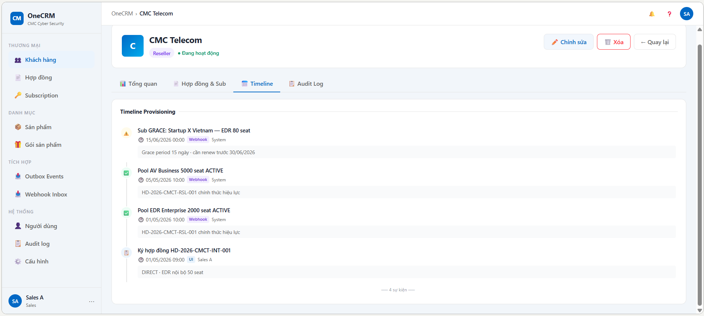 [53](#section)](#section)

[3.6 Tab 4 — Audit Log [54](#tab-4-audit-log)](#tab-4-audit-log)

[4. Acceptance Criteria [56](#acceptance-criteria-2)](#acceptance-criteria-2)

[Nhóm 1: Điều hướng và quyền truy cập [56](#nhóm-1-điều-hướng-và-quyền-truy-cập)](#nhóm-1-điều-hướng-và-quyền-truy-cập)

[Nhóm 2: Org Chart — Phân cấp tập đoàn [56](#nhóm-2-org-chart-phân-cấp-tập-đoàn)](#nhóm-2-org-chart-phân-cấp-tập-đoàn)

[Nhóm 3: Tab Hợp đồng & Sub — Header template [57](#nhóm-3-tab-hợp-đồng-sub-header-template)](#nhóm-3-tab-hợp-đồng-sub-header-template)

[Nhóm 4: Tab Hợp đồng & Sub — Pool & Allocation [57](#nhóm-4-tab-hợp-đồng-sub-pool-allocation)](#nhóm-4-tab-hợp-đồng-sub-pool-allocation)

[Nhóm 5: Tab Timeline [57](#nhóm-5-tab-timeline)](#nhóm-5-tab-timeline)

[Nhóm 6: Tab Audit Log [58](#nhóm-6-tab-audit-log)](#nhóm-6-tab-audit-log)

[6.1.5. UC-CUS-04 Cập nhật thông tin Khách hàng [59](#uc-cus-04-cập-nhật-thông-tin-khách-hàng)](#uc-cus-04-cập-nhật-thông-tin-khách-hàng)

[1. Thông tin chung chức năng [59](#thông-tin-chung-chức-năng-3)](#thông-tin-chung-chức-năng-3)

[2. Luồng nghiệp vụ [59](#luồng-nghiệp-vụ-3)](#luồng-nghiệp-vụ-3)

[2.1 Luồng chính [60](#luồng-chính-3)](#luồng-chính-3)

[2.2 Luồng phụ [61](#luồng-phụ-3)](#luồng-phụ-3)

[2.3 Luồng ngoại lệ [61](#luồng-ngoại-lệ-3)](#luồng-ngoại-lệ-3)

[3. Mô tả giao diện [62](#mô-tả-giao-diện-3)](#mô-tả-giao-diện-3)

[3.1 Wireframe [62](#wireframe-2)](#wireframe-2)

[3.2 Các thành phần giao diện [62](#các-thành-phần-giao-diện-3)](#các-thành-phần-giao-diện-3)

[3.3 Các field trong form theo Loại KH (hiện có, không đổi được) [63](#các-field-trong-form-theo-loại-kh-hiện-có-không-đổi-được)](#các-field-trong-form-theo-loại-kh-hiện-có-không-đổi-được)

[4. Acceptance Criteria [64](#acceptance-criteria-3)](#acceptance-criteria-3)

[Nhóm 1: Cập nhật thành công [64](#nhóm-1-cập-nhật-thành-công)](#nhóm-1-cập-nhật-thành-công)

[Nhóm 2: Field bất biến (immutable) [64](#nhóm-2-field-bất-biến-immutable)](#nhóm-2-field-bất-biến-immutable)

[Nhóm 3: Validation và trùng lặp [64](#nhóm-3-validation-và-trùng-lặp-1)](#nhóm-3-validation-và-trùng-lặp-1)

[Nhóm 4: Đồng bộ hiển thị sau khi lưu [65](#nhóm-4-đồng-bộ-hiển-thị-sau-khi-lưu)](#nhóm-4-đồng-bộ-hiển-thị-sau-khi-lưu)

[6.1.6. UC-CUS-05 Xóa Khách hàng [65](#uc-cus-05-xóa-khách-hàng)](#uc-cus-05-xóa-khách-hàng)

[1. Thông tin chung chức năng [65](#thông-tin-chung-chức-năng-4)](#thông-tin-chung-chức-năng-4)

[2. Luồng nghiệp vụ [66](#luồng-nghiệp-vụ-4)](#luồng-nghiệp-vụ-4)

[2.1 Luồng chính [66](#luồng-chính-4)](#luồng-chính-4)

[2.2 Luồng phụ [67](#luồng-phụ-4)](#luồng-phụ-4)

[2.3 Luồng ngoại lệ [67](#luồng-ngoại-lệ-4)](#luồng-ngoại-lệ-4)

[3. Mô tả giao diện [68](#mô-tả-giao-diện-4)](#mô-tả-giao-diện-4)

[3.1 Wireframe [68](#wireframe-3)](#wireframe-3)

[3.2 Các thành phần giao diện [68](#các-thành-phần-giao-diện-4)](#các-thành-phần-giao-diện-4)

[3.3 Điều kiện hiển thị trạng thái Action Xóa [69](#điều-kiện-hiển-thị-trạng-thái-action-xóa)](#điều-kiện-hiển-thị-trạng-thái-action-xóa)

[4. Acceptance Criteria [69](#acceptance-criteria-4)](#acceptance-criteria-4)

[Nhóm 1: Xóa thành công [69](#nhóm-1-xóa-thành-công)](#nhóm-1-xóa-thành-công)

[Nhóm 2: Chặn xóa khi đã có hợp đồng [69](#nhóm-2-chặn-xóa-khi-đã-có-hợp-đồng)](#nhóm-2-chặn-xóa-khi-đã-có-hợp-đồng)

[Nhóm 3: Hủy thao tác [70](#nhóm-3-hủy-thao-tác)](#nhóm-3-hủy-thao-tác)

[Nhóm 4: Race condition [70](#nhóm-4-race-condition)](#nhóm-4-race-condition)

[6.2. M-02 Contract Management [70](#m-02-contract-management)](#m-02-contract-management)

[6.2.1. Mô tả nghiệp vụ [70](#mô-tả-nghiệp-vụ-1)](#mô-tả-nghiệp-vụ-1)

[6.2.2. UC-CON-01 Danh sách Hợp đồng [71](#uc-con-01-danh-sách-hợp-đồng)](#uc-con-01-danh-sách-hợp-đồng)

[1. Thông tin chung chức năng [71](#thông-tin-chung-chức-năng-5)](#thông-tin-chung-chức-năng-5)

[2. Luồng nghiệp vụ [71](#luồng-nghiệp-vụ-5)](#luồng-nghiệp-vụ-5)

[2.1 Luồng chính [72](#luồng-chính-5)](#luồng-chính-5)

[2.2 Luồng phụ [72](#luồng-phụ-5)](#luồng-phụ-5)

[2.3 Luồng ngoại lệ [72](#luồng-ngoại-lệ-5)](#luồng-ngoại-lệ-5)

[3. Mô tả giao diện [73](#mô-tả-giao-diện-5)](#mô-tả-giao-diện-5)

[3.1 Wireframe [73](#wireframe-4)](#wireframe-4)

[3.2 Các thành phần giao diện [73](#các-thành-phần-giao-diện-5)](#các-thành-phần-giao-diện-5)

[3.3 Bảng danh sách — Các cột [74](#bảng-danh-sách-các-cột)](#bảng-danh-sách-các-cột)

[4. Acceptance Criteria [74](#acceptance-criteria-5)](#acceptance-criteria-5)

[Nhóm 1: Hiển thị danh sách [74](#nhóm-1-hiển-thị-danh-sách)](#nhóm-1-hiển-thị-danh-sách)

[Nhóm 2: Tìm kiếm và lọc [75](#nhóm-2-tìm-kiếm-và-lọc)](#nhóm-2-tìm-kiếm-và-lọc)

[Nhóm 3: Sort [75](#nhóm-3-sort)](#nhóm-3-sort)

[Nhóm 4: Điều hướng [75](#nhóm-4-điều-hướng)](#nhóm-4-điều-hướng)

[Nhóm 5: Trạng thái nút Xóa [76](#nhóm-5-trạng-thái-nút-xóa)](#nhóm-5-trạng-thái-nút-xóa)

[6.2.3. UC-CON-02 Thêm mới Hợp đồng [76](#uc-con-02-thêm-mới-hợp-đồng)](#uc-con-02-thêm-mới-hợp-đồng)

[1. Thông tin chung chức năng [76](#thông-tin-chung-chức-năng-6)](#thông-tin-chung-chức-năng-6)

[3. Luồng nghiệp vụ [77](#luồng-nghiệp-vụ-6)](#luồng-nghiệp-vụ-6)

[2.1 Luồng chính [77](#luồng-chính-6)](#luồng-chính-6)

[2.2 Luồng phụ [78](#luồng-phụ-6)](#luồng-phụ-6)

[2.3 Luồng ngoại lệ [79](#luồng-ngoại-lệ-6)](#luồng-ngoại-lệ-6)

[3. Mô tả giao diện [80](#mô-tả-giao-diện-6)](#mô-tả-giao-diện-6)

[3.1 Wireframe [80](#wireframe-5)](#wireframe-5)

[3.2 Các thành phần giao diện [81](#các-thành-phần-giao-diện-6)](#các-thành-phần-giao-diện-6)

[3.3 Các field trong form [82](#các-field-trong-form)](#các-field-trong-form)

[4. Acceptance Criteria [83](#acceptance-criteria-6)](#acceptance-criteria-6)

[Nhóm 1: Tạo thành công — Direct [83](#nhóm-1-tạo-thành-công-direct)](#nhóm-1-tạo-thành-công-direct)

[Nhóm 2: Tạo thành công — Reseller [84](#nhóm-2-tạo-thành-công-reseller)](#nhóm-2-tạo-thành-công-reseller)

[Nhóm 3: Hiển thị động theo Loại hợp đồng [84](#nhóm-3-hiển-thị-động-theo-loại-hợp-đồng)](#nhóm-3-hiển-thị-động-theo-loại-hợp-đồng)

[Nhóm 4: Validate và trùng lặp [84](#nhóm-4-validate-và-trùng-lặp)](#nhóm-4-validate-và-trùng-lặp)

[Nhóm 5: Đính kèm file (AF-01) [85](#nhóm-5-đính-kèm-file-af-01)](#nhóm-5-đính-kèm-file-af-01)

[Nhóm 6: Hủy (AF-03) [85](#nhóm-6-hủy-af-03)](#nhóm-6-hủy-af-03)

[6.2.5. UC-CON-04 Cập nhật Hợp đồng [86](#uc-con-04-cập-nhật-hợp-đồng)](#uc-con-04-cập-nhật-hợp-đồng)

[1. Thông tin chung chức năng [86](#thông-tin-chung-chức-năng-7)](#thông-tin-chung-chức-năng-7)

[2. Luồng nghiệp vụ [87](#luồng-nghiệp-vụ-7)](#luồng-nghiệp-vụ-7)

[2.1 Luồng chính — Cập nhật thông tin cơ bản [87](#luồng-chính-cập-nhật-thông-tin-cơ-bản)](#luồng-chính-cập-nhật-thông-tin-cơ-bản)

[2.2 Luồng phụ [88](#luồng-phụ-7)](#luồng-phụ-7)

[2.3 Luồng ngoại lệ [89](#luồng-ngoại-lệ-7)](#luồng-ngoại-lệ-7)

[3. Mô tả giao diện [89](#mô-tả-giao-diện-7)](#mô-tả-giao-diện-7)

[3.1 Wireframe [89](#wireframe-6)](#wireframe-6)

[3.2 Các thành phần giao diện [90](#các-thành-phần-giao-diện-7)](#các-thành-phần-giao-diện-7)

[3.3 Các field trong form [91](#các-field-trong-form-1)](#các-field-trong-form-1)

[4. Acceptance Criteria [91](#acceptance-criteria-7)](#acceptance-criteria-7)

[Nhóm 1: Cập nhật thông tin cơ bản thành công [91](#nhóm-1-cập-nhật-thông-tin-cơ-bản-thành-công)](#nhóm-1-cập-nhật-thông-tin-cơ-bản-thành-công)

[Nhóm 2: Trường cố định (không thể sửa) [92](#nhóm-2-trường-cố-định-không-thể-sửa)](#nhóm-2-trường-cố-định-không-thể-sửa)

[Nhóm 3: Thêm Pool License thành công (AF-01) [92](#nhóm-3-thêm-pool-license-thành-công-af-01)](#nhóm-3-thêm-pool-license-thành-công-af-01)

[Nhóm 4: Validate Thêm Pool License (EF-01) [93](#nhóm-4-validate-thêm-pool-license-ef-01)](#nhóm-4-validate-thêm-pool-license-ef-01)

[Nhóm 5: Hủy (AF-02) [93](#nhóm-5-hủy-af-02)](#nhóm-5-hủy-af-02)

[UC-CON-05 — Upload / Xóa File đính kèm Hợp đồng [93](#uc-con-05-upload-xóa-file-đính-kèm-hợp-đồng)](#uc-con-05-upload-xóa-file-đính-kèm-hợp-đồng)

[1. Thông tin chung chức năng [93](#thông-tin-chung-chức-năng-8)](#thông-tin-chung-chức-năng-8)

[2. Luồng nghiệp vụ [95](#luồng-nghiệp-vụ-8)](#luồng-nghiệp-vụ-8)

[3. Mô tả giao diện [98](#mô-tả-giao-diện-8)](#mô-tả-giao-diện-8)

[4. Acceptance Criteria [100](#_Toc234239597)](#_Toc234239597)

[6.3. M-03 Subscription Management [102](#m-03-subscription-management)](#m-03-subscription-management)

[6.3.1. Mô tả nghiệp vụ [102](#mô-tả-nghiệp-vụ-2)](#mô-tả-nghiệp-vụ-2)

[6.3.2. Đặc tả chi tiết — Danh sách FRS (UC-SUB) [103](#đặc-tả-chi-tiết-danh-sách-frs-uc-sub)](#đặc-tả-chi-tiết-danh-sách-frs-uc-sub)

[6.3.3. FR-SUB-11: Auto-transition on License State Change [104](#fr-sub-11-auto-transition-on-license-state-change)](#fr-sub-11-auto-transition-on-license-state-change)

[6.4. M-04 Product & Package Catalog [109](#m-04-product-package-catalog)](#m-04-product-package-catalog)

[6.4.1. Mô tả nghiệp vụ [109](#mô-tả-nghiệp-vụ-3)](#mô-tả-nghiệp-vụ-3)

[6.4.2. FR-CAT-01: Register Product into Catalog [109](#fr-cat-01-register-product-into-catalog)](#fr-cat-01-register-product-into-catalog)

[6.4.3. FR-CAT-02: Update Product Runtime Config [110](#fr-cat-02-update-product-runtime-config)](#fr-cat-02-update-product-runtime-config)

[6.4.4. FR-CAT-03: View Product Detail [110](#fr-cat-03-view-product-detail)](#fr-cat-03-view-product-detail)

[6.4.5. FR-CAT-04: List Products [111](#fr-cat-04-list-products)](#fr-cat-04-list-products)

[6.4.6. FR-CAT-05: Create Package [111](#fr-cat-05-create-package)](#fr-cat-05-create-package)

[6.4.7. FR-CAT-06: Update Package [112](#fr-cat-06-update-package)](#fr-cat-06-update-package)

[6.4.8. FR-CAT-07: View Package Detail [112](#fr-cat-07-view-package-detail)](#fr-cat-07-view-package-detail)

[6.4.9. FR-CAT-08: Search & List Packages [112](#fr-cat-08-search-list-packages)](#fr-cat-08-search-list-packages)

[6.4.10. FR-CAT-09: Publish / Retire Package [113](#fr-cat-09-publish-retire-package)](#fr-cat-09-publish-retire-package)

[6.5. M-05 License Mirror & Usage Tracking [114](#m-05-license-mirror-usage-tracking)](#m-05-license-mirror-usage-tracking)

[6.5.1. Mô tả nghiệp vụ [114](#mô-tả-nghiệp-vụ-4)](#mô-tả-nghiệp-vụ-4)

[6.5.2. FR-LIC-01: View License Mirror Detail [114](#fr-lic-01-view-license-mirror-detail)](#fr-lic-01-view-license-mirror-detail)

[6.5.3. FR-LIC-02: Update License Status (System) [114](#fr-lic-02-update-license-status-system)](#fr-lic-02-update-license-status-system)

[6.5.4. FR-LIC-03: Update Usage Snapshot (System) [115](#fr-lic-03-update-usage-snapshot-system)](#fr-lic-03-update-usage-snapshot-system)

[6.5.5. FR-LIC-04: Force Sync Usage (Sales) [116](#fr-lic-04-force-sync-usage-sales)](#fr-lic-04-force-sync-usage-sales)

[6.5.6. FR-LIC-05: List License Instances [116](#fr-lic-05-list-license-instances)](#fr-lic-05-list-license-instances)

[6.5.7. FR-LIC-06: Search License Mirrors [117](#fr-lic-06-search-license-mirrors)](#fr-lic-06-search-license-mirrors)

[6.5.8. FR-LIC-07: Detect Sub ↔ License Mirror Mismatch (System + Admin) [117](#fr-lic-07-detect-sub-license-mirror-mismatch-system-admin)](#fr-lic-07-detect-sub-license-mirror-mismatch-system-admin)

[6.6. M-06 Provisioning Timeline [118](#m-06-provisioning-timeline)](#m-06-provisioning-timeline)

[6.6.1. Mô tả nghiệp vụ [118](#mô-tả-nghiệp-vụ-5)](#mô-tả-nghiệp-vụ-5)

[6.6.2. FR-EVT-01: View Timeline of Subscription [118](#fr-evt-01-view-timeline-of-subscription)](#fr-evt-01-view-timeline-of-subscription)

[6.6.3. FR-EVT-02: System Append Event (from webhook) [119](#fr-evt-02-system-append-event-from-webhook)](#fr-evt-02-system-append-event-from-webhook)

[6.6.4. FR-EVT-03: Search Timeline Events (Cross-sub) [120](#fr-evt-03-search-timeline-events-cross-sub)](#fr-evt-03-search-timeline-events-cross-sub)

[6.7. M-07 Integration Layer [120](#m-07-integration-layer)](#m-07-integration-layer)

[6.7.1. Mô tả nghiệp vụ [120](#mô-tả-nghiệp-vụ-6)](#mô-tả-nghiệp-vụ-6)

[6.7.2. FR-INT-01: Publish Outbound Event (Internal API) [121](#fr-int-01-publish-outbound-event-internal-api)](#fr-int-01-publish-outbound-event-internal-api)

[6.7.3. FR-INT-02: Outbox Publisher Worker [121](#fr-int-02-outbox-publisher-worker)](#fr-int-02-outbox-publisher-worker)

[6.7.4. FR-INT-03: Webhook Receiver Endpoint [122](#fr-int-03-webhook-receiver-endpoint)](#fr-int-03-webhook-receiver-endpoint)

[6.7.5. FR-INT-04: Webhook Processor Worker [123](#fr-int-04-webhook-processor-worker)](#fr-int-04-webhook-processor-worker)

[6.7.6. FR-INT-05: View Outbox & Webhook Inbox (Admin) [124](#fr-int-05-view-outbox-webhook-inbox-admin)](#fr-int-05-view-outbox-webhook-inbox-admin)

[6.7.7. FR-INT-06: Manual Retry / Reprocess [124](#fr-int-06-manual-retry-reprocess)](#fr-int-06-manual-retry-reprocess)

[6.8. M-08 Audit & Notification [125](#m-08-audit-notification)](#m-08-audit-notification)

[6.8.1. Mô tả nghiệp vụ [125](#mô-tả-nghiệp-vụ-7)](#mô-tả-nghiệp-vụ-7)

[6.8.2. FR-AUD-01: Append Audit Log (Internal API) [125](#fr-aud-01-append-audit-log-internal-api)](#fr-aud-01-append-audit-log-internal-api)

[6.8.3. FR-AUD-02: View / Search Audit Log [125](#fr-aud-02-view-search-audit-log)](#fr-aud-02-view-search-audit-log)

[6.8.4. FR-AUD-03: Verify Hash Chain Integrity [126](#fr-aud-03-verify-hash-chain-integrity)](#fr-aud-03-verify-hash-chain-integrity)

[6.8.5. FR-NOT-01: Send Notification (Internal) [127](#fr-not-01-send-notification-internal)](#fr-not-01-send-notification-internal)

[6.8.6. FR-NOT-02: Manage Notification Templates [127](#fr-not-02-manage-notification-templates)](#fr-not-02-manage-notification-templates)

[6.8.7. FR-NOT-03: View Notification History [128](#fr-not-03-view-notification-history)](#fr-not-03-view-notification-history)

[6.8.8. FR-NOT-04: Time-based Notification Scheduler [128](#fr-not-04-time-based-notification-scheduler)](#fr-not-04-time-based-notification-scheduler)

[6.9. PM-01 EDR Module (full functional Phase 1) [129](#pm-01-edr-module-full-functional-phase-1)](#pm-01-edr-module-full-functional-phase-1)

[6.9.1. Mô tả nghiệp vụ [129](#mô-tả-nghiệp-vụ-8)](#mô-tả-nghiệp-vụ-8)

[Pro6.9.2. Section 1 — Module Registration [129](#pro6.9.2.-section-1-module-registration)](#pro6.9.2.-section-1-module-registration)

[6.9.3. Section 2 — Package Schema [130](#section-2-package-schema)](#section-2-package-schema)

[6.9.4. Section 3 — License Status Set + Mapping [130](#section-3-license-status-set-mapping)](#section-3-license-status-set-mapping)

[6.9.5. Section 4 — Usage Snapshot Schema [130](#section-4-usage-snapshot-schema)](#section-4-usage-snapshot-schema)

[6.9.6. Section 5 — Outbound Event Mapping [131](#section-5-outbound-event-mapping)](#section-5-outbound-event-mapping)

[6.9.7. Section 6 — Inbound Event Mapping [131](#section-6-inbound-event-mapping)](#section-6-inbound-event-mapping)

[6.9.8. Section 7 — Provisioning Timeline Display Templates [131](#section-7-provisioning-timeline-display-templates)](#section-7-provisioning-timeline-display-templates)

[6.9.9. Section 8 — Runtime Config [132](#section-8-runtime-config)](#section-8-runtime-config)

[6.9.10. EDR-specific Functions [132](#edr-specific-functions)](#edr-specific-functions)

[6.9.10.1. FR-EDR-01: EDR Package Schema Validator [132](#fr-edr-01-edr-package-schema-validator)](#fr-edr-01-edr-package-schema-validator)

[6.9.10.2. FR-EDR-02: EDR Inbound Event Mapper [133](#fr-edr-02-edr-inbound-event-mapper)](#fr-edr-02-edr-inbound-event-mapper)

[6.9.10.3. FR-EDR-03: EDR Outbound Event Builder [133](#fr-edr-03-edr-outbound-event-builder)](#fr-edr-03-edr-outbound-event-builder)

[6.9.11. Scope PM-01 (EDR — đặc tả đầy đủ trong PRD, triển khai Phase 2) [134](#scope-pm-01-edr-đặc-tả-đầy-đủ-trong-prd-triển-khai-phase-2)](#scope-pm-01-edr-đặc-tả-đầy-đủ-trong-prd-triển-khai-phase-2)

[6.10. PM-02 C-Shield Module (declaration skeleton Phase 1) [134](#pm-02-c-shield-module-declaration-skeleton-phase-1)](#pm-02-c-shield-module-declaration-skeleton-phase-1)

[6.10.1. Mô tả nghiệp vụ [134](#mô-tả-nghiệp-vụ-9)](#mô-tả-nghiệp-vụ-9)

[6.10.2. Section 1 — Module Registration [134](#section-1-module-registration)](#section-1-module-registration)

[6.10.3. Section 2 — Package Schema (tentative) [135](#section-2-package-schema-tentative)](#section-2-package-schema-tentative)

[6.10.4. Section 3 — License Status Set (tentative) [135](#section-3-license-status-set-tentative)](#section-3-license-status-set-tentative)

[6.10.5. Section 4 — Usage Snapshot Schema (tentative) [135](#section-4-usage-snapshot-schema-tentative)](#section-4-usage-snapshot-schema-tentative)

[6.10.6. Section 5 — LICENSE_INSTANCE Schema (Phase 3+) [135](#section-5-license_instance-schema-phase-3)](#section-5-license_instance-schema-phase-3)

[6.10.7. Section 6 — Outbound/Inbound Mapping (tentative) [136](#section-6-outboundinbound-mapping-tentative)](#section-6-outboundinbound-mapping-tentative)

[6.10.8. Scope PM-02 (skeleton trong PRD) [136](#scope-pm-02-skeleton-trong-prd)](#scope-pm-02-skeleton-trong-prd)

[6.11. PM-03 AV Module (declaration skeleton Phase 1) [136](#pm-03-av-module-declaration-skeleton-phase-1)](#pm-03-av-module-declaration-skeleton-phase-1)

[6.11.1. Mô tả nghiệp vụ [136](#mô-tả-nghiệp-vụ-10)](#mô-tả-nghiệp-vụ-10)

[6.11.2. Section 1 — Module Registration [136](#section-1-module-registration-1)](#section-1-module-registration-1)

[6.11.3. Section 2 — Package Schema (tentative) [136](#section-2-package-schema-tentative-1)](#section-2-package-schema-tentative-1)

[6.11.4. Section 3 — License Status Set (tentative) [137](#section-3-license-status-set-tentative-1)](#section-3-license-status-set-tentative-1)

[6.11.5. Section 4 — Usage Snapshot (tentative) [137](#section-4-usage-snapshot-tentative)](#section-4-usage-snapshot-tentative)

[6.11.6. Section 5 — LICENSE_INSTANCE Schema (Phase 4) [137](#section-5-license_instance-schema-phase-4)](#section-5-license_instance-schema-phase-4)

[6.11.7. Section 6 — Outbound/Inbound Mapping (tentative) [137](#section-6-outboundinbound-mapping-tentative-1)](#section-6-outboundinbound-mapping-tentative-1)

[6.11.8. Scope PM-03 (skeleton trong PRD) [138](#scope-pm-03-skeleton-trong-prd)](#scope-pm-03-skeleton-trong-prd)

[7. CASE STUDY [138](#case-study)](#case-study)

[7.1. Bối cảnh [138](#bối-cảnh-1)](#bối-cảnh-1)

[7.2. Luồng tạo subscription end-to-end [138](#luồng-tạo-subscription-end-to-end)](#luồng-tạo-subscription-end-to-end)

[7.3. Scenario A — Sales force-sync usage [140](#scenario-a-sales-force-sync-usage)](#scenario-a-sales-force-sync-usage)

[7.4. Scenario B — Sales suspend sub [141](#scenario-b-sales-suspend-sub)](#scenario-b-sales-suspend-sub)

[7.5. Scenario C — Renewal proactive [141](#scenario-c-renewal-proactive)](#scenario-c-renewal-proactive)

[7.6. Scenario D — License vào GRACE (license expired but KH vẫn dùng được) [141](#scenario-d-license-vào-grace-license-expired-but-kh-vẫn-dùng-được)](#scenario-d-license-vào-grace-license-expired-but-kh-vẫn-dùng-được)

[8. YÊU CẦU PHI CHỨC NĂNG (NFR) [142](#yêu-cầu-phi-chức-năng-nfr)](#yêu-cầu-phi-chức-năng-nfr)

[8.1. Performance [142](#performance)](#performance)

[8.2. Reliability [142](#reliability)](#reliability)

[8.3. Security [142](#security)](#security)

[8.4. Scalability [143](#scalability)](#scalability)

[8.5. Maintainability [143](#maintainability)](#maintainability)

[8.6. Observability [144](#observability)](#observability)

[8.7. Forward Compatibility [144](#forward-compatibility)](#forward-compatibility)

[8.8. Data Privacy & Compliance (PII KH B2C) [144](#data-privacy-compliance-pii-kh-b2c)](#data-privacy-compliance-pii-kh-b2c)

[9. ACCEPTANCE CRITERIA [145](#acceptance-criteria-8)](#acceptance-criteria-8)

[9.1. AC Functional Phase 1 [145](#ac-functional-phase-1)](#ac-functional-phase-1)

[9.2. AC Non-Functional Phase 1 [145](#ac-non-functional-phase-1)](#ac-non-functional-phase-1)

[10. PHỤ THUỘC KỸ THUẬT [146](#phụ-thuộc-kỹ-thuật)](#phụ-thuộc-kỹ-thuật)

[11. OPEN QUESTIONS [146](#open-questions)](#open-questions)

[12. GLOSSARY [147](#glossary)](#glossary)

[13. PHÊ DUYỆT [148](#phê-duyệt)](#phê-duyệt)

# GIỚI THIỆU

## Mục đích tài liệu

Tài liệu này đặc tả yêu cầu chức năng và phi chức năng của OneCRM — hệ thống CRM thương mại tập trung cho hệ sinh thái sản phẩm cybersecurity của CMC Cybersecurity.

PRD được viết với mức chi tiết đủ để team kỹ thuật bắt đầu thiết kế (Architecture, Database, API Spec) và team QA viết Test Plan, không cần bước trung gian FSD riêng cho hầu hết module.

## Đối tượng đọc

- **Product Manager/Business Owner**: hiểu phạm vi, ưu tiên

- **Software Architect**: thiết kế kiến trúc, lựa chọn công nghệ

- **Backend Developer**: hiểu yêu cầu chức năng, thiết kế API

- **QA Engineer**: viết test case, test plan

- **Sales/CSKH lead**: hiểu năng lực hệ thống và workflow nghiệp vụ

## Phạm vi tài liệu

- **In scope**

<!-- -->

- Yêu cầu chức năng theo module

- Mô hình dữ liệu conceptual + detail

- Pattern tích hợp với sản phẩm

- Yêu cầu phi chức năng

- Acceptance Criteria Phase 1

- Case study minh hoạ

<!-- -->

- **Out of scope**

<!-- -->

- Kiến trúc kỹ thuật chi tiết (Architecture Design)

- Database schema DDL/index (Database Design)

- API contract OpenAPI spec (API Specification)

- UX/UI mockup (UX Spec)

- Test cases chi tiết (Test Plan)

- Deployment, CI/CD (DevOps Doc)

- Compliance pháp lý chi tiết (Privacy/Security Doc)

- Lead/Opportunity, Combo, Promotion, Invoice

## Tham chiếu

- BRD v2.0 — OneCRM Business Requirements Document

- Tài liệu kiến trúc license EDR (Product team EDR/EPP)

- Tài liệu license C-Shield SDK Server (Product team Mobile)

# TỔNG QUAN SẢN PHẨM

## Bối cảnh

CMC Cybersecurity có nhiều sản phẩm với cơ chế bán/license khác nhau, mỗi sản phẩm hiện có CRM hoặc cơ chế quản lý riêng → phân mảnh, không có cái nhìn tổng thể về khách hàng, khó mở rộng khi có sản phẩm mới.

OneCRM ra đời để giải quyết: 1 nền tảng CRM thương mại tập trung, kiến trúc pluggable cho mọi sản phẩm cybersecurity của công ty.

## Vai trò OneCRM

**OneCRM là Commercial CRM passive-observer** với 2 lớp:

┌──────────────────────────────────────────────┐\
│ CORE (dùng chung mọi product) │\
│ - Customer Master │\
│ - Contract (lightweight) │\
│ - Subscription Management │\
│ - Product & Package Catalog │\
│ - License Mirror & Usage Tracking │\
│ - Provisioning Timeline │\
│ - Integration Layer (Event Bus + Webhook) │\
│ - Audit & Notification │\
└──────────────┬──────────────────────────────┘\
│ register\
┌──────────────▼──────────────────────────────┐\
│ PRODUCT MODULES (per-product, pluggable) │\
│ ┌─────────────┐ ┌────────────┐ ┌─────────┐ │\
│ │ EDR Module │ │ C-Shield │ │ AV │ │\
│ │ (Phase 2) │ │ (Phase 3) │ │(Phase 4) │ │\
│ └─────────────┘ └────────────┘ └─────────┘ │\
│ │\
│ Mỗi module khai báo: │\
│ - Package schema (Sales được phép config) │\
│ - License status set + mapping → sub state │\
│ - Usage snapshot schema │\
│ - Provisioning event types + templates │\
│ - Outbound + Inbound event mapping │\
│ - Runtime config (notification, intervals) │\
└──────────────────────────────────────────────┘

Thêm product mới = thêm 1 Product Module + register vào catalog, không sửa core.

## Lộ trình triển khai

Phân biệt phạm vi phân tích vs phase triển khai:

- PRD này đặc tả Core (M-01 → M-08) + EDR Module đầy đủ nhằm đánh giá mức độ khả thi và ước lượng nguồn lực cho cả nền tảng lẫn product integration đầu tiên.

- Về triển khai thực tế, EDR rollout ở Phase 2 (Phase 1 là nền tảng Core). Việc đặc tả EDR đầy đủ trong PRD không đồng nghĩa EDR ship ngay Phase 1.

| Phase | Phạm vi | Mức độ |
|----|----|----|
| Phase 1 | OneCRM Core (M-01 → M-08) — nền tảng dùng chung | Cao nhất |
| Phase 2 | EDR Module full functional (SaaS) | Cao |
| Phase 3 | C-Shield Module (đang đánh giá lại hình thức cấp license) | Trung |
| Phase 4 | AV Module + migration data AV cũ (sản phẩm nhỏ, không trọng điểm) | Thấp |
| Phase 5+ | CA và sản phẩm mới — chỉ thêm module | Mở rộng |

Deliverable Core + EDR (Phase 1-2): ship được EDR end-to-end (Sales tạo customer → contract → package → sub → event → product → webhook → license mirror updated).

## Phạm vi đặc tả trong PRD (Core + EDR)

> Bảng dưới mô tả phạm vi **được đặc tả đầy đủ trong PRD này** (Core + EDR). Cột "Trong PRD" = đã đặc tả chi tiết; "Phase sau" = forward-compatible, làm khi tới phase tương ứng. Lưu ý phase triển khai: Core P1, EDR P2, C-Shield P3, AV P4.

| Thành phần | Trong PRD | Phase sau (forward-compatible) |
|----|----|----|
| Customer B2C/B2B + hierarchy | ✓ | KYC chi tiết, blacklist nâng cao |
| Contract lightweight+ attachments | ✓ | Lifecycle, milestone, e-signature |
| Subscription đầy đủ + chain | ✓ | Combo, promotion |
| Product Catalog + Package | ✓ | Approval workflow cho Package |
| License Mirror + Usage Snapshot | ✓ | History trend (Phase 2+) |
| LICENSE_INSTANCE | Skeleton | Full Phase 3+ cho C-Shield/AV |
| Provisioning Timeline | ✓ | Manual entries (Phase 2+) |
| Event Bus + Webhook | ✓ | Multi-region, dead letter dashboard |
| Audit hash chain + Notification | ✓ | SMS/Zalo/Slack channels |
| EDR Product Module | Full | Triển khai Phase 2 |
| C-Shield Product Module | Skeleton | Full Phase 3 |
| AV Product Module | Skeleton | Full Phase 4 |
| Upgrade/Downgrade flow | ✗ | Chờ BA product analysis |
| IAM-Customer integration | ✗ | Phase 2+ |

# ANCHOR — 5 YẾU TỐ CỐT LÕI

2.  

## YT-1: Vai trò OneCRM

Commercial CRM passive-observer, cấu trúc 2 lớp: Core (dùng chung) + Product Module (per-product, pluggable). Thêm product mới = thêm module, không sửa core.

## YT-2: Mô hình thương mại

Customer (1) ─── (N) Contract ─── (N) Subscription ─── (1) Package\
│\
└──── (1) License Mirror

- Subscription là đối tượng chính — mọi flow xoay quanh sub

- 1 sub : 1 package : 1 license_mirror (cardinality từ phía sub)

- Contract lightweight (định danh deal + group sub)

- Phát sinh doanh thu = tạo sub mới (Renew/Upgrade/Downgrade), sub cũ → RENEWED

## YT-3: Cách CRM tương tác với product — Event-driven Passive

| Hướng | Cơ chế | CRM behavior |
|----|----|----|
| **Outbound** | CRM publish event lên RabbitMQ topic, product subscribe & pickup | CRM ghi outbox cùng transaction; worker publish broker async |
| **Inbound** | Product push HTTP webhook đến CRM | CRM verify HMAC + idempotency, ghi inbox, worker apply mapping async |

CRM KHÔNG:

- Lưu URL của product

- Gọi API của product trực tiếp

- Quản retry/timeout sang product

- Check product online/offline

→ Thêm product mới chỉ cần register + subscribe event.

Nguyên tắc phân loại event outbound (giữ ranh giới observer, không "điều khiển" product):

| Loại event | Bản chất | Ví dụ | Cho phép? |
|----|----|----|----|
| Thông báo commercial intent | CRM báo "trạng thái thương mại đã đổi", product tự quyết xử lý | subscription.created/suspended/resumed/revoked | ✓ |
| Xin thông tin (pull) | CRM yêu cầu product cung cấp lại dữ liệu để mirror | usage.force_sync_requested | ✓ (có rate limit) |
| Ra lệnh thao tác kỹ thuật | CRM chỉ thị product thực hiện hành động kỹ thuật nội bộ | "tạo tenant X", "set seat = N", "rebuild SDK" | ✗ Cấm |

CRM publish event ở dạng "điều gì đã xảy ra ở lớp thương mại" (event/intent), KHÔNG phải "product phải làm gì" (command). subscription.suspended = "hợp đồng đã tạm dừng" (product tự diễn giải), KHÔNG phải "hãy khoá tenant". Mọi event outbound mới phải rơi vào nhóm 1 hoặc 2.

## YT-4: Phạm vi license trong CRM

- LICENSE_MIRROR — entity 1:1 với sub, lưu trạng thái sub-level abstract entitlement:

<!-- -->

- Status raw từ product (không chuẩn hoá ở CRM — mỗi Product Module declare status set của mình)

- Usage_snapshot (jsonb, schema product-specific, vd EDR {seats_used, seats_total})

- Last_synced_at

- External_ref (id do product gen)

<!-- -->

- LICENSE_INSTANCE — forward-compat skeleton Phase 1. Đại diện 1 technical license thực thụ (1 JWT C-Shield, 1 activation key AV). Cardinality 1 LICENSE_MIRROR : 0..N LICENSE_INSTANCE. EDR has_instances=false không dùng; C-Shield/AV has_instances=true Phase 3+ dùng.

- CRM không lưu: lifecycle logic, runtime details (seat usage detail, tenant_id internal, JWT signing key, ...), cascade entitlement.

## YT-5: Roadmap Phase

| Phase    | Phạm vi                                   |
|----------|-------------------------------------------|
| Phase 1  | Core (M-01 → M-08) — nền tảng dùng chung  |
| Phase 2  | EDR Product Module full functional (SaaS) |
| Phase 3  | C-Shield Product Module                   |
| Phase 4  | AV Product Module + migration             |
| Phase 5+ | CA, sản phẩm mới — chỉ thêm module        |

PRD này đặc tả Core + EDR đầy đủ (để đánh giá khả thi & ước lượng nguồn lực); C-Shield/AV ở mức kiến trúc/declaration skeleton.

## Anchor cố định (chi tiết)

1.  Subscription là đối tượng chính

2.  1 SUB : 1 PACKAGE : 1 LICENSE_MIRROR

3.  CRM là observer với license (chỉ mirror status + usage)

4.  CRM là observer với provisioning (không khởi tạo, chỉ track progress)

5.  Outbound: CRM publish event → product pickup (RabbitMQ + Outbox)

6.  Inbound: Product push webhook → CRM cập nhật (HMAC + idempotency)

7.  Core (dùng chung) + Product Module (per-product declare schema/mapping/runtime config)

8.  PRD đặc tả framework Core đầy đủ + EDR full (triển khai EDR ở Phase 2); C-Shield/AV declaration skeleton (Phase 3/4)

# PERSONAS & EXTERNAL ACTORS

3.  

## Personas nội bộ (User của OneCRM)

| Persona | Vai trò | Hoạt động tiêu biểu |
|----|----|----|
| **Sales** | Bán hàng, quản KH | Tạo customer, contract, sub; theo dõi provisioning; renew; tạo Package mới |
| **CSKH** | Hỗ trợ khách hàng | Tra cứu hồ sơ KH 360°, timeline, trạng thái license |
| **Manager** | Quản lý nhóm Sales/CSKH | View dashboard, audit, approve revoke/retire |
| **License Admin** | Quản catalog + ops | Register Product, manage template notification, rotate webhook secret, manual retry/reprocess |
| **Auditor** | Kiểm toán | Tra audit log, verify hash chain |
| **System** | Hệ thống tự động | Worker outbox publish, webhook processor, notification scheduler |

**IAM**: Phase 1 dùng cơ chế đăng nhập đơn giản (username/password + session, MFA cho License Admin). IAM-Internal nâng cấp Phase sau.

## External Actors

| Actor | Tương tác với OneCRM |
|----|----|
| **End-user B2C** (mua AV cá nhân) | Phase 1 không tương tác trực tiếp CRM. IAM-Customer mirror Phase 2+ |
| **End-user B2B** (Tenant Admin EDR) | KHÔNG tương tác CRM. Quản tài khoản trong product backend |
| **Product Backend** (EDR, C-Shield, AV) | Subscribe RabbitMQ topic (nhận event commercial); push webhook về CRM (báo progress + license state + usage) |
| **CA Backend** | Tương lai (Phase mở rộng) — pattern tương tự |

## Ranh giới OneCRM ↔ Product Backend

| Khía cạnh | OneCRM | Product Backend |
|----|----|----|
| Customer master | ✓ | (không) |
| Contract, Subscription | ✓ | ✗ |
| Package catalog (commercial template) | ✓ | (technical config tách biệt) |
| License entity (master) | ✗ (chỉ mirror sub-level) | ✓ |
| Lifecycle license (active/suspend/revoke) | ✗ | ✓ |
| Activate license sau UAT | ✗ | ✓ (System admin product bấm) |
| Quản tenant, gửi credentials email | ✗ | ✓ |
| Quota, seat detail, entitlement runtime | ✗ | ✓ |
| Notification commercial (renewal, suspend...) | ✓ | ✗ |
| Notification operational (credentials, technical alert) | ✗ | ✓ |
| Audit commercial events | ✓ | ✗ |
| Audit operational events | ✗ | ✓ |

## Phạm vi triển khai: SaaS vs On-premise

EDR (và một số product B2B) có bản on-premise — KH tự host toàn bộ Master + Tenant + Org sau firewall (theo doc license EDR). Product backend on-prem không kết nối ra OneCRM cloud → mô hình event-driven passive (subscribe broker + push webhook) không áp dụng được.

Do đó:

| Tiêu chí | SaaS | On-premise |
|----|----|----|
| Phạm vi OneCRM quản | Đầy đủ: commercial + license mirror + usage + provisioning timeline (event-driven) | Chỉ commercial: Customer, Contract, Subscription, doanh thu |
| License mirror/usage/ timeline tự động | ✓ (qua broker + webhook) | ✗ (không có kết nối) |
| end_date | Đồng bộ từ license | Sales nhập tay và tự bảo trì |
| Renewal reminder | Trên ngày license thật | Trên ngày nhập tay |
| Triển khai | Phase 1-2 | Chưa làm Phase 1 (chế độ commercial-only thủ công, phase sau) |

**Nguyên tắc**: với KH on-prem, OneCRM là system-of-record thương mại (KH/HĐ/doanh thu để có view 360° và renewal), không theo dõi trạng thái kỹ thuật. Sub on-prem đánh dấu deployment_mode=ON_PREM (qua sub.metadata hoặc scope), bỏ qua mọi flow event-driven. Phase 1 chỉ làm SaaS; chế độ on-prem commercial-only thiết kế chi tiết ở phase sau.

# MÔ HÌNH DỮ LIỆU

4.  

## ERD Conceptual


## Cardinality

| Quan hệ | Cardinality | Ghi chú |
|----|----|----|
| CUSTOMER ─ CONTRACT | 1 : N |  |
| CONTRACT ─ SUBSCRIPTION | 1 : N | 1 HĐ chứa N sub (combo)<br>HĐ RESELLER cấp dần từ pool |
| CONTRACT ─ CONTRACT_PACKAGE | 1 : 0..N | Chỉ type=DIRECT. **Phase 1: đúng 1 dòng** = gói được ghim theo HĐ (D3) |
| CONTRACT ─ CONTRACT_POOL_ITEM | 1 : 0..N | Chỉ type=RESELLER có pool item. DIRECT không có. **Mỗi dòng = 1 GÓI** (1 phiên bản cụ thể), **không phải 1 product** (D5) |
| CONTRACT_POOL_ITEM ─ PRODUCT | N : 1 | 1 product trong nhiều HĐ RESELLER khác nhau |
| CUSTOMER (đơn vị thụ hưởng) ─ SUBSCRIPTION | 1 : 0..N | qua beneficiary_id (HĐ RESELLER) |
| SUBSCRIPTION ─ PACKAGE | N : 1 | 1 package bán N lần |
| PACKAGE ─ PRODUCT | N : 1 | 1 product có N package |
| SUBSCRIPTION ─ LICENSE_MIRROR | 1 : 1 | Anchor YT-4 |
| LICENSE_MIRROR ─ LICENSE_INSTANCE | 1 : 0..N | Optional per product |
| SUBSCRIPTION ─ PROVISIONING_EVENT | 1 : N | Timeline append-only |
| SUBSCRIPTION ─ OUTBOX_EVENT | 1 : N | Outbound events |
| SUBSCRIPTION ─ WEBHOOK_INBOX | 1 : N | Inbound webhooks |
| SUBSCRIPTION (self) | 1 : 0..1 | previous_subscription_id chain renew/upgrade |
| PRODUCT ─ PRODUCT_MODULE_CONFIG | 1 : 1 | Config per product |
| CUSTOMER ─ USER_PROFILE | 1 : 0..N | CIAM mirror Phase 2+ |
| CONTRACT ─ ATTACHMENT | 1 : 0..N | Polymorphic, Phase 1 chỉ CONTRACT |

## Entity Detail

### 5.3.1. CUSTOMER

| Field | Type | Required | Mô tả |
|----|----|----|----|
| id | UUID | ✓ | PK |
| type | enum (Reseller, B2B, B2C, Other) | ✓ |  |
| name | string | ✓ | Tên cá nhân hoặc DN |
| email | string | ✓ | Unique trong B2C; B2B unique theo tax_code |
| phone | string | optional | Unique trong B2C khi cung cấp |
| tax_code | string | optional (B2B required) | MST, unique toàn hệ thống |
| parent_id | UUID FK | optional | Parent B2B (hierarchy) |
| status | enum (ACTIVE/INACTIVE/BLACKLIST) | ✓ |  |
| industry, address, date_of_birth | string/date | optional |  |
| metadata | jsonb | optional | Forward-compat |
| delete_at | timestamp | optional |  |
| created_at, updated_at | timestamp | ✓ |  |

Ràng buộc unique: xem mục 5.4.

### 5.3.2. CONTRACT (lightweight)

| Field | Type | Required | Mô tả |
|----|----|----|----|
| id | UUID | ✓ | PK |
| code | string | ✓ | Unique toàn hệ thống, Sales nhập tay |
| customer_id | UUID FK | ✓ | Immutable |
| type | enum (DIRECT/RESELLER) | ✓ | DIRECT = KH mua dùng;<br>RESELLER = HĐ khung đại lý |
| signed_date | date | optional | Sales nhập, ≤ today |
| description | string | optional |  |
| created_by | UUID | ✓ |  |
| metadata | jsonb | optional |  |
| created_at | timestamp | ✓ |  |

Phase 1 KHÔNG có: status/lifecycle, total_value, milestone, e-signature, approval workflow.

### 5.3.2b. CONTRACT_PACKAGE *(mới v2.5 — HĐ DIRECT ghim gói)*

> **D3 — HĐ ghim phiên bản gói tại thời điểm ký.** HĐ `DIRECT` khai báo gói được bán theo HĐ; mọi sub dưới HĐ đó dùng **đúng phiên bản đã ghim**, kể cả khi catalog đã publish version mới hoặc đã ngừng bán bản đó.

| Field | Type | Required | Mô tả |
|----|----|----|----|
| id | UUID | ✓ | PK |
| contract_id | UUID FK | ✓ | CONTRACT (chỉ `type = DIRECT`) |
| package_id | UUID FK | ✓ | PACKAGE — **1 bản ghi version cụ thể**, KHÔNG phải "họ gói" (product + code) |
| created_at | timestamp | ✓ |  |

**Ràng buộc:**

- UNIQUE (contract_id, package_id)

- Chỉ tạo khi `CONTRACT.type = DIRECT`

- Khi tạo/thêm: `PACKAGE.status` **phải** = `ACTIVE` (**D2**). Sau khi ghim, gói chuyển `RETIRED` **không** ảnh hưởng HĐ.

- **Phase 1: mỗi HĐ DIRECT có ĐÚNG 1 dòng** — 1 gói / 1 HĐ (UC-CON-02 BR-07, **chốt 13/07/2026**). Cần bán nhiều gói cho 1 KH → **tách nhiều HĐ**. Cấu trúc để dạng bảng con (1:N) nhằm mở cho HĐ nhiều gói ở phase sau **mà không phải migration schema**.

### 5.3.3. CONTRACT_POOL_ITEM

> ⚠️ **v2.5 — BREAKING:** khoá nghiệp vụ đổi từ `product_id` → **`package_id`** (**D5**). Pool **ghim theo GÓI**, không theo sản phẩm. Lý do: pool theo `product_id` cho phép đại lý rút license của gói đắt tiền từ pool mua theo giá gói rẻ → **rò rỉ giá**.

| Field | Type | Required | Mô tả |
|----|----|----|----|
| id | UUID | ✓ | PK |
| contract_id | UUID FK | ✓ | CONTRACT (chỉ type=RESELLER) |
| package_id | UUID FK | ✓ | **PACKAGE — 1 bản ghi version cụ thể.** Khoá nghiệp vụ của pool; UNIQUE per (contract_id, package_id) |
| product_id | UUID FK | ✓ | PRODUCT — **cột dẫn xuất** từ `package.product_id`, chỉ dùng để hiển thị/lọc. **KHÔNG** dùng làm khoá nghiệp vụ |
| pool_total | int | ✓ | Tổng quota cam kết trong HĐ khung (\> 0). Immutable Phase 1 |
| allocated_qty | int | ✓ | Σ license_qty đã submit. Phase 1: chỉ tăng khi submit sub. Không giảm khi revoke/expire (Phase 2+ — OQ-NEW-01) |
| metadata | jsonb | optional | Forward-compat (top-up history Phase 2+) |
| created_at | timestamp | ✓ |  |

**Ràng buộc:**

- UNIQUE (contract_id, package_id) — **thay cho UNIQUE (contract_id, product_id) của v2.4**

- Hai gói khác nhau của **cùng một sản phẩm** là **2 pool riêng biệt**

- Khi tạo: `PACKAGE.status` **phải** = `ACTIVE` (**D2**). Sau khi ghim, gói chuyển `RETIRED` **không** ảnh hưởng pool đang chạy

- Trừ pool khi tạo sub: tra pool theo **`package_id`** của sub (không theo `product_id`)

- pool_total \> 0

- allocated_qty \>= 0

- allocated_qty \<= pool_total (enforce tại application layer với optimistic lock, không DB constraint)

- Chỉ tạo khi CONTRACT.type = RESELLER

> **Migration v2.4 → v2.5:** thêm cột `package_id` (NOT NULL). Backfill = gói mà các sub thuộc pool đó đang dùng. **Nếu 1 pool có sub thuộc nhiều gói khác nhau → phải tách thành nhiều pool item và chia lại `pool_total`; cần BA/Sales xác nhận số liệu, không tự động được.**

### 5.3.4. SUBSCRIPTION

| Field | Type | Required | Mô tả |
|----|----|----|----|
| id | UUID | ✓ | PK |
| contract_id | UUID FK | ✓ | Immutable |
| beneficiary_id | UUID FK | optional | Đơn vị thụ hưởng (HĐ RESELLER). NULL hoặc = customer ký với HĐ DIRECT.  |
| package_id | UUID FK | ✓ |  |
| prev_sub_id | UUID FK (self) | optional | Chain renew/upgrade |
| status | enum (xem 5.5) | ✓ |  |
| start_date | date | ✓ | Ngày bắt đầu dự kiến (Sales nhập). Ngày dùng thực = license_mirror.activation_date |
| end_date | date | ✓ | Dự kiến lúc tạo; sau khi license active → đồng bộ = license_mirror.expiration_date (nguồn thật từ product). KHÔNG tự tính start_date + duration. |
| seat_count | int | optional | Tuỳ package |
| license_qty | int | optional | Số license rút từ pool HĐ RESELLER |
| scope | jsonb | optional | Cấu hình sản phẩm riêng của từng sub (per-customer): nhập khi tạo (UC-SUB-02), sửa được (UC-SUB-04), hiển thị ở chi tiết (UC-SUB-03). Các trường do Product Module khai báo qua `scope_schema` (§5.3.7). Vd EDR: `{tenant_mode: "MULTI"}` (Kiểu tổ chức). Sản phẩm không khai báo schema → NULL. |
| deal_code | string | optional | Tag combo/bundle |
| note | text | optional | Sales note |
| suspend_reason | text | optional | Lý do tạm dừng — set khi sub → SUSPENDED (FR-SUB-09 / UC-SUB-09); xóa (NULL) khi resume (FR-SUB-10 / UC-SUB-10). Hiển thị lại trong modal Khôi phục để tham khảo. Transient: chỉ có giá trị khi status=SUSPENDED. |
| metadata | jsonb | optional |  |
| created_by, created_at | UUID, ts | ✓ |  |
| activated_at | timestamp | optional | Lúc sub → ACTIVE lần đầu |

### 5.3.5. PACKAGE

> **D0 — Model A (Clone-forward versioning).** Mỗi **version = 1 bản ghi PACKAGE bất biến**. "Họ gói" (package family) được nhận diện bằng `(product_id, code)`; các bản ghi trong cùng họ chỉ khác `version`. Trạng thái nằm **trên bản ghi version**, không phải trên họ gói.

| Field | Type | Required | Mô tả |
|----|----|----|----|
| id | UUID | ✓ | PK — **đây là `package_id` mà CONTRACT / CONTRACT_POOL_ITEM / SUBSCRIPTION ghim** |
| product_id | UUID FK | ✓ |  |
| code | string | ✓ | Mã họ gói. Unique trong product **theo từng version** → UNIQUE (product_id, code, version) |
| version | int | ✓ | Số phiên bản, tăng dần trong 1 họ gói. Bắt đầu từ 1 |
| name | string | ✓ | Display name |
| status | enum (DRAFT/ACTIVE/RETIRED) | ✓ | Trạng thái **của version này**. `DRAFT` = đang soạn · `ACTIVE` = đang bán · `RETIRED` = ngừng bán (terminal) |
| rolled_back_from | UUID FK | optional | **Mới v2.5.** Khi version này sinh ra từ **Rollback**, trỏ về `package_id` của bản gốc được sao chép cấu hình. NULL nếu tạo mới/clone-on-edit thông thường. Dùng để truy vết lineage (bù cho việc số version bị phình khi rollback) |
| duration_months | int | ✓ |  |
| default_seat_count | int | optional |  |
| default_instance_count | int | optional | Cho product has_instances=true |
| features | jsonb | ✓ | Danh sách feature gói hỗ trợ, tick từ `featureCatalog` của sản phẩm **ở mức Feature** (không ở mức module, không tách lẻ CRUD). Feature loại **"Mặc định"** luôn được include và **khóa** — không bỏ tick được |
| rules | jsonb | optional | Rule config theo schema module |
| price | decimal | optional | Phase 1 không xử lý billing |
| created_at, created_by | ts, UUID | ✓ |  |

**Ràng buộc & quy tắc:**

- UNIQUE (product_id, code, version)

- **Bất biến sau khi có sub:** version `ACTIVE` **đã có subscription** không được sửa tại chỗ → sửa sẽ sinh version mới `DRAFT` (**clone-on-edit**, xem §6.4).

- **Rollback = clone-forward:** không "bật lại" bản `RETIRED`; thay vào đó tạo version mới `v = max(version trong họ) + 1` sao chép cấu hình bản cũ, `rolled_back_from` = id bản cũ, `status = DRAFT`.

- **Không có** `tier` và `scope_template` (đã gỡ) — `scope` là cấu hình **per-subscription** (§5.3.4), schema do Product Module khai báo qua `scope_schema` (§5.3.7).

- Mọi thao tác **Publish / Retire / Delete / Rollback** **bắt buộc** ghi AUDIT_LOG có `timestamp` + `actor`.

### 5.3.6. PRODUCT

| Field | Type | Required | Mô tả |
|----|----|----|----|
| id | UUID | ✓ | PK |
| code | string | ✓ | Unique, immutable. Vd "EDR", "C_SHIELD", "AV" |
| name | string | ✓ |  |
| integration_type | enum (EXTERNAL_TENANT / EXTERNAL_JWT / INTERNAL_KEY) | ✓ | Immutable |
| has_instances | bool | ✓ | Immutable. EDR=false, C-Shield=true, AV=true |
| module_class_id | string | ✓ | Reference code module deployed |
| status | enum (ACTIVE/INACTIVE) | ✓ |  |
| created_at | ts | ✓ |  |

### 5.3.7. PRODUCT_MODULE_CONFIG

| Field | Type | Required | Mô tả |
|----|----|----|----|
| id | UUID | ✓ | PK |
| product_id | UUID FK | ✓ | 1:1 với PRODUCT |
| package_schema | jsonb | ✓ | Schema fields cấu hình ở cấp PACKAGE (features, rules, seat...) |
| scope_schema | jsonb | optional | Schema các trường **scope** cấu hình per-sub — Sales nhập khi tạo/sửa sub (vd EDR: `tenant_mode` — Kiểu tổ chức MULTI/SINGLE). Sản phẩm không khai báo → sub không hiển thị mục "Cấu hình sản phẩm". |
| license_status_set | jsonb | ✓ | List status raw + display name + mapping → sub state |
| usage_snapshot_schema | jsonb | ✓ | Schema usage data |
| outbound_event_mapping | jsonb | ✓ | Event types CRM publish + payload schema |
| inbound_event_mapping | jsonb | ✓ | Event types CRM nhận + action mapping + required fields bắt buộc theo từng event |
| provisioning_timeline_templates | jsonb | ✓ | event_type → display template |
| runtime_config | jsonb | ✓ | webhook_secret, notification_thresholds_days, usage_push_interval, ... |
| activation_actor | enum | optional | Ai trigger kích hoạt: AUTO/PRODUCT_ADMIN/ CUSTOMER_SELF/SALES (mặc định PRODUCT_ADMIN) |
| secret_rotation_state | jsonb | optional | old_secret + rotated_at cho grace 7 ngày |

### 5.3.8. LICENSE_MIRROR

| Field | Type | Required | Mô tả |
|----|----|----|----|
| id | UUID | ✓ | PK |
| subscription_id | UUID FK | ✓ | 1:1 với SUB |
| external_ref | string | optional | ID do product gen (tenant_id, ...) |
| status | string | ✓ | Raw từ product, set declare per Product Module |
| activation_date | date | optional | Ngày license active thực (từ webhook license.active). Nguồn cho sub.activated_at |
| expiration_date | date | optional | Ngày license hết hiệu lực thực (từ product). Nguồn sự thật cho sub.end_date & renewal reminder |
| usage_snapshot | jsonb | optional | Current snapshot, schema per Product Module |
| last_synced_at | timestamp | ✓ |  |
| metadata | jsonb | optional | Forward-compat |

### 5.3.9. LICENSE_INSTANCE (skeleton Phase 1)

| Field | Type | Required | Mô tả |
|----|----|----|----|
| id | UUID | ✓ | PK |
| license_mirror_id | UUID FK | ✓ |  |
| subscription_id | UUID FK | ✓ | Denormalize cho query |
| external_ref | string | ✓ | JWT jti / key value / binding id |
| status | string | ✓ | Raw từ product, set per Product Module |
| metadata | jsonb | optional | Product-specific (bundle_id, batch_id, ...) |
| created_at, last_synced_at | ts | ✓ |  |

Phase 1: entity tồn tại, không có row cho EDR (has_instances=false). Full Phase 3+ cho C-Shield/AV.

### 5.3.10. PROVISIONING_EVENT

| Field | Type | Required | Mô tả |
|----|----|----|----|
| id | UUID | ✓ | PK |
| subscription_id | UUID FK | ✓ |  |
| event_type | string | ✓ | Raw từ product, set per Product Module |
| event_category | string | optional | Mapping cho cross-product report |
| occurred_at | timestamp | ✓ |  |
| data | jsonb | ✓ | Payload từ webhook |
| source_webhook_id | UUID FK WEBHOOK_INBOX | optional |  |
| internal_only | bool | ✓ | Flag ẩn khỏi Sales/CSKH |
| created_at | timestamp | ✓ | Append-only |

### 5.3.11. OUTBOX_EVENT

| Field | Type | Required | Mô tả |
|----|----|----|----|
| id | UUID | ✓ | PK |
| event_type | string | ✓ | Vd "subscription.created" |
| correlation_id | UUID | ✓ | Thường = subscription_id |
| target_topic | string | ✓ | RabbitMQ topic |
| payload | jsonb | ✓ |  |
| status | enum (PENDING/PUBLISHED/FAILED_RETRYING/DEAD_LETTER) | ✓ |  |
| retry_count, max_retry | int | ✓ |  |
| last_error | string | optional |  |
| created_at, published_at | ts |  |  |

### 5.3.12. WEBHOOK_INBOX

| Field | Type | Required | Mô tả |
|----|----|----|----|
| id | UUID | ✓ | PK |
| product_code | string | ✓ | Từ URL |
| event_id | string | ✓ | Idempotency key, unique |
| correlation_id | UUID | ✓ | Sub_id |
| event_type | string | ✓ |  |
| payload | jsonb | ✓ | Raw từ webhook |
| signature | string | ✓ | HMAC verify |
| signature_ok | bool | ✓ |  |
| status | enum (RECEIVED/PROCESSED/FAILED_RETRYING/FAILED) | ✓ |  |
| retry_count | int | ✓ |  |
| received_at, processed_at | ts |  |  |
| last_error | string | optional |  |

### 5.3.13. ATTACHMENT (polymorphic)

| Field | Type | Required | Mô tả |
|----|----|----|----|
| id | UUID | ✓ | PK |
| entity_type | string | ✓ | "CONTRACT" Phase 1 |
| entity_id | UUID | ✓ |  |
| filename | string | ✓ | Sanitized |
| content_type | string | ✓ |  |
| size_bytes | int | ✓ |  |
| storage_url | string | ✓ | Vd "s3://bucket/..." |
| description | string | optional |  |
| status | enum (ACTIVE/DELETED) | ✓ |  |
| uploaded_by, uploaded_at | UUID, ts | ✓ |  |
| metadata | jsonb | optional |  |

### 5.3.14. AUDIT_LOG

| Field                  | Type         | Required | Mô tả                   |
|------------------------|--------------|----------|-------------------------|
| id                     | UUID         | ✓        | PK                      |
| actor_id               | UUID         | optional | NULL cho System         |
| actor_role             | string       | ✓        |                         |
| entity_type, entity_id | string, UUID | ✓        |                         |
| action                 | string       | ✓        | "create", "update", ... |
| before, after          | jsonb        | optional | PII masked              |
| reason                 | string       | optional |                         |
| correlation_id         | UUID         | optional |                         |
| hash_previous          | string       | ✓        | SHA256 chain            |
| hash_current           | string       | ✓        |                         |
| created_at             | ts           | ✓        | Append-only             |

### 5.3.15. USER_PROFILE (Phase 2+ skeleton)

| Field                      | Type         | Mô tả                    |
|----------------------------|--------------|--------------------------|
| id, iam_user_id            | UUID, string | Identity từ IAM-Customer |
| customer_id                | UUID FK      | Optional link            |
| email, name, last_login_at |              |                          |
| status                     | enum         |                          |
| created_at                 | ts           |                          |

## Ràng buộc Unique (Customer)

| Loại       | Trường               | Scope unique                  |
|------------|----------------------|-------------------------------|
| B2B        | tax_code (MST)       | Toàn hệ thống                 |
| B2C        | email                | Trong B2C                     |
| B2C        | phone (khi cung cấp) | Trong B2C                     |
| Cross-type | email, phone         | Cho phép trùng giữa B2C ↔ B2B |

Dedup 2 cấp: cứng (DB constraint) + mềm (UI gợi ý qua FR-CUST-07).

## State Machine

### 5.5.1. SUBSCRIPTION Lifecycle

DRAFT → PENDING_PROVISION → ACTIVE ──┬── (webhook: license EXPIRED) ──► EXPIRED\
├── Sales: suspend ──────────────► SUSPENDED\
├── Manager: revoke ─────────────► REVOKED (terminal)\
└── successor ACTIVE ────────────► RENEWED (terminal)\
\
SUSPENDED ──┬── Sales: resume ──► ACTIVE\
└── Manager: revoke ──► REVOKED\
\
EXPIRED ──► REVOKED (terminal)

**Lưu ý**: Sub state không có GRACE/OVERDUE. Khi license bên product vào GRACE (vd EDR), sub.status vẫn ACTIVE (KH vẫn dùng được). License_mirror.status reflect GRACE để Sales nhìn. Renewal management chủ động qua notification 60/30/14/7/1 ngày trước end_date. end_date lấy theo license expiration (đồng bộ khi license.active), không tự tính từ duration

**Kích hoạt (PENDING_PROVISION → ACTIVE):** transition do webhook license.active xác nhận; *ai trigger* kích hoạt là cấu hình actor (AUTO/PRODUCT_ADMIN/CUSTOMER_SELF/SALES). Với actor=SALES, Sales bấm "Kích hoạt" → CRM publish license.activation_requested; sub vẫn ở PENDING_PROVISION ("đã yêu cầu kích hoạt") cho tới khi webhook về. Air-gap: không có webhook → xác nhận thủ công.

**Gia hạn (Renewal — v2.4, thay đổi so với v2.3):** Khi Sales xác nhận gia hạn (FR-SUB-07 / UC-SUB-07), sub kế tiếp (successor) được tạo **trực tiếp ở trạng thái ACTIVE** — KHÔNG qua DRAFT → PENDING_PROVISION; đồng thời predecessor chuyển **RENEWED ngay** trong cùng transaction. Đây là trạng thái **commercial** (sub-side active luôn). Về phía kỹ thuật, CRM publish `subscription.renewed` qua Outbox; **license_mirror của successor vẫn theo message inbound từ product**: bắt đầu ở PENDING và chỉ ACTIVE khi webhook `license.active` về. Trong khoảng chờ webhook, `sub.status = ACTIVE` nhưng `license_mirror.status` có thể còn PENDING/chưa đồng bộ — đây là **mismatch tạm thời được chấp nhận**, theo dõi qua FR-LIC-07 (ngưỡng `mismatch_sla_minutes`); CRM không revert sub.status. *(Khác v2.3: v2.3 tạo successor ở DRAFT rồi submit, predecessor chỉ RENEWED khi successor ACTIVE qua webhook.)*

### 5.5.2. LICENSE_MIRROR.status

Không chuẩn hoá ở CRM. Mỗi Product Module declare set status raw + display name + mapping → sub state.

Ví dụ EDR: PENDING / PROVISIONING / ACTIVE / SUSPENDED / GRACE / EXPIRED / RENEWED.

### 5.5.3. OUTBOX_EVENT Lifecycle

PENDING ──► PUBLISHED (worker publish broker thành công)\
│\
├──► FAILED_RETRYING (retry với exponential backoff)\
│ │\
│ └──► PUBLISHED (sau retry thành công)\
│ │\
│ └──► DEAD_LETTER (sau max retries 10 lần)\
↓

### 5.5.4. WEBHOOK_INBOX Lifecycle

RECEIVED ──► PROCESSED (worker apply mapping thành công)\
│\
├──► FAILED_RETRYING (retry với backoff)\
│ │\
│ └──► PROCESSED (retry thành công)\
│ │\
│ └──► FAILED (sau max 5 retries)\
↓

### 5.5.5. Ngày tháng & Nguồn sự thật (Date Model)

Nguyên tắc: end_date của sub lấy theo license, KHÔNG do CRM tự tính từ start_date + duration_months.

Lý do: license EDR active thủ công sau UAT (theo doc license EDR) nên ngày hiệu lực thực lệch ngày Sales dự kiến; và sub còn "sống" qua ân hạn (grace) nên vòng đời sub dài hơn thời hạn license.

| Mốc ngày | Field | Nguồn | Vai trò |
|----|----|----|----|
| Bắt đầu dự kiến | sub.start_date | Sales nhập | Tham chiếu commercial (báo giá/HĐ). Không authoritative |
| Hết hạn dự kiến | sub.end_date (lúc tạo) | Sales nhập | Ước lượng ban đầu, hiển thị kèm nhãn "dự kiến" |
| Active thực | license_mirror.activation_date → sub.activated_at | Webhook license.active | Ngày bắt đầu tính hiệu lực thực |
| Hết hiệu lực thực | license_mirror.expiration_date → đồng bộ sub.end_date | Webhook license.active (product) | Nguồn sự thật cho hạn & renewal |

**Đồng bộ khi license.active về:**

sub.activated_at := license_mirror.activation_date\
sub.end_date := license_mirror.expiration_date (ghi đè ngày dự kiến Sales nhập)

**Vòng đời sub dài hơn thời hạn license** (timeline 1 sub):

created ──► \[provisioning/UAT\] ──► activation_date ──┤ thời hạn license ├── expiration_date ──► \[grace\] ──► EXPIRED\
(DRAFT) (PENDING_PROVISION) (sub ACTIVE) (= sub.end_date) (sub vẫn ACTIVE) (webhook license.expired)

- Sub sống trước activation (giai đoạn provisioning) và sống sau end_date (giai đoạn grace) → tổng thời gian sub \> thời hạn license.

- end_date = ngày license hết hiệu lực (KHÔNG cộng cứng grace). Sub không auto-EXPIRED tại end_date; chỉ EXPIRED khi product push license.expired (sau grace) — qua FR-SUB-11. Trong grace: license_mirror.status=GRACE, sub.status=ACTIVE.

- Renewal reminder (FR-NOT-04) đếm end_date - today = đếm tới ngày license hết hiệu lực, để Sales renew trước khi KH gián đoạn (grace chỉ là đệm cứu, không phải mốc nhắc).

- On-prem (commercial-only): không có webhook license → end_date Sales nhập tay và tự bảo trì; reminder chạy trên ngày nhập tay.

# ĐẶC TẢ CHỨC NĂNG THEO MODULE

11 module được đặc tả trong PRD (8 Core + 3 Product Module). Mức độ đặc tả:

| Mã    | Module                          | Mức đặc tả           |
|-------|---------------------------------|----------------------|
| M-01  | Customer Management             | Full                 |
| M-02  | Contract Management             | Full                 |
| M-03  | Subscription Management         | Full                 |
| M-04  | Product & Package Catalog       | Full                 |
| M-05  | License Mirror & Usage Tracking | Full                 |
| M-06  | Provisioning Timeline           | Full                 |
| M-07  | Integration Layer               | Full                 |
| M-08  | Audit & Notification            | Full                 |
| PM-01 | EDR Module                      | Full functional      |
| PM-02 | C-Shield Module                 | Declaration skeleton |
| PM-03 | AV Module                       | Declaration skeleton |

5.  

## M-01 Customer Management

### 6.1.1. Mô tả nghiệp vụ

Quản hồ sơ KH tập trung cho B2C (cá nhân, mua AV) và B2B (doanh nghiệp, mua EDR/C-Shield). B2B hỗ trợ hierarchy tập đoàn → chi nhánh qua self-ref parent_id. View 360° gom toàn bộ contract /sub /license /timeline /audit của KH.

### 6.1.2. UC-CUS-01 Xem danh sách Khách hàng

######################################### 1. Thông tin chung chức năng

|  |  |
|----|----|
| **Tên chức năng** | Xem danh sách Khách hàng |
| **UC ID** | UC-CUS-01 |
| **Mô tả** | Sales / CSKH / Manager tìm kiếm và lọc danh sách khách hàng. Đây là điểm xuất phát trước khi truy cập hồ sơ hoặc tạo mới.<br>User Story: Là một nhân viên Sales, tôi muốn tìm kiếm và lọc danh sách KH, so that tôi có thể nhanh chóng truy cập hồ sơ cần xử lý mà không mất thời gian dò tìm thủ công. |
| **Tác nhân** | Sales (chính) · CSKH · Manager |
| **Tiền điều kiện** | User đã đăng nhập và có quyền customer:view. |
| **Hậu điều kiện** | (Success) Danh sách hiển thị đúng kết quả. Không thay đổi dữ liệu.<br>(Failure) N/A — chức năng đọc thuần tuý. |
| **Ngoại lệ** | Không có kết quả tìm kiếm → hiển thị empty state. |
| **Quy tắc nghiệp vụ** | BR-01: Mặc định chỉ hiển thị KH chưa xóa (deleted_at IS NULL).<br>BR-02: Hệ thống hỗ trợ tìm kiếm gần đúng theo tên (cho phép sai chính tả nhẹ, thiếu dấu) và tìm kiếm chính xác theo email, số điện thoại, mã số thuế; chỉ kích hoạt tìm kiếm khi từ khóa có từ 2 ký tự trở lên và người dùng ngừng nhập trong ít nhất 300ms.<br>BR-03: Kết quả phân trang, mặc định 20 bản ghi/trang.<br>BR-04: Sắp xếp mặc định theo tên A→Z. Click header để đổi chiều sort.<br>BR-05: Search và filter kết hợp theo AND logic (giao nhau).<br>BR-06: Hiệu năng P95 ≤ 500ms với 5.000 B2C + 500 B2B. |

######################################### 2. Luồng nghiệp vụ

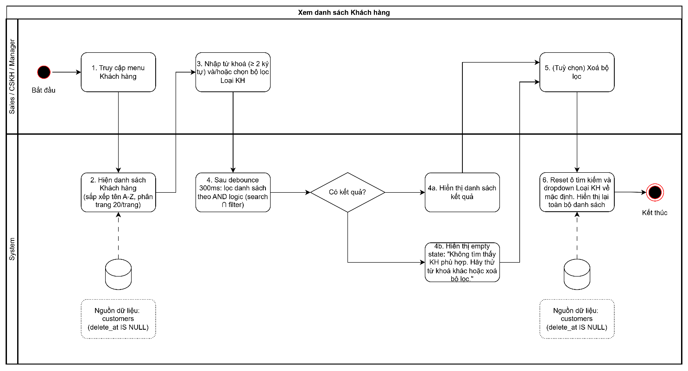

*▲ Sơ đồ BPMN — UC-CUS-01: Xem danh sách Khách hàng*

################################################### 2.1 Luồng chính

|  |  |  |
|----|----|----|
| **\#** | **Actor** | **Hành động / Phản hồi** |
| **1** | Sales/CSKH/Manager | Truy cập menu Khách hàng trên thanh điều hướng. |
| **2** | System | Truy vấn customers WHERE deleted_at IS NULL, hiển thị danh sách mặc định: sắp xếp tên A→Z, phân trang 20 bản ghi/trang. |
| **3** | Sales / CSKH / Manager | Nhập từ khoá vào ô tìm kiếm (≥ 2 ký tự) và/hoặc chọn bộ lọc Loại KH (B2B / Reseller / B2C / Other). |
| **4** | System | Sau debounce 300ms: lọc danh sách theo AND logic (search ∩ filter) — chỉ hiển thị bản ghi khớp cả hai điều kiện. |
| **4a** | System | \[Có kết quả\] Hiển thị danh sách kết quả đã lọc, cập nhật số lượng tìm thấy ở footer phân trang. |

################################################### 2.2 Luồng phụ

**\[AF-01: Xoá bộ lọc\] — kích hoạt sau bước 4a hoặc 4b khi Sales muốn quay về danh sách đầy đủ.**

|  |  |  |
|----|----|----|
| **\#** | **Actor** | **Hành động / Phản hồi** |
| **5** | Sales / CSKH / Manager | Nhấn nút **"Xoá bộ lọc"**. |
| **6** | System | Reset ô tìm kiếm và dropdown Loại KH về mặc định. Truy vấn lại customers WHERE deleted_at IS NULL, hiển thị toàn bộ danh sách (sắp xếp A→Z, phân trang 20/trang). |

################################################### 2.3 Luồng ngoại lệ

***\[EF-01: Không tìm thấy kết quả\]** — kích hoạt tại **bước 4** khi không có bản ghi nào khớp điều kiện lọc..*

|  |  |  |
|----|----|----|
| **\#** | **Actor** | **Hành động / Phản hồi** |
| **4b** | Sales / CSKH / Manager | Hiển thị **empty state**: icon + text *"Không tìm thấy KH phù hợp. Hãy thử từ khoá khác hoặc xoá bộ lọc."* Không trả về error. |
| **→** | — | Sales nhập lại từ khoá khác (quay về bước **3**) hoặc nhấn Xoá bộ lọc (tiếp bước **5**). |

######################################### 3. Mô tả giao diện

################################################### 3.1 Wireframe


*▲ UC-CUS-01 — Màn hình danh sách KH (mặc định)*


*▲ UC-CUS-01 — Tìm kiếm "Vie"*

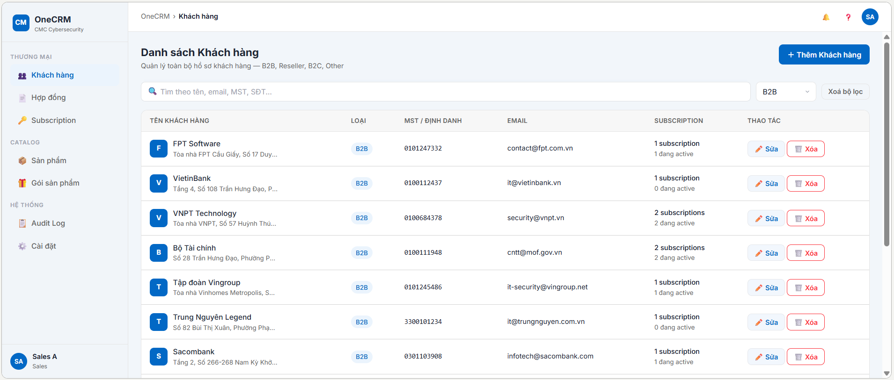

*▲ UC-CUS-01 — Filter theo loại B2B*


*▲ UC-CUS-01 — Search không có kết quả phù hợp*

##### **3.2 Các thành phần giao diện**

|  |  |  |  |
|----|----|----|----|
| **\#** | **Thành phần** | **Loại** | **Mô tả** |
| 1 | Tiêu đề trang | Text | Hiển thị cố định: "Danh sách Khách hàng"<br>Mô tả phụ: "Quản lý toàn bộ hồ sơ khách hàng — B2B, Reseller, B2C, Other" |
| 2 | Nút "Thêm Khách hàng” | Button (Primary) | Hiển thị ở góc trên bên phải header<br>Logic click: Mở modal UC-CUS-02 Tạo mới Khách hàng<br>Logic disable: Ẩn / disable khi user không có quyền customer:create (role CSKH) |
| 3 | Ô tìm kiếm | Input text | Placeholder: "Tìm theo tên, email, MST, SĐT..."<br>Logic: Trigger search khi user nhập ≥ 2 ký tự, sau debounce 300ms (bước 3 → 4) hoặc nhấn Enter<br>Khi \< 2 ký tự: không gọi API, danh sách giữ nguyên<br>Phạm vi tìm kiếm: fuzzy theo tên KH; exact match theo email, phone, tax_code<br>Kết hợp AND logic với bộ lọc Loại KH (bước 4) |
| 4 | Dropdown Loại KH | Select | Lựa chọn: Tất cả loại (mặc định) / B2B / Reseller / B2C / Other<br>Logic: Lọc ngay khi chọn, kết hợp AND với ô tìm kiếm (bước 3 → 4)<br>Placeholder: "▾ Tất cả loại" |
| 5 | Nút "Xoá bộ lọc" | Button (Ghost) | Logic click: Reset ô tìm kiếm về rỗng + dropdown về "Tất cả loại" → hiển thị lại toàn bộ danh sách (bước 5 → 6) |
| 6 | Bảng danh sách KH | Table | Nguồn dữ liệu: customers WHERE deleted_at IS NULL<br>Sắp xếp mặc định: tên A→Z<br>Click vào row: điều hướng sang UC-CUS-03 Xem 360° Khách hàng<br>Hiệu năng: P95 ≤ 500ms<br>Xem chi tiết các cột tại mục 3.3 |
| 7 | Phân trang | Pagination | Hiển thị: "Hiển thị {từ}–{đến} / {tổng} kết quả"<br>Số bản ghi mỗi trang: 20 (cố định Phase 1)<br>Điều hướng: nút Trước / Sau + số trang |
| 8 | Empty state | Component | Hiển thị khi bước 4 không có kết quả (bước 4b)<br>Icon tìm kiếm + Text: "Không tìm thấy KH phù hợp. Hãy thử từ khoá khác hoặc xoá bộ lọc."<br>Không hiện error toast |

##### **3.3 Các cột trong bảng danh sách**

|  |  |  |  |
|----|----|----|----|
| **\#** | **Field** | **Loại** | **Mô tả** |
| 1 | Avatar | Icon | Hiển thị ký tự đầu tiên của tên KH, nền màu theo loại:<br>xanh dương (B2B) · tím (Reseller) · xanh lá (B2C) · xám (Other)<br>Không click được |
| 2 | Tên KH | Text | Tên đầy đủ của KH (customer.name)<br>Font weight: medium, màu navy<br>Click vào tên: điều hướng sang UC-CUS-03 |
| 3 | Loại | Badge | Giá trị: B2B / Reseller / B2C / Other<br>Màu badge khác nhau theo loại (theo design token) |
| 4 | MST / Định danh | Text | Hiển thị customer.tax_code<br>Nếu không có (B2C, Other): hiển thị "—"<br>Font: monospace |
| 5 | Email | Text | Hiển thị customer.email<br>Nếu không có: hiển thị "—" |
| 6 | Subscription | Text | Hiển thị tổng số subscription + số đang active<br>Ví dụ: "2 subscriptions / 1 đang active"<br>Nếu chưa có: hiển thị "Chưa có" (màu text secondary) |
| 7 | Thao tác | Icon Button | Nút Sửa (✏️): mở UC-CUS-04 Cập nhật KH<br>Nút Xóa (🗑️): mở UC-CUS-05 Xóa KH<br>Logic hiển thị: nút Xóa chỉ hiện với role Manager; nút Sửa hiện với Sales và Manager<br>Click nút không trigger điều hướng row |

#### 4. Acceptance Criteria

##### **Nhóm 1: Hiển thị mặc định (bước 1 → 2)**

|  |  |  |  |
|----|----|----|----|
| **AC ID** | **Given** | **When** | **Then** |
| **AC-CUS-01-01** | Sales đăng nhập, có quyền customer:view | Truy cập menu Khách hàng (bước 1) | System hiển thị danh sách KH deleted_at IS NULL, sắp xếp tên A→Z, phân trang 20/trang (bước 2). |
| **AC-CUS-01-02** | KH "Test Corp" có deleted_at IS NOT NULL | Sales xem danh sách mặc định (bước 2) | "Test Corp" không xuất hiện. |

##### **Nhóm 2: Tìm kiếm & Lọc (bước 3 → 4 → 4a)**

|  |  |  |  |
|----|----|----|----|
| **AC ID** | **Given** | **When** | **Then** |
| **AC-CUS-01-03** | Có KH tên "FPT Software" | Sales nhập "FPT" vào ô tìm kiếm (bước 3) | Sau 300ms debounce (bước 4): danh sách hiển thị "FPT Software" (bước 4a). |
| **AC-CUS-01-04** | Sales chưa nhập đủ 2 ký tự | Sales nhập "F" vào ô tìm kiếm (bước 3) | API search không được gọi. Danh sách giữ nguyên. |
| **AC-CUS-01-05** | Có KH email "abc@xyz.com" | Sales nhập email đó (bước 3) | Đúng 1 KH xuất hiện (bước 4a). |
| **AC-CUS-01-06** | Sales nhập "FPT" VÀ chọn filter B2C | Bước 3 + 4 (AND logic) | Chỉ KH tên khớp "FPT" VÀ loại B2C mới xuất hiện — nếu không có → bước 4b. |

##### **Nhóm 3: Không có kết quả (bước 4b)**

|  |  |  |  |
|----|----|----|----|
| **AC ID** | **Given** | **When** | **Then** |
| **AC-CUS-01-07** | Không có KH nào khớp từ khoá + filter | Bước 4 không có kết quả | System hiển thị empty state (bước 4b): icon + text hướng dẫn. Không có error toast. |

##### **Nhóm 4: Xoá bộ lọc (bước 5 → 6)**

|  |  |  |  |
|----|----|----|----|
| **AC ID** | **Given** | **When** | **Then** |
| **AC-CUS-01-08** | Sales đang xem kết quả đã lọc (bước 4a hoặc 4b) | Sales nhấn "Xoá bộ lọc" (bước 5) | Ô tìm kiếm clear, dropdown về "Tất cả loại". System hiển thị lại toàn bộ danh sách deleted_at IS NULL (bước 6). |
| **AC-CUS-01-09** | Không có bộ lọc nào đang áp dụng | — | Nút "Xoá bộ lọc" ẩn hoặc disabled. |

##### **Nhóm 5: Hiệu năng**

|  |  |  |  |
|----|----|----|----|
| **AC ID** | **Given** | **When** | **Then** |
| **AC-CUS-01-10** | DB có 5.000 KH B2C + 500 KH B2B | Sales thực hiện tìm kiếm bất kỳ (bước 3→4) | P95 ≤ 500ms (BR-06). |

### 6.1.3. UC-CUS-02 Tạo mới Khách hàng

######################################### 1. Thông tin chung chức năng

|  |  |
|----|----|
| **Tên chức năng** | Tạo mới Khách hàng |
| **UC ID** | UC-CUS-02 |
| **Mô tả** | Sales tạo hồ sơ mới cho KH thuộc 1 trong 4 loại: B2B, Reseller, B2C, Other. Form hiển thị động theo loại. Hệ thống kiểm tra trùng lặp (dedup) trước khi commit.<br>User Story: Là một nhân viên Sales, Tôi muốn tạo mới hồ sơ KH với loại phù hợp, để tôi có thể thiết lập hợp đồng và subscription mà không bị nhầm lẫn giữa các loại đối tác. |
| **Tác nhân** | Sales (chính) · System (phụ) |
| **Tiền điều kiện** | Sales đã đăng nhập và có quyền customer:create. |
| **Hậu điều kiện** | (Success) Tạo thành công bản ghi Customer. Audit log ghi nhận actor, timestamp, loại KH.<br>(Failure) Không có record nào được tạo. Form giữ nguyên toàn bộ dữ liệu đã nhập. |
| **Ngoại lệ** | Trùng MST hoặc email → BE reject, hiển thị toast lỗi có link đến hồ sơ trùng. |
| **Quy tắc nghiệp vụ** | BR-01: B2B và Reseller bắt buộc nhập MST. MST unique trong toàn hệ thống — không kiểm tra trùng với KH đã bị xóa.<br>BR-02: Email bắt buộc với B2B, Reseller và B2C; tùy chọn với Other.<br>BR-03: Email unique trong nhóm {B2B, Reseller}; unique riêng trong nhóm {B2C} — không kiểm tra trùng với KH đã bị xóa. Email B2C không conflict với B2B/Reseller.<br>BR-04: Khi Sales đổi Loại KH, các field bị ẩn sẽ bị xóa trắng.<br>BR-05: Audit log bắt buộc — nếu không ghi được thì rollback, không tạo KH. |

######################################### 2. Luồng nghiệp vụ


*▲ Sơ đồ BPMN — UC-CUS-02: Tạo mới Khách hàng*

################################################### 2.1 Luồng chính

|  |  |  |
|----|----|----|
| **\#** | **Actor** | **Hành động / Phản hồi** |
| 1 | Sales | Truy cập menu Khách hàng → nhấn "+ Thêm khách hàng" trên màn hình Danh sách. |
| 2 | System | Hiển thị form "Thêm Khách hàng mới" với selector Loại KH. |
| 3 | Sales | Chọn Loại KH (B2B / Reseller / B2C / Other). |
| 4 | System | Cập nhật form động: hiện/ẩn các field theo loại đã chọn (xem mục 3.3). |
| 5 | Sales | Nhập thông tin khách hàng. |
| 5a | Sales | (Tuỳ chọn) Đổi Loại KH → AF-01. Sau khi hoàn tất, tiếp tục từ bước 5. |
| 6 | Sales | Chọn hành động: nhấn "Lưu khách hàng" → tiếp bước 7; hoặc nhấn "Hủy" → AF-02. |
| 7 | System | Validate định dạng toàn bộ form (required fields, format email, format MST, format SĐT). |
| 7a | System | \[Validate thất bại\] → EF-01. \[Validate thành công\] → tiếp bước 8. |
| 8 | System | Kiểm tra trùng MST và email trong hệ thống (chỉ với KH chưa bị xóa). |
| 8a | System | \[Có trùng MST\] → EF-02. \[Có trùng email\] → EF-03. \[Không trùng\] → tiếp bước 9. |
| 9 | System | Tạo Customer record (deleted_at = NULL), ghi Audit Log. |
| 10 | System | Điều hướng sang UC-CUS-03 View 360° của KH vừa tạo. Hiển thị toast "Tạo khách hàng thành công". |

################################################### 2.2 Luồng phụ

| **Bước** | **Actor** | **Hành động / Phản hồi** |
|----|----|----|
| 5a-1 | Sales | Đổi sang loại KH khác. |
| 5a-2 | System | Cập nhật lại form: ẩn/hiện field theo loại mới. Các field bị ẩn bị xóa trắng (BR-04). |
| → | — | Tiếp tục từ bước 5. |

**\[AF-02: Sales hủy\] — kích hoạt tại bước 6 khi Sales nhấn "Hủy" hoặc nút "X", trước khi hệ thống tạo record.**

| **Bước** | **Actor** | **Hành động / Phản hồi** |
|----|----|----|
| 6b-1 | Sales | Nhấn "Hủy" hoặc icon "X" đóng form. |
| 6b-2 | System | Hiển thị dialog xác nhận: "Dữ liệu chưa lưu sẽ bị mất. Bạn có chắc muốn thoát?" |
| 6b-3 | Sales | Nhấn "Đồng ý". |
| → | — | Đóng form, quay về Danh sách. Không tạo record. |
| (Nhánh phụ) | Sales | Nhấn "Không" tại dialog → đóng dialog, quay lại form, tiếp tục từ bước 5. |

##### 2.3 Luồng ngoại lệ

**\[EF-01: Validation thất bại\] — kích hoạt tại bước 7 khi field bắt buộc bỏ trống hoặc sai định dạng.**

| **Bước** | **Actor** | **Hành động / Phản hồi** |
|----|----|----|
| 7-EF01 | System | Highlight viền đỏ từng field lỗi, hiển thị message lỗi inline bên dưới field. Không tạo record. Form giữ nguyên toàn bộ dữ liệu đã nhập. |
| → | — | Sales chỉnh sửa → quay lại bước 6. |

**\[EF-02: Trùng MST\] — kích hoạt tại bước 8 khi BE trả về lỗi trùng MST (KH chưa bị xóa).**

| **Bước** | **Actor** | **Hành động / Phản hồi** |
|----|----|----|
| 8-EF02 | System | Hiển thị toast lỗi: "Mã số thuế này đã tồn tại. \[Xem hồ sơ →\]" Không tạo record. Form giữ nguyên toàn bộ dữ liệu đã nhập. |
| → | — | Sales nhấn link trong toast để xem hồ sơ trùng (mở tab mới) hoặc đóng toast, sửa lại MST → quay lại bước 6. |

**\[EF-03: Trùng email\] — kích hoạt tại bước 8 khi BE trả về lỗi trùng email trong cùng nhóm loại KH (KH chưa bị xóa).**

| **Bước** | **Actor** | **Hành động / Phản hồi** |
|----|----|----|
| 8-EF03 | System | Hiển thị toast lỗi: "Email này đã được sử dụng. \[Xem hồ sơ →\]" Không tạo record. Form giữ nguyên toàn bộ dữ liệu đã nhập. |
| → | — | Sales nhấn link trong toast để xem hồ sơ trùng (mở tab mới) hoặc đóng toast, sửa lại email → quay lại bước 6. |

######################################### 3. Mô tả giao diện

################################################### 3.1 Wireframe (minh hoạ loại B2B)


*▲ UC-CUS-02 — Bước 1: Chọn loại KH*


*▲ UC-CUS-02 — Form B2B (có Lĩnh vực KD)*


*▲ UC-CUS-02 — Form B2C (ẩn Lĩnh vực KD & MST)*

##### 3.2 Các thành phần giao diện

| **\#** | **Thành phần** | **Loại** | **Mô tả** |
|----|----|----|----|
| 1 | **Selector Loại KH** | Radio group | Bắt buộc chọn trước khi điền form. 4 lựa chọn: B2B / Reseller / B2C / Other, mỗi loại có icon và mô tả ngắn. Đổi loại → form cập nhật động, fields bị ẩn bị xóa trắng (BR-04). |
| 2 | **Form nhập liệu** | Form | Hiển thị động theo Loại KH đã chọn (xem mục 3.3). Validate khi nhấn "Lưu" (bước 6), không validate realtime khi đang nhập. |
| 3 | **Nút "Lưu"** | Button (Primary) | Logic click: FE validate toàn bộ form → gọi BE → tạo KH (bước 7 → 8 → 9). Trạng thái loading/disable sau khi click, tránh submit nhiều lần. |
| 4 | **Nút "Hủy"** | Button (Ghost) | Logic click: Hiển thị dialog xác nhận trước khi đóng form (AF-02). Không lưu bất kỳ dữ liệu nào. |
| 5 | **Nút "X" (đóng)** | Icon Button | Hành vi giống nút Hủy: hiển thị dialog xác nhận. |
| 6 | **Thông báo lỗi inline** | Validation message | Hiển thị bên dưới từng field lỗi khi FE validate thất bại (EF-01): required fields, sai định dạng email/MST/SĐT. Field lỗi: viền đỏ. |
| 7 | **Toast lỗi BE** | Toast (Error) | Hiển thị khi BE trả về lỗi trùng lặp (EF-02, EF-03). Nội dung kèm link "\[Xem hồ sơ →\]" mở tab mới. Form giữ nguyên dữ liệu sau khi toast xuất hiện. |

##### 3.3 Các field trong form theo Loại KH

| **\#** | **Field** | **Bắt buộc** | **Hiển thị với loại** | **Mô tả & Validation** |
|----|----|----|----|----|
| 1 | **Loại KH** | ✓ | Tất cả | Selector, bắt buộc chọn trước khi điền. Label và placeholder của các field thay đổi theo loại được chọn. |
| 2 | **Tên** | ✓ | Tất cả | Label: "Tên doanh nghiệp" (B2B, Reseller) / "Họ và tên" (B2C) / "Tên liên hệ" (Other). Max 255 ký tự. |
| 3 | **Mã số thuế (MST)** | ✓ | B2B, Reseller | Chỉ nhập số, 10 hoặc 13 chữ số. Unique toàn hệ thống — không kiểm tra trùng với KH đã bị xóa. Validation: bắt buộc, sai định dạng, đã tồn tại (EF-02). |
| 4 | **Email** | ✓ B2B, Reseller, B2C — Other | Tất cả | Định dạng email hợp lệ. Unique trong nhóm {B2B, Reseller} và unique riêng trong nhóm {B2C}. Validation: bắt buộc (trừ Other), sai định dạng, đã tồn tại (EF-03). |
| 5 | **Số điện thoại** | — | Tất cả | Chấp nhận: 10 chữ số bắt đầu bằng 0 (SĐT VN) hoặc + theo sau là 8–14 chữ số (SĐT quốc tế). Từ chối: chứa chữ cái hoặc ký tự đặc biệt. Validation message: "Số điện thoại không hợp lệ. VD: 0901 234 567 hoặc +84 901 234 567" |
| 6 | **Lĩnh vực kinh doanh** | — | B2B, Reseller | Dropdown danh sách định sẵn (xem seed data bên dưới). Ẩn với B2C và Other. |
| 7 | **Thuộc tập đoàn** | — | B2B, Reseller, Other | Dropdown tìm kiếm. Chỉ hiển thị KH loại B2B hoặc Reseller chưa bị xóa. Ẩn với B2C. |
| 8 | **Địa chỉ** | — | Tất cả | Max 500 ký tự. |

##### 3.4 Seed data — Lĩnh vực kinh doanh

Dev khởi tạo sẵn danh sách này khi setup hệ thống. Sort theo mức độ phổ biến trong ngành cybersecurity. "Khác" luôn để cuối.

| **\#** | **Tên hiển thị**                 |
|--------|----------------------------------|
| 1      | Công nghệ thông tin & Viễn thông |
| 2      | Tài chính - Ngân hàng - Bảo hiểm |
| 3      | Thương mại & Bán lẻ              |
| 4      | Sản xuất & Công nghiệp           |
| 5      | Xây dựng & Bất động sản          |
| 6      | Y tế & Dược phẩm                 |
| 7      | Giáo dục & Đào tạo               |
| 8      | Logistics & Vận tải              |
| 9      | Năng lượng & Tiện ích            |
| 10     | Truyền thông & Giải trí          |
| 11     | Nông nghiệp & Thực phẩm          |
| 12     | Du lịch & Khách sạn              |
| 13     | Dịch vụ chuyên nghiệp            |
| 14     | Nhà nước & Tổ chức công          |
| 15     | Khác                             |

#### 4. Acceptance Criteria

##### Nhóm 1: Tạo thành công

| **AC ID** | **Given** | **When** | **Then** |
|----|----|----|----|
| **AC-CUS-02-01** | Sales chọn loại B2B, nhập đủ thông tin hợp lệ | Nhấn Lưu (bước 5) | Tạo record thành công, chuyển sang View 360°, toast thành công. Audit log ghi nhận. |
| **AC-CUS-02-02** | Sales chọn loại B2C, không nhập MST | Nhấn Lưu | Tạo thành công — MST không bắt buộc với B2C. |
| **AC-CUS-02-03** | Email "abc@fpt.com" đã tồn tại trong B2B | Sales tạo KH B2C với cùng email | Tạo thành công — email B2C và B2B không conflict (BR-03). |

##### Nhóm 2: Đổi loại KH — field bị clear

| **AC ID** | **Given** | **When** | **Then** |
|----|----|----|----|
| **AC-CUS-02-04** | Sales chọn B2B, đã nhập MST "0101247332" | Sales đổi sang loại B2C | Field MST bị ẩn và bị xóa trắng. Submit không gửi MST lên backend. |

##### Nhóm 3: Validation và trùng lặp

| **AC ID** | **Given** | **When** | **Then** |
|----|----|----|----|
| **AC-CUS-02-05** | Sales chọn B2B, bỏ trống MST | Nhấn Lưu | Lỗi inline dưới field MST: "Mã số thuế là bắt buộc". Không tạo record. Form giữ nguyên dữ liệu. |
| **AC-CUS-02-06** | MST "0101247332" đã tồn tại | Sales nhập cùng MST, nhấn Lưu | Toast lỗi: "Mã số thuế đã tồn tại. \[Xem hồ sơ →\]". Không tạo. Form giữ nguyên dữ liệu. |
| **AC-CUS-02-07** | Email "abc@fpt.com" đã tồn tại trong B2B | Sales tạo B2B với cùng email, nhấn Lưu | Toast lỗi: "Email đã được sử dụng. \[Xem hồ sơ →\]". Không tạo. Form giữ nguyên dữ liệu. |
| **AC-CUS-02-08** | KH "FPT Corp" đã bị xóa (deleted_at IS NOT NULL), có MST "0101247332" | Sales tạo KH mới với cùng MST | Tạo thành công — không kiểm tra trùng với KH đã xóa (BR-01). |
| **AC-CUS-02-10** | KH B2B "FPT Corp" đã bị xóa (deleted_at IS NOT NULL), có email "abc@fpt.com" | Sales tạo KH B2B mới với cùng email | Tạo thành công — không kiểm tra trùng email với KH đã xóa (BR-03). |

##### Nhóm 4: Dropdown Thuộc tập đoàn

| **AC ID** | **Given** | **When** | **Then** |
|----|----|----|----|
| **AC-CUS-02-09** | Có KH B2B "FPT Corp" đang active và KH B2B "Test Corp" đã bị xóa | Sales mở dropdown "Thuộc tập đoàn" | Chỉ hiện "FPT Corp". "Test Corp" không xuất hiện. |

### 6.1.4 UC-CUS-03 Xem Chi tiết Khách hàng (Customer 360°)

######################################### 1. Thông tin chung chức năng

|  |  |
|----|----|
| **Thuộc tính** | **Nội dung** |
| **Tên chức năng** | Xem Chi tiết Khách hàng (Customer 360°) |
| **UC ID** | UC-CUS-03 |
| **Mô tả** | Sales xem toàn bộ thông tin của một khách hàng trên một màn hình duy nhất, tổ chức thành 4 tab: Tổng quan, Hợp đồng & Sub, Timeline, Audit Log.<br>Màn hình này là passive observer — chỉ hiển thị dữ liệu, không trigger action nào lên các hệ thống sản phẩm (EDR / AV / C-Shield). |
| **Tác nhân** | Sales, Manager |
| **Tiền điều kiện** | Actor đã đăng nhập và có quyền customer:view |
| **Hậu điều kiện** | Không có thay đổi dữ liệu. Màn hình chỉ đọc. |
| **Ngoại lệ** | KH không tồn tại hoặc đã bị xóa mềm → hiển thị trang thông báo generic, không hiển thị bất kỳ dữ liệu nào (EF-01). |
| **Quy tắc nghiệp vụ** | **BR-01:** KH không tồn tại hoặc đã bị xóa → trang thông báo, không hiển thị dữ liệu. **BR-02:** Màn hình chỉ đọc. Không có action nào gửi lên product system.<br>**BR-03:** Nút Chỉnh sửa → UC-CUS-04. Nút Xóa → UC-CUS-05. Chỉ hiển thị khi KH tồn tại và chưa bị xóa và người dùng có quyền tương ứng.<br>**BR-04:** Tab HĐ & Sub, Timeline, Audit Log áp dụng lazy load theo scroll — không pagination.<br>**BR-05:** Mỗi tab có vùng scroll riêng độc lập. |

######################################### 2. Luồng nghiệp vụ


################################################### 2.1 Luồng chính

|  |  |  |
|----|----|----|
| **Bước** | **Actor** | **Hành động / Phản hồi** |
| 1 | Sales | Truy cập màn hình theo một trong 4 điểm vào:<br>(a) Click tên KH từ Danh sách,<br>(b) Click link lỗi trùng MST/email,<br>(c) Click node Org Chart,<br>(d) Deep-link URL /customers/{id}. |
| 2, 2a | System | Kiểm tra Customer record theo id:<br>→ id không tồn tại HOẶC deleted_at IS NOT NULL<br>→ \[EF-01\] → KH tồn tại và chưa bị xóa → tiếp tục bước 3. |
| 3 | System | Tải dữ liệu Customer, render màn hình 360°. Tab mặc định: Tổng quan. |
| 4 | Sales | Xem thông tin tại Tab Tổng quan. |
| 4a | — | Sales có click node trong Org Chart? \[Có\] → AF-01. \[Không\] → tiếp bước 5. |
| 5 | Sales | (Tuỳ chọn) Chuyển sang tab: Hợp đồng & Sub / Timeline / Audit Log. |
| 6 | System | Render nội dung tab được chọn. |
| 6a | — | Trong Tab HĐ & Sub: contract RESELLER có tổng allocations ≥ 10?<br>- \[Có\] → AF-02.<br>- \[Không (\<10)\] → Hiển thị danh sách đơn vị thụ hưởng inline trong tab, không kích hoạt AF-02. |
| 7 | Sales | Chọn hành động cuối:<br>• Nhấn **"Chỉnh sửa"** → UC-CUS-04 (END).<br>• Nhấn **"Xóa"** → UC-CUS-05 (END).<br>• Nhấn **"← Quay lại"** → Về màn Danh sách KH, giữ nguyên filter đang áp dụng (END).\] |

################################################### 2.2 Luồng phụ

**\[AF-01: Click node Org Chart\]** — kích hoạt tại bước 4 khi Sales click vào một node trong Org Chart phân cấp tập đoàn.

| **Bước** | **Actor** | **Hành động / Phản hồi** |
|----|----|----|
| **AF-01a** | Sales | Click vào node entity trong Org Chart (Công ty mẹ / Chi nhánh / Cùng cấp). |
| **AF-01b** | System | Điều hướng **TRONG CÙNG TAB** sang màn 360° của entity được click. Tab Tổng quan mặc định. |
| **AF-01c** | System | Cập nhật URL và breadcrumb theo entity mới. Người dùng dùng browser Back để quay lại entity trước. |
| **→** | — | Tiếp tục từ bước 4. |

**\[AF-02: Nhảy sang màn Subscription\]** — kích hoạt tại bước 6 khi contract RESELLER có tổng allocations ≥ 10.

| **Bước** | **Actor** | **Hành động / Phản hồi** |
|----|----|----|
| **AF-02a** | Sales | Click link **"Xem danh sách Subscription→"** trong contract RESELLER. |
| **AF-02b** | System | Mở màn Danh sách Subscription (UC-SUB-01) tại **TAB MỚI**. Pre-fill filter: customer_id = {id}, contract_id = {code}. |
| **→** | END | Mở màn Subscription (tab mới). |

################################################### 2.3 Luồng ngoại lệ

**\[EF-01: KH không tồn tại hoặc đã bị xóa\]** — kích hoạt tại bước 2 khi Customer record không tồn tại hoặc deleted_at IS NOT NULL.

| **Bước** | **Actor** | **Hành động / Phản hồi** |
|----|----|----|
| **EF-01a** | System | Hiển thị trang thông báo: "Khách hàng không tồn tại hoặc đã bị xóa." Không hiển thị Profile Hero, Tab bar hay bất kỳ dữ liệu KH nào. HTTP 200 (không expose 404 vs 410 — tránh information leakage). |
| **EF-01b** | System | Hiển thị nút **"← Quay lại Danh sách"**. |
| **→** | END | Quay lại màn Danh sách KH. |

######################################### 3. Mô tả giao diện

################################################### 3.1 Wireframe

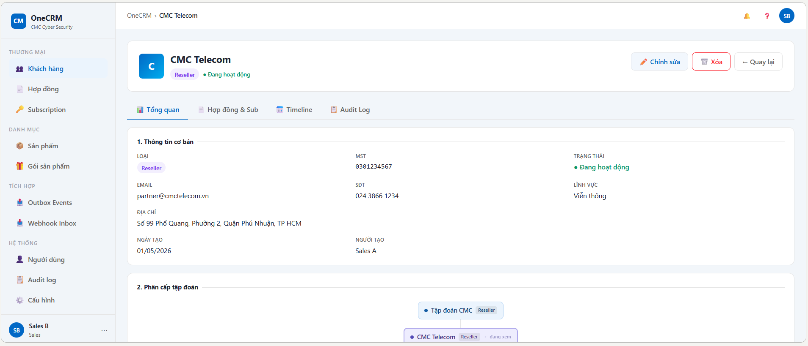

Ghi chú:

(\*) Profile Hero và Tab bar luôn cố định phía trên, không bị scroll.

(\*) Mỗi tab có scroll container riêng biệt, độc lập nhau.

**Figma:** \[link — Designer cập nhật sau\]

################################################### 3.2 Các thành phần giao diện

| **\#** | **Thành phần** | **Loại** | **Mô tả** |
|----|----|----|----|
| 1 | Profile Hero | Section | Hiển thị avatar (chữ cái đầu tên KH, nền gradient), tên KH (20px bold), Badge Loại, Badge Trạng thái. Luôn cố định phía trên Tab bar, không bị scroll theo nội dung tab. |
| 2 | Nút "Chỉnh sửa" | Button (Secondary) | Điều hướng sang UC-CUS-04. Chỉ hiển thị khi KH tồn tại và chưa bị xóa. |
| 3 | Nút "Xóa" | Button (Ghost — đỏ) | Kích hoạt UC-CUS-05. Chỉ hiển thị khi KH tồn tại và chưa bị xóa. |
| 4 | Nút "← Quay lại" | Button (Ghost) | Quay về Danh sách KH, giữ nguyên filter đang áp dụng. Luôn hiển thị. |
| 5 | Tab bar | Tab Navigation | 4 tabs: Tổng quan / Hợp đồng & Sub / Timeline / Audit Log. Tab Tổng quan active mặc định. Chuyển tab không reload trang. |
| 6 | Scroll container (per tab) | Container | Mỗi tab có max-height: calc(100vh - 320px); overflow-y: auto. Các tab scroll độc lập nhau. |
| 7 | Trang thông báo | Full Page | Hiển thị thay thế toàn bộ màn 360° khi KH không tồn tại hoặc đã xóa (EF-01). Không render Profile Hero và Tab bar. |

################################################### 3.3 Tab 1 — Tổng quan


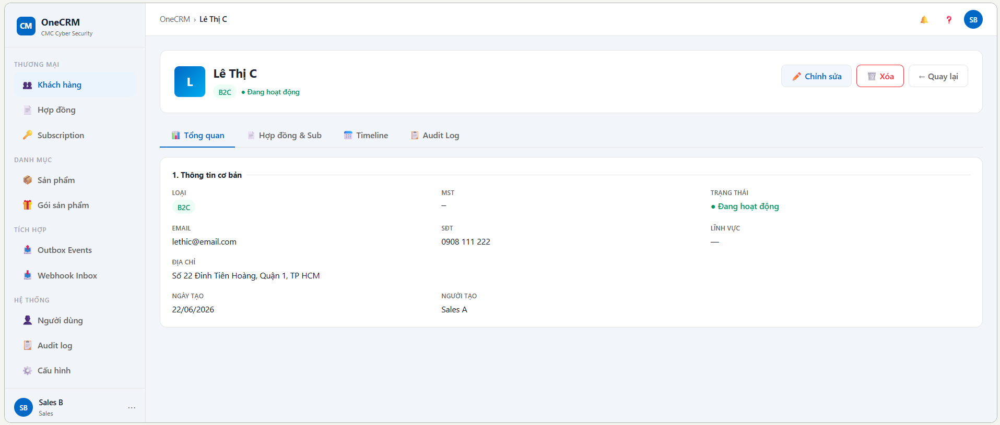

**Section 1: Thông tin cơ bản**

Hiển thị dạng grid 3 cột. Luôn hiển thị với mọi loại KH.

| **\#** | **Field hiển thị** | **Nguồn dữ liệu** | **Ghi chú** |
|----|----|----|----|
| 1 | Loại KH | customer.type | Badge: B2B / Reseller / B2C / Other. |
| 2 | Mã số thuế | customer.tax_code | Font monospace. Hiển thị "—" nếu null. |
| 3 | Trạng thái | customer.status | ACTIVE → "● Đang hoạt động" (xanh). INACTIVE → "● Không hoạt động" (xám). BLACKLIST → "● Danh sách đen" (đỏ). |
| 4 | Email | customer.email | "—" nếu null. |
| 5 | Số điện thoại | customer.phone | "—" nếu null. |
| 6 | Lĩnh vực | customer.industry | "—" nếu null. |
| 7 | Địa chỉ | customer.address | Full width (1 hàng). "—" nếu null. |
| 8 | Ngày tạo | customer.created_at | Format dd/MM/yyyy. |
| 9 | Người tạo | audit_log (action = create) | Tên actor tạo record. |

**Section 2: Phân cấp tập đoàn (Org Chart)**

**Điều kiện hiển thị section:** Chỉ render khi thoả mãn ít nhất một điều kiện:

- customer.type IN ('B2B', 'Reseller'), HOẶC

- customer.parent_id IS NOT NULL, HOẶC

- Tồn tại ít nhất 1 entity có parent_id = customer.id (chưa bị xóa)

Không thoả mãn → ẩn hoàn toàn section, không render placeholder.

\[Grandparent\] ← border dashed, nếu tồn tại

\|

\[Parent\] ← nền xanh dương

\|

\[CURRENT ← đang xem\] ← nền tím, border 2px

\|

┌───┴───┐

\[Child 1\] \[Child 2\] ← H-bar nối khi ≥ 2 children

── Cùng cấp (N) ──────────────────────────

\[Sibling 1\] \[Sibling 2\]

| **Variant** | **Nguồn dữ liệu** | **Clickable** | **Hành vi click** |
|----|----|----|----|
| grand | customers.find(id = parent.parent_id) — chưa xóa | ✅ | Navigate 360° trong cùng tab (AF-01) |
| parent | customers.find(id = customer.parent_id) | ✅ | Navigate 360° trong cùng tab (AF-01) |
| current | Entity đang xem | ❌ | — |
| child | customers.where(parent_id = customer.id AND deleted_at IS NULL) | ✅ | Navigate 360° trong cùng tab (AF-01) |
| sibling | customers.where(parent_id = customer.parent_id AND id ≠ current AND deleted_at IS NULL) | ✅ | Navigate 360° trong cùng tab (AF-01) |

**Trường hợp hierarchy \> 3 cấp:** Hiển thị button "↑ Xem thêm X cấp trên". X = số cấp bị ẩn. Click → navigate sang entity ở cấp liền kề trên grandparent (AF-01). Không expand inline.

################################################### 3.4 Tab 2 — Hợp đồng & Subscription

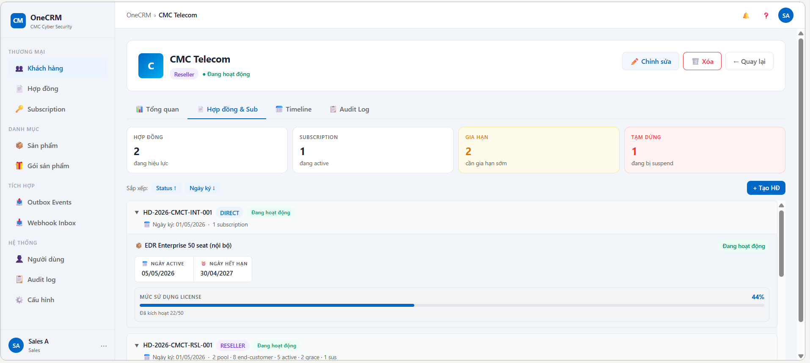

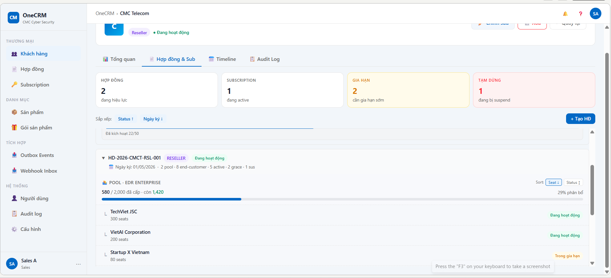

**Summary Strip** (nằm ngoài scroll container — cố định đầu tab):

| **\#** | **Card** | **Nguồn dữ liệu** | **Màu khi \> 0** |
|----|----|----|----|
| 1 | Hợp đồng | COUNT(contracts WHERE customer_id = id AND status = ACTIVE) | Trung lập |
| 2 | Subscription | COUNT(subscriptions WHERE contract.customer_id = id AND status = ACTIVE) | Trung lập |
| 3 | Gia hạn | COUNT(license_mirror WHERE status CONTAINS GRACE) | Vàng |
| 4 | Tạm dừng | COUNT(subscriptions WHERE status = SUSPENDED) | Đỏ |

Gia hạn lấy từ license_mirror.status vì subscription.status không có GRACE — sub vẫn ACTIVE khi license vào GRACE (theo data model 5.5.1).

**Sắp xếp contract list** theo contract.signed_date giảm dần

**Contract Header — Template:**

\[▼/▶\] {CONTRACT_CODE} \[BADGE_TYPE\] \[BADGE_STATUS\]

📅 {DATE_SIGNED} · {POOL_COUNT} · {ITEM_COUNT} · {STATUS_BREAKDOWN}

| **Element** | **Nguồn dữ liệu** | **Hiển thị khi** |
|----|----|----|
| ▼/▶ | UI state | Luôn hiển thị. Default: expanded (▼). Click để toggle. |
| {CONTRACT_CODE} | contract.code | Luôn hiển thị. |
| \[BADGE_TYPE\] | contract.type | Luôn hiển thị. DIRECT (xanh dương) / RESELLER (tím). |
| \[BADGE_STATUS\] | Derive từ subs trong contract | Luôn hiển thị. |
| {DATE_SIGNED} | contract.signed_date | Luôn hiển thị. Format 📅 dd/MM/yyyy. Hiển thị 📅 — nếu null. |
| {POOL_COUNT} | COUNT(contract_pool_items WHERE contract_id = id) | Chỉ khi contract.type = 'RESELLER' |
| {ITEM_COUNT} | DIRECT: COUNT(subs) + label "subscription". RESELLER: SUM(pool_items.allocated_qty) + label "đơn vị thụ hưởng" | Luôn hiển thị. |
| {STATUS_BREAKDOWN} | Xem quy tắc bên dưới | Khi {ITEM_COUNT} \> 0 |

Ghi chú: contract.end_date KHÔNG có trong data model. Không hiển thị ngày kết thúc ở cấp contract. Thời hạn dịch vụ được xác định bởi subscription.end_date (đồng bộ từ license_mirror.expiration_date) và hiển thị tại sub row bên dưới.

**Quy tắc {STATUS_BREAKDOWN}:** Nguồn: DIRECT → subscription.status. RESELLER → license_mirror.status. Thứ tự cố định — chỉ render khi count \> 0, join bằng " · ":

| **\#** | **Status**        | **Label hiển thị** |
|--------|-------------------|--------------------|
| 1      | ACTIVE            | {n} active         |
| 2      | PENDING_PROVISION | {n} pending        |
| 3      | GRACE             | {n} grace          |
| 4      | SUSPENDED         | {n} sus            |
| 5      | REVOKED           | {n} revoked        |
| 6      | EXPIRED           | {n} expired        |

**Contract Body — DIRECT:**

- Mỗi sub item trong hợp đồng DIRECT hiển thị:

- 

- **Date Block** — Quy tắc hiển thị theo Status

| **Status** | **Hiển thị** |
|----|----|
| ACTIVE | **Ngày Active** + **Ngày hết hạn** (2 ô cạnh nhau) |
| PENDING_PROVISION | Placeholder: *"Ngày Active & hết hạn sẽ hiển thị sau khi license được kích hoạt"* |
| SUSPENDED | Không hiển thị date block |
| GRACE | Không hiển thị date block |
| EXPIRED | Không hiển thị date block |

- Nguồn dữ liệu khi ACTIVE:

  1.  **Ngày Active** (activated_at): lấy từ event license.active nhận qua Webhook, lưu vào subscription.activated_at

  2.  **Ngày hết hạn** (expires_at): lấy từ payload event license.active, lưu vào subscription.expires_at

  3.  CRM không tự tính 2 trường này. Nếu chưa nhận được event → hiển thị placeholder.

<!-- -->

- **Usage Bar**

  - Chỉ hiển thị khi usage \> 0%.

  - Cấu trúc hiển thị (từ trên xuống):

    1.  Label + % nổi bật: dòng đầu tiên, label "Mức sử dụng license" (trái) và giá trị % (phải, in đậm)

    2.  Progress bar: màu xanh (var(--primary)) nếu usage ≤ 80%, cam (var(--amber)) nếu \> 80%

    3.  Caption diễn giải: dòng cuối, format Đã kích hoạt n/m

        - n = số lượng license/seat/thiết bị đang active

        - m = tổng số được cấp phép theo subscription

        - Ví dụ: Đã kích hoạt 144/200

------------------------------------------------------------------------

**Contract Body — RESELLER**

- Ngưỡng hiển thị: Full inline vs Preview + Link (AF-02)

- Ngưỡng được tính **theo từng pool** (không phải tổng toàn bộ contract):

| **Số allocation trong 1 pool** | **Hành vi hiển thị** |
|----|----|
| **\< 5** | Hiển thị **toàn bộ** allocation rows inline trong pool đó (có thể thu gọn/mở rộng theo INLINE_LIMIT = 3 ban đầu) |
| **≥ 5** | Hiển thị **5 bản ghi đầu tiên** (sort theo seats giảm dần) + dòng tóm tắt phần còn lại + link "Xem danh sách Subscription" để mở đầy đủ ở AF-02 |

- **Pool Block — Chế độ Full Inline (\< 5 allocations/pool)**

Mỗi pool hiển thị:

**Pool Header:**

- Nhãn: 🏊 Pool · \[Tên sản phẩm\]

- Thanh phân bổ: \[used\] / \[total\] đã cấp · còn \[remaining\]

- Progress bar (cam nếu \> 80%)

- Controls: Sort by **Seat ↓** \| **Status ↕**

**Allocation Rows (inline):**

- Mặc định hiện 3 dòng đầu (theo sort hiện tại)

- Nếu còn ẩn: hiện +N chưa hiện: \[summary\] + nút **Xem tất cả N ↓**

- Mỗi dòng: tên end-customer, số seat, badge status

<!-- -->

- **Pool Block — Chế độ Preview + Link (≥ 5 allocations/pool)**

**Cấu trúc hiển thị theo thứ tự từ trên xuống:**

1.  **Pool Header** — giống 5.2, nhưng **không có** control Sort (vì preview cố định sort theo seats giảm dần)

2.  **5 allocation rows đầu tiên** (sort theo seats giảm dần, không phân trang/expand)

3.  **Link "Xem danh sách Subscription"** — text-link, không icon mũi tên, căn phải, ngay dưới bản ghi thứ 5

4.  **Dòng tóm tắt phần còn lại** — căn giữa, màu chữ nhạt: Hiển thị 5 / N · còn (N−5) end-customer · \[breakdown status: x Đang hoạt động · y Trong gia hạn · z Tạm dừng\]

**Thiết kế link "Xem danh sách Subscription":**

- Loại: text-link (không phải button có border/background)

- Vị trí: căn phải (text-align:right), trong khối có viền trên dashed, nền var(--gray-50) nhạt

- Style: color: var(--primary), font-size: 12px, font-weight: 500, gạch chân (text-decoration: underline)

- **Không có icon/mũi tên** kèm theo text

- Hover: giảm opacity (0.7) — không đổi màu nền/border

- Hành vi: click → mở **trang AF-02 ở tab trình duyệt mới** (window.open), không dùng toast/modal

################################################### 3.5 Tab 3 — Timeline

################################################### 

**Template một timeline event:**

\[DOT\] {TITLE}

🕐 {TIMESTAMP} \[SOURCE_BADGE\] {ACTOR}

{DETAIL} ← chỉ render khi có giá trị, ẩn hoàn toàn khi null

| **\#** | **Element** | **Nguồn dữ liệu** | **Ghi chú** |
|----|----|----|----|
| 1 | DOT (màu) | event.severity | Xem bảng Severity bên dưới |
| 2 | DOT (icon) | event.event_type → PRODUCT_MODULE_CONFIG.provisioning_timeline_templates |  |
| 3 | TITLE | Template render với data từ event |  |
| 4 | TIMESTAMP | provisioning_event.occurred_at | dd/MM/yyyy HH:mm |
| 5 | SOURCE_BADGE | Derive từ source_webhook_id và actor | Xem bảng Source bên dưới |
| 6 | ACTOR | Actor của event | "System" nếu null |
| 7 | DETAIL | provisioning_event.data extract theo template | Ẩn hoàn toàn khi null |

**Severity — màu DOT:**

| **Severity** | **Màu DOT** | **Trường hợp điển hình**             |
|--------------|-------------|--------------------------------------|
| SUCCESS      | Xanh lá     | License active, provision hoàn thành |
| WARNING      | Vàng        | License GRACE, usage vượt 80%        |
| ERROR        | Đỏ          | License suspended, revoked           |
| INFO         | Xanh dương  | Ký hợp đồng, gửi credentials         |
| PENDING      | Xám         | Đang chờ provision                   |

**Source — SOURCE_BADGE:**

| **Điều kiện derive** | **Badge** | **Màu** |
|----|----|----|
| actor = null + action chứa "webhook / event từ / license." | Webhook | Tím |
| actor = null còn lại | System | Xám |
| Actor là người dùng | UI | Xanh dương |
| Gọi qua API external | API | Xanh lá |

**Sắp xếp và tải dữ liệu:**

| **Thuộc tính** | **Giá trị** |
|----|----|
| Sort | DESC provisioning_event.occurred_at (mới nhất trên cùng). Không đổi chiều. |
| Lọc | internal_only = false — không hiển thị event nội bộ với Sales |
| Batch đầu | 20 events gần nhất |
| Lazy load trigger | Scroll đến scrollHeight - 80px từ bottom của scroll container |
| Batch size | 20 events / lần |
| Search / Filter | Không có trong Sprint 0 |
| State rỗng | Empty state: icon + text "Chưa có sự kiện" |

################################################### 3.6 Tab 4 — Audit Log

Search bar nằm **ngoài** scroll container — cố định ở đầu tab.

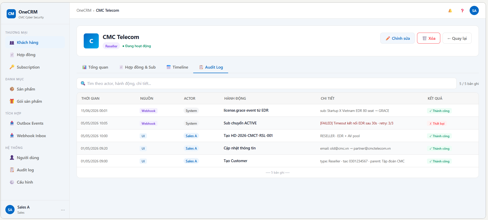

**Các cột:**

| **\#** | **Cột** | **Nguồn dữ liệu** | **Searchable** |
|----|----|----|----|
| 1 | Thời gian | audit_log.created_at — dd/MM/yyyy HH:mm | ❌ |
| 2 | Nguồn | Derive từ actor và action (xem bảng Source trong 3.5) | ❌ |
| 3 | Actor | audit_log.actor_id → display name. Null → "System" | ✅ |
| 4 | Hành động | audit_log.action | ✅ |
| 5 | Chi tiết | CREATE: {field}: {value}. UPDATE: {field}: "{before}" → "{after}". DELETE: reason: {reason}. FAILED: prefix \[FAILED\] màu đỏ nhạt + error message | ✅ |
| 6 | Kết quả | ✓ Thành công (xanh) / ✗ Thất bại (đỏ) — chỉ 2 giá trị | ❌ |

**Search:**

| **Thuộc tính** | **Giá trị** |
|----|----|
| Scope | Actor + Hành động + Chi tiết |
| Xử lý | Client-side filter, debounce 300ms |
| Highlight | Từ khoá match được highlight màu vàng |
| Khi search active | Hiển thị toàn bộ kết quả match — lazy load tạm dừng |
| Khi xóa search | Reset lazy state, load lại từ đầu |
| Empty state | Icon 🔍 + "Không tìm thấy kết quả" + "Thử từ khoá khác" |
| Counter | {n} kết quả" khi search; "{loaded}/{total} bản ghi" khi không search |

**Sắp xếp và tải dữ liệu:**

| **Thuộc tính** | **Giá trị** |
|----|----|
| Sort | DESC audit_log.created_at (mới nhất trên cùng). Không đổi chiều. |
| Scope | entity_type = 'CUSTOMER' AND entity_id = {id} |
| Batch đầu | 20 bản ghi gần nhất |
| Lazy load trigger | Scroll đến scrollHeight - 80px từ bottom |
| Batch size | 20 bản ghi / lần |
| Filter | Không có trong Sprint 0 |

######################################### 4. Acceptance Criteria

################################################### Nhóm 1: Điều hướng và quyền truy cập

| **AC ID** | **Given** | **When** | **Then** |
|----|----|----|----|
| AC-CUS-03-01 | KH "FPT Software" (B2B, ACTIVE) tồn tại | Sales click tên từ Danh sách | Màn 360° mở, Tab Tổng quan active, đủ thông tin cơ bản. |
| AC-CUS-03-02 | customer.id không tồn tại trong DB | Truy cập qua deep-link | Trang thông báo: "Khách hàng không tồn tại hoặc đã bị xóa." Không có data. Nút "← Quay lại Danh sách". |
| AC-CUS-03-03 | KH deleted_at IS NOT NULL | Truy cập qua deep-link hoặc gọi showCustomer360(id) | Cùng trang thông báo như AC-03-02. Không phân biệt "không tồn tại" vs "đã xóa". |
| AC-CUS-03-04 | Sales đang ở Tab Timeline | Nhấn "← Quay lại" | Về Danh sách, giữ nguyên filter đang áp dụng. |

################################################### Nhóm 2: Org Chart — Phân cấp tập đoàn

| **AC ID** | **Given** | **When** | **Then** |
|----|----|----|----|
| AC-CUS-03-05 | KH loại B2C, không có parent, không có children | Sales mở Tab Tổng quan | Section "Phân cấp tập đoàn" không render. |
| AC-CUS-03-06 | CMC Telecom có parent = Tập đoàn CMC, 3 children | Sales xem Tổng quan CMC Telecom | Cây: Tập đoàn CMC → CMC Telecom (tím) → \[3 children với H-bar\]. |
| AC-CUS-03-07 | Sales click node "Tập đoàn CMC" trong Org Chart | — | Điều hướng trong cùng tab sang 360° Tập đoàn CMC. URL và breadcrumb cập nhật. |
| AC-CUS-03-08 | Hierarchy 5 cấp A→B→C→D→E, đang xem D | Sales mở Tab Tổng quan | Hiển thị B→C→D. Button "↑ Xem thêm 2 cấp trên" xuất hiện. |
| AC-CUS-03-09 | Sales click "↑ Xem thêm 2 cấp trên" khi đang xem D | — | Navigate sang 360° của B. Tại B, cây hiển thị A→B→\[C với children\]. |

################################################### Nhóm 3: Tab Hợp đồng & Sub — Header template

| **AC ID** | **Given** | **When** | **Then** |
|----|----|----|----|
| AC-CUS-03-10 | Contract DIRECT, signed_date = 01/05/2026, 1 sub ACTIVE | Mở Tab HĐ & Sub | Header: 📅 01/05/2026 · 1 subscription · 1 active |
| AC-CUS-03-11 | Contract RESELLER, 2 pools, 8 allocations: 5 ACTIVE, 2 GRACE, 1 SUSPENDED (sub.status) | Xem header | 📅 dd/MM/yyyy · 2 pool · 8 đơn vị thụ hưởng · 5 active · 2 grace · 1 sus |
| AC-CUS-03-12 | Contract signed_date = null | Xem header | Hiển thị 📅 —. Không có ngày kết thúc. |
| AC-CUS-03-13 | Contract RESELLER, tổng allocations = 10 | Mở Tab HĐ & Sub | Không hiển thị allocation rows inline. Link "Xem danh sách đơn vị thụ hưởng →" xuất hiện. |
| AC-CUS-03-14 | Sales click link "Xem danh sách đơn vị thụ hưởng →" | — | Tab mới mở UC-SUB-01, pre-fill customer_id + contract_id. |

################################################### Nhóm 4: Tab Hợp đồng & Sub — Pool & Allocation

| **AC ID** | **Given** | **When** | **Then** |
|----|----|----|----|
| AC-CUS-03-15 | pool_total = 2000, allocated_qty = 580 | Xem pool bar | "580 / 2.000 đã cấp · còn 1.420". Bar màu xanh (29% \< 80%). |
| AC-CUS-03-16 | allocated_qty / pool_total = 85% | Xem pool bar | Bar màu vàng. |
| AC-CUS-03-17 | Pool 5 allocations, seats: 200, 50, 300, 80, 150. Sort mặc định Seat ↓ | — | Thứ tự: 300 → 200 → 150 → \[show more: 50, 80\]. |
| AC-CUS-03-18 | 2 hidden: 1 GRACE, 1 SUSPENDED | Xem footer show more | "+2 chưa hiện: 1 grace · 1 sus" |

################################################### Nhóm 5: Tab Timeline

| **AC ID** | **Given** | **When** | **Then** |
|----|----|----|----|
| AC-CUS-03-19 | 3 events với timestamps khác nhau | Mở Tab Timeline | Events hiển thị DESC theo occurred_at. |
| AC-CUS-03-20 | Event internal_only = true | Xem Timeline | Event không xuất hiện. |
| AC-CUS-03-21 | Event source_webhook_id IS NOT NULL | Xem Timeline | Badge "Webhook" màu tím cạnh timestamp. |
| AC-CUS-03-22 | Event severity = 'WARNING' | Xem Timeline | DOT màu vàng. |
| AC-CUS-03-23 | Event detail = null | Xem Timeline | Không render dòng detail. Không có khoảng trống thừa. |
| AC-CUS-03-24 | KH có 25 events (internal_only = false) | Sales scroll | 20 events đầu. Scroll gần cuối → 5 còn lại append. Footer "── 25 sự kiện ──". |
| AC-CUS-03-25 | KH không có timeline event | Mở Tab Timeline | Empty state: icon + "Chưa có sự kiện". |

################################################### Nhóm 6: Tab Audit Log

| **AC ID** | **Given** | **When** | **Then** |
|----|----|----|----|
| AC-CUS-03-26 | KH có 5 audit entries | Mở Tab Audit Log | 5 entries DESC created_at. Counter "5 / 5 bản ghi". |
| AC-CUS-03-27 | Entry UPDATE: name: "FPT" → "FPT Software" | Xem cột Chi tiết | Hiển thị: name: "FPT" → "FPT Software" |
| AC-CUS-03-28 | Entry result = FAILED | Xem Tab Audit Log | Cột Kết quả: ✗ Thất bại (đỏ). Chi tiết: prefix \[FAILED\] màu đỏ nhạt. |
| AC-CUS-03-29 | Entry source_webhook_id IS NOT NULL | Xem Tab Audit Log | Cột Nguồn: badge "Webhook" màu tím. |
| AC-CUS-03-30 | Sales nhập "webhook" vào search | — | Chỉ hiện entries có "webhook" trong Actor/Hành động/Chi tiết. Highlight. Counter "N kết quả". |
| AC-CUS-03-31 | Sales xóa text search | — | Toàn bộ entries hiển thị lại. Lazy load hoạt động trở lại. Counter về "{loaded}/{total} bản ghi". |
| AC-CUS-03-32 | KH có 47 audit entries | Sales scroll | 20 entries đầu, counter "20 / 47". Scroll → 20 tiếp append, counter "40 / 47". |

### 6.1.5. UC-CUS-04 Cập nhật thông tin Khách hàng

######################################### 1. Thông tin chung chức năng

| **Trường** | **Nội dung** |
|----|----|
| Tên chức năng | Cập nhật Thông tin Khách hàng |
| UC ID | UC-CUS-04 |
| Mô tả | Sales chỉnh sửa thông tin liên hệ và hồ sơ của một Customer đã tồn tại (Tên, Email, SĐT, Địa chỉ, Lĩnh vực, Thuộc tập đoàn). Loại KH và Mã số thuế là field định danh, bị khóa không cho sửa sau khi tạo. Form hiển thị động theo Loại KH hiện có, không cho đổi loại. |
| Tác nhân | Sales |
| Tiền điều kiện | Sales đã đăng nhập và có quyền customer:update. Customer record tồn tại và deleted_at IS NULL. |
| Hậu điều kiện | (Success) Customer record được cập nhật. Audit log ghi nhận actor, timestamp, field nào thay đổi (giá trị cũ → mới). (Failure) Không có thay đổi nào được lưu. Form giữ nguyên dữ liệu Sales đã sửa. |
| Ngoại lệ | Trùng email với KH khác trong cùng nhóm loại → BE reject, hiển thị toast lỗi có link đến hồ sơ trùng. |
| Quy tắc nghiệp vụ | BR-01: Loại KH và Mã số thuế (MST) là field bất biến — không cho sửa qua UC này. Hiển thị dạng readonly kèm icon 🔒 và ghi chú "Không thể thay đổi". Server-side phải tự enforce, không chỉ dựa vào UI.<br>BR-02: Email bắt buộc với B2B, Reseller, B2C; tùy chọn với Other — unique trong nhóm {B2B, Reseller}, unique riêng trong nhóm {B2C}, không kiểm tra trùng với KH đã bị xóa.<br>BR-03: Field "Lĩnh vực kinh doanh" chỉ hiển thị với B2B, Reseller. Field "Thuộc tập đoàn" hiển thị với B2B, Reseller, Other — ẩn với B2C (đồng bộ UC-CUS-02 mục 3.3).<br>BR-04: Dropdown "Thuộc tập đoàn" không hiển thị chính KH đang sửa, chỉ hiện KH loại B2B/Reseller chưa bị xóa.<br>BR-05: Audit log bắt buộc — nếu không ghi được thì rollback, không cập nhật KH.<br>BR-06: Nếu Sales không thay đổi giá trị nào, hệ thống vẫn cho lưu nhưng không tạo Audit log entry mới. |

######################################### Luồng nghiệp vụ

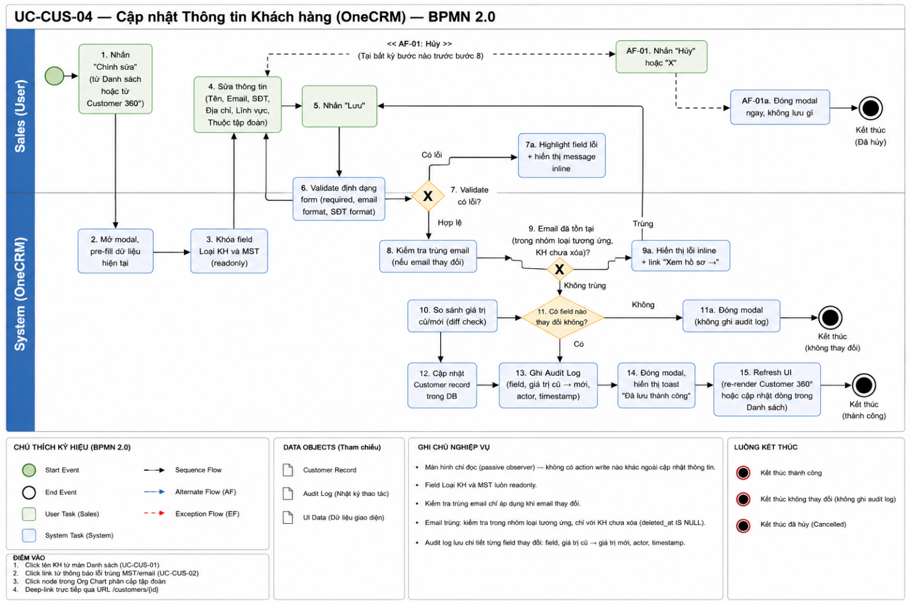

*▲ Sơ đồ BPMN — UC-CUS-04: Cập nhật Khách hàng*

##### 2.1 Luồng chính

| **Bước** | **Actor** | **Hành động / Phản hồi** |
|----|----|----|
| 1 | Sales | Nhấn "✏️ Chỉnh sửa" từ Danh sách (action column) hoặc từ Customer 360° (profile actions). |
| 2 | System | Mở modal "Cập nhật Khách hàng", pre-fill toàn bộ field từ dữ liệu hiện tại của KH. |
| 3 | System | Khóa field Loại KH và MST (readonly, icon 🔒, ghi chú "Không thể thay đổi"). Hiển thị/ẩn các field còn lại theo Loại KH hiện có. |
| 4 | Sales | Sửa thông tin cần thiết (Tên, Email, SĐT, Địa chỉ, Lĩnh vực, Thuộc tập đoàn). |
| 5 | Sales | Chọn hành động: nhấn "💾 Lưu" → tiếp bước 6; hoặc nhấn "Hủy" → AF-02. |
| 6 | System | FE validate định dạng (required Tên, required Email theo loại, format email, format SĐT). |
| 6a | System | \[Validate thất bại\] → EF-01. \[Validate thành công\] → tiếp bước 7. |
| 7 | System | Gọi BE kiểm tra trùng email (nếu email thay đổi, chỉ với KH chưa bị xóa). |
| 7a | System | \[Có trùng\] → EF-02. \[Không trùng\] → tiếp bước 8. |
| 8 | System | So sánh giá trị cũ/mới từng field đã thay đổi (diff check). |
| 8a | System | \[Không có field nào thay đổi\] → đóng modal, không ghi Audit log (BR-06). \[Có thay đổi\] → tiếp bước 9. |
| 9 | System | Cập nhật Customer record. Ghi Audit Log với chi tiết field: "giá trị cũ" → "giá trị mới" cho từng field đã đổi. |
| 10 | System | Đóng modal, hiển thị toast "Đã lưu — Hồ sơ \[Tên KH\] cập nhật". Refresh UI (re-render Customer 360° hoặc cập nhật dòng trong Danh sách, tùy entry point). |

##### 2.2 Luồng phụ

**AF-01: Sales mở form Sửa từ Customer 360°**

*Kích hoạt tại bước 1 khi entry point là profile actions trên màn 360°.*

| **Bước** | **Actor** | **Hành động / Phản hồi** |
|----|----|----|
| 1a-1 | Sales | Tại màn Customer 360°, nhấn "✏️ Chỉnh sửa". |
| → | — | Luồng tiếp tục như chính, riêng bước 10: re-render lại Customer 360° (không điều hướng đi đâu khác) thay vì refresh Danh sách. |

**AF-02: Sales hủy**

*Kích hoạt tại bước 5 khi Sales nhấn "Hủy" hoặc nút "X", trước khi hệ thống lưu thay đổi.*

| **Bước** | **Actor** | **Hành động / Phản hồi** |
|----|----|----|
| 5b-1 | Sales | Nhấn "Hủy" hoặc icon "X" đóng modal. |
| 5b-2 | System | Đóng modal ngay, không hiển thị dialog xác nhận (rủi ro mất dữ liệu thấp hơn UC-CUS-02 vì đây là sửa, không phải tạo mới). |
| → | — | Không có thay đổi nào được lưu. |

##### 2.3 Luồng ngoại lệ

**EF-01: Validation thất bại**

*Kích hoạt tại bước 6 khi field bắt buộc bị xóa trắng hoặc sai định dạng.*

| **Bước** | **Actor** | **Hành động / Phản hồi** |
|----|----|----|
| 6-EF01 | System | Highlight viền đỏ từng field lỗi, hiển thị message lỗi inline bên dưới field. Không cập nhật record. Form giữ nguyên toàn bộ dữ liệu đã sửa. |
| → | — | Sales chỉnh sửa → quay lại bước 5. |

**EF-02: Trùng email**

*Kích hoạt tại bước 7 khi BE trả về lỗi trùng email trong cùng nhóm loại KH (KH chưa bị xóa).*

| **Bước** | **Actor** | **Hành động / Phản hồi** |
|----|----|----|
| 7-EF02 | System | Hiển thị toast lỗi: "Email này đã được sử dụng. \[Xem hồ sơ →\]" Không cập nhật record. Form giữ nguyên toàn bộ dữ liệu đã sửa. |
| → | — | Sales nhấn link trong toast để xem hồ sơ trùng (mở tab mới) hoặc đóng toast, sửa lại email → quay lại bước 5. |

######################################### 3. Mô tả giao diện

##### 3.1 Wireframe

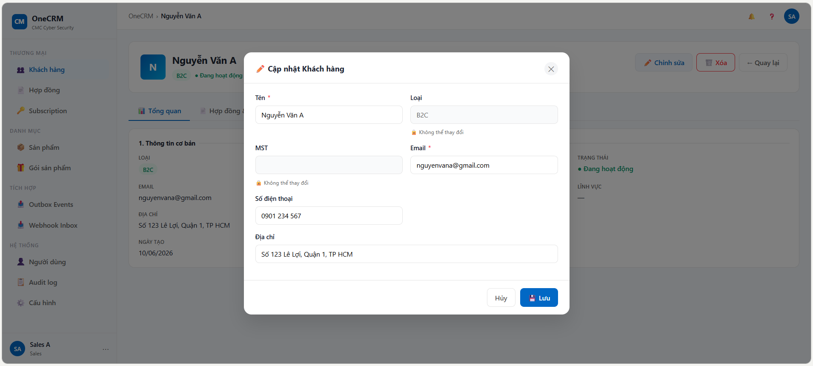

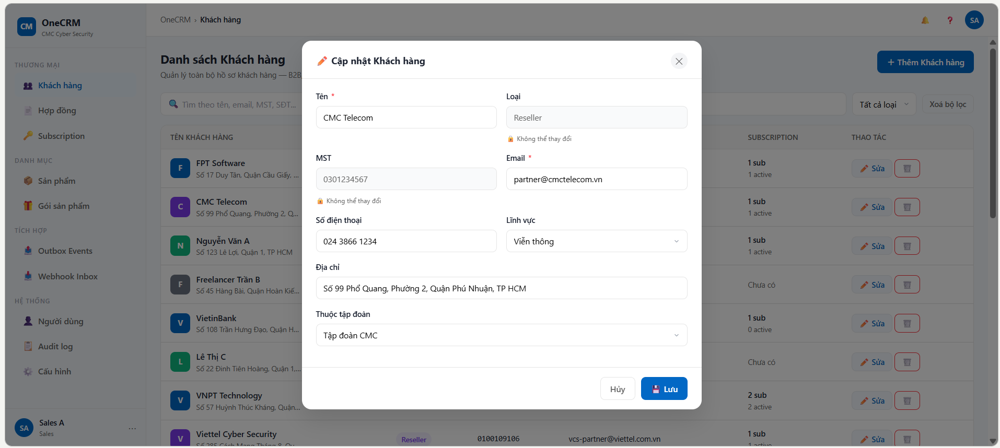

##### 3.2 Các thành phần giao diện

| **\#** | **Thành phần** | **Loại** | **Mô tả** |
|----|----|----|----|
| 1 | Field Loại KH | Input (readonly) | Hiển thị giá trị hiện tại, không cho sửa. Nền xám nhạt, cursor not-allowed. Ghi chú nhỏ bên dưới: "🔒 Không thể thay đổi". |
| 2 | Field MST | Input (readonly) | Tương tự Loại KH. Chỉ hiển thị nếu KH là B2B/Reseller. Ẩn hoàn toàn nếu KH là B2C/Other. |
| 3 | Form nhập liệu (phần editable) | Form | Pre-fill toàn bộ giá trị hiện tại khi mở modal. Hiển thị động field theo Loại KH hiện có, không có selector đổi loại. FE validate khi nhấn "Lưu", không validate realtime. |
| 4 | Nút "💾 Lưu" | Button (Primary) | Logic click: FE validate → gọi BE kiểm tra trùng email → so sánh diff → cập nhật + audit log (bước 6→9). Trạng thái loading/disable sau khi click, tránh submit nhiều lần. |
| 5 | Nút "Hủy" | Button (Ghost) | Đóng modal, không lưu thay đổi (AF-02). |
| 6 | Nút "X" (đóng) | Icon Button | Hành vi giống nút Hủy. |
| 7 | Thông báo lỗi inline | Validation message | Hiển thị bên dưới field lỗi khi FE validate thất bại (EF-01). Field lỗi: viền đỏ. |
| 8 | Toast lỗi BE | Toast (Error) | Hiển thị khi BE trả về lỗi trùng email (EF-02). Nội dung kèm link "\[Xem hồ sơ →\]" mở tab mới. Form giữ nguyên dữ liệu sau khi toast xuất hiện. |

##### 3.3 Các field trong form theo Loại KH (hiện có, không đổi được)

| **\#** | **Field** | **Trạng thái** | **Hiển thị với loại** | **Mô tả & Validation** |
|----|----|----|----|----|
| 1 | Loại KH | 🔒 Readonly | Tất cả | Hiển thị giá trị hiện tại. Không cho sửa qua UC này (BR-01). |
| 2 | Tên | ✓ Editable, bắt buộc | Tất cả | Label theo loại giống UC-CUS-02 (Tên doanh nghiệp / Họ và tên / Tên liên hệ). Max 255 ký tự. |
| 3 | Mã số thuế (MST) | 🔒 Readonly | B2B, Reseller | Không cho sửa qua UC này (BR-01). Ẩn hoàn toàn nếu KH là B2C/Other. |
| 4 | Email | ✓ Editable, bắt buộc trừ Other | Tất cả | Định dạng email hợp lệ. Unique theo nhóm — kiểm tra lại nếu giá trị thay đổi (BR-02). Validation: bắt buộc (trừ Other), sai định dạng, đã tồn tại (EF-02). |
| 5 | Số điện thoại | ✓ Editable, tùy chọn | Tất cả | Cùng quy tắc định dạng với UC-CUS-02 mục 3.3 (SĐT VN 10 số hoặc quốc tế +). |
| 6 | Lĩnh vực kinh doanh | ✓ Editable, tùy chọn | B2B, Reseller | Dropdown — cùng seed data với UC-CUS-02 mục 3.4. Ẩn với B2C, Other. |
| 7 | Thuộc tập đoàn | ✓ Editable, tùy chọn | B2B, Reseller, Other | Dropdown tìm kiếm. Loại trừ chính KH đang sửa khỏi danh sách lựa chọn (BR-04). Ẩn với B2C. |
| 8 | Địa chỉ | ✓ Editable, tùy chọn | Tất cả | Max 500 ký tự. |

######################################### 4. Acceptance Criteria

##### Nhóm 1: Cập nhật thành công

| **AC ID** | **Given** | **When** | **Then** |
|----|----|----|----|
| AC-CUS-04-01 | KH "FPT Software" (B2B), Sales mở form Sửa | Sửa Email và SĐT, nhấn Lưu | Cập nhật thành công. Audit log ghi nhận field email và phone (giá trị cũ → mới). Toast "Đã lưu". |
| AC-CUS-04-02 | KH "Nguyễn Văn A" (B2C) | Sales mở form Sửa | Field MST và Lĩnh vực kinh doanh không hiển thị (đúng rule ẩn theo loại B2C). |
| AC-CUS-04-03 | KH đang sửa có parentId = null | Sales mở dropdown "Thuộc tập đoàn" | Dropdown hiển thị options gồm "-- Không có --" + danh sách B2B/Reseller chưa xóa, không bao gồm chính KH đang sửa. |

##### Nhóm 2: Field bất biến (immutable)

| **AC ID** | **Given** | **When** | **Then** |
|----|----|----|----|
| AC-CUS-04-04 | KH "FPT Software" có Loại = B2B, MST = "0101247332" | Sales mở form Sửa | Field Loại KH và MST hiển thị readonly, có icon 🔒 + ghi chú "Không thể thay đổi". Sales không thể focus/nhập vào 2 field này. |
| AC-CUS-04-05 | Sales cố tình gửi request update với type hoặc tax khác giá trị gốc (qua API trực tiếp, bypass UI) | Backend nhận request update | Backend từ chối thay đổi 2 field này dù request có gửi lên — giữ nguyên giá trị gốc trong DB (server-side enforcement bắt buộc). |

##### Nhóm 3: Validation và trùng lặp

| **AC ID** | **Given** | **When** | **Then** |
|----|----|----|----|
| AC-CUS-04-06 | KH B2B đang sửa, Sales xóa trắng field Tên | Nhấn Lưu | Lỗi inline "Tên là bắt buộc". Không cập nhật record. Form giữ nguyên dữ liệu. |
| AC-CUS-04-07 | Email mới "abc@fpt.com" đã tồn tại ở KH B2B khác (đang active) | Sales đổi Email sang giá trị này, nhấn Lưu | Toast lỗi: "Email này đã được sử dụng. \[Xem hồ sơ →\]". Không cập nhật. Form giữ nguyên dữ liệu. |
| AC-CUS-04-08 | KH "Old Corp" đã bị xóa (deleted_at IS NOT NULL), có email "x@old.com" | Sales sửa email KH khác (đang active) thành "x@old.com" | Cập nhật thành công — không kiểm tra trùng với KH đã xóa (đồng bộ BR-02 UC-CUS-04 / BR-03 UC-CUS-02). |
| AC-CUS-04-09 | Sales mở form Sửa, không thay đổi giá trị nào, nhấn Lưu | — | Hệ thống không báo lỗi, đóng modal bình thường, không tạo Audit log entry mới (BR-06). |

##### Nhóm 4: Đồng bộ hiển thị sau khi lưu

| **AC ID** | **Given** | **When** | **Then** |
|----|----|----|----|
| AC-CUS-04-10 | Sales đang xem Customer 360° của "FPT Software", mở form Sửa (AF-01) | Đổi Tên thành "FPT Software JSC", nhấn Lưu | Modal đóng, Customer 360° re-render ngay với tên mới trong Profile Hero — không cần reload trang. |
| AC-CUS-04-11 | Sales đang ở Danh sách, mở form Sửa từ action column | Sửa thông tin, nhấn Lưu | Modal đóng, dòng tương ứng trong table Danh sách cập nhật ngay với dữ liệu mới. |

### 6.1.6. UC-CUS-05 Xóa Khách hàng 

######################################### 1. Thông tin chung chức năng

| **Trường** | **Nội dung** |
|----|----|
| Tên chức năng | Xóa Khách hàng |
| UC ID | UC-CUS-05 |
| Mô tả | Sales xóa một hồ sơ Customer khỏi hệ thống.<br>Chỉ cho phép xóa khách hàng chưa phát sinh hợp đồng. |
| Tác nhân | Sales |
| Tiền điều kiện | Sales đã đăng nhập, có quyền customer:delete.<br>Customer record tồn tại. |
| Hậu điều kiện | (Success) Customer record bị xóa khỏi hệ thống<br>Audit log ghi nhận actor, timestamp, thông tin KH đã xóa.<br>(Failure) Không có record nào bị xóa. |
| Ngoại lệ | Khách hàng đã có ít nhất 1 hợp đồng (bất kể trạng thái) → BE reject |
| Quy tắc nghiệp vụ | BR-01: Chỉ cho phép xóa Customer khi contracts.length = 0 (không phân biệt status — kể cả hợp đồng đã EXPIRED cũng tính là "đã phát sinh dữ liệu" và chặn xóa).BR-02: Hệ thống thực hiện soft delete (đánh dấu deleted_at), không xóa vật lý khỏi.BR-03: Action xóa (icon/button) bị disable ở UI ngay khi danh sách/Customer 360° render, không đợi Sales click rồi mới báo lỗi từ BE — tránh trải nghiệm "click rồi mới biết không được".BR-04: Audit log bắt buộc — ghi lại snapshot thông tin KH (tên, loại, MST, email) tại thời điểm xóa, đảm bảo có thể tra cứu lại trong trường hợp cần đối soát nội bộ, dù KH không còn hiển thị trên UI. Nếu không ghi được log thì rollback, không xóa KH. |

######################################### 2. Luồng nghiệp vụ

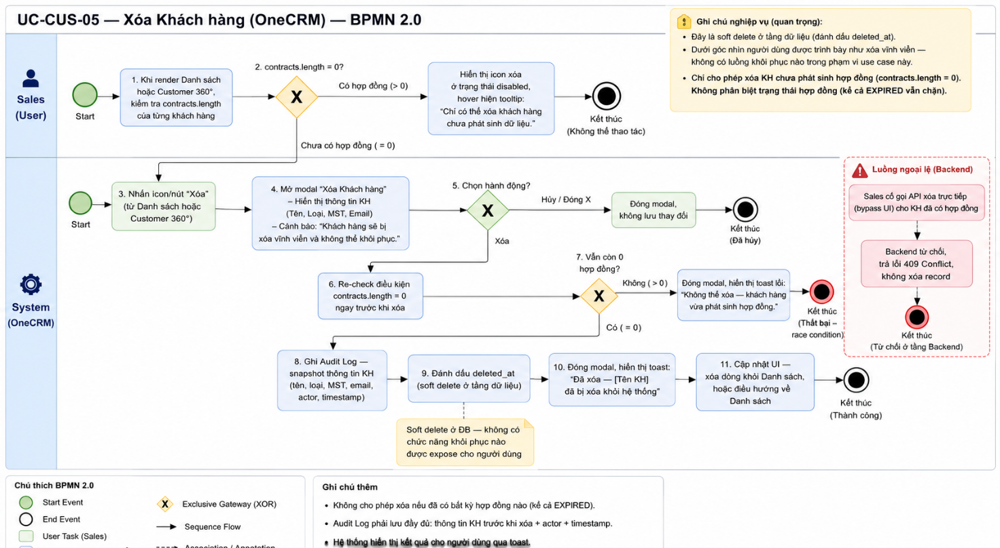

##### 2.1 Luồng chính

| **Bước** | **Actor** | **Hành động / Phản hồi** |
|----|----|----|
| 1 | System | Tại Danh sách (action column) hoặc Customer 360° (profile actions), kiểm tra contracts.length của từng KH để quyết định trạng thái nút/icon xóa (active hay disabled). |
| 2 | Sales | Nhấn icon "🗑️" (Danh sách) hoặc nút "🗑️ Xóa" (Customer 360°) — chỉ khả dụng khi KH chưa có hợp đồng. |
| 3 | System | Mở modal "Xóa Khách hàng". Hiển thị: câu hỏi xác nhận, thông tin KH (Tên khách hàng, Loại, MST nếu có, Email nếu có), cảnh báo. |
| 4 | Sales | Chọn hành động: nhấn "Xóa" → tiếp bước 5; hoặc nhấn "Hủy"/"X" → AF-01. |
| 5 | System | Re-check điều kiện contracts.length = 0 ngay trước khi xóa (phòng race condition — ví dụ HĐ vừa được tạo ở tab khác trong lúc modal đang mở). |
| 5a | System | \[Vẫn còn 0 hợp đồng\] → tiếp bước 6. \[Đã phát sinh hợp đồng giữa lúc modal mở\] → EF-01. |
| 6 | System | Ghi Audit Log snapshot thông tin KH (tên, loại, MST, email, actor, timestamp). |
| 7 | System | Đánh dấu Customer record là đã xóa (deleted_at) ở tầng dữ liệu. Dưới góc nhìn người dùng, record này không còn tồn tại — không hiển thị, không tìm kiếm được, không có cách khôi phục qua UI. |
| 8 | System | Đóng modal, hiển thị toast "Đã xóa — \[Tên KH\] đã bị xóa khỏi hệ thống". Cập nhật UI: xóa dòng khỏi Danh sách, hoặc nếu đang ở Customer 360° → điều hướng về Danh sách. |

##### 2.2 Luồng phụ

**AF-01: Sales hủy**

*Kích hoạt tại bước 4 khi Sales nhấn "Hủy" hoặc nút "X".*

| **Bước** | **Actor** | **Hành động / Phản hồi** |
|----|----|----|
| 4b-1 | Sales | Nhấn "Hủy" hoặc icon "X" đóng modal. |
| 4b-2 | System | Đóng modal ngay, không hiển thị dialog xác nhận bổ sung (modal hiện tại đã là bước xác nhận). |
| → | — | Không có thay đổi nào được lưu. |

##### 2.3 Luồng ngoại lệ

**EF-01: Race condition — phát sinh hợp đồng giữa lúc modal đang mở**

*Kích hoạt tại bước 5 khi BE re-check phát hiện contracts.length \> 0.*

| **Bước** | **Actor** | **Hành động / Phản hồi** |
|----|----|----|
| 5-EF01 | System | Đóng modal, hiển thị toast lỗi: "Không thể xóa — khách hàng vừa phát sinh hợp đồng." Không xóa record. |
| → | — | Sales refresh lại Danh sách để thấy trạng thái icon xóa đã chuyển sang disabled. |

**EF-02: Sales cố gọi API xóa trực tiếp (bypass UI) cho KH đã có hợp đồng**

| **Bước** | **Actor** | **Hành động / Phản hồi** |
|----|----|----|
| EF02-1 | System | Backend từ chối request, trả lỗi 409 Conflict kèm message "Khách hàng đã có hợp đồng, không thể xóa." Không xóa record. (Server-side enforcement bắt buộc — không chỉ dựa vào UI disable, đồng bộ nguyên tắc với UC-CUS-04 AC-04-05.) |

######################################### 3. Mô tả giao diện

##### 3.1 Wireframe

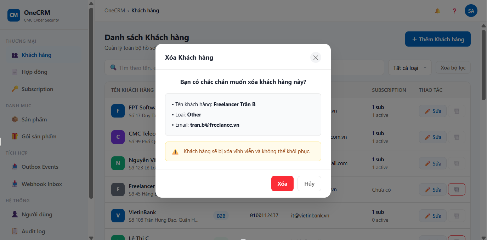

##### 3.2 Các thành phần giao diện

| **\#** | **Thành phần** | **Loại** | **Mô tả** |
|----|----|----|----|
| 1 | Icon/Nút xóa (trạng thái active) | Icon Button | Hiển thị khi KH chưa có hợp đồng nào. Click → mở modal xác nhận (bước 3). |
| 2 | Icon/Nút xóa (trạng thái disabled) | Icon Button (disabled) | Hiển thị khi KH đã có ≥1 hợp đồng. Opacity 0.5, cursor: not-allowed, không phản hồi click. Hover hiện tooltip native: "Chỉ có thể xóa khách hàng chưa phát sinh dữ liệu." |
| 3 | Câu hỏi xác nhận | Text (heading) | "Bạn có chắc chắn muốn xóa khách hàng này?" — căn giữa, in đậm, đặt ngay đầu modal body. |
| 4 | Khối thông tin KH | Info box | Nền xám nhạt, liệt kê Tên khách hàng / Loại / MST (nếu có) / Email (nếu có) dạng bullet, mỗi dòng 1 field. Field trống (null) không hiển thị dòng tương ứng. |
| 5 | Cảnh báo | Alert (warning) | Icon ⚠️ căn giữa theo chiều dọc với text "Khách hàng sẽ bị xóa vĩnh viễn và không thể khôi phục." Nền vàng nhạt, đúng style .alert-warn hệ thống. |
| 6 | Nút "Xóa" | Button (Danger/Primary) | Màu đỏ, đặt bên trái trong footer. Click → thực hiện xóa (bước 5→8). |
| 7 | Nút "Hủy" | Button (Ghost) | Đặt bên phải nút "Xóa" trong footer. Đóng modal, không lưu (AF-01). |
| 8 | Nút "X" (đóng) | Icon Button | Hành vi giống nút "Hủy". |
| 9 | Toast thành công | Toast (Success) | "Đã xóa — \[Tên KH\] đã bị xóa khỏi hệ thống." Hiển thị sau bước 8. |
| 10 | Toast lỗi (race condition) | Toast (Error) | "Không thể xóa — khách hàng vừa phát sinh hợp đồng." Hiển thị khi EF-01 xảy ra. |

##### 3.3 Điều kiện hiển thị trạng thái Action Xóa

| **\#** | **Điều kiện** | **Trạng thái Icon/Nút** | **Tooltip khi hover** |
|----|----|----|----|
| 1 | contracts.length = 0 | Active — màu đỏ, click được | Không có tooltip (hành động hợp lệ) |
| 2 | contracts.length ≥ 1 (bất kỳ status nào, kể cả EXPIRED) | Disabled — opacity 0.5, cursor not-allowed | "Chỉ có thể xóa khách hàng chưa phát sinh dữ liệu." |

Áp dụng đồng nhất ở 2 vị trí: action column trong bảng Danh sách, và nút trong Profile Hero của Customer 360° (UC-CUS-03).

######################################### 4. Acceptance Criteria

##### Nhóm 1: Xóa thành công

| **AC ID** | **Given** | **When** | **Then** |
|----|----|----|----|
| AC-CUS-05-01 | KH "Lê Thị C" (B2C), chưa có hợp đồng nào | Sales nhấn icon xóa, xác nhận trong modal | Modal mở bình thường, click "Xóa" → record bị xóa vĩnh viễn khỏi hệ thống. Toast "Đã xóa" hiển thị. Audit log ghi snapshot thông tin KH. |
| AC-CUS-05-02 | Sales đang xóa KH "Lê Thị C" từ Danh sách | Xóa thành công | Dòng tương ứng biến mất khỏi bảng Danh sách ngay, không cần reload trang. |
| AC-CUS-05-03 | Sales đang xem Customer 360° của KH chưa có hợp đồng, xóa từ Profile Hero | Xóa thành công | Modal đóng, hệ thống tự điều hướng về Danh sách (vì hồ sơ vừa xem không còn tồn tại). |

##### Nhóm 2: Chặn xóa khi đã có hợp đồng

| **AC ID** | **Given** | **When** | **Then** |
|----|----|----|----|
| AC-CUS-05-04 | KH "FPT Software" có 1 hợp đồng status = ACTIVE | Sales xem Danh sách | Icon xóa hiển thị disabled (opacity 0.5), không click được. |
| AC-CUS-05-05 | KH có 1 hợp đồng status = EXPIRED, không còn hợp đồng nào khác đang hiệu lực | Sales xem Danh sách | Icon xóa vẫn disabled — hợp đồng EXPIRED vẫn tính là "đã phát sinh dữ liệu" theo BR-01, không được phép xóa. |
| AC-CUS-05-06 | KH "FPT Software" có hợp đồng | Sales hover vào icon xóa đang disabled | Tooltip hiển thị: "Chỉ có thể xóa khách hàng chưa phát sinh dữ liệu." |
| AC-CUS-05-07 | Sales cố gọi API xóa trực tiếp (bypass UI) cho KH đã có hợp đồng | Backend nhận request | Backend từ chối, trả lỗi 409, không xóa record (EF-02). |

##### Nhóm 3: Hủy thao tác

| **AC ID** | **Given** | **When** | **Then** |
|----|----|----|----|
| AC-CUS-05-08 | Modal "Xóa Khách hàng" đang mở cho KH chưa có hợp đồng | Sales nhấn "Hủy" hoặc icon "X" | Modal đóng ngay, không có dialog xác nhận thêm. Record không bị xóa. |

##### Nhóm 4: Race condition

| **AC ID** | **Given** | **When** | **Then** |
|----|----|----|----|
| AC-CUS-05-09 | Sales mở modal xóa cho KH chưa có hợp đồng; trong lúc modal đang mở, ở tab khác một Sales khác vừa tạo hợp đồng cho cùng KH này | Sales nhấn "Xóa" | BE re-check phát hiện contracts.length \> 0, từ chối xóa. Toast lỗi "Không thể xóa — khách hàng vừa phát sinh hợp đồng." Modal đóng, record không bị xóa (EF-01). |

## M-02 Contract Management

### 6.2.1. Mô tả nghiệp vụ

Hợp đồng lightweight — định danh deal (mã HĐ Sales nhập tay khớp HĐ giấy) + group nhiều sub vào 1 deal. Phase 1 không có lifecycle/milestone. Attachment polymorphic cho file HĐ giấy (PDF/DOCX/...).

Hai loại hợp đồng (Contract.type):

- **DIRECT** — KH ký và tự dùng; sub thừa hưởng customer của HĐ.

- **RESELLER** — HĐ khung của đại lý: đại lý ký một HĐ nhiều license nhưng không tự dùng, mà cấp dần cho các đơn vị thụ hưởng độc lập (mỗi đơn vị 1 tenant/license riêng). HĐ RESELLER mang pool license (pool_total), rút dần khi cấp cho từng đơn vị. Đại lý là đầu mối thương mại (renewal/đối soát); đơn vị thụ hưởng chỉ để cấp phát + visibility.

Phân loại theo loại HĐ, không gắn cờ lên Customer — một pháp nhân có thể vừa ký HĐ DIRECT (mua dùng) vừa ký HĐ RESELLER (bán lại).

### 6.2.2. UC-CON-01 Danh sách Hợp đồng

#### 1. Thông tin chung chức năng

| **Trường** | **Nội dung** |
|----|----|
| Tên chức năng | Danh sách Hợp đồng |
| UC ID | UC-CON-01 |
| Mô tả | Sales xem, tìm kiếm, lọc và sort toàn bộ hợp đồng trong hệ thống. Màn hình là điểm vào trung tâm của module Contract — điều hướng sang chi tiết hoặc khởi động các action Tạo / Sửa / Xóa. |
| Tác nhân | Sales, Manager |
| Tiền điều kiện | Actor đã đăng nhập và có quyền contract:view. |
| Hậu điều kiện | Không có thay đổi dữ liệu. Màn hình chỉ đọc và điều hướng. Danh sách hiển thị mặc định theo contract.createdAt giảm dần (mới nhất trên cùng). |
| Điểm vào | \(a\) Click menu "Hợp đồng" trên sidebar. |
| Quy tắc nghiệp vụ | **BR-01:** Hợp đồng có 2 loại hiển thị trên danh sách: DIRECT (badge xanh dương) và RESELLER (badge tím).<br>**BR-02:** Hợp đồng chỉ có thể xóa khi chưa có Subscription nào. Nút 🗑️ disabled nếu subs.length \> 0, kể cả với Manager. |

#### 2. Luồng nghiệp vụ

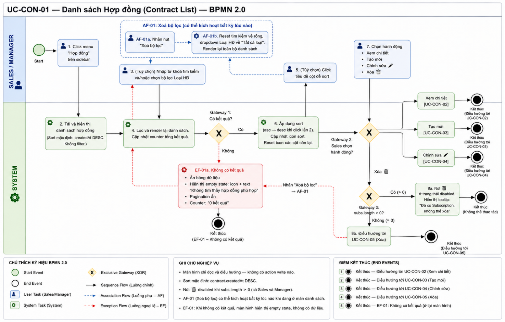

*▲ Sơ đồ BPMN — UC-CON-01: Danh sách Hợp đồng*

##### 2.1 Luồng chính

| **Bước** | **Actor** | **Hành động / Phản hồi** |
|----|----|----|
| 1 | Sales/Manager | Click menu "Hợp đồng" trên sidebar. |
| 2 | System | Tải và hiển thị danh sách hợp đồng. Sort mặc định: contract.createdAt giảm dần. Không filter. |
| 3 | Sales/Manager | (Tuỳ chọn) Nhập từ khoá vào ô tìm kiếm và/hoặc chọn bộ lọc Loại HĐ. |
| 4 | System | Lọc và render lại danh sách theo tiêu chí. Cập nhật counter tổng kết quả. \[Không có kết quả\] → EF-01. |
| 5 | Sales/Manager | (Tuỳ chọn) Click vào tiêu đề cột để sort. |
| 6 | System | Áp dụng sort theo cột được chọn (asc → desc khi click lần 2). Cập nhật icon sort trên header, reset icon các cột còn lại về ↕. |
| 7 | Sales/Manager | Chọn hành động tiếp theo:<br>\[Xem chi tiết\] → Click vào row → UC-CON-02.\[Tạo mới\] → Click "＋ Thêm Hợp đồng" → UC-CON-03.\[Chỉnh sửa ✏️\] → Click icon ✏️ trên row → UC-CON-04.\[Xóa 🗑️\] → Click icon 🗑️ → bước 8. |
| 8 | System | Kiểm tra điều kiện xóa: \[subs.length \> 0\] → Nút 🗑️ disabled, tooltip "Đã có Subscription, không thể xóa". \[subs.length = 0\] → Điều hướng UC-CON-05. |

##### 2.2 Luồng phụ

**AF-01: Xoá bộ lọc**

*Kích hoạt bất kỳ lúc nào Sales nhấn nút "Xoá bộ lọc".*

| **Bước** | **Actor** | **Hành động / Phản hồi** |
|----|----|----|
| 1a | Sales/Manager | Nhấn "Xoá bộ lọc". |
| 2a | System | Reset ô tìm kiếm về rỗng, dropdown Loại HĐ về "Tất cả loại". Render lại toàn bộ danh sách. |
| → | — | Tiếp tục từ bước 2. |

##### 2.3 Luồng ngoại lệ

**EF-01: Không có kết quả**

*Kích hoạt tại bước 4 khi không có hợp đồng nào match tiêu chí lọc.*

| **Bước** | **Actor** | **Hành động / Phản hồi** |
|----|----|----|
| 4-EF01 | System | Ẩn bảng dữ liệu. Hiển thị empty state: icon + text "Không tìm thấy hợp đồng phù hợp". Pagination ẩn. Counter "0 kết quả". |
| → | — | Sales/Manager chỉnh lại tiêu chí → quay lại bước 3. Hoặc nhấn "Xoá bộ lọc" → AF-01. |

#### 3. Mô tả giao diện

##### 3.1 Wireframe

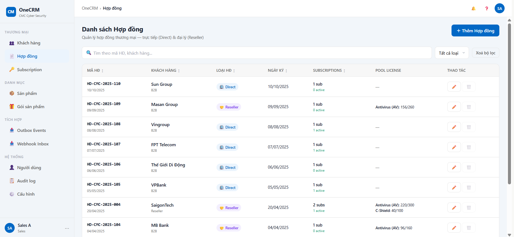

##### 3.2 Các thành phần giao diện

| **\#** | **Thành phần** | **Loại** | **Mô tả** |
|----|----|----|----|
| 1 | Ô tìm kiếm | Search input | Tìm theo mã HĐ, tên khách hàng, mô tả. Filter realtime khi nhập, không cần nhấn Enter. Placeholder: "Tìm theo mã HĐ, khách hàng...". |
| 2 | Dropdown "Loại HĐ" | Filter select | Lọc theo loại: Tất cả loại (mặc định) / DIRECT / RESELLER. |
| 3 | Nút "Xoá bộ lọc" | Button (Ghost) | Reset toàn bộ search và filter về mặc định. Luôn hiển thị. |
| 4 | Nút "＋ Thêm Hợp đồng" | Button (Primary) | Điều hướng sang UC-CON-03 (Tạo Hợp đồng). Hiển thị với cả Sales và Manager. |
| 5 | Bảng danh sách | Table | Hiển thị danh sách hợp đồng theo bộ lọc đang áp dụng. Click vào row bất kỳ → UC-CON-02 (Chi tiết). |
| 6 | Header cột sort | Column header | Các cột sortable: Mã HĐ, Khách hàng, Loại HĐ, Ngày ký, Subscriptions. Click lần 1 → asc (↑), lần 2 → desc (↓). Click cột khác → reset cột cũ về ↕. |
| 7 | Nút ✏️ (Chỉnh sửa) | Icon Button | Trên mỗi row. Điều hướng sang UC-CON-04. Hiển thị và active với cả Sales lẫn Manager. |
| 8 | Nút 🗑️ (Xóa) | Icon Button | Trên mỗi row. Disabled với tooltip "Đã có Subscription, không thể xóa" khi subs.length \> 0. Active khi subs.length = 0 → điều hướng UC-CON-05. |
| 9 | Empty state | Placeholder | Hiển thị khi không có kết quả. Icon + text gợi ý + nút "Xoá bộ lọc". |
| 10 | Pagination | Pagination bar | Hiển thị "X–Y / N hợp đồng". Nút số trang, trang active được highlight. Mặc định 10 records/trang. |

##### 3.3 Bảng danh sách — Các cột

| **\#** | **Tên cột** | **Nguồn dữ liệu** | **Sortable** | **Mô tả** |
|----|----|----|----|----|
| 1 | Mã HĐ | contract.code | ✅ | Font monospace, bold, navy. Dòng phụ: contract.createdAt format dd/MM/yyyy, font nhỏ, xám. |
| 2 | Khách hàng | contract.customerName | ✅ | Tên KH font medium. Dòng phụ: contract.customerType (B2B/Reseller/B2C/Other), font nhỏ, xám. |
| 3 | Loại HĐ | contract.type | ✅ | Badge: Direct (xanh dương) hoặc Reseller (tím). |
| 4 | Ngày ký | contract.signedDate | ✅ | Format dd/MM/yyyy. Hiển thị "—" nếu null. |
| 5 | Subscriptions | contract.subs | ✅ | Dòng 1: tổng sub (VD: "3 subs"). Dòng 2: số sub ACTIVE màu xanh lá. "—" nếu chưa có sub. |
| 6 | Pool License | contract.poolItems | ❌ | Chỉ render nội dung với RESELLER. Mỗi pool item = 1 dòng: **{packageName} (kèm v{version})**: {allocatedQty}/{poolTotal} — pool ghim theo **gói**, không theo sản phẩm (D5). Với DIRECT: hiển thị "—". |
| 7 | Thao tác | — | ❌ | Nút ✏️ và 🗑️. Quy tắc hiển thị theo BR-02 (xem mục 3.2 — \#7, \#8). |

#### 4. Acceptance Criteria

##### Nhóm 1: Hiển thị danh sách

| **AC ID** | **Given** | **When** | **Then** |
|----|----|----|----|
| AC-CON-01-01 | Hệ thống có 4 hợp đồng (2 DIRECT, 2 RESELLER) | Sales mở màn Danh sách Hợp đồng | Hiển thị đủ 4 hợp đồng. Cột Pool License có dữ liệu với RESELLER, hiển thị "—" với DIRECT. |
| AC-CON-01-02 | Hợp đồng DIRECT có 3 sub (2 ACTIVE, 1 SUSPENDED) | Sales xem cột Subscriptions | Dòng 1: "3 subs". Dòng 2: "2 active" màu xanh lá. |
| AC-CON-01-03 | Hợp đồng RESELLER có 2 pool: EDR 200/500, AV 100/300 | Sales xem cột Pool License | Hiển thị 2 dòng: "EDR/EPP: 200/500" và "Antivirus (AV): 100/300". |
| AC-CON-01-04 | Hợp đồng có signedDate = null | Sales xem cột Ngày ký | Hiển thị "—". |
| AC-CON-01-05 | Hợp đồng chưa có sub nào | Sales xem cột Subscriptions | Hiển thị "—" (không hiển thị "0 subs"). |

##### Nhóm 2: Tìm kiếm và lọc

| **AC ID** | **Given** | **When** | **Then** |
|----|----|----|----|
| AC-CON-01-06 | Có hợp đồng với code "HD-CMC-2025-001" | Sales nhập "CMC-2025" vào ô tìm kiếm | Chỉ hiện các hợp đồng match. Counter và pagination cập nhật. |
| AC-CON-01-07 | Có hợp đồng DIRECT và RESELLER | Sales chọn filter "RESELLER" | Chỉ hiện hợp đồng RESELLER. DIRECT không hiển thị. |
| AC-CON-01-08 | Đang có filter "RESELLER" + search "HD-2025" | Sales nhấn "Xoá bộ lọc" | Ô search về rỗng, dropdown về "Tất cả loại". Hiển thị toàn bộ hợp đồng. |
| AC-CON-01-09 | Không có hợp đồng nào match | Sales nhập từ khoá không khớp | Bảng ẩn. Hiển thị empty state. Counter "0 kết quả". Pagination ẩn. |

##### Nhóm 3: Sort

| **AC ID** | **Given** | **When** | **Then** |
|----|----|----|----|
| AC-CON-01-10 | Danh sách nhiều hợp đồng, chưa sort | Sales click header "Mã HĐ" lần 1 | Sort asc (A→Z). Icon ↑ trên header "Mã HĐ". Các cột khác reset về ↕. |
| AC-CON-01-11 | Đang sort "Mã HĐ" asc | Sales click header "Mã HĐ" lần 2 | Sort desc (Z→A). Icon ↓ trên header. |
| AC-CON-01-12 | Đang sort "Mã HĐ" | Sales click header "Subscriptions" | Sort theo tổng số sub. Icon ↑ trên "Subscriptions". Icon "Mã HĐ" reset về ↕. |
| AC-CON-01-13 | Danh sách nhiều hợp đồng | Sales click header "Ngày ký" | Sort asc theo ngày (cũ nhất trên). HĐ có signedDate = null xuống cuối. |

##### Nhóm 4: Điều hướng

| **AC ID** | **Given** | **When** | **Then** |
|----|----|----|----|
| AC-CON-01-14 | Sales đang xem danh sách | Sales click vào row hợp đồng "HD-CMC-2025-001" | Điều hướng sang UC-CON-02, hiển thị chi tiết hợp đồng đó. |
| AC-CON-01-15 | Sales đang xem danh sách | Sales click icon ✏️ trên row | Điều hướng sang UC-CON-04 (Chỉnh sửa). |
| AC-CON-01-16 | HĐ chưa có sub | Sales/Manager click icon 🗑️ trên row | Điều hướng sang UC-CON-05 (Xóa). |
| AC-CON-01-17 | Sales đang xem danh sách | Sales click "＋ Thêm Hợp đồng" | Điều hướng sang UC-CON-03 (Tạo mới). |

##### Nhóm 5: Trạng thái nút Xóa

| **AC ID** | **Given** | **When** | **Then** |
|----|----|----|----|
| AC-CON-01-18 | HĐ có subs.length \> 0 | Sales/Manager xem row | Nút 🗑️ disabled. Tooltip: "Đã có Subscription, không thể xóa". |
| AC-CON-01-19 | HĐ có subs.length = 0 | Sales/Manager xem row | Nút 🗑️ active (không disabled, không tooltip). |
| AC-CON-01-20 | 1 HĐ có sub, 1 HĐ không có sub | Sales xem danh sách | HĐ có sub: 🗑️ disabled. HĐ không có sub: 🗑️ active. Hai trạng thái cùng tồn tại trên cùng màn hình. |

### 6.2.3. UC-CON-02 Thêm mới Hợp đồng

######################################### 1. Thông tin chung chức năng

| **Thuộc tính** | **Nội dung** |
|----|----|
| Tên chức năng | Thêm mới Hợp đồng |
| UC ID | UC-CON-02 |
| Mô tả | Sales tạo hồ sơ hợp đồng mới cho một khách hàng đã tồn tại trong hệ thống.<br>Hợp đồng có 2 loại: DIRECT (khách hàng sử dụng trực tiếp) và RESELLER (đại lý phân phối lại cho nhiều khách hàng cuối).<br>Khi chọn RESELLER, form hiển thị thêm section "Phân bổ số lượng bản quyền theo sản phẩm" (License Pool).<br>Sales có thể đính kèm file hợp đồng giấy ngay tại bước tạo. |
| Tác nhân | Sales |
| Tiền điều kiện | Sales đã đăng nhập và có quyền contract:create.<br>Đã có ít nhất 1 Customer record chưa bị xóa trong hệ thống. |
| Hậu điều kiện | (Success) Contract record mới được tạo với subs = \[\] và poolItems theo khai báo.<br>Audit log ghi nhận actor, timestamp, mã HĐ, loại, khách hàng.File đính kèm hợp lệ (nếu có) được lưu vào S3/MinIO và liên kết với contract.<br>(Failure) Không có record nào được tạo. Modal giữ nguyên toàn bộ dữ liệu đã nhập. |
| Trigger | Click "+ Thêm Hợp đồng" trên màn hình Danh sách Hợp đồng (UC-CON-01). |
| Quy tắc nghiệp vụ | BR-01: Mã hợp đồng (contract.code) do Sales nhập tay, unique toàn hệ thống — không tự sinh. Kiểm tra trùng lặp không phân biệt chữ hoa/thường. VD: HD-CMC-2025-001 và hd-cmc-2025-001 được coi là trùng nhau.BR-02: Loại hợp đồng (contract.type) là không thể thay đổi sau khi tạo.BR-03: Hợp đồng RESELLER bắt buộc khai báo ít nhất 1 License Pool khi tạo. Mỗi pool item gồm: Gói sản phẩm + Tổng số license (Total). Không thể thay đổi pool_total là immutable sau khi tạoBR-04: Dropdown Khách hàng chỉ hiển thị KH chưa bị xóa (deletedAt IS NULL).BR-05: Audit log bắt buộc — nếu không ghi được thì rollback, không tạo hợp đồng.BR-06: File đính kèm: định dạng PDF/DOCX/XLSX/JPG/PNG, tối đa 10MB/file, tối đa 15 file/HĐ. |

######################################### Luồng nghiệp vụ

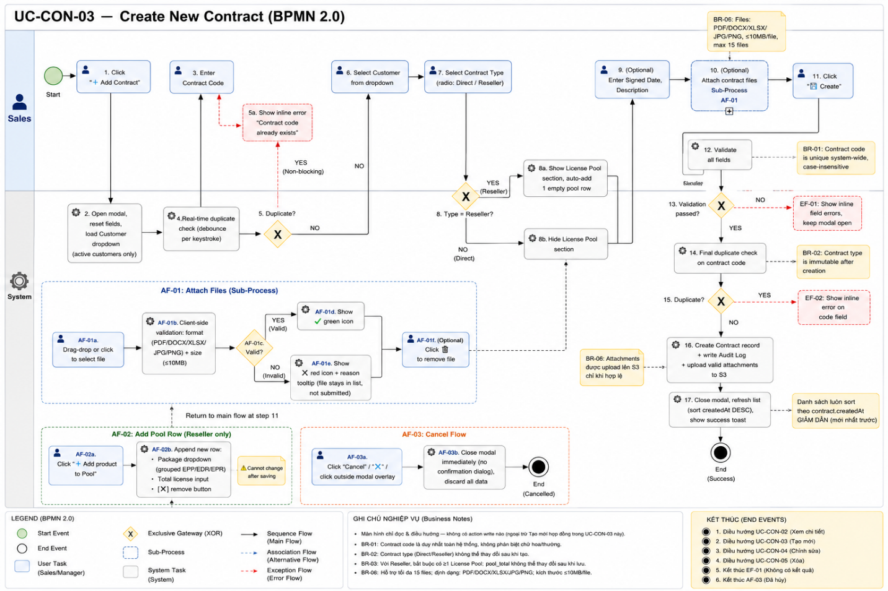

##### 2.1 Luồng chính

| **Bước** | **Actor** | **Hành động / Phản hồi** |
|----|----|----|
| 1 | Sales | Nhấn "+ Thêm Hợp đồng" trên màn Danh sách. |
| 2 | System | Mở modal "Thêm Hợp đồng mới".<br>Reset toàn bộ fields về trạng thái trống.<br>Dữ liệu hiển thị trong dropdown Khách hàng lấy từ danh sách KH chưa bị xóa (BR-04). |
| 3 | Sales | Điền Mã hợp đồng. |
| 4 | System | Validate realtime: kiểm tra trùng mã ngay khi Sales nhập (check sau mỗi keystroke).<br>Nếu trùng → hiển thị lỗi inline "Mã hợp đồng đã tồn tại" nhưng không block tiếp tục nhập. |
| 5 | System | \[Gateway — Type = Reseller?\]<br>→ CÓ (step 8a): Hiển thị section "Phân bổ số lượng bản quyền theo sản phẩm", tự động thêm 1 dòng License Pool rỗng. Chuyển sang AF-02 nếu cần thêm dòng.<br>→ KHÔNG (step 8b): Ẩn section License Pool. Tiếp tục step 9. |
| 6 | Sales | Chọn **Khách hàng** từ dropdown. |
| 7 | Sales | Chọn **Loại hợp đồng** (radio card: Direct / Reseller). |
| 8 | System | \[Gateway — Type = Reseller?\]<br>→ CÓ (step 8a): Hiển thị section "Phân bổ số lượng bản quyền theo sản phẩm", tự động thêm 1 dòng License Pool rỗng. Chuyển sang AF-02 nếu cần thêm dòng.<br>→ KHÔNG (step 8b): Ẩn section License Pool. Tiếp tục step 9. |
| 9 | Sales | (Tuỳ chọn) Nhập **Ngày ký**, **Mô tả**. |
| 10 | Sales | (Tuỳ chọn) Đính kèm file hợp đồng giấy → Sub-process **AF-01**. |
| 11 | Sales | Nhấn **"💾 Tạo"**. |
| 12 | System | Validate toàn bộ form (required fields, format, pool items nếu RESELLER). |
| 13 | System | \[Gateway — Validation passed?\]<br>→ KHÔNG → EF-01: Highlight lỗi inline từng field, giữ nguyên modal và dữ liệu đã nhập. Quay lại step 11.<br>→ CÓ: Tiếp tục step 14. |
| 14 | System | Kiểm tra lần cuối trùng mã hợp đồng (server-side). |
| 15 | System | \[Gateway — Duplicate?\]<br>→ CÓ → EF-02: Hiển thị lỗi inline dưới field Mã HĐ. Quay lại step 11.<br>→ KHÔNG: Tiếp tục step 16. |
| 16 | System | Tạo Contract record + ghi Audit Log (BR-05). Upload file đính kèm hợp lệ lên S3/MinIO (nếu có — BR-06). |
| 17 | System | Đóng modal. Hiển thị toast *"Tạo thành công — Hợp đồng {code} đã được tạo"*. Tự động điều hướng sang màn Chi tiết Hợp đồng (UC-CON-02). Danh sách HĐ sort theo createdAt DESC khi quay lại.<br>→ **End (Success)** |

##### 2.2 Luồng phụ

\[AF-01: Đính kèm file hợp đồng\] — kích hoạt tại bước 9.

| **Bước** | **Actor** | **Hành động / Phản hồi** |
|----|----|----|
| AF-01a | Sales | Kéo thả hoặc click chọn file từ máy tính. |
| AF-01b | System | Validate file ngay tại client: kiểm tra định dạng (PDF, DOCX, XLSX, JPG, PNG) và dung lượng (≤ 10MB/file).<br>\[Hợp lệ\] → thêm vào danh sách với icon ✓ màu xanh.<br>\[Không hợp lệ\] → thêm vào danh sách với icon ✕ màu đỏ kèm lý do.<br>File không hợp lệ không được submit lên server. |
| AF-01c | System | **\[Gateway — Valid?\]**<br>→ **CÓ (AF-01d):** Thêm file vào danh sách với icon ✓ xanh, tên file, dung lượng, badge "NEW", ô nhập mô tả, nút 🗑️ bỏ file.<br>→ **KHÔNG (AF-01e):** Hiển thị icon ✕ đỏ + tooltip lý do. File vẫn hiển thị trong danh sách nhưng không được submit lên server. |
| AF-01f | Sales | (Tuỳ chọn) Nhấn 🗑️ để xóa file khỏi danh sách. |
| → | — | Quay lại luồng chính tại step 11. |

\[AF-02: Thêm dòng License Pool\] — kích hoạt khi Sales nhấn "+ Thêm sản phẩm vào Pool" (chỉ với Reseller).

| **Bước** | **Actor** | **Hành động / Phản hồi** |
|----|----|----|
| AF-02a | Sales | Nhấn "+ Thêm sản phẩm vào Pool". |
| AF-02b | System | Append 1 dòng mới vào section License Pool gồm:Dropdown Gói sản phẩm (grouped: EPP / EDR / EPR, bắt buộc)Input Tổng số license / Total (số nguyên \> 0, bắt buộc)Cảnh báo "⚠️ Không thể thay đổi sau khi lưu"Nút \[✕\] xóa dòng. |
| → | — | Quay lại luồng chính tại step 9. |

\[AF-03: Hủy\] — kích hoạt tại bất kỳ bước nào trước bước 16.

| **Bước** | **Actor** | **Hành động / Phản hồi** |
|----|----|----|
| AF-03a | Sales | Nhấn "Hủy", nút "✕" đóng modal, hoặc click ra ngoài overlay. |
| AF-03b | System | Đóng modal ngay, không hiển thị dialog xác nhận. Không tạo record. Dữ liệu đã nhập và file đã chọn bị hủy toàn bộ. |
| → | — | Quay về màn Danh sách Hợp đồng |

##### 2.3 Luồng ngoại lệ

\[EF-01: Validation thất bại\] — kích hoạt tại bước 13.

| **Bước** | **Actor** | **Hành động / Phản hồi** |
|----|----|----|
| EF-01 | System | Highlight viền đỏ từng field lỗi, hiển thị message lỗi inline bên dưới. Modal giữ nguyên toàn bộ dữ liệu đã nhập.<br>\[Nếu RESELLER + pool item thiếu thông tin\] → Toast: *"Thiếu thông tin Pool — Điền đầy đủ Gói sản phẩm và Pool tổng"*. |
| → | — | Sales chỉnh sửa → quay lại bước 11. |

\[EF-02: Trùng mã hợp đồng\] — kích hoạt tại bước 15.

| **Bước** | **Actor** | **Hành động / Phản hồi** |
|----|----|----|
| EF-02 | System | Hiển thị lỗi inline dưới field Mã HĐ: "Mã hợp đồng đã tồn tại". Không tạo record. |
| → | — | Sales sửa lại mã → quay lại bước 11. |

######################################### 3. Mô tả giao diện

##### 3.1 Wireframe

Trạng thái mặc định (chưa chọn loại):

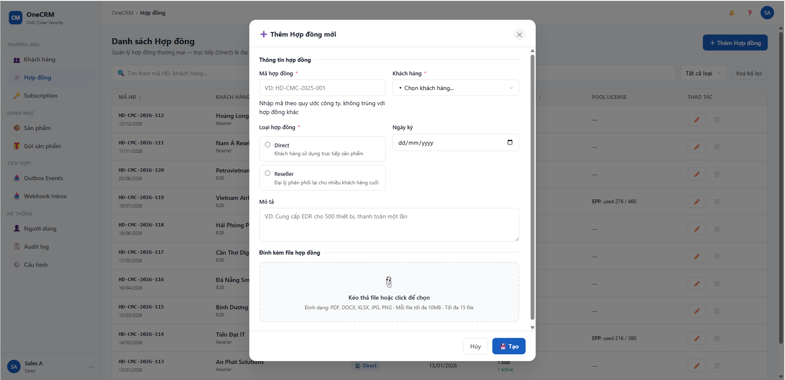

Khi chọn Reseller — section License Pool hiện ra:

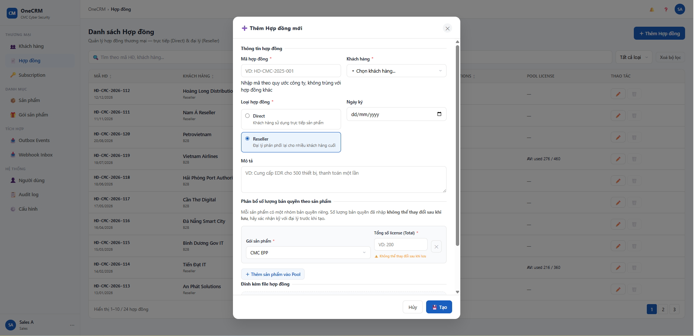

Khi có file đính kèm:

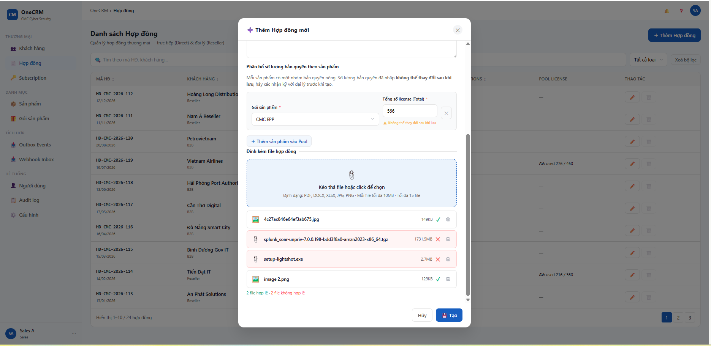

##### 3.2 Các thành phần giao diện

| **\#** | **Thành phần** | **Loại** | **Mô tả** |
|----|----|----|----|
| 1 | Field "Mã hợp đồng" | Text input | Bắt buộc. Placeholder: "VD: HD-CMC-2025-001". Hint: "Nhập mã theo quy ước công ty, không trùng với hợp đồng khác".<br>Validate realtime check trùng sau mỗi keystroke. |
| 2 | Dropdown "Khách hàng" | Select | Bắt buộc. Chỉ hiển thị KH chưa bị xóa (BR-04). Hiển thị tên KH kèm loại, VD: "FPT Software (B2B)". |
| 3 | Radio "Loại hợp đồng" | Radio group | Bắt buộc. 2 lựa chọn dạng card: Direct (Khách hàng sử dụng trực tiếp sản phẩm) và Reseller (Đại lý phân phối lại cho nhiều khách hàng cuối).<br>Chọn Reseller → hiện section License Pool và tự thêm 1 dòng pool rỗng.<br>Chọn Direct → ẩn section License Pool, xóa các dòng pool đã nhập. Immutable sau khi tạo (BR-02). |
| 4 | Field "Ngày ký" | Date picker | Tùy chọn. Format dd/MM/yyyy (hiển thị), yyyy-MM-dd (lưu).<br>Có thể cập nhật sau qua UC-CON-04. |
| 5 | Field "Mô tả" | Textarea | Tùy chọn. 2 rows.<br>Placeholder: "VD: Cung cấp EDR cho 500 thiết bị, thanh toán một lần". |
| 6 | Section "License Pool" | Dynamic section | Chỉ hiển thị khi loại = Reseller.<br>Header: "Phân bổ số lượng bản quyền theo sản phẩm".<br>Mỗi dòng pool gồm: Gói sản phẩm (select, grouped EPP/EDR/EPR, bắt buộc) + Tổng số license/Total (input số nguyên \> 0, format phân cách nghìn, bắt buộc, cảnh báo "⚠️ Không thể thay đổi sau khi lưu") + nút \[✕\] xóa dòng.<br>Nút "+ Thêm sản phẩm vào Pool" để thêm dòng (AF-02). |
| 7 | Dropzone đính kèm | File upload | Tùy chọn. Hỗ trợ kéo thả hoặc click để chọn file. Định dạng: PDF, DOCX, XLSX, JPG, PNG. Giới hạn: ≤ 10MB/file, tối đa 15 file.<br>Danh sách file hiển thị: icon loại file, tên file, dung lượng (KB hoặc MB), icon trạng thái (✓ xanh = hợp lệ / ✕ đỏ = không hợp lệ), nút 🗑️ bỏ file. |
| 8 | Nút "💾 Tạo" | Button (Primary) | Validate toàn bộ form → check trùng mã → tạo record + audit log + upload file hợp lệ (bước 11→13). |
| 9 | Nút "Hủy" | Button (Ghost) | Đóng modal không cần xác nhận.<br>Hủy toàn bộ dữ liệu đã nhập (AF-03). |
| 10 | Nút "✕" đóng modal | Icon Button | Hành vi giống nút Hủy. Click ra ngoài overlay cũng đóng modal. |
| 11 | Lỗi inline field | Validation msg | Hiển thị bên dưới field lỗi khi validate thất bại (EF-01, EF-02). Viền đỏ trên field tương ứng. |

##### 3.3 Các field trong form

| **\#** | **Field** | **Bắt buộc** | **Điều kiện hiển thị** | **Mô tả & Validation** |
|----|----|----|----|----|
| 1 | Mã hợp đồng | ✓ | Tất cả | Text, nhập tay. Unique toàn hệ thống (BR-01). Check trùng realtime. Message: "Mã hợp đồng là bắt buộc" / "Mã hợp đồng đã tồn tại". |
| 2 | Khách hàng | ✓ | Tất cả | Dropdown, chỉ hiện các KH chưa xóa (BR-04). Message: "Vui lòng chọn khách hàng". |
| 3 | Loại hợp đồng | ✓ | Tất cả | Radio Direct / Reseller. Không thể thay đổi sau khi tạo (BR-02). Message: "Vui lòng chọn loại hợp đồng". |
| 4 | Ngày ký | — | Tất cả | Date picker. Không validate range. |
| 5 | Mô tả | — | Tất cả | Textarea. |
| 6 | Gói sản phẩm (pool) | ✓ khi Reseller | Reseller only | Select grouped: EPP / EDR / EPR. Message: "Vui lòng chọn gói sản phẩm". |
| 7 | Tổng số license (Total) | ✓ khi Reseller | Reseller only | Input số nguyên \> 0, format phân cách nghìn. Không thể thay đổi sau khi tạo (BR-03).<br>Cảnh báo: "⚠️ Không thể thay đổi sau khi lưu".<br>Message: "Số lượng phải lớn hơn 0". |
| 8 | File đính kèm | — | Tất cả | Định dạng: PDF, DOCX, XLSX, JPG, PNG (BR-06).<br>Dung lượng ≤ 10MB/file.<br>Tối đa 15 file.<br>Validate client-side. Message lỗi: "Định dạng không hợp lệ (.EXE) — chỉ chấp nhận PDF, DOCX, XLSX, JPG, PNG" / "Vượt giới hạn kích thước — file nặng X.XMB, tối đa 10MB". |

######################################### Acceptance Criteria

##### Nhóm 1: Tạo thành công — Direct

| **AC ID** | **Given** | **When** | **Then** |
|----|----|----|----|
| AC-CON-03-01 | Sales điền Mã HĐ "HD-CMC-2026-001", chọn KH "FPT Software", chọn Direct, Ngày ký 01/07/2026 | Nhấn "Tạo" | Contract record tạo thành công với type = DIRECT, subs = \[\], poolItems = \[\].<br>Audit log ghi nhận.<br>Toast "Tạo thành công — Hợp đồng HD-CMC-2026-001 đã được tạo". |
| AC-CON-03-02 | Sales điền đủ các field bắt buộc, không nhập Ngày ký và Mô tả | Nhấn "Tạo" | Tạo thành công với signedDate = null, description = null. |
| AC-CON-03-03 | Sales tạo thành công | — | Modal đóng. Danh sách hợp đồng refresh. HĐ mới xuất hiện đầu danh sách (sort createdAt DESC). |

##### Nhóm 2: Tạo thành công — Reseller

| **AC ID** | **Given** | **When** | **Then** |
|----|----|----|----|
| AC-CON-03-04 | Sales chọn Reseller, thêm 1 pool: gói "CMC EPP v1", 500 license | Nhấn "Tạo" | Contract tạo thành công với type = RESELLER, poolItems = \[{package_id: PKG-EPP-03, pool_total: 500, allocated_qty: 0}\] — **ghim theo package_id** (D5). |
| AC-CON-03-05 | Sales chọn Reseller, thêm 2 pool: EDR Enterprise 500 + EPR Business 200 | Nhấn "Tạo" | Contract tạo với 2 pool items. Cột Pool License trong Danh sách hiển thị: "EDR: used 0 / 500" và "EPR: used 0 / 200". |
| AC-CON-03-06 | Sales tạo Reseller kèm 1 file PDF hợp lệ | Nhấn "Tạo" | Contract tạo thành công. File được lưu vào S3/MinIO, liên kết với contract. Accordion "Đính kèm" trong UC-CON-02 hiển thị file đó. |

##### Nhóm 3: Hiển thị động theo Loại hợp đồng

| **AC ID** | **Given** | **When** | **Then** |
|----|----|----|----|
| AC-CON-03-07 | Sales vừa mở modal | — | Section License Pool ẩn. Cả 2 radio chưa được chọn. |
| AC-CON-03-08 | Sales chọn Reseller | — | Section "Phân bổ số lượng bản quyền theo sản phẩm" hiện ra. Tự động thêm 1 dòng pool rỗng. |
| AC-CON-03-09 | Sales đang ở Reseller (đã thêm 2 dòng pool), sau đó chọn lại Direct | — | Section License Pool ẩn. Các dòng pool đã nhập bị xóa khỏi UI. Submit không gửi poolItems lên backend. |
| AC-CON-03-10 | Sales nhấn "+ Thêm sản phẩm vào Pool" | — | 1 dòng pool mới được thêm vào danh sách. Có thể thêm nhiều dòng cho nhiều sản phẩm khác nhau. |
| AC-CON-03-11 | Sales nhấn \[✕\] trên 1 dòng pool | — | Dòng pool đó bị xóa khỏi danh sách ngay lập tức. |

##### Nhóm 4: Validate và trùng lặp

| **AC ID** | **Given** | **When** | **Then** |
|----|----|----|----|
| AC-CON-03-12 | Mã "HD-CMC-2025-001" đã tồn tại trong hệ thống | Sales nhập cùng mã | Lỗi inline xuất hiện ngay: "Mã hợp đồng đã tồn tại" (validate realtime). |
| AC-CON-03-13 | Sales bỏ trống Mã HĐ và không chọn KH | Nhấn "Tạo" | Lỗi inline trên từng field: "Mã hợp đồng là bắt buộc", "Vui lòng chọn khách hàng". Không tạo record. |
| AC-CON-03-14 | Sales không chọn Loại hợp đồng | Nhấn "Tạo" | Lỗi inline: "Vui lòng chọn loại hợp đồng". Không tạo record. |
| AC-CON-03-15 | Sales chọn Reseller, 1 dòng pool có Gói sản phẩm rỗng | Nhấn "Tạo" | Toast lỗi: "Thiếu thông tin Pool — Điền đầy đủ Gói sản phẩm và Pool tổng". Không tạo record. |
| AC-CON-03-16 | Sales chọn Reseller, 1 dòng pool có Tổng số license = 0 | Nhấn "Tạo" | Toast lỗi: "Thiếu thông tin Pool — Điền đầy đủ Gói sản phẩm và Pool tổng". Không tạo record. |

##### Nhóm 5: Đính kèm file (AF-01)

| **AC ID** | **Given** | **When** | **Then** |
|----|----|----|----|
| AC-CON-03-17 | Sales kéo thả file PDF 1.5MB vào dropzone | — | File xuất hiện trong danh sách với icon ✓ xanh, tên file, dung lượng (1.5MB), nút 🗑️. |
| AC-CON-03-18 | Sales upload file .exe (định dạng không hỗ trợ) | — | File xuất hiện trong danh sách với icon ✕ đỏ và tooltip: "Định dạng không hợp lệ (.EXE) — chỉ chấp nhận PDF, DOCX, XLSX, JPG, PNG". File không được submit lên server. |
| AC-CON-03-19 | Sales upload file PDF 25MB (vượt giới hạn) | — | File xuất hiện trong danh sách với icon ✕ đỏ và tooltip: "Vượt giới hạn kích thước — file nặng 25.0MB, tối đa 10MB". File không được submit lên server. |
| AC-CON-03-20 | Sales nhấn 🗑️ trên file đã chọn | — | File bị xóa khỏi danh sách ngay lập tức. |
| AC-CON-03-21 | Sales upload file thứ 16 (vượt giới hạn 15 file) | — | Toast lỗi: "Đã đạt tối đa 15 file/HĐ". File không được thêm vào danh sách. |

##### Nhóm 6: Hủy (AF-03)

| **AC ID** | **Given** | **When** | **Then** |
|----|----|----|----|
| AC-CON-03-22 | Sales đã điền một số thông tin trong modal | Nhấn "Hủy" | Modal đóng ngay, không có dialog xác nhận. Không tạo record. |
| AC-CON-03-23 | Sales đã điền một số thông tin trong modal | Nhấn nút "✕" hoặc click ra ngoài overlay | Hành vi giống nhấn "Hủy": modal đóng ngay, không tạo record. |

### 6.2.4. UC-CON-03 Xem Chi tiết Hợp đồng

######################################### 1. Thông tin chung chức năng

| **Thuộc tính** | **Nội dung** |
|----|----|
| Tên chức năng | Xem Chi tiết Hợp đồng |
| UC ID | UC-CON-03 |
| Mô tả | Sales/Manager xem toàn bộ thông tin của một hợp đồng trên màn hình chi tiết với giao diện 4 tab: **Thông tin HĐ**, **Subscriptions**, **Timeline**, **Audit Log**. Màn hình chỉ đọc — không thay đổi dữ liệu. |
| Tác nhân | Sales, Manager |
| Tiền điều kiện | Đã đăng nhập và có quyền `contract:view`. |
| Hậu điều kiện | (Success) Trang chi tiết hiển thị đúng và đầy đủ. Không thay đổi dữ liệu.(Failure) HĐ không tồn tại → thông báo lỗi, redirect về Danh sách (EF-01). |
| Điểm vào | (a) Nhấn vào dòng HĐ trong Danh sách (UC-CON-01).(b) Nhấn mã HĐ trong tab Hợp đồng & Sub của Customer 360° (UC-CUS-03). |
| Quy tắc nghiệp vụ | BR-01: Màn hình chỉ đọc — không thay đổi dữ liệu, không gọi API ghi lên product system (YT-1).<br>BR-02: API check contractId tồn tại; không tồn tại hoặc đã bị xóa → EF-01.<br>BR-03: Tab Subscriptions hiển thị với cả DIRECT và RESELLER. RESELLER thêm cột Đơn vị thụ hưởng và cột License dùng.<br>BR-04: Pool License (RESELLER) hiển thị trong accordion bên trong tab Thông tin HĐ — không có panel riêng.<br>BR-05: Audit Log lazy load batch 20, sort DESC `created_at`, search client-side debounce 300ms. |

######################################### Luồng nghiệp vụ


##### 2.1 Luồng chính

| **Bước** | **Actor** | **Hành động / Phản hồi** |
|----|----|----|
| 1 | Sales/Manager | Nhấn vào dòng HĐ trong Danh sách (UC-CON-01) hoặc nhấn mã HĐ trong tab Hợp đồng & Sub của Customer 360° (UC-CUS-03). |
| 2 | System | Gọi API kiểm tra hợp đồng tồn tại theo `contractId`. \[Gateway — Hợp đồng tồn tại?\] Có → tiếp bước 3. Không → EF-01. |
| 3 | System | Điều hướng sang trang Chi tiết. Hiển thị Contract Header (mã HĐ, tên KH, badge Loại HĐ) và Action Bar. Tab Thông tin HĐ active mặc định. |
| 4 | System | Render tab Thông tin HĐ: info grid (mã HĐ, KH, loại, ngày ký, ngày tạo, người tạo, mô tả) + accordion Pool License (RESELLER only) + accordion Đính kèm. |
| 5 | Sales/Manager | (Tuỳ chọn) Nhấn tab Subscriptions. |
| 6 | System | Render bảng Subscriptions. DIRECT: cột Seats. RESELLER: thêm cột Đơn vị thụ hưởng, cột License dùng. Nút ＋ Thêm Subscription ở đầu panel. |
| 7 | Sales/Manager | (Tuỳ chọn) Nhấn tab Timeline. |
| 8 | System | Render danh sách sự kiện HĐ (tạo HĐ, ký HĐ, tạo sub, thêm pool) — sort DESC theo thời gian. |
| 9 | Sales/Manager | (Tuỳ chọn) Nhấn tab Audit Log. |
| 10 | System | Load batch 20 audit entries đầu tiên, sort DESC `created_at`. Hiển thị search bar. |
| 11 | Sales/Manager | (Tuỳ chọn) Tương tác: mở accordion, tìm kiếm audit log, lazy load thêm entries. |
| → | — | End (Success) — Trang chi tiết hiển thị đầy đủ. Không thay đổi dữ liệu. |

##### 2.2 Luồng phụ

\[AF-01: Entry từ Customer 360°\] — kích hoạt tại bước 1.

| **Bước** | **Actor** | **Hành động / Phản hồi** |
|----|----|----|
| AF-01a | Sales/Manager | Tại Customer 360° (UC-CUS-03), tab Hợp đồng & Sub, nhấn mã hợp đồng. |
| AF-01b | System | Điều hướng sang trang Chi tiết Hợp đồng. |
| → | — | Quay lại luồng chính tại bước 2. |

\[AF-02: Thêm Subscription\] — kích hoạt tại bước 6 khi nhấn "＋ Thêm Subscription".

| **Bước** | **Actor** | **Hành động / Phản hồi** |
|----|----|----|
| AF-02a | Sales/Manager | Nhấn "＋ Thêm Subscription" trong tab Subscriptions. |
| AF-02b | System | Điều hướng sang UC-SUB (tạo sub mới, pre-fill `contract_id`). |
| → | — | End (Điều hướng UC-SUB) |

\[AF-03: Thêm Pool Product (RESELLER only)\] — kích hoạt từ bước 4, accordion Pool License.

| **Bước** | **Actor** | **Hành động / Phản hồi** |
|----|----|----|
| AF-03a | Sales/Manager | Nhấn "＋ Thêm Pool" trong accordion Pool License. |
| AF-03b | System | Điều hướng sang AF-01 của UC-CON-04 (Cập nhật Hợp đồng — Thêm Pool). |
| → | — | End (Điều hướng UC-CON-04) |

##### 2.3 Luồng ngoại lệ

\[EF-01: Hợp đồng không tìm thấy\] — kích hoạt tại bước 2 khi API trả về không có kết quả.

| **Bước** | **Actor** | **Hành động / Phản hồi** |
|----|----|----|
| EF-01a | System | Hiển thị thông báo lỗi: "Không tìm thấy hợp đồng." |
| EF-01b | System | Điều hướng về Danh sách Hợp đồng (UC-CON-01). |
| → | — | End (Failure — EF-01) |

######################################### 3. Mô tả giao diện

##### 3.1 Wireframe


*▲ Tab Thông tin HĐ — DIRECT*


*▲ Tab Thông tin HĐ — RESELLER (accordion Pool License)*


*▲ Tab Subscriptions — DIRECT*


*▲ Tab Subscriptions — RESELLER*

##### 3.2 Các thành phần giao diện

| **\#** | **Thành phần** | **Loại** | **Mô tả** |
|----|----|----|----|
| 1 | Contract Header | Section | Hiển thị mã HĐ (font monospace, bold), tên KH, badge Loại HĐ (DIRECT xanh / RESELLER tím). Cố định phía trên Action Bar. |
| 2 | Action Bar | Toolbar | Nút "✏️ Chỉnh sửa" (→ UC-CON-04), nút "🗑️ Xóa" (→ UC-CON-06), nút "← Quay lại". |
| 3 | Tab bar | Tab Navigation | 4 tabs: Thông tin HĐ / Subscriptions / Timeline / Audit Log. Tab Thông tin HĐ active mặc định. |
| 4 | Tab Thông tin HĐ | Tab panel | Info grid 2 cột (label — value): Mã HĐ, Khách hàng, Loại, Ngày ký, Ngày tạo, Người tạo, Mô tả. Accordion Pool License (RESELLER only). Accordion Đính kèm (xem UC-CON-05). |
| 5 | Accordion Pool License | Accordion | RESELLER only. Header: "🏊 Pool License \[N sản phẩm\]". 3 stat cards (Tổng pool, Đã dùng, Còn lại) + list pool items với progress bar (màu cam khi > 80%). Nút "＋ Thêm Pool" (AF-03). |
| 6 | Tab Subscriptions | Tab panel | Bảng sub. DIRECT: cột Seats. RESELLER: cột Đơn vị thụ hưởng + cột License dùng thay Seats. Nút "＋ Thêm Subscription" (AF-02). |
| 7 | Tab Timeline | Tab panel | Danh sách sự kiện HĐ sort DESC. Mỗi entry: icon màu, tiêu đề, thời gian, actor, chi tiết. |
| 8 | Tab Audit Log | Tab panel | Search bar cố định đầu tab. Bảng audit: Thời gian, Nguồn, Actor, Hành động, Chi tiết, Kết quả. Lazy load batch 20. Counter "{loaded}/{total} bản ghi". |
| 9 | Nút "🗑️ Xóa" (Action Bar) | Icon Button | Disabled khi `subs.length > 0` (tooltip "Đã có Subscription, không thể xóa"). Active khi `subs.length = 0` → kích hoạt UC-CON-06. |

######################################### Acceptance Criteria

##### Nhóm 1: Navigation và API check

| **AC ID** | **Given** | **When** | **Then** |
|----|----|----|----|
| AC-CON-03-01 | HĐ "HD-CMC-2026-001" tồn tại | Sales nhấn vào row trong Danh sách | Trang Chi tiết mở. Contract Header hiển thị đúng mã HĐ, tên KH, badge Loại HĐ. Tab Thông tin HĐ active. |
| AC-CON-03-02 | `contractId` không tồn tại trong DB | Sales truy cập qua deep-link | Thông báo "Không tìm thấy hợp đồng." Redirect về Danh sách HĐ. |
| AC-CON-03-03 | Sales đang xem trang Chi tiết | Nhấn "← Quay lại" | Về Danh sách HĐ, giữ nguyên filter đang áp dụng. |

##### Nhóm 2: Tab Thông tin HĐ

| **AC ID** | **Given** | **When** | **Then** |
|----|----|----|----|
| AC-CON-03-04 | HĐ DIRECT, `signedDate` không null | Mở tab Thông tin HĐ | Info grid hiển thị đủ 7 field. Accordion Pool License không xuất hiện. |
| AC-CON-03-05 | HĐ RESELLER có 2 pool item | Mở tab Thông tin HĐ | Accordion Pool License hiển thị 2 dòng pool: **{packageName} v{version}**: {allocatedQty}/{poolTotal}. Progress bar màu cam nếu > 80%. |
| AC-CON-03-06 | HĐ có file đính kèm | Mở accordion Đính kèm | Danh sách file hiển thị với icon loại, tên, dung lượng, nút tải về. |

##### Nhóm 3: Tab Subscriptions

| **AC ID** | **Given** | **When** | **Then** |
|----|----|----|----|
| AC-CON-03-07 | HĐ DIRECT có 3 sub | Nhấn tab Subscriptions | Bảng hiển thị 3 sub. Cột Seats hiển thị. Không có cột Đơn vị thụ hưởng. |
| AC-CON-03-08 | HĐ RESELLER có 4 sub cho 2 đơn vị | Nhấn tab Subscriptions | Cột Đơn vị thụ hưởng và cột License dùng xuất hiện. Không có cột Seats. |
| AC-CON-03-09 | Sales nhấn "＋ Thêm Subscription" | — | Điều hướng sang UC-SUB với pre-fill `contract_id`. |

##### Nhóm 4: Tab Timeline và Audit Log

| **AC ID** | **Given** | **When** | **Then** |
|----|----|----|----|
| AC-CON-03-10 | HĐ có 5 events | Nhấn tab Timeline | 5 events hiển thị DESC theo thời gian. |
| AC-CON-03-11 | HĐ có 47 audit entries | Mở tab Audit Log | 20 entries đầu hiển thị. Counter "20 / 47 bản ghi". |
| AC-CON-03-12 | Sales cuộn đến cuối danh sách audit | — | 20 entries tiếp theo append. Counter cập nhật "40 / 47". |
| AC-CON-03-13 | Sales nhập "FPT" vào search | — | Chỉ hiển thị entries chứa "FPT". |

### 6.2.5. UC-CON-04 Cập nhật Hợp đồng

######################################### 1. Thông tin chung chức năng

|  |  |
|----|----|
| **Tên chức năng** | Cập nhật Hợp đồng |
| **UC ID** | UC-CON-04 |
| **Mô tả** | Sales chỉnh sửa các thông tin có thể thay đổi của một hợp đồng đã tồn tại (**Ngày ký**, **Mô tả**). Mã hợp đồng, Khách hàng, Loại hợp đồng là thông tin cố định — không thể sửa qua UC này (kế thừa BR-02 của UC-CON-02).<br>Với hợp đồng RESELLER, UC này còn bao gồm luồng phụ **Thêm Pool License** — bổ sung dòng pool mới cho sản phẩm chưa được cấu hình pool. Pool item đã tồn tại (kể cả pool_total) là thông tin cố định — không thể sửa lại, chỉ có thể thêm pool mới cho sản phẩm khác (kế thừa BR-03 của UC-CON-02). |
| **Tác nhân** | Sales |
| **Tiền điều kiện** | Sales đã đăng nhập và có quyền contract:update.<br>Hợp đồng cần sửa tồn tại và chưa bị xóa (deletedAt IS NULL).<br>Với luồng Thêm Pool License: hợp đồng có type = RESELLER. |
| **Hậu điều kiện** | \(1\) Lưu thành công: signedDate/description được ghi đè theo giá trị mới; audit log ghi nhận (best-effort).<br>(2) Thêm Pool thành công: 1 pool item mới được thêm vào poolItems với allocatedQty = 0, pool_total của item này trở thành cố định (không thể sửa lại) ngay sau khi lưu.<br>(3) Đã đủ pool (không mở modal): không có thay đổi nào diễn ra — đây là kết thúc hợp lệ (không phải lỗi), xảy ra khi tất cả sản phẩm trong catalog đã có pool item (BR-04).<br>(4) Hủy: không có thay đổi nào được lưu; dữ liệu đã nhập trong modal bị hủy toàn bộ, dữ liệu hợp đồng giữ nguyên như trước khi mở modal. |
| **Trigger** | Cập nhật thông tin: Click "✏️ Sửa" (Danh sách Hợp đồng — UC-CON-01) hoặc "✏️ Chỉnh sửa" (Chi tiết Hợp đồng — UC-CON-03).<br>Thêm Pool License: Click "＋ Thêm Pool" / "＋ Thêm sản phẩm vào Pool" tại panel License Pool trong Chi tiết Hợp đồng (chỉ hiển thị khi type = RESELLER). |
| **Quy tắc nghiệp vụ** | BR-01: contract.code, customerId, contract.type là thông tin cố định — hiển thị readonly kèm khóa 🔒, không cho phép chỉnh sửa qua UC-CON-04 (kế thừa BR-02 UC-CON-02).BR-02: Mỗi gói sản phẩm chỉ có tối đa 1 pool item / hợp đồng. Dropdown "Sản phẩm" trong modal Thêm Pool License chỉ hiển thị các gói sản phẩm chưa có pool item trên hợp đồng đó.BR-03: pool_total của một pool item là cố định ngay sau khi lưu — không có luồng sửa lại pool item đã tồn tại;BR-04: Luồng Thêm Pool License chỉ áp dụng cho hợp đồng type = RESELLER. Nếu tất cả sản phẩm trong catalog đã có pool item, hệ thống không mở modal mà thông báo "Đã đủ pool".BR-05: Audit log ghi nhận actor, timestamp, nguồn, Actor, Hành động, Chi tiết, Kết quả thay đổi — nếu ghi audit log thất bại, thao tác cập nhật/thêm pool vẫn được lưu (không rollback).BR-06: Ngày ký không có ràng buộc range hoặc lifecycle — có thể sửa nhiều lần, không giới hạn số lần chỉnh sửa (do hợp đồng không có trạng thái vòng đời riêng, chỉ Subscription mới có). |

######################################### 2. Luồng nghiệp vụ

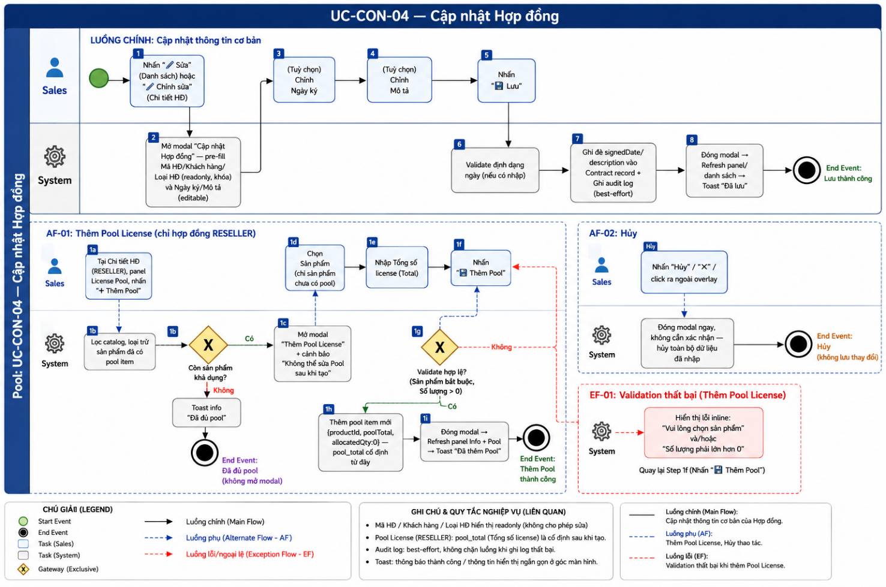

##### 2.1 Luồng chính — Cập nhật thông tin cơ bản

| **Bước** | **Actor** | **Hành động / Phản hồi** |
|----|----|----|
| 1 | Sales | Nhấn "Sửa" (Danh sách) hoặc "Chỉnh sửa" (Chi tiết Hợp đồng). |
| 2 | System | Mở modal “Cập nhật Hợp đồng". Pre-fill: Mã HĐ, Khách hàng, Loại HĐ (readonly, khóa 🔒) và Ngày ký, Mô tả (editable) theo dữ liệu hiện tại của hợp đồng. |
| 3 | Sales | (Tuỳ chọn) Chỉnh **Ngày ký**. |
| 4 | Sales | (Tuỳ chọn) Chỉnh **Mô tả**. |
| 5 | Sales | Nhấn "💾 Lưu". |
| 6 | System | Validate: không có field bắt buộc (cả 2 field đều tuỳ chọn), chỉ kiểm tra định dạng ngày hợp lệ nếu Ngày ký có nhập. |
| 7 | System | Ghi đè signedDate, description vào Contract record. Ghi audit log (best-effort, BR-05). |
| 8 | System | Đóng modal. Nếu đang ở Chi tiết HĐ → refresh panel Thông tin chung.<br>Nếu đang ở Danh sách → refresh danh sách.<br>Hiển thị toast "Đã lưu — Hợp đồng {code} đã được cập nhật". |

##### 2.2 Luồng phụ

\[AF-01: Thêm Pool License\] — kích hoạt khi Sales nhấn "＋ Thêm Pooltại panel License Pool trong Chi tiết Hợp đồng (chỉ hiển thị với type = RESELLER, xem BR-04).

| **Bước** | **Actor** | **Hành động / Phản hồi** |
|----|----|----|
| 1a | Sales | Tại Chi tiết Hợp đồng (RESELLER), tab/panel **License Pool**, nhấn "＋ Thêm Pool". |
| 1b | System | Lọc catalog sản phẩm, loại trừ các sản phẩm đã có pool item trên hợp đồng (BR-02). |
| 1c | System | Gateway: Còn sản phẩm khả dụng?<br>\[Không\] → hiển thị toast "Đã đủ pool — Tất cả sản phẩm đều đã có pool", không mở modal, kết thúc luồng (BR-04).\[Có\] → tiếp bước 1d. |
| 1d | System | Mở modal "🏊 Thêm Pool License".<br>Hiển thị cảnh báo: "Không thể sửa Pool sau khi tạo — Tổng số license (Total) không thể thay đổi sau khi lưu.<br>Hãy xác nhận kỹ số lượng đã cam kết với đại lý." |
| 1e | Sales | Chọn **Sản phẩm** từ dropdown (chỉ sản phẩm chưa có pool). |
| 1f | Sales | Nhập **Tổng số license (Total)**. |
| 1g | Sales | Nhấn "💾 Thêm Pool". |
| 1h | System | Validate: Sản phẩm bắt buộc, Tổng số license phải là số nguyên \> 0.<br>\[Thất bại\] → EF-01.\[Thành công\] → tiếp bước 1i. |
| 1i | System | Thêm pool item mới vào contract.poolItems: **{package_id, package_name, product_id (dẫn xuất), poolTotal, allocatedQty: 0}**. pool_total trở thành cố định (không thể sửa lại) ngay sau bước này (BR-03). |
| 1j | System | Đóng modal. Refresh panel Thông tin chung và panel License Pool.<br>Hiển thị toast "Đã thêm Pool — {tên sản phẩm}: {số lượng} seats". |

\[AF-02: Hủy\] — kích hoạt tại bất kỳ bước nào trước khi lưu (cả 2 luồng: Cập nhật thông tin và Thêm Pool License).

| **Bước** | **Actor** | **Hành động / Phản hồi** |
|----|----|----|
| AF-02a | Sales | Nhấn "Hủy", nút "✕" đóng modal, hoặc click ra ngoài overlay. |
| AF-02b | System | Đóng modal ngay, không hiển thị dialog xác nhận.<br>Không lưu thay đổi.<br>Dữ liệu đã nhập trong modal bị hủy toàn bộ; dữ liệu hợp đồng giữ nguyên như trước khi mở modal. |
| → | — | Quay về màn hình trước đó (Danh sách hoặc Chi tiết). |

##### 2.3 Luồng ngoại lệ

\[EF-01: Validation thất bại — Thêm Pool License\] — kích hoạt tại bước 1h.

| **Bước** | **Actor** | **Hành động / Phản hồi** |
|----|----|----|
| EF-01a | System | \[Thiếu Sản phẩm\] → Hiển thị lỗi inline dưới dropdown: "Vui lòng chọn sản phẩm". |
| EF-01b | System | \[Tổng số license trống hoặc ≤ 0\] → Hiển thị lỗi inline dưới field: "Số lượng phải lớn hơn 0". |
| EF-01c | System | Không thêm pool item. Modal giữ nguyên dữ liệu đã nhập. |
| → | — | Sales chỉnh sửa → quay lại bước 1g. |

######################################### 3. Mô tả giao diện

##### 3.1 Wireframe

Modal "Cập nhật Hợp đồng" (luồng chính):

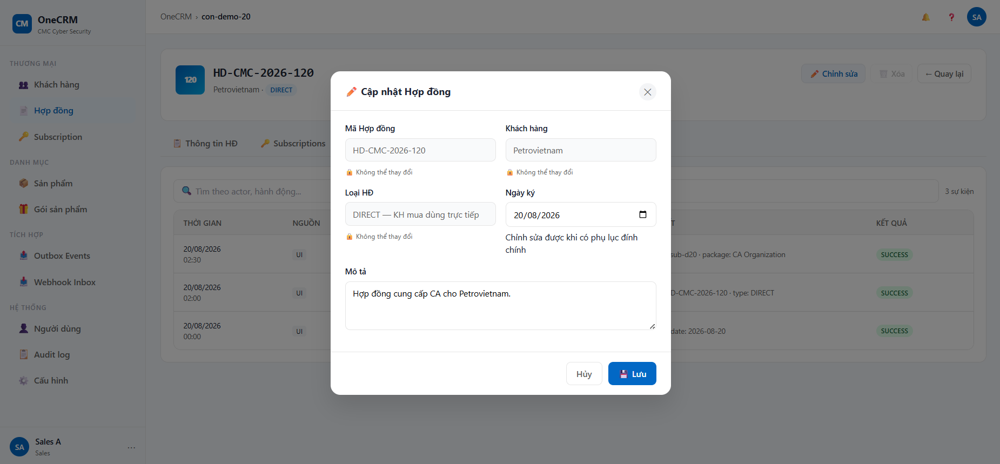

Modal "Thêm Pool License" (AF-01, chỉ Reseller):


##### 3.2 Các thành phần giao diện

| **\#** | **Thành phần** | **Loại** | **Mô tả** |
|----|----|----|----|
| 1 | Field "Mã Hợp đồng" | Text input (readonly) | Hiển thị contract.code hiện tại. Khóa 🔒 kèm ghi chú "Không thể thay đổi" (BR-01). |
| 2 | Field "Khách hàng" | Text input (readonly) | Hiển thị tên khách hàng hiện tại. Khóa 🔒 (BR-01). |
| 3 | Field "Loại HĐ" | Text input (readonly) | Hiển thị dạng mô tả: "DIRECT — KH mua dùng trực tiếp" hoặc "RESELLER — Hợp đồng khung đại lý". Khóa 🔒 (BR-01). |
| 4 | Field "Ngày ký" | Date picker | Editable. Hint: "Chỉnh sửa được khi có phụ lục đính chính". Không giới hạn số lần sửa (BR-06). |
| 5 | Field "Mô tả" | Textarea | Editable. 3 rows. Có thể kéo để mở rộng theo chiều dọc. |
| 6 | Nút "💾 Lưu" | Button (Primary) | Validate → cập nhật record → ghi audit log best-effort → đóng modal → refresh → toast. |
| 7 | Nút "Hủy" / "✕" | Button (Ghost) / Icon Button | Đóng modal không cần xác nhận. Hủy dữ liệu đã nhập (AF-02). |
| 8 | Panel "License Pool" (Chi tiết HĐ) | Read-only list + action | Hiển thị danh sách pool item hiện có: Sản phẩm, Total/Used/Available.<br>Chỉ RESELLER mới có panel này. Nút "＋ Thêm Pool" (nếu chưa có pool item nào) hoặc "＋ Thêm sản phẩm vào Pool" (nếu đã có ≥1 pool item) mở AF-01. |
| 9 | Alert cảnh báo (modal Thêm Pool) | Alert box (warning) | "Không thể sửa Pool sau khi tạo — Tổng số license (Total) không thể thay đổi sau khi lưu." Luôn hiển thị khi mở modal. |
| 10 | Dropdown "Sản phẩm" (modal Thêm Pool) | Select | Bắt buộc. Chỉ liệt kê sản phẩm chưa có pool item trên hợp đồng (BR-02).<br>Message lỗi: "Vui lòng chọn sản phẩm". |
| 11 | Field "Tổng số license (Total)" (modal Thêm Pool) | Number input | Bắt buộc. Số nguyên \> 0, format phân cách nghìn. Không thể chỉnh sửa sau khi lưu (BR-03). Message lỗi: "Số lượng phải lớn hơn 0". |
| 12 | Nút "💾 Thêm Pool" | Button (Primary) | Validate → thêm pool item mới → đóng modal → refresh panel → toast. |

##### 3.3 Các field trong form

| **\#** | **Field** | **Bắt buộc** | **Điều kiện hiển thị** | **Mô tả & Validation** |
|----|----|----|----|----|
| 1 | Mã Hợp đồng | — (readonly) | Modal Cập nhật | Không editable. Chỉ hiển thị. |
| 2 | Khách hàng | — (readonly) | Modal Cập nhật | Không editable. Chỉ hiển thị. |
| 3 | Loại HĐ | — (readonly) | Modal Cập nhật | Không editable. Chỉ hiển thị. |
| 4 | Ngày ký | — | Modal Cập nhật | Date picker. Không bắt buộc, không validate range. Có thể xóa về rỗng (signedDate = null). |
| 5 | Mô tả | — | Modal Cập nhật | Textarea, không bắt buộc. Có thể xóa về rỗng chuỗi. |
| 6 | Gói sản phẩm (pool) | ✓ | Modal Thêm Pool License (RESELLER only) | Select. Loại trừ sản phẩm đã có pool (BR-02). Message: "Vui lòng chọn gói sản phẩm". |
| 7 | Tổng số license (Total) | ✓ | Modal Thêm Pool License (RESELLER only) | Input số nguyên \> 0, format phân cách nghìn. Không thể thay đổi sau khi lưu (BR-03).<br>Message: "Số lượng phải lớn hơn 0". |

######################################### 4. Acceptance Criteria

##### Nhóm 1: Cập nhật thông tin cơ bản thành công

| **AC ID** | **Given** | **When** | **Then** |
|----|----|----|----|
| AC-CON-04-01 | Hợp đồng "HD-CMC-2026-014" có Ngày ký 01/07/2026, Mô tả cũ | Sales sửa Ngày ký thành 15/07/2026 và nhấn "Lưu" | signedDate cập nhật thành 2026-07-15. Modal đóng. Toast "Đã lưu — Hợp đồng HD-CMC-2026-014 đã được cập nhật". |
| AC-CON-04-02 | Sales xóa trắng field Mô tả và nhấn "Lưu" | — | description cập nhật thành chuỗi rỗng/null. Cập nhật thành công. |
| AC-CON-04-03 | Sales không thay đổi gì, nhấn "Lưu" | — | Cập nhật thành công (no-op), dữ liệu giữ nguyên, toast vẫn hiển thị. |
| AC-CON-04-04 | Sales cập nhật thành công tại Chi tiết Hợp đồng | — | Panel Thông tin chung refresh ngay với dữ liệu mới, không cần tải lại trang. |
| AC-CON-04-05 | Sales cập nhật thành công tại Danh sách Hợp đồng | — | Danh sách refresh, không thay đổi vị trí sort (không phải createdAt). |

##### Nhóm 2: Trường cố định (không thể sửa)

| **AC ID** | **Given** | **When** | **Then** |
|----|----|----|----|
| AC-CON-04-06 | Sales mở modal Cập nhật Hợp đồng | — | Field Mã HĐ, Khách hàng, Loại HĐ hiển thị readonly kèm khóa 🔒 và ghi chú "Không thể thay đổi". Không có cách nào để sửa 3 field này qua UI. |
| AC-CON-04-07 | Hợp đồng RESELLER đã có pool item "EDR Enterprise: 500" | Sales mở modal Thêm Pool License | Không có nút/hành động nào cho phép sửa lại pool_total = 500 của pool item đã tồn tại; chỉ có thể thêm pool item cho sản phẩm khác. |

##### Nhóm 3: Thêm Pool License thành công (AF-01)

| **AC ID** | **Given** | **When** | **Then** |
|----|----|----|----|
| AC-CON-04-08 | Hợp đồng RESELLER "HD-CMC-2026-020" hiện chưa có pool item nào | Sales nhấn "＋ Thêm Pool", chọn gói "CMC EPP v1", nhập 300 | Pool item mới thêm vào poolItems: {package_id: PKG-EPP-03, poolTotal: 300, allocatedQty: 0}. Toast "Đã thêm Pool — CMC EPP v1: 300 seats". |
| AC-CON-04-09 | Hợp đồng đã có pool "EDR Enterprise: 500" | Sales nhấn "＋ Thêm sản phẩm vào Pool", chọn EPR Basic, nhập 200 | Pool item mới thêm vào cùng hợp đồng, tổng cộng 2 pool item. Panel License Pool hiển thị cả 2. |
| AC-CON-04-10 | Hợp đồng đã có pool item cho tất cả sản phẩm trong catalog (EPP, EDR, EPR) | Sales nhấn "＋ Thêm Pool" | Toast info "Đã đủ pool — Tất cả sản phẩm đều đã có pool". Modal không mở. |
| AC-CON-04-11 | Hợp đồng đã có pool "EDR Enterprise" | Sales mở modal Thêm Pool License | Dropdown Sản phẩm không hiển thị nhóm EDR đã cấu hình; chỉ hiển thị các sản phẩm/nhóm còn trống. |

##### Nhóm 4: Validate Thêm Pool License (EF-01)

| **AC ID** | **Given** | **When** | **Then** |
|----|----|----|----|
| AC-CON-04-12 | Sales mở modal Thêm Pool License, không chọn Sản phẩm | Nhấn "Thêm Pool" | Lỗi inline: "Vui lòng chọn sản phẩm". Không thêm pool item. |
| AC-CON-04-13 | Sales chọn Sản phẩm, để trống Tổng số license | Nhấn "Thêm Pool" | Lỗi inline: "Số lượng phải lớn hơn 0". Không thêm pool item. |
| AC-CON-04-14 | Sales nhập Tổng số license = 0 | Nhấn "Thêm Pool" | Lỗi inline: "Số lượng phải lớn hơn 0". Không thêm pool item. |

##### Nhóm 5: Hủy (AF-02)

| **AC ID** | **Given** | **When** | **Then** |
|----|----|----|----|
| AC-CON-04-15 | Sales đã sửa Ngày ký/Mô tả trong modal Cập nhật | Nhấn "Hủy" hoặc "✕" hoặc click ra ngoài overlay | Modal đóng ngay, không có dialog xác nhận. Dữ liệu hợp đồng không thay đổi. |
| AC-CON-04-16 | Sales đã nhập Sản phẩm/Số lượng trong modal Thêm Pool License | Nhấn "Hủy" hoặc "✕" | Modal đóng ngay, không thêm pool item. |

### 6.2.6. UC-CON-05 Upload / Xóa File đính kèm Hợp đồng

Module: M-02 Contract Management \| Phiên bản: 1.1 \| Ngày: 06/07/2026

Trạng thái: Draft for Review

######################################### 1. Thông tin chung chức năng

| **Thuộc tính** | **Nội dung** |
|----|----|
| Tên chức năng | Upload / Xóa File đính kèm Hợp đồng |
| UC ID | UC-CON-05 |
| Mô tả | Sales quản lý file đính kèm (bản scan/chụp hợp đồng giấy, phụ lục...) gắn với 1 hợp đồng — bao gồm upload file mới và xóa (mềm) file đã đính kèm.<br>Đây là tài liệu đặc tả gốc (source of truth) cho toàn bộ nghiệp vụ đính kèm file hợp đồng, áp dụng tại 2 điểm chạm:<br>(1) tại Chi tiết Hợp đồng (UC-CON-03) — upload/xóa tức thời, độc lập, là luồng chính của UC này;<br>(2) tại Form Tạo Hợp đồng (UC-CON-02) — file được stage cục bộ trong modal, chỉ thực sự ghi lên storage sau khi hợp đồng tạo thành công. UC-CON-02 không lặp lại chi tiết nghiệp vụ đính kèm mà chỉ tham chiếu tới UC-CON-05 này. |
| Tác nhân | Sales |
| Tiền điều kiện | Sales đã đăng nhập và có quyền contract:update (luồng tại Chi tiết Hợp đồng) hoặc contract:create (luồng tại Form Tạo Hợp đồng).<br>Với luồng tại Chi tiết Hợp đồng: hợp đồng tồn tại và chưa bị xóa (deletedAt IS NULL). |
| Hậu điều kiện | \(1\) Upload thành công: file mới có status = ACTIVE, liên kết contract_id, lưu trên S3/MinIO theo convention BR-07; audit log ghi nhận.<br>(2) Xóa thành công: file chuyển status = DELETED — ẩn khỏi danh sách hiển thị, dữ liệu vẫn giữ nguyên trên storage; audit log ghi nhận.<br>(3) Hủy (xác nhận xóa hoặc bỏ file tạm): không có thay đổi nào diễn ra.<br>(4) Validate thất bại: không có file nào được thêm/xóa; danh sách giữ nguyên.<br>(5) Upload thất bại do mạng/hệ thống: không có attachment record nào được tạo, không có audit log (vì chưa từng thành công); tại luồng chính, danh sách đính kèm giữ nguyên; tại AF-02, hợp đồng đã tạo trước đó không bị ảnh hưởng — chỉ riêng file lỗi không được lưu. |
| Trigger | Upload (Chi tiết Hợp đồng): nhấn "+ Đính kèm file" hoặc kéo thả file vào dropzone tại panel/accordion "Đính kèm".<br>Upload (Form Tạo Hợp đồng): kéo thả/chọn file tại dropzone trong modal Tạo Hợp đồng (bước 9 của UC-CON-02) — xem AF-02.<br>Xóa: nhấn "🗑️" trên 1 file trong danh sách đính kèm (áp dụng tại Chi tiết Hợp đồng). |
| Quy tắc nghiệp vụ | BR-01: Định dạng file cho phép: PDF, DOCX, XLSX, JPG, PNG.<br>BR-02: Dung lượng ≤ 10MB/file.<br>BR-03: Tối đa 15 file/hợp đồng — tính trên các file đang ACTIVE; file đã xóa mềm (DELETED) không tính vào giới hạn này.<br>BR-04: Validate định dạng + dung lượng thực hiện phía client trước khi cho phép submit/stage.<br>BR-05: Xóa file là soft delete (attachment.status = DELETED) — dữ liệu vẫn giữ nguyên trên storage, chỉ ẩn khỏi danh sách hiển thị. Không có luồng khôi phục qua UI ở Phase 1.<br>BR-06: Audit log ghi nhận mọi thao tác upload/xóa: actor, timestamp, tên file, hành động (UPLOAD/DELETE) theo cơ chế best-effort — nếu ghi audit log thất bại, thao tác upload/xóa vẫn được coi là thành công (không rollback), nhất quán với UC-CON-04.<br>BR-07: Storage key theo convention contracts/{contract_id}/{uuid}-{filename}, áp dụng khi file thực sự được ghi lên storage.<br>BR-08: Trong Form Tạo Hợp đồng (UC-CON-02, hợp đồng chưa tồn tại), file chỉ được validate và hiển thị tạm cục bộ (client-side); việc ghi thật lên storage + tạo attachment record chỉ xảy ra sau khi hợp đồng được tạo thành công (xem AF-02).<br>BR-09: Không phân biệt "chủ file" khi xóa — bất kỳ Sales nào có quyền truy cập hợp đồng đều có thể xóa bất kỳ file đính kèm nào trên hợp đồng đó (đơn giản hoá phạm vi, không áp dụng owner-check).<br>BR-10: Lỗi upload do mạng/hệ thống (timeout, mất kết nối, storage service gián đoạn) không có cơ chế tự động retry ngầm ở tầng UI/nghiệp vụ — hệ thống báo lỗi ngay lần đầu, Sales chủ động bấm "Thử lại". Tầng network/SDK có thể tự retry cho lỗi 5xx/timeout ở mức hạ tầng, nhưng đây là chi tiết kỹ thuật, không thuộc phạm vi đặc tả nghiệp vụ. |

######################################### 2. Luồng nghiệp vụ

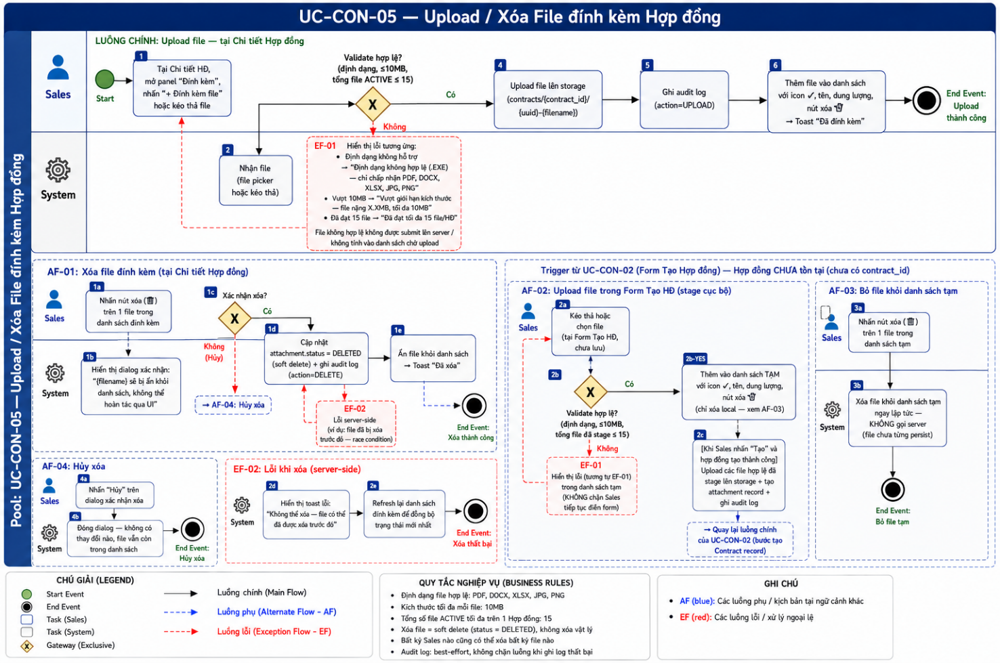

##### 2.1 Luồng chính — Upload file (tại Chi tiết Hợp đồng)

| **Bước** | **Actor** | **Hành động / Phản hồi** |
|----|----|----|
| 1 | Sales | Tại Chi tiết Hợp đồng, mở panel/accordion "📎 Đính kèm", nhấn "+ Đính kèm file" hoặc kéo thả file vào dropzone. |
| 2 | System | Nhận file (từ file picker hoặc kéo thả). |
| 3 | System | Validate client-side: định dạng (BR-01), dung lượng (BR-02), tổng số file hiện tại (ACTIVE) + file mới ≤ 15 (BR-03). \[Không hợp lệ\] → EF-01. \[Hợp lệ\] → tiếp bước 4. |
| 4 | System | Upload file lên storage theo convention BR-07, tạo attachment record liên kết contract_id. \[Lỗi mạng/hệ thống\] → EF-03. |
| 5 | System | Ghi audit log (BR-06). |
| 6 | System | Thêm file vào danh sách đính kèm với icon ✓ xanh, tên file, dung lượng, thời gian upload, nút 🗑️ xóa. Hiển thị toast "Đã đính kèm — {filename} đã được tải lên". |

##### 2.2 Luồng phụ

\[AF-01: Xóa file đính kèm\] — kích hoạt khi Sales nhấn "🗑️" trên 1 file trong danh sách đính kèm (tại Chi tiết Hợp đồng).

| **Bước** | **Actor** | **Hành động / Phản hồi** |
|----|----|----|
| 1a | Sales | Nhấn "🗑️" trên 1 file trong danh sách đính kèm. |
| 1b | System | Hiển thị dialog xác nhận: **"Xóa file đính kèm"** (modal header) + body *"Bạn có chắc chắn muốn xóa file **{filename}**? Hành động này không thể hoàn tác."* |
| 1c | Sales | Nhấn "🗑️ Xóa" để xác nhận. \[Nếu nhấn "Hủy"\] → AF-04. |
| 1d | System | Cập nhật attachment.status = DELETED (soft delete, BR-05). Ghi audit log (BR-06). |
| 1e | System | Ẩn file khỏi danh sách ngay lập tức. Hiển thị toast "Đã xóa — {filename} thành công".<br>\[Lỗi server-side\] → EF-02. |

\[AF-02: Upload file trong Form Tạo Hợp đồng\] — kích hoạt tại bước 9 của UC-CON-02 (Thêm mới Hợp đồng). Đây là luồng mà UC-CON-02 tham chiếu tới.

| **Bước** | **Actor** | **Hành động / Phản hồi** |
|----|----|----|
| 2a | Sales | Kéo thả hoặc click chọn file từ máy tính (tại Form Tạo Hợp đồng — hợp đồng chưa tồn tại). |
| 2b | System | Gateway: Validate client-side hợp lệ? Định dạng (BR-01), dung lượng (BR-02), tổng số file đã stage + file mới ≤ 15 (BR-03). \[Không hợp lệ\] → EF-01, hiển thị icon ✕ đỏ + tooltip lý do ngay trong danh sách tạm, không chặn Sales tiếp tục điền form. \[Hợp lệ\] → tiếp bước 2c. |
| 2c | System | Thêm vào danh sách tạm với icon ✓ xanh, tên file, dung lượng, nút 🗑️ bỏ file (chỉ xóa khỏi danh sách tạm cục bộ, chưa gọi server — xem AF-03). |
| 2c | System | \[Khi Sales nhấn "Tạo" ở UC-CON-02 và hợp đồng tạo thành công\] → Upload các file hợp lệ đã stage lên storage (BR-07, BR-08), tạo attachment record cho từng file, ghi audit log (BR-06). \[Lỗi mạng/hệ thống cho 1 file\] → EF-03 (không rollback hợp đồng, các file khác không bị ảnh hưởng). |
| → | — | Quay lại luồng chính UC-CON-02 tại bước tạo Contract record (bước 13 của UC-CON-02). |

\[AF-03: Bỏ file khỏi danh sách tạm\] — kích hoạt khi Sales nhấn "🗑️" trên 1 file trong danh sách tạm tại Form Tạo Hợp đồng (chưa lưu).

| **Bước** | **Actor** | **Hành động / Phản hồi** |
|----|----|----|
| 3a | Sales | Nhấn "🗑️" trên 1 file trong danh sách tạm (Form Tạo Hợp đồng, chưa lưu). |
| 3b | System | Xóa file khỏi danh sách tạm ngay lập tức. Không có lệnh gọi server (file chưa từng persist lên storage). |

\[AF-04: Hủy xóa\] — kích hoạt tại bước 1c của AF-01 khi Sales không xác nhận.

| **Bước** | **Actor** | **Hành động / Phản hồi** |
|----|----|----|
| 4a | Sales | Nhấn "Hủy" trên dialog xác nhận xóa. |
| 4b | System | Đóng dialog. Không có thay đổi nào diễn ra; file vẫn còn trong danh sách. |

##### 2.3 Luồng ngoại lệ

\[EF-01: Validate thất bại lúc upload\] — áp dụng cho cả luồng chính (2.1, tại Chi tiết Hợp đồng) và AF-02 (tại Form Tạo Hợp đồng).

| **Bước** | **Actor** | **Hành động / Phản hồi** |
|----|----|----|
| EF-01a | System | \[Định dạng không hỗ trợ\] → Hiển thị lỗi: "Định dạng không hợp lệ (.EXE) — chỉ chấp nhận PDF, DOCX, XLSX, JPG, PNG". |
| EF-01b | System | \[Vượt 10MB\] → Hiển thị lỗi: "Vượt giới hạn kích thước — file nặng X.XMB, tối đa 10MB". |
| EF-01c | System | \[Đã đạt 15 file\] → Hiển thị toast lỗi: "Đã đạt tối đa 15 file/HĐ". |
| EF-01d | System | File không hợp lệ không được submit lên server (luồng chính) / không được tính là file hợp lệ để upload sau khi tạo (AF-02). |

\[EF-02: Lỗi khi xóa (server-side)\] — kích hoạt tại bước 1d của AF-01 nếu server trả lỗi (ví dụ file đã bị xóa trước đó do thao tác khác, race condition).

| **Bước** | **Actor** | **Hành động / Phản hồi** |
|----|----|----|
| EF-02a | System | Hiển thị toast lỗi: "Không thể xóa — file có thể đã được xóa trước đó". |
| EF-02b | System | Refresh lại danh sách đính kèm để đồng bộ trạng thái mới nhất. |

\[EF-03: Lỗi upload do mạng/hệ thống\] — kích hoạt tại bước 4 (Luồng chính, tại Chi tiết Hợp đồng) hoặc bước 2d (AF-02, tại Form Tạo Hợp đồng) khi server trả lỗi kết nối/hạ tầng (timeout, mất kết nối, storage service gián đoạn — không phải lỗi validate).

| **Bước** | **Actor** | **Hành động / Phản hồi** |
|----|----|----|
| EF-03a | System | \[Tại Luồng chính\] Hiển thị lỗi: "Upload thất bại — Lỗi kết nối hoặc hệ thống lưu trữ đang gián đoạn. Vui lòng thử lại." kèm nút "Thử lại". Không tạo attachment record, không ghi audit log (vì chưa từng thành công). File không xuất hiện trong danh sách. |
| EF-03b | System | \[Tại AF-02, bước 2d\] Hợp đồng đã tạo thành công trước đó → không rollback hợp đồng. Hiển thị thông báo tách biệt: "Hợp đồng {code} đã tạo thành công. {filename} chưa upload được — vui lòng vào Chi tiết Hợp đồng để đính kèm lại." Nếu có nhiều file stage cùng lúc, mỗi file là 1 request độc lập — file khác lỗi không ảnh hưởng file đang upload thành công. |
| EF-03c | Sales | \[Tại Luồng chính\] Nhấn "Thử lại" → quay lại bước 4, gọi lại đúng file đã chọn (không cần chọn lại). Không có cơ chế tự động retry ngầm ở tầng UI/nghiệp vụ (BR-10). |

######################################### 3. Mô tả giao diện

**3.1 Wireframe**

Panel "Đính kèm" tại Chi tiết Hợp đồng (luồng chính + AF-01):

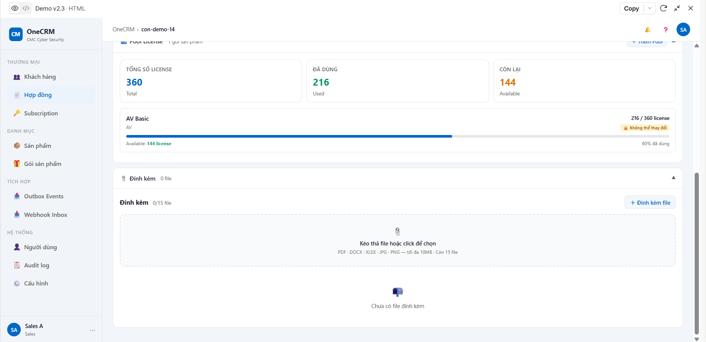

Dialog xác nhận xóa (AF-01):

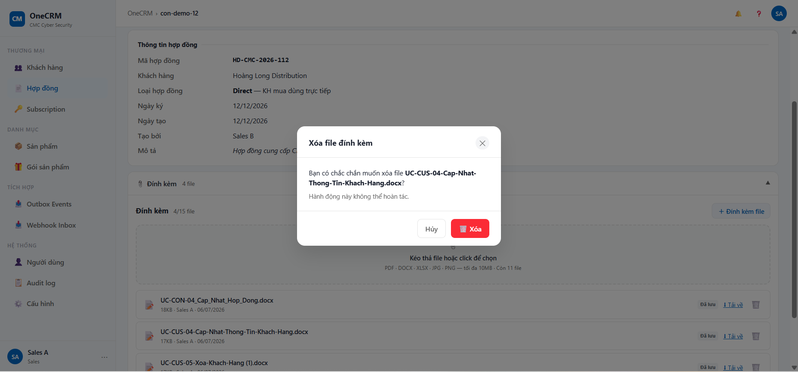

**3.2 Các thành phần giao diện**

| **\#** | **Thành phần** | **Loại** | **Mô tả** |
|----|----|----|----|
| 1 | Panel/Accordion "📎 Đính kèm" (Chi tiết HĐ) | Section (collapsible) | Hiển thị số lượng file hiện có ở tiêu đề, danh sách file bên dưới, luôn có sẵn dropzone/nút thêm file ở đầu. |
| 2 | Dropzone đính kèm | File upload | Hỗ trợ kéo thả hoặc click để chọn file. Hiển thị định dạng + giới hạn dung lượng ngay trong dropzone. |
| 3 | Nút "+ Đính kèm file" | Button (Secondary) | Mở file picker của hệ điều hành. |
| 4 | Item file trong danh sách | List item | Icon theo loại file, tên file, dung lượng, ngày upload, nút 🗑️ xóa.<br>Tên người upload, mô tả (desc), badge "Đã lưu", nút ⬇ Tải về |
| 5 | Nút "🗑️" (trên từng file) | Icon Button | Mở dialog xác nhận xóa (AF-01) tại Chi tiết HĐ; xóa ngay khỏi danh sách tạm (AF-03) tại Form Tạo HĐ. |
| 6 | Dialog xác nhận xóa | Modal (confirm) | Hiển thị tên file, cảnh báo không thể hoàn tác, 2 nút "Hủy" / "🗑️ Xóa". |
| 7 | Nút "Thử lại" (khi upload lỗi mạng/hệ thống) | Button (Secondary) | Xuất hiện kèm thông báo lỗi EF-03 tại Luồng chính. Gọi lại upload cho đúng file đã chọn, không cần chọn lại. |

**3.3 Các field trong form**

| **\#** | **Field** | **Bắt buộc** | **Điều kiện hiển thị** | **Mô tả & Validation** |
|----|----|----|----|----|
| 1 | File đính kèm | — | Panel "Đính kèm" (Chi tiết HĐ) / Dropzone (Form Tạo HĐ) | Định dạng: PDF, DOCX, XLSX, JPG, PNG (BR-01). Dung lượng ≤ 10MB/file (BR-02). Tối đa 15 file/HĐ tính trên file ACTIVE (BR-03). Validate client-side.<br>Message lỗi: "Định dạng không hợp lệ (.EXE) — chỉ chấp nhận PDF, DOCX, XLSX, JPG, PNG" / "Vượt giới hạn kích thước — file nặng X.XMB, tối đa 10MB" / "Đã đạt tối đa 15 file/HĐ". |

<span id="_Toc234239597" class="anchor"></span>4. Acceptance Criteria

##### Nhóm 1: Upload thành công (Chi tiết Hợp đồng)

| **AC ID** | **Given** | **When** | **Then** |
|----|----|----|----|
| AC-CON-05-01 | Hợp đồng "HD-CMC-2026-014" đang có 3 file đính kèm | Sales kéo thả file PDF 5MB hợp lệ vào dropzone | File upload thành công, xuất hiện trong danh sách với icon ✓, tên file, dung lượng, thời gian upload. Toast "Đã đính kèm — {filename} đã được tải lên". |
| AC-CON-05-02 | Sales click "+ Đính kèm file" và chọn file DOCX 2MB qua file picker | — | Upload thành công, tương tự AC-CON-05-01 (không chỉ giới hạn ở kéo thả). |
| AC-CON-05-03 | Upload thành công | — | Audit log ghi nhận actor, timestamp, tên file, action = UPLOAD. |
| AC-CON-05-04 | Upload thành công | — | File được lưu với storage key dạng:<br>contracts/{contract_id}/{uuid}-{filename}<br>(BR-07). |

##### Nhóm 2: Validate Upload

| **AC ID** | **Given** | **When** | **Then** |
|----|----|----|----|
| AC-CON-05-05 | Sales chọn file .exe | — | Lỗi: "Định dạng không hợp lệ (.EXE) — chỉ chấp nhận PDF, DOCX, XLSX, JPG, PNG". File không được upload. |
| AC-CON-05-06 | Sales chọn file PDF 25MB | — | Lỗi: "Vượt giới hạn kích thước — file nặng 25.0MB, tối đa 10MB". File không được upload. |
| AC-CON-05-07 | Hợp đồng đã có 15 file ACTIVE | Sales upload thêm 1 file hợp lệ | Toast lỗi "Đã đạt tối đa 15 file/HĐ". File không được thêm. |
| AC-CON-05-08 | Hợp đồng có 14 file ACTIVE + 3 file đã xóa mềm (DELETED) | Sales upload thêm 1 file hợp lệ | Upload thành công — giới hạn 15 chỉ tính file ACTIVE, không tính file đã xóa (BR-03). |

##### Nhóm 3: Xóa file thành công

| **AC ID** | **Given** | **When** | **Then** |
|----|----|----|----|
| AC-CON-05-09 | Sales nhấn 🗑️ trên 1 file trong danh sách | Hệ thống hiện dialog xác nhận, Sales nhấn "🗑️ Xóa" | File chuyển status = DELETED, ẩn khỏi danh sách ngay lập tức. Toast " Đã xóa {filename} thành công". Audit log ghi nhận action = DELETE. |
| AC-CON-05-10 | File đã bị xóa mềm trước đó | Sales (bất kỳ) mở lại Chi tiết Hợp đồng | File không xuất hiện trong danh sách đính kèm (BR-05). |
| AC-CON-05-11 | File "A" do Sales X upload | Sales Y (không phải người upload) nhấn 🗑️ trên file "A" | Xóa thành công — không phân biệt chủ file (BR-09). |

##### Nhóm 4: Upload trong Form Tạo Hợp đồng

| **AC ID** | **Given** | **When** | **Then** |
|----|----|----|----|
| AC-CON-05-12 | Sales đang ở Form Tạo Hợp đồng (chưa lưu) | Kéo thả 1 file PDF hợp lệ | File thêm vào danh sách tạm với icon ✓; chưa gọi server, chưa có storage key. |
| AC-CON-05-13 | Sales đã stage 1 file hợp lệ trong Form Tạo HĐ | Nhấn "Tạo" và hợp đồng tạo thành công | File được upload thật lên storage, tạo attachment record liên kết contract_id vừa tạo, ghi audit log. Panel "Đính kèm" tại Chi tiết Hợp đồng hiển thị file đó ngay. |
| AC-CON-05-14 | Sales đã stage 1 file .exe (không hợp lệ) trong Form Tạo HĐ | Vẫn nhấn "Tạo" | Hợp đồng vẫn tạo thành công (file không hợp lệ không chặn submit form); file .exe không được upload lên storage, không xuất hiện tại Chi tiết Hợp đồng. |

##### Nhóm 5: Hủy / bỏ file tạm

| **AC ID** | **Given** | **When** | **Then** |
|----|----|----|----|
| AC-CON-05-15 | Sales đã nhấn 🗑️ trên 1 file (Chi tiết HĐ), dialog xác nhận đang mở | Nhấn "Hủy" | Dialog đóng, file vẫn còn trong danh sách, không có thay đổi. |
| AC-CON-05-16 | Sales đã stage 1 file trong Form Tạo HĐ (chưa lưu) | Nhấn 🗑️ trên file đó | File bị xóa khỏi danh sách tạm ngay lập tức, không có lệnh gọi server. |

##### Nhóm 6: Lỗi upload do mạng/hệ thống (EF-03)

| **AC ID** | **Given** | **When** | **Then** |
|----|----|----|----|
| AC-CON-05-17 | Storage service gián đoạn tạm thời | Sales upload file PDF hợp lệ tại Chi tiết Hợp đồng | Hiển thị lỗi "Upload thất bại — Lỗi kết nối hoặc hệ thống lưu trữ đang gián đoạn. Vui lòng thử lại." kèm nút "Thử lại". File không xuất hiện trong danh sách, không tạo attachment record, không ghi audit log. |
| AC-CON-05-18 | Sales vừa gặp lỗi EF-03 ở AC-CON-05-17, storage đã khôi phục | Nhấn nút "Thử lại" | Upload thành công như luồng chính bình thường (bước 4-6), không cần chọn lại file. |
| AC-CON-05-19 | Sales đã stage 2 file hợp lệ trong Form Tạo HĐ | Nhấn "Tạo", hợp đồng tạo thành công, nhưng 1 trong 2 file bị lỗi mạng lúc upload (bước 2d) | Hợp đồng vẫn giữ nguyên, không rollback. File còn lại upload thành công bình thường. Hiển thị thông báo riêng cho file lỗi: "Hợp đồng {code} đã tạo thành công. {filename} chưa upload được — vui lòng vào Chi tiết Hợp đồng để đính kèm lại." |

### 6.2.7. UC-CON-06 Xóa Hợp đồng

######################################### 1. Thông tin chung chức năng

| **Thuộc tính** | **Nội dung** |
|----|----|
| Tên chức năng | Xóa Hợp đồng |
| UC ID | UC-CON-06 |
| Mô tả | Sales/Manager xóa một hợp đồng khỏi hệ thống bằng cách soft delete (set `deleted_at`). Chỉ được phép xóa khi hợp đồng chưa có Subscription nào. Thao tác yêu cầu nhập lý do xóa, xác nhận, và cố gắng ghi Audit Log (best-effort — không chặn luồng xóa). |
| Tác nhân | Sales, Manager |
| Tiền điều kiện | Đã đăng nhập và có quyền `contract:delete`. Hợp đồng tồn tại (`deleted_at IS NULL`). |
| Hậu điều kiện | (Success) `deleted_at`, `deleted_by`, `delete_reason` được set. HĐ không hiển thị trong hệ thống. Redirect về Danh sách với toast thành công.(Failure) Không có dữ liệu bị thay đổi. HĐ vẫn tồn tại nguyên vẹn. |
| Điểm vào | (a) Nhấn icon 🗑️ trên row trong Danh sách (UC-CON-01).(b) Nhấn nút "🗑️ Xóa" trong action bar của Chi tiết HĐ (UC-CON-03). |
| Quy tắc nghiệp vụ | BR-01: Chỉ được xóa khi `subs.length = 0`. Kể cả sub EXPIRED/REVOKED cũng chặn xóa — một khi đã phát sinh sub, không thể xóa.<br>BR-02: Nút 🗑️ disabled ngay khi render nếu `subs.length > 0`. Tooltip: "Đã có Subscription, không thể xóa".<br>BR-03: Audit log best-effort — thành công hay thất bại đều KHÔNG chặn luồng soft delete; luôn tiếp tục thực hiện xóa.<br>BR-04: Soft delete — set `deleted_at = now()`, `deleted_by = actor_id`, `delete_reason = {lý do}`. Record giữ trong DB, không hiển thị UI. Không có luồng khôi phục qua UI.<br>BR-05: Field "Lý do xóa" bắt buộc — nút "🗑️ Xóa" trong modal disabled cho đến khi field được điền. |

######################################### Luồng nghiệp vụ

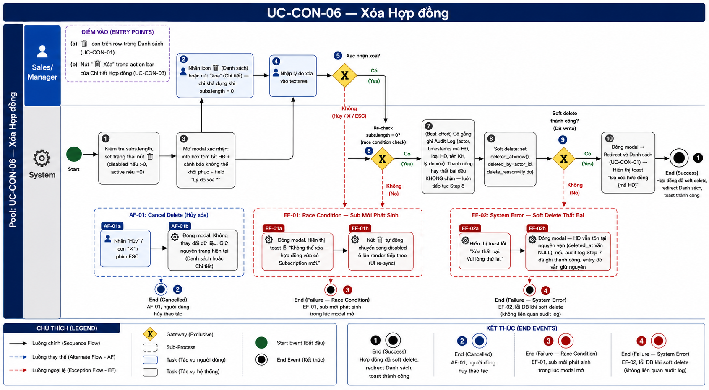

##### 2.1 Luồng chính

| **Bước** | **Actor** | **Hành động / Phản hồi** |
|----|----|----|
| 1 | System | Tại Danh sách (UC-CON-01) hoặc Chi tiết (UC-CON-03), kiểm tra `subs.length` để set trạng thái nút 🗑️: disabled khi > 0, active khi = 0. |
| 2 | Sales/Manager | Nhấn icon 🗑️ (Danh sách) hoặc nút "🗑️ Xóa" (Chi tiết) — chỉ khả dụng khi `subs.length = 0`. |
| 3 | System | Mở modal xác nhận xóa. Hiển thị: tóm tắt HĐ (Mã HĐ, Tên KH, Loại HĐ, Ngày tạo), cảnh báo không thể khôi phục qua UI, field "Lý do xóa *". |
| 4 | Sales/Manager | Nhập lý do xóa. Nút "🗑️ Xóa" active sau khi có nội dung (BR-05). |
| 5 | Sales/Manager | \[Gateway — Xác nhận xóa?\] Nhấn "🗑️ Xóa" → tiếp bước 6; Nhấn "Hủy" / "✕" / ESC → AF-01. |
| 6 | System | Re-check `subs.length = 0` (phòng race condition). \[Gateway — Vẫn còn 0 sub?\] Có → tiếp bước 7. Không → EF-01. |
| 7 | System | (Best-effort) Cố gắng ghi Audit Log (actor, timestamp, mã HĐ, loại HĐ, tên KH, lý do xóa). Kết quả KHÔNG chặn — luôn tiếp tục bước 8 (BR-03). |
| 8 | System | Soft delete: set `deleted_at = now()`, `deleted_by = actor_id`, `delete_reason = {lý do}` (BR-04). |
| 9 | System | \[Gateway — Soft delete thành công? (DB write)\] Có → tiếp bước 10. Không → EF-02. |
| 10 | System | Đóng modal. Redirect về Danh sách HĐ (UC-CON-01). Toast: "Đã xóa hợp đồng {mã HĐ}". |
| → | — | End (Success) |

##### 2.2 Luồng phụ

\[AF-01: Hủy xóa\] — kích hoạt tại bước 5.

| **Bước** | **Actor** | **Hành động / Phản hồi** |
|----|----|----|
| AF-01a | Sales/Manager | Nhấn "Hủy", icon "✕", hoặc phím ESC. |
| AF-01b | System | Đóng modal. Không thay đổi dữ liệu. Giữ nguyên trang hiện tại (Danh sách hoặc Chi tiết). |
| → | — | End (Hủy thao tác) |

##### 2.3 Luồng ngoại lệ

\[EF-01: Race condition — phát sinh sub giữa lúc modal mở\] — kích hoạt tại bước 6.

| **Bước** | **Actor** | **Hành động / Phản hồi** |
|----|----|----|
| EF-01 | System | Đóng modal. Toast lỗi: "Không thể xóa — hợp đồng vừa có Subscription mới." Không thay đổi dữ liệu. |
| → | — | End (Failure — EF-01) |

\[EF-02: Lỗi hệ thống — Soft Delete Thất Bại\] — kích hoạt tại bước 9 khi DB write thất bại.

| **Bước** | **Actor** | **Hành động / Phản hồi** |
|----|----|----|
| EF-02a | System | Toast lỗi: "Xóa thất bại. Vui lòng thử lại." Đóng modal. |
| EF-02b | System | HĐ vẫn tồn tại nguyên vẹn (`deleted_at` vẫn NULL). Nếu audit log bước 7 đã ghi thành công → entry đó giữ nguyên, không rollback. |
| → | — | End (Failure — EF-02) |

######################################### 3. Mô tả giao diện

##### 3.1 Wireframe

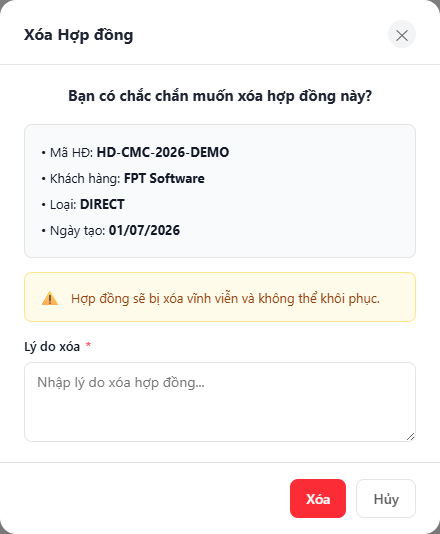

*▲ UC-CON-06 — Modal xác nhận xóa Hợp đồng*

##### 3.2 Các thành phần giao diện

| **\#** | **Thành phần** | **Loại** | **Mô tả** |
|----|----|----|----|
| 1 | Tiêu đề modal | Heading | "Bạn có chắc chắn muốn xóa hợp đồng này?" — căn giữa, font lớn, màu navy. |
| 2 | Info box | Read-only card | Tóm tắt HĐ: Mã HĐ, Khách hàng, Loại, Ngày tạo. Background #F9FAFB. |
| 3 | Cảnh báo | Alert (warn) | Icon ⚠️. "Hợp đồng sẽ bị xóa vĩnh viễn và không thể khôi phục." Background vàng nhạt. |
| 4 | Field "Lý do xóa *" | Textarea (required) | Placeholder: "Nhập lý do xóa hợp đồng..." 3 rows. Bắt buộc — nút Xóa disabled khi trống (BR-05). |
| 5 | Nút "🗑️ Xóa" | Button (Danger) | Màu đỏ. Disabled khi field Lý do trống; active khi đã điền. Loading state sau khi nhấn. |
| 6 | Nút "Hủy" | Button (Ghost) | Đóng modal, không thay đổi dữ liệu (AF-01). |
| 7 | Nút "✕" đóng | Icon Button | Hành vi giống "Hủy". |

##### 3.3 Trạng thái nút 🗑️ Xóa

| **Điều kiện** | **Trạng thái** | **Tooltip khi hover** |
|----|----|----| 
| `subs.length = 0` | Active — màu đỏ, click được | Không có tooltip |
| `subs.length ≥ 1` (bất kỳ trạng thái sub nào) | Disabled — opacity thấp, cursor not-allowed | "Đã có Subscription, không thể xóa" |

Áp dụng đồng nhất ở 2 vị trí: cột Thao tác trong Danh sách (UC-CON-01) và action bar trong Chi tiết (UC-CON-03).

######################################### Acceptance Criteria

##### Nhóm 1: Xóa thành công

| **AC ID** | **Given** | **When** | **Then** |
|----|----|----|----|
| AC-CON-06-01 | HĐ "HD-CMC-2026-DEMO" (subs.length = 0) | Sales nhập lý do, nhấn 🗑️ Xóa | `deleted_at`, `deleted_by`, `delete_reason` được set. HĐ không xuất hiện trong Danh sách. Redirect về Danh sách. Toast "Đã xóa hợp đồng HD-CMC-2026-DEMO". |
| AC-CON-06-02 | Sales xóa HĐ từ Danh sách | Xóa thành công | Row HĐ biến mất khỏi bảng ngay, không cần reload. |
| AC-CON-06-03 | Sales xóa HĐ từ trang Chi tiết (UC-CON-03) | Xóa thành công | Modal đóng, redirect về Danh sách. |

##### Nhóm 2: Chặn xóa khi đã có Subscription

| **AC ID** | **Given** | **When** | **Then** |
|----|----|----|----|
| AC-CON-06-04 | HĐ có `subs.length > 0` (bất kỳ trạng thái) | Sales xem Danh sách | Nút 🗑️ disabled, không click được. |
| AC-CON-06-05 | HĐ có 1 sub REVOKED | Sales xem Danh sách | Nút 🗑️ vẫn disabled — REVOKED vẫn tính là đã phát sinh sub (BR-01). |
| AC-CON-06-06 | HĐ có `subs.length > 0` | Sales hover vào nút 🗑️ disabled | Tooltip: "Đã có Subscription, không thể xóa". |

##### Nhóm 3: Lý do xóa bắt buộc

| **AC ID** | **Given** | **When** | **Then** |
|----|----|----|----|
| AC-CON-06-07 | Modal xóa đang mở, field Lý do trống | Sales xem modal | Nút "🗑️ Xóa" disabled. |
| AC-CON-06-08 | Modal xóa đang mở | Sales nhập lý do vào textarea | Nút "🗑️ Xóa" chuyển sang active. |
| AC-CON-06-09 | Sales xóa thành công | — | `delete_reason` được lưu vào contract record và audit log. |

##### Nhóm 4: Hủy thao tác

| **AC ID** | **Given** | **When** | **Then** |
|----|----|----|----|
| AC-CON-06-10 | Modal xóa đang mở | Sales nhấn "Hủy" / "✕" / ESC | Modal đóng. HĐ không thay đổi. |

##### Nhóm 5: Race condition

| **AC ID** | **Given** | **When** | **Then** |
|----|----|----|----|
| AC-CON-06-11 | Sales mở modal xóa (subs=0); trong lúc modal mở, user khác tạo sub mới cho cùng HĐ | Sales nhấn "🗑️ Xóa" | BE re-check phát hiện `subs.length > 0`, từ chối xóa. Toast "Không thể xóa — hợp đồng vừa có Subscription mới." Modal đóng, record không thay đổi. |

##### Nhóm 6: Lỗi hệ thống và best-effort audit

| **AC ID** | **Given** | **When** | **Then** |
|----|----|----|----|
| AC-CON-06-12 | DB write thất bại tại bước 8 | Sales xác nhận xóa | Toast "Xóa thất bại. Vui lòng thử lại." HĐ vẫn tồn tại (`deleted_at` vẫn NULL). Nếu audit log bước 7 đã ghi → entry audit vẫn giữ, không rollback. |
| AC-CON-06-13 | Audit log service thất bại tại bước 7 | Sales xác nhận xóa | Hệ thống tiếp tục thực hiện soft delete (bước 8) — audit failure không chặn xóa (BR-03 best-effort). |

## M-03 Subscription Management

### 6.3.1. Mô tả nghiệp vụ

Module trung tâm. Sub là đối tượng commercial chính (1 sub : 1 package : 1 license_mirror). Lifecycle phức tạp với 2 nhóm action: revenue (tạo sub mới) vs non-revenue (tác động trực tiếp). Mọi action publish event → product subscribe → product webhook về. CRM không gọi product.

Đơn vị thụ hưởng & pool đại lý (HĐ RESELLER). Với HĐ RESELLER, mỗi sub gắn một đơn vị thụ hưởng (beneficiary_id → Customer độc lập, không có HĐ riêng); sub vẫn neo contract_id vào HĐ khung của đại lý nên quan hệ Contract→Sub không đổi. Mỗi sub rút license_qty (mặc định 1) từ pool, theo công thức:

remaining = pool_total − Σ license_qty của các sub "gốc cấp phát" — *sub gốc* = prev_sub_id = NULL và đã submit.

- Mua thêm (sub gốc mới) → trừ pool; *gia hạn/upgrade/downgrade (successor) → không trừ thêm*.

- DRAFT không trừ — chỉ trừ khi submit; chặn cứng nếu vượt remaining; không hoàn slot khi revoke/expired; term sub con độc lập với HĐ khung.

- Lifecycle (activate/renew/suspend/revoke) thực hiện per sub → tương đương per đơn vị thụ hưởng.

Kích hoạt license — actor cấu hình. Đưa sub sang ACTIVE tách trigger khỏi execute/confirm. Actor trigger cấu hình per Product Module/deal (AUTO\|PRODUCT_ADMIN\|CUSTOMER_SELF\|SALES); execute & xác nhận luôn do product qua webhook license.active (air-gap mới xác nhận thủ công). Khi actor = SALES (vd EDR sau UAT — cắt khâu Sales báo product để admin bấm): Sales bấm "Kích hoạt" → CRM publish intent license.activation_requested → product active → webhook license.active → sub ACTIVE. CRM không tự đặt ACTIVE lúc Sales bấm (chờ webhook, tránh lệch sub.status ↔ license_mirror.status); air-gap mới flip thủ công. "Kích hoạt" là capability có audit; RBAC gán theo cấu hình vận hành, không hardcode.

### 6.3.2. Đặc tả chi tiết — Danh sách FRS (UC-SUB)

> **Từ v2.4:** đặc tả chi tiết module Subscription được tách sang bộ **FRS UC-SUB-01..10** (`docs/frs/subscriptions/`). Mỗi FRS gồm luồng nghiệp vụ + sơ đồ BPMN 2.0 + Acceptance Criteria + mô tả giao diện. PRD giữ vai trò tổng quan; FRS là nguồn chi tiết. Bảng dưới ánh xạ mã FR-SUB (PRD) ↔ UC-SUB (FRS).

> Từ v2.4, mã **FR-SUB được đánh lại đồng bộ 1:1 với số thứ tự UC-SUB** (FR-SUB-NN ↔ UC-SUB-NN). FR-SUB-11 (auto-transition, hàm System, không có UC) giữ nguyên số.

| Mã FR (PRD) | UC-SUB | Tên chức năng | Actor | Tài liệu chi tiết |
|----|----|----|----|----|
| FR-SUB-01 | UC-SUB-01 | Danh sách Subscription | Sales, Manager | [UC-SUB-01](../frs/subscriptions/UC-SUB-01_list_subscription.md) |
| FR-SUB-02 | UC-SUB-02 | Tạo Subscription | Sales, Manager | [UC-SUB-02](../frs/subscriptions/UC-SUB-02_create_subscription.md) |
| FR-SUB-03 | UC-SUB-03 | Chi tiết Subscription | Sales, CSKH, License Admin, Manager, Auditor | [UC-SUB-03](../frs/subscriptions/UC-SUB-03_detail_subscription.md) |
| FR-SUB-04 | UC-SUB-04 | Chỉnh sửa Subscription | Sales, CSKH, License Admin, Manager | [UC-SUB-04](../frs/subscriptions/UC-SUB-04_edit_subscription.md) |
| FR-SUB-05 | UC-SUB-05 | Xác nhận / Submit Subscription | Sales, CSKH, License Admin, Manager | [UC-SUB-05](../frs/subscriptions/UC-SUB-05_approve_subscription.md) |
| FR-SUB-06 | UC-SUB-06 | Xóa Subscription Draft (hard delete) | Sales, CSKH, License Admin, Manager | [UC-SUB-06](../frs/subscriptions/UC-SUB-06_delete_draft_subscription.md) |
| FR-SUB-07 | UC-SUB-07 | Gia hạn Subscription (Renewal) | Sales, CSKH, License Admin, Manager | [UC-SUB-07](../frs/subscriptions/UC-SUB-07_renew_subscription.md) |
| FR-SUB-08 | UC-SUB-08 | Thu hồi Subscription | Manager, License Admin | [UC-SUB-08](../frs/subscriptions/UC-SUB-08_revoke_subscription.md) |
| FR-SUB-09 | UC-SUB-09 | Tạm dừng Subscription | Sales, Manager | [UC-SUB-09](../frs/subscriptions/UC-SUB-09_suspend_subscription.md) |
| FR-SUB-10 | UC-SUB-10 | Khôi phục Subscription | Sales, Manager | [UC-SUB-10](../frs/subscriptions/UC-SUB-10_resume_subscription.md) |

**Thay đổi nghiệp vụ chính ở v2.4 (so với v2.3):**

- **FR-SUB-07 (Gia hạn / UC-SUB-07):** sub kế tiếp tạo **trực tiếp ACTIVE** (bỏ mô hình DRAFT → submit của v2.3), predecessor → **RENEWED ngay**; license_mirror vẫn theo webhook inbound từ product (xem §5.5.1). *Lưu ý:* trong khoảng chờ webhook, sub ACTIVE nhưng mirror còn PENDING — **FR-LIC-07 cần loại trừ sub vừa gia hạn** khỏi cảnh báo mismatch cho tới khi `license.active` về.
- **FR-SUB-06 (Xóa Draft / UC-SUB-06):** **hard delete**, **không** ghi audit trail (bản ghi không còn tồn tại) — làm rõ so với v2.3.
- **FR-SUB-05 (Xác nhận / UC-SUB-05):** thêm **re-check race condition** tại thời điểm confirm (sub có thể đã đổi trạng thái khi modal đang mở).
- **FR-SUB-09/10 (Tạm dừng / Khôi phục):** lý do tạm dừng lưu vào `subscription.suspend_reason`, hiển thị lại ở modal Khôi phục (xem §5.3.4).
- **Cấu hình sản phẩm (scope) chuyển về Subscription:** cấu hình riêng theo từng KH (vd EDR: **Kiểu tổ chức** MULTI/SINGLE) là dữ liệu **per-sub** — lưu ở `subscription.scope` (§5.3.4), nhập khi tạo (UC-SUB-02), sửa được (UC-SUB-04), hiển thị ở chi tiết (UC-SUB-03). Trường `scope_template` **đã gỡ khỏi PACKAGE** (§5.3.5); Product Module khai báo schema scope qua field mới `scope_schema` trong PRODUCT_MODULE_CONFIG (§5.3.7). **✅ v2.5: đã đồng bộ xong** — §6.9.3 (EDR Package Schema) và §6.4 (M-04 Catalog) đã gỡ `tier` / `tenant_mode` / `scope_template` khỏi cấp package.
- **Nút hành động** ở trang chi tiết (UC-SUB-03) hiển thị **có điều kiện theo role + status** — bảng đầy đủ tại UC-SUB-03 §3.2.

> Business Rule, Acceptance Criteria và API chi tiết của từng FR-SUB xem trong file FRS tương ứng. FR-SUB-11 (bên dưới) là hàm hệ thống (worker), không có UC người dùng nên giữ nguyên đặc tả trong PRD.

### 6.3.3. FR-SUB-11: Auto-transition on License State Change

| Mô tả | System tự transition sub state khi license_mirror đổi (từ webhook). Mapping declare trong Product Module. |
|----|----|
| **Actor** | System (M-07 worker) |
| **Input** | license_mirror_id, new_status, context |
| **Output** | Không có (side-effect: sub chuyển state theo mapping Product Module) |
| **Business Rules** | BR-11.1: Mapping declare per Product Module (vd EDR: license ACTIVE → sub ACTIVE khi PENDING_PROVISION; license EXPIRED → sub EXPIRED; license GRACE → sub giữ ACTIVE)BR-11.2: Không auto-transition nếu mapping không declareBR-11.3: Auto-transition: append PROVISIONING_EVENT + auditBR-11.4: Race condition: sub đã terminal khác → bỏ qua |
| **User Stories** | US-12: Là hệ thống, tôi tự đồng bộ trạng thái sub theo license để Sales/CSKH không phải cập nhật tay |
| **AC** | AC-11.1: License ACTIVE lần đầu → sub → ACTIVEAC-11.2: License EXPIRED → sub → EXPIREDAC-11.3: Sub REVOKED, webhook SUSPENDED → bỏ qua |
| **API** |  |

## M-04 Product & Package Catalog

> **v2.5 — viết lại hoàn toàn.** §6.4 cũ (FR-CAT-01..09) đã bị thay thế. Nội dung dưới đây **base theo bộ FRS `docs/frs/catalog/UC-CAT-01..07`** — FRS là nguồn chi tiết (luồng, BPMN, giao diện, AC); PRD giữ phần FR + BR ở mức quyết định.

### 6.4.1. Mô tả nghiệp vụ

Catalog gồm **2 cấp**:

- **Product** — Admin đăng ký 1 lần. Mỗi Product gắn 1 `PRODUCT_MODULE_CONFIG` khai báo `package_schema`, `scope_schema`, `featureCatalog`, license status set, event mapping (§5.3.7). Thêm sản phẩm mới = thêm Product Module + đăng ký vào catalog, **không sửa core** (YT-1).
- **Package (gói sản phẩm)** — Sales tạo theo `package_schema` mà Product Module cho phép. Gói là thứ được **bán**: HĐ ghim gói, subscription ghim gói (YT-2: 1 sub : 1 package : 1 license_mirror).

**Versioning theo Model A (Clone-forward)** — xem §5.3.5 và §0.1 (D0):

- Mỗi **version = 1 bản ghi PACKAGE bất biến**; trạng thái nằm trên bản ghi version.
- Vòng đời version: `DRAFT` → *(Publish)* → `ACTIVE` → *(Ngừng bán / bị version mới thay thế)* → `RETIRED` (**terminal**).
- **Rollback = clone-forward**: không bật lại bản `RETIRED`, mà tạo version mới `v+1` sao chép cấu hình bản cũ (`rolled_back_from`), ở trạng thái `DRAFT`.
- **Clone-on-edit**: gói `DRAFT` **hoặc** `ACTIVE`-**chưa có sub** → sửa tại chỗ. Gói `ACTIVE`-**đã có sub** → sinh version mới `DRAFT`, bản đang chạy không bị đụng.
- **Grandfathering**: `RETIRED` chỉ chặn **tạo HĐ mới / thêm pool**; **không** chặn tạo sub trong HĐ đã ký, **không** chặn gia hạn (D1, D2).

### 6.4.2. Ánh xạ FR-CAT ↔ FRS UC-CAT

| FR | Tên | UC (FRS) | Tác nhân |
|---|---|---|---|
| **FR-CAT-01** | Danh sách Sản phẩm (Kanban) | [UC-CAT-01](../frs/catalog/UC-CAT-01_product_list.md) | Sales, Manager, Admin |
| **FR-CAT-02** | Chi tiết Sản phẩm | [UC-CAT-02](../frs/catalog/UC-CAT-02_product_detail.md) | Sales, Manager, Admin |
| **FR-CAT-03** | Danh sách Gói sản phẩm | [UC-CAT-03](../frs/catalog/UC-CAT-03_package_list.md) | Sales, Manager |
| **FR-CAT-04** | Chi tiết Gói sản phẩm | [UC-CAT-04](../frs/catalog/UC-CAT-04_package_detail.md) | Sales, Manager |
| **FR-CAT-05** | Tạo Gói sản phẩm | [UC-CAT-05](../frs/catalog/UC-CAT-05_package_create.md) | Sales |
| **FR-CAT-06** | Sửa Gói sản phẩm (clone-on-edit) | [UC-CAT-06](../frs/catalog/UC-CAT-06_package_edit.md) | Sales |
| **FR-CAT-07** | Quản lý vòng đời Gói — Publish / Ngừng bán / Xóa nháp / Rollback | [UC-CAT-07](../frs/catalog/UC-CAT-07_package_lifecycle.md) | Sales, Manager |

> Chi tiết luồng nghiệp vụ (BPMN), mô tả giao diện và Acceptance Criteria: xem FRS tương ứng. PRD chỉ giữ **Business Rules ở mức quyết định** dưới đây.

### 6.4.3. FR-CAT-01/02 — Product (Danh sách & Chi tiết)

| | Nội dung |
|---|---|
| **Mô tả** | Xem catalog sản phẩm dạng Kanban (nhóm theo `integration_type`), mở chi tiết 1 sản phẩm: thông tin chung, cấu hình kỹ thuật (`integration_type`, `has_instances`, `module_class_id`), `featureCatalog`, và danh sách gói thuộc sản phẩm. |
| **BR-CAT-01.1** | `PRODUCT.code`, `integration_type`, `has_instances` là **immutable** sau khi đăng ký. |
| **BR-CAT-01.2** | Sản phẩm chỉ do **Admin** đăng ký. Sales/Manager chỉ **xem**. |
| **BR-CAT-01.3** | `featureCatalog` khai báo ở **mức Feature** (không ở mức module, không tách lẻ thao tác CRUD). Feature "chưa phát triển" **không hiển thị** trong catalog. |

### 6.4.4. FR-CAT-03/04 — Package (Danh sách & Chi tiết)

| | Nội dung |
|---|---|
| **Mô tả** | Danh sách gói (tìm kiếm, lọc, sort, phân trang) + chi tiết 1 gói (tab Thông tin, Tính năng, Phiên bản, Audit). |
| **BR-CAT-03.1** | Màn **danh sách** hiển thị **1 dòng / 1 họ gói** (`product_id` + `code`) — chọn **phiên bản hiện hành** theo ưu tiên **`ACTIVE` > `DRAFT` > `RETIRED`**. Các version khác xem trong tab Phiên bản của chi tiết. |
| **BR-CAT-03.2** | Chi tiết gói hiển thị **badge version** (`v{n}`) và badge trạng thái. Tab **Phiên bản** liệt kê toàn bộ version của họ gói, kèm lineage `rolled_back_from` nếu có. |
| **BR-CAT-03.3** | Nút hành động trên chi tiết bật/tắt theo trạng thái version: `DRAFT` → Sửa · Publish · Xóa nháp. `ACTIVE` → Sửa (clone-on-edit) · Ngừng bán. `RETIRED` → **Rollback** (chỉ đọc, không sửa). |

### 6.4.5. FR-CAT-05 — Tạo Gói sản phẩm

| | Nội dung |
|---|---|
| **Mô tả** | Sales tạo gói mới cho 1 sản phẩm qua form nhiều bước: thông tin chung → tick tính năng. Gói tạo ra ở trạng thái `DRAFT`, `version = 1` (nếu là họ gói mới). |
| **Input** | `product_id`, `code`, `name`, `duration_months`, `default_seat_count` / `default_instance_count`, `features[]` |
| **Output** | PACKAGE mới, `status = DRAFT` |
| **BR-CAT-05.1** | `code` **unique trong 1 sản phẩm** (theo họ gói). Tạo gói với `code` đã tồn tại → reject 400. |
| **BR-CAT-05.2** | Tính năng tick từ `featureCatalog` của sản phẩm **ở mức Feature**. Feature loại **"Mặc định"** luôn được include và **khóa** — không bỏ tick được. |
| **BR-CAT-05.3** | Gói mới **luôn** ở `DRAFT` — chưa bán được cho tới khi Publish (FR-CAT-07). |
| **BR-CAT-05.4** | **KHÔNG** có `tier`, **KHÔNG** có `scope_template` — `scope` là cấu hình per-subscription (§5.3.4, §5.3.7). |

### 6.4.6. FR-CAT-06 — Sửa Gói sản phẩm (clone-on-edit)

| | Nội dung |
|---|---|
| **Mô tả** | Sales sửa cấu hình gói. Hành vi phụ thuộc trạng thái + việc gói đã có subscription hay chưa. |
| **BR-CAT-06.1** | **`DRAFT`** → **update tại chỗ** (không sinh version). |
| **BR-CAT-06.2** | **`ACTIVE` + chưa có subscription nào** → **update tại chỗ**. Chưa bán được cho ai thì cấu hình chưa "đóng băng". |
| **BR-CAT-06.3** | **`ACTIVE` + đã có ≥ 1 subscription** → **KHÔNG sửa tại chỗ**. Hệ thống tạo **version mới `v+1`, `status = DRAFT`**, sao chép cấu hình rồi áp thay đổi. Bản `ACTIVE` đang chạy **giữ nguyên** — mọi sub đã bán vẫn dùng đúng cấu hình đã ký (YT-2). |
| **BR-CAT-06.4** | **`RETIRED`** → **không sửa được**. Muốn dùng lại → **Rollback** (FR-CAT-07). |
| **BR-CAT-06.5** | `product_id` và `code` (họ gói) **immutable** — không đổi được khi sửa. |

### 6.4.7. FR-CAT-07 — Quản lý vòng đời Gói

4 hành động, mỗi hành động là 1 track riêng (xem BPMN UC-CAT-07):

| Hành động | Từ → Đến | Quyền | Quy tắc |
|---|---|---|---|
| **Publish** | `DRAFT` → `ACTIVE` | Sales (author) hoặc Manager | Publish version mới trong 1 họ gói → **version `ACTIVE` cũ tự động chuyển `RETIRED`** (superseded). Trong 1 họ gói chỉ có **tối đa 1 version `ACTIVE`** tại một thời điểm. |
| **Ngừng bán (Retire)** | `ACTIVE` → `RETIRED` | **Manager only** | **Chặn:** chọn gói khi **tạo HĐ mới** / **thêm pool** (D2). **KHÔNG chặn:** tạo sub trong HĐ đã ký, **gia hạn** (D1 — grandfathering). `RETIRED` là **terminal**. |
| **Xóa nháp (Delete)** | `DRAFT` → *(xóa hẳn)* | Sales (author) hoặc Manager | **Hard delete**, chỉ áp dụng cho `DRAFT`. Gói `ACTIVE`/`RETIRED` **không xóa được** (đã/đang là dữ liệu thương mại). |
| **Rollback** | `RETIRED` → *(sinh version mới)* | Sales hoặc Manager | **Clone-forward:** tạo version mới `v = max(version trong họ) + 1`, `status = DRAFT`, sao chép cấu hình bản `RETIRED`, set `rolled_back_from` = id bản đó. Bản `RETIRED` **không bị sửa**. Muốn bán lại → Publish version mới này. |

**Business Rules chung:**

| Mã | Nội dung |
|---|---|
| **BR-CAT-07.1** | Chuyển trạng thái sai (vd Publish một gói `ACTIVE`, Xóa một gói `ACTIVE`) → reject **400**. |
| **BR-CAT-07.2** | Sai quyền (vd Sales bấm Ngừng bán) → reject **403**. |
| **BR-CAT-07.3** | **Mọi** thao tác Publish / Retire / Delete / Rollback **bắt buộc** ghi `AUDIT_LOG` có **`timestamp` + `actor`**. Đây là điểm bù cho Model A (không có bảng lịch sử kích hoạt first-class) — thiếu audit thì không trả lời được câu hỏi *"ai ngừng bán gói này, lúc nào"*. |
| **BR-CAT-07.4** | `RETIRED` **không ảnh hưởng** subscription đã có: license vẫn chạy, gia hạn vẫn được (D1). |
| **BR-CAT-07.5** | Gói `DRAFT` **không** xuất hiện ở bất kỳ dropdown chọn gói nào của M-02 / M-03. |


## M-05 License Mirror & Usage Tracking

### 6.5.1. Mô tả nghiệp vụ

LICENSE_MIRROR 1:1 với sub, lưu status raw + usage snapshot. CRM observer thuần. LICENSE_INSTANCE skeleton Phase 1 (forward-compat). Status/usage schema không chuẩn hoá — per Product Module declare.

### 6.5.2. FR-LIC-01: View License Mirror Detail

| Mô tả | Xem trạng thái license mirror + usage của 1 sub (CRM observer — hiển thị status raw + display name). |
|----|----|
| **Actor** | Sales, CSKH, Manager |
| **Input** | subscription_id hoặc license_mirror_id |
| **Output** | sub_id, external_ref, status (raw), status_display, activation_date, expiration_date, usage_snapshot, usage_display ("145/200 seat (72%)"), last_synced_at, metadata, Product portal deep-link |
| **Business Rules** | BR-01.1: Display name + format lookup từ PRODUCT_MODULE_CONFIGBR-01.2: P95 ≤ 300msBR-01.3: View không cần quyền đặc biệtBR-01.4: Product portal deep-link hiển thị cho mọi role có quyền view; click → product portal tự auth (CRM không proxy); user không có account product portal → bị product portal reject 401 |
| **User Stories** | US-01: Là Sales, tôi muốn theo dõi tình trạng để thúc đẩy triển khai hoặc tìm kiếm cơ hội bán hàngUS-02: Là CSKH, tôi muốn biết tình trạng hiện tại của khách để bổ sung thông tin hỗ trợ khách hàng |
| **AC** | AC-01.1: License EDR active → status="ACTIVE", usage seat dùng/tổngAC-01.2: Sub mới submit (chưa webhook) → status="PENDING", usage nullAC-01.3: Sub không tồn tại → 404 |
| **API** |  |

### 6.5.3. FR-LIC-02: Update License Status (System)

| Mô tả | Worker M-07 gọi khi webhook là license state change. Update raw status + trigger FR-SUB-11. |
|----|----|
| **Actor** | System |
| **Input** | license_mirror_id, new_status, event_data, source_webhook_id |
| **Output** |  |
| **Business Rules** | BR-02.1: Validate new_status thuộc set Product Module. Unknown → audit warning, vẫn lưuBR-02.2: Transaction:<br>Update status + last_synced_atMerge event_data vào metadataAppend PROVISIONING_EVENT (M-06)Trigger FR-SUB-11Audit log<br>BR-02.3: Idempotent qua event_id |
| **User Stories** | US-03: Là hệ thống, tôi cập nhật mirror status từ webhook để Sales thấy trạng thái mới nhất |
| **AC** | AC-02.1: License ACTIVE → status updated, sub → ACTIVE qua FR-SUB-11AC-02.2: Status unknown → lưu + audit warningAC-02.3: Duplicate event_id → skip |
| **API** |  |

### 6.5.4. FR-LIC-03: Update Usage Snapshot (System)

| Mô tả | Worker M-07 gọi khi webhook event=usage.report. Overwrite usage_snapshot. |
|----|----|
| **Actor** | System |
| **Input** | license_mirror_id, usage_data, source_webhook_id |
| **Output** |  |
| **Business Rules** | BR-03.1: Validate usage_data khớp schema Product Module. Fail → log error, không updateBR-03.2: Overwrite snapshot (không history Phase 1)BR-03.3: Update last_synced_atBR-03.4: KHÔNG sinh PROVISIONING_EVENT cho usage update (tránh spam)BR-03.5: IdempotentBR-03.6: Anomaly guard (không phải tình huống thương mại): với product enforce seat ở enrollment (vd EDR chặn install khi vượt total — theo BA EDR), used \> total không xảy ra. Nếu webhook vẫn báo used \> total → coi là bất thường dữ liệu (lỗi product/đồng bộ): vẫn lưu snapshot + log cảnh báo data anomaly cho ops, KHÔNG sinh notification thương mạiBR-03.7: Tín hiệu up-sell = usage gần đầy (vd ≥ 90% total), không phải overage — phát hiện qua FR-LIC-06 (usage_above_threshold), Sales chủ động đề xuất mua thêm seat trước khi KH cạn |
| **User Stories** | US-04: Là hệ thống, tôi cập nhật usage snapshot để Sales theo dõi mức dùng hiện trạng |
| **AC** | AC-03.1: Usage EDR {seats_used:145, seats_total:200} → snapshot updatedAC-03.2: Sai schema → reject, audit warningAC-03.3: Duplicate → skip |
| **API** |  |

### 6.5.5. FR-LIC-04: Force Sync Usage (Sales)

| Mô tả | Sales yêu cầu refresh usage. CRM publish event → product nhận → push lại usage qua webhook. |
|----|----|
| **Actor** | Sales, CSKH |
| **Input** | subscription_id |
| **Output** | HTTP 202 + correlation_id + expected_within_seconds |
| **Business Rules** | BR-04.1: Chỉ sub ACTIVE/SUSPENDEDBR-04.2: Transaction:<br>OUTBOX usage.force_sync_requestedAppend PROVISIONING_EVENT "Force-sync usage requested by Sales"<br>BR-04.3: Worker pickup → publish brokerBR-04.4: Rate limit 1 force-sync/sub/5 phútBR-04.5: Không guarantee response time; UI báo "Đang đồng bộ" |
| **User Stories** | US-05: Là Sales, tôi muốn force-sync khi đang nói chuyện KH để có số liệu mới nhất |
| **AC** | AC-04.1: Force-sync sub ACTIVE → 202 + correlation_idAC-04.2: Sub DRAFT/PENDING → reject 400AC-04.3: 2 force-sync trong 5 phút → reject 429 RATE_LIMITEDAC-04.4: Sau webhook về → snapshot updated |
| **API** |  |

### 6.5.6. FR-LIC-05: List License Instances

| Mô tả | List LICENSE_INSTANCE của sub. Phase 1 skeleton — EDR has_instances=false trả \[\]. |
|----|----|
| **Actor** | Sales, CSKH, Manager |
| **Input** | subscription_id |
| **Output** | list LICENSE_INSTANCE (Phase 1 EDR → \[\]) |
| **Business Rules** | BR-05.1: has_instances=false → trả \[\]BR-05.2: has_instances=true (Phase 3+) → list từ DBBR-05.3: Pagination khi \> 50 |
| **User Stories** | US-06: Là Sales, tôi muốn xem các license instance (JWT/key) của sub khi product có instance (Phase 3+) |
| **AC** | AC-05.1: List instances EDR → \[\]AC-05.2: List C-Shield Phase 3 → JWT instancesAC-05.3: Sub không tồn tại → 404 |
| **API** |  |

### 6.5.7. FR-LIC-06: Search License Mirrors

| Mô tả | Tìm license mirror theo bộ lọc — phục vụ ops alert (license stale) và Sales tìm cơ hội up-sell (usage gần đầy). |
|----|----|
| **Actor** | License Admin, Manager |
| **Input** | filter (status, product_id, last_synced_before, usage_above_threshold) |
| **Output** | list license mirror + total |
| **Business Rules** | BR-06.1: Index: status, product_id, last_synced_atBR-06.2: Dùng cho ops alert (license stale) và Sales tìm cơ hội up-sell (usage gần đầy, vd ≥ 90% — đề xuất mua thêm seat trước khi KH cạn) |
| **User Stories** | US-07: Là Admin, tôi muốn tìm license chưa sync 24h để alert opsUS-08: Là Sales, tôi muốn lọc sub có usage ≥ 90% để chủ động chào bán thêm seat |
| **AC** | AC-06.1: Filter ACTIVE + last_synced \> 24h → license stale listAC-06.2: Filter usage ≥ 90% → list cơ hội up-sell / cần thông báo KH |
| **API** |  |

### 6.5.8. FR-LIC-07: Detect Sub ↔ License Mirror Mismatch (System + Admin)

| Mô tả | Phát hiện tự động lệch trạng thái giữa sub.status và license_mirror.status quá ngưỡng SLA — đóng gap "CRM commit ngay, không revert". Tránh trường hợp sub đã SUSPENDED/REVOKED nhưng product vẫn ACTIVE (KH dùng free) hoặc ngược lại. |
|----|----|
| **Actor** | System (cron) + License Admin (view) |
| **Input** | Không có (cron tự quét); Admin view: filter (product_id, loại mismatch) |
| **Output** | list cặp mismatch + alert |
| **Business Rules** | BR-07.1: Cron quét định kỳ (vd 5 phút) các sub có trạng thái "kỳ vọng license đã đổi" nhưng license_mirror chưa khớp quá mismatch_sla_minutes (per product, mặc định 15 phút). Các cặp lệch cần cảnh báo:<br>sub SUSPENDED/REVOKED nhưng mirror còn ACTIVE/GRACE (rủi ro KH vẫn dùng) — ưu tiên caosub ACTIVE nhưng mirror SUSPENDED/EXPIRED quá ngưỡngsub PENDING_PROVISION nhưng không có webhook nào trong auto_reconcile_after_hours<br>BR-07.2: Mismatch ưu tiên cao → alert ops P2 (P1 nếu số lượng vượt ngưỡng); ghi PROVISIONING_EVENT internal_only=trueBR-07.3: Không tự sửa trạng thái — chỉ cảnh báo để Sales/Ops xử lý (CRM không revert, không gọi product)BR-07.4: Không double-alert cùng 1 sub trong 1 chu kỳ (idempotent theo sub + loại mismatch) |
| **User Stories** | US-05: Là Admin, tôi muốn được cảnh báo khi sub đã suspend nhưng KH vẫn dùng được (license còn active) để xử lý kịp thời |
| **AC** | AC-07.1: Sub SUSPENDED \> 15 phút mà mirror còn ACTIVE → alert P2, list ở dashboard mismatchAC-07.2: Mirror đồng bộ kịp trong ngưỡng → không alertAC-07.3: Chạy 2 lần liên tiếp → không double-alert cùng sub |
| **API** |  |

## M-06 Provisioning Timeline

### 6.6.1. Mô tả nghiệp vụ

PROVISIONING_EVENT timeline append-only ghi tiến độ provisioning của sub. Tạo từ Webhook Receiver (M-07) qua Inbound Event Mapping của Product Module. Sales/CSKH nhìn để biết "khách phục vụ tới đâu". Phase 1 chỉ auto từ webhook (không manual).

### 6.6.2. FR-EVT-01: View Timeline of Subscription

| Mô tả | Xem timeline tiến độ provisioning của 1 sub (append-only) để biết "khách phục vụ tới đâu". |
|----|----|
| **Actor** | Sales, CSKH, Manager |
| **Input** | subscription_id + filter optional (event_category) |
| **Output** | list events với event_type, event_type_display, event_category, occurred_at, data, display_message rendered, source |
| **Business Rules** | AC-07.1: Sub SUSPENDED \> 15 phút mà mirror còn ACTIVE → alert P2, list ở dashboard mismatchAC-07.2: Mirror đồng bộ kịp trong ngưỡng → không alertAC-07.3: Chạy 2 lần liên tiếp → không double-alert cùng sub |
| **User Stories** | US-01: Là Sales, tôi muốn xem timeline để biết tiến độ KH đến đâu, chủ động trả lờiUS-02: Là CSKH, tôi muốn xem timeline khi KH gọi để hiểu họ đang ở giai đoạn nàoUS-03: Là Manager, tôi muốn xem timeline để debug khi sub delay bất thường |
| **AC** | AC-07.1: Sub SUSPENDED \> 15 phút mà mirror còn ACTIVE → alert P2, list ở dashboard mismatchAC-07.2: Mirror đồng bộ kịp trong ngưỡng → không alertAC-07.3: Chạy 2 lần liên tiếp → không double-alert cùng sub |
| **API** |  |

### 6.6.3. FR-EVT-02: System Append Event (from webhook)

| Mô tả | Worker M-07 append 1 PROVISIONING_EVENT vào timeline khi xử lý webhook product. |
|----|----|
| **Actor** | System (M-07 worker) |
| **Input** | subscription_id, event_type, data, occurred_at, source_webhook_id |
| **Output** |  |
| **Business Rules** | BR-02.1: Append-onlyBR-02.2: event_type lạ → append với category="unknown" + audit warningBR-02.3: Display message render tại view-timeBR-02.4: Idempotent qua source_webhook_idBR-02.5: Skip event_type tần suất cao (vd usage.report) trừ khi Product Module declare emit_timeline=true |
| **User Stories** | US-04: Là hệ thống, tôi ghi tiến độ provisioning vào timeline để Sales/CSKH theo dõi |
| **AC** | AC-02.1: Append tenant.created → row mớiAC-02.2: event_type lạ → category="unknown" + warningAC-02.3: Duplicate source_webhook_id → no-opAC-02.4: usage.report không emit → skip |
| **API** |  |

### 6.6.4. FR-EVT-03: Search Timeline Events (Cross-sub)

| Mô tả | Tìm timeline events xuyên nhiều sub (vd lọc error 24h) phục vụ ops/Manager. |
|----|----|
| **Actor** | License Admin, Manager |
| **Input** | filter (product_id, event_type, event_category, occurred_at_range, customer_id) |
| **Output** | list timeline events + total |
| **Business Rules** | BR-03.1: Index: occurred_at, event_type, subscription_idBR-03.2: P95 ≤ 1s với 1M eventsBR-03.3: internal_only chỉ Admin/ManagerBR-03.4: Default exclude tần suất cao (heartbeat-like) |
| **User Stories** | US-04: Là Admin, tôi muốn tìm events error 24h để alert ops |
| **AC** | AC-03.1: Search event_type="license.suspended" 7 ngày → cross-subAC-03.2: Search category="error" → error eventsAC-03.3: Filter EDR + FPT → events liên quan |
| **API** |  |

## M-07 Integration Layer

### 6.7.1. Mô tả nghiệp vụ

Technical plumbing — hiện thực YT-3 (event-driven passive). 2 mặt:

- **Outbound**: OUTBOX_EVENT + Outbox Publisher Worker → RabbitMQ

- **Inbound**: Webhook Receiver Endpoint + Webhook Processor Worker

Admin observability: view outbox/inbox, manual retry/reprocess.

Webhook inbound —** **CRM định nghĩa 2 tầng bắt buộc:

**Lớp 1 — Envelope (Core, mọi product):**

| **Vị trí** | **Trường** | **Vai trò** | **Thiếu thì** |
|----|----|----|----|
| Header | X-Signature (HMAC-SHA256) | Xác thực nguồn | 401 |
| Header | X-Timestamp | Chống replay (≤ 5 phút) | 400 |
| Body | event_id | Idempotency key (unique) | 400 |
| Body | event_type | Chọn mapping | 400 |
| Body | correlation_id | Map về subscription | 400 |
| Body | occurred_at | Thời điểm sự kiện | bắt buộc; vắng → fallback received_at + cảnh báo |
| Body | schema_version | Versioning webhook | optional (khuyến nghị) |
| Body | data | Payload tùy event | tùy event |

correlation_id = sub_id của CRM (product echo từ event outbound); fallback tra license_mirror.external_ref.

**Lớp 2 — Payload bắt buộc theo event_type:** mỗi Product Module khai "required fields" trong inbound_event_mapping (vd EDR: license.active cần activation_date+expiration_date; status-change cần status raw; usage.report theo usage_snapshot_schema).

Validate (transport vs nội dung): thiếu envelope / HMAC sai / replay → reject ở Receiver (4xx, không vào pipeline); đủ envelope nhưng thiếu payload bắt buộc theo event → ghi WEBHOOK_INBOX (idempotent) → Processor đánh FAILED + alert (fail-and-alert); correlation_id không map được sub → FAILED + alert (orphan).

### 6.7.2. FR-INT-01: Publish Outbound Event (Internal API)

| Mô tả | Internal library cho modules khác ghi outbox cùng transaction với business write. |
|----|----|
| **Actor** | System (other modules) |
| **Input** | event_type, correlation_id, target_topic, payload, metadata |
| **Output** | Không có (side-effect: ghi OUTBOX_EVENT status=PENDING) |
| **Business Rules** | BR-01.1: Ghi outbox cùng transaction (atomicity)BR-01.2: Schema validate payload theo event_typeBR-01.3: correlation_id indexedBR-01.4: Status mặc định PENDING |
| **User Stories** | US-01: Là module nghiệp vụ, tôi ghi event cùng transaction để không mất event khi publish |
| **AC** | AC-01.1: Ghi trong transaction → PENDINGAC-01.2: Rollback → outbox cũng không tồn tạiAC-01.3: Schema sai → throw, rollback |
| **API** |  |

### 6.7.3. FR-INT-02: Outbox Publisher Worker

| Mô tả | Worker nền poll OUTBOX_EVENT PENDING → publish lên RabbitMQ, retry/backoff, dead-letter. |
|----|----|
| **Actor** | System (background ≥2 instance HA) |
| **Input** | Không có (poll OUTBOX_EVENT) |
| **Output** | Không có (side-effect: publish event lên RabbitMQ) |
| **Business Rules** | BR-02.1: Polling 1s defaultBR-02.2: Batch 100 events/batchBR-02.3: Retry exponential backoff, max 10 retries/24hBR-02.4: Max retries → DEAD_LETTER + alert ops (P1 nếu nhiều)BR-02.5: At-least-once delivery — consumer idempotentBR-02.6: HA: partition assignment, DB lockBR-02.7: P95 PENDING → PUBLISHED ≤ 5s |
| **User Stories** | US-02: Là hệ thống, tôi publish event tin cậy (at-least-once, retry/dead-letter) để product nhận được |
| **AC** | AC-02.1: PENDING → PUBLISHED \< 5sAC-02.2: Broker down → retry backoffAC-02.3: 10 lần fail → DEAD_LETTER alertAC-02.4: Crash → instance khác pickup, idempotentAC-02.5: Multiple workers không publish trùng |
| **API** |  |

### 6.7.4. FR-INT-03: Webhook Receiver Endpoint

| Mô tả | HTTP endpoint nhận webhook. Verify đầy đủ, ghi inbox, return 200 ngay (async). |
|----|----|
| **Actor** | Product Backend |
| **Input** | POST /api/v1/webhook/{product_code}/events<br>Headers: X-Signature, X-TimestampBody: event_id, correlation_id, event_type, occurred_at, data |
| **Output** | HTTP 200 (ack ngay) hoặc 401/400/404/429 theo lỗi verify |
| **Business Rules** | BR-03.1: Verify HMAC-SHA256 → fail 401 INVALID_SIGNATUREBR-03.2: Timestamp window 5 phút → fail 400 STALE_TIMESTAMPBR-03.3: Idempotency: event_id đã có → 200 {status: "duplicate"}BR-03.4: Basic schema validate → fail 400BR-03.5: Product registered check → 404 PRODUCT_NOT_REGISTEREDBR-03.6: Ghi WEBHOOK_INBOX status=RECEIVED, return 200 ngayBR-03.7: Secret rotation grace 7 ngày (old + new valid)BR-03.8: Rate limit 100 req/s/product → 429 |
| **User Stories** | US-03: Là Product Backend, tôi muốn gửi webhook nhanh không phải đợi CRM process — chỉ verify + ack |
| **AC** | AC-03.1: Valid → 200, WEBHOOK_INBOX tạoAC-03.2: Invalid signature → 401AC-03.3: Timestamp \> 5 phút → 400 STALE_TIMESTAMPAC-03.4: Duplicate event_id → 200 {status: "duplicate"}AC-03.5: Unknown product → 404AC-03.6: Rate limit → 429AC-03.7: Secret rotation grace: old → 200 trong 7 ngày |
| **API** |  |

### 6.7.5. FR-INT-04: Webhook Processor Worker

| Mô tả | Worker nền poll WEBHOOK_INBOX RECEIVED → apply Inbound Mapping của Product Module (license/usage/timeline/sub transition). |
|----|----|
| **Actor** | System (background ≥2 instance HA) |
| **Input** | Không có (poll WEBHOOK_INBOX) |
| **Output** | Không có (side-effect: apply mapping → cập nhật mirror/timeline/sub) |
| **Business Rules** | BR-04.1: Polling 500msBR-04.2: Apply Inbound Mapping của Product Module:<br>Map event_type → actionValidate data schemaGọi FR-LIC-02/03 + FR-EVT-02 + FR-SUB-11<br>BR-04.3: Retry exponential, max 5 retries/1hBR-04.4: Max retries → FAILED + alert; không block khácBR-04.5: Order preservation per correlation_idBR-04.6: Idempotent qua event_idBR-04.7: P95 RECEIVED → PROCESSED ≤ 2s |
| **User Stories** | US-04: Là hệ thống, tôi xử lý webhook product để đồng bộ trạng thái vào CRM |
| **AC** | AC-04.1: RECEIVED → PROCESSED \< 2sAC-04.2: Mapping fail → FAILED, audit ghi, không blockAC-04.3: 2 webhook cùng sub → process theo received_atAC-04.4: Crash → instance khác pickup, idempotentAC-04.5: Unknown event_type → timeline category="unknown", warning |
| **API** |  |

### 6.7.6. FR-INT-05: View Outbox & Webhook Inbox (Admin)

| Mô tả | Admin xem/trace outbox & webhook inbox để debug tích hợp (stuck dead-letter, webhook fail). |
|----|----|
| **Actor** | License Admin |
| **Input** | filter (status, product, event_type, correlation_id, time_range) |
| **Output** | list outbox / webhook inbox + total |
| **Business Rules** | BR-05.1: Admin only — sensitive operational dataBR-05.2: Search by correlation_id để debugBR-05.3: P95 ≤ 1s với 1M events |
| **User Stories** | US-05: Là Admin, tôi muốn xem outbox stuck DEAD_LETTER để investigateUS-06: Là Admin, tôi muốn trace webhook của sub X khi Sales báo lỗi |
| **AC** | AC-05.1: View outbox DEAD_LETTER → list fail với lý doAC-05.2: View inbox FAILED → list fail xử lýAC-05.3: Search correlation_id → outbox + inbox liên quan |
| **API** |  |

### 6.7.7. FR-INT-06: Manual Retry / Reprocess

| Mô tả | Admin retry thủ công outbox DEAD_LETTER hoặc reprocess webhook FAILED sau khi đã xử lý nguyên nhân. |
|----|----|
| **Actor** | License Admin |
| **Input** | outbox_id (retry) hoặc webhook_inbox_id (reprocess) + reason |
| **Output** | HTTP 200 (đã đưa lại vào hàng đợi) |
| **Business Rules** | BR-06.1: Outbox DEAD_LETTER → reset PENDING, retry_count=0BR-06.2: Inbox FAILED → reset RECEIVED, retry_count=0BR-06.3: Audit Admin user + reasonBR-06.4: Reprocess idempotent (cùng event_id không dup)BR-06.5: Không retry events PUBLISHED/PROCESSED |
| **User Stories** | US-07: Là Admin, tôi muốn retry/reprocess sau khi fix lỗi để không phải can thiệp DB tay |
| **AC** | AC-06.1: Manual retry outbox → PENDING, worker pickupAC-06.2: Manual reprocess webhook → RECEIVED, processor pickupAC-06.3: Reprocess PROCESSED → reject 400 ALREADY_PROCESSED |
| **API** |  |

## M-08 Audit & Notification

### 6.8.1. Mô tả nghiệp vụ

**Audit**: append-only, hash-chained, retention ≥ 24 tháng, tamper detection. **Notification**: template-based, email + in-app Phase 1, time-based scheduler cho renewal reminder. Không gửi operational notification.

### 6.8.2. FR-AUD-01: Append Audit Log (Internal API)

| Mô tả | Internal library các module gọi để ghi audit log append-only, hash-chained. |
|----|----|
| **Actor** | System (called by modules) |
| **Input** | actor_id, actor_role, entity_type, entity_id, action, before, after, reason, correlation_id, metadata |
| **Output** | Không có (side-effect: ghi 1 row audit hash-chained) |
| **Business Rules** | BR-01.1: Append-only (DB constraint)BR-01.2: Hash chain hash_n = SHA256(hash_n-1 + content)BR-01.3: PII mask sensitive fieldsBR-01.4: Retention ≥ 24 tháng, partition theo tháng Phase 2+BR-01.5: Append latency ≤ 50ms |
| **User Stories** | US-01: Là hệ thống, tôi ghi audit bất biến cho mọi commercial action để phục vụ kiểm toán |
| **AC** | AC-01.1: Append → row với hash validAC-01.2: PII auto-maskAC-01.3: Latency P95 ≤ 50ms |
| **API** |  |

### 6.8.3. FR-AUD-02: View / Search Audit Log

| Mô tả | Tra cứu/tìm kiếm audit log (theo entity, actor, thời gian, reason) cho Admin/Manager/ Auditor. |
|----|----|
| **Actor** | License Admin, Manager, Auditor |
| **Input** | filter (entity_type, entity_id, actor_id, action, time_range), search (reason), pagination |
| **Output** | list audit log + total |
| **Business Rules** | BR-02.1: Admin/Manager/Auditor onlyBR-02.2: Index: (entity_type, entity_id), actor_id, created_atBR-02.3: P95 ≤ 1s với 50M recordBR-02.4: Diff render tại view-time |
| **User Stories** | US-02: Là Manager, tôi muốn tra audit sub khi KH disputeUS-03: Là Auditor, tôi muốn xem mọi action Sales 30 ngày |
| **AC** | AC-02.1: Filter entity_id → list auditAC-02.2: Sales view → reject 403AC-02.3: Search reason fulltext → matchingAC-02.4: P95 OK với 50M record |
| **API** |  |

### 6.8.4. FR-AUD-03: Verify Hash Chain Integrity

| Mô tả | Kiểm tra tính toàn vẹn chuỗi hash audit log (phát hiện tamper) — manual hoặc nightly cron. |
|----|----|
| **Actor** | License Admin, Auditor (manual); System (nightly cron) |
| **Input** | range cần verify (mặc định 7 ngày; weekly full) |
| **Output** | kết quả VALID/TAMPERED (+ row vi phạm nếu có) |
| **Business Rules** | BR-03.1: Recompute hash, so sánhBR-03.2: Tamper → alert P1BR-03.3: Verify 1M row ≤ 5 phútBR-03.4: Nightly 3AM verify 7 ngày; weekly fullBR-03.5: Alert: Admin + Manager + Security |
| **User Stories** | US-04: Là Auditor, tôi muốn xác minh chuỗi hash để phát hiện chỉnh sửa trái phép audit |
| **AC** | AC-03.1: Chain valid → VALID, no alertAC-03.2: Tamper → TAMPERED, identify rowAC-03.3: Full chain weekly |
| **API** |  |

### 6.8.5. FR-NOT-01: Send Notification (Internal)

| Mô tả | Internal library các module gọi để gửi notification commercial (email + in-app) qua template. |
|----|----|
| **Actor** | System (called by modules) |
| **Input** | template_code, recipient, recipient_role, channels, context, priority, correlation_id |
| **Output** | Không có (side-effect: queue notification → SENT) |
| **Business Rules** | BR-01.1: Render template với contextBR-01.2: Queue (RabbitMQ topic crm.notifications) + worker async. Notification là best-effort (không bắt buộc qua Outbox như business event); chấp nhận mất 1 thông báo khi crash hiếm gặp (có retry BR-01.3). Notification quan trọng (vd renewal) có thể tái sinh ở chu kỳ scheduler kế tiếp nên không cần đảm bảo exactly-onceBR-01.3: Retry exponential, max 3BR-01.4: FAILED → alert P2BR-01.5: User preference (Phase 2+, OQ-I)BR-01.6: P95: email ≤ 30s; in-app ≤ 1s |
| **User Stories** | US-05: Là module nghiệp vụ, tôi gửi notification commercial cho đúng người qua template |
| **AC** | AC-01.1: Send → QUEUED → SENTAC-01.2: Email fail → retryAC-01.3: Missing variable → placeholder + warning |
| **API** |  |

### 6.8.6. FR-NOT-02: Manage Notification Templates

| Mô tả | Admin quản lý template notification (sửa nội dung email/in-app không cần deploy code). |
|----|----|
| **Actor** | License Admin |
| **Input** | code (unique), name, channel, subject_template, body_template, expected_variables, language (Phase 1 VN) |
| **Output** | template (đã lưu), HTTP 200/201 |
| **Business Rules** | BR-02.1: Code uniqueBR-02.2: Variables validate khớp expectedBR-02.3: Audit changeBR-02.4: VN only Phase 1 |
| **User Stories** | US-06: Là Admin, tôi muốn sửa nội dung email không cần deploy code |
| **AC** | AC-02.1: Create → successAC-02.2: Render đầy đủ → text đúngAC-02.3: Thiếu variable → placeholder + warning |
| **API** |  |

### 6.8.7. FR-NOT-03: View Notification History

| Mô tả | Xem lịch sử notification — user xem của mình, Admin xem tất cả; in-app mark as read. |
|----|----|
| **Actor** | All users (own); Admin (all) |
| **Input** | filter (channel, read/unread, time_range), pagination |
| **Output** | list notification + total |
| **Business Rules** | BR-03.1: User own; Admin allBR-03.2: Retention 90 ngàyBR-03.3: In-app mark as read |
| **User Stories** | US-07: Là người dùng, tôi muốn xem lịch sử thông báo và đánh dấu đã đọc |
| **AC** | AC-03.1: User view own → listAC-03.2: Admin view → allAC-03.3: Non-admin filter khác → reject 403 |
| **API** |  |

### 6.8.8. FR-NOT-04: Time-based Notification Scheduler

| Mô tả | Cron quét sub sắp hết hạn theo threshold (60/30/14/7/1 ngày) → gửi renewal reminder proactive. |
|----|----|
| **Actor** | System (daily cron 8AM) |
| **Input** | Không có (cron tự quét sub ACTIVE/SUSPENDED) |
| **Output** | Không có (side-effect: gửi renewal reminder theo threshold) |
| **Business Rules** | BR-04.1: Daily 8AMBR-04.2: Scan sub ACTIVE/SUSPENDED với end_date - today thuộc threshold list. end_date ở đây là ngày license hết hiệu lực thực (đã đồng bộ từ license.active) — đảm bảo nhắc trước khi KH gián đoạn. Sub chưa active (PENDING_PROVISION) không bị scan (chỉ ACTIVE/SUSPENDED) nên không nhắc nhầm trên ngày dự kiếnBR-04.3: Threshold list configurable per product (vd EDR \[60, 30, 14, 7, 1\])BR-04.4: Idempotent (1 sub không trùng cùng threshold/ngày)BR-04.5: Recipient per threshold:<br>60d: Sales + Manager30d: Sales14d: Sales + Manager7d: Sales + Manager + CSKH1d: all<br>BR-04.6: Skip nếu đã có successor ACTIVEBR-04.7: Skip nếu terminal |
| **User Stories** | US-08: Là Sales, tôi muốn nhận email 60 ngày trước end_date để chủ động làm việc KH B2B |
| **AC** | AC-04.1: end_date sau 30 ngày → notification SalesAC-04.2: Có successor ACTIVE → skipAC-04.3: Run 2 lần/ngày → idempotentAC-04.4: Sub terminal → không nhận |
| **API** |  |

## PM-01 EDR Module (full functional Phase 1)

### 6.9.1. Mô tả nghiệp vụ

EDR (Endpoint Detection & Response) là sản phẩm B2B của CMC. Kiến trúc 4 tầng: Master → Tenant → Org → Endpoint. CRM observer status sub-level + tracking aggregate seat usage. Integration type EXTERNAL_TENANT, has_instances=false.

### Pro6.9.2. Section 1 — Module Registration

| Field            | Value                      |
|------------------|----------------------------|
| code             | "EDR"                      |
| name             | "CMC EDR / EPP"            |
| integration_type | EXTERNAL_TENANT            |
| has_instances    | false                      |
| module_class_id  | "EDRModule"                |
| outbound_topic   | "crm.subscription.events"  |
| webhook_endpoint | /api/v1/webhook/edr/events |

### 6.9.3. Section 2 — Package Schema

> **v2.5:** đã **gỡ `tier`, `tenant_mode`, `scope_template`** khỏi cấp PACKAGE.
> `tenant_mode` (Kiểu tổ chức) là cấu hình **per-subscription** — khai báo qua `scope_schema` (§6.9.3b), lưu tại `subscription.scope` (§5.3.4). `tier` không còn dùng — phân hạng gói thể hiện qua **danh sách `features` được tick**, không qua một enum riêng.

| Field | Type | Required | Mô tả |
|----|----|----|----|
| code | string | ✓ | Mã họ gói, unique trong sản phẩm |
| name | string | ✓ | Tên hiển thị |
| default_seat_count | int | ✓ |  |
| duration_months | int | ✓ | 12 / 24 / 36 |
| features | array | ✓ | Feature tick từ `featureCatalog` của EDR, **ở mức Feature**. Feature loại "Mặc định" luôn include và khóa |
| price | decimal | optional |  |

**Validation**:

- `duration_months` ∈ {12, 24, 36}

- `default_seat_count` \> 0

- `code` unique trong sản phẩm (theo họ gói) — xem §5.3.5

### 6.9.3b. Section 2b — Scope Schema (per-subscription)

| Field | Type | Required | Mô tả |
|----|----|----|----|
| tenant_mode | enum | ✓ | `SINGLE` / `MULTI` — **Kiểu tổ chức**. Sales chọn khi tạo sub (UC-SUB-02), sửa được (UC-SUB-04). Mặc định `MULTI` |

### 6.9.4. Section 3 — License Status Set + Mapping

| Status       | Display VN        | Sub state mapping                    |
|--------------|-------------------|--------------------------------------|
| PENDING      | "Chờ xử lý"       | PENDING_PROVISION                    |
| PROVISIONING | "Đang triển khai" | PENDING_PROVISION                    |
| ACTIVE       | "Đang hoạt động"  | ACTIVE (từ PENDING_PROVISION)        |
| SUSPENDED    | "Tạm khoá"        | SUSPENDED (nếu chưa SUSPENDED)       |
| GRACE        | "Trong gia hạn"   | ACTIVE giữ nguyên (không transition) |
| EXPIRED      | "Hết hạn"         | EXPIRED                              |
| RENEWED      | "Đã renew"        | RENEWED (nếu có successor ACTIVE)    |

### 6.9.5. Section 4 — Usage Snapshot Schema

{\
"seats_used": 145,\
"seats_total": 200,\
"last_updated": "2026-05-22T10:00:00Z"\
}

Display: "145 / 200 seat (72%)". Push interval: 1h.

Tín hiệu up-sell là seats_used gần seats_total (vd ≥ 90%), không phải vượt.

### 6.9.6. Section 5 — Outbound Event Mapping

> **v2.5 — BẮT BUỘC:** payload gói phải gồm **`package_code` + `package_version`** (không chỉ `package_name`). Vì gói có versioning (Model A) và HĐ ghim 1 phiên bản cụ thể, Product Module cần biết **chính xác cấu hình đã bán** để cấp license đúng (YT-3). Tên gói không phân biệt được v1 với v2.

| Sub action | Event publish | Payload |
|----|----|----|
| Submit | subscription.created | customer, contract_code, **package (gồm `package_id`, `package_code`, `package_version`, `features`)**, scope, dates, correlation_id |
| Suspend | subscription.suspended | correlation_id, reason |
| Resume | subscription.resumed | correlation_id, reason |
| Revoke | subscription.revoked | correlation_id, reason |
| Renew (RENEWAL) | subscription.created + context.type="RENEWAL" + previous_subscription_id | (như Submit + previous). **`package_version` giữ nguyên của sub cũ — kể cả khi gói đó đã `RETIRED`** (D1 grandfathering). |
| Force-sync usage | usage.force_sync_requested | correlation_id |

### 6.9.7. Section 6 — Inbound Event Mapping

| Event EDR push | Action |
|----|----|
| tenant.created | Timeline "Đã tạo Tenant ID {data.tenant_id}" |
| master.provisioned | Timeline "Đã provision Master" |
| credentials.sent | Timeline "Đã gửi credentials Tenant Admin" |
| license.provisioning | LICENSE_MIRROR=PROVISIONING + timeline |
| license.active | LICENSE_MIRROR=ACTIVE + capture activation_date/expiration_date → sync sub.activated_at=activation_date, sub.end_date=expiration_date + sub→ACTIVE + timeline |
| license.suspended | LICENSE_MIRROR=SUSPENDED + sub→SUSPENDED (nếu chưa) |
| license.grace | LICENSE_MIRROR=GRACE + timeline (sub không transition) |
| license.expired | LICENSE_MIRROR=EXPIRED + sub→EXPIRED |
| license.renewed | LICENSE_MIRROR=RENEWED + sub→RENEWED (nếu có successor ACTIVE) |
| usage.report | LICENSE_MIRROR.usage_snapshot update |
| subscription.suspend.failed | Timeline error + alert Sales |

### 6.9.8. Section 7 — Provisioning Timeline Display Templates

| Event | Template VN |
|----|----|
| subscription.created (outbound) | "Đã gửi yêu cầu xuống EDR" |
| tenant.created | "EDR đã tạo Tenant ID {data.tenant_id} cho {customer.name}" |
| master.provisioned | "EDR đã provision Master license" |
| credentials.sent | "EDR đã gửi credentials Tenant Admin ({data.admin_email})" |
| license.provisioning | "License đang triển khai, chờ UAT" |
| license.active | "License đã active (hiệu lực {data.activation_date} → {data.expiration_date})" |
| license.suspended | "License tạm khoá bên EDR" |
| license.grace | "License vào grace period, KH vẫn dùng được" |
| license.expired | "License đã hết hạn" |
| license.renewed | "License đã thay thế bởi sub mới" |

### 6.9.9. Section 8 — Runtime Config

{\
"webhook_secret": "\<rotate hàng quý\>",\
"notification_thresholds_days": \[60, 30, 14, 7, 1\],\
"usage_push_interval_hours": 1,\
"secret_rotation_grace_days": 7,\
"auto_reconcile_after_hours": 24,\
"mismatch_sla_minutes": 15\
}

### 6.9.10. EDR-specific Functions

#### 6.9.10.1. FR-EDR-01: EDR Package Schema Validator

| Mô tả | Library validate input khi Sales tạo Package EDR (M-04 FR-CAT-05/06). |
|----|----|
| **Actor** | System (called by M-04) |
| **Input** | package fields EDR (code, name, default_seat_count, duration_months, features...) — **v2.5: không còn `tier` / `tenant_mode` ở cấp package** |
| **Output** | pass / fail + danh sách lỗi per field |
| **Business Rules** | BR-01.1: Required fields có<br>BR-01.2: Enum validate<br>BR-01.3: `duration_months` ∈ {12, 24, 36}<br>BR-01.4: `default_seat_count` \> 0<br>BR-01.5: `features` chỉ chứa feature có trong `featureCatalog` của EDR; feature loại "Mặc định" **bắt buộc** có mặt<br>BR-01.6: `code` unique trong sản phẩm (theo họ gói)<br>BR-01.7: Error chi tiết per field |
| **User Stories** | US-01: Là hệ thống, tôi validate schema package EDR để Sales không tạo cấu hình sai |
| **AC** | AC-01.1: Package valid → pass<br>AC-01.2: Thiếu `duration_months` → fail REQUIRED<br>AC-01.3: `duration_months = 6` → fail INVALID_DURATION<br>AC-01.4: `features` chứa feature không có trong featureCatalog → fail UNKNOWN_FEATURE<br>AC-01.5: `features` thiếu feature "Mặc định" → fail MISSING_DEFAULT_FEATURE |
| **API** |  |

#### 6.9.10.2. FR-EDR-02: EDR Inbound Event Mapper

| Mô tả | Library apply Section 6 mapping khi M-07 process webhook EDR. |
|----|----|
| **Actor** | System (called by M-07) |
| **Input** | webhook event EDR (event_type, data, correlation_id, event_id) |
| **Output** | Không có (side-effect: cập nhật license_mirror / timeline / sub transition) |
| **Business Rules** | BR-02.1: Lookup event_type trong mappingBR-02.2: Unknown → category="unknown" + warning, không rejectBR-02.3: Apply actions theo thứ tự: license_mirror → timeline → sub transition → notificationBR-02.4: Idempotent qua event_idBR-02.5: Validate data schema; schema fail → mark webhook FAILED |
| **User Stories** | US-02: Là hệ thống, tôi map webhook EDR thành cập nhật mirror/timeline/sub chuẩn xác |
| **AC** | AC-02.1: license.active → license_mirror updated, sub → ACTIVE, timeline appendAC-02.2: license.grace → license_mirror updated, sub giữ ACTIVEAC-02.3: unknown.event → category="unknown" + warningAC-02.4: license.active thiếu activation_date → FAILED + audit error |
| **API** |  |

#### 6.9.10.3. FR-EDR-03: EDR Outbound Event Builder

| Mô tả | Library build payload theo Section 5 khi modules core publish event. |
|----|----|
| **Actor** | System (called by M-07) |
| **Input** | event_type, subscription_id |
| **Output** | payload event |
| **Business Rules** | BR-03.1: Lookup sub + contract + customer + packageBR-03.2: Build theo schema Section 5BR-03.3: Include correlation_id = sub_idBR-03.4: Sanitize PII không cầnBR-03.5: Versioning payload schema |
| **User Stories** | US-03: Là hệ thống, tôi build payload outbound đúng schema để EDR pickup xử lý |
| **AC** | AC-03.1: Build subscription.created → đầy đủ customer, package, scopeAC-03.2: Build subscription.suspended → có correlation_id + reasonAC-03.3: Payload version hiển thị |
| **API** |  |

### 6.9.11. Scope PM-01 (EDR — đặc tả đầy đủ trong PRD, triển khai Phase 2)

| Item                                                    | Trong PRD |
|---------------------------------------------------------|-----------|
| Module declared đầy đủ                                  | ✓         |
| FR-EDR-01/02/03 implemented                             | ✓         |
| Sales tạo Package EDR end-to-end                        | ✓         |
| Submit sub EDR → event → mock EDR consumer → webhook về | ✓         |
| Case study FPT chạy được staging                        | ✓         |
| Suspend/Resume/Revoke EDR sub                           | ✓         |
| Renew EDR sub (FR-SUB-07 RENEWAL)                       | ✓         |
| Upgrade/Downgrade                                       | ✗ OQ-06   |
| Usage tracking + force-sync                             | ✓         |

## PM-02 C-Shield Module (declaration skeleton Phase 1)

### 6.10.1. Mô tả nghiệp vụ

C-Shield SDK runtime protection cho mobile app. 1 license = 1 app (Bundle ID iOS + Package Name Android). Heartbeat ~1h. CRM observer aggregate (apps_active/apps_total). Detail JWT lifecycle ở C-Shield backend.

Trong PRD (Core+EDR phase): declaration only — entity LICENSE_INSTANCE tồn tại, API placeholder trả \[\], webhook endpoint nhận 200 nhưng chưa apply mapping. Module class chưa implement. Phase 3 full functional (C-Shield đang đánh giá lại hình thức cấp license).

### 6.10.2. Section 1 — Module Registration

| Field | Value |
|----|----|
| code | "C_SHIELD" |
| integration_type | EXTERNAL_JWT *(Phase 1 default; OQ-01 nếu chuyển EXTERNAL_TENANT)* |
| has_instances | true |
| module_class_id | "CShieldModule" *(chưa implement)* |
| webhook_endpoint | /api/v1/webhook/c_shield/events *(skeleton)* |

### 6.10.3. Section 2 — Package Schema (tentative)

| Field | Required | Mô tả |
|----|----|----|
| type | ✓ | TRIAL / SUBSCRIPTION_MONTHLY / SUBSCRIPTION_YEARLY |
| tier | ✓ | BASIC / PRO / ENTERPRISE |
| default_app_count | ✓ | Số app được phép (1 JWT/app) |
| duration_months | ✓ |  |
| grace_hours | optional | Default theo type: trial 24h, monthly 72h, yearly 168h |
| features | ✓ |  |

### 6.10.4. Section 3 — License Status Set (tentative)

| Status    | Display VN       | Sub mapping       |
|-----------|------------------|-------------------|
| ISSUED    | "Đã ký license"  | PENDING_PROVISION |
| DELIVERED | "Đã gửi KH"      | PENDING_PROVISION |
| ACTIVE    | "Đang hoạt động" | ACTIVE            |
| SUSPENDED | "Tạm khoá"       | SUSPENDED         |
| EXPIRED   | "Hết hạn"        | EXPIRED           |
| REVOKED   | "Đã thu hồi"     | REVOKED           |
| RENEWED   | "Đã renew"       | RENEWED           |

### 6.10.5. Section 4 — Usage Snapshot Schema (tentative)

{\
"apps_active": 3,\
"apps_total": 5,\
"last_heartbeat_at": "...",\
"last_updated": "..."\
}

### 6.10.6. Section 5 — LICENSE_INSTANCE Schema (Phase 3+)

| Field | Mô tả |
|----|----|
| external_ref | JWT jti |
| status | ISSUED / DELIVERED / ACTIVE / GRACE_PERIOD / EXPIRED / REVOKED / INVALID |
| metadata.bundle_id | iOS Bundle ID |
| metadata.package_name | Android Package Name |
| metadata.platform | IOS / ANDROID / BOTH |
| metadata.grace_hours | int |

### 6.10.7. Section 6 — Outbound/Inbound Mapping (tentative)

**Outbound**: subscription.created/renewed/revoked → C-Shield BE tạo project, gen JWT, build SDK.

**Inbound** (placeholder): registration.received, consultation.completed, project.created, jwt.generated, sdk.build.started/completed, sdk.delivered, instance.activated, instance.grace, instance.revoked/expired, usage.report.

### 6.10.8. Scope PM-02 (skeleton trong PRD)

| Item                                                 | Trong PRD |
|------------------------------------------------------|-----------|
| Module declared trong PRD                            | ✓         |
| Entity LICENSE_INSTANCE table exist                  | ✓         |
| API GET /subscriptions/{id}/instances trả \[\]       | ✓         |
| Webhook endpoint available (return 200, không xử lý) | ✓         |
| Module class implement                               | ✗ Phase 3 |
| Sales tạo Package C-Shield                           | ✗ Phase 3 |
| UI                                                   | ✗ Phase 3 |

## PM-03 AV Module (declaration skeleton Phase 1)

### 6.11.1. Mô tả nghiệp vụ

AV (Antivirus) sản phẩm B2C truyền thống. Activation key model — 1 sub gói N device = N key. CRM observer aggregate (devices_activated/devices_total).

Trong PRD (Core+EDR phase): declaration only. Phase 4 full functional + migration data từ CRM AV cũ

### 6.11.2. Section 1 — Module Registration

| Field            | Value                                  |
|------------------|----------------------------------------|
| code             | "AV"                                   |
| integration_type | INTERNAL_KEY                           |
| has_instances    | true                                   |
| module_class_id  | "AVModule" *(chưa implement)*          |
| webhook_endpoint | /api/v1/webhook/av/events *(skeleton)* |

### 6.11.3. Section 2 — Package Schema (tentative)

| Field                | Required | Mô tả                        |
|----------------------|----------|------------------------------|
| tier                 | ✓        | HOME / BUSINESS / ENTERPRISE |
| default_device_count | ✓        |                              |
| duration_months      | ✓        | 12/24/36                     |
| features             | ✓        |                              |
| key_source           | optional | ONLINE_GEN / PHYSICAL_CARD   |

### 6.11.4. Section 3 — License Status Set (tentative)

| Status    | Display VN              | Sub mapping       |
|-----------|-------------------------|-------------------|
| PENDING   | "Chờ cấp key"           | PENDING_PROVISION |
| ALLOCATED | "Đã cấp key (chưa gửi)" | PENDING_PROVISION |
| DELIVERED | "Đã gửi key"            | ACTIVE            |
| ACTIVE    | "Đang sử dụng"          | ACTIVE            |
| SUSPENDED | "Tạm khoá"              | SUSPENDED         |
| EXPIRED   | "Hết hạn"               | EXPIRED           |
| REVOKED   | "Đã thu hồi"            | REVOKED           |

### 6.11.5. Section 4 — Usage Snapshot (tentative)

{\
"devices_activated": 67,\
"devices_total": 100,\
"devices_expiring_7d": 5,\
"last_updated": "..."\
}

### 6.11.6. Section 5 — LICENSE_INSTANCE Schema (Phase 4)

| Field | Mô tả |
|----|----|
| external_ref | Activation key value (vd "ABCD-1234-WXYZ-5678") |
| status | PENDING / ALLOCATED / DELIVERED / ACTIVATED / EXPIRED / REVOKED |
| metadata.batch_id | Batch sinh key |
| metadata.source | ONLINE_GEN / PHYSICAL_CARD |
| metadata.device_id | Device đã activate |
| metadata.activated_at, metadata.expires_at | ts |

### 6.11.7. Section 6 — Outbound/Inbound Mapping (tentative)

**Outbound**: subscription.created/renewed/revoked → AV BE allocate keys.

**Inbound**: keys.allocated, keys.delivered, key.activated, key.expired/revoked, usage.report.

### 6.11.8. Scope PM-03 (skeleton trong PRD)

| Item                                                 | Trong PRD |
|------------------------------------------------------|-----------|
| Module declared                                      | ✓         |
| Entity LICENSE_INSTANCE table exist (share C-Shield) | ✓         |
| API placeholder                                      | ✓         |
| Webhook endpoint available                           | ✓         |
| Module class implement                               | ✗ Phase 4 |
| Sales tạo Package AV                                 | ✗ Phase 4 |
| Migration AV cũ                                      | ✗ Phase 4 |

# CASE STUDY

6.  

**FPT Software mua EDR Enterprise Multi Tenant 200 seat 12 tháng**

## Bối cảnh

FPT Software là tập đoàn lớn, mua EDR Enterprise Multi Tenant gói 200 seat 12 tháng cho 5 đơn vị thành viên.

> **Giới hạn quan sát (M-06)**: 5 đơn vị thành viên là **Org bên trong EDR Tenant**, không phải customer riêng ở CRM. 1 sub : 1 license_mirror nên CRM chỉ thấy **seat tổng hợp** (vd 145/200), KHÔNG breakdown per-Org. Khi KH/CSKH cần số liệu từng đơn vị → dùng Product portal deep-link (FR-LIC-01). Sales/CSKH cần được set kỳ vọng về giới hạn này.

**Tiền điều kiện**:

- Product EDR đã register (FR-CAT-01) với integration_type=EXTERNAL_TENANT

- Sales đã tạo Package "EDR Enterprise Multi Tenant" với default_seat_count=200, duration_months=12

## Luồng tạo subscription end-to-end

**Step 1 — Sales tạo customer B2B (FR-CUST-02)**:

{name: "FPT Software", tax_code: "0101247332", email: "contact@fpt.com.vn"}\
→ customer_id="cust-fpt-001", status=ACTIVE

**Step 2 — Sales tạo contract (FR-CONT-01)**:

{code: "HD-2026-FPT-EDR-001", customer_id: "cust-fpt-001",\
signed_date: "2026-05-21",\
description: "EDR Enterprise Multi Tenant 200 seat 12 tháng"}\
→ contract_id="cont-fpt-001"

**Step 3 — Sales upload HĐ giấy (FR-CONT-05)**:

POST /api/v1/contracts/cont-fpt-001/attachments\
multipart: HD-2026-FPT-EDR-001.pdf\
→ attachment_id, storage_url

**Step 4 — Sales tạo subscription DRAFT (FR-SUB-02)**:

{contract_id: "cont-fpt-001",\
package_id: \<EDR Enterprise Multi Tenant\>,\
seat_count: 200,\
start_date: "2026-06-01", // dự kiến (Sales nhập)\
end_date: "2027-05-31", // dự kiến — sẽ đồng bộ theo license khi active\
scope: {tenant_mode: "MULTI"}}\
→ sub_id="sub-fpt-edr-001", status=DRAFT

**Step 5 — Sales submit sub (FR-SUB-05)**:

POST /api/v1/subscriptions/sub-fpt-edr-001/submit

Transaction xảy ra:

- sub.status = PENDING_PROVISION

- LICENSE_MIRROR row tạo (status=PENDING)

- OUTBOX_EVENT subscription.created ghi với payload đầy đủ

- PROVISIONING_EVENT append "Sub submitted to product"

- Audit log

**Step 6 — Outbox Publisher Worker (M-07 FR-INT-02)**:

- Pickup OUTBOX_EVENT row

- Publish lên RabbitMQ topic crm.subscription.events

- Mark PUBLISHED

**Step 7 — EDR Consumer pickup**:

- EDR consumer subscribe topic, nhận event

- EDR backend xử lý nội bộ:

  - Queue tạo tenant

  - Tạo Tenant Admin account

  - Provision Master license

  - Active license khi UAT pass

**Step 8 — EDR webhook về CRM tuần tự**:

POST /api/v1/webhook/edr/events\
X-Signature: sha256=...\
X-Timestamp: ...\
{\
"event_id": "evt-001", "correlation_id": "sub-fpt-edr-001",\
"event_type": "tenant.created",\
"data": {"tenant_id": "edr-tenant-99821"}\
}

CRM (FR-INT-03 → FR-INT-04 → PM-01 FR-EDR-02):

- WEBHOOK_INBOX RECEIVED → PROCESSED

- LICENSE_MIRROR.external_ref = "edr-tenant-99821"

- PROVISIONING_EVENT "EDR đã tạo Tenant ID edr-tenant-99821 cho FPT Software"

Tương tự cho master.provisioned, credentials.sent, license.provisioning, ...

**Step 9 — License active (sau UAT)**:

{\
"event_id": "evt-aaa",\
"correlation_id": "sub-fpt-edr-001",\
"event_type": "license.active",\
"data": {\
"activation_date": "2026-06-15",\
"expiration_date": "2027-06-14"\
}\
}

CRM:

- LICENSE_MIRROR.status = "ACTIVE"

- LICENSE_MIRROR.activation_date = "2026-06-15", LICENSE_MIRROR.expiration_date = "2027-06-14"

- FR-SUB-11 trigger: sub.status = ACTIVE

- Đồng bộ ngày thật: sub.activated_at = "2026-06-15", sub.end_date = "2027-06-14" (ghi đè ngày dự kiến 2027-05-31 mà Sales nhập ở Step 4)

- PROVISIONING_EVENT "License đã active (hiệu lực 2026-06-15 → 2027-06-14)"

- Notification cho Sales (commercial)

**Step 10 — EDR push usage định kỳ (mỗi 1h)**:

{"event_type": "usage.report", "data": {"seats_used": 145, "seats_total": 200}}

CRM: LICENSE_MIRROR.usage_snapshot updated. Không sinh PROVISIONING_EVENT (BR M-06 02.5).

## Scenario A — Sales force-sync usage

Sales đang nói chuyện FPT, muốn số seat mới nhất:

1.  Sales click "Force sync usage" (FR-LIC-04)

2.  CRM publish event usage.force_sync_requested

3.  EDR consumer pickup → tính usage mới → push webhook usage.report

4.  CRM update LICENSE_MIRROR.usage_snapshot

Rate limit: 1 force-sync/sub/5 phút.

## Scenario B — Sales suspend sub

KH yêu cầu pause dịch vụ:

1.  Sales suspend (FR-SUB-09) với reason

2.  CRM commit sub.status=SUSPENDED ngay, OUTBOX subscription.suspended, UI báo "Đã suspend"

3.  Worker publish broker

4.  EDR consumer pickup → suspend tenant → webhook license.suspended

5.  CRM LICENSE_MIRROR.status=SUSPENDED (qua FR-EDR-02 mapping)

Gap tạm thời giữa sub.status=SUSPENDED và license_mirror.status=ACTIVE acceptable trong ngưỡng SLA 15 phút. Quá ngưỡng mà mirror chưa SUSPENDED → FR-LIC-07 alert ops (rủi ro KH vẫn dùng được dù đã suspend).

## Scenario C — Renewal proactive

Reminder đếm theo sub.end_date = ngày license hết hiệu lực thực 2027-06-14 (đã đồng bộ ở Step 9), KHÔNG phải ngày dự kiến 2027-05-31:

1.  FR-NOT-04 scheduler trigger ngày 2027-04-15 (60 ngày trước 2027-06-14):

    - Notification "Sub sắp đến hạn renew, lên kế hoạch sớm" gửi Sales + Manager

2.  Sales liên hệ FPT, đàm phán renewal

3.  KH đồng ý → Sales tạo successor (FR-SUB-07 type=RENEWAL):

{predecessor: "sub-fpt-edr-001",\
type: "RENEWAL",\
new_package_id: \<cùng package\>,\
new_start_date: "2027-06-15", // dự kiến nối tiếp ngày lic cũ hết hiệu lực\
new_end_date: "2028-06-14"} // dự kiến — sẽ sync theo license sub-002 khi active\
→ sub-fpt-edr-002, status=DRAFT, previous_subscription_id=sub-fpt-edr-001

4.  Sales submit sub-002

5.  EDR xử lý: sinh license mới, license cũ → RENEWED

6.  Webhook về: license.active cho sub-002, license.renewed cho sub-001

7.  CRM: sub-002 → ACTIVE; sub-001 → RENEWED (terminal)

## Scenario D — License vào GRACE (license expired but KH vẫn dùng được)

Sub-002 đến end_date 2028-06-14 (ngày license hết hiệu lực thực) mà chưa renew (rare case do Sales đã chủ động):

1.  EDR backend chuyển license sang GRACE state (theo policy EDR)

2.  Webhook license.grace về CRM

3.  CRM LICENSE_MIRROR.status=GRACE

4.  sub.status vẫn ACTIVE (KH dùng được)

5.  Sales nhìn license panel thấy "Trong gia hạn", liên hệ KH

Sau khi EDR hết grace, EDR push license.expired → CRM sub-002 → EXPIRED.

# YÊU CẦU PHI CHỨC NĂNG (NFR)

Với quy mô dự kiến ~100 KH B2B + 5.000 KH B2C và scale 5 năm.

7.  

## Performance

| Tham số                      | Yêu cầu                          |
|------------------------------|----------------------------------|
| API Read                     | P95 ≤ 500ms, P99 ≤ 1s            |
| API Write                    | P95 ≤ 2s, P99 ≤ 5s               |
| Outbox PENDING → PUBLISHED   | P95 ≤ 5s                         |
| Webhook RECEIVED → PROCESSED | P95 ≤ 2s                         |
| View Customer 360°           | P95 ≤ 1s                         |
| View Subscription Detail     | P95 ≤ 1s                         |
| View Timeline (100 events)   | P95 ≤ 500ms                      |
| Search (50K records)         | P95 ≤ 500ms                      |
| Audit append latency         | ≤ 50ms                           |
| Notification queue → sent    | Email P95 ≤ 30s; In-app P95 ≤ 1s |
| Throughput sustained         | 50 req/s                         |
| Webhook ingest peak          | 100 req/s                        |

## Reliability

| Tham số            | Yêu cầu                                 |
|--------------------|-----------------------------------------|
| Availability       | ≥ 99.5%                                 |
| RPO                | ≤ 1 giờ                                 |
| RTO                | ≤ 4 giờ                                 |
| Outbox delivery    | At-least-once (consumer idempotent)     |
| Webhook processing | At-least-once (idempotent qua event_id) |
| MTTD               | ≤ 5 phút                                |
| MTTR               | P1 ≤ 30 phút, P2 ≤ 2 giờ                |

## Security

| Yêu cầu | Mức |
|----|----|
| Encryption at rest | AES-256, KMS-managed |
| Encryption in transit | TLS 1.2+ |
| Auth internal | Username/password + session; MFA cho License Admin |
| Auth end-user (IAM-Customer) | OIDC — Phase 2+ |
| Auth service-to-service | HMAC-SHA256 + timestamp 5 phút |
| RBAC | Sales, CSKH, Manager, License Admin, Auditor |
| Secret management | Vault / KMS |
| Audit log | Append-only, hash-chained SHA256, retention ≥ 24 tháng |
| Rate limit public API | 100 req/min/IP |
| Rate limit webhook | 100 req/s/product |
| Webhook secret rotation | Grace 7 ngày |
| Session timeout | 30 phút idle, 8 giờ absolute |
| Penetration test | Hàng năm + major release |
| PII handling | Mask sensitive fields trong audit; tuân thủ NĐ 13/2023 |
| File upload | Whitelist content-type; size ≤ 20MB |

## Scalability

| Tham số                   | Headroom 5 năm                      |
|---------------------------|-------------------------------------|
| Customer master           | 25K B2C + 500 B2B                   |
| Subscription              | 50K records                         |
| LICENSE_MIRROR            | 50K                                 |
| LICENSE_INSTANCE          | 500K (AV)                           |
| PROVISIONING_EVENT        | 5M                                  |
| OUTBOX_EVENT              | 5M (purge sau 30 ngày PUBLISHED)    |
| WEBHOOK_INBOX             | 5M (purge sau 30 ngày PROCESSED)    |
| AUDIT_LOG                 | 50M (partition theo tháng Phase 2+) |
| ATTACHMENT object storage | 100 GB                              |
| Storage DB                | ≤ 500 GB                            |
| Concurrent internal users | 50                                  |

## Maintainability

| Tham số                   | Yêu cầu                               |
|---------------------------|---------------------------------------|
| Unit test coverage        | ≥ 80%                                 |
| Integration test coverage | ≥ 60%                                 |
| Build time                | ≤ 10 phút                             |
| Deployment frequency      | ≥ 1/tuần Phase 1; daily Phase 2+      |
| API backward compat       | N-2 version                           |
| Module decoupling         | Boundary rõ, có thể tách microservice |

## Observability

| Yêu cầu | Mức |
|----|----|
| Logging | Structured JSON, correlation_id xuyên suốt |
| Metrics | API latency, error rate, outbox queue depth, webhook lag, provisioning success rate |
| Tracing | OpenTelemetry distributed tracing |
| Alerting P1 | Outbox DEAD_LETTER, webhook FAILED, DB down, broker down, audit TAMPERED |
| Alerting P2 | Latency vượt ngưỡng, queue lag \> 1 phút, rate limit hit, sub ↔ license mismatch quá SLA (FR-LIC-07) |
| Dashboard | Business (KPIs), Tech (NFR) |

## Forward Compatibility

| Yêu cầu | Mô tả |
|----|----|
| Schema extension | metadata jsonb mọi entity chính |
| API versioning | URI versioning, N-2 backward compat |
| Module pluggable | Thêm product mới = thêm Product Module, không sửa core |
| LICENSE_INSTANCE skeleton | Entity + API + webhook handler ready Phase 1 |
| Reserved entities | SALES_ACTIVITY, INVOICE, COMBO, PROMOTION — không break schema khi add |

## Data Privacy & Compliance (PII KH B2C)

Hệ thống quản ~5.000 KH B2C có PII (họ tên, DOB, địa chỉ, email, phone) → phải tuân thủ Nghị định 13/2023/NĐ-CP về bảo vệ dữ liệu cá nhân.

| Yêu cầu | Mô tả |
|----|----|
| Mã hoá | PII mã hoá at-rest (AES-256) + in-transit (TLS 1.2+) |
| Mask trong audit | before/after của AUDIT_LOG mask PII (đã có FR-AUD-01 BR-01.3) |
| Mục đích & đồng ý | Thu thập PII đúng mục đích thương mại; lưu cơ sở pháp lý xử lý dữ liệu |
| Quyền của chủ thể dữ liệu | Hỗ trợ tra cứu / đính chính / xoá PII theo yêu cầu hợp lệ |
| Dung hoà với audit append-only | Audit là append-only + hash-chain (không xoá được). Khi xoá PII KH: áp dụng crypto-shredding / tokenization (xoá/huỷ khoá giải mã PII, giữ nguyên chuỗi hash & metadata phi-PII) thay vì xoá row → vừa thực thi quyền xoá vừa giữ tính toàn vẹn audit |
| Retention | PII KH theo policy retention riêng (tách khỏi retention audit ≥ 24 tháng); xoá/ẩn danh khi hết mục đích |

**Lưu ý**: chi tiết quy trình pháp lý nằm ở Privacy/Security Doc riêng; PRD chỉ nêu ràng buộc thiết kế để không vi phạm khi triển khai.

# ACCEPTANCE CRITERIA

8.  

## AC Functional Phase 1

| Mã | AC | Module |
|----|----|----|
| AC-F-01 | Tạo customer B2C/B2B dedup + unique OK | M-01 |
| AC-F-02 | Tạo contract + attach PDF upload + download presigned URL | M-02 |
| AC-F-03 | Submit sub → publish event → mock EDR consumer pickup → webhook về cập nhật state + timeline | M-03, M-07, PM-01 |
| AC-F-04 | View 360° KH 5 contract 10 sub đầy đủ \< 1s | M-01 |
| AC-F-05 | Suspend sub → publish event → product confirm via webhook → license mirror SUSPENDED | M-03, M-05, M-07 |
| AC-F-06 | Renew sub → sub-N+1, sub-N → RENEWED khi sub-N+1 ACTIVE | M-03 |
| AC-F-07 | Sales tạo Package EDR schema validate đúng | M-04, PM-01 |
| AC-F-08 | Outbox event retry exponential, max → DEAD_LETTER alert | M-07 |
| AC-F-09 | Webhook HMAC + idempotency + replay protection OK | M-07 |
| AC-F-10 | Audit hash chain verify integrity + tamper detection | M-08 |
| AC-F-11 | Notification scheduler trigger 60/30/14/7/1 ngày đúng người | M-08 |
| AC-F-12 | Register Product mock → catalog có, không sửa core | M-04 |
| AC-F-13 | Sub chain 3 đời truy vết đúng | M-03 |
| AC-F-14 | Force-sync usage → publish event → snapshot updated | M-05 |
| AC-F-15 | LICENSE_INSTANCE skeleton: API trả \[\] cho sub EDR | M-05 |

## AC Non-Functional Phase 1

| Mã | AC | NFR |
|----|----|----|
| AC-NFR-PERF-01 | API read P95 ≤ 500ms ở 50 req/s | 8.1 |
| AC-NFR-PERF-02 | API write P95 ≤ 2s ở 30 req/s | 8.1 |
| AC-NFR-PERF-03 | Outbox PENDING → PUBLISHED P95 ≤ 5s | 8.1 |
| AC-NFR-PERF-04 | Webhook RECEIVED → PROCESSED P95 ≤ 2s | 8.1 |
| AC-NFR-PERF-05 | Search 50K sub P95 ≤ 500ms | 8.1 |
| AC-NFR-RELY-01 | Outbox at-least-once: broker down 5 phút → recover, no loss | 8.2 |
| AC-NFR-RELY-02 | Webhook idempotent: duplicate event_id → no-op | 8.2 |
| AC-NFR-RELY-03 | MTTD ≤ 5 phút: DB down → alert trong ≤ 5 phút | 8.2 |
| AC-NFR-SEC-01 | Penetration test PASS top 10 OWASP | 8.3 |
| AC-NFR-SEC-02 | Encryption at rest verified | 8.3 |
| AC-NFR-SEC-03 | Audit hash chain verify PASS sau 1 tuần load | 8.3 |
| AC-NFR-SEC-04 | Webhook HMAC sai → 401; replay sau 6 phút → 400 | 8.3 |
| AC-NFR-SEC-05 | Rate limit 100 req/min/IP enforce | 8.3 |
| AC-NFR-SCALE-01 | DB 50K sub + 50M audit → query đáp ứng NFR perf | 8.4 |
| AC-NFR-SCALE-02 | Object storage 100GB → list/download không degrade | 8.4 |
| AC-NFR-OBSERV-01 | Mỗi request correlation_id, trace end-to-end | 8.6 |
| AC-NFR-OBSERV-02 | Dashboard NFR + alert config đúng | 8.6 |
| AC-NFR-FORWARD-01 | Register product mock mới → catalog OK, không sửa core | 8.7 |

# PHỤ THUỘC KỸ THUẬT

| Thành phần | Yêu cầu | Trạng thái |
|----|----|----|
| Database | PostgreSQL 14+ | Architect quyết |
| Message broker | RabbitMQ | Cần quyết |
| Cache | Redis | Cần quyết |
| Object storage | S3-compatible (MinIO/cloud S3) - bắt buộc Phase 1 | Infra setup |
| Secret vault | HashiCorp Vault / cloud KMS | Cần quyết |
| Email gateway | SendGrid / AWS SES / nội bộ | Cần quyết |
| IAM-Customer | Extend từ IAM của AV — Phase 2+ | Phụ thuộc team IAM |
| Monitoring stack | Prometheus + Grafana + Loki | Cần quyết |
| Tracing | OpenTelemetry | Cần quyết |
| CI/CD | Architecture Doc | Phase 1 setup |
| Container & orchestration | Docker + K8s | Architecture Doc |
| Virus scan service | Optional Phase 1; recommend Phase 2+ | Đề xuất |

# OPEN QUESTIONS

| ID | Câu hỏi | Owner | Priority | Target |
|----|----|----|----|----|
| **OQ-01** | C-Shield integration_type final (EXTERNAL_JWT vs EXTERNAL_TENANT) — C-Shield đang đánh giá lại hình thức cấp license | Team C-Shield + EDR | Cao | Trước Phase 3 |
| **OQ-02** | Migration AV scope | BA + Team AV | Trung | Trước Phase 4 |
| **OQ-03** | IAM-Internal cho Sales/CSKH — khi nào nâng cấp? | Sếp + IT | Thấp | Phase sau |
| **OQ-04** | CA integration phase nào, pattern thế nào | BA + Team CA | Trung | Phase mở rộng |
| **OQ-05** | C-Shield server-side license status final | BA C-Shield | Trung | Trước Phase 3 |
| **OQ-06** | Upgrade/Downgrade flow chi tiết — chờ BA product analysis | BA Product | Cao | Trong Phase 2 (EDR) |
| **OQ-07** | Product portal link role-based access policy | BA + Team Product | Trung | Trước launch |
| **OQ-08** | User notification preferences (opt-in/out per channel) | UX + Sales | Thấp | Phase sau |
| **OQ-CAT-01** | **EOL (End of Life)** — tách `RETIRED` (thương mại, ngừng chào bán KH mới, **gia hạn vẫn OK** — D1) khỏi `EOL` (kỹ thuật, Product khai tử, **gia hạn KHÔNG được**, bắt buộc migrate). EOL là quyết định của **Product Module**, không phải Sales/CRM (YT-1 — CRM chỉ *biết* qua khai báo/webhook). | BA + Team Product | Trung | Phase sau |
| **OQ-CAT-02** | **Hint upsell** khi gia hạn trên gói `RETIRED` ("Gói đã ngừng bán, bản hiện hành là v{n} — cân nhắc tư vấn KH nâng cấp") → biến dọn catalog thành cơ hội bán (YT-2). | BA + Sales | Thấp | Phase sau |
| **OQ-CAT-03** | Có bắt buộc **`change_note`** cho mỗi version gói (lý do thay đổi) + màn **so sánh diff 2 version** không? | BA | Thấp | Chưa chốt |
| **OQ-CAT-04** | **On-prem = perpetual** (license trọn đời) — có kèm **maintenance term** (cái mới renew được) không? Ảnh hưởng YT-2 (doanh thu = gia hạn). | BA + Sales | Trung | Phase on-prem |
| ~~**OQ-CAT-05**~~ | ~~HĐ DIRECT có được ghim nhiều gói không?~~ → ✅ **ĐÃ CHỐT 13/07/2026: Phase 1 = 1 gói / 1 HĐ DIRECT.** Cần nhiều gói thì tách nhiều HĐ. Bảng `CONTRACT_PACKAGE` (§5.3.2b) giữ dạng 1:N để mở rộng ở phase sau mà **không phải migration schema**. Ghi chú v2.2 *"HĐ DIRECT nhiều product là hợp lệ"* **không còn hiệu lực** ở Phase 1. | BA | — | ✅ Chốt |

# GLOSSARY

| Thuật ngữ | Giải thích |
|----|----|
| OneCRM | Hệ thống CRM thương mại tập trung của CMC Cybersecurity |
| Subscription (sub) | Đối tượng commercial chính — 1 lần KH mua 1 package; 1 sub : 1 package : 1 license_mirror |
| Contract | HĐ thương mại lightweight — định danh deal + group sub |
| Package | Template do Sales tạo theo schema Product Module |
| Product Module | Code + declaration của 1 sản phẩm plug vào OneCRM core |
| License Mirror | Entity 1:1 với sub, mirror status raw từ product (không quản lifecycle) |
| License Instance | 1 technical license thực thụ từ product (1 JWT, 1 key). Optional per product |
| Provisioning Event | Timeline event tiến độ provisioning (append-only) |
| Outbox Event | Row outbox chờ worker publish broker — at-least-once |
| Webhook Inbox | Row raw webhook nhận từ product, await processing |
| Event-driven Passive | Pattern OneCRM: publish event (out), nhận webhook (in); KHÔNG gọi product API |
| Integration Type | EXTERNAL_TENANT / EXTERNAL_JWT / INTERNAL_KEY |
| has_instances | Flag per product: dùng LICENSE_INSTANCE để track individual không |
| Successor Subscription | Sub mới sinh ra từ renew/upgrade/downgrade (link previous_subscription_id) |
| Fire-and-Forget | CRM publish thông báo commercial intent rồi không chờ response chi tiết; product tự xử lý và callback async. KHÔNG có nghĩa CRM ra lệnh thao tác kỹ thuật cho product (xem nguyên tắc phân loại event §3 YT-3) |
| HMAC | Hash-based MAC, verify webhook signature |
| Idempotency | Gọi nhiều lần cùng kết quả |
| Outbox Pattern | Ghi event cùng transaction với business write, worker publish riêng |
| CIAM | Customer Identity & Access Management |
| RBAC | Role-Based Access Control |
| Correlation ID | Identifier xuyên suốt 1 flow (vd subscription_id) |
| PII | Personally Identifiable Information |
| Bounded Context | Khái niệm DDD: domain có biên giới rõ |
| Pluggable | Plug-in/plug-out không sửa core |

# PHÊ DUYỆT

| Vai trò             | Họ tên | Chữ ký | Ngày |
|---------------------|--------|--------|------|
| Sponsor             |        |        |      |
| Product Manager     |        |        |      |
| Technical Architect |        |        |      |
| QA Lead             |        |        |      |
| Security Lead       |        |        |      |
