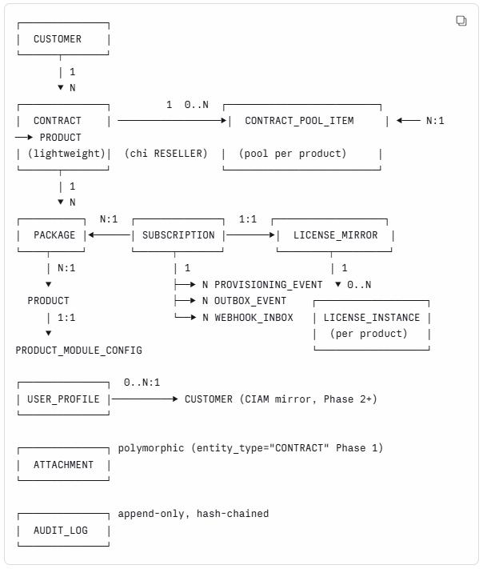

**PRODUCT REQUIREMENTS DOCUMENT**

**HỆ THỐNG ONECRM**

**Phiên bản**: 2.6

**Ngày phát hành**: 13/07/2026

**Người soạn**: Nguyễn Công Giang

## Lịch sử phiên bản

| Phiên bản | Ngày | Người soạn | Thay đổi chính |
|----|----|----|----|
| 1.0 | 15/05/2026 | Nguyễn Thị Thái Hà | Bản đầu — 3 license strategy ngang nhau, OneCRM là License Management Platform |
| 2.0 | 22/05/2026 | Nguyễn Thị Thái Hà | Tái cấu trúc — OneCRM commercial thuần, Subscription là trung tâm, 1 sub : 1 package : 1 license. Event-driven passive (CRM publish event, KHÔNG gọi product). Kiến trúc Core + Product Module pluggable. License status & event type không chuẩn hoá — per Product Module declare. LICENSE_INSTANCE forward-compat skeleton. |
| 2.1 | 10/06/2026 | Nguyễn Thị Thái Hà | Bổ sung từ họp 09/06/2026:<br>Mô hình Đại lý (Reseller) + Pool License.Kích hoạt license theo actor cấu hình (gồm Sales-trigger cho EDR).Thông tin bắt buộc trên webhook (envelope + payload per event). |
| 2.2 | 23/06/2026 | Nguyễn Công Giang | Reseller Pool Multi-Product:<br>Thêm entity CONTRACT_POOL_ITEM thay pool_total:int trên CONTRACT.FR-CONT-01: input pool_items per product.FR-CONT-03: hiển thị Pool Balance per product.FR-SUB-01/04: pool check & deduction per product_id + optimistic lock.FR-LIC-06: filter reseller/beneficiary. Bổ sung OQ-NEW-01/02.Làm rõ HĐ DIRECT nhiều product là hợp lệ.<br>Update module Customer Management |
| 2.3 | 06/07/2026 | Nguyễn Công Giang | Bổ sung đặc tả đầy đủ module M-02 Contract Management: UC-CON-03 Xem Chi tiết HĐ (giao diện 4 tab: Thông tin HĐ, Subscriptions, Timeline, Audit Log; hỗ trợ cả DIRECT & RESELLER), UC-CON-04 Cập nhật HĐ (thêm Pool License cho RESELLER), UC-CON-05 Upload/Xóa file đính kèm, UC-CON-06 Xóa HĐ (soft delete; audit log best-effort; bắt buộc lý do xóa; chặn xóa khi đã có sub). |
| 2.4 | 09/07/2026 | Nguyễn Công Giang | Bổ sung đặc tả đầy đủ module **M-03 Subscription Management** qua bộ FRS UC-SUB-01..10 (Danh sách, Tạo, Chi tiết, Chỉnh sửa, Xác nhận, Xóa Draft, Gia hạn, Thu hồi, Tạm dừng, Khôi phục) — mỗi UC kèm sơ đồ BPMN 2.0 + Acceptance Criteria + mô tả giao diện.<br>**§6.3:** thay 10 bảng FR-SUB-01..10 bằng danh sách ánh xạ FR-SUB ↔ UC-SUB + link tới FRS; giữ FR-SUB-11 (auto-transition, hàm System).<br>**Thay đổi nghiệp vụ:** (1) Gia hạn — sub kế tiếp tạo **trực tiếp ACTIVE** + predecessor **RENEWED ngay**, license_mirror vẫn theo webhook inbound từ product (bỏ mô hình DRAFT→submit của v2.3; §5.5.1); (2) Xóa Draft là **hard delete, không ghi audit**; (3) Xác nhận thêm **re-check race condition** khi confirm.<br>**Data model (§5.3.4):** thêm cột `SUBSCRIPTION.suspend_reason` (lưu khi Tạm dừng, xóa khi Khôi phục). |
| 2.5 | 13/07/2026 | Nguyễn Công Giang | Bổ sung đặc tả đầy đủ module **M-04 Product & Package Catalog** (base lại theo FRS UC-CAT-01..07) + **versioning gói theo Model A (clone-forward)**.<br>**Thay đổi nghiệp vụ lan sang M-02 / M-03** — xem **§0 Changelog v2.5 cho Dev** ngay bên dưới. |
| 2.6.1 | 13/07/2026 | Nguyễn Công Giang | **Chốt 20 Open Question của M-05** (`docs/plans/M-05_open_questions.md`):<br>· **§5.3.5 PACKAGE — bỏ trường `price`**: giai đoạn này **không có scope về giá**; gói chỉ định nghĩa số lượng license, thời lượng, danh sách tính năng.<br>· **§5.3.7 `runtime_config`** — chuẩn hoá 7 khoá cấu hình cho M-05 (chu kỳ đẩy 24h · SLA lệch 15 phút · báo gia hạn 60 ngày · sắp dùng hết 90% · `auto_reconcile_after_hours` để trống thì **không kiểm tra**).<br>· **BR-04.7 — bỏ quota theo người dùng** (vận hành cần đồng bộ hàng loạt sau sự cố).<br>· **Quy ước tên quyền toàn dự án: `{tài_nguyên}:{hành_động}`** (`license:view`, `license:force_sync`, `license:view_portal`, `license:view_issues`).<br>· On-premise: vẫn hiện trong danh sách License & Usage với nhãn "Không theo dõi tự động", **loại khỏi mọi cảnh báo**.<br>· Auditor: **xem được** danh sách + chi tiết, không có hành động tạo tác động.<br>**FRS:** bộ `UC-LIC-01..04` tại `docs/frs/licenses/`. |
| 2.6 | 13/07/2026 | Nguyễn Công Giang | Module **M-05 License Mirror & Usage Tracking**:<br>**§6.5.1 viết lại hoàn toàn** — mục tiêu module, 2 nhóm người dùng & thời điểm dùng, 4 pain point, khái niệm cốt lõi, **ranh giới CRM được/không được làm**, 3 tình huống dễ hiểu nhầm (GRACE ≠ mismatch · sub vừa gia hạn ACTIVE+mirror PENDING là hợp lệ · `used > total` là lỗi dữ liệu, không phải overage), vị trí trong luồng dữ liệu, phạm vi Phase 1.<br>**Chốt OQ-07 + quyết định mới (§6.5.1h):** (1) Force Sync gán theo **capability `usage.force_sync`** (Sales/CSKH/Manager/License Admin; Auditor không) + **quota 20 lượt/giờ/người** — bịt lỗ hổng rate-limit-theo-sub không chặn được quét hàng loạt; (2) Product Module declare **`runtime_config.supports_force_sync`** → false thì ẩn nút; (3) deep-link portal gated bằng quyền **`license:view_portal`** (chỉ là gợi ý hiển thị, **không phải bảo mật** — product tự enforce), URL lấy từ **`runtime_config.portal_url_template`**, chỉ hiện khi đã có `external_ref`, ghi audit khi click.<br>**Demo:** `docs/demo/v2.6.0_license.html`. |

---

# §0. CHANGELOG v2.5 — HƯỚNG DẪN CHO DEV

> **Đọc mục này trước khi code.** Đây là danh sách đầy đủ những gì đổi từ v2.4 → v2.5, kèm nơi cần sửa.
>
> 📄 **Bản tóm tắt cho dev (đọc trước):** [`RELEASE_NOTE_v2.5.md`](./RELEASE_NOTE_v2.5.md) — gồm checklist bàn giao.
> ⚠️ **DB hiện tại phải ALTER** — DDL + kịch bản backfill tại **§0.3** bên dưới.
>
> Nguồn quyết định: `docs/plans/M-04_versioning_decisions.md` · FRS: `docs/frs/catalog/UC-CAT-01..07`

## 0.1. Quyết định nền (đọc để hiểu vì sao)

| # | Quyết định | Tóm tắt |
|---|---|---|
| **D0** | **Model A — Clone-forward versioning** | Mỗi version gói = **1 bản ghi PACKAGE bất biến**. Trạng thái (`DRAFT`/`ACTIVE`/`RETIRED`) nằm **trên bản ghi version**. **Rollback = tạo version MỚI (v+1)** sao chép cấu hình bản cũ; bản `RETIRED` không bị sửa. **Không** dùng Model B (re-activate + bảng `activation_history`). |
| **D1** | **Grandfathering khi gia hạn** | Sub gia hạn **giữ nguyên `package_id`** — **kể cả khi gói đó đã `RETIRED`**. "Ngừng bán" là hành động **thương mại** (không chào bán KH mới), KHÔNG chấm dứt dịch vụ với KH cũ. |
| **D2** | **Phạm vi chặn của RETIRED** | **Chặn:** chọn gói khi **tạo HĐ mới** / **thêm gói vào HĐ (pool)**. **KHÔNG chặn:** tạo sub trong HĐ đã ký, và **gia hạn**. |
| **D3** | **HĐ ghim phiên bản** | `CONTRACT` / `CONTRACT_POOL_ITEM` tham chiếu `package_id` = **1 bản ghi version cụ thể**, không phải "họ gói". Catalog publish v mới hay retire v cũ **không** đụng vào HĐ đã ký. |
| **D4** | **Đổi version = Upgrade** | Không được ngầm "nâng cấp" qua đường gia hạn. Upgrade thuộc **OQ-06** — **Phase 1 trả `501 NOT_IMPLEMENTED`**. |
| **D5** | **Pool ghim theo GÓI, không theo sản phẩm** | `CONTRACT_POOL_ITEM.package_id` thay cho `product_id` làm khoá nghiệp vụ. Lý do: pool theo `product_id` cho phép đại lý rút license của gói đắt tiền từ pool mua theo giá gói rẻ → **rò rỉ giá**. |

## 0.2. Việc phải làm — theo module

### M-04 Product & Package Catalog (mới, §6.4)

| # | Việc | Chi tiết |
|---|---|---|
| C1 | **Thay toàn bộ FR-CAT-01..09 cũ** | §6.4 được viết lại, base theo FRS UC-CAT-01..07. Bảng ánh xạ FR-CAT ↔ UC-CAT ở §6.4.2. |
| C2 | **PACKAGE: bỏ `tier`, bỏ `scope_template`** | `scope` đã chuyển sang SUBSCRIPTION từ v2.4 (§5.3.4/§5.3.7). `tier` không còn dùng. |
| C3 | **PACKAGE: thêm `version`, `status`, `rolled_back_from`** | `version` INT (tăng dần trong 1 họ gói theo `product_id`+`code`); `status ∈ {DRAFT, ACTIVE, RETIRED}`; `rolled_back_from` = `package_id` bản gốc khi version này sinh ra từ rollback (lineage). |
| C4 | **Bổ sung FR còn thiếu** | v2.4 chỉ có Publish/Retire. Nay thêm: **Xóa gói nháp** (hard delete, chỉ `DRAFT`) và **Rollback** (clone-forward v+1). |
| C5 | **Audit event bắt buộc** | Mọi **Publish / Retire / Delete / Rollback** phải ghi audit có **timestamp + actor**. Đây là điểm bù cho điểm yếu của Model A (không có timeline "version nào ACTIVE lúc nào" first-class). |
| C6 | **Clone-on-edit** | Sửa gói `DRAFT` **hoặc** `ACTIVE`-chưa-có-sub → **update tại chỗ**. Sửa gói `ACTIVE`-**đã có sub** → **tạo version mới ở trạng thái `DRAFT`**, không đụng bản đang chạy. |
| C7 | **Chọn tính năng ở mức Feature** | Gói tick feature từ `featureCatalog` của sản phẩm ở **mức Feature** (không phải mức module, không tách lẻ CRUD). Feature loại **"Mặc định"** luôn được include và **khóa** (không bỏ tick được). |
| C8 | **Danh sách gói gộp theo họ** | Màn danh sách gói hiển thị **1 dòng / 1 họ gói**, chọn phiên bản hiện hành theo ưu tiên **ACTIVE > DRAFT > RETIRED**. |

### M-02 Contract Management (§5.3.2, §5.3.3, §6.2)

| # | Việc | Chi tiết |
|---|---|---|
| B1 | **`CONTRACT` ghim `package_id` = version** (D3) | HĐ `DIRECT` **bắt buộc** chọn đúng 1 gói khi tạo. Lưu `package_id` của **1 phiên bản cụ thể**. |
| B2 | **`CONTRACT_POOL_ITEM`: khoá đổi từ `product_id` → `package_id`** (D5) | ⚠️ **Đây là thay đổi schema có ảnh hưởng lớn nhất.** Pool ghim theo gói. `product_id` giữ lại làm **cột dẫn xuất/hiển thị**, KHÔNG dùng làm khoá nghiệp vụ. Unique: `(contract_id, package_id)`. |
| B3 | **Dropdown gói chỉ hiện `ACTIVE`** (D2) | Áp dụng cho: tạo HĐ (DIRECT) và thêm pool (RESELLER). Gói `DRAFT` / `RETIRED` **không** được chọn. |
| B4 | **Trừ/hoàn pool tra theo `package_id`** | Mọi chỗ trước đây `poolItems.find(p => p.product_id === X)` phải đổi sang `p.package_id === X`. |
| B5 | **Hiển thị pool theo tên gói + phiên bản** | Danh sách HĐ (cột Pool License), Chi tiết HĐ (accordion Pool), Timeline, Audit — dùng `package_name` (kèm `v{version}`) thay cho `product_name`. |

**FRS đã cập nhật:** UC-CON-01 v1.1 · **UC-CON-02 v1.1** (thêm BR-07…BR-10) · UC-CON-03 v1.5 · **UC-CON-04 v1.1** (BR-02 viết lại, thêm BR-07).

### M-03 Subscription Management (§6.3, §6.9.6)

| # | Việc | Chi tiết |
|---|---|---|
| S1 | **Gói kế thừa từ HĐ đã ghim** (D3) | Tạo sub: lấy `package_id` từ `contract.packages[0]` (DIRECT) hoặc `pool.package_id` (RESELLER). **KHÔNG** tra bản `ACTIVE` hiện hành của catalog. |
| S2 | **Gia hạn giữ nguyên `package_id`, kể cả `RETIRED`** (D1) | Không chặn gia hạn vì gói ngừng bán. `duration_months` lấy từ **đúng phiên bản đã ghim**, không phải bản mới nhất. |
| S3 | **Đổi version ≠ gia hạn** (D4) | Modal gia hạn **không có** lựa chọn đổi gói. Upgrade → OQ-06, Phase 1 trả `501`. |
| S4 | **RESELLER: 1 pool = 1 gói** | Dropdown chọn gói khi tạo sub: mỗi pool là **1 option** (không còn `optgroup` theo sản phẩm). Hint pool tra theo `package_id`. |
| S5 | **Outbound payload thêm `package_code` + `package_version`** (§6.9.6) | Event `subscription.created` / `subscription.renewed` phải gửi đủ `package_code` **và** `package_version` — Product Module cần biết **chính xác cấu hình đã bán** (YT-3), tên gói không đủ. |

**FRS đã cập nhật:** **UC-SUB-02 v1.3** (thêm BR-12) · **UC-SUB-07 v1.2** (thêm BR-10, BR-11).

## 0.3. THAY ĐỔI SCHEMA v2.4 → v2.5 *(dev đọc kỹ — DB hiện tại phải ALTER)*

> ✅ **Xác nhận 13/07/2026: DB hiện tại là DỮ LIỆU TEST, chưa lên production.**
> → **Đường thực thi = §0.3.2 (DDL) + §0.3.3 (truncate & reseed).** Xong.
> → **§0.3.4 (backfill) KHÔNG áp dụng lần này** — giữ lại làm tham chiếu cho các lần đổi schema **sau khi đã có production**.

### 0.3.1. Tóm tắt

| Bảng | Loại thay đổi | Breaking? |
|---|---|---|
| `contract_package` | **TẠO MỚI** — HĐ DIRECT ghim gói (D3, D6) | Mới |
| `contract_pool_item` | **ĐỔI KHOÁ NGHIỆP VỤ** `product_id` → `package_id` (D5) | ⚠️ **BREAKING** |
| `package` | Thêm `rolled_back_from`; siết UNIQUE theo `(product_id, code, version)` (D0) | Nhẹ |
| `subscription` | **KHÔNG ĐỔI** — `package_id` vốn đã ghim 1 version cụ thể | Không |
| `contract` | **KHÔNG ĐỔI CỘT** — gói tách sang bảng `contract_package` | Không |
| `product_module_config.package_schema` (jsonb) | Gỡ `tier`, `tenant_mode`, `scope_template` khỏi nội dung schema EDR (§6.9.3) | Data-level |

### 0.3.2. DDL

> Cú pháp PostgreSQL. Chạy trong **1 transaction**; nếu bước backfill (§0.3.3) fail thì rollback toàn bộ.

```sql
-- ── 1. PACKAGE: lineage rollback + siết unique theo version
ALTER TABLE package
  ADD COLUMN rolled_back_from UUID NULL REFERENCES package(id);
COMMENT ON COLUMN package.rolled_back_from IS
  'Version này sinh ra từ Rollback bản nào (clone-forward, D0). NULL nếu tạo mới/clone-on-edit.';

-- v2.4 unique (product_id, code) sai với versioning — 1 họ gói có nhiều version
ALTER TABLE package DROP CONSTRAINT IF EXISTS package_product_code_uniq;
ALTER TABLE package
  ADD CONSTRAINT package_family_version_uniq UNIQUE (product_id, code, version);

-- ── 2. CONTRACT_PACKAGE: bảng mới — HĐ DIRECT ghim gói
CREATE TABLE contract_package (
  id          UUID PRIMARY KEY,
  contract_id UUID NOT NULL REFERENCES contract(id) ON DELETE CASCADE,
  package_id  UUID NOT NULL REFERENCES package(id),
  created_at  TIMESTAMPTZ NOT NULL DEFAULT now(),
  CONSTRAINT contract_package_uniq UNIQUE (contract_id, package_id)
);
-- Phase 1: ĐÚNG 1 gói / 1 HĐ DIRECT (D6). Enforce ở DB:
CREATE UNIQUE INDEX contract_package_one_per_contract ON contract_package (contract_id);
-- ↑ Phase sau muốn mở nhiều gói/HĐ: chỉ DROP INDEX này, không đổi schema.

-- ── 3. CONTRACT_POOL_ITEM: khoá đổi từ product_id → package_id  ⚠️ BREAKING
--    DB là dữ liệu test → xóa sạch pool cũ, KHÔNG backfill (xem §0.3.3)
TRUNCATE TABLE contract_pool_item;

ALTER TABLE contract_pool_item
  ADD COLUMN package_id UUID NOT NULL REFERENCES package(id);
ALTER TABLE contract_pool_item DROP CONSTRAINT IF EXISTS contract_pool_item_contract_product_uniq;
ALTER TABLE contract_pool_item
  ADD CONSTRAINT contract_pool_item_contract_package_uniq UNIQUE (contract_id, package_id);
COMMENT ON COLUMN contract_pool_item.product_id IS
  'CỘT DẪN XUẤT từ package.product_id — chỉ dùng hiển thị/lọc. KHÔNG dùng làm khoá nghiệp vụ (D5).';
```

> ⚠️ `TRUNCATE contract_pool_item` chỉ hợp lệ vì **DB đang là dữ liệu test**. Nếu tới lúc chạy migration mà DB **đã có số liệu hợp đồng thật**, **DỪNG LẠI** và làm theo **§0.3.4 (backfill)** thay vì truncate.

**Quy tắc bất di bất dịch sau migration:**

- `UNIQUE (contract_id, package_id)` — **1 pool = 1 gói**. **Tuyệt đối không nới** thành `(contract_id, product_id)`: nới ra là cho phép đại lý rút license **gói đắt** (vd CMC EPR ~4.5tr/seat) từ pool đã mua theo giá **gói rẻ** (vd CMC EPP ~800k/seat) → **rò rỉ giá, sai tiền thật**.
- 1 HĐ RESELLER có **N pool**; hai gói khác nhau của **cùng một sản phẩm** vẫn là **2 pool riêng biệt**.
- Mọi truy vấn trừ/kiểm tra pool phải join theo `package_id` của subscription, **không** theo `product_id`.

### 0.3.3. Reseed dữ liệu test ✅ *(ĐƯỜNG THỰC THI LẦN NÀY)*

DB là dữ liệu test → **không backfill**. Sau khi chạy DDL §0.3.2:

| Bảng | Việc |
|---|---|
| `contract_pool_item` | Đã `TRUNCATE` trong DDL. **Reseed** pool mới: mỗi dòng ghim `package_id` = 1 gói `ACTIVE`. Một HĐ RESELLER được có **nhiều pool** (mỗi pool 1 gói khác nhau, kể cả các gói cùng sản phẩm). |
| `contract_package` | Bảng mới → **seed**: mỗi HĐ `DIRECT` **đúng 1 dòng**, `package_id` = gói `ACTIVE`. |
| `package` | Seed lại theo Model A: mỗi version = 1 bản ghi riêng, `(product_id, code, version)` unique. Có ít nhất 1 họ gói **đa version** (vd `DRAFT` + `ACTIVE` + `RETIRED`) để test được luồng Publish / Retire / Rollback. |
| `subscription` | Kiểm tra `package_id` trỏ tới bản ghi `package` **có thật**. Nên có ≥ 1 sub trỏ gói **`RETIRED`** để test **grandfathering** (D1 — gia hạn vẫn phải chạy được). |

**Bộ seed tham chiếu:** `docs/demo/v2.5.0_catalog.html` (`CAT_PACKAGES`, `conContracts`) — đã dựng sẵn đúng các tình huống trên: gói đa version, HĐ RESELLER 2 pool, gói `RETIRED` đang có sub.

**Rào chắn sau reseed** — cả 3 query phải trả **0 dòng**:

```sql
-- (a) Pool trỏ gói không tồn tại
SELECT * FROM contract_pool_item p
  WHERE NOT EXISTS (SELECT 1 FROM package k WHERE k.id = p.package_id);

-- (b) product_id lệch với package.product_id (cột dẫn xuất phải khớp)
SELECT p.* FROM contract_pool_item p
  JOIN package k ON k.id = p.package_id
  WHERE p.product_id <> k.product_id;

-- (c) HĐ DIRECT không có đúng 1 gói
SELECT c.id, COUNT(cp.id) AS so_goi FROM contract c
  LEFT JOIN contract_package cp ON cp.contract_id = c.id
  WHERE c.type = 'DIRECT' GROUP BY c.id HAVING COUNT(cp.id) <> 1;
```

---

### 0.3.4. Backfill `contract_pool_item.package_id` — ⏸ **KHÔNG dùng lần này**

> **Chỉ áp dụng khi DB đã có số liệu hợp đồng THẬT.** Lần migration này DB là test → dùng §0.3.3 (reseed) thay thế.
> Giữ mục này để tham chiếu cho các lần đổi schema sau khi lên production.

Khi đó, thay `TRUNCATE` trong DDL bằng: thêm cột `package_id` **NULL tạm** → chạy backfill dưới đây → `SET NOT NULL` → thêm UNIQUE.

**Bước 1 — Phân loại pool đang có:**

```sql
-- Pool "SẠCH": mọi sub trong pool cùng 1 gói → backfill tự động được
-- Pool "BẨN":  sub trong pool thuộc ≥ 2 gói khác nhau → PHẢI TÁCH TAY
SELECT p.id AS pool_id, p.contract_id, p.product_id, p.pool_total, p.allocated_qty,
       COUNT(DISTINCT s.package_id) AS so_goi,
       ARRAY_AGG(DISTINCT s.package_id) AS cac_goi
FROM contract_pool_item p
LEFT JOIN subscription s
  ON s.contract_id = p.contract_id
 AND s.package_id IN (SELECT id FROM package WHERE product_id = p.product_id)
GROUP BY p.id, p.contract_id, p.product_id, p.pool_total, p.allocated_qty
ORDER BY so_goi DESC;
```

**Bước 2 — Xử lý theo từng nhóm:**

| Nhóm | `so_goi` | Cách xử lý |
|---|---|---|
| **Sạch** | `= 1` | `UPDATE contract_pool_item SET package_id = <gói đó>` — **tự động**. |
| **Rỗng** (pool chưa có sub nào) | `= 0` | **Không đoán được.** Gán `package_id` = gói `ACTIVE` của sản phẩm đó **chỉ khi sản phẩm có đúng 1 gói ACTIVE**; nếu có ≥ 2 gói → **BA/Sales tra hợp đồng giấy** để chọn. |
| **Bẩn** | `≥ 2` | ⛔ **KHÔNG có lời giải tự động.** Phải **tách thành N pool item** và **chia lại `pool_total`** — xem bên dưới. |

**Vì sao pool "bẩn" không tự động được:** giả sử pool `CMC EDR / pool_total=500 / allocated=300`, trong đó 250 sub dùng gói **CMC EPP v1** và 50 sub dùng gói **CMC EPR v1**. Máy biết 250 và 50 đã dùng, nhưng **200 seat còn trống thuộc pool nào thì chỉ hợp đồng giấy mới trả lời được**. Gán bừa 200 seat sang pool EPR = cho đại lý rút 200 license giá 4.5tr bằng tiền đã trả cho gói 800k.

**Quy trình tách pool bẩn (bắt buộc có BA/Sales ký xác nhận):**

1. BA/Sales mở **hợp đồng khung gốc**, xác định `pool_total` cam kết **cho từng gói**.
2. Dev tạo N pool item mới: mỗi gói 1 dòng, `package_id` = gói đó, `pool_total` = số BA xác nhận, `allocated_qty` = `COUNT` sub thực tế của gói đó.
3. Kiểm tra bất biến: `Σ pool_total mới` **=** `pool_total cũ` và `Σ allocated_qty mới` **=** `allocated_qty cũ`. Lệch → **dừng, hỏi lại BA**, không tự cân.
4. Xóa pool item cũ. Ghi `AUDIT_LOG` cho từng thao tác tách (actor = người chạy migration).

**Bước 3 — Rào chắn trước khi `SET NOT NULL`:**

```sql
-- Phải trả về 0 dòng, nếu không thì DỪNG, chưa được siết NOT NULL
SELECT id, contract_id, product_id FROM contract_pool_item WHERE package_id IS NULL;
```

> **Không đụng anchor YT-1 / YT-4.** Mức độ tác động M-02 / M-03: **MEDIUM**.

## 0.4. Open Questions còn treo (Phase sau)

| OQ | Nội dung |
|---|---|
| **OQ-CAT-01** | **EOL (End of Life)** — tách `RETIRED` (thương mại, gia hạn vẫn OK) khỏi `EOL` (kỹ thuật, Product khai tử → gia hạn KHÔNG được, phải migrate). EOL là quyết định của **Product Module**, không phải CRM (YT-1). |
| **OQ-CAT-02** | **Hint upsell** khi gia hạn trên gói `RETIRED` ("Gói đã ngừng bán, bản hiện hành là v{n}") → biến dọn catalog thành cơ hội bán (YT-2). |
| **OQ-CAT-03** | Bắt buộc **`change_note`** cho mỗi version + màn **so sánh diff 2 version**? |
| **OQ-CAT-04** | **On-prem = perpetual** (trọn đời) — có kèm **maintenance term** (cái renew được) không? Ảnh hưởng YT-2. |

---

## MỤC LỤC

# Contents

[Lịch sử phiên bản [2](#lịch-sử-phiên-bản)](#lịch-sử-phiên-bản)

[MỤC LỤC [3](#mục-lục)](#mục-lục)

[1. GIỚI THIỆU [13](#giới-thiệu)](#giới-thiệu)

[1.1. Mục đích tài liệu [13](#mục-đích-tài-liệu)](#mục-đích-tài-liệu)

[1.2. Đối tượng đọc [13](#đối-tượng-đọc)](#đối-tượng-đọc)

[1.3. Phạm vi tài liệu [13](#phạm-vi-tài-liệu)](#phạm-vi-tài-liệu)

[1.4. Tham chiếu [13](#tham-chiếu)](#tham-chiếu)

[2. TỔNG QUAN SẢN PHẨM [14](#tổng-quan-sản-phẩm)](#tổng-quan-sản-phẩm)

[2.1. Bối cảnh [14](#bối-cảnh)](#bối-cảnh)

[2.2. Vai trò OneCRM [14](#vai-trò-onecrm)](#vai-trò-onecrm)

[2.3. Lộ trình triển khai [14](#lộ-trình-triển-khai)](#lộ-trình-triển-khai)

[2.4. Phạm vi đặc tả trong PRD (Core + EDR) [15](#phạm-vi-đặc-tả-trong-prd-core-edr)](#phạm-vi-đặc-tả-trong-prd-core-edr)

[3. ANCHOR — 5 YẾU TỐ CỐT LÕI [16](#anchor-5-yếu-tố-cốt-lõi)](#anchor-5-yếu-tố-cốt-lõi)

[3.1. YT-1: Vai trò OneCRM [16](#yt-1-vai-trò-onecrm)](#yt-1-vai-trò-onecrm)

[3.2. YT-2: Mô hình thương mại [16](#yt-2-mô-hình-thương-mại)](#yt-2-mô-hình-thương-mại)

[3.3. YT-3: Cách CRM tương tác với product — Event-driven Passive [16](#yt-3-cách-crm-tương-tác-với-product-event-driven-passive)](#yt-3-cách-crm-tương-tác-với-product-event-driven-passive)

[3.4. YT-4: Phạm vi license trong CRM [17](#yt-4-phạm-vi-license-trong-crm)](#yt-4-phạm-vi-license-trong-crm)

[3.5. YT-5: Roadmap Phase [17](#yt-5-roadmap-phase)](#yt-5-roadmap-phase)

[3.6. Anchor cố định (chi tiết) [17](#anchor-cố-định-chi-tiết)](#anchor-cố-định-chi-tiết)

[4. PERSONAS & EXTERNAL ACTORS [18](#personas-external-actors)](#personas-external-actors)

[4.1. Personas nội bộ (User của OneCRM) [18](#personas-nội-bộ-user-của-onecrm)](#personas-nội-bộ-user-của-onecrm)

[4.2. External Actors [18](#external-actors)](#external-actors)

[4.3. Ranh giới OneCRM ↔ Product Backend [18](#ranh-giới-onecrm-product-backend)](#ranh-giới-onecrm-product-backend)

[4.4. Phạm vi triển khai: SaaS vs On-premise [19](#phạm-vi-triển-khai-saas-vs-on-premise)](#phạm-vi-triển-khai-saas-vs-on-premise)

[5. MÔ HÌNH DỮ LIỆU [20](#mô-hình-dữ-liệu)](#mô-hình-dữ-liệu)

[5.1. ERD Conceptual [20](#erd-conceptual)](#erd-conceptual)

[5.2. Cardinality [20](#cardinality)](#cardinality)

[5.3. Entity Detail [21](#entity-detail)](#entity-detail)

[5.3.1. CUSTOMER [21](#customer)](#customer)

[5.3.2. CONTRACT (lightweight) [22](#contract-lightweight)](#contract-lightweight)

[5.3.3. CONTRACT_POOL_ITEM [22](#contract_pool_item)](#contract_pool_item)

[5.3.4. SUBSCRIPTION [23](#subscription)](#subscription)

[5.3.5. PACKAGE [24](#package)](#package)

[5.3.6. PRODUCT [24](#product)](#product)

[5.3.7. PRODUCT_MODULE_CONFIG [25](#product_module_config)](#product_module_config)

[5.3.8. LICENSE_MIRROR [25](#license_mirror)](#license_mirror)

[5.3.9. LICENSE_INSTANCE (skeleton Phase 1) [26](#license_instance-skeleton-phase-1)](#license_instance-skeleton-phase-1)

[5.3.10. PROVISIONING_EVENT [26](#provisioning_event)](#provisioning_event)

[5.3.11. OUTBOX_EVENT [26](#outbox_event)](#outbox_event)

[5.3.12. WEBHOOK_INBOX [27](#webhook_inbox)](#webhook_inbox)

[5.3.13. ATTACHMENT (polymorphic) [27](#attachment-polymorphic)](#attachment-polymorphic)

[5.3.14. AUDIT_LOG [28](#audit_log)](#audit_log)

[5.3.15. USER_PROFILE (Phase 2+ skeleton) [28](#user_profile-phase-2-skeleton)](#user_profile-phase-2-skeleton)

[5.4. Ràng buộc Unique (Customer) [28](#ràng-buộc-unique-customer)](#ràng-buộc-unique-customer)

[5.5. State Machine [29](#state-machine)](#state-machine)

[5.5.1. SUBSCRIPTION Lifecycle [29](#subscription-lifecycle)](#subscription-lifecycle)

[5.5.2. LICENSE_MIRROR.status [29](#license_mirror.status)](#license_mirror.status)

[5.5.3. OUTBOX_EVENT Lifecycle [29](#outbox_event-lifecycle)](#outbox_event-lifecycle)

[5.5.4. WEBHOOK_INBOX Lifecycle [29](#webhook_inbox-lifecycle)](#webhook_inbox-lifecycle)

[5.5.5. Ngày tháng & Nguồn sự thật (Date Model) [30](#ngày-tháng-nguồn-sự-thật-date-model)](#ngày-tháng-nguồn-sự-thật-date-model)

[6. ĐẶC TẢ CHỨC NĂNG THEO MODULE [30](#đặc-tả-chức-năng-theo-module)](#đặc-tả-chức-năng-theo-module)

[6.1. M-01 Customer Management [31](#m-01-customer-management)](#m-01-customer-management)

[6.1.1. Mô tả nghiệp vụ [31](#mô-tả-nghiệp-vụ)](#mô-tả-nghiệp-vụ)

[6.1.2. Đặc tả chi tiết — Danh sách FRS (UC-CUS) [31](#đặc-tả-chi-tiết-danh-sách-frs-uc-cus)](#đặc-tả-chi-tiết-danh-sách-frs-uc-cus)

[6.2. M-02 Contract Management [70](#m-02-contract-management)](#m-02-contract-management)

[6.2.1. Mô tả nghiệp vụ [70](#mô-tả-nghiệp-vụ-1)](#mô-tả-nghiệp-vụ-1)

[6.2.2. Đặc tả chi tiết — Danh sách FRS (UC-CON) [71](#đặc-tả-chi-tiết-danh-sách-frs-uc-con)](#đặc-tả-chi-tiết-danh-sách-frs-uc-con)

[6.3. M-03 Subscription Management [102](#m-03-subscription-management)](#m-03-subscription-management)

[6.3.1. Mô tả nghiệp vụ [102](#mô-tả-nghiệp-vụ-2)](#mô-tả-nghiệp-vụ-2)

[6.3.2. Đặc tả chi tiết — Danh sách FRS (UC-SUB) [103](#đặc-tả-chi-tiết-danh-sách-frs-uc-sub)](#đặc-tả-chi-tiết-danh-sách-frs-uc-sub)

[6.3.3. FR-SUB-11: Auto-transition on License State Change [104](#fr-sub-11-auto-transition-on-license-state-change)](#fr-sub-11-auto-transition-on-license-state-change)

[6.4. M-04 Product & Package Catalog [109](#m-04-product-package-catalog)](#m-04-product-package-catalog)

[6.4.1. Mô tả nghiệp vụ [109](#mô-tả-nghiệp-vụ-3)](#mô-tả-nghiệp-vụ-3)

[6.4.2. FR-CAT-01: Register Product into Catalog [109](#fr-cat-01-register-product-into-catalog)](#fr-cat-01-register-product-into-catalog)

[6.4.3. FR-CAT-02: Update Product Runtime Config [110](#fr-cat-02-update-product-runtime-config)](#fr-cat-02-update-product-runtime-config)

[6.4.4. FR-CAT-03: View Product Detail [110](#fr-cat-03-view-product-detail)](#fr-cat-03-view-product-detail)

[6.4.5. FR-CAT-04: List Products [111](#fr-cat-04-list-products)](#fr-cat-04-list-products)

[6.4.6. FR-CAT-05: Create Package [111](#fr-cat-05-create-package)](#fr-cat-05-create-package)

[6.4.7. FR-CAT-06: Update Package [112](#fr-cat-06-update-package)](#fr-cat-06-update-package)

[6.4.8. FR-CAT-07: View Package Detail [112](#fr-cat-07-view-package-detail)](#fr-cat-07-view-package-detail)

[6.4.9. FR-CAT-08: Search & List Packages [112](#fr-cat-08-search-list-packages)](#fr-cat-08-search-list-packages)

[6.4.10. FR-CAT-09: Publish / Retire Package [113](#fr-cat-09-publish-retire-package)](#fr-cat-09-publish-retire-package)

[6.5. M-05 License Mirror & Usage Tracking [114](#m-05-license-mirror-usage-tracking)](#m-05-license-mirror-usage-tracking)

[6.5.1. Mô tả nghiệp vụ [114](#mô-tả-nghiệp-vụ-4)](#mô-tả-nghiệp-vụ-4)

[6.5.2. FR-LIC-01: View License Mirror Detail [114](#fr-lic-01-view-license-mirror-detail)](#fr-lic-01-view-license-mirror-detail)

[6.5.3. FR-LIC-02: Update License Status (System) [114](#fr-lic-02-update-license-status-system)](#fr-lic-02-update-license-status-system)

[6.5.4. FR-LIC-03: Update Usage Snapshot (System) [115](#fr-lic-03-update-usage-snapshot-system)](#fr-lic-03-update-usage-snapshot-system)

[6.5.5. FR-LIC-04: Force Sync Usage (Sales) [116](#fr-lic-04-force-sync-usage-sales)](#fr-lic-04-force-sync-usage-sales)

[6.5.6. FR-LIC-05: List License Instances [116](#fr-lic-05-list-license-instances)](#fr-lic-05-list-license-instances)

[6.5.7. FR-LIC-06: Search License Mirrors [117](#fr-lic-06-search-license-mirrors)](#fr-lic-06-search-license-mirrors)

[6.5.8. FR-LIC-07: Detect Sub ↔ License Mirror Mismatch (System + Admin) [117](#fr-lic-07-detect-sub-license-mirror-mismatch-system-admin)](#fr-lic-07-detect-sub-license-mirror-mismatch-system-admin)

[6.6. M-06 Provisioning Timeline [118](#m-06-provisioning-timeline)](#m-06-provisioning-timeline)

[6.6.1. Mô tả nghiệp vụ [118](#mô-tả-nghiệp-vụ-5)](#mô-tả-nghiệp-vụ-5)

[6.6.2. FR-EVT-01: View Timeline of Subscription [118](#fr-evt-01-view-timeline-of-subscription)](#fr-evt-01-view-timeline-of-subscription)

[6.6.3. FR-EVT-02: System Append Event (from webhook) [119](#fr-evt-02-system-append-event-from-webhook)](#fr-evt-02-system-append-event-from-webhook)

[6.6.4. FR-EVT-03: Search Timeline Events (Cross-sub) [120](#fr-evt-03-search-timeline-events-cross-sub)](#fr-evt-03-search-timeline-events-cross-sub)

[6.7. M-07 Integration Layer [120](#m-07-integration-layer)](#m-07-integration-layer)

[6.7.1. Mô tả nghiệp vụ [120](#mô-tả-nghiệp-vụ-6)](#mô-tả-nghiệp-vụ-6)

[6.7.2. FR-INT-01: Publish Outbound Event (Internal API) [121](#fr-int-01-publish-outbound-event-internal-api)](#fr-int-01-publish-outbound-event-internal-api)

[6.7.3. FR-INT-02: Outbox Publisher Worker [121](#fr-int-02-outbox-publisher-worker)](#fr-int-02-outbox-publisher-worker)

[6.7.4. FR-INT-03: Webhook Receiver Endpoint [122](#fr-int-03-webhook-receiver-endpoint)](#fr-int-03-webhook-receiver-endpoint)

[6.7.5. FR-INT-04: Webhook Processor Worker [123](#fr-int-04-webhook-processor-worker)](#fr-int-04-webhook-processor-worker)

[6.7.6. FR-INT-05: View Outbox & Webhook Inbox (Admin) [124](#fr-int-05-view-outbox-webhook-inbox-admin)](#fr-int-05-view-outbox-webhook-inbox-admin)

[6.7.7. FR-INT-06: Manual Retry / Reprocess [124](#fr-int-06-manual-retry-reprocess)](#fr-int-06-manual-retry-reprocess)

[6.8. M-08 Audit & Notification [125](#m-08-audit-notification)](#m-08-audit-notification)

[6.8.1. Mô tả nghiệp vụ [125](#mô-tả-nghiệp-vụ-7)](#mô-tả-nghiệp-vụ-7)

[6.8.2. FR-AUD-01: Append Audit Log (Internal API) [125](#fr-aud-01-append-audit-log-internal-api)](#fr-aud-01-append-audit-log-internal-api)

[6.8.3. FR-AUD-02: View / Search Audit Log [125](#fr-aud-02-view-search-audit-log)](#fr-aud-02-view-search-audit-log)

[6.8.4. FR-AUD-03: Verify Hash Chain Integrity [126](#fr-aud-03-verify-hash-chain-integrity)](#fr-aud-03-verify-hash-chain-integrity)

[6.8.5. FR-NOT-01: Send Notification (Internal) [127](#fr-not-01-send-notification-internal)](#fr-not-01-send-notification-internal)

[6.8.6. FR-NOT-02: Manage Notification Templates [127](#fr-not-02-manage-notification-templates)](#fr-not-02-manage-notification-templates)

[6.8.7. FR-NOT-03: View Notification History [128](#fr-not-03-view-notification-history)](#fr-not-03-view-notification-history)

[6.8.8. FR-NOT-04: Time-based Notification Scheduler [128](#fr-not-04-time-based-notification-scheduler)](#fr-not-04-time-based-notification-scheduler)

[6.9. PM-01 EDR Module (full functional Phase 1) [129](#pm-01-edr-module-full-functional-phase-1)](#pm-01-edr-module-full-functional-phase-1)

[6.9.1. Mô tả nghiệp vụ [129](#mô-tả-nghiệp-vụ-8)](#mô-tả-nghiệp-vụ-8)

[Pro6.9.2. Section 1 — Module Registration [129](#pro6.9.2.-section-1-module-registration)](#pro6.9.2.-section-1-module-registration)

[6.9.3. Section 2 — Package Schema [130](#section-2-package-schema)](#section-2-package-schema)

[6.9.4. Section 3 — License Status Set + Mapping [130](#section-3-license-status-set-mapping)](#section-3-license-status-set-mapping)

[6.9.5. Section 4 — Usage Snapshot Schema [130](#section-4-usage-snapshot-schema)](#section-4-usage-snapshot-schema)

[6.9.6. Section 5 — Outbound Event Mapping [131](#section-5-outbound-event-mapping)](#section-5-outbound-event-mapping)

[6.9.7. Section 6 — Inbound Event Mapping [131](#section-6-inbound-event-mapping)](#section-6-inbound-event-mapping)

[6.9.8. Section 7 — Provisioning Timeline Display Templates [131](#section-7-provisioning-timeline-display-templates)](#section-7-provisioning-timeline-display-templates)

[6.9.9. Section 8 — Runtime Config [132](#section-8-runtime-config)](#section-8-runtime-config)

[6.9.10. EDR-specific Functions [132](#edr-specific-functions)](#edr-specific-functions)

[6.9.10.1. FR-EDR-01: EDR Package Schema Validator [132](#fr-edr-01-edr-package-schema-validator)](#fr-edr-01-edr-package-schema-validator)

[6.9.10.2. FR-EDR-02: EDR Inbound Event Mapper [133](#fr-edr-02-edr-inbound-event-mapper)](#fr-edr-02-edr-inbound-event-mapper)

[6.9.10.3. FR-EDR-03: EDR Outbound Event Builder [133](#fr-edr-03-edr-outbound-event-builder)](#fr-edr-03-edr-outbound-event-builder)

[6.9.11. Scope PM-01 (EDR — đặc tả đầy đủ trong PRD, triển khai Phase 2) [134](#scope-pm-01-edr-đặc-tả-đầy-đủ-trong-prd-triển-khai-phase-2)](#scope-pm-01-edr-đặc-tả-đầy-đủ-trong-prd-triển-khai-phase-2)

[6.10. PM-02 C-Shield Module (declaration skeleton Phase 1) [134](#pm-02-c-shield-module-declaration-skeleton-phase-1)](#pm-02-c-shield-module-declaration-skeleton-phase-1)

[6.10.1. Mô tả nghiệp vụ [134](#mô-tả-nghiệp-vụ-9)](#mô-tả-nghiệp-vụ-9)

[6.10.2. Section 1 — Module Registration [134](#section-1-module-registration)](#section-1-module-registration)

[6.10.3. Section 2 — Package Schema (tentative) [135](#section-2-package-schema-tentative)](#section-2-package-schema-tentative)

[6.10.4. Section 3 — License Status Set (tentative) [135](#section-3-license-status-set-tentative)](#section-3-license-status-set-tentative)

[6.10.5. Section 4 — Usage Snapshot Schema (tentative) [135](#section-4-usage-snapshot-schema-tentative)](#section-4-usage-snapshot-schema-tentative)

[6.10.6. Section 5 — LICENSE_INSTANCE Schema (Phase 3+) [135](#section-5-license_instance-schema-phase-3)](#section-5-license_instance-schema-phase-3)

[6.10.7. Section 6 — Outbound/Inbound Mapping (tentative) [136](#section-6-outboundinbound-mapping-tentative)](#section-6-outboundinbound-mapping-tentative)

[6.10.8. Scope PM-02 (skeleton trong PRD) [136](#scope-pm-02-skeleton-trong-prd)](#scope-pm-02-skeleton-trong-prd)

[6.11. PM-03 AV Module (declaration skeleton Phase 1) [136](#pm-03-av-module-declaration-skeleton-phase-1)](#pm-03-av-module-declaration-skeleton-phase-1)

[6.11.1. Mô tả nghiệp vụ [136](#mô-tả-nghiệp-vụ-10)](#mô-tả-nghiệp-vụ-10)

[6.11.2. Section 1 — Module Registration [136](#section-1-module-registration-1)](#section-1-module-registration-1)

[6.11.3. Section 2 — Package Schema (tentative) [136](#section-2-package-schema-tentative-1)](#section-2-package-schema-tentative-1)

[6.11.4. Section 3 — License Status Set (tentative) [137](#section-3-license-status-set-tentative-1)](#section-3-license-status-set-tentative-1)

[6.11.5. Section 4 — Usage Snapshot (tentative) [137](#section-4-usage-snapshot-tentative)](#section-4-usage-snapshot-tentative)

[6.11.6. Section 5 — LICENSE_INSTANCE Schema (Phase 4) [137](#section-5-license_instance-schema-phase-4)](#section-5-license_instance-schema-phase-4)

[6.11.7. Section 6 — Outbound/Inbound Mapping (tentative) [137](#section-6-outboundinbound-mapping-tentative-1)](#section-6-outboundinbound-mapping-tentative-1)

[6.11.8. Scope PM-03 (skeleton trong PRD) [138](#scope-pm-03-skeleton-trong-prd)](#scope-pm-03-skeleton-trong-prd)

[7. CASE STUDY [138](#case-study)](#case-study)

[7.1. Bối cảnh [138](#bối-cảnh-1)](#bối-cảnh-1)

[7.2. Luồng tạo subscription end-to-end [138](#luồng-tạo-subscription-end-to-end)](#luồng-tạo-subscription-end-to-end)

[7.3. Scenario A — Sales force-sync usage [140](#scenario-a-sales-force-sync-usage)](#scenario-a-sales-force-sync-usage)

[7.4. Scenario B — Sales suspend sub [141](#scenario-b-sales-suspend-sub)](#scenario-b-sales-suspend-sub)

[7.5. Scenario C — Renewal proactive [141](#scenario-c-renewal-proactive)](#scenario-c-renewal-proactive)

[7.6. Scenario D — License vào GRACE (license expired but KH vẫn dùng được) [141](#scenario-d-license-vào-grace-license-expired-but-kh-vẫn-dùng-được)](#scenario-d-license-vào-grace-license-expired-but-kh-vẫn-dùng-được)

[8. YÊU CẦU PHI CHỨC NĂNG (NFR) [142](#yêu-cầu-phi-chức-năng-nfr)](#yêu-cầu-phi-chức-năng-nfr)

[8.1. Performance [142](#performance)](#performance)

[8.2. Reliability [142](#reliability)](#reliability)

[8.3. Security [142](#security)](#security)

[8.4. Scalability [143](#scalability)](#scalability)

[8.5. Maintainability [143](#maintainability)](#maintainability)

[8.6. Observability [144](#observability)](#observability)

[8.7. Forward Compatibility [144](#forward-compatibility)](#forward-compatibility)

[8.8. Data Privacy & Compliance (PII KH B2C) [144](#data-privacy-compliance-pii-kh-b2c)](#data-privacy-compliance-pii-kh-b2c)

[9. ACCEPTANCE CRITERIA [145](#acceptance-criteria-8)](#acceptance-criteria-8)

[9.1. AC Functional Phase 1 [145](#ac-functional-phase-1)](#ac-functional-phase-1)

[9.2. AC Non-Functional Phase 1 [145](#ac-non-functional-phase-1)](#ac-non-functional-phase-1)

[10. PHỤ THUỘC KỸ THUẬT [146](#phụ-thuộc-kỹ-thuật)](#phụ-thuộc-kỹ-thuật)

[11. OPEN QUESTIONS [146](#open-questions)](#open-questions)

[12. GLOSSARY [147](#glossary)](#glossary)

[13. PHÊ DUYỆT [148](#phê-duyệt)](#phê-duyệt)

# GIỚI THIỆU

## Mục đích tài liệu

Tài liệu này đặc tả yêu cầu chức năng và phi chức năng của OneCRM — hệ thống CRM thương mại tập trung cho hệ sinh thái sản phẩm cybersecurity của CMC Cybersecurity.

PRD được viết với mức chi tiết đủ để team kỹ thuật bắt đầu thiết kế (Architecture, Database, API Spec) và team QA viết Test Plan, không cần bước trung gian FSD riêng cho hầu hết module.

## Đối tượng đọc

- **Product Manager/Business Owner**: hiểu phạm vi, ưu tiên

- **Software Architect**: thiết kế kiến trúc, lựa chọn công nghệ

- **Backend Developer**: hiểu yêu cầu chức năng, thiết kế API

- **QA Engineer**: viết test case, test plan

- **Sales/CSKH lead**: hiểu năng lực hệ thống và workflow nghiệp vụ

## Phạm vi tài liệu

- **In scope**

<!-- -->

- Yêu cầu chức năng theo module

- Mô hình dữ liệu conceptual + detail

- Pattern tích hợp với sản phẩm

- Yêu cầu phi chức năng

- Acceptance Criteria Phase 1

- Case study minh hoạ

<!-- -->

- **Out of scope**

<!-- -->

- Kiến trúc kỹ thuật chi tiết (Architecture Design)

- Database schema DDL/index (Database Design)

- API contract OpenAPI spec (API Specification)

- UX/UI mockup (UX Spec)

- Test cases chi tiết (Test Plan)

- Deployment, CI/CD (DevOps Doc)

- Compliance pháp lý chi tiết (Privacy/Security Doc)

- Lead/Opportunity, Combo, Promotion, Invoice

## Tham chiếu

- BRD v2.0 — OneCRM Business Requirements Document

- Tài liệu kiến trúc license EDR (Product team EDR/EPP)

- Tài liệu license C-Shield SDK Server (Product team Mobile)

# TỔNG QUAN SẢN PHẨM

## Bối cảnh

CMC Cybersecurity có nhiều sản phẩm với cơ chế bán/license khác nhau, mỗi sản phẩm hiện có CRM hoặc cơ chế quản lý riêng → phân mảnh, không có cái nhìn tổng thể về khách hàng, khó mở rộng khi có sản phẩm mới.

OneCRM ra đời để giải quyết: 1 nền tảng CRM thương mại tập trung, kiến trúc pluggable cho mọi sản phẩm cybersecurity của công ty.

## Vai trò OneCRM

**OneCRM là Commercial CRM passive-observer** với 2 lớp:

┌──────────────────────────────────────────────┐\
│ CORE (dùng chung mọi product) │\
│ - Customer Master │\
│ - Contract (lightweight) │\
│ - Subscription Management │\
│ - Product & Package Catalog │\
│ - License Mirror & Usage Tracking │\
│ - Provisioning Timeline │\
│ - Integration Layer (Event Bus + Webhook) │\
│ - Audit & Notification │\
└──────────────┬──────────────────────────────┘\
│ register\
┌──────────────▼──────────────────────────────┐\
│ PRODUCT MODULES (per-product, pluggable) │\
│ ┌─────────────┐ ┌────────────┐ ┌─────────┐ │\
│ │ EDR Module │ │ C-Shield │ │ AV │ │\
│ │ (Phase 2) │ │ (Phase 3) │ │(Phase 4) │ │\
│ └─────────────┘ └────────────┘ └─────────┘ │\
│ │\
│ Mỗi module khai báo: │\
│ - Package schema (Sales được phép config) │\
│ - License status set + mapping → sub state │\
│ - Usage snapshot schema │\
│ - Provisioning event types + templates │\
│ - Outbound + Inbound event mapping │\
│ - Runtime config (notification, intervals) │\
└──────────────────────────────────────────────┘

Thêm product mới = thêm 1 Product Module + register vào catalog, không sửa core.

## Lộ trình triển khai

Phân biệt phạm vi phân tích vs phase triển khai:

- PRD này đặc tả Core (M-01 → M-08) + EDR Module đầy đủ nhằm đánh giá mức độ khả thi và ước lượng nguồn lực cho cả nền tảng lẫn product integration đầu tiên.

- Về triển khai thực tế, EDR rollout ở Phase 2 (Phase 1 là nền tảng Core). Việc đặc tả EDR đầy đủ trong PRD không đồng nghĩa EDR ship ngay Phase 1.

| Phase | Phạm vi | Mức độ |
|----|----|----|
| Phase 1 | OneCRM Core (M-01 → M-08) — nền tảng dùng chung | Cao nhất |
| Phase 2 | EDR Module full functional (SaaS) | Cao |
| Phase 3 | C-Shield Module (đang đánh giá lại hình thức cấp license) | Trung |
| Phase 4 | AV Module + migration data AV cũ (sản phẩm nhỏ, không trọng điểm) | Thấp |
| Phase 5+ | CA và sản phẩm mới — chỉ thêm module | Mở rộng |

Deliverable Core + EDR (Phase 1-2): ship được EDR end-to-end (Sales tạo customer → contract → package → sub → event → product → webhook → license mirror updated).

## Phạm vi đặc tả trong PRD (Core + EDR)

> Bảng dưới mô tả phạm vi **được đặc tả đầy đủ trong PRD này** (Core + EDR). Cột "Trong PRD" = đã đặc tả chi tiết; "Phase sau" = forward-compatible, làm khi tới phase tương ứng. Lưu ý phase triển khai: Core P1, EDR P2, C-Shield P3, AV P4.

| Thành phần | Trong PRD | Phase sau (forward-compatible) |
|----|----|----|
| Customer B2C/B2B + hierarchy | ✓ | KYC chi tiết, blacklist nâng cao |
| Contract lightweight+ attachments | ✓ | Lifecycle, milestone, e-signature |
| Subscription đầy đủ + chain | ✓ | Combo, promotion |
| Product Catalog + Package | ✓ | Approval workflow cho Package |
| License Mirror + Usage Snapshot | ✓ | History trend (Phase 2+) |
| LICENSE_INSTANCE | Skeleton | Full Phase 3+ cho C-Shield/AV |
| Provisioning Timeline | ✓ | Manual entries (Phase 2+) |
| Event Bus + Webhook | ✓ | Multi-region, dead letter dashboard |
| Audit hash chain + Notification | ✓ | SMS/Zalo/Slack channels |
| EDR Product Module | Full | Triển khai Phase 2 |
| C-Shield Product Module | Skeleton | Full Phase 3 |
| AV Product Module | Skeleton | Full Phase 4 |
| Upgrade/Downgrade flow | ✗ | Chờ BA product analysis |
| IAM-Customer integration | ✗ | Phase 2+ |

# ANCHOR — 5 YẾU TỐ CỐT LÕI

2.  

## YT-1: Vai trò OneCRM

Commercial CRM passive-observer, cấu trúc 2 lớp: Core (dùng chung) + Product Module (per-product, pluggable). Thêm product mới = thêm module, không sửa core.

## YT-2: Mô hình thương mại

Customer (1) ─── (N) Contract ─── (N) Subscription ─── (1) Package\
│\
└──── (1) License Mirror

- Subscription là đối tượng chính — mọi flow xoay quanh sub

- 1 sub : 1 package : 1 license_mirror (cardinality từ phía sub)

- Contract lightweight (định danh deal + group sub)

- Phát sinh doanh thu = tạo sub mới (Renew/Upgrade/Downgrade), sub cũ → RENEWED

## YT-3: Cách CRM tương tác với product — Event-driven Passive

| Hướng | Cơ chế | CRM behavior |
|----|----|----|
| **Outbound** | CRM publish event lên RabbitMQ topic, product subscribe & pickup | CRM ghi outbox cùng transaction; worker publish broker async |
| **Inbound** | Product push HTTP webhook đến CRM | CRM verify HMAC + idempotency, ghi inbox, worker apply mapping async |

CRM KHÔNG:

- Lưu URL của product

- Gọi API của product trực tiếp

- Quản retry/timeout sang product

- Check product online/offline

→ Thêm product mới chỉ cần register + subscribe event.

Nguyên tắc phân loại event outbound (giữ ranh giới observer, không "điều khiển" product):

| Loại event | Bản chất | Ví dụ | Cho phép? |
|----|----|----|----|
| Thông báo commercial intent | CRM báo "trạng thái thương mại đã đổi", product tự quyết xử lý | subscription.created/suspended/resumed/revoked | ✓ |
| Xin thông tin (pull) | CRM yêu cầu product cung cấp lại dữ liệu để mirror | usage.force_sync_requested | ✓ (có rate limit) |
| Ra lệnh thao tác kỹ thuật | CRM chỉ thị product thực hiện hành động kỹ thuật nội bộ | "tạo tenant X", "set seat = N", "rebuild SDK" | ✗ Cấm |

CRM publish event ở dạng "điều gì đã xảy ra ở lớp thương mại" (event/intent), KHÔNG phải "product phải làm gì" (command). subscription.suspended = "hợp đồng đã tạm dừng" (product tự diễn giải), KHÔNG phải "hãy khoá tenant". Mọi event outbound mới phải rơi vào nhóm 1 hoặc 2.

## YT-4: Phạm vi license trong CRM

- LICENSE_MIRROR — entity 1:1 với sub, lưu trạng thái sub-level abstract entitlement:

<!-- -->

- Status raw từ product (không chuẩn hoá ở CRM — mỗi Product Module declare status set của mình)

- Usage_snapshot (jsonb, schema product-specific, vd EDR {seats_used, seats_total})

- Last_synced_at

- External_ref (id do product gen)

<!-- -->

- LICENSE_INSTANCE — forward-compat skeleton Phase 1. Đại diện 1 technical license thực thụ (1 JWT C-Shield, 1 activation key AV). Cardinality 1 LICENSE_MIRROR : 0..N LICENSE_INSTANCE. EDR has_instances=false không dùng; C-Shield/AV has_instances=true Phase 3+ dùng.

- CRM không lưu: lifecycle logic, runtime details (seat usage detail, tenant_id internal, JWT signing key, ...), cascade entitlement.

## YT-5: Roadmap Phase

| Phase    | Phạm vi                                   |
|----------|-------------------------------------------|
| Phase 1  | Core (M-01 → M-08) — nền tảng dùng chung  |
| Phase 2  | EDR Product Module full functional (SaaS) |
| Phase 3  | C-Shield Product Module                   |
| Phase 4  | AV Product Module + migration             |
| Phase 5+ | CA, sản phẩm mới — chỉ thêm module        |

PRD này đặc tả Core + EDR đầy đủ (để đánh giá khả thi & ước lượng nguồn lực); C-Shield/AV ở mức kiến trúc/declaration skeleton.

## Anchor cố định (chi tiết)

1.  Subscription là đối tượng chính

2.  1 SUB : 1 PACKAGE : 1 LICENSE_MIRROR

3.  CRM là observer với license (chỉ mirror status + usage)

4.  CRM là observer với provisioning (không khởi tạo, chỉ track progress)

5.  Outbound: CRM publish event → product pickup (RabbitMQ + Outbox)

6.  Inbound: Product push webhook → CRM cập nhật (HMAC + idempotency)

7.  Core (dùng chung) + Product Module (per-product declare schema/mapping/runtime config)

8.  PRD đặc tả framework Core đầy đủ + EDR full (triển khai EDR ở Phase 2); C-Shield/AV declaration skeleton (Phase 3/4)

# PERSONAS & EXTERNAL ACTORS

3.  

## Personas nội bộ (User của OneCRM)

| Persona | Vai trò | Hoạt động tiêu biểu |
|----|----|----|
| **Sales** | Bán hàng, quản KH | Tạo customer, contract, sub; theo dõi provisioning; renew; tạo Package mới |
| **CSKH** | Hỗ trợ khách hàng | Tra cứu hồ sơ KH 360°, timeline, trạng thái license |
| **Manager** | Quản lý nhóm Sales/CSKH | View dashboard, audit, approve revoke/retire |
| **License Admin** | Quản catalog + ops | Register Product, manage template notification, rotate webhook secret, manual retry/reprocess |
| **Auditor** | Kiểm toán | Tra audit log, verify hash chain |
| **System** | Hệ thống tự động | Worker outbox publish, webhook processor, notification scheduler |

**IAM**: Phase 1 dùng cơ chế đăng nhập đơn giản (username/password + session, MFA cho License Admin). IAM-Internal nâng cấp Phase sau.

## External Actors

| Actor | Tương tác với OneCRM |
|----|----|
| **End-user B2C** (mua AV cá nhân) | Phase 1 không tương tác trực tiếp CRM. IAM-Customer mirror Phase 2+ |
| **End-user B2B** (Tenant Admin EDR) | KHÔNG tương tác CRM. Quản tài khoản trong product backend |
| **Product Backend** (EDR, C-Shield, AV) | Subscribe RabbitMQ topic (nhận event commercial); push webhook về CRM (báo progress + license state + usage) |
| **CA Backend** | Tương lai (Phase mở rộng) — pattern tương tự |

## Ranh giới OneCRM ↔ Product Backend

| Khía cạnh | OneCRM | Product Backend |
|----|----|----|
| Customer master | ✓ | (không) |
| Contract, Subscription | ✓ | ✗ |
| Package catalog (commercial template) | ✓ | (technical config tách biệt) |
| License entity (master) | ✗ (chỉ mirror sub-level) | ✓ |
| Lifecycle license (active/suspend/revoke) | ✗ | ✓ |
| Activate license sau UAT | ✗ | ✓ (System admin product bấm) |
| Quản tenant, gửi credentials email | ✗ | ✓ |
| Quota, seat detail, entitlement runtime | ✗ | ✓ |
| Notification commercial (renewal, suspend...) | ✓ | ✗ |
| Notification operational (credentials, technical alert) | ✗ | ✓ |
| Audit commercial events | ✓ | ✗ |
| Audit operational events | ✗ | ✓ |

## Phạm vi triển khai: SaaS vs On-premise

EDR (và một số product B2B) có bản on-premise — KH tự host toàn bộ Master + Tenant + Org sau firewall (theo doc license EDR). Product backend on-prem không kết nối ra OneCRM cloud → mô hình event-driven passive (subscribe broker + push webhook) không áp dụng được.

Do đó:

| Tiêu chí | SaaS | On-premise |
|----|----|----|
| Phạm vi OneCRM quản | Đầy đủ: commercial + license mirror + usage + provisioning timeline (event-driven) | Chỉ commercial: Customer, Contract, Subscription, doanh thu |
| License mirror/usage/ timeline tự động | ✓ (qua broker + webhook) | ✗ (không có kết nối) |
| end_date | Đồng bộ từ license | Sales nhập tay và tự bảo trì |
| Renewal reminder | Trên ngày license thật | Trên ngày nhập tay |
| Triển khai | Phase 1-2 | Chưa làm Phase 1 (chế độ commercial-only thủ công, phase sau) |

**Nguyên tắc**: với KH on-prem, OneCRM là system-of-record thương mại (KH/HĐ/doanh thu để có view 360° và renewal), không theo dõi trạng thái kỹ thuật. Sub on-prem đánh dấu deployment_mode=ON_PREM (qua sub.metadata hoặc scope), bỏ qua mọi flow event-driven. Phase 1 chỉ làm SaaS; chế độ on-prem commercial-only thiết kế chi tiết ở phase sau.

# MÔ HÌNH DỮ LIỆU

4.  

## ERD Conceptual



## Cardinality

| Quan hệ | Cardinality | Ghi chú |
|----|----|----|
| CUSTOMER ─ CONTRACT | 1 : N |  |
| CONTRACT ─ SUBSCRIPTION | 1 : N | 1 HĐ chứa N sub (combo)<br>HĐ RESELLER cấp dần từ pool |
| CONTRACT ─ CONTRACT_PACKAGE | 1 : 0..N | Chỉ type=DIRECT. **Phase 1: đúng 1 dòng** = gói được ghim theo HĐ (D3) |
| CONTRACT ─ CONTRACT_POOL_ITEM | 1 : 0..N | Chỉ type=RESELLER có pool item. DIRECT không có. **Mỗi dòng = 1 GÓI** (1 phiên bản cụ thể), **không phải 1 product** (D5) |
| CONTRACT_POOL_ITEM ─ PRODUCT | N : 1 | 1 product trong nhiều HĐ RESELLER khác nhau |
| CUSTOMER (đơn vị thụ hưởng) ─ SUBSCRIPTION | 1 : 0..N | qua beneficiary_id (HĐ RESELLER) |
| SUBSCRIPTION ─ PACKAGE | N : 1 | 1 package bán N lần |
| PACKAGE ─ PRODUCT | N : 1 | 1 product có N package |
| SUBSCRIPTION ─ LICENSE_MIRROR | 1 : 1 | Anchor YT-4 |
| LICENSE_MIRROR ─ LICENSE_INSTANCE | 1 : 0..N | Optional per product |
| SUBSCRIPTION ─ PROVISIONING_EVENT | 1 : N | Timeline append-only |
| SUBSCRIPTION ─ OUTBOX_EVENT | 1 : N | Outbound events |
| SUBSCRIPTION ─ WEBHOOK_INBOX | 1 : N | Inbound webhooks |
| SUBSCRIPTION (self) | 1 : 0..1 | previous_subscription_id chain renew/upgrade |
| PRODUCT ─ PRODUCT_MODULE_CONFIG | 1 : 1 | Config per product |
| CUSTOMER ─ USER_PROFILE | 1 : 0..N | CIAM mirror Phase 2+ |
| CONTRACT ─ ATTACHMENT | 1 : 0..N | Polymorphic, Phase 1 chỉ CONTRACT |

## Entity Detail

### 5.3.1. CUSTOMER

| Field | Type | Required | Mô tả |
|----|----|----|----|
| id | UUID | ✓ | PK |
| type | enum (Reseller, B2B, B2C, Other) | ✓ |  |
| name | string | ✓ | Tên cá nhân hoặc DN |
| email | string | ✓ | Unique trong B2C; B2B unique theo tax_code |
| phone | string | optional | Unique trong B2C khi cung cấp |
| tax_code | string | optional (B2B required) | MST, unique toàn hệ thống |
| parent_id | UUID FK | optional | Parent B2B (hierarchy) |
| status | enum (ACTIVE/INACTIVE/BLACKLIST) | ✓ |  |
| industry, address, date_of_birth | string/date | optional |  |
| metadata | jsonb | optional | Forward-compat |
| delete_at | timestamp | optional |  |
| created_at, updated_at | timestamp | ✓ |  |

Ràng buộc unique: xem mục 5.4.

### 5.3.2. CONTRACT (lightweight)

| Field | Type | Required | Mô tả |
|----|----|----|----|
| id | UUID | ✓ | PK |
| code | string | ✓ | Unique toàn hệ thống, Sales nhập tay |
| customer_id | UUID FK | ✓ | Immutable |
| type | enum (DIRECT/RESELLER) | ✓ | DIRECT = KH mua dùng;<br>RESELLER = HĐ khung đại lý |
| signed_date | date | optional | Sales nhập, ≤ today |
| description | string | optional |  |
| created_by | UUID | ✓ |  |
| metadata | jsonb | optional |  |
| created_at | timestamp | ✓ |  |

Phase 1 KHÔNG có: status/lifecycle, total_value, milestone, e-signature, approval workflow.

### 5.3.2b. CONTRACT_PACKAGE *(mới v2.5 — HĐ DIRECT ghim gói)*

> **D3 — HĐ ghim phiên bản gói tại thời điểm ký.** HĐ `DIRECT` khai báo gói được bán theo HĐ; mọi sub dưới HĐ đó dùng **đúng phiên bản đã ghim**, kể cả khi catalog đã publish version mới hoặc đã ngừng bán bản đó.

| Field | Type | Required | Mô tả |
|----|----|----|----|
| id | UUID | ✓ | PK |
| contract_id | UUID FK | ✓ | CONTRACT (chỉ `type = DIRECT`) |
| package_id | UUID FK | ✓ | PACKAGE — **1 bản ghi version cụ thể**, KHÔNG phải "họ gói" (product + code) |
| created_at | timestamp | ✓ |  |

**Ràng buộc:**

- UNIQUE (contract_id, package_id)

- Chỉ tạo khi `CONTRACT.type = DIRECT`

- Khi tạo/thêm: `PACKAGE.status` **phải** = `ACTIVE` (**D2**). Sau khi ghim, gói chuyển `RETIRED` **không** ảnh hưởng HĐ.

- **Phase 1: mỗi HĐ DIRECT có ĐÚNG 1 dòng** — 1 gói / 1 HĐ (UC-CON-02 BR-07, **chốt 13/07/2026**). Cần bán nhiều gói cho 1 KH → **tách nhiều HĐ**. Cấu trúc để dạng bảng con (1:N) nhằm mở cho HĐ nhiều gói ở phase sau **mà không phải migration schema**.

### 5.3.3. CONTRACT_POOL_ITEM

> ⚠️ **v2.5 — BREAKING:** khoá nghiệp vụ đổi từ `product_id` → **`package_id`** (**D5**). Pool **ghim theo GÓI**, không theo sản phẩm. Lý do: pool theo `product_id` cho phép đại lý rút license của gói đắt tiền từ pool mua theo giá gói rẻ → **rò rỉ giá**.

| Field | Type | Required | Mô tả |
|----|----|----|----|
| id | UUID | ✓ | PK |
| contract_id | UUID FK | ✓ | CONTRACT (chỉ type=RESELLER) |
| package_id | UUID FK | ✓ | **PACKAGE — 1 bản ghi version cụ thể.** Khoá nghiệp vụ của pool; UNIQUE per (contract_id, package_id) |
| product_id | UUID FK | ✓ | PRODUCT — **cột dẫn xuất** từ `package.product_id`, chỉ dùng để hiển thị/lọc. **KHÔNG** dùng làm khoá nghiệp vụ |
| pool_total | int | ✓ | Tổng quota cam kết trong HĐ khung (\> 0). Immutable Phase 1 |
| allocated_qty | int | ✓ | Σ license_qty đã submit. Phase 1: chỉ tăng khi submit sub. Không giảm khi revoke/expire (Phase 2+ — OQ-NEW-01) |
| metadata | jsonb | optional | Forward-compat (top-up history Phase 2+) |
| created_at | timestamp | ✓ |  |

**Ràng buộc:**

- UNIQUE (contract_id, package_id) — **thay cho UNIQUE (contract_id, product_id) của v2.4**

- Hai gói khác nhau của **cùng một sản phẩm** là **2 pool riêng biệt**

- Khi tạo: `PACKAGE.status` **phải** = `ACTIVE` (**D2**). Sau khi ghim, gói chuyển `RETIRED` **không** ảnh hưởng pool đang chạy

- Trừ pool khi tạo sub: tra pool theo **`package_id`** của sub (không theo `product_id`)

- pool_total \> 0

- allocated_qty \>= 0

- allocated_qty \<= pool_total (enforce tại application layer với optimistic lock, không DB constraint)

- Chỉ tạo khi CONTRACT.type = RESELLER

> **Migration v2.4 → v2.5:** thêm cột `package_id` (NOT NULL). Backfill = gói mà các sub thuộc pool đó đang dùng. **Nếu 1 pool có sub thuộc nhiều gói khác nhau → phải tách thành nhiều pool item và chia lại `pool_total`; cần BA/Sales xác nhận số liệu, không tự động được.**

### 5.3.4. SUBSCRIPTION

| Field | Type | Required | Mô tả |
|----|----|----|----|
| id | UUID | ✓ | PK |
| contract_id | UUID FK | ✓ | Immutable |
| beneficiary_id | UUID FK | optional | Đơn vị thụ hưởng (HĐ RESELLER). NULL hoặc = customer ký với HĐ DIRECT.  |
| package_id | UUID FK | ✓ |  |
| prev_sub_id | UUID FK (self) | optional | Chain renew/upgrade |
| status | enum (xem 5.5) | ✓ |  |
| start_date | date | ✓ | Ngày bắt đầu dự kiến (Sales nhập). Ngày dùng thực = license_mirror.activation_date |
| end_date | date | ✓ | Dự kiến lúc tạo; sau khi license active → đồng bộ = license_mirror.expiration_date (nguồn thật từ product). KHÔNG tự tính start_date + duration. |
| seat_count | int | optional | Tuỳ package |
| license_qty | int | optional | Số license rút từ pool HĐ RESELLER |
| scope | jsonb | optional | Cấu hình sản phẩm riêng của từng sub (per-customer): nhập khi tạo (UC-SUB-02), sửa được (UC-SUB-04), hiển thị ở chi tiết (UC-SUB-03). Các trường do Product Module khai báo qua `scope_schema` (§5.3.7). Vd EDR: `{tenant_mode: "MULTI"}` (Kiểu tổ chức). Sản phẩm không khai báo schema → NULL. |
| deal_code | string | optional | Tag combo/bundle |
| note | text | optional | Sales note |
| suspend_reason | text | optional | Lý do tạm dừng — set khi sub → SUSPENDED (FR-SUB-09 / UC-SUB-09); xóa (NULL) khi resume (FR-SUB-10 / UC-SUB-10). Hiển thị lại trong modal Khôi phục để tham khảo. Transient: chỉ có giá trị khi status=SUSPENDED. |
| metadata | jsonb | optional |  |
| created_by, created_at | UUID, ts | ✓ |  |
| activated_at | timestamp | optional | Lúc sub → ACTIVE lần đầu |

### 5.3.5. PACKAGE

> **D0 — Model A (Clone-forward versioning).** Mỗi **version = 1 bản ghi PACKAGE bất biến**. "Họ gói" (package family) được nhận diện bằng `(product_id, code)`; các bản ghi trong cùng họ chỉ khác `version`. Trạng thái nằm **trên bản ghi version**, không phải trên họ gói.

| Field | Type | Required | Mô tả |
|----|----|----|----|
| id | UUID | ✓ | PK — **đây là `package_id` mà CONTRACT / CONTRACT_POOL_ITEM / SUBSCRIPTION ghim** |
| product_id | UUID FK | ✓ |  |
| code | string | ✓ | Mã họ gói. Unique trong product **theo từng version** → UNIQUE (product_id, code, version) |
| version | int | ✓ | Số phiên bản, tăng dần trong 1 họ gói. Bắt đầu từ 1 |
| name | string | ✓ | Display name |
| status | enum (DRAFT/ACTIVE/RETIRED) | ✓ | Trạng thái **của version này**. `DRAFT` = đang soạn · `ACTIVE` = đang bán · `RETIRED` = ngừng bán (terminal) |
| rolled_back_from | UUID FK | optional | **Mới v2.5.** Khi version này sinh ra từ **Rollback**, trỏ về `package_id` của bản gốc được sao chép cấu hình. NULL nếu tạo mới/clone-on-edit thông thường. Dùng để truy vết lineage (bù cho việc số version bị phình khi rollback) |
| duration_months | int | ✓ |  |
| default_seat_count | int | optional |  |
| default_instance_count | int | optional | Cho product has_instances=true |
| features | jsonb | ✓ | Danh sách feature gói hỗ trợ, tick từ `featureCatalog` của sản phẩm **ở mức Feature** (không ở mức module, không tách lẻ CRUD). Feature loại **"Mặc định"** luôn được include và **khóa** — không bỏ tick được |
| rules | jsonb | optional | Rule config theo schema module |
| created_at, created_by | ts, UUID | ✓ |  |

**Ràng buộc & quy tắc:**

- UNIQUE (product_id, code, version)

- **Bất biến sau khi có sub:** version `ACTIVE` **đã có subscription** không được sửa tại chỗ → sửa sẽ sinh version mới `DRAFT` (**clone-on-edit**, xem §6.4).

- **Rollback = clone-forward:** không "bật lại" bản `RETIRED`; thay vào đó tạo version mới `v = max(version trong họ) + 1` sao chép cấu hình bản cũ, `rolled_back_from` = id bản cũ, `status = DRAFT`.

- **Không có** `tier` và `scope_template` (đã gỡ) — `scope` là cấu hình **per-subscription** (§5.3.4), schema do Product Module khai báo qua `scope_schema` (§5.3.7).

- Mọi thao tác **Publish / Retire / Delete / Rollback** **bắt buộc** ghi AUDIT_LOG có `timestamp` + `actor`.

### 5.3.6. PRODUCT

| Field | Type | Required | Mô tả |
|----|----|----|----|
| id | UUID | ✓ | PK |
| code | string | ✓ | Unique, immutable. Vd "EDR", "C_SHIELD", "AV" |
| name | string | ✓ |  |
| integration_type | enum (EXTERNAL_TENANT / EXTERNAL_JWT / INTERNAL_KEY) | ✓ | Immutable |
| has_instances | bool | ✓ | Immutable. EDR=false, C-Shield=true, AV=true |
| module_class_id | string | ✓ | Reference code module deployed |
| status | enum (ACTIVE/INACTIVE) | ✓ |  |
| created_at | ts | ✓ |  |

### 5.3.7. PRODUCT_MODULE_CONFIG

| Field | Type | Required | Mô tả |
|----|----|----|----|
| id | UUID | ✓ | PK |
| product_id | UUID FK | ✓ | 1:1 với PRODUCT |
| package_schema | jsonb | ✓ | Schema fields cấu hình ở cấp PACKAGE (features, rules, seat...) |
| scope_schema | jsonb | optional | Schema các trường **scope** cấu hình per-sub — Sales nhập khi tạo/sửa sub (vd EDR: `tenant_mode` — Kiểu tổ chức MULTI/SINGLE). Sản phẩm không khai báo → sub không hiển thị mục "Cấu hình sản phẩm". |
| license_status_set | jsonb | ✓ | List status raw + display name + mapping → sub state |
| usage_snapshot_schema | jsonb | ✓ | Schema usage data |
| outbound_event_mapping | jsonb | ✓ | Event types CRM publish + payload schema |
| inbound_event_mapping | jsonb | ✓ | Event types CRM nhận + action mapping + required fields bắt buộc theo từng event |
| provisioning_timeline_templates | jsonb | ✓ | event_type → display template |
| runtime_config | jsonb | ✓ | Cấu hình vận hành **theo từng sản phẩm** — mọi ngưỡng của M-05 đọc từ đây, **không hardcode**:<br>· `webhook_secret`<br>· `usage_push_interval` — chu kỳ sản phẩm đẩy mức sử dụng (**chốt v2.6: 24h** cho mọi sản phẩm). Ngưỡng "chưa cập nhật" = **2 × giá trị này**<br>· `mismatch_sla_minutes` — ngưỡng lệch trạng thái (**chốt v2.6: 15 phút** cho mọi sản phẩm)<br>· `auto_reconcile_after_hours` — ngưỡng "chờ kích hoạt quá lâu". **Để trống → KHÔNG kiểm tra** (EDR: triển khai 1–2 tháng là bình thường)<br>· `renewal_notice_days` — báo gia hạn trước bao nhiêu ngày (**chốt v2.6: 60**)<br>· `upsell_threshold_pct` — ngưỡng "sắp dùng hết" để chào bán thêm (**chốt v2.6: 90%**)<br>· `supports_force_sync` bool — false thì CRM **ẩn** nút Đồng bộ lại<br>· `portal_url_template` — dạng `https://.../{external_ref}`; null thì không hiển thị deep-link |
| activation_actor | enum | optional | Ai trigger kích hoạt: AUTO/PRODUCT_ADMIN/ CUSTOMER_SELF/SALES (mặc định PRODUCT_ADMIN) |
| secret_rotation_state | jsonb | optional | old_secret + rotated_at cho grace 7 ngày |

### 5.3.8. LICENSE_MIRROR

| Field | Type | Required | Mô tả |
|----|----|----|----|
| id | UUID | ✓ | PK |
| subscription_id | UUID FK | ✓ | 1:1 với SUB |
| external_ref | string | optional | ID do product gen (tenant_id, ...) |
| status | string | ✓ | Raw từ product, set declare per Product Module |
| activation_date | date | optional | Ngày license active thực (từ webhook license.active). Nguồn cho sub.activated_at |
| expiration_date | date | optional | Ngày license hết hiệu lực thực (từ product). Nguồn sự thật cho sub.end_date & renewal reminder |
| usage_snapshot | jsonb | optional | Current snapshot, schema per Product Module |
| last_synced_at | timestamp | ✓ |  |
| metadata | jsonb | optional | Forward-compat |

### 5.3.9. LICENSE_INSTANCE (skeleton Phase 1)

| Field | Type | Required | Mô tả |
|----|----|----|----|
| id | UUID | ✓ | PK |
| license_mirror_id | UUID FK | ✓ |  |
| subscription_id | UUID FK | ✓ | Denormalize cho query |
| external_ref | string | ✓ | JWT jti / key value / binding id |
| status | string | ✓ | Raw từ product, set per Product Module |
| metadata | jsonb | optional | Product-specific (bundle_id, batch_id, ...) |
| created_at, last_synced_at | ts | ✓ |  |

Phase 1: entity tồn tại, không có row cho EDR (has_instances=false). Full Phase 3+ cho C-Shield/AV.

### 5.3.10. PROVISIONING_EVENT

| Field | Type | Required | Mô tả |
|----|----|----|----|
| id | UUID | ✓ | PK |
| subscription_id | UUID FK | ✓ |  |
| event_type | string | ✓ | Raw từ product, set per Product Module |
| event_category | string | optional | Mapping cho cross-product report |
| occurred_at | timestamp | ✓ |  |
| data | jsonb | ✓ | Payload từ webhook |
| source_webhook_id | UUID FK WEBHOOK_INBOX | optional |  |
| internal_only | bool | ✓ | Flag ẩn khỏi Sales/CSKH |
| created_at | timestamp | ✓ | Append-only |

### 5.3.11. OUTBOX_EVENT

| Field | Type | Required | Mô tả |
|----|----|----|----|
| id | UUID | ✓ | PK |
| event_type | string | ✓ | Vd "subscription.created" |
| correlation_id | UUID | ✓ | Thường = subscription_id |
| target_topic | string | ✓ | RabbitMQ topic |
| payload | jsonb | ✓ |  |
| status | enum (PENDING/PUBLISHED/FAILED_RETRYING/DEAD_LETTER) | ✓ |  |
| retry_count, max_retry | int | ✓ |  |
| last_error | string | optional |  |
| created_at, published_at | ts |  |  |

### 5.3.12. WEBHOOK_INBOX

| Field | Type | Required | Mô tả |
|----|----|----|----|
| id | UUID | ✓ | PK |
| product_code | string | ✓ | Từ URL |
| event_id | string | ✓ | Idempotency key, unique |
| correlation_id | UUID | ✓ | Sub_id |
| event_type | string | ✓ |  |
| payload | jsonb | ✓ | Raw từ webhook |
| signature | string | ✓ | HMAC verify |
| signature_ok | bool | ✓ |  |
| status | enum (RECEIVED/PROCESSED/FAILED_RETRYING/FAILED) | ✓ |  |
| retry_count | int | ✓ |  |
| received_at, processed_at | ts |  |  |
| last_error | string | optional |  |

### 5.3.13. ATTACHMENT (polymorphic)

| Field | Type | Required | Mô tả |
|----|----|----|----|
| id | UUID | ✓ | PK |
| entity_type | string | ✓ | "CONTRACT" Phase 1 |
| entity_id | UUID | ✓ |  |
| filename | string | ✓ | Sanitized |
| content_type | string | ✓ |  |
| size_bytes | int | ✓ |  |
| storage_url | string | ✓ | Vd "s3://bucket/..." |
| description | string | optional |  |
| status | enum (ACTIVE/DELETED) | ✓ |  |
| uploaded_by, uploaded_at | UUID, ts | ✓ |  |
| metadata | jsonb | optional |  |

### 5.3.14. AUDIT_LOG

| Field                  | Type         | Required | Mô tả                   |
|------------------------|--------------|----------|-------------------------|
| id                     | UUID         | ✓        | PK                      |
| actor_id               | UUID         | optional | NULL cho System         |
| actor_role             | string       | ✓        |                         |
| entity_type, entity_id | string, UUID | ✓        |                         |
| action                 | string       | ✓        | "create", "update", ... |
| before, after          | jsonb        | optional | PII masked              |
| reason                 | string       | optional |                         |
| correlation_id         | UUID         | optional |                         |
| hash_previous          | string       | ✓        | SHA256 chain            |
| hash_current           | string       | ✓        |                         |
| created_at             | ts           | ✓        | Append-only             |

### 5.3.15. USER_PROFILE (Phase 2+ skeleton)

| Field                      | Type         | Mô tả                    |
|----------------------------|--------------|--------------------------|
| id, iam_user_id            | UUID, string | Identity từ IAM-Customer |
| customer_id                | UUID FK      | Optional link            |
| email, name, last_login_at |              |                          |
| status                     | enum         |                          |
| created_at                 | ts           |                          |

## Ràng buộc Unique (Customer)

| Loại       | Trường               | Scope unique                  |
|------------|----------------------|-------------------------------|
| B2B        | tax_code (MST)       | Toàn hệ thống                 |
| B2C        | email                | Trong B2C                     |
| B2C        | phone (khi cung cấp) | Trong B2C                     |
| Cross-type | email, phone         | Cho phép trùng giữa B2C ↔ B2B |

Dedup 2 cấp: cứng (DB constraint) + mềm (UI gợi ý qua FR-CUST-07).

## State Machine

### 5.5.1. SUBSCRIPTION Lifecycle

DRAFT → PENDING_PROVISION → ACTIVE ──┬── (webhook: license EXPIRED) ──► EXPIRED\
├── Sales: suspend ──────────────► SUSPENDED\
├── Manager: revoke ─────────────► REVOKED (terminal)\
└── successor ACTIVE ────────────► RENEWED (terminal)\
\
SUSPENDED ──┬── Sales: resume ──► ACTIVE\
└── Manager: revoke ──► REVOKED\
\
EXPIRED ──► REVOKED (terminal)

**Lưu ý**: Sub state không có GRACE/OVERDUE. Khi license bên product vào GRACE (vd EDR), sub.status vẫn ACTIVE (KH vẫn dùng được). License_mirror.status reflect GRACE để Sales nhìn. Renewal management chủ động qua notification 60/30/14/7/1 ngày trước end_date. end_date lấy theo license expiration (đồng bộ khi license.active), không tự tính từ duration

**Kích hoạt (PENDING_PROVISION → ACTIVE):** transition do webhook license.active xác nhận; *ai trigger* kích hoạt là cấu hình actor (AUTO/PRODUCT_ADMIN/CUSTOMER_SELF/SALES). Với actor=SALES, Sales bấm "Kích hoạt" → CRM publish license.activation_requested; sub vẫn ở PENDING_PROVISION ("đã yêu cầu kích hoạt") cho tới khi webhook về. Air-gap: không có webhook → xác nhận thủ công.

**Gia hạn (Renewal — v2.4, thay đổi so với v2.3):** Khi Sales xác nhận gia hạn (FR-SUB-07 / UC-SUB-07), sub kế tiếp (successor) được tạo **trực tiếp ở trạng thái ACTIVE** — KHÔNG qua DRAFT → PENDING_PROVISION; đồng thời predecessor chuyển **RENEWED ngay** trong cùng transaction. Đây là trạng thái **commercial** (sub-side active luôn). Về phía kỹ thuật, CRM publish `subscription.renewed` qua Outbox; **license_mirror của successor vẫn theo message inbound từ product**: bắt đầu ở PENDING và chỉ ACTIVE khi webhook `license.active` về. Trong khoảng chờ webhook, `sub.status = ACTIVE` nhưng `license_mirror.status` có thể còn PENDING/chưa đồng bộ — đây là **mismatch tạm thời được chấp nhận**, theo dõi qua FR-LIC-07 (ngưỡng `mismatch_sla_minutes`); CRM không revert sub.status. *(Khác v2.3: v2.3 tạo successor ở DRAFT rồi submit, predecessor chỉ RENEWED khi successor ACTIVE qua webhook.)*

### 5.5.2. LICENSE_MIRROR.status

Không chuẩn hoá ở CRM. Mỗi Product Module declare set status raw + display name + mapping → sub state.

Ví dụ EDR: PENDING / PROVISIONING / ACTIVE / SUSPENDED / GRACE / EXPIRED / RENEWED.

### 5.5.3. OUTBOX_EVENT Lifecycle

PENDING ──► PUBLISHED (worker publish broker thành công)\
│\
├──► FAILED_RETRYING (retry với exponential backoff)\
│ │\
│ └──► PUBLISHED (sau retry thành công)\
│ │\
│ └──► DEAD_LETTER (sau max retries 10 lần)\
↓

### 5.5.4. WEBHOOK_INBOX Lifecycle

RECEIVED ──► PROCESSED (worker apply mapping thành công)\
│\
├──► FAILED_RETRYING (retry với backoff)\
│ │\
│ └──► PROCESSED (retry thành công)\
│ │\
│ └──► FAILED (sau max 5 retries)\
↓

### 5.5.5. Ngày tháng & Nguồn sự thật (Date Model)

Nguyên tắc: end_date của sub lấy theo license, KHÔNG do CRM tự tính từ start_date + duration_months.

Lý do: license EDR active thủ công sau UAT (theo doc license EDR) nên ngày hiệu lực thực lệch ngày Sales dự kiến; và sub còn "sống" qua ân hạn (grace) nên vòng đời sub dài hơn thời hạn license.

| Mốc ngày | Field | Nguồn | Vai trò |
|----|----|----|----|
| Bắt đầu dự kiến | sub.start_date | Sales nhập | Tham chiếu commercial (báo giá/HĐ). Không authoritative |
| Hết hạn dự kiến | sub.end_date (lúc tạo) | Sales nhập | Ước lượng ban đầu, hiển thị kèm nhãn "dự kiến" |
| Active thực | license_mirror.activation_date → sub.activated_at | Webhook license.active | Ngày bắt đầu tính hiệu lực thực |
| Hết hiệu lực thực | license_mirror.expiration_date → đồng bộ sub.end_date | Webhook license.active (product) | Nguồn sự thật cho hạn & renewal |

**Đồng bộ khi license.active về:**

sub.activated_at := license_mirror.activation_date\
sub.end_date := license_mirror.expiration_date (ghi đè ngày dự kiến Sales nhập)

**Vòng đời sub dài hơn thời hạn license** (timeline 1 sub):

created ──► \[provisioning/UAT\] ──► activation_date ──┤ thời hạn license ├── expiration_date ──► \[grace\] ──► EXPIRED\
(DRAFT) (PENDING_PROVISION) (sub ACTIVE) (= sub.end_date) (sub vẫn ACTIVE) (webhook license.expired)

- Sub sống trước activation (giai đoạn provisioning) và sống sau end_date (giai đoạn grace) → tổng thời gian sub \> thời hạn license.

- end_date = ngày license hết hiệu lực (KHÔNG cộng cứng grace). Sub không auto-EXPIRED tại end_date; chỉ EXPIRED khi product push license.expired (sau grace) — qua FR-SUB-11. Trong grace: license_mirror.status=GRACE, sub.status=ACTIVE.

- Renewal reminder (FR-NOT-04) đếm end_date - today = đếm tới ngày license hết hiệu lực, để Sales renew trước khi KH gián đoạn (grace chỉ là đệm cứu, không phải mốc nhắc).

- On-prem (commercial-only): không có webhook license → end_date Sales nhập tay và tự bảo trì; reminder chạy trên ngày nhập tay.

# ĐẶC TẢ CHỨC NĂNG THEO MODULE

11 module được đặc tả trong PRD (8 Core + 3 Product Module). Mức độ đặc tả:

| Mã    | Module                          | Mức đặc tả           |
|-------|---------------------------------|----------------------|
| M-01  | Customer Management             | Full                 |
| M-02  | Contract Management             | Full                 |
| M-03  | Subscription Management         | Full                 |
| M-04  | Product & Package Catalog       | Full                 |
| M-05  | License Mirror & Usage Tracking | Full                 |
| M-06  | Provisioning Timeline           | Full                 |
| M-07  | Integration Layer               | Full                 |
| M-08  | Audit & Notification            | Full                 |
| PM-01 | EDR Module                      | Full functional      |
| PM-02 | C-Shield Module                 | Declaration skeleton |
| PM-03 | AV Module                       | Declaration skeleton |

5.  

## M-01 Customer Management

### 6.1.1. Mô tả nghiệp vụ

#### a) Module này giải bài toán gì

Mọi giao dịch thương mại đều bắt đầu từ câu hỏi **"khách này là ai?"** — nhưng nếu mỗi Sales tự giữ một bản danh sách KH (Excel, sổ tay, CRM cũ), dữ liệu **phân tán, trùng lặp và mâu thuẫn**: cùng một pháp nhân nằm ở nhiều nơi, không ai biết ai đang chăm sóc, báo cáo theo tập đoàn thì sai.

M-01 là **customer master tập trung** của toàn hệ thống — một hồ sơ KH duy nhất cho mỗi pháp nhân, để **mọi contract / subscription / license / timeline / audit đều neo về đúng một đầu mối**. Là điểm khởi đầu bắt buộc: chưa có hồ sơ KH thì không lập được hợp đồng hay subscription.

#### b) Ai dùng, khi nào, để làm gì

| Nhóm | Vào từ đâu | Khi nào | Để làm gì |
|---|---|---|---|
| **Sales** — chủ lực, sở hữu quan hệ KH | Menu **Khách hàng** → danh sách / form tạo | Trước khi lập HĐ; khi có KH mới | Tạo & cập nhật hồ sơ KH (B2C cá nhân, B2B doanh nghiệp), gắn KH vào tập đoàn |
| **Sales / CSKH** — dùng theo ngữ cảnh **1 khách hàng** | Hồ sơ **360°** (UC-CUS-03) | Đang nói chuyện / trả lời KH | Xem toàn cảnh 1 KH: thông tin, org chart tập đoàn, hợp đồng & subscription, timeline provisioning, audit — không phải mở nhiều màn |
| **Manager** | Danh sách + hồ sơ 360° | Giám sát định kỳ | Nắm danh mục KH, rà tập đoàn/chi nhánh |
| **Auditor** | Tab Audit trong 360° | Khi soát | Truy vết thay đổi hồ sơ KH |

Danh sách và hồ sơ 360° là **màn vào việc thường xuyên nhất** của Sales/CSKH (nhiều lần/ngày/người); tạo/cập nhật rải rác theo nhịp bán hàng.

#### c) 4 pain point mà module này sinh ra để giải

| # | Pain point | Hậu quả nếu không có M-01 | Giải bằng |
|---|---|---|---|
| **P1** | KH bị nhập trùng — cùng pháp nhân nằm nhiều bản ghi (mỗi Sales một bản) | Gọi trùng, tranh chấp KH, số liệu báo cáo sai; không có "một sự thật" về khách | Customer master tập trung + **chống trùng** theo MST / email / SĐT (UC-CUS-02) |
| **P2** | Muốn trả lời khách phải mở rời rạc HĐ, sub, license, timeline ở nhiều nơi | CSKH/Sales trả lời chậm, sót thông tin ngay khi đang nói chuyện với KH | **Hồ sơ 360°** gom toàn bộ contract / sub / license / timeline / audit vào một màn (UC-CUS-03) |
| **P3** | Tập đoàn nhiều chi nhánh nhưng dữ liệu để phẳng, không biết pháp nhân nào thuộc tập đoàn nào | Báo cáo & doanh số theo tập đoàn sai; không thấy bức tranh nhóm KH lớn | **Hierarchy tập đoàn → chi nhánh** qua self-ref `parent_id` + org chart (UC-CUS-03) |
| **P4** | Xóa nhầm KH đang có ràng buộc thương mại (HĐ / sub) | Mất liên kết dữ liệu, sub/HĐ mồ côi, không truy vết được | **Soft delete** + **chặn xóa khi KH còn hợp đồng** (UC-CUS-05) |

### 6.1.2. Đặc tả chi tiết — Danh sách FRS (UC-CUS)

> Đặc tả chi tiết module Customer được tách sang bộ **FRS UC-CUS-01..05** (`docs/frs/customers/`). Mỗi FRS gồm Thông tin chung + Business Rule + Luồng nghiệp vụ (kèm sơ đồ BPMN) + Mô tả giao diện + Acceptance Criteria. PRD giữ vai trò tổng quan; FRS là nguồn chi tiết.

| Mã FR (PRD) | UC-CUS | Tên chức năng | Actor | Tài liệu chi tiết |
|----|----|----|----|----|
| FR-CUS-01 | UC-CUS-01 | Danh sách Khách hàng | Sales, Manager | [UC-CUS-01](../frs/customers/UC-CUS-01_list_customer.md) |
| FR-CUS-02 | UC-CUS-02 | Tạo mới Khách hàng | Sales | [UC-CUS-02](../frs/customers/UC-CUS-02_create_customer.md) |
| FR-CUS-03 | UC-CUS-03 | Xem Chi tiết Khách hàng (Customer 360°) | Sales, Manager | [UC-CUS-03](../frs/customers/UC-CUS-03_view_customer.md) |
| FR-CUS-04 | UC-CUS-04 | Cập nhật Thông tin Khách hàng | Sales | [UC-CUS-04](../frs/customers/UC-CUS-04_update_customer.md) |
| FR-CUS-05 | UC-CUS-05 | Xóa Khách hàng | Sales | [UC-CUS-05](../frs/customers/UC-CUS-05_delete_customer.md) |

> Business Rule, Acceptance Criteria và mô tả giao diện chi tiết của từng UC-CUS xem trong file FRS tương ứng.

## M-02 Contract Management

### 6.2.1. Mô tả nghiệp vụ

#### a) Module này giải bài toán gì

Sau khi bán, mỗi KH có thể có **nhiều subscription** (nhiều gói, nhiều đợt) — nhưng nếu các sub nằm rời rạc, không có gì **định danh "một deal"** khớp với hợp đồng giấy đã ký, thì không đối soát được, không biết sub nào thuộc thương vụ nào, file HĐ giấy thì tản mát.

M-02 là lớp **hợp đồng lightweight** đứng giữa KH và subscription: định danh deal (mã HĐ Sales nhập tay, khớp HĐ giấy) và **gom nhiều subscription vào một hợp đồng**, kèm nơi lưu file HĐ giấy. Phase 1 không có lifecycle/milestone — hợp đồng chỉ để **định danh + gom nhóm + lưu chứng từ**. Có hai loại hợp đồng (`Contract.type`):

- **DIRECT** — KH ký và tự dùng; sub thừa hưởng customer của HĐ.
- **RESELLER** — HĐ khung của đại lý: đại lý ký một HĐ nhiều license nhưng không tự dùng, mà cấp dần cho các đơn vị thụ hưởng độc lập (mỗi đơn vị 1 tenant/license riêng). HĐ RESELLER mang **pool license** (`pool_total`), rút dần khi cấp cho từng đơn vị. Đại lý là đầu mối thương mại (renewal/đối soát); đơn vị thụ hưởng chỉ để cấp phát + visibility.

Phân loại theo **loại HĐ**, không gắn cờ lên Customer — một pháp nhân có thể vừa ký HĐ DIRECT (mua dùng) vừa ký HĐ RESELLER (bán lại).

#### b) Ai dùng, khi nào, để làm gì

| Nhóm | Vào từ đâu | Khi nào | Để làm gì |
|---|---|---|---|
| **Sales** — tạo & sở hữu HĐ, đầu mối renewal/đối soát | Menu **Hợp đồng** → danh sách / form tạo | Sau khi có hồ sơ KH và chốt deal trên giấy, **trước khi** tạo subscription | Lập HĐ (chọn DIRECT/RESELLER, nhập mã HĐ, gắn KH), đính kèm file HĐ giấy, thêm pool cho RESELLER |
| **Sales / CSKH** | Chi tiết HĐ (UC-CON-03) | Khi làm việc với sub/pool hoặc trả lời KH | Xem thông tin HĐ, pool license còn lại, các subscription trực thuộc, timeline & audit; điều hướng chéo sang KH / từng sub |
| **Manager** | Danh sách + chi tiết | Giám sát / khi cần duyệt | Nắm danh mục HĐ; duyệt các thao tác nhạy cảm (xóa) |
| **Auditor** | Tab Audit trong chi tiết | Khi soát | Truy vết thay đổi HĐ & lý do xóa |

Tạo/cập nhật HĐ theo nhịp chốt deal (thấp–trung bình); tra cứu danh sách & chi tiết trung bình–cao.

#### c) 4 pain point mà module này sinh ra để giải

| # | Pain point | Hậu quả nếu không có M-02 | Giải bằng |
|---|---|---|---|
| **P1** | Nhiều sub rời rạc, không có gì định danh "một deal" khớp HĐ giấy | Không đối soát được với hợp đồng đã ký; không biết sub nào thuộc thương vụ nào | HĐ lightweight + **mã HĐ nhập tay** + **gom nhiều sub vào 1 HĐ** (UC-CON-01/02) |
| **P2** | File HĐ giấy nằm rải rác (email, ổ cứng cá nhân) | Lúc tranh chấp / audit / gia hạn cần gấp thì không tìm ra chứng từ | **Đính kèm polymorphic** lưu file HĐ ngay tại hợp đồng (UC-CON-05) |
| **P3** | HĐ đại lý cấp license cho nhiều đơn vị mà không kiểm soát số đã ký | Cấp **vượt số license đã bán**, thất thoát; không biết pool còn bao nhiêu | **Pool license** (`pool_total`) rút dần + chặn cứng khi vượt remaining (UC-CON-04, phối hợp M-03) |
| **P4** | Xóa HĐ đang có subscription trực thuộc | Sub mồ côi, mất liên kết commercial, không truy vết được lý do | **Chặn xóa khi HĐ còn sub** + soft delete + **bắt buộc lý do xóa** (UC-CON-06) |

### 6.2.2. Đặc tả chi tiết — Danh sách FRS (UC-CON)

> Đặc tả chi tiết module Contract được tách sang bộ **FRS UC-CON-01..06** (`docs/frs/contracts/`). Mỗi FRS gồm Thông tin chung + Business Rule + Luồng nghiệp vụ (kèm sơ đồ BPMN) + Mô tả giao diện + Acceptance Criteria. PRD giữ vai trò tổng quan; FRS là nguồn chi tiết.

| Mã FR (PRD) | UC-CON | Tên chức năng | Actor | Tài liệu chi tiết |
|----|----|----|----|----|
| FR-CON-01 | UC-CON-01 | Danh sách Hợp đồng | Sales, Manager | [UC-CON-01](../frs/contracts/UC-CON-01_list_contract.md) |
| FR-CON-02 | UC-CON-02 | Thêm mới Hợp đồng | Sales | [UC-CON-02](../frs/contracts/UC-CON-02_create_contract.md) |
| FR-CON-03 | UC-CON-03 | Xem Chi tiết Hợp đồng | Sales, Manager | [UC-CON-03](../frs/contracts/UC-CON-03_view_contract.md) |
| FR-CON-04 | UC-CON-04 | Cập nhật Hợp đồng | Sales | [UC-CON-04](../frs/contracts/UC-CON-04_update_contract.md) |
| FR-CON-05 | UC-CON-05 | Upload / Xóa File đính kèm Hợp đồng | Sales | [UC-CON-05](../frs/contracts/UC-CON-05_manage_attachment.md) |
| FR-CON-06 | UC-CON-06 | Xóa Hợp đồng | Sales, Manager | [UC-CON-06](../frs/contracts/UC-CON-06_delete_contract.md) |

> Business Rule, Acceptance Criteria và mô tả giao diện chi tiết của từng UC-CON xem trong file FRS tương ứng.

## M-03 Subscription Management

### 6.3.1. Mô tả nghiệp vụ

#### a) Module này giải bài toán gì

Bán xong một gói **không** có nghĩa là xong việc: mỗi license có một **vòng đời** riêng — chờ kích hoạt, active, gia hạn, tạm dừng, thu hồi, hết hạn. Nếu CRM không có đối tượng theo dõi vòng đời đó, thì mỗi thao tác (kích hoạt sau UAT, gia hạn, tạm dừng…) phải làm thủ công qua email/gọi product, **không truy vết, dễ lệch** với license thật.

M-03 là **module trung tâm**: **SUBSCRIPTION** là đối tượng commercial chính (**1 sub : 1 package : 1 license_mirror**), mang toàn bộ lifecycle của một license. Kiến trúc **passive**: mọi action chỉ **publish event** → product subscribe → product xử lý → **webhook về**; **CRM không gọi product trực tiếp**. Lifecycle chia 2 nhóm action: **revenue** (tạo sub mới) và **non-revenue** (tác động trực tiếp: kích hoạt / gia hạn / tạm dừng / thu hồi).

#### b) Ai dùng, khi nào, để làm gì

| Nhóm | Vào từ đâu | Khi nào | Để làm gì |
|---|---|---|---|
| **Sales** | Menu **Subscription** hoặc từ chi tiết HĐ / KH | Sau khi có HĐ; trước hạn; khi KH đổi nhu cầu | Tạo sub (phát sinh license), gia hạn, tạm dừng/khôi phục, theo dõi provisioning |
| **License Admin** | Chi tiết sub (UC-SUB-03) | Sau UAT; khi cần thu hồi | Thao tác vòng đời nhạy cảm: kích hoạt, thu hồi |
| **CSKH** | Chi tiết sub | Đang trả lời KH | Tra cứu trạng thái sub & license để hỗ trợ |
| **Manager** | Danh sách + chi tiết | Giám sát / khi cần duyệt | Duyệt revoke, giám sát danh mục sub |
| **System** (worker M-07) | — (nền) | Mỗi khi có webhook license state về | **Tự đồng bộ** trạng thái sub theo license (FR-SUB-11) |

Nút hành động ở chi tiết sub hiển thị **có điều kiện theo role + status**. Tạo sub & lifecycle action: trung bình–cao (đội Sales / License Admin); tra cứu: cao; auto-transition: chạy nền liên tục.

#### c) 4 pain point mà module này sinh ra để giải

| # | Pain point | Hậu quả nếu không có M-03 | Giải bằng |
|---|---|---|---|
| **P1** | Bán xong nhưng không có đối tượng theo dõi vòng đời từng license | Không biết license nào đang active / hết hạn / bị thu hồi; không quản được đúng đối tượng commercial | **SUBSCRIPTION** là đối tượng trung tâm với lifecycle rõ (UC-SUB-01/03) |
| **P2** | Thao tác vòng đời làm thủ công qua email/gọi product | Chậm, sai, **không truy vết**; không ai biết ai đã kích hoạt/thu hồi lúc nào | Mỗi action **publish event chuẩn + audit**; product xử lý qua webhook (UC-SUB-05/07/08/09/10) |
| **P3** | HĐ đại lý cấp license dần mà không kiểm soát slot đã dùng | Cấp **vượt pool**, thất thoát doanh thu | Rút `license_qty` từ pool, **chặn cứng khi vượt remaining**, không hoàn slot khi revoke/expired (UC-SUB-02) |
| **P4** | `sub.status` (CRM) và license thật (product) lệch nhau | CRM báo "Active" trong khi KH mất dịch vụ — hoặc ngược lại, thất thoát | **Không tự đặt ACTIVE khi Sales bấm** — chờ webhook `license.active`; **auto-transition** theo license state (FR-SUB-11) |

#### d) Cơ chế cốt lõi (chi tiết trong FRS UC-SUB & §5.5.1)

**Đơn vị thụ hưởng & pool đại lý (HĐ RESELLER).** Với HĐ RESELLER, mỗi sub gắn một đơn vị thụ hưởng (`beneficiary_id` → Customer độc lập, không có HĐ riêng); sub vẫn neo `contract_id` vào HĐ khung của đại lý nên quan hệ Contract→Sub không đổi. Mỗi sub rút `license_qty` (mặc định 1) từ pool, theo công thức:

> `remaining = pool_total − Σ license_qty` của các sub *"gốc cấp phát"* — **sub gốc** = `prev_sub_id = NULL` và đã submit.

- Mua thêm (sub gốc mới) → trừ pool; *gia hạn/upgrade/downgrade (successor) → không trừ thêm*.
- DRAFT không trừ — chỉ trừ khi submit; **chặn cứng** nếu vượt remaining; **không hoàn slot** khi revoke/expired; term sub con độc lập với HĐ khung.
- Lifecycle (activate/renew/suspend/revoke) thực hiện **per sub** → tương đương per đơn vị thụ hưởng.

**Kích hoạt license — actor cấu hình.** Đưa sub sang ACTIVE tách **trigger** khỏi **execute/confirm**. Actor trigger cấu hình per Product Module/deal (AUTO\|PRODUCT_ADMIN\|CUSTOMER_SELF\|SALES); execute & xác nhận luôn do product qua webhook `license.active` (air-gap mới xác nhận thủ công). Khi actor = SALES (vd EDR sau UAT — cắt khâu Sales báo product để admin bấm): Sales bấm "Kích hoạt" → CRM publish intent `license.activation_requested` → product active → webhook `license.active` → sub ACTIVE. **CRM không tự đặt ACTIVE lúc Sales bấm** (chờ webhook, tránh lệch `sub.status` ↔ `license_mirror.status`); air-gap mới flip thủ công. "Kích hoạt" là capability có audit; RBAC gán theo cấu hình vận hành, không hardcode.

### 6.3.2. Đặc tả chi tiết — Danh sách FRS (UC-SUB)

> **Từ v2.4:** đặc tả chi tiết module Subscription được tách sang bộ **FRS UC-SUB-01..10** (`docs/frs/subscriptions/`). Mỗi FRS gồm luồng nghiệp vụ + sơ đồ BPMN 2.0 + Acceptance Criteria + mô tả giao diện. PRD giữ vai trò tổng quan; FRS là nguồn chi tiết. Bảng dưới ánh xạ mã FR-SUB (PRD) ↔ UC-SUB (FRS).

> Từ v2.4, mã **FR-SUB được đánh lại đồng bộ 1:1 với số thứ tự UC-SUB** (FR-SUB-NN ↔ UC-SUB-NN). FR-SUB-11 (auto-transition, hàm System, không có UC) giữ nguyên số.

| Mã FR (PRD) | UC-SUB | Tên chức năng | Actor | Tài liệu chi tiết |
|----|----|----|----|----|
| FR-SUB-01 | UC-SUB-01 | Danh sách Subscription | Sales, Manager | [UC-SUB-01](../frs/subscriptions/UC-SUB-01_list_subscription.md) |
| FR-SUB-02 | UC-SUB-02 | Tạo Subscription | Sales, Manager | [UC-SUB-02](../frs/subscriptions/UC-SUB-02_create_subscription.md) |
| FR-SUB-03 | UC-SUB-03 | Chi tiết Subscription | Sales, CSKH, License Admin, Manager, Auditor | [UC-SUB-03](../frs/subscriptions/UC-SUB-03_detail_subscription.md) |
| FR-SUB-04 | UC-SUB-04 | Chỉnh sửa Subscription | Sales, CSKH, License Admin, Manager | [UC-SUB-04](../frs/subscriptions/UC-SUB-04_edit_subscription.md) |
| FR-SUB-05 | UC-SUB-05 | Xác nhận / Submit Subscription | Sales, CSKH, License Admin, Manager | [UC-SUB-05](../frs/subscriptions/UC-SUB-05_approve_subscription.md) |
| FR-SUB-06 | UC-SUB-06 | Xóa Subscription Draft (hard delete) | Sales, CSKH, License Admin, Manager | [UC-SUB-06](../frs/subscriptions/UC-SUB-06_delete_draft_subscription.md) |
| FR-SUB-07 | UC-SUB-07 | Gia hạn Subscription (Renewal) | Sales, CSKH, License Admin, Manager | [UC-SUB-07](../frs/subscriptions/UC-SUB-07_renew_subscription.md) |
| FR-SUB-08 | UC-SUB-08 | Thu hồi Subscription | Manager, License Admin | [UC-SUB-08](../frs/subscriptions/UC-SUB-08_revoke_subscription.md) |
| FR-SUB-09 | UC-SUB-09 | Tạm dừng Subscription | Sales, Manager | [UC-SUB-09](../frs/subscriptions/UC-SUB-09_suspend_subscription.md) |
| FR-SUB-10 | UC-SUB-10 | Khôi phục Subscription | Sales, Manager | [UC-SUB-10](../frs/subscriptions/UC-SUB-10_resume_subscription.md) |

**Thay đổi nghiệp vụ chính ở v2.4 (so với v2.3):**

- **FR-SUB-07 (Gia hạn / UC-SUB-07):** sub kế tiếp tạo **trực tiếp ACTIVE** (bỏ mô hình DRAFT → submit của v2.3), predecessor → **RENEWED ngay**; license_mirror vẫn theo webhook inbound từ product (xem §5.5.1). *Lưu ý:* trong khoảng chờ webhook, sub ACTIVE nhưng mirror còn PENDING — **FR-LIC-07 cần loại trừ sub vừa gia hạn** khỏi cảnh báo mismatch cho tới khi `license.active` về.
- **FR-SUB-06 (Xóa Draft / UC-SUB-06):** **hard delete**, **không** ghi audit trail (bản ghi không còn tồn tại) — làm rõ so với v2.3.
- **FR-SUB-05 (Xác nhận / UC-SUB-05):** thêm **re-check race condition** tại thời điểm confirm (sub có thể đã đổi trạng thái khi modal đang mở).
- **FR-SUB-09/10 (Tạm dừng / Khôi phục):** lý do tạm dừng lưu vào `subscription.suspend_reason`, hiển thị lại ở modal Khôi phục (xem §5.3.4).
- **Cấu hình sản phẩm (scope) chuyển về Subscription:** cấu hình riêng theo từng KH (vd EDR: **Kiểu tổ chức** MULTI/SINGLE) là dữ liệu **per-sub** — lưu ở `subscription.scope` (§5.3.4), nhập khi tạo (UC-SUB-02), sửa được (UC-SUB-04), hiển thị ở chi tiết (UC-SUB-03). Trường `scope_template` **đã gỡ khỏi PACKAGE** (§5.3.5); Product Module khai báo schema scope qua field mới `scope_schema` trong PRODUCT_MODULE_CONFIG (§5.3.7). **✅ v2.5: đã đồng bộ xong** — §6.9.3 (EDR Package Schema) và §6.4 (M-04 Catalog) đã gỡ `tier` / `tenant_mode` / `scope_template` khỏi cấp package.
- **Nút hành động** ở trang chi tiết (UC-SUB-03) hiển thị **có điều kiện theo role + status** — bảng đầy đủ tại UC-SUB-03 §3.2.

> Business Rule, Acceptance Criteria và API chi tiết của từng FR-SUB xem trong file FRS tương ứng. FR-SUB-11 (bên dưới) là hàm hệ thống (worker), không có UC người dùng nên giữ nguyên đặc tả trong PRD.

### 6.3.3. FR-SUB-11: Auto-transition on License State Change

| Mô tả | System tự transition sub state khi license_mirror đổi (từ webhook). Mapping declare trong Product Module. |
|----|----|
| **Actor** | System (M-07 worker) |
| **Input** | license_mirror_id, new_status, context |
| **Output** | Không có (side-effect: sub chuyển state theo mapping Product Module) |
| **Business Rules** | BR-11.1: Mapping declare per Product Module (vd EDR: license ACTIVE → sub ACTIVE khi PENDING_PROVISION; license EXPIRED → sub EXPIRED; license GRACE → sub giữ ACTIVE)BR-11.2: Không auto-transition nếu mapping không declareBR-11.3: Auto-transition: append PROVISIONING_EVENT + auditBR-11.4: Race condition: sub đã terminal khác → bỏ qua |
| **User Stories** | US-12: Là hệ thống, tôi tự đồng bộ trạng thái sub theo license để Sales/CSKH không phải cập nhật tay |
| **AC** | AC-11.1: License ACTIVE lần đầu → sub → ACTIVEAC-11.2: License EXPIRED → sub → EXPIREDAC-11.3: Sub REVOKED, webhook SUSPENDED → bỏ qua |
| **API** |  |

## M-04 Product & Package Catalog

> **v2.5 — viết lại hoàn toàn.** §6.4 cũ (FR-CAT-01..09) đã bị thay thế. Nội dung dưới đây **base theo bộ FRS `docs/frs/catalog/UC-CAT-01..07`** — FRS là nguồn chi tiết (luồng, BPMN, giao diện, AC); PRD giữ phần FR + BR ở mức quyết định.

### 6.4.1. Mô tả nghiệp vụ

Catalog gồm **2 cấp**:

- **Product** — Admin đăng ký 1 lần. Mỗi Product gắn 1 `PRODUCT_MODULE_CONFIG` khai báo `package_schema`, `scope_schema`, `featureCatalog`, license status set, event mapping (§5.3.7). Thêm sản phẩm mới = thêm Product Module + đăng ký vào catalog, **không sửa core** (YT-1).
- **Package (gói sản phẩm)** — Sales tạo theo `package_schema` mà Product Module cho phép. Gói là thứ được **bán**: HĐ ghim gói, subscription ghim gói (YT-2: 1 sub : 1 package : 1 license_mirror).

**Versioning theo Model A (Clone-forward)** — xem §5.3.5 và §0.1 (D0):

- Mỗi **version = 1 bản ghi PACKAGE bất biến**; trạng thái nằm trên bản ghi version.
- Vòng đời version: `DRAFT` → *(Publish)* → `ACTIVE` → *(Ngừng bán / bị version mới thay thế)* → `RETIRED` (**terminal**).
- **Rollback = clone-forward**: không bật lại bản `RETIRED`, mà tạo version mới `v+1` sao chép cấu hình bản cũ (`rolled_back_from`), ở trạng thái `DRAFT`.
- **Clone-on-edit**: gói `DRAFT` **hoặc** `ACTIVE`-**chưa có sub** → sửa tại chỗ. Gói `ACTIVE`-**đã có sub** → sinh version mới `DRAFT`, bản đang chạy không bị đụng.
- **Grandfathering**: `RETIRED` chỉ chặn **tạo HĐ mới / thêm pool**; **không** chặn tạo sub trong HĐ đã ký, **không** chặn gia hạn (D1, D2).

### 6.4.2. Ánh xạ FR-CAT ↔ FRS UC-CAT

| FR | Tên | UC (FRS) | Tác nhân |
|---|---|---|---|
| **FR-CAT-01** | Danh sách Sản phẩm (Kanban) | [UC-CAT-01](../frs/catalog/UC-CAT-01_product_list.md) | Sales, Manager, Admin |
| **FR-CAT-02** | Chi tiết Sản phẩm | [UC-CAT-02](../frs/catalog/UC-CAT-02_product_detail.md) | Sales, Manager, Admin |
| **FR-CAT-03** | Danh sách Gói sản phẩm | [UC-CAT-03](../frs/catalog/UC-CAT-03_package_list.md) | Sales, Manager |
| **FR-CAT-04** | Chi tiết Gói sản phẩm | [UC-CAT-04](../frs/catalog/UC-CAT-04_package_detail.md) | Sales, Manager |
| **FR-CAT-05** | Tạo Gói sản phẩm | [UC-CAT-05](../frs/catalog/UC-CAT-05_package_create.md) | Sales |
| **FR-CAT-06** | Sửa Gói sản phẩm (clone-on-edit) | [UC-CAT-06](../frs/catalog/UC-CAT-06_package_edit.md) | Sales |
| **FR-CAT-07** | Quản lý vòng đời Gói — Publish / Ngừng bán / Xóa nháp / Rollback | [UC-CAT-07](../frs/catalog/UC-CAT-07_package_lifecycle.md) | Sales, Manager |

> Chi tiết luồng nghiệp vụ (BPMN), mô tả giao diện và Acceptance Criteria: xem FRS tương ứng. PRD chỉ giữ **Business Rules ở mức quyết định** dưới đây.

### 6.4.3. FR-CAT-01/02 — Product (Danh sách & Chi tiết)

| | Nội dung |
|---|---|
| **Mô tả** | Xem catalog sản phẩm dạng Kanban (nhóm theo `integration_type`), mở chi tiết 1 sản phẩm: thông tin chung, cấu hình kỹ thuật (`integration_type`, `has_instances`, `module_class_id`), `featureCatalog`, và danh sách gói thuộc sản phẩm. |
| **BR-CAT-01.1** | `PRODUCT.code`, `integration_type`, `has_instances` là **immutable** sau khi đăng ký. |
| **BR-CAT-01.2** | Sản phẩm chỉ do **Admin** đăng ký. Sales/Manager chỉ **xem**. |
| **BR-CAT-01.3** | `featureCatalog` khai báo ở **mức Feature** (không ở mức module, không tách lẻ thao tác CRUD). Feature "chưa phát triển" **không hiển thị** trong catalog. |

### 6.4.4. FR-CAT-03/04 — Package (Danh sách & Chi tiết)

| | Nội dung |
|---|---|
| **Mô tả** | Danh sách gói (tìm kiếm, lọc, sort, phân trang) + chi tiết 1 gói (tab Thông tin, Tính năng, Phiên bản, Audit). |
| **BR-CAT-03.1** | Màn **danh sách** hiển thị **1 dòng / 1 họ gói** (`product_id` + `code`) — chọn **phiên bản hiện hành** theo ưu tiên **`ACTIVE` > `DRAFT` > `RETIRED`**. Các version khác xem trong tab Phiên bản của chi tiết. |
| **BR-CAT-03.2** | Chi tiết gói hiển thị **badge version** (`v{n}`) và badge trạng thái. Tab **Phiên bản** liệt kê toàn bộ version của họ gói, kèm lineage `rolled_back_from` nếu có. |
| **BR-CAT-03.3** | Nút hành động trên chi tiết bật/tắt theo trạng thái version: `DRAFT` → Sửa · Publish · Xóa nháp. `ACTIVE` → Sửa (clone-on-edit) · Ngừng bán. `RETIRED` → **Rollback** (chỉ đọc, không sửa). |

### 6.4.5. FR-CAT-05 — Tạo Gói sản phẩm

| | Nội dung |
|---|---|
| **Mô tả** | Sales tạo gói mới cho 1 sản phẩm qua form nhiều bước: thông tin chung → tick tính năng. Gói tạo ra ở trạng thái `DRAFT`, `version = 1` (nếu là họ gói mới). |
| **Input** | `product_id`, `code`, `name`, `duration_months`, `default_seat_count` / `default_instance_count`, `features[]` |
| **Output** | PACKAGE mới, `status = DRAFT` |
| **BR-CAT-05.1** | `code` **unique trong 1 sản phẩm** (theo họ gói). Tạo gói với `code` đã tồn tại → reject 400. |
| **BR-CAT-05.2** | Tính năng tick từ `featureCatalog` của sản phẩm **ở mức Feature**. Feature loại **"Mặc định"** luôn được include và **khóa** — không bỏ tick được. |
| **BR-CAT-05.3** | Gói mới **luôn** ở `DRAFT` — chưa bán được cho tới khi Publish (FR-CAT-07). |
| **BR-CAT-05.4** | **KHÔNG** có `tier`, **KHÔNG** có `scope_template` — `scope` là cấu hình per-subscription (§5.3.4, §5.3.7). |

### 6.4.6. FR-CAT-06 — Sửa Gói sản phẩm (clone-on-edit)

| | Nội dung |
|---|---|
| **Mô tả** | Sales sửa cấu hình gói. Hành vi phụ thuộc trạng thái + việc gói đã có subscription hay chưa. |
| **BR-CAT-06.1** | **`DRAFT`** → **update tại chỗ** (không sinh version). |
| **BR-CAT-06.2** | **`ACTIVE` + chưa có subscription nào** → **update tại chỗ**. Chưa bán được cho ai thì cấu hình chưa "đóng băng". |
| **BR-CAT-06.3** | **`ACTIVE` + đã có ≥ 1 subscription** → **KHÔNG sửa tại chỗ**. Hệ thống tạo **version mới `v+1`, `status = DRAFT`**, sao chép cấu hình rồi áp thay đổi. Bản `ACTIVE` đang chạy **giữ nguyên** — mọi sub đã bán vẫn dùng đúng cấu hình đã ký (YT-2). |
| **BR-CAT-06.4** | **`RETIRED`** → **không sửa được**. Muốn dùng lại → **Rollback** (FR-CAT-07). |
| **BR-CAT-06.5** | `product_id` và `code` (họ gói) **immutable** — không đổi được khi sửa. |

### 6.4.7. FR-CAT-07 — Quản lý vòng đời Gói

4 hành động, mỗi hành động là 1 track riêng (xem BPMN UC-CAT-07):

| Hành động | Từ → Đến | Quyền | Quy tắc |
|---|---|---|---|
| **Publish** | `DRAFT` → `ACTIVE` | Sales (author) hoặc Manager | Publish version mới trong 1 họ gói → **version `ACTIVE` cũ tự động chuyển `RETIRED`** (superseded). Trong 1 họ gói chỉ có **tối đa 1 version `ACTIVE`** tại một thời điểm. |
| **Ngừng bán (Retire)** | `ACTIVE` → `RETIRED` | **Manager only** | **Chặn:** chọn gói khi **tạo HĐ mới** / **thêm pool** (D2). **KHÔNG chặn:** tạo sub trong HĐ đã ký, **gia hạn** (D1 — grandfathering). `RETIRED` là **terminal**. |
| **Xóa nháp (Delete)** | `DRAFT` → *(xóa hẳn)* | Sales (author) hoặc Manager | **Hard delete**, chỉ áp dụng cho `DRAFT`. Gói `ACTIVE`/`RETIRED` **không xóa được** (đã/đang là dữ liệu thương mại). |
| **Rollback** | `RETIRED` → *(sinh version mới)* | Sales hoặc Manager | **Clone-forward:** tạo version mới `v = max(version trong họ) + 1`, `status = DRAFT`, sao chép cấu hình bản `RETIRED`, set `rolled_back_from` = id bản đó. Bản `RETIRED` **không bị sửa**. Muốn bán lại → Publish version mới này. |

**Business Rules chung:**

| Mã | Nội dung |
|---|---|
| **BR-CAT-07.1** | Chuyển trạng thái sai (vd Publish một gói `ACTIVE`, Xóa một gói `ACTIVE`) → reject **400**. |
| **BR-CAT-07.2** | Sai quyền (vd Sales bấm Ngừng bán) → reject **403**. |
| **BR-CAT-07.3** | **Mọi** thao tác Publish / Retire / Delete / Rollback **bắt buộc** ghi `AUDIT_LOG` có **`timestamp` + `actor`**. Đây là điểm bù cho Model A (không có bảng lịch sử kích hoạt first-class) — thiếu audit thì không trả lời được câu hỏi *"ai ngừng bán gói này, lúc nào"*. |
| **BR-CAT-07.4** | `RETIRED` **không ảnh hưởng** subscription đã có: license vẫn chạy, gia hạn vẫn được (D1). |
| **BR-CAT-07.5** | Gói `DRAFT` **không** xuất hiện ở bất kỳ dropdown chọn gói nào của M-02 / M-03. |


## M-05 License Mirror & Usage Tracking

### 6.5.1. Mô tả nghiệp vụ

#### a) Module này giải bài toán gì

Sau khi Sales bán xong (M-03 tạo subscription), câu hỏi tiếp theo luôn là: **"Khách đã thực sự dùng được chưa, và đang dùng tới đâu?"** — CRM không tự trả lời được, vì license nằm ở product (EDR/C-Shield/AV/CA), không nằm ở CRM.

M-05 là **tấm gương phản chiếu (mirror)** tình trạng đó về CRM: mỗi subscription có **1 bản ghi LICENSE_MIRROR** lưu (1) *trạng thái license thật* và (2) *mức sử dụng thật*, do product đẩy về qua webhook. Nhờ vậy Sales/CSKH trả lời được khách ngay trong CRM mà không phải mở portal của từng product.

> **Đây là module bị hiểu sai nhiều nhất.** Đọc kỹ mục (e) *Ranh giới* trước khi code.

#### b) Ai dùng, khi nào, để làm gì

Hai nhóm người dùng có **cách dùng khác hẳn nhau** — đây là lý do module có 2 điểm vào giao diện:

| Nhóm | Vào từ đâu | Khi nào | Để làm gì |
|---|---|---|---|
| **Sales / CSKH** — đông nhất, dùng theo ngữ cảnh **1 khách hàng** | Tab **License** trong Subscription detail (M-03) | Đang nói chuyện / trả lời KH | Xem license active chưa · còn bao nhiêu seat · hạn thật là ngày nào · bấm **Đồng bộ lại usage** để lấy số mới nhất ngay trong cuộc gọi (FR-LIC-04) |
| **License Admin / Manager** — người dùng chính của **màn hình riêng**, quét chéo **toàn hệ thống** | Module **License & Usage** (danh sách + dashboard lệch trạng thái) | Đầu ca trực / định kỳ | Tìm license *có vấn đề*: lệch trạng thái, chưa đồng bộ quá lâu, usage bất thường (FR-LIC-06, FR-LIC-07) |

Sales cũng dùng màn hình riêng cho **1 việc**: lọc sub có usage ≥ 90% để **chào bán thêm seat trước khi KH cạn** (FR-LIC-06 / US-08).

#### c) 4 pain point mà module này sinh ra để giải

| # | Pain point | Hậu quả nếu không có M-05 | Giải bằng |
|---|---|---|---|
| **P1** | Sub đã SUSPENDED/REVOKED nhưng license phía product **vẫn ACTIVE** (webhook lỗi, worker chết) | **KH dùng miễn phí — thất thoát doanh thu**, không ai biết vì phải mở từng sub mới thấy | FR-LIC-07 (mismatch, ưu tiên cao nhất) |
| **P2** | Sub vẫn ACTIVE nhưng license đã EXPIRED/SUSPENDED | **KH mất dịch vụ**, gọi lên khiếu nại trong khi Sales nhìn CRM thấy "Active" và cãi lại khách | FR-LIC-07 |
| **P3** | Không ai biết KH nào sắp cạn seat | EDR **chặn cài** khi vượt seat → KH bức xúc, CRM mất cơ hội up-sell. *Lưu ý: tín hiệu là **usage gần đầy**, KHÔNG phải overage — xem (f)* | FR-LIC-06 (filter usage ≥ ngưỡng) |
| **P4** | Product ngừng đẩy webhook → CRM vẫn hiển thị **số cũ trông y như số mới** | Sales báo cáo sai số liệu cho KH mà không biết | `last_synced_at` + filter *license stale* (FR-LIC-06) + FR-LIC-04 để kéo lại số |

#### d) Hai hệ quả mà data model không nói ra (§5.3.8–5.3.9 mô tả field)

- **`usage_snapshot` là ảnh chụp ghi đè, KHÔNG có lịch sử ở Phase 1** (BR-03.2) → **FE không được vẽ biểu đồ usage theo thời gian**; QA không test trend. Trend là Phase 2+.
- **`status` là raw string per Product Module**, core **không** hardcode enum → hiển thị phải tra `PRODUCT_MODULE_CONFIG.status_map` (§5.5.2). Riêng **EDR có `has_instances = false` → FR-LIC-05 luôn trả `[]`**.

#### e) Ranh giới — module bị hiểu sai nhiều nhất (chi tiết: §3 YT-1/YT-3/YT-4)

- CRM **được xin** product gửi lại usage (`usage.force_sync_requested` — *pull thông tin*), nhưng **không được ra lệnh kỹ thuật** ("set seat = N", "tạo tenant", "revoke JWT").
- CRM **chỉ cảnh báo** khi sub ↔ mirror lệch, **không tự sửa** trạng thái cho khớp, không revert `sub.status` (BR-07.3).

> **Không có màn hình nào trong M-05 cho phép sửa license.** Thấy FR/UI nào "chỉnh trạng thái license" — đó là bug thiết kế, không phải yêu cầu.

#### f) 3 tình huống dễ hiểu nhầm (QA cần test đúng)

1. **GRACE không phải mismatch.** License hết hạn nhưng KH vẫn dùng được: `license_mirror.status = GRACE` **trong khi** `sub.status` vẫn `ACTIVE`. Đây là trạng thái **hợp lệ** (§5.5.1) — **không được** alert lệch.
2. **Sub vừa gia hạn: ACTIVE + mirror PENDING là hợp lệ tạm thời.** Từ v2.4, sub kế tiếp tạo **thẳng ACTIVE**, còn license mirror chờ webhook `license.active`. Khoảng chờ này là **mismatch được chấp nhận** — FR-LIC-07 **phải loại trừ**, nếu không mỗi lần gia hạn sẽ đẻ ra một cảnh báo giả.
3. **`used > total` KHÔNG phải overage thương mại.** EDR chặn cài vượt seat ngay từ enrollment, nên về nguyên tắc không thể xảy ra. Nếu webhook vẫn báo → coi là **bất thường dữ liệu** (lỗi product/đồng bộ): vẫn lưu snapshot + cảnh báo ops, **không** sinh notification bán hàng (BR-03.6).

#### g) 3 điều dev hay làm sai khi tích hợp

- **Nguồn ghi duy nhất** vào mirror là **M-07 Webhook Receiver** (FR-LIC-02/03 là *hàm System*, không có UI).
- Mirror là **nguồn sự thật cho ngày tháng**: `sub.activated_at` ← `activation_date`; `sub.end_date` ← `expiration_date` (§5.5.5). CRM **không** tự tính `start_date + duration`.
- Mirror đổi status → trigger **FR-SUB-11** auto-transition sub state.

#### h) OQ-07 đã chốt trong v2.6

Quyền bấm **Force Sync** và quyền **thấy deep-link Product portal** nay gán theo **capability** (không hardcode role), kèm quota chống quét hàng loạt và cấu hình per Product Module. → Chi tiết tại **BR của FR-LIC-01** (§6.5.2) và **FR-LIC-04** (§6.5.5).

#### i) Phạm vi Phase 1 — cái **KHÔNG** có (để không kỳ vọng nhầm)

- ❌ **Lịch sử/biểu đồ usage theo thời gian** (snapshot ghi đè) → Phase 2+
- ❌ **License instance cho EDR** (`has_instances = false`) → luôn `[]`
- ❌ **Tự động sửa lệch trạng thái** — chỉ cảnh báo, người xử lý
- ❌ **Cam kết thời gian phản hồi Force Sync** (BR-04.5) — UI chỉ báo "đang chờ product"
- ❌ **License mirror cho KH on-premise** — `deployment_mode = ON_PREM` không có kênh webhook (quản commercial-only)
- ⚠️ Cảnh báo mismatch/stale hiện là **mô hình "kéo"** (người dùng phải mở màn hình mới thấy). Push notification thuộc **M-08** — nếu M-08 chưa xong, cần **quy trình trực ban thủ công** cho License Admin.

**Demo tham chiếu (chuẩn giao diện):** [`docs/demo/v2.6.0_license.html`](../demo/v2.6.0_license.html) — module *License & Usage*, tab *Lệch trạng thái*, tab *License* trong Subscription detail. Dữ liệu demo dựng sẵn **14 case thật** (mismatch A/B/C, GRACE, stale, anomaly `used > total`, sub vừa gia hạn chờ webhook, C-Shield có instances…) — dùng làm bộ test case gốc cho QA.

### 6.5.2. FR-LIC-01: View License Mirror Detail

| Mô tả | Xem trạng thái license mirror + usage của 1 sub (CRM observer — hiển thị status raw + display name). |
|----|----|
| **Actor** | Sales, CSKH, Manager |
| **Input** | subscription_id hoặc license_mirror_id |
| **Output** | sub_id, external_ref, status (raw), status_display, activation_date, expiration_date, usage_snapshot, usage_display ("145/200 seat (72%)"), last_synced_at, metadata, Product portal deep-link |
| **Business Rules** | BR-01.1: Display name + format lookup từ PRODUCT_MODULE_CONFIG<br>BR-01.2: P95 ≤ 300ms<br>BR-01.3: View không cần quyền đặc biệt<br>**BR-01.4 (v2.6 — chốt OQ-07): Product portal deep-link.** (a) **Enforce truy cập nằm ở product**: portal tự auth, CRM **không** proxy, **không** hỏi IAM của product (hỏi = gọi API product = vi phạm YT-3); user không có account → portal reject 401. (b) CRM chỉ quyết định **có hiển thị link hay không**, gated bằng quyền **`license:view_portal`** — mặc định ON cho Manager + License Admin, OFF cho Sales/CSKH/Auditor, bật được cho từng người. ⚠️ Capability này là **gợi ý hiển thị, KHÔNG phải cơ chế bảo mật** (ẩn link không ngăn được người tự gõ URL) — dev không được coi đây là lớp bảo vệ portal. (c) URL sinh từ **`PRODUCT_MODULE_CONFIG.runtime_config.portal_url_template`** dạng `https://.../{external_ref}` — **không hardcode ở FE** (thêm product mới = điền config, không sửa core). Không khai báo template → không hiển thị link. (d) **Chỉ hiển thị khi đã có `external_ref`** (mirror đã active); sub PENDING chưa có tenant → link cụt, phải ẩn. (e) **Ghi audit khi user click** (actor + subscription + external_ref) — CRM không kiểm soát được portal nhưng phải trả lời được *"ai định vào portal của KH nào"*. |
| **User Stories** | US-01: Là Sales, tôi muốn theo dõi tình trạng để thúc đẩy triển khai hoặc tìm kiếm cơ hội bán hàngUS-02: Là CSKH, tôi muốn biết tình trạng hiện tại của khách để bổ sung thông tin hỗ trợ khách hàng |
| **AC** | AC-01.1: License EDR active → status="ACTIVE", usage seat dùng/tổngAC-01.2: Sub mới submit (chưa webhook) → status="PENDING", usage nullAC-01.3: Sub không tồn tại → 404 |
| **API** |  |

### 6.5.3. FR-LIC-02: Update License Status (System)

| Mô tả | Worker M-07 gọi khi webhook là license state change. Update raw status + trigger FR-SUB-11. |
|----|----|
| **Actor** | System |
| **Input** | license_mirror_id, new_status, event_data, source_webhook_id |
| **Output** |  |
| **Business Rules** | BR-02.1: Validate new_status thuộc set Product Module. Unknown → audit warning, vẫn lưuBR-02.2: Transaction:<br>Update status + last_synced_atMerge event_data vào metadataAppend PROVISIONING_EVENT (M-06)Trigger FR-SUB-11Audit log<br>BR-02.3: Idempotent qua event_id |
| **User Stories** | US-03: Là hệ thống, tôi cập nhật mirror status từ webhook để Sales thấy trạng thái mới nhất |
| **AC** | AC-02.1: License ACTIVE → status updated, sub → ACTIVE qua FR-SUB-11AC-02.2: Status unknown → lưu + audit warningAC-02.3: Duplicate event_id → skip |
| **API** |  |

### 6.5.4. FR-LIC-03: Update Usage Snapshot (System)

| Mô tả | Worker M-07 gọi khi webhook event=usage.report. Overwrite usage_snapshot. |
|----|----|
| **Actor** | System |
| **Input** | license_mirror_id, usage_data, source_webhook_id |
| **Output** |  |
| **Business Rules** | BR-03.1: Validate usage_data khớp schema Product Module. Fail → log error, không updateBR-03.2: Overwrite snapshot (không history Phase 1)BR-03.3: Update last_synced_atBR-03.4: KHÔNG sinh PROVISIONING_EVENT cho usage update (tránh spam)BR-03.5: IdempotentBR-03.6: Anomaly guard (không phải tình huống thương mại): với product enforce seat ở enrollment (vd EDR chặn install khi vượt total — theo BA EDR), used \> total không xảy ra. Nếu webhook vẫn báo used \> total → coi là bất thường dữ liệu (lỗi product/đồng bộ): vẫn lưu snapshot + log cảnh báo data anomaly cho ops, KHÔNG sinh notification thương mạiBR-03.7: Tín hiệu up-sell = usage gần đầy (vd ≥ 90% total), không phải overage — phát hiện qua FR-LIC-06 (usage_above_threshold), Sales chủ động đề xuất mua thêm seat trước khi KH cạn |
| **User Stories** | US-04: Là hệ thống, tôi cập nhật usage snapshot để Sales theo dõi mức dùng hiện trạng |
| **AC** | AC-03.1: Usage EDR {seats_used:145, seats_total:200} → snapshot updatedAC-03.2: Sai schema → reject, audit warningAC-03.3: Duplicate → skip |
| **API** |  |

### 6.5.5. FR-LIC-04: Force Sync Usage (Sales)

| Mô tả | Sales yêu cầu refresh usage. CRM publish event → product nhận → push lại usage qua webhook. |
|----|----|
| **Actor** | Sales, CSKH, Manager, License Admin — theo quyền `license:force_sync` (BR-04.6). **Auditor: không.** |
| **Input** | subscription_id |
| **Output** | HTTP 202 + correlation_id + expected_within_seconds |
| **Business Rules** | BR-04.1: Chỉ sub ACTIVE/SUSPENDED<br>BR-04.2: Transaction: OUTBOX `usage.force_sync_requested` + append PROVISIONING_EVENT "Force-sync usage requested by {actor}"<br>BR-04.3: Worker pickup → publish broker<br>BR-04.4: Rate limit **1 lượt/sub/5 phút**<br>BR-04.5: Không guarantee response time; UI báo "Đang đồng bộ"<br>**BR-04.6 (v2.6 — chốt OQ):** Quyền bấm gán theo **`license:force_sync`** (quy ước tên quyền toàn dự án: `{tài_nguyên}:{hành_động}`), cấu hình vận hành, **không hardcode role**. Mặc định: Sales, CSKH, Manager, License Admin. **Auditor KHÔNG có** — hành động này ghi OUTBOX + PROVISIONING_EVENT, auditor không được để lại dấu vết trong hệ thống mình kiểm toán. *Lý do mở rộng cho Manager/License Admin so với v2.5: chính họ xử lý license stale (FR-LIC-06/US-07) — phát hiện license 2 ngày chưa sync mà không được sync lại là vô lý.*<br>**BR-04.7 (v2.6):** **Quota 20 lượt/giờ/người** (bổ sung, không thay BR-04.4). Vượt → **429**. *Lý do: rate limit theo sub KHÔNG chặn được người quét 500 sub khác nhau → 500 event dội vào broker/product. Đây là lỗ hổng của v2.5.*<br>**BR-04.8 (v2.6):** Product Module declare **`runtime_config.supports_force_sync`**. `false` (vd air-gap / product chưa có endpoint) → **ẩn nút, không publish event**. |
| **User Stories** | US-05: Là Sales, tôi muốn force-sync khi đang nói chuyện KH để có số liệu mới nhất<br>US-09: Là License Admin, tôi muốn sync lại license đã stale > 24h để xác minh product còn sống hay kênh webhook đã chết |
| **AC** | AC-04.1: Force-sync sub ACTIVE → 202 + correlation_id<br>AC-04.2: Sub DRAFT/PENDING → reject 400<br>AC-04.3: 2 force-sync cùng 1 sub trong 5 phút → reject **429 RATE_LIMITED**<br>AC-04.4: Sau webhook về → snapshot updated<br>**AC-04.5:** User đồng bộ 30 sub khác nhau trong 1 giờ (vd sau sự cố kết nối) → **cho phép**, không có quota theo người dùng<br>**AC-04.6:** Auditor gọi API → **403**; UI không render nút<br>**AC-04.7:** Product có `supports_force_sync = false` → UI ẩn nút; gọi thẳng API → **400 NOT_SUPPORTED**, không có OUTBOX event nào được sinh |
| **API** |  |

### 6.5.6. FR-LIC-05: List License Instances

| Mô tả | List LICENSE_INSTANCE của sub. Phase 1 skeleton — EDR has_instances=false trả \[\]. |
|----|----|
| **Actor** | Sales, CSKH, Manager |
| **Input** | subscription_id |
| **Output** | list LICENSE_INSTANCE (Phase 1 EDR → \[\]) |
| **Business Rules** | BR-05.1: has_instances=false → trả \[\]BR-05.2: has_instances=true (Phase 3+) → list từ DBBR-05.3: Pagination khi \> 50 |
| **User Stories** | US-06: Là Sales, tôi muốn xem các license instance (JWT/key) của sub khi product có instance (Phase 3+) |
| **AC** | AC-05.1: List instances EDR → \[\]AC-05.2: List C-Shield Phase 3 → JWT instancesAC-05.3: Sub không tồn tại → 404 |
| **API** |  |

### 6.5.7. FR-LIC-06: Search License Mirrors

| Mô tả | Tìm license mirror theo bộ lọc — phục vụ ops alert (license stale) và Sales tìm cơ hội up-sell (usage gần đầy). |
|----|----|
| **Actor** | License Admin, Manager |
| **Input** | filter (status, product_id, last_synced_before, usage_above_threshold) |
| **Output** | list license mirror + total |
| **Business Rules** | BR-06.1: Index: status, product_id, last_synced_atBR-06.2: Dùng cho ops alert (license stale) và Sales tìm cơ hội up-sell (usage gần đầy, vd ≥ 90% — đề xuất mua thêm seat trước khi KH cạn) |
| **User Stories** | US-07: Là Admin, tôi muốn tìm license chưa sync 24h để alert opsUS-08: Là Sales, tôi muốn lọc sub có usage ≥ 90% để chủ động chào bán thêm seat |
| **AC** | AC-06.1: Filter ACTIVE + last_synced \> 24h → license stale listAC-06.2: Filter usage ≥ 90% → list cơ hội up-sell / cần thông báo KH |
| **API** |  |

### 6.5.8. FR-LIC-07: Detect Sub ↔ License Mirror Mismatch (System + Admin)

| Mô tả | Phát hiện tự động lệch trạng thái giữa sub.status và license_mirror.status quá ngưỡng SLA — đóng gap "CRM commit ngay, không revert". Tránh trường hợp sub đã SUSPENDED/REVOKED nhưng product vẫn ACTIVE (KH dùng free) hoặc ngược lại. |
|----|----|
| **Actor** | System (cron) + License Admin (view) |
| **Input** | Không có (cron tự quét); Admin view: filter (product_id, loại mismatch) |
| **Output** | list cặp mismatch + alert |
| **Business Rules** | BR-07.1: Cron quét định kỳ (vd 5 phút) các sub có trạng thái "kỳ vọng license đã đổi" nhưng license_mirror chưa khớp quá mismatch_sla_minutes (per product, mặc định 15 phút). Các cặp lệch cần cảnh báo:<br>sub SUSPENDED/REVOKED nhưng mirror còn ACTIVE/GRACE (rủi ro KH vẫn dùng) — ưu tiên caosub ACTIVE nhưng mirror SUSPENDED/EXPIRED quá ngưỡngsub PENDING_PROVISION nhưng không có webhook nào trong auto_reconcile_after_hours<br>BR-07.2: Mismatch ưu tiên cao → alert ops P2 (P1 nếu số lượng vượt ngưỡng); ghi PROVISIONING_EVENT internal_only=trueBR-07.3: Không tự sửa trạng thái — chỉ cảnh báo để Sales/Ops xử lý (CRM không revert, không gọi product)BR-07.4: Không double-alert cùng 1 sub trong 1 chu kỳ (idempotent theo sub + loại mismatch) |
| **User Stories** | US-05: Là Admin, tôi muốn được cảnh báo khi sub đã suspend nhưng KH vẫn dùng được (license còn active) để xử lý kịp thời |
| **AC** | AC-07.1: Sub SUSPENDED \> 15 phút mà mirror còn ACTIVE → alert P2, list ở dashboard mismatchAC-07.2: Mirror đồng bộ kịp trong ngưỡng → không alertAC-07.3: Chạy 2 lần liên tiếp → không double-alert cùng sub |
| **API** |  |

## M-06 Provisioning Timeline

### 6.6.1. Mô tả nghiệp vụ

PROVISIONING_EVENT timeline append-only ghi tiến độ provisioning của sub. Tạo từ Webhook Receiver (M-07) qua Inbound Event Mapping của Product Module. Sales/CSKH nhìn để biết "khách phục vụ tới đâu". Phase 1 chỉ auto từ webhook (không manual).

### 6.6.2. FR-EVT-01: View Timeline of Subscription

| Mô tả | Xem timeline tiến độ provisioning của 1 sub (append-only) để biết "khách phục vụ tới đâu". |
|----|----|
| **Actor** | Sales, CSKH, Manager |
| **Input** | subscription_id + filter optional (event_category) |
| **Output** | list events với event_type, event_type_display, event_category, occurred_at, data, display_message rendered, source |
| **Business Rules** | AC-07.1: Sub SUSPENDED \> 15 phút mà mirror còn ACTIVE → alert P2, list ở dashboard mismatchAC-07.2: Mirror đồng bộ kịp trong ngưỡng → không alertAC-07.3: Chạy 2 lần liên tiếp → không double-alert cùng sub |
| **User Stories** | US-01: Là Sales, tôi muốn xem timeline để biết tiến độ KH đến đâu, chủ động trả lờiUS-02: Là CSKH, tôi muốn xem timeline khi KH gọi để hiểu họ đang ở giai đoạn nàoUS-03: Là Manager, tôi muốn xem timeline để debug khi sub delay bất thường |
| **AC** | AC-07.1: Sub SUSPENDED \> 15 phút mà mirror còn ACTIVE → alert P2, list ở dashboard mismatchAC-07.2: Mirror đồng bộ kịp trong ngưỡng → không alertAC-07.3: Chạy 2 lần liên tiếp → không double-alert cùng sub |
| **API** |  |

### 6.6.3. FR-EVT-02: System Append Event (from webhook)

| Mô tả | Worker M-07 append 1 PROVISIONING_EVENT vào timeline khi xử lý webhook product. |
|----|----|
| **Actor** | System (M-07 worker) |
| **Input** | subscription_id, event_type, data, occurred_at, source_webhook_id |
| **Output** |  |
| **Business Rules** | BR-02.1: Append-onlyBR-02.2: event_type lạ → append với category="unknown" + audit warningBR-02.3: Display message render tại view-timeBR-02.4: Idempotent qua source_webhook_idBR-02.5: Skip event_type tần suất cao (vd usage.report) trừ khi Product Module declare emit_timeline=true |
| **User Stories** | US-04: Là hệ thống, tôi ghi tiến độ provisioning vào timeline để Sales/CSKH theo dõi |
| **AC** | AC-02.1: Append tenant.created → row mớiAC-02.2: event_type lạ → category="unknown" + warningAC-02.3: Duplicate source_webhook_id → no-opAC-02.4: usage.report không emit → skip |
| **API** |  |

### 6.6.4. FR-EVT-03: Search Timeline Events (Cross-sub)

| Mô tả | Tìm timeline events xuyên nhiều sub (vd lọc error 24h) phục vụ ops/Manager. |
|----|----|
| **Actor** | License Admin, Manager |
| **Input** | filter (product_id, event_type, event_category, occurred_at_range, customer_id) |
| **Output** | list timeline events + total |
| **Business Rules** | BR-03.1: Index: occurred_at, event_type, subscription_idBR-03.2: P95 ≤ 1s với 1M eventsBR-03.3: internal_only chỉ Admin/ManagerBR-03.4: Default exclude tần suất cao (heartbeat-like) |
| **User Stories** | US-04: Là Admin, tôi muốn tìm events error 24h để alert ops |
| **AC** | AC-03.1: Search event_type="license.suspended" 7 ngày → cross-subAC-03.2: Search category="error" → error eventsAC-03.3: Filter EDR + FPT → events liên quan |
| **API** |  |

## M-07 Integration Layer

### 6.7.1. Mô tả nghiệp vụ

Technical plumbing — hiện thực YT-3 (event-driven passive). 2 mặt:

- **Outbound**: OUTBOX_EVENT + Outbox Publisher Worker → RabbitMQ

- **Inbound**: Webhook Receiver Endpoint + Webhook Processor Worker

Admin observability: view outbox/inbox, manual retry/reprocess.

Webhook inbound —** **CRM định nghĩa 2 tầng bắt buộc:

**Lớp 1 — Envelope (Core, mọi product):**

| **Vị trí** | **Trường** | **Vai trò** | **Thiếu thì** |
|----|----|----|----|
| Header | X-Signature (HMAC-SHA256) | Xác thực nguồn | 401 |
| Header | X-Timestamp | Chống replay (≤ 5 phút) | 400 |
| Body | event_id | Idempotency key (unique) | 400 |
| Body | event_type | Chọn mapping | 400 |
| Body | correlation_id | Map về subscription | 400 |
| Body | occurred_at | Thời điểm sự kiện | bắt buộc; vắng → fallback received_at + cảnh báo |
| Body | schema_version | Versioning webhook | optional (khuyến nghị) |
| Body | data | Payload tùy event | tùy event |

correlation_id = sub_id của CRM (product echo từ event outbound); fallback tra license_mirror.external_ref.

**Lớp 2 — Payload bắt buộc theo event_type:** mỗi Product Module khai "required fields" trong inbound_event_mapping (vd EDR: license.active cần activation_date+expiration_date; status-change cần status raw; usage.report theo usage_snapshot_schema).

Validate (transport vs nội dung): thiếu envelope / HMAC sai / replay → reject ở Receiver (4xx, không vào pipeline); đủ envelope nhưng thiếu payload bắt buộc theo event → ghi WEBHOOK_INBOX (idempotent) → Processor đánh FAILED + alert (fail-and-alert); correlation_id không map được sub → FAILED + alert (orphan).

### 6.7.2. FR-INT-01: Publish Outbound Event (Internal API)

| Mô tả | Internal library cho modules khác ghi outbox cùng transaction với business write. |
|----|----|
| **Actor** | System (other modules) |
| **Input** | event_type, correlation_id, target_topic, payload, metadata |
| **Output** | Không có (side-effect: ghi OUTBOX_EVENT status=PENDING) |
| **Business Rules** | BR-01.1: Ghi outbox cùng transaction (atomicity)BR-01.2: Schema validate payload theo event_typeBR-01.3: correlation_id indexedBR-01.4: Status mặc định PENDING |
| **User Stories** | US-01: Là module nghiệp vụ, tôi ghi event cùng transaction để không mất event khi publish |
| **AC** | AC-01.1: Ghi trong transaction → PENDINGAC-01.2: Rollback → outbox cũng không tồn tạiAC-01.3: Schema sai → throw, rollback |
| **API** |  |

### 6.7.3. FR-INT-02: Outbox Publisher Worker

| Mô tả | Worker nền poll OUTBOX_EVENT PENDING → publish lên RabbitMQ, retry/backoff, dead-letter. |
|----|----|
| **Actor** | System (background ≥2 instance HA) |
| **Input** | Không có (poll OUTBOX_EVENT) |
| **Output** | Không có (side-effect: publish event lên RabbitMQ) |
| **Business Rules** | BR-02.1: Polling 1s defaultBR-02.2: Batch 100 events/batchBR-02.3: Retry exponential backoff, max 10 retries/24hBR-02.4: Max retries → DEAD_LETTER + alert ops (P1 nếu nhiều)BR-02.5: At-least-once delivery — consumer idempotentBR-02.6: HA: partition assignment, DB lockBR-02.7: P95 PENDING → PUBLISHED ≤ 5s |
| **User Stories** | US-02: Là hệ thống, tôi publish event tin cậy (at-least-once, retry/dead-letter) để product nhận được |
| **AC** | AC-02.1: PENDING → PUBLISHED \< 5sAC-02.2: Broker down → retry backoffAC-02.3: 10 lần fail → DEAD_LETTER alertAC-02.4: Crash → instance khác pickup, idempotentAC-02.5: Multiple workers không publish trùng |
| **API** |  |

### 6.7.4. FR-INT-03: Webhook Receiver Endpoint

| Mô tả | HTTP endpoint nhận webhook. Verify đầy đủ, ghi inbox, return 200 ngay (async). |
|----|----|
| **Actor** | Product Backend |
| **Input** | POST /api/v1/webhook/{product_code}/events<br>Headers: X-Signature, X-TimestampBody: event_id, correlation_id, event_type, occurred_at, data |
| **Output** | HTTP 200 (ack ngay) hoặc 401/400/404/429 theo lỗi verify |
| **Business Rules** | BR-03.1: Verify HMAC-SHA256 → fail 401 INVALID_SIGNATUREBR-03.2: Timestamp window 5 phút → fail 400 STALE_TIMESTAMPBR-03.3: Idempotency: event_id đã có → 200 {status: "duplicate"}BR-03.4: Basic schema validate → fail 400BR-03.5: Product registered check → 404 PRODUCT_NOT_REGISTEREDBR-03.6: Ghi WEBHOOK_INBOX status=RECEIVED, return 200 ngayBR-03.7: Secret rotation grace 7 ngày (old + new valid)BR-03.8: Rate limit 100 req/s/product → 429 |
| **User Stories** | US-03: Là Product Backend, tôi muốn gửi webhook nhanh không phải đợi CRM process — chỉ verify + ack |
| **AC** | AC-03.1: Valid → 200, WEBHOOK_INBOX tạoAC-03.2: Invalid signature → 401AC-03.3: Timestamp \> 5 phút → 400 STALE_TIMESTAMPAC-03.4: Duplicate event_id → 200 {status: "duplicate"}AC-03.5: Unknown product → 404AC-03.6: Rate limit → 429AC-03.7: Secret rotation grace: old → 200 trong 7 ngày |
| **API** |  |

### 6.7.5. FR-INT-04: Webhook Processor Worker

| Mô tả | Worker nền poll WEBHOOK_INBOX RECEIVED → apply Inbound Mapping của Product Module (license/usage/timeline/sub transition). |
|----|----|
| **Actor** | System (background ≥2 instance HA) |
| **Input** | Không có (poll WEBHOOK_INBOX) |
| **Output** | Không có (side-effect: apply mapping → cập nhật mirror/timeline/sub) |
| **Business Rules** | BR-04.1: Polling 500msBR-04.2: Apply Inbound Mapping của Product Module:<br>Map event_type → actionValidate data schemaGọi FR-LIC-02/03 + FR-EVT-02 + FR-SUB-11<br>BR-04.3: Retry exponential, max 5 retries/1hBR-04.4: Max retries → FAILED + alert; không block khácBR-04.5: Order preservation per correlation_idBR-04.6: Idempotent qua event_idBR-04.7: P95 RECEIVED → PROCESSED ≤ 2s |
| **User Stories** | US-04: Là hệ thống, tôi xử lý webhook product để đồng bộ trạng thái vào CRM |
| **AC** | AC-04.1: RECEIVED → PROCESSED \< 2sAC-04.2: Mapping fail → FAILED, audit ghi, không blockAC-04.3: 2 webhook cùng sub → process theo received_atAC-04.4: Crash → instance khác pickup, idempotentAC-04.5: Unknown event_type → timeline category="unknown", warning |
| **API** |  |

### 6.7.6. FR-INT-05: View Outbox & Webhook Inbox (Admin)

| Mô tả | Admin xem/trace outbox & webhook inbox để debug tích hợp (stuck dead-letter, webhook fail). |
|----|----|
| **Actor** | License Admin |
| **Input** | filter (status, product, event_type, correlation_id, time_range) |
| **Output** | list outbox / webhook inbox + total |
| **Business Rules** | BR-05.1: Admin only — sensitive operational dataBR-05.2: Search by correlation_id để debugBR-05.3: P95 ≤ 1s với 1M events |
| **User Stories** | US-05: Là Admin, tôi muốn xem outbox stuck DEAD_LETTER để investigateUS-06: Là Admin, tôi muốn trace webhook của sub X khi Sales báo lỗi |
| **AC** | AC-05.1: View outbox DEAD_LETTER → list fail với lý doAC-05.2: View inbox FAILED → list fail xử lýAC-05.3: Search correlation_id → outbox + inbox liên quan |
| **API** |  |

### 6.7.7. FR-INT-06: Manual Retry / Reprocess

| Mô tả | Admin retry thủ công outbox DEAD_LETTER hoặc reprocess webhook FAILED sau khi đã xử lý nguyên nhân. |
|----|----|
| **Actor** | License Admin |
| **Input** | outbox_id (retry) hoặc webhook_inbox_id (reprocess) + reason |
| **Output** | HTTP 200 (đã đưa lại vào hàng đợi) |
| **Business Rules** | BR-06.1: Outbox DEAD_LETTER → reset PENDING, retry_count=0BR-06.2: Inbox FAILED → reset RECEIVED, retry_count=0BR-06.3: Audit Admin user + reasonBR-06.4: Reprocess idempotent (cùng event_id không dup)BR-06.5: Không retry events PUBLISHED/PROCESSED |
| **User Stories** | US-07: Là Admin, tôi muốn retry/reprocess sau khi fix lỗi để không phải can thiệp DB tay |
| **AC** | AC-06.1: Manual retry outbox → PENDING, worker pickupAC-06.2: Manual reprocess webhook → RECEIVED, processor pickupAC-06.3: Reprocess PROCESSED → reject 400 ALREADY_PROCESSED |
| **API** |  |

## M-08 Audit & Notification

### 6.8.1. Mô tả nghiệp vụ

**Audit**: append-only, hash-chained, retention ≥ 24 tháng, tamper detection. **Notification**: template-based, email + in-app Phase 1, time-based scheduler cho renewal reminder. Không gửi operational notification.

### 6.8.2. FR-AUD-01: Append Audit Log (Internal API)

| Mô tả | Internal library các module gọi để ghi audit log append-only, hash-chained. |
|----|----|
| **Actor** | System (called by modules) |
| **Input** | actor_id, actor_role, entity_type, entity_id, action, before, after, reason, correlation_id, metadata |
| **Output** | Không có (side-effect: ghi 1 row audit hash-chained) |
| **Business Rules** | BR-01.1: Append-only (DB constraint)BR-01.2: Hash chain hash_n = SHA256(hash_n-1 + content)BR-01.3: PII mask sensitive fieldsBR-01.4: Retention ≥ 24 tháng, partition theo tháng Phase 2+BR-01.5: Append latency ≤ 50ms |
| **User Stories** | US-01: Là hệ thống, tôi ghi audit bất biến cho mọi commercial action để phục vụ kiểm toán |
| **AC** | AC-01.1: Append → row với hash validAC-01.2: PII auto-maskAC-01.3: Latency P95 ≤ 50ms |
| **API** |  |

### 6.8.3. FR-AUD-02: View / Search Audit Log

| Mô tả | Tra cứu/tìm kiếm audit log (theo entity, actor, thời gian, reason) cho Admin/Manager/ Auditor. |
|----|----|
| **Actor** | License Admin, Manager, Auditor |
| **Input** | filter (entity_type, entity_id, actor_id, action, time_range), search (reason), pagination |
| **Output** | list audit log + total |
| **Business Rules** | BR-02.1: Admin/Manager/Auditor onlyBR-02.2: Index: (entity_type, entity_id), actor_id, created_atBR-02.3: P95 ≤ 1s với 50M recordBR-02.4: Diff render tại view-time |
| **User Stories** | US-02: Là Manager, tôi muốn tra audit sub khi KH disputeUS-03: Là Auditor, tôi muốn xem mọi action Sales 30 ngày |
| **AC** | AC-02.1: Filter entity_id → list auditAC-02.2: Sales view → reject 403AC-02.3: Search reason fulltext → matchingAC-02.4: P95 OK với 50M record |
| **API** |  |

### 6.8.4. FR-AUD-03: Verify Hash Chain Integrity

| Mô tả | Kiểm tra tính toàn vẹn chuỗi hash audit log (phát hiện tamper) — manual hoặc nightly cron. |
|----|----|
| **Actor** | License Admin, Auditor (manual); System (nightly cron) |
| **Input** | range cần verify (mặc định 7 ngày; weekly full) |
| **Output** | kết quả VALID/TAMPERED (+ row vi phạm nếu có) |
| **Business Rules** | BR-03.1: Recompute hash, so sánhBR-03.2: Tamper → alert P1BR-03.3: Verify 1M row ≤ 5 phútBR-03.4: Nightly 3AM verify 7 ngày; weekly fullBR-03.5: Alert: Admin + Manager + Security |
| **User Stories** | US-04: Là Auditor, tôi muốn xác minh chuỗi hash để phát hiện chỉnh sửa trái phép audit |
| **AC** | AC-03.1: Chain valid → VALID, no alertAC-03.2: Tamper → TAMPERED, identify rowAC-03.3: Full chain weekly |
| **API** |  |

### 6.8.5. FR-NOT-01: Send Notification (Internal)

| Mô tả | Internal library các module gọi để gửi notification commercial (email + in-app) qua template. |
|----|----|
| **Actor** | System (called by modules) |
| **Input** | template_code, recipient, recipient_role, channels, context, priority, correlation_id |
| **Output** | Không có (side-effect: queue notification → SENT) |
| **Business Rules** | BR-01.1: Render template với contextBR-01.2: Queue (RabbitMQ topic crm.notifications) + worker async. Notification là best-effort (không bắt buộc qua Outbox như business event); chấp nhận mất 1 thông báo khi crash hiếm gặp (có retry BR-01.3). Notification quan trọng (vd renewal) có thể tái sinh ở chu kỳ scheduler kế tiếp nên không cần đảm bảo exactly-onceBR-01.3: Retry exponential, max 3BR-01.4: FAILED → alert P2BR-01.5: User preference (Phase 2+, OQ-I)BR-01.6: P95: email ≤ 30s; in-app ≤ 1s |
| **User Stories** | US-05: Là module nghiệp vụ, tôi gửi notification commercial cho đúng người qua template |
| **AC** | AC-01.1: Send → QUEUED → SENTAC-01.2: Email fail → retryAC-01.3: Missing variable → placeholder + warning |
| **API** |  |

### 6.8.6. FR-NOT-02: Manage Notification Templates

| Mô tả | Admin quản lý template notification (sửa nội dung email/in-app không cần deploy code). |
|----|----|
| **Actor** | License Admin |
| **Input** | code (unique), name, channel, subject_template, body_template, expected_variables, language (Phase 1 VN) |
| **Output** | template (đã lưu), HTTP 200/201 |
| **Business Rules** | BR-02.1: Code uniqueBR-02.2: Variables validate khớp expectedBR-02.3: Audit changeBR-02.4: VN only Phase 1 |
| **User Stories** | US-06: Là Admin, tôi muốn sửa nội dung email không cần deploy code |
| **AC** | AC-02.1: Create → successAC-02.2: Render đầy đủ → text đúngAC-02.3: Thiếu variable → placeholder + warning |
| **API** |  |

### 6.8.7. FR-NOT-03: View Notification History

| Mô tả | Xem lịch sử notification — user xem của mình, Admin xem tất cả; in-app mark as read. |
|----|----|
| **Actor** | All users (own); Admin (all) |
| **Input** | filter (channel, read/unread, time_range), pagination |
| **Output** | list notification + total |
| **Business Rules** | BR-03.1: User own; Admin allBR-03.2: Retention 90 ngàyBR-03.3: In-app mark as read |
| **User Stories** | US-07: Là người dùng, tôi muốn xem lịch sử thông báo và đánh dấu đã đọc |
| **AC** | AC-03.1: User view own → listAC-03.2: Admin view → allAC-03.3: Non-admin filter khác → reject 403 |
| **API** |  |

### 6.8.8. FR-NOT-04: Time-based Notification Scheduler

| Mô tả | Cron quét sub sắp hết hạn theo threshold (60/30/14/7/1 ngày) → gửi renewal reminder proactive. |
|----|----|
| **Actor** | System (daily cron 8AM) |
| **Input** | Không có (cron tự quét sub ACTIVE/SUSPENDED) |
| **Output** | Không có (side-effect: gửi renewal reminder theo threshold) |
| **Business Rules** | BR-04.1: Daily 8AMBR-04.2: Scan sub ACTIVE/SUSPENDED với end_date - today thuộc threshold list. end_date ở đây là ngày license hết hiệu lực thực (đã đồng bộ từ license.active) — đảm bảo nhắc trước khi KH gián đoạn. Sub chưa active (PENDING_PROVISION) không bị scan (chỉ ACTIVE/SUSPENDED) nên không nhắc nhầm trên ngày dự kiếnBR-04.3: Threshold list configurable per product (vd EDR \[60, 30, 14, 7, 1\])BR-04.4: Idempotent (1 sub không trùng cùng threshold/ngày)BR-04.5: Recipient per threshold:<br>60d: Sales + Manager30d: Sales14d: Sales + Manager7d: Sales + Manager + CSKH1d: all<br>BR-04.6: Skip nếu đã có successor ACTIVEBR-04.7: Skip nếu terminal |
| **User Stories** | US-08: Là Sales, tôi muốn nhận email 60 ngày trước end_date để chủ động làm việc KH B2B |
| **AC** | AC-04.1: end_date sau 30 ngày → notification SalesAC-04.2: Có successor ACTIVE → skipAC-04.3: Run 2 lần/ngày → idempotentAC-04.4: Sub terminal → không nhận |
| **API** |  |

## PM-01 EDR Module (full functional Phase 1)

### 6.9.1. Mô tả nghiệp vụ

EDR (Endpoint Detection & Response) là sản phẩm B2B của CMC. Kiến trúc 4 tầng: Master → Tenant → Org → Endpoint. CRM observer status sub-level + tracking aggregate seat usage. Integration type EXTERNAL_TENANT, has_instances=false.

### Pro6.9.2. Section 1 — Module Registration

| Field            | Value                      |
|------------------|----------------------------|
| code             | "EDR"                      |
| name             | "CMC EDR / EPP"            |
| integration_type | EXTERNAL_TENANT            |
| has_instances    | false                      |
| module_class_id  | "EDRModule"                |
| outbound_topic   | "crm.subscription.events"  |
| webhook_endpoint | /api/v1/webhook/edr/events |

### 6.9.3. Section 2 — Package Schema

> **v2.5:** đã **gỡ `tier`, `tenant_mode`, `scope_template`** khỏi cấp PACKAGE.
> `tenant_mode` (Kiểu tổ chức) là cấu hình **per-subscription** — khai báo qua `scope_schema` (§6.9.3b), lưu tại `subscription.scope` (§5.3.4). `tier` không còn dùng — phân hạng gói thể hiện qua **danh sách `features` được tick**, không qua một enum riêng.

| Field | Type | Required | Mô tả |
|----|----|----|----|
| code | string | ✓ | Mã họ gói, unique trong sản phẩm |
| name | string | ✓ | Tên hiển thị |
| default_seat_count | int | ✓ |  |
| duration_months | int | ✓ | 12 / 24 / 36 |
| features | array | ✓ | Feature tick từ `featureCatalog` của EDR, **ở mức Feature**. Feature loại "Mặc định" luôn include và khóa |

**Validation**:

- `duration_months` ∈ {12, 24, 36}

- `default_seat_count` \> 0

- `code` unique trong sản phẩm (theo họ gói) — xem §5.3.5

### 6.9.3b. Section 2b — Scope Schema (per-subscription)

| Field | Type | Required | Mô tả |
|----|----|----|----|
| tenant_mode | enum | ✓ | `SINGLE` / `MULTI` — **Kiểu tổ chức**. Sales chọn khi tạo sub (UC-SUB-02), sửa được (UC-SUB-04). Mặc định `MULTI` |

### 6.9.4. Section 3 — License Status Set + Mapping

| Status       | Display VN        | Sub state mapping                    |
|--------------|-------------------|--------------------------------------|
| PENDING      | "Chờ xử lý"       | PENDING_PROVISION                    |
| PROVISIONING | "Đang triển khai" | PENDING_PROVISION                    |
| ACTIVE       | "Đang hoạt động"  | ACTIVE (từ PENDING_PROVISION)        |
| SUSPENDED    | "Tạm khoá"        | SUSPENDED (nếu chưa SUSPENDED)       |
| GRACE        | "Trong gia hạn"   | ACTIVE giữ nguyên (không transition) |
| EXPIRED      | "Hết hạn"         | EXPIRED                              |
| RENEWED      | "Đã renew"        | RENEWED (nếu có successor ACTIVE)    |

### 6.9.5. Section 4 — Usage Snapshot Schema

{\
"seats_used": 145,\
"seats_total": 200,\
"last_updated": "2026-05-22T10:00:00Z"\
}

Display: "145 / 200 seat (72%)". Push interval: 1h.

Tín hiệu up-sell là seats_used gần seats_total (vd ≥ 90%), không phải vượt.

### 6.9.6. Section 5 — Outbound Event Mapping

> **v2.5 — BẮT BUỘC:** payload gói phải gồm **`package_code` + `package_version`** (không chỉ `package_name`). Vì gói có versioning (Model A) và HĐ ghim 1 phiên bản cụ thể, Product Module cần biết **chính xác cấu hình đã bán** để cấp license đúng (YT-3). Tên gói không phân biệt được v1 với v2.

| Sub action | Event publish | Payload |
|----|----|----|
| Submit | subscription.created | customer, contract_code, **package (gồm `package_id`, `package_code`, `package_version`, `features`)**, scope, dates, correlation_id |
| Suspend | subscription.suspended | correlation_id, reason |
| Resume | subscription.resumed | correlation_id, reason |
| Revoke | subscription.revoked | correlation_id, reason |
| Renew (RENEWAL) | subscription.created + context.type="RENEWAL" + previous_subscription_id | (như Submit + previous). **`package_version` giữ nguyên của sub cũ — kể cả khi gói đó đã `RETIRED`** (D1 grandfathering). |
| Force-sync usage | usage.force_sync_requested | correlation_id |

### 6.9.7. Section 6 — Inbound Event Mapping

| Event EDR push | Action |
|----|----|
| tenant.created | Timeline "Đã tạo Tenant ID {data.tenant_id}" |
| master.provisioned | Timeline "Đã provision Master" |
| credentials.sent | Timeline "Đã gửi credentials Tenant Admin" |
| license.provisioning | LICENSE_MIRROR=PROVISIONING + timeline |
| license.active | LICENSE_MIRROR=ACTIVE + capture activation_date/expiration_date → sync sub.activated_at=activation_date, sub.end_date=expiration_date + sub→ACTIVE + timeline |
| license.suspended | LICENSE_MIRROR=SUSPENDED + sub→SUSPENDED (nếu chưa) |
| license.grace | LICENSE_MIRROR=GRACE + timeline (sub không transition) |
| license.expired | LICENSE_MIRROR=EXPIRED + sub→EXPIRED |
| license.renewed | LICENSE_MIRROR=RENEWED + sub→RENEWED (nếu có successor ACTIVE) |
| usage.report | LICENSE_MIRROR.usage_snapshot update |
| subscription.suspend.failed | Timeline error + alert Sales |

### 6.9.8. Section 7 — Provisioning Timeline Display Templates

| Event | Template VN |
|----|----|
| subscription.created (outbound) | "Đã gửi yêu cầu xuống EDR" |
| tenant.created | "EDR đã tạo Tenant ID {data.tenant_id} cho {customer.name}" |
| master.provisioned | "EDR đã provision Master license" |
| credentials.sent | "EDR đã gửi credentials Tenant Admin ({data.admin_email})" |
| license.provisioning | "License đang triển khai, chờ UAT" |
| license.active | "License đã active (hiệu lực {data.activation_date} → {data.expiration_date})" |
| license.suspended | "License tạm khoá bên EDR" |
| license.grace | "License vào grace period, KH vẫn dùng được" |
| license.expired | "License đã hết hạn" |
| license.renewed | "License đã thay thế bởi sub mới" |

### 6.9.9. Section 8 — Runtime Config

{\
"webhook_secret": "\<rotate hàng quý\>",\
"notification_thresholds_days": \[60, 30, 14, 7, 1\],\
"usage_push_interval_hours": 1,\
"secret_rotation_grace_days": 7,\
"auto_reconcile_after_hours": 24,\
"mismatch_sla_minutes": 15\
}

### 6.9.10. EDR-specific Functions

#### 6.9.10.1. FR-EDR-01: EDR Package Schema Validator

| Mô tả | Library validate input khi Sales tạo Package EDR (M-04 FR-CAT-05/06). |
|----|----|
| **Actor** | System (called by M-04) |
| **Input** | package fields EDR (code, name, default_seat_count, duration_months, features...) — **v2.5: không còn `tier` / `tenant_mode` ở cấp package** |
| **Output** | pass / fail + danh sách lỗi per field |
| **Business Rules** | BR-01.1: Required fields có<br>BR-01.2: Enum validate<br>BR-01.3: `duration_months` ∈ {12, 24, 36}<br>BR-01.4: `default_seat_count` \> 0<br>BR-01.5: `features` chỉ chứa feature có trong `featureCatalog` của EDR; feature loại "Mặc định" **bắt buộc** có mặt<br>BR-01.6: `code` unique trong sản phẩm (theo họ gói)<br>BR-01.7: Error chi tiết per field |
| **User Stories** | US-01: Là hệ thống, tôi validate schema package EDR để Sales không tạo cấu hình sai |
| **AC** | AC-01.1: Package valid → pass<br>AC-01.2: Thiếu `duration_months` → fail REQUIRED<br>AC-01.3: `duration_months = 6` → fail INVALID_DURATION<br>AC-01.4: `features` chứa feature không có trong featureCatalog → fail UNKNOWN_FEATURE<br>AC-01.5: `features` thiếu feature "Mặc định" → fail MISSING_DEFAULT_FEATURE |
| **API** |  |

#### 6.9.10.2. FR-EDR-02: EDR Inbound Event Mapper

| Mô tả | Library apply Section 6 mapping khi M-07 process webhook EDR. |
|----|----|
| **Actor** | System (called by M-07) |
| **Input** | webhook event EDR (event_type, data, correlation_id, event_id) |
| **Output** | Không có (side-effect: cập nhật license_mirror / timeline / sub transition) |
| **Business Rules** | BR-02.1: Lookup event_type trong mappingBR-02.2: Unknown → category="unknown" + warning, không rejectBR-02.3: Apply actions theo thứ tự: license_mirror → timeline → sub transition → notificationBR-02.4: Idempotent qua event_idBR-02.5: Validate data schema; schema fail → mark webhook FAILED |
| **User Stories** | US-02: Là hệ thống, tôi map webhook EDR thành cập nhật mirror/timeline/sub chuẩn xác |
| **AC** | AC-02.1: license.active → license_mirror updated, sub → ACTIVE, timeline appendAC-02.2: license.grace → license_mirror updated, sub giữ ACTIVEAC-02.3: unknown.event → category="unknown" + warningAC-02.4: license.active thiếu activation_date → FAILED + audit error |
| **API** |  |

#### 6.9.10.3. FR-EDR-03: EDR Outbound Event Builder

| Mô tả | Library build payload theo Section 5 khi modules core publish event. |
|----|----|
| **Actor** | System (called by M-07) |
| **Input** | event_type, subscription_id |
| **Output** | payload event |
| **Business Rules** | BR-03.1: Lookup sub + contract + customer + packageBR-03.2: Build theo schema Section 5BR-03.3: Include correlation_id = sub_idBR-03.4: Sanitize PII không cầnBR-03.5: Versioning payload schema |
| **User Stories** | US-03: Là hệ thống, tôi build payload outbound đúng schema để EDR pickup xử lý |
| **AC** | AC-03.1: Build subscription.created → đầy đủ customer, package, scopeAC-03.2: Build subscription.suspended → có correlation_id + reasonAC-03.3: Payload version hiển thị |
| **API** |  |

### 6.9.11. Scope PM-01 (EDR — đặc tả đầy đủ trong PRD, triển khai Phase 2)

| Item                                                    | Trong PRD |
|---------------------------------------------------------|-----------|
| Module declared đầy đủ                                  | ✓         |
| FR-EDR-01/02/03 implemented                             | ✓         |
| Sales tạo Package EDR end-to-end                        | ✓         |
| Submit sub EDR → event → mock EDR consumer → webhook về | ✓         |
| Case study FPT chạy được staging                        | ✓         |
| Suspend/Resume/Revoke EDR sub                           | ✓         |
| Renew EDR sub (FR-SUB-07 RENEWAL)                       | ✓         |
| Upgrade/Downgrade                                       | ✗ OQ-06   |
| Usage tracking + force-sync                             | ✓         |

## PM-02 C-Shield Module (declaration skeleton Phase 1)

### 6.10.1. Mô tả nghiệp vụ

C-Shield SDK runtime protection cho mobile app. 1 license = 1 app (Bundle ID iOS + Package Name Android). Heartbeat ~1h. CRM observer aggregate (apps_active/apps_total). Detail JWT lifecycle ở C-Shield backend.

Trong PRD (Core+EDR phase): declaration only — entity LICENSE_INSTANCE tồn tại, API placeholder trả \[\], webhook endpoint nhận 200 nhưng chưa apply mapping. Module class chưa implement. Phase 3 full functional (C-Shield đang đánh giá lại hình thức cấp license).

### 6.10.2. Section 1 — Module Registration

| Field | Value |
|----|----|
| code | "C_SHIELD" |
| integration_type | EXTERNAL_JWT *(Phase 1 default; OQ-01 nếu chuyển EXTERNAL_TENANT)* |
| has_instances | true |
| module_class_id | "CShieldModule" *(chưa implement)* |
| webhook_endpoint | /api/v1/webhook/c_shield/events *(skeleton)* |

### 6.10.3. Section 2 — Package Schema (tentative)

| Field | Required | Mô tả |
|----|----|----|
| type | ✓ | TRIAL / SUBSCRIPTION_MONTHLY / SUBSCRIPTION_YEARLY |
| tier | ✓ | BASIC / PRO / ENTERPRISE |
| default_app_count | ✓ | Số app được phép (1 JWT/app) |
| duration_months | ✓ |  |
| grace_hours | optional | Default theo type: trial 24h, monthly 72h, yearly 168h |
| features | ✓ |  |

### 6.10.4. Section 3 — License Status Set (tentative)

| Status    | Display VN       | Sub mapping       |
|-----------|------------------|-------------------|
| ISSUED    | "Đã ký license"  | PENDING_PROVISION |
| DELIVERED | "Đã gửi KH"      | PENDING_PROVISION |
| ACTIVE    | "Đang hoạt động" | ACTIVE            |
| SUSPENDED | "Tạm khoá"       | SUSPENDED         |
| EXPIRED   | "Hết hạn"        | EXPIRED           |
| REVOKED   | "Đã thu hồi"     | REVOKED           |
| RENEWED   | "Đã renew"       | RENEWED           |

### 6.10.5. Section 4 — Usage Snapshot Schema (tentative)

{\
"apps_active": 3,\
"apps_total": 5,\
"last_heartbeat_at": "...",\
"last_updated": "..."\
}

### 6.10.6. Section 5 — LICENSE_INSTANCE Schema (Phase 3+)

| Field | Mô tả |
|----|----|
| external_ref | JWT jti |
| status | ISSUED / DELIVERED / ACTIVE / GRACE_PERIOD / EXPIRED / REVOKED / INVALID |
| metadata.bundle_id | iOS Bundle ID |
| metadata.package_name | Android Package Name |
| metadata.platform | IOS / ANDROID / BOTH |
| metadata.grace_hours | int |

### 6.10.7. Section 6 — Outbound/Inbound Mapping (tentative)

**Outbound**: subscription.created/renewed/revoked → C-Shield BE tạo project, gen JWT, build SDK.

**Inbound** (placeholder): registration.received, consultation.completed, project.created, jwt.generated, sdk.build.started/completed, sdk.delivered, instance.activated, instance.grace, instance.revoked/expired, usage.report.

### 6.10.8. Scope PM-02 (skeleton trong PRD)

| Item                                                 | Trong PRD |
|------------------------------------------------------|-----------|
| Module declared trong PRD                            | ✓         |
| Entity LICENSE_INSTANCE table exist                  | ✓         |
| API GET /subscriptions/{id}/instances trả \[\]       | ✓         |
| Webhook endpoint available (return 200, không xử lý) | ✓         |
| Module class implement                               | ✗ Phase 3 |
| Sales tạo Package C-Shield                           | ✗ Phase 3 |
| UI                                                   | ✗ Phase 3 |

## PM-03 AV Module (declaration skeleton Phase 1)

### 6.11.1. Mô tả nghiệp vụ

AV (Antivirus) sản phẩm B2C truyền thống. Activation key model — 1 sub gói N device = N key. CRM observer aggregate (devices_activated/devices_total).

Trong PRD (Core+EDR phase): declaration only. Phase 4 full functional + migration data từ CRM AV cũ

### 6.11.2. Section 1 — Module Registration

| Field            | Value                                  |
|------------------|----------------------------------------|
| code             | "AV"                                   |
| integration_type | INTERNAL_KEY                           |
| has_instances    | true                                   |
| module_class_id  | "AVModule" *(chưa implement)*          |
| webhook_endpoint | /api/v1/webhook/av/events *(skeleton)* |

### 6.11.3. Section 2 — Package Schema (tentative)

| Field                | Required | Mô tả                        |
|----------------------|----------|------------------------------|
| tier                 | ✓        | HOME / BUSINESS / ENTERPRISE |
| default_device_count | ✓        |                              |
| duration_months      | ✓        | 12/24/36                     |
| features             | ✓        |                              |
| key_source           | optional | ONLINE_GEN / PHYSICAL_CARD   |

### 6.11.4. Section 3 — License Status Set (tentative)

| Status    | Display VN              | Sub mapping       |
|-----------|-------------------------|-------------------|
| PENDING   | "Chờ cấp key"           | PENDING_PROVISION |
| ALLOCATED | "Đã cấp key (chưa gửi)" | PENDING_PROVISION |
| DELIVERED | "Đã gửi key"            | ACTIVE            |
| ACTIVE    | "Đang sử dụng"          | ACTIVE            |
| SUSPENDED | "Tạm khoá"              | SUSPENDED         |
| EXPIRED   | "Hết hạn"               | EXPIRED           |
| REVOKED   | "Đã thu hồi"            | REVOKED           |

### 6.11.5. Section 4 — Usage Snapshot (tentative)

{\
"devices_activated": 67,\
"devices_total": 100,\
"devices_expiring_7d": 5,\
"last_updated": "..."\
}

### 6.11.6. Section 5 — LICENSE_INSTANCE Schema (Phase 4)

| Field | Mô tả |
|----|----|
| external_ref | Activation key value (vd "ABCD-1234-WXYZ-5678") |
| status | PENDING / ALLOCATED / DELIVERED / ACTIVATED / EXPIRED / REVOKED |
| metadata.batch_id | Batch sinh key |
| metadata.source | ONLINE_GEN / PHYSICAL_CARD |
| metadata.device_id | Device đã activate |
| metadata.activated_at, metadata.expires_at | ts |

### 6.11.7. Section 6 — Outbound/Inbound Mapping (tentative)

**Outbound**: subscription.created/renewed/revoked → AV BE allocate keys.

**Inbound**: keys.allocated, keys.delivered, key.activated, key.expired/revoked, usage.report.

### 6.11.8. Scope PM-03 (skeleton trong PRD)

| Item                                                 | Trong PRD |
|------------------------------------------------------|-----------|
| Module declared                                      | ✓         |
| Entity LICENSE_INSTANCE table exist (share C-Shield) | ✓         |
| API placeholder                                      | ✓         |
| Webhook endpoint available                           | ✓         |
| Module class implement                               | ✗ Phase 4 |
| Sales tạo Package AV                                 | ✗ Phase 4 |
| Migration AV cũ                                      | ✗ Phase 4 |

# CASE STUDY

6.  

**FPT Software mua EDR Enterprise Multi Tenant 200 seat 12 tháng**

## Bối cảnh

FPT Software là tập đoàn lớn, mua EDR Enterprise Multi Tenant gói 200 seat 12 tháng cho 5 đơn vị thành viên.

> **Giới hạn quan sát (M-06)**: 5 đơn vị thành viên là **Org bên trong EDR Tenant**, không phải customer riêng ở CRM. 1 sub : 1 license_mirror nên CRM chỉ thấy **seat tổng hợp** (vd 145/200), KHÔNG breakdown per-Org. Khi KH/CSKH cần số liệu từng đơn vị → dùng Product portal deep-link (FR-LIC-01). Sales/CSKH cần được set kỳ vọng về giới hạn này.

**Tiền điều kiện**:

- Product EDR đã register (FR-CAT-01) với integration_type=EXTERNAL_TENANT

- Sales đã tạo Package "EDR Enterprise Multi Tenant" với default_seat_count=200, duration_months=12

## Luồng tạo subscription end-to-end

**Step 1 — Sales tạo customer B2B (FR-CUST-02)**:

{name: "FPT Software", tax_code: "0101247332", email: "contact@fpt.com.vn"}\
→ customer_id="cust-fpt-001", status=ACTIVE

**Step 2 — Sales tạo contract (FR-CONT-01)**:

{code: "HD-2026-FPT-EDR-001", customer_id: "cust-fpt-001",\
signed_date: "2026-05-21",\
description: "EDR Enterprise Multi Tenant 200 seat 12 tháng"}\
→ contract_id="cont-fpt-001"

**Step 3 — Sales upload HĐ giấy (FR-CONT-05)**:

POST /api/v1/contracts/cont-fpt-001/attachments\
multipart: HD-2026-FPT-EDR-001.pdf\
→ attachment_id, storage_url

**Step 4 — Sales tạo subscription DRAFT (FR-SUB-02)**:

{contract_id: "cont-fpt-001",\
package_id: \<EDR Enterprise Multi Tenant\>,\
seat_count: 200,\
start_date: "2026-06-01", // dự kiến (Sales nhập)\
end_date: "2027-05-31", // dự kiến — sẽ đồng bộ theo license khi active\
scope: {tenant_mode: "MULTI"}}\
→ sub_id="sub-fpt-edr-001", status=DRAFT

**Step 5 — Sales submit sub (FR-SUB-05)**:

POST /api/v1/subscriptions/sub-fpt-edr-001/submit

Transaction xảy ra:

- sub.status = PENDING_PROVISION

- LICENSE_MIRROR row tạo (status=PENDING)

- OUTBOX_EVENT subscription.created ghi với payload đầy đủ

- PROVISIONING_EVENT append "Sub submitted to product"

- Audit log

**Step 6 — Outbox Publisher Worker (M-07 FR-INT-02)**:

- Pickup OUTBOX_EVENT row

- Publish lên RabbitMQ topic crm.subscription.events

- Mark PUBLISHED

**Step 7 — EDR Consumer pickup**:

- EDR consumer subscribe topic, nhận event

- EDR backend xử lý nội bộ:

  - Queue tạo tenant

  - Tạo Tenant Admin account

  - Provision Master license

  - Active license khi UAT pass

**Step 8 — EDR webhook về CRM tuần tự**:

POST /api/v1/webhook/edr/events\
X-Signature: sha256=...\
X-Timestamp: ...\
{\
"event_id": "evt-001", "correlation_id": "sub-fpt-edr-001",\
"event_type": "tenant.created",\
"data": {"tenant_id": "edr-tenant-99821"}\
}

CRM (FR-INT-03 → FR-INT-04 → PM-01 FR-EDR-02):

- WEBHOOK_INBOX RECEIVED → PROCESSED

- LICENSE_MIRROR.external_ref = "edr-tenant-99821"

- PROVISIONING_EVENT "EDR đã tạo Tenant ID edr-tenant-99821 cho FPT Software"

Tương tự cho master.provisioned, credentials.sent, license.provisioning, ...

**Step 9 — License active (sau UAT)**:

{\
"event_id": "evt-aaa",\
"correlation_id": "sub-fpt-edr-001",\
"event_type": "license.active",\
"data": {\
"activation_date": "2026-06-15",\
"expiration_date": "2027-06-14"\
}\
}

CRM:

- LICENSE_MIRROR.status = "ACTIVE"

- LICENSE_MIRROR.activation_date = "2026-06-15", LICENSE_MIRROR.expiration_date = "2027-06-14"

- FR-SUB-11 trigger: sub.status = ACTIVE

- Đồng bộ ngày thật: sub.activated_at = "2026-06-15", sub.end_date = "2027-06-14" (ghi đè ngày dự kiến 2027-05-31 mà Sales nhập ở Step 4)

- PROVISIONING_EVENT "License đã active (hiệu lực 2026-06-15 → 2027-06-14)"

- Notification cho Sales (commercial)

**Step 10 — EDR push usage định kỳ (mỗi 1h)**:

{"event_type": "usage.report", "data": {"seats_used": 145, "seats_total": 200}}

CRM: LICENSE_MIRROR.usage_snapshot updated. Không sinh PROVISIONING_EVENT (BR M-06 02.5).

## Scenario A — Sales force-sync usage

Sales đang nói chuyện FPT, muốn số seat mới nhất:

1.  Sales click "Force sync usage" (FR-LIC-04)

2.  CRM publish event usage.force_sync_requested

3.  EDR consumer pickup → tính usage mới → push webhook usage.report

4.  CRM update LICENSE_MIRROR.usage_snapshot

Rate limit: 1 force-sync/sub/5 phút.

## Scenario B — Sales suspend sub

KH yêu cầu pause dịch vụ:

1.  Sales suspend (FR-SUB-09) với reason

2.  CRM commit sub.status=SUSPENDED ngay, OUTBOX subscription.suspended, UI báo "Đã suspend"

3.  Worker publish broker

4.  EDR consumer pickup → suspend tenant → webhook license.suspended

5.  CRM LICENSE_MIRROR.status=SUSPENDED (qua FR-EDR-02 mapping)

Gap tạm thời giữa sub.status=SUSPENDED và license_mirror.status=ACTIVE acceptable trong ngưỡng SLA 15 phút. Quá ngưỡng mà mirror chưa SUSPENDED → FR-LIC-07 alert ops (rủi ro KH vẫn dùng được dù đã suspend).

## Scenario C — Renewal proactive

Reminder đếm theo sub.end_date = ngày license hết hiệu lực thực 2027-06-14 (đã đồng bộ ở Step 9), KHÔNG phải ngày dự kiến 2027-05-31:

1.  FR-NOT-04 scheduler trigger ngày 2027-04-15 (60 ngày trước 2027-06-14):

    - Notification "Sub sắp đến hạn renew, lên kế hoạch sớm" gửi Sales + Manager

2.  Sales liên hệ FPT, đàm phán renewal

3.  KH đồng ý → Sales tạo successor (FR-SUB-07 type=RENEWAL):

{predecessor: "sub-fpt-edr-001",\
type: "RENEWAL",\
new_package_id: \<cùng package\>,\
new_start_date: "2027-06-15", // dự kiến nối tiếp ngày lic cũ hết hiệu lực\
new_end_date: "2028-06-14"} // dự kiến — sẽ sync theo license sub-002 khi active\
→ sub-fpt-edr-002, status=DRAFT, previous_subscription_id=sub-fpt-edr-001

4.  Sales submit sub-002

5.  EDR xử lý: sinh license mới, license cũ → RENEWED

6.  Webhook về: license.active cho sub-002, license.renewed cho sub-001

7.  CRM: sub-002 → ACTIVE; sub-001 → RENEWED (terminal)

## Scenario D — License vào GRACE (license expired but KH vẫn dùng được)

Sub-002 đến end_date 2028-06-14 (ngày license hết hiệu lực thực) mà chưa renew (rare case do Sales đã chủ động):

1.  EDR backend chuyển license sang GRACE state (theo policy EDR)

2.  Webhook license.grace về CRM

3.  CRM LICENSE_MIRROR.status=GRACE

4.  sub.status vẫn ACTIVE (KH dùng được)

5.  Sales nhìn license panel thấy "Trong gia hạn", liên hệ KH

Sau khi EDR hết grace, EDR push license.expired → CRM sub-002 → EXPIRED.

# YÊU CẦU PHI CHỨC NĂNG (NFR)

Với quy mô dự kiến ~100 KH B2B + 5.000 KH B2C và scale 5 năm.

7.  

## Performance

| Tham số                      | Yêu cầu                          |
|------------------------------|----------------------------------|
| API Read                     | P95 ≤ 500ms, P99 ≤ 1s            |
| API Write                    | P95 ≤ 2s, P99 ≤ 5s               |
| Outbox PENDING → PUBLISHED   | P95 ≤ 5s                         |
| Webhook RECEIVED → PROCESSED | P95 ≤ 2s                         |
| View Customer 360°           | P95 ≤ 1s                         |
| View Subscription Detail     | P95 ≤ 1s                         |
| View Timeline (100 events)   | P95 ≤ 500ms                      |
| Search (50K records)         | P95 ≤ 500ms                      |
| Audit append latency         | ≤ 50ms                           |
| Notification queue → sent    | Email P95 ≤ 30s; In-app P95 ≤ 1s |
| Throughput sustained         | 50 req/s                         |
| Webhook ingest peak          | 100 req/s                        |

## Reliability

| Tham số            | Yêu cầu                                 |
|--------------------|-----------------------------------------|
| Availability       | ≥ 99.5%                                 |
| RPO                | ≤ 1 giờ                                 |
| RTO                | ≤ 4 giờ                                 |
| Outbox delivery    | At-least-once (consumer idempotent)     |
| Webhook processing | At-least-once (idempotent qua event_id) |
| MTTD               | ≤ 5 phút                                |
| MTTR               | P1 ≤ 30 phút, P2 ≤ 2 giờ                |

## Security

| Yêu cầu | Mức |
|----|----|
| Encryption at rest | AES-256, KMS-managed |
| Encryption in transit | TLS 1.2+ |
| Auth internal | Username/password + session; MFA cho License Admin |
| Auth end-user (IAM-Customer) | OIDC — Phase 2+ |
| Auth service-to-service | HMAC-SHA256 + timestamp 5 phút |
| RBAC | Sales, CSKH, Manager, License Admin, Auditor |
| Secret management | Vault / KMS |
| Audit log | Append-only, hash-chained SHA256, retention ≥ 24 tháng |
| Rate limit public API | 100 req/min/IP |
| Rate limit webhook | 100 req/s/product |
| Webhook secret rotation | Grace 7 ngày |
| Session timeout | 30 phút idle, 8 giờ absolute |
| Penetration test | Hàng năm + major release |
| PII handling | Mask sensitive fields trong audit; tuân thủ NĐ 13/2023 |
| File upload | Whitelist content-type; size ≤ 20MB |

## Scalability

| Tham số                   | Headroom 5 năm                      |
|---------------------------|-------------------------------------|
| Customer master           | 25K B2C + 500 B2B                   |
| Subscription              | 50K records                         |
| LICENSE_MIRROR            | 50K                                 |
| LICENSE_INSTANCE          | 500K (AV)                           |
| PROVISIONING_EVENT        | 5M                                  |
| OUTBOX_EVENT              | 5M (purge sau 30 ngày PUBLISHED)    |
| WEBHOOK_INBOX             | 5M (purge sau 30 ngày PROCESSED)    |
| AUDIT_LOG                 | 50M (partition theo tháng Phase 2+) |
| ATTACHMENT object storage | 100 GB                              |
| Storage DB                | ≤ 500 GB                            |
| Concurrent internal users | 50                                  |

## Maintainability

| Tham số                   | Yêu cầu                               |
|---------------------------|---------------------------------------|
| Unit test coverage        | ≥ 80%                                 |
| Integration test coverage | ≥ 60%                                 |
| Build time                | ≤ 10 phút                             |
| Deployment frequency      | ≥ 1/tuần Phase 1; daily Phase 2+      |
| API backward compat       | N-2 version                           |
| Module decoupling         | Boundary rõ, có thể tách microservice |

## Observability

| Yêu cầu | Mức |
|----|----|
| Logging | Structured JSON, correlation_id xuyên suốt |
| Metrics | API latency, error rate, outbox queue depth, webhook lag, provisioning success rate |
| Tracing | OpenTelemetry distributed tracing |
| Alerting P1 | Outbox DEAD_LETTER, webhook FAILED, DB down, broker down, audit TAMPERED |
| Alerting P2 | Latency vượt ngưỡng, queue lag \> 1 phút, rate limit hit, sub ↔ license mismatch quá SLA (FR-LIC-07) |
| Dashboard | Business (KPIs), Tech (NFR) |

## Forward Compatibility

| Yêu cầu | Mô tả |
|----|----|
| Schema extension | metadata jsonb mọi entity chính |
| API versioning | URI versioning, N-2 backward compat |
| Module pluggable | Thêm product mới = thêm Product Module, không sửa core |
| LICENSE_INSTANCE skeleton | Entity + API + webhook handler ready Phase 1 |
| Reserved entities | SALES_ACTIVITY, INVOICE, COMBO, PROMOTION — không break schema khi add |

## Data Privacy & Compliance (PII KH B2C)

Hệ thống quản ~5.000 KH B2C có PII (họ tên, DOB, địa chỉ, email, phone) → phải tuân thủ Nghị định 13/2023/NĐ-CP về bảo vệ dữ liệu cá nhân.

| Yêu cầu | Mô tả |
|----|----|
| Mã hoá | PII mã hoá at-rest (AES-256) + in-transit (TLS 1.2+) |
| Mask trong audit | before/after của AUDIT_LOG mask PII (đã có FR-AUD-01 BR-01.3) |
| Mục đích & đồng ý | Thu thập PII đúng mục đích thương mại; lưu cơ sở pháp lý xử lý dữ liệu |
| Quyền của chủ thể dữ liệu | Hỗ trợ tra cứu / đính chính / xoá PII theo yêu cầu hợp lệ |
| Dung hoà với audit append-only | Audit là append-only + hash-chain (không xoá được). Khi xoá PII KH: áp dụng crypto-shredding / tokenization (xoá/huỷ khoá giải mã PII, giữ nguyên chuỗi hash & metadata phi-PII) thay vì xoá row → vừa thực thi quyền xoá vừa giữ tính toàn vẹn audit |
| Retention | PII KH theo policy retention riêng (tách khỏi retention audit ≥ 24 tháng); xoá/ẩn danh khi hết mục đích |

**Lưu ý**: chi tiết quy trình pháp lý nằm ở Privacy/Security Doc riêng; PRD chỉ nêu ràng buộc thiết kế để không vi phạm khi triển khai.

# ACCEPTANCE CRITERIA

8.  

## AC Functional Phase 1

| Mã | AC | Module |
|----|----|----|
| AC-F-01 | Tạo customer B2C/B2B dedup + unique OK | M-01 |
| AC-F-02 | Tạo contract + attach PDF upload + download presigned URL | M-02 |
| AC-F-03 | Submit sub → publish event → mock EDR consumer pickup → webhook về cập nhật state + timeline | M-03, M-07, PM-01 |
| AC-F-04 | View 360° KH 5 contract 10 sub đầy đủ \< 1s | M-01 |
| AC-F-05 | Suspend sub → publish event → product confirm via webhook → license mirror SUSPENDED | M-03, M-05, M-07 |
| AC-F-06 | Renew sub → sub-N+1, sub-N → RENEWED khi sub-N+1 ACTIVE | M-03 |
| AC-F-07 | Sales tạo Package EDR schema validate đúng | M-04, PM-01 |
| AC-F-08 | Outbox event retry exponential, max → DEAD_LETTER alert | M-07 |
| AC-F-09 | Webhook HMAC + idempotency + replay protection OK | M-07 |
| AC-F-10 | Audit hash chain verify integrity + tamper detection | M-08 |
| AC-F-11 | Notification scheduler trigger 60/30/14/7/1 ngày đúng người | M-08 |
| AC-F-12 | Register Product mock → catalog có, không sửa core | M-04 |
| AC-F-13 | Sub chain 3 đời truy vết đúng | M-03 |
| AC-F-14 | Force-sync usage → publish event → snapshot updated | M-05 |
| AC-F-15 | LICENSE_INSTANCE skeleton: API trả \[\] cho sub EDR | M-05 |

## AC Non-Functional Phase 1

| Mã | AC | NFR |
|----|----|----|
| AC-NFR-PERF-01 | API read P95 ≤ 500ms ở 50 req/s | 8.1 |
| AC-NFR-PERF-02 | API write P95 ≤ 2s ở 30 req/s | 8.1 |
| AC-NFR-PERF-03 | Outbox PENDING → PUBLISHED P95 ≤ 5s | 8.1 |
| AC-NFR-PERF-04 | Webhook RECEIVED → PROCESSED P95 ≤ 2s | 8.1 |
| AC-NFR-PERF-05 | Search 50K sub P95 ≤ 500ms | 8.1 |
| AC-NFR-RELY-01 | Outbox at-least-once: broker down 5 phút → recover, no loss | 8.2 |
| AC-NFR-RELY-02 | Webhook idempotent: duplicate event_id → no-op | 8.2 |
| AC-NFR-RELY-03 | MTTD ≤ 5 phút: DB down → alert trong ≤ 5 phút | 8.2 |
| AC-NFR-SEC-01 | Penetration test PASS top 10 OWASP | 8.3 |
| AC-NFR-SEC-02 | Encryption at rest verified | 8.3 |
| AC-NFR-SEC-03 | Audit hash chain verify PASS sau 1 tuần load | 8.3 |
| AC-NFR-SEC-04 | Webhook HMAC sai → 401; replay sau 6 phút → 400 | 8.3 |
| AC-NFR-SEC-05 | Rate limit 100 req/min/IP enforce | 8.3 |
| AC-NFR-SCALE-01 | DB 50K sub + 50M audit → query đáp ứng NFR perf | 8.4 |
| AC-NFR-SCALE-02 | Object storage 100GB → list/download không degrade | 8.4 |
| AC-NFR-OBSERV-01 | Mỗi request correlation_id, trace end-to-end | 8.6 |
| AC-NFR-OBSERV-02 | Dashboard NFR + alert config đúng | 8.6 |
| AC-NFR-FORWARD-01 | Register product mock mới → catalog OK, không sửa core | 8.7 |

# PHỤ THUỘC KỸ THUẬT

| Thành phần | Yêu cầu | Trạng thái |
|----|----|----|
| Database | PostgreSQL 14+ | Architect quyết |
| Message broker | RabbitMQ | Cần quyết |
| Cache | Redis | Cần quyết |
| Object storage | S3-compatible (MinIO/cloud S3) - bắt buộc Phase 1 | Infra setup |
| Secret vault | HashiCorp Vault / cloud KMS | Cần quyết |
| Email gateway | SendGrid / AWS SES / nội bộ | Cần quyết |
| IAM-Customer | Extend từ IAM của AV — Phase 2+ | Phụ thuộc team IAM |
| Monitoring stack | Prometheus + Grafana + Loki | Cần quyết |
| Tracing | OpenTelemetry | Cần quyết |
| CI/CD | Architecture Doc | Phase 1 setup |
| Container & orchestration | Docker + K8s | Architecture Doc |
| Virus scan service | Optional Phase 1; recommend Phase 2+ | Đề xuất |

# OPEN QUESTIONS

| ID | Câu hỏi | Owner | Priority | Target |
|----|----|----|----|----|
| **OQ-01** | C-Shield integration_type final (EXTERNAL_JWT vs EXTERNAL_TENANT) — C-Shield đang đánh giá lại hình thức cấp license | Team C-Shield + EDR | Cao | Trước Phase 3 |
| **OQ-02** | Migration AV scope | BA + Team AV | Trung | Trước Phase 4 |
| **OQ-03** | IAM-Internal cho Sales/CSKH — khi nào nâng cấp? | Sếp + IT | Thấp | Phase sau |
| **OQ-04** | CA integration phase nào, pattern thế nào | BA + Team CA | Trung | Phase mở rộng |
| **OQ-05** | C-Shield server-side license status final | BA C-Shield | Trung | Trước Phase 3 |
| **OQ-06** | Upgrade/Downgrade flow chi tiết — chờ BA product analysis | BA Product | Cao | Trong Phase 2 (EDR) |
| ~~**OQ-07**~~ | ~~Product portal link role-based access policy~~ → **ĐÃ CHỐT v2.6**: capability `license:view_portal` (gợi ý hiển thị, không phải bảo mật; product tự enforce auth) + URL từ `runtime_config.portal_url_template`. Chi tiết: **BR-01.4** (§6.5.2) | BA + Team Product | — | ✅ Đóng 13/07/2026 |
| **OQ-08** | User notification preferences (opt-in/out per channel) | UX + Sales | Thấp | Phase sau |
| **OQ-CAT-01** | **EOL (End of Life)** — tách `RETIRED` (thương mại, ngừng chào bán KH mới, **gia hạn vẫn OK** — D1) khỏi `EOL` (kỹ thuật, Product khai tử, **gia hạn KHÔNG được**, bắt buộc migrate). EOL là quyết định của **Product Module**, không phải Sales/CRM (YT-1 — CRM chỉ *biết* qua khai báo/webhook). | BA + Team Product | Trung | Phase sau |
| **OQ-CAT-02** | **Hint upsell** khi gia hạn trên gói `RETIRED` ("Gói đã ngừng bán, bản hiện hành là v{n} — cân nhắc tư vấn KH nâng cấp") → biến dọn catalog thành cơ hội bán (YT-2). | BA + Sales | Thấp | Phase sau |
| **OQ-CAT-03** | Có bắt buộc **`change_note`** cho mỗi version gói (lý do thay đổi) + màn **so sánh diff 2 version** không? | BA | Thấp | Chưa chốt |
| **OQ-CAT-04** | **On-prem = perpetual** (license trọn đời) — có kèm **maintenance term** (cái mới renew được) không? Ảnh hưởng YT-2 (doanh thu = gia hạn). | BA + Sales | Trung | Phase on-prem |
| ~~**OQ-CAT-05**~~ | ~~HĐ DIRECT có được ghim nhiều gói không?~~ → ✅ **ĐÃ CHỐT 13/07/2026: Phase 1 = 1 gói / 1 HĐ DIRECT.** Cần nhiều gói thì tách nhiều HĐ. Bảng `CONTRACT_PACKAGE` (§5.3.2b) giữ dạng 1:N để mở rộng ở phase sau mà **không phải migration schema**. Ghi chú v2.2 *"HĐ DIRECT nhiều product là hợp lệ"* **không còn hiệu lực** ở Phase 1. | BA | — | ✅ Chốt |

# GLOSSARY

| Thuật ngữ | Giải thích |
|----|----|
| OneCRM | Hệ thống CRM thương mại tập trung của CMC Cybersecurity |
| Subscription (sub) | Đối tượng commercial chính — 1 lần KH mua 1 package; 1 sub : 1 package : 1 license_mirror |
| Contract | HĐ thương mại lightweight — định danh deal + group sub |
| Package | Template do Sales tạo theo schema Product Module |
| Product Module | Code + declaration của 1 sản phẩm plug vào OneCRM core |
| License Mirror | Entity 1:1 với sub, mirror status raw từ product (không quản lifecycle) |
| License Instance | 1 technical license thực thụ từ product (1 JWT, 1 key). Optional per product |
| Provisioning Event | Timeline event tiến độ provisioning (append-only) |
| Outbox Event | Row outbox chờ worker publish broker — at-least-once |
| Webhook Inbox | Row raw webhook nhận từ product, await processing |
| Event-driven Passive | Pattern OneCRM: publish event (out), nhận webhook (in); KHÔNG gọi product API |
| Integration Type | EXTERNAL_TENANT / EXTERNAL_JWT / INTERNAL_KEY |
| has_instances | Flag per product: dùng LICENSE_INSTANCE để track individual không |
| Successor Subscription | Sub mới sinh ra từ renew/upgrade/downgrade (link previous_subscription_id) |
| Fire-and-Forget | CRM publish thông báo commercial intent rồi không chờ response chi tiết; product tự xử lý và callback async. KHÔNG có nghĩa CRM ra lệnh thao tác kỹ thuật cho product (xem nguyên tắc phân loại event §3 YT-3) |
| HMAC | Hash-based MAC, verify webhook signature |
| Idempotency | Gọi nhiều lần cùng kết quả |
| Outbox Pattern | Ghi event cùng transaction với business write, worker publish riêng |
| CIAM | Customer Identity & Access Management |
| RBAC | Role-Based Access Control |
| Correlation ID | Identifier xuyên suốt 1 flow (vd subscription_id) |
| PII | Personally Identifiable Information |
| Bounded Context | Khái niệm DDD: domain có biên giới rõ |
| Pluggable | Plug-in/plug-out không sửa core |

# PHÊ DUYỆT

| Vai trò             | Họ tên | Chữ ký | Ngày |
|---------------------|--------|--------|------|
| Sponsor             |        |        |      |
| Product Manager     |        |        |      |
| Technical Architect |        |        |      |
| QA Lead             |        |        |      |
| Security Lead       |        |        |      |
